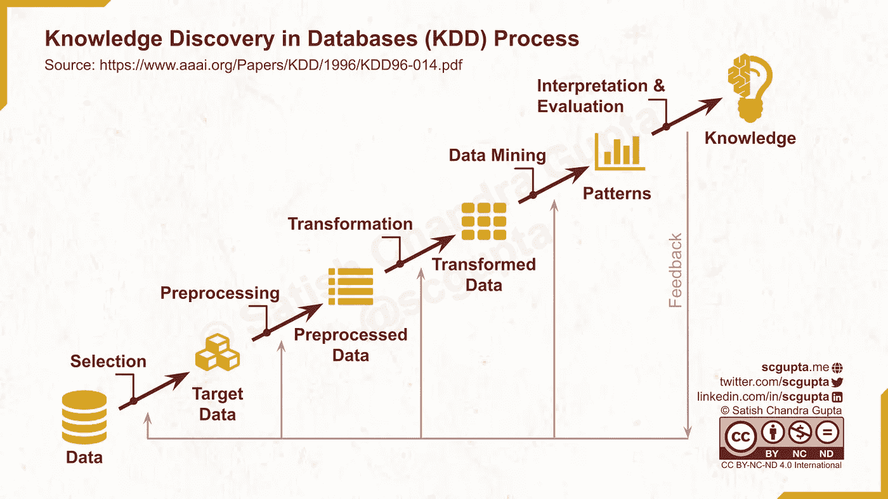
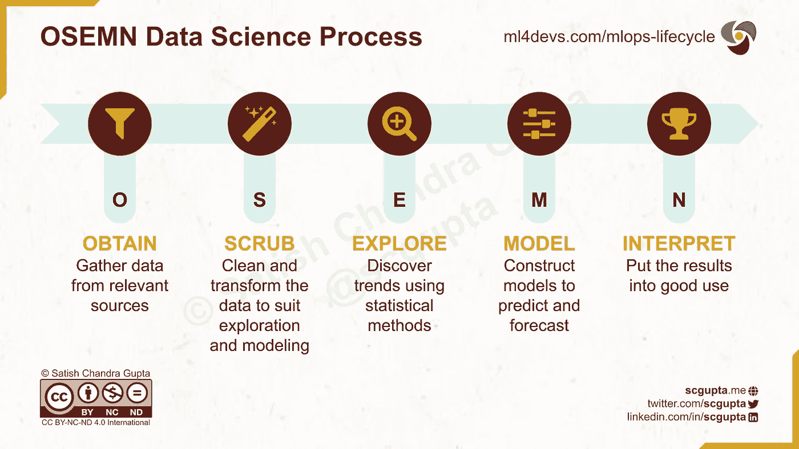
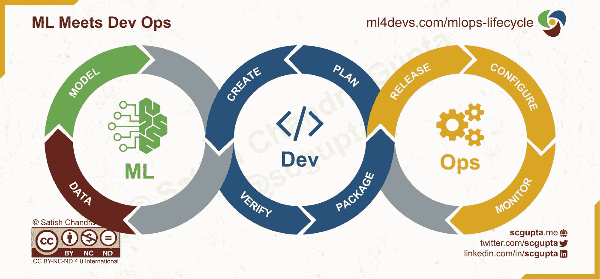
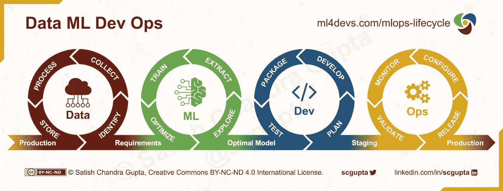
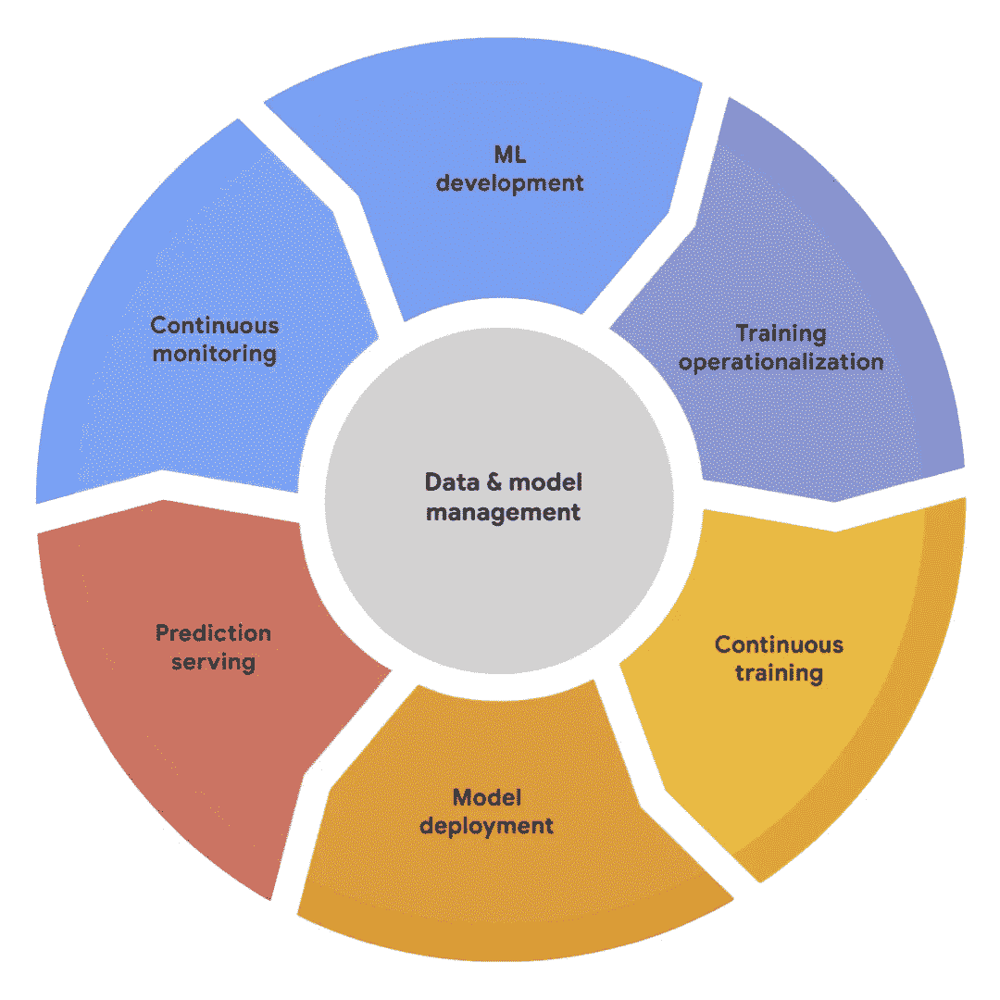
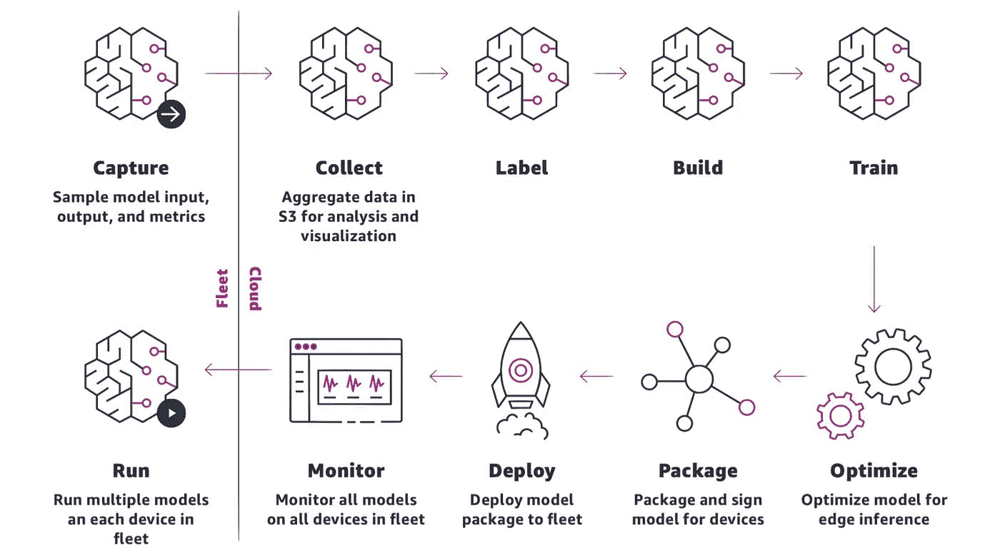
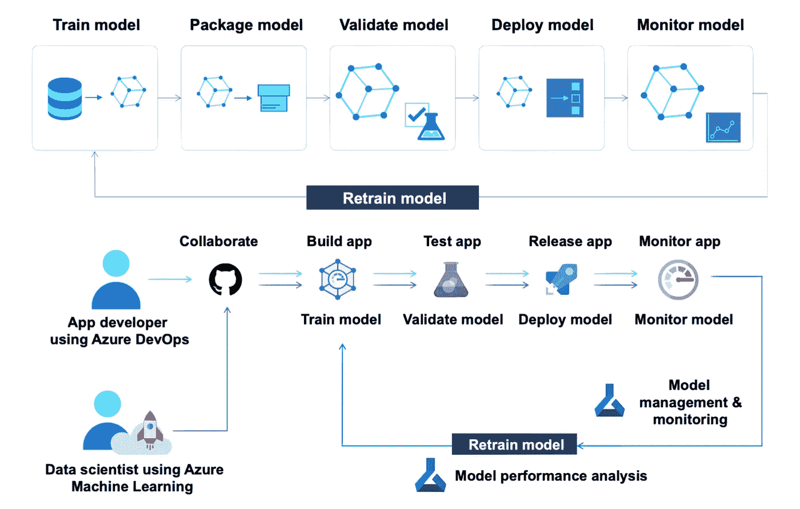

# 机器学习生命周期综述

> 原文：<https://towardsdatascience.com/mlops-machine-learning-lifecycle-b168cc39e52f>

在藏传佛教中，[永恒结](https://en.wikipedia.org/wiki/Endless_knot)象征着生、死、再生的无尽循环，也象征着智慧和方法的结合，以及万物的最终统一。图片来源:[维基共享资源](https://commons.wikimedia.org/wiki/File:Endlessknot.svg)

## MLOps

## ML 生命周期从资源受限的批量数据挖掘到云规模的 MLOps 的演变

一年多来，每个人都在谈论 MLOps。我四处寻找生命周期和过程是如何发展的。

从数据中寻求洞察力的学科已经存在了 25 年。当时，它被称为数据挖掘。在这篇文章中，我介绍了 ML 生命周期过程的概况，并以我对它的看法作为结束。所以如果你很着急，跳到最后一节找[TL；博士](#3cff)。

数据挖掘/科学的主要步骤大致保持不变:

1.  **了解**领域或业务问题
2.  从各种来源收集所需的数据
3.  整理数据，清理并贴上标签
4.  **转换**数据，协调数据，塑造数据
5.  **探索**并可视化数据
6.  **训练**一个模型，验证它，并调整超参数
7.  **使用**或部署模型

但是数据、处理和应用程序的性质已经发生了显著变化:

*   **规模:**分析的数据量增加了流形。
*   广泛使用: ML 驱动的应用程序是我们日常生活的一部分，我们非常依赖它们。
*   **批处理与在线:**这些模型在批处理模式中被更早地使用，以获得洞察力并指导业务决策。现在，更多的模型被用于大规模的推理。

演变可以大致分为 3 个时代(时间线重叠):

*   **批处理时代:** ETL 管道将数据从运营系统带到数据仓库和数据集市，之后进行数据挖掘。
*   **大数据时代:**数据对于当时的仓库来说变得太大了。数据在数据湖中流动，而数据湖经常变成沼泽。只有少数组织部署了在线模型。
*   **MLOps 时代:**让每个人都可以轻松的持续部署线上模型。

## 总有机碳

*   [批量时代](#c7f5)
    - [KDD:数据库中的知识发现【KDD】](#8a09)
    -[CRISP-DM:数据挖掘的跨行业标准流程](#d694)
    - [SEMMA:采样、探索、修改、建模、评估](#b189)
*   [大数据时代](#8b61)
    - [OSEMN:获取、擦洗、探索、模型解读](#d4f3)
    - [TDSP:微软团队数据科学过程生命周期](#7ca0)
*   [MLOps 时代](#dbb4)
    - [ML 遇上 devo PS](#47f8)
    -[Data-ML-Dev-Ops 循环](#174f)
    - [谷歌云](#43a3)
    - [亚马逊 Web 服务](#91ef)
    - [微软 Azure](#fb03)
*   [我对 ML 生命周期的看法](#3cff)
    - [模型开发循环](#4d7a)-
    -[将所有这些放在一起](#7e6c)
*   [总结](#4f6b)

# 批量时代

你可以称之为古代。互联网仍处于萌芽阶段。大多数企业应用程序批量生成和处理数据。

应用程序和数据分散在组织的各个部门。面临的挑战是将所有这些整合在一起，使整体大于部分之和。

数据建模“写模式”非常重要。批处理 ETL 数据管道将数据带到一个集中的数据仓库。它被聚合并存储在数据集市中，每个数据集市都针对特定的业务线、部门或主题领域。

数据不是很大。具有面向列的索引的 RDBMS 很方便，OLAP 立方体统治了时代。

数据挖掘主要是一种幕后操作。它的作用是提取商业决策所需的洞察力。所以当时的过程反映了这种数据挖掘的批处理模式。

## KDD:数据库中的知识发现

从数据中提取洞察力先于大数据。KDD 过程([知识发现和数据挖掘:走向统一的框架](https://www.aaai.org/Papers/KDD/1996/KDD96-014.pdf))。艾尔。，1996)是最早定义数据库中数据挖掘框架的人之一。 [KDD 流程](https://en.wikipedia.org/wiki/Data_mining#Process)有 5 个阶段，有反馈:

1.  **选择:**选择数据集、变量子集或数据样本
2.  **预处理:**清洗数据，处理缺失值等。
3.  **变换:**特征选择和维度投影，减少有效变量数。
4.  **数据挖掘:**应用特定的挖掘方法，例如汇总、分类、回归、聚类。
5.  **解释&评估:**提取模式/模型，将其与数据可视化一起报告。

现代的[数据管道](https://www.ml4devs.com/articles/scalable-efficient-big-data-analytics-machine-learning-pipeline-architecture-on-cloud/)有着几乎相同的步骤。

数据库中的知识发现(KDD)过程。图片由作者提供。

## CRISP-DM:数据挖掘的跨行业标准过程

然后出现了 CRISP-DM 过程([CRISP-DM 模型:数据挖掘的新蓝图](https://mineracaodedados.files.wordpress.com/2012/04/the-crisp-dm-model-the-new-blueprint-for-data-mining-shearer-colin.pdf)，由 Colin Shearer 于 2000 年出版)，这一过程直到今天仍然具有影响力( [CRISP-ML(Q)](https://arxiv.org/pdf/2003.05155.pdf) )。它描述了“数据分析师”应该如何从业务需求出发，挖掘数据，并“部署”模型。它将数据挖掘过程分为六个主要阶段:

1.  **商业理解:**确定商业目标。评估资源、需求、限制、风险和意外情况。定义数据挖掘目标并制定项目计划。
2.  **数据理解:**收集初始数据，发掘数据，验证数据质量。
3.  **数据准备:**选择并清洗数据。添加派生属性和生成的记录。合并数据，并根据所需的模式对其进行整形。
4.  **建模:**建立模型，并评估其质量。
5.  **评估:**评审模型的构建，以确保它实现了既定的业务目标。
6.  **部署:**生成报告，或者在整个企业中实现可重复的数据挖掘过程。计划数据挖掘结果的监控，以及数据计时过程的维护。

“部署”是它领先于时代的地方。没有办法将模型部署为推理功能。说明(这里的客户是指分析师的客户，即业务组织/经理):

> 获得的知识必须以客户可以使用的方式组织和呈现，这通常涉及在组织的决策过程中应用“实时”模型，如网页的实时个性化或营销数据库的重复评分。
> 
> 根据需求的不同，部署阶段可以简单到生成一个报告，也可以复杂到在整个企业中实现一个可重复的数据挖掘过程。尽管执行部署步骤的通常是客户，而不是数据分析师，但是让客户预先了解为了实际利用创建的模型必须采取什么行动是很重要的。

CRISP-DM 流程。图片由作者提供。

## SEMMA:采样、探索、修改、建模和评估

[SEMMA](https://en.wikipedia.org/wiki/SEMMA) 代表取样、探索、修改、建模和评估。它是由 SAS Institute 开发的一系列顺序步骤，用于指导数据挖掘应用程序的实施。

1.  **采样:**采样并选择数据进行建模。
2.  **探索:**可视化数据，以发现数据变量之间预期的和未预期的关系，并识别异常。
3.  **修改:**选择并转换数据变量，为建模准备数据。
4.  **模型:**应用各种建模技术准备数据。
5.  **评估:**评估和比较模型的有效性。

SEMMA 阶段似乎介于 KDD 和 CRISP-DM 之间。

# 大数据时代

数据有一种不可思议的能力，超越了任何存储和处理技术。大数据到来了，而数据仓库不足以处理企业产生的大量数据。因此，我们发明了数据湖(blobs repository)来存储任何规模的原始数据文件。这导致了从“写模式”到“读模式”的转变。

很快，每个人都开始以他们喜欢的格式/模式将他们喜欢的任何数据转储到数据湖中。数据湖变成了数据沼泽。数据的丰富与可用数据的稀缺并存。数据清理成了一件事。

你可以称之为中世纪。数据分析和商业智能的规模不断扩大。[数据科学家成为最性感的工作](https://hbr.org/2012/10/data-scientist-the-sexiest-job-of-the-21st-century)。

数据收集和管道是自动化的，并且基本上每天都在运行。通常，数据分析仪表板会在实时加入批处理和流数据处理时进行更新。但是，大多数组织以批处理模式使用预测模型来指导他们的业务决策和产品，只有少数组织在生产中部署 ML 模型来进行在线实时推理。

生命周期和流程经过调整，包括数据管道、模型训练、验证，甚至(手动)部署的明确步骤。

## OSEMN:**O**b ain， **S** crub， **E** xplore， **M** odel，I **N** terpret

希拉里·梅森和克里斯·维金斯在“[数据科学的分类学](https://web.archive.org/web/20210128112233/http://www.dataists.com/2010/09/a-taxonomy-of-data-science/)”博文(2010 年 9 月 25 日)中描述了 OSEMN 过程。它有 5 个步骤:**O**b 获取， **S** crub， **E** xplore， **M** odel，I **N** 企业。

1.  **获取**:点击不缩放。
    抓取或使用 API 自动收集数据。
2.  **擦洗**:这个世界是个乱七八糟的地方。除非你清理和规范化数据，否则你的模型也会很乱。
3.  **探索:**看可以看到很多。
    这就是我们在探索性数据分析(EDA)中所做的事情。
4.  **车型:**总是不好，有时候很丑。
    对选择的损失函数进行优化，通过交叉验证选出最佳的。
5.  **解读:** [计算的目的是洞察，不是数字](https://en.wikipedia.org/wiki/Richard_Hamming)。与算术不同，统计结果需要细致入微的解释。

这个博客现在已经不存在了，但是你可以在网络档案上阅读它。如你所见，它仍然非常像 KDD/克里斯普-DM，但对步骤的解释反映了网络规模的大数据现实。

OSEMN 数据科学过程。图片由作者提供。

## TDSP:微软团队数据科学流程生命周期

微软的[团队数据科学流程(TDSP)生命周期](https://docs.microsoft.com/en-us/azure/machine-learning/team-data-science-process/overview)有四个阶段:

1.  商业理解
2.  数据获取和理解
3.  建模
4.  部署

“数据获取和理解”和“建模”阶段被进一步分解为更详细的步骤。它被设想为一个瀑布模型，以客户接受为结束，但不需要太多的想象力就可以扩展到交互。

这几乎是大多数公司目前有意或无意遵循的。

微软团队数据科学流程(TDSP)生命周期。图片由作者提供。

在 [ICSE-SEIP 2019 年会议](https://ieeexplore.ieee.org/document/8804457)上的一篇论文中，[微软研究院](https://www.microsoft.com/research/uploads/prod/2019/03/amershi-icse-2019_Software_Engineering_for_Machine_Learning.pdf)的 Saleema Amershi 等人描述了机器学习工作流程的 9 个阶段，这与 TDSP 不同:

> 一些阶段是面向数据的(例如，收集、清理和标记)，而其他阶段是面向模型的(例如，模型需求、特征工程、培训、评估、部署和监控)。工作流程中有许多反馈循环。较大的反馈箭头表示模型评估和监控可能会返回到前面的任何阶段。较小的反馈箭头示出了模型训练可以循环回到特征工程(例如，在表示学习中)。

图片来源:[微软研究院 Saleema Amershi 等人的 ML 工作流](https://www.microsoft.com/research/uploads/prod/2019/03/amershi-icse-2019_Software_Engineering_for_Machine_Learning.pdf)

# MLOps 时代

DevOps 的崛起是现代的特征。当组织定期在生产中部署 ML 模型作为其软件应用程序/产品的一部分时，他们需要一个符合持续集成和持续交付(CI/CD)的 DevOps 最佳实践的数据科学流程。这就是助长 MLOps 炒作的原因。

大多数公司还没有做到这一点，而且我敢说目前需要它。目前，只有 FAANG 这样的大公司需要每小时部署数千种型号，为数百万最终用户提供服务。但是随着 ML 渗透到更多的应用中，公司将开始采用一个持续培训、集成和交付 ML 模型的过程。

## ML 遇到 DevOps: 3 个循环

将 ML 融入 DevOps 的一个显而易见的方法是，通过将 ML 添加到 DevOps 无限循环中，并调整 Dev 和 Ops 以适应数据科学，来制作 [MLOps 循环](https://blogs.nvidia.com/blog/2020/09/03/what-is-mlops/)。

注意这个循环是如何将数据和模型作为表征数据处理和模型构建的单个步骤的。另一方面，到目前为止讨论的过程只精确地处理了*和*这两个步骤。在我看来，Ops 在流程中的主导地位是一种倒退。

ML-DevOps 循环。图片由作者提供。

也有其他三环 MLOps 循环的尝试。例如，下面列出了 3 个主要阶段[。迭代增量 MLOps 过程](https://ml-ops.org/content/mlops-principles)有三个主要阶段(仍然是粗略的 IMO):

图片来源:ml-ops.org[迭代-增量 MLOps 过程](https://ml-ops.org/content/mlops-principles)

## 数据-ML-开发-操作循环

Danny Farah 的一篇博客文章描述了 MLOps 生命周期的 [4 个循环，数据、ML、Dev 和 Ops](https://medium.com/slalom-data-ai/the-modern-mlops-blueprint-c8322af69d21) 各一个。我喜欢它有两个原因:

*   它保留了数据和 ML 步骤的细节
*   感觉更熟悉 w . r . t . devo PS 无限循环。

和 DevOps 差不多，但感觉还是不一样。这是一个错过的将开发人员、数据工程师和数据科学家聚集在一起的机会。我提高 ML 项目成功率的 3 个经验是[巩固所有权，早期整合，经常迭代](https://www.ml4devs.com/newsletter/003-agile-data-science/)。重要的是要有一个单一的生命周期过程，为所有 3 个生命周期以不同的节奏执行提供灵活性。对所有利益相关者的整体可见性减少了意外，从而提高了成功率。

数据-ML-开发-操作循环。图片由作者提供。

## 谷歌云

如果不讨论拥有大量 ML 服务堆栈的三大云提供商，关于 MLOps 的讨论就不完整。

Google 凭借 [Vertex AI](https://cloud.google.com/vertex-ai) MLOps 平台，可以说是最早也是最大的机器学习商店。它在 2021 年 5 月发布了一份名为《MLOps 从业者指南》的白皮书。我引用白皮书中的 MLOps 生命周期部分，该部分描述了以下部分:

*   **ML 开发:**试验和开发一个健壮的、可重复的模型训练程序(训练管道代码)，它由从数据准备和转换到模型训练和评估的多个任务组成。
*   **培训操作化:**自动化打包、测试和部署可重复且可靠的培训管道的过程。
*   **连续训练:**响应于新数据、代码变化或按时间表重复执行训练管道，潜在地具有新的训练设置。
*   **模型部署:**将模型打包、测试并部署到服务环境中，用于在线实验和产品服务。
*   **预测服务:**服务于部署在生产中用于推理的模型。
*   **持续监控:**监控已部署模型的有效性和效率。
*   **数据和模型管理:**一个中央的、横切功能，用于治理 ML 工件，以支持可审计性、可追溯性和遵从性

图片来源:[谷歌 MLOps 白皮书](https://cloud.google.com/resources/mlops-whitepaper)

## 亚马逊网络服务

亚马逊是第一个提供端到端 MLOps 平台的公司: [SageMaker](https://aws.amazon.com/sagemaker/) 。它在 2022 年 6 月发布了白皮书“ [MLOps:数据、代码、
和基础设施的新兴趋势，AWS 白皮书](https://startup-resources.awscloud.com/campaign-assets-machine-learning/mlops-emerging-trends-in-data-code-and-infrastructure)”，定义了更简单的生命周期。如此简单，不言自明。它看起来更像 KDD 和克里斯普-DM 而不是 DevOps 循环。

来源:[亚马逊 MLOps 白皮书](https://startup-resources.awscloud.com/campaign-assets-machine-learning/mlops-emerging-trends-in-data-code-and-infrastructure)

## 微软 Azure

微软还在 2021 年 8 月发布了一份 MLOps 白皮书“使用 Azure 机器学习的 MLOps”，定义了 ML 生命周期和 MLOps 工作流。它类似于 AWS:简单明了。

来源:[微软 MLOps 白皮书](https://azure.microsoft.com/en-us/resources/mlops-with-azureml/)

# 我对 ML 生命周期的看法

这篇文章比我想象的要长得多。所以谢谢你耐心看完。如果这里跳了 TL；博士，那么也谢谢你的关心阅读我的采取。

一、MLOps 时代 ML 生命周期的关键特征是什么？

*   **进化，而非革命。**对于目前一直关注 CRISP-DM、OSEMN 或 TDSP 的数据科学家来说，这应该很熟悉。跟随 DevOps 无限循环的工程师也应该感觉很熟悉。
*   **针对召回而非精度进行优化。易于记忆的流程更容易被遵循，并成为团队词汇的一部分。比如 DevOps 无限循环就不精确。每一步都有几个隐式的返回箭头指向前面的步骤。并不是测试之后的一切都会导致发布。失败可以追溯到代码甚至计划步骤。**
*   **便于将 ML 模型投入生产。**它应该提高开发人员、数据科学家和数据工程师团队的可见性和协作，特别是我的哲学[巩固所有权、早期集成和经常迭代](https://www.ml4devs.com/newsletter/003-agile-data-science/)。
*   **灵活多变。它应该允许团队的部分成员选择他们的节奏。数据科学和软件开发本质上是不同的。数据科学家不可能每天都产生增量结果。生命周期和过程的目标是可见性和内聚性，而不是三足赛跑。**

## 模型开发循环

如果您忽略了部署，模型开发就像 DevOps 循环一样有它的无限循环。

模型开发和 DevOp 无限循环。图片由作者提供。

想想 CRISP-DM 塑造成一个无限循环。模型开发循环中的步骤是:

*   用 ML 术语表述一个商业问题。
*   **从内部应用程序和外部来源收集必要的数据。**
*   **策展**数据。清理它，删除重复项，填充缺失值，标记它，等等。，最后编目存储。
*   **转换**数据。计算附加特征、改变结构等。
*   **验证**数据。实施质量检查、日志数据分发等。
*   **探索**数据。探索性数据分析、特征工程等。很可能会导致添加更多的转换和数据验证检查。
*   **培养**一个模特。运行实验、比较模型性能、调整超参数等。
*   根据业务目标评估模型特征。任何反馈都可能导致对 ML 问题的不同调整和表述。

## 把所有的放在一起

数据科学和软件开发都是为商业目标服务的。在 ML 辅助的应用中，模型设计必须注意它将如何影响用户体验和生产环境的约束。同样，软件设计必须包括不显眼地收集对模型改进至关重要的用户反馈。

在 ML 辅助产品中，模型设计和软件设计有着共生的关系。产品设计，计划步骤，必须整体考虑这两个方面，这是连接这两个循环的统一步骤。

MLOps 生命周期:数据、ML、开发、运营是一个永恒的结。图片由作者提供。

单个 [MLOps 生命周期](https://www.ml4devs.com/articles/mlops-machine-learning-life-cycle/)循环让所有成员可见，而不是开发人员将模型视为数据科学家以某种方式训练和折腾的黑匣子，以及数据科学家开发不服务于生产中预期业务目标的模型。

Data、ML、Data-ML 和 DevOps 循环可以不同的节奏运行。我总是试图首先用基于规则的或虚拟的模型构建一个端到端的应用程序，完全切断 Data-ML 循环。它作为基线工作，帮助收集数据，并为数据科学家提供一个环境，以了解他们的模型将如何被使用。

# 摘要

本文描述了 ML 生命周期在数据仓库、大数据湖和 MLOps 时代的演变。它还解释了如何通过加入模型开发和 DevOps 循环来修改它，以及这样做的好处。

# 参考

*   [Usama Fayyad、Gregory Piatetsky-Shapiro 和 Padhraic Smyth 在《KDD 96:第二届知识发现和数据挖掘国际会议论文集》第 82-88 页上发表的文章](https://www.aaai.org/Papers/KDD/1996/KDD96-014.pdf)。
*   [CSP-DM 模型:数据挖掘的新蓝图](https://www.ml4devs.com/pdf/papers/the-crisp-dm-model-the-new-blueprint-for-data-mining-shearer-colin.pdf)，作者 Colin Shearer，数据仓库杂志，第 5 卷，第 4 期，第 13–22 页，2000 年
*   [SEMMA:取样、探索、修改、建模和评估](https://en.wikipedia.org/wiki/SEMMA)。
*   希拉里·梅森和克里斯·维金斯于 2010 年 9 月发表的《数据科学分类》。
*   微软[团队数据科学流程(TDSP)](https://docs.microsoft.com/en-us/azure/architecture/data-science-process/overview) 生命周期。
*   [机器学习的软件工程:案例研究](https://doi.org/10.1109/ICSE-SEIP.2019.00042)，Saleema Amershi 等人，ICSE-SEIP '19:第 41 届软件工程国际会议论文集:实践中的软件工程，2019 年 5 月。( [PDF](https://www.microsoft.com/en-us/research/uploads/prod/2019/03/amershi-icse-2019_Software_Engineering_for_Machine_Learning.pdf) )
*   [什么是 MLOps？里克·梅里特于 2020 年 9 月 3 日在英伟达博客上发表。](https://blogs.nvidia.com/blog/2020/09/03/what-is-mlops/)
*   ml-ops.org[MLOps 原则](https://ml-ops.org/content/mlops-principles)，2022 年 9 月 8 日检索。
*   [Danny Farah，2020 年 8 月 24 日，现代 MLOps 蓝图](https://medium.com/slalom-data-ai/the-modern-mlops-blueprint-c8322af69d21)。
*   MLOps 从业者指南:机器学习的连续交付和自动化框架。谷歌云白皮书。2021 年 5 月。
*   [m lops:AWS 上机器学习的连续交付](https://d1.awsstatic.com/whitepapers/mlops-continuous-delivery-machine-learning-on-aws.pdf)。AWS 白皮书。2020 年 12 月
*   [MLOps:数据、代码和基础设施的新兴趋势。](https://startup-resources.awscloud.com/campaign-assets-machine-learning/mlops-emerging-trends-in-data-code-and-infrastructure) AWS 白皮书。2022 年 6 月。
*   [采用 Azure 机器学习的 MLOps】。微软白皮书。2021 年 8 月。](https://azure.microsoft.com/resources/mlops-with-azureml/)

**如果您喜欢，请:**

*原载于*<https://www.ml4devs.com/articles/mlops-survey-of-machine-learning-life-cycle/>**。**