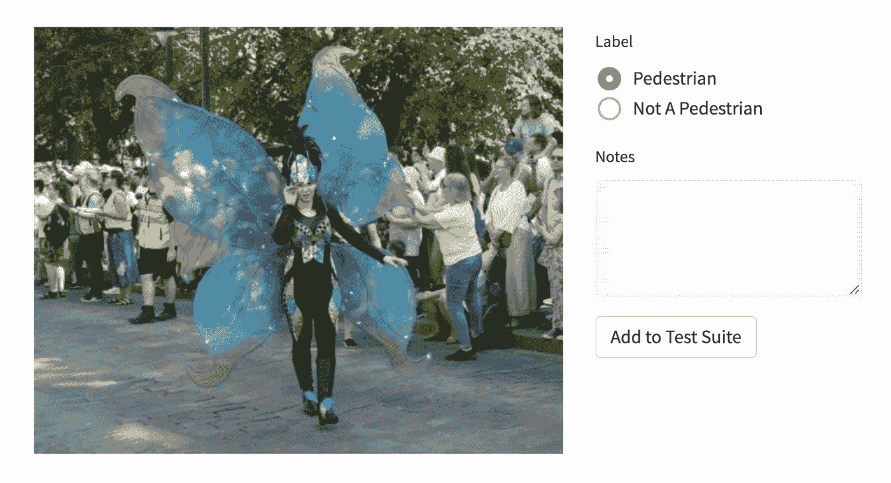
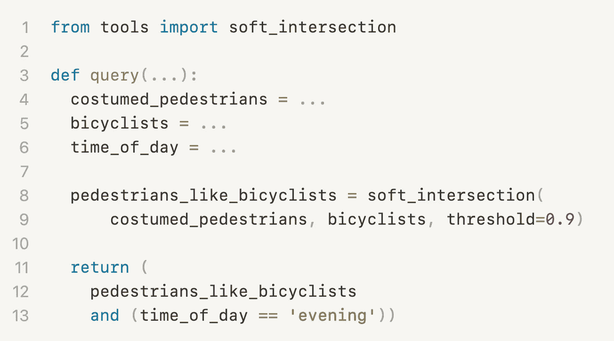
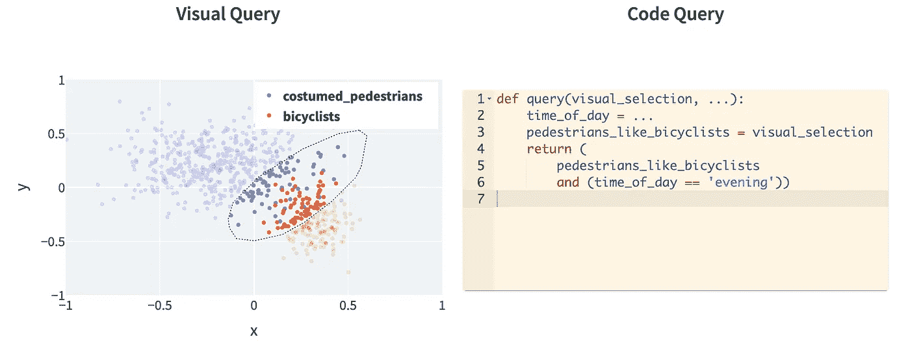
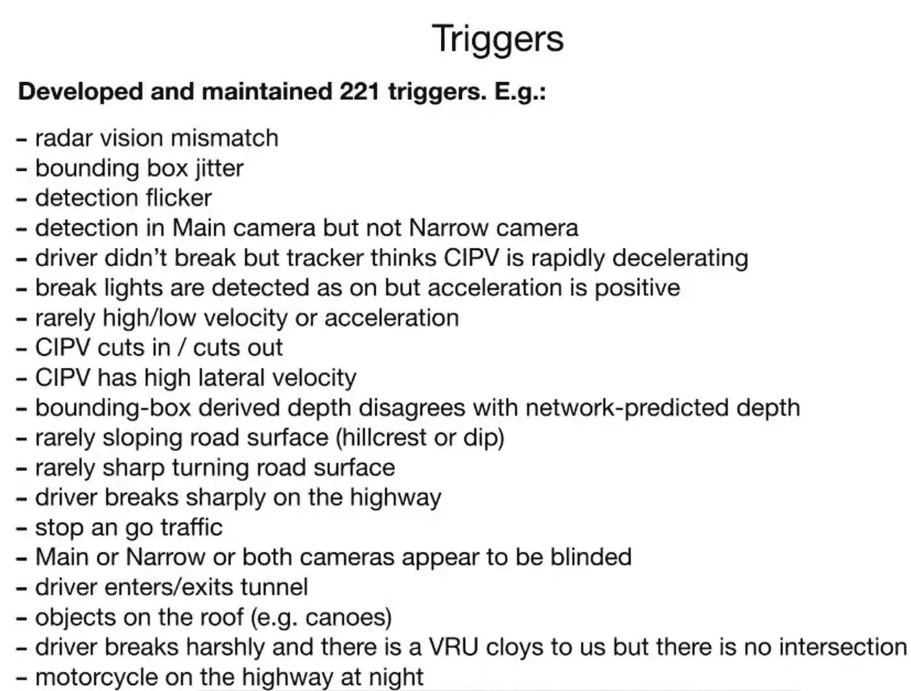

# 模型测试对于构建领域知识至关重要

> 原文：<https://towardsdatascience.com/model-tests-are-critical-for-building-domain-knowledge-8d5fde2660d8>

## 测试可以防止退化。但是测试最重要的产品是领域知识和强大的能力。


嵌入空间中两个分布之间边界的选择。图片作者。

在机器学习中，测试是一项关键但经常被忽视的实践。在没有测试的情况下建立一个机器学习系统很可能在最糟糕的时候产生糟糕的结果——当所有的盒子都被检查时，当模型被投入生产时，当真实的人受到影响时。

这是一个典型的(真实的)机器学习测试故事。但是这个故事只有大棒没有胡萝卜。它完全忽略了测试数据团队取得进步的最重要的产品:领域知识。

随着机器学习项目从开始阶段走向成熟，它们的复杂性也在增加。开发过程中的每一次迭代都会产生新的见解，触发诸如数据清理、模型调整或更多标记之类的活动。这些行为可能是净增值，但系统中的小口袋会出现倒退，有时是看不见的。测试可以防止这些退化。

测试经常给人一种乏味的感觉，这是很好的实践，但并不总是必要的。围绕测试的经典问题出现了，比如测试什么是必要的，这些测试应该有多复杂。但是将测试视为领域知识的构建和系统化，显示了测试超越棘轮以防止倒退的力量。

将测试与其他知识构建活动(如错误分析和数据注释)结合起来，可以鼓励科学进步和良好的工程设计。注释、错误分析和测试可以被交叉利用，从而产生复合收益以获得更好的系统性能和对建模内容的更深入的理解。自动驾驶汽车为理解这一点提供了一个有趣的视角，特斯拉自动驾驶部门的方法论展示了这一视角的力量。

通过测试积累知识需要平台支持。平台团队必须在测试和其他活动中实现无缝体验。MLOps 领域的工具构建者应该在这方面支持他们，将集成工作放在第 n 个特性之上。如果我们关心平台用户的长期价值，仅仅解决工作流的一小部分是不够的。

# 测试是知识的积累

模型测试是一种断言，即模型应该在某些场景中以某种方式运行。从技术上讲，场景是由模型输入指定的，可以是一个样本，也可以是多个样本。

在你进行测试之前，你可能甚至不知道一个场景的存在。以一个自动驾驶汽车模型为例，它可以检测视野中的行人。你可能不会想到行人会有翅膀、不正常的长腿或闪闪发光的衣服，直到在有许多盛装行人的游行中进行路试。


一个非常令人困惑的行人的例子。来源:[维基共享资源](https://commons.wikimedia.org/wiki/File:Butterfly_samba_dancer_from_Samba_Tropical_at_Helsinki_Samba_Carnaval_2019.jpg)。执照: [CC BY-SA 4.0](https://creativecommons.org/licenses/by-sa/4.0/deed.en)

(自动驾驶汽车是测试对人工智能安全有多重要的一个很好的例子。)

了解这些奇怪的案例是通过经验，或隐性知识。为了利用隐性知识，需要将其编码到系统中。

知识的隐式编码是最普遍的，因为它很方便。方程中一个奇怪的无法解释的项，或者一个碰巧稳定模型训练的“神奇”配置，都是隐性知识的例子。他们的作者可能知道他们在做什么，但没有人知道。这就产生了所谓的部落知识。

隐式编码不仅对协作有害，而且还阻碍了技术固有的累积杠杆作用。显式编码使其他人能够学习和建立该知识。在神奇的训练配置示例中，我们可以将训练配置存储在一个数据库中，其中包含链接到训练结果的作者注释。队友们以后可以在许多实验中查询配置，以找到那些效果最好的。通过组织和链接元数据，学习和获得新的见解成为可能。

在一些 python 文件中编写`test_for_winged_pedestrian()`测试函数错过了一个复合知识收获的重要机会。有翅膀的步行者，如果在步行者之下的概念分类中被适当地组织，产生跨越测试之外的多个工作流程步骤的杠杆作用。这种利用通过构建更高级别的数据查询来体现。盛装行人是一个首先必须与其他概念联系在一起的概念:

```
Road obstruction
├── Stationary
│   ├── Traffic cone
│   └── ...
└── Non-stationary
    ├── Pedestrian
    │   ├── Average pedestrian
    │   ├── Pedestrian with walking aid
    │   └── Costumed pedestrians
    ├── Bicyclist
    └── ...
```

现在想象一种情况，其中“行人”作为模型的目标标签可能在性能上遭受损失。穿着服装的行人以及手持拐杖或步行者、骑摩托车者和其他移动障碍物的行人可能是在查询中使用的有价值的概念，也许是为了理解行人检测模型可能失败的原因，或者是为了进一步标注而显示未标注的示例。实现这一点的第一步是认识到测试用例、标记和错误分析是同一件事情的不同方面:构建领域知识。

# 工作流程中的测试

在我们的例子中，一名技术人员在进行道路测试时，可能会注意到笔记本电脑屏幕上的错误。或者科学家在模型上做错误分析时可能会注意到。标注者可能会在标记来自路测的新数据时发现它。它甚至可能在数据准备管道中的不同测试失败时出现。


机器学习开发工作流程。图片作者。

有许多工具可以处理每个工作流程步骤，但是这些工具通常不能很好地集成。预期体验没有考虑之前和之后的步骤，这会导致摩擦并抑制整体效率。一个好的平台将融合不同步骤之间的接缝，在开发人员工作时为他们提供统一的体验。

如果在注释中发现一个数据点的问题，想象一下直接在注释工具中放置一个“添加到测试套件”的按钮的能力。



一个分类标签界面的简单模型。“添加到测试套件”按钮使得向测试套件添加例子变得容易。图片作者。

如果问题出现在数据收集或数据准备管道中，开发人员应该准备好任何东西，从 pytest 到像[Great expects](https://greatexpectations.io/)这样的成熟工具，以便快速添加测试用例。


测试函数示例。像这样的代码将与管道代码一起存储在 git repo 中。注意将测试与概念联系起来的装饰器。图片作者。

这些接口使得开发人员可以很容易地添加测试，降低了模型回归的可能性，并为知识共享奠定了基础。

# 案例研究:特斯拉自动驾驶仪

Andrej Karpathy 描述了内部平台上的工作流和功能，实现了自动驾驶汽车的开发，这在很大程度上依赖于在同一视图中查看标签、测试和错误分析。


“Operation Vacation”的描述，特斯拉自动驾驶团队通过标记和测试来收集和改进他们的数据的过程。摘自 Andrej Karpathy 的 2020 年演讲，[“特斯拉全自动驾驶的人工智能”](https://youtu.be/hx7BXih7zx8?t=967)。图片作者。

对于一个新的对象检测任务，他们建立了一个图像种子集，并选择一些作为*单元测试*。随着产品和标签团队的迭代，他们改进他们的测试并创建新的测试。该过程的其余部分循环进行，直到测试通过。

正如 Karpathy 提到的，他的团队的北极星目标是“度假行动”——即使整个计算机视觉团队都去度假，自动驾驶任务也应该得到改善。实现该过程意味着该平台由数据模型支持，该数据模型将围绕测试、标记和模型预测的元数据联系在一起。

# 知识积累的复合收益

当测试用例被公式化时，它们也被标记。如果测试场景显著影响性能，可以挖掘类似的样本进行额外的标记。如果标记工具使得添加新的测试用例变得简单，那么我们就有了一个有效的扩展测试场景知识的过程。

当在大量测试场景中考虑这个过程时，这些收益是复合的。如果我们的模型曾经对光照条件敏感，我们可能会有“日光”或“一天中的时间”的概念。基于直觉，我们也可以想象，检测骑自行车的人是检测穿着特殊服装的行人的一个有用的步骤。然后，我们可以为有用的行人检测样本构建查询:



使用 Python 中的高级概念的示例查询。图片作者。

或者想象一个可视化查询组件，使上述查询的一部分更容易构建:



组合查询界面的可视点选择和代码的并排视图。图片作者。

两件事带来了复合收益:消除可用性的缝隙，花时间明确地组织知识。特斯拉自动驾驶团队通过“触发器”的概念来查询客户数据以进行标记，从而展示了这些收益。



特斯拉自动驾驶团队用来获取标签数据的触发器示例。摘自安德烈·卡帕西在 2021 年 CVPR 奥运会上的演讲。图片作者。

开发这些查询需要明确编码的领域知识。一些触发因素需要理解自动驾驶汽车开发中的概念，如雷达和视觉之间的差异或边界框的定义。其他触发器利用现实世界的概念，如刹车灯、道路和构成车顶的东西。许多人同时依赖这两种类型的概念来实现触发器。如果没有这些低级概念的定义，为这些高级概念(触发器)构建查询将是相当具有挑战性的。

# 知识发展平台

跨不同开发活动构建知识需要一个具有统一数据模型的平台。统一是实现领域知识复合收益的关键。

但是由于更基本的原因，建立一个平台是具有挑战性的。所需功能的广度是巨大的，并且不同用例、团队和公司的特性优先级是不同的。MLOps 的开源工具和供应商在一定程度上有所帮助，但最近的情绪[指向了一种分裂的感觉](https://www.mihaileric.com/posts/mlops-is-a-mess/)。平台团队需要争论大量的工具，管理多个供应商，并长时间(有时几年)进行构建，直到他们的努力完全实现。

平台团队有时会在生产培训和部署中优先考虑大型基础设施项目，以尽量缩短上市时间。虽然这可能是一个合理的短期策略，但它有可能朝着次优的方向发展。

平台团队也可以从思考知识构建中受益。机器学习系统的最大收获往往可以追溯到对问题的更好理解。新知识是通过迭代发现的，所以一个平台的中心目标应该是端到端的效率。只有当开发引擎运行时，工作流中容易摘到的果实才是可见的。平台团队应该通过任何必要的手段来启动这个引擎，以免陷入过早优化的陷阱。这可能会排除强大的基础设施。

首先考虑框架和数据模型意味着可以适当地添加基础设施以获得最大的利用。如果性能问题的根源在于数据或模型误解，那么拥有可扩展的 GPU 计算或亚毫秒级服务延迟是行不通的。

MLOps 工具也可以发挥作用。MLOps 行业的工具构建者倾向于关注开发或部署用例的垂直部分。虽然这降低了产品起步的风险，但长期来看，用户会因为给平台团队施加集成压力而遭受损失。开销是巨大的——每个工具都有自己的语言，通过 UI、API 和数据格式来表达。

从长远来看，易于互操作并努力获得一致体验的工具为他们的客户(平台团队和他们所服务的开发人员)提供了更多的价值。整合正是平台团队必须反复做的工作，排除了有助于公司竞争优势的定制功能。如果工具构建者关心向他们的客户交付长期价值，他们必须优先考虑集成工作，而不是增量特性开发。

在可预见的未来，平台仍将难以构建。但像特斯拉这样的公司建立了世界级的人工智能，因为他们的平台使人工智能开发者能够了解他们的领域，理解他们的模型，并将他们新发现的知识编码到他们的系统中。不管我们在构建人工智能系统中的角色如何，有一点是明确的:知识构建是人工智能发展的核心。乍看起来，测试似乎不重要，但将它理解为构建知识的一流使能器表明，它对人工智能的成功开发至关重要。

觉得这些想法有趣吗？来和我们在 Twitter 上聊天吧！[*@ hoddieot*](https://twitter.com/hoddieot)*[*@ skylar _ b _ Payne*](https://twitter.com/skylar_b_payne)*，或者订阅* [*数据鸿沟*](https://datachasms.substack.com/) *。**