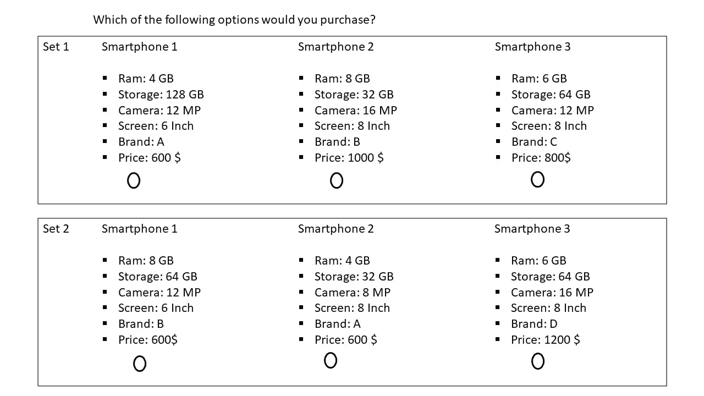
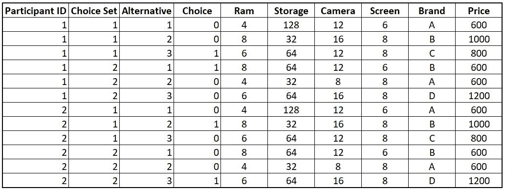
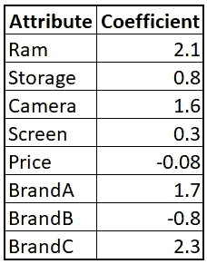

# 消费者决策建模:联合分析

> 原文：<https://towardsdatascience.com/modeling-consumer-decisions-conjoint-analysis-f4eda531ecf6>

# 消费者决策建模:联合分析

## 产品开发的基于选择的联合分析指南


由 [Unsplash](https://unsplash.com/) 上的[原子](https://unsplash.com/@atoms)拍摄的照片

人们花费大量时间对他们购买的一些产品和服务进行决策。事实上，最近的一项研究表明，平均每个人每年要花大约 130 个小时来决定去哪里吃饭。一般来说，消费者通过基于产品提供给他们的效用在产品的各种属性之间做出权衡来做出购买决定。作为营销人员或产品经理，了解消费者如何做出这些权衡以及每个属性提供的效用至关重要。

为了理解属性和效用的概念，让我们考虑购买新智能手机的例子。人们在决定购买时可能会考虑的因素有 RAM、存储容量、相机规格、屏幕尺寸和分辨率、品牌、价格等。这些被考虑的因素被称为属性，消费者从这些属性中的每一个得到一些效用。从每个属性中获得的效用也称为部分价值。每个消费者都是不同的，他们可以从产品的属性中获得不同的效用。例如，摄影爱好者可能会从相机规格属性中获得比 RAM 和存储容量等其他属性更多的效用。相比之下，游戏发烧友将从 RAM、存储容量和屏幕尺寸/分辨率中获得更多的效用。为了开发成功的产品，营销人员/产品经理必须了解其客户群的属性偏好，并量化客户从属性中获得的效用。联合分析是一种统计方法，用于了解属性的相对重要性/偏好，并量化消费者从产品的每个属性中获得的效用。因此，它可以用来模拟消费者在做出购买决定时可能做出的权衡。

在进行联合分析时，我们有两个基本假设:

1.  消费者购买给他们最高总效用(单个属性效用的总和)的产品
2.  消费者遵循补偿性决策过程。简单来说，这意味着产品的一个正面属性可以弥补一个负面属性，即客户愿意做出取舍。

## 市场研究设计

联合分析的第一步是设计一个市场调查研究。本研究的参与者通过[分层随机抽样](https://en.wikipedia.org/wiki/Stratified_sampling)选出，代表产品的人口或目标受众。

让我们再次考虑购买智能手机的例子。(产品团队花费大量时间集思广益产品的属性，并经常组织焦点小组从消费者那里获得更多见解)为了简单起见，让我们假设仅有的属性是 Ram、存储、摄像头、屏幕、品牌和价格。

本研究的问卷设计如下:



问卷样本(图片由作者提供)

研究的参与者被给予多个选择集，并被提示从每个选择集中选择一个选项。(为了简单起见，我只提供了两个随机选择集。在实际的调查中，根据产品属性的数量，参与者会得到 10 到 20 个选择集。这些选择集的设计本身是一项复杂的任务，因此我在本文中不会深入探讨。这些问题以所示的方式设计，以模拟消费者将经历的实际决策过程。每个参与者对每个选项集的回答都被记录下来并进行建模处理。

## 统计模式

记录并处理每个参与者的响应。结果数据集的示例如下所示:



样本响应数据(图片由作者提供)

在创建模型之前，我们需要确保我们正确地编码了连续变量和分类变量。在本例中，我将把除“品牌”之外的所有属性都视为连续属性。然后我们运行一个逻辑回归，选择作为因变量，属性作为自变量。对于这个模型，将截距强制为 0 也是有用的，因为当所有的因变量都为 0 时，技术上产品的效用应该为 0。这可以在 R 中使用以下代码来完成:

```
model <- glm(Choice ~ 0 + Ram + Storage + Camera + Screen + Brand + Price, Data = Data, Family = Binomial)
```

## 模型结果和解释

在我们运行回归之后，我们获得每个属性的系数。这方面的一个例子如下所示:



样本系数表(图片由作者提供)

这些系数可以解释为常规逻辑回归。在这种情况下，我们使用逻辑回归建模的对数优势表示消费者从属性中获得的效用。因此，对于我们的客户来说,“RAM”每增加 1GB，平均会增加 2.1 个单位的效用。同样,“价格”每增加 1 美元，我们客户的平均效用就会减少 0.08 个单位。我们也明白，与品牌‘A’和‘B’相比，客户更看重品牌‘C’。(品牌“D”不包括在系数表中，因为它被作为系数为 0 的参考)

最后，我们可以根据产品的属性来计算产品的总效用和购买概率，如下所示:(这些结果和计算基于我创建的随机数据，而不是实际数据。这可能会使一些结果看起来不合逻辑)


具有给定属性的产品的示例计算(图片由作者提供)

有了模型的结果，我们可以测试产品属性的多个规格，并得出目标客户的总效用和购买概率。这在设计新产品投放市场时特别有用。

## 市场模拟

我们也可以使用这种方法来模拟市场，并估计新产品的市场份额。我们不是对市场调查研究的所有参与者的全部数据进行逻辑回归，而是对每个参与者的回答进行逻辑回归。这给出了产品的总效用和样本中每个参与者的购买概率。由于样本被选择来代表总体，因此样本的结果可以外推至整个总体，以得出估计的市场份额。更复杂的方法，如分层贝叶斯模型，也可以用来达到更有统计学意义的结果。

## 结论

联合分析是了解特定环境下消费者偏好的产品属性的有力方法。它可以用于设计各种产品甚至服务。从专业角度来说，我在一家快餐店用这种方法来了解顾客的食物偏好。它也常用于基于属性的定价。虽然营销决策是艺术和科学的结合，但这种方法是在设计产品或服务时消除主观性和个人偏见的有力工具。不用说，这是一个让每个营销分析师受益的方法。