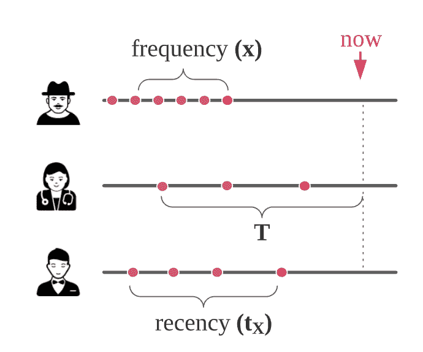
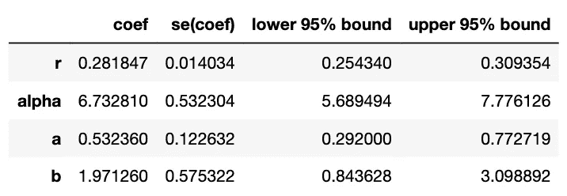
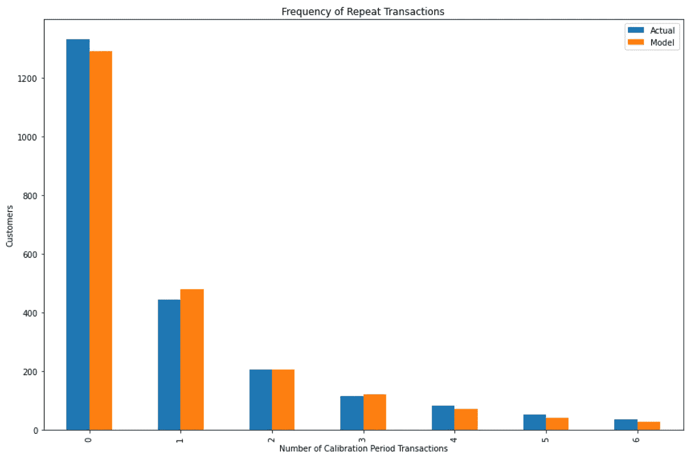
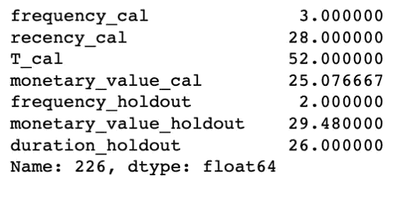
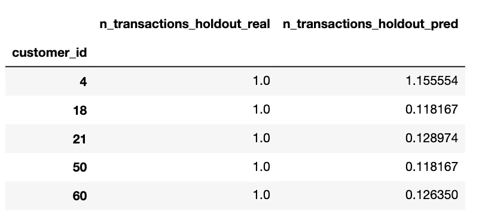
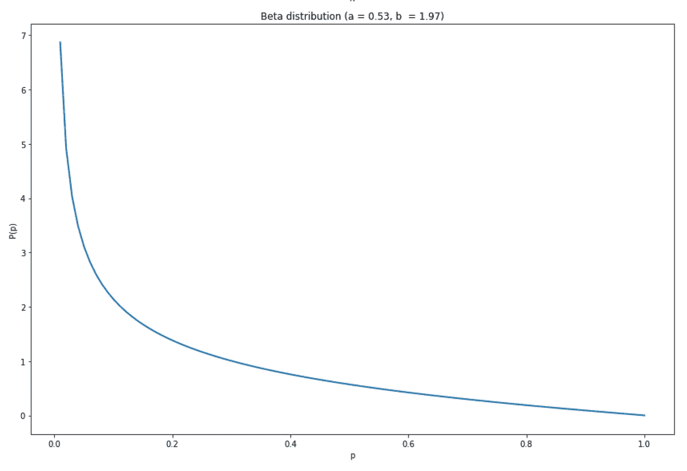
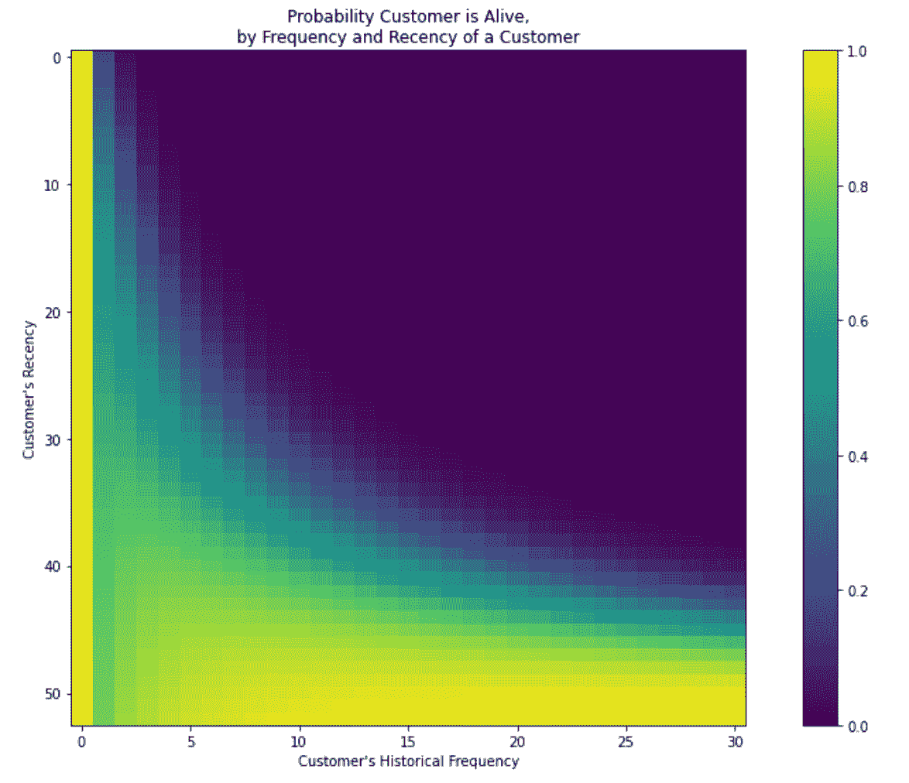
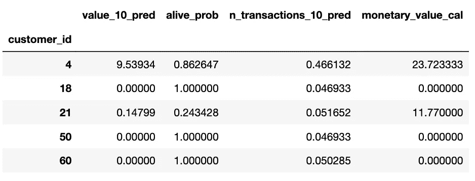
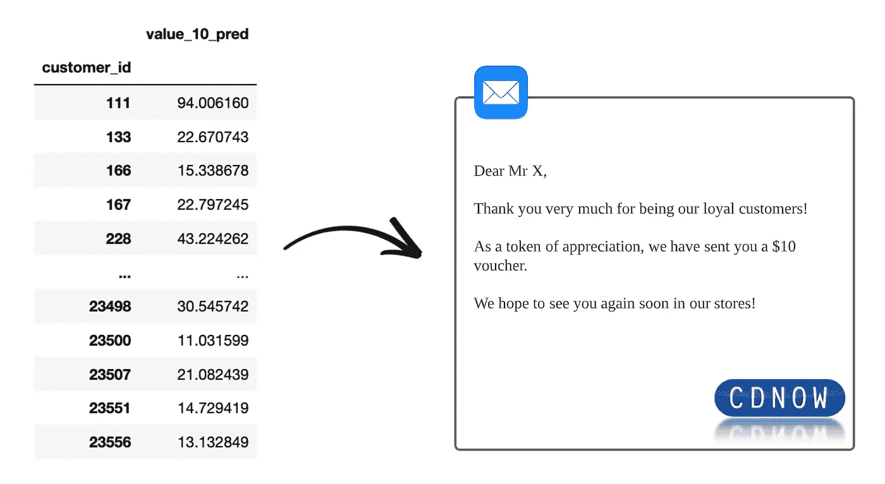

# 用生命周期模拟客户生命周期价值

> 原文：<https://towardsdatascience.com/modeling-customer-lifetime-value-with-lifetimes-71171a35f654>

## 用几行代码评估客户的价值并制定积极的行动

来源: [Unsplash](https://unsplash.com/photos/odxB5oIG_iA)

T**β-几何负二项分布(BG-NBD)模型是一种有影响力的描述客户行为和预测客户终身价值的概率模型(CLV)。**在本系列的[上一篇文章](https://medium.com/towards-data-science/customer-lifetime-value-estimation-via-probabilistic-modeling-d5111cb52dd)中，我们探讨了这个模型的直觉、假设和数学推导。如果你没有看过，我建议你看一看！

> 正如你可能从那篇文章中推断的那样，手动编写所有这些 BG-NBD 方程并不容易。幸运的是，有一个名为 [*的 Python 库可以为我们完成所有繁重的工作。 ***寿命*抽象出 BG-NBD 的内部复杂性，使我们能够专注于从模型中获得洞察力和商业价值。***](https://lifetimes.readthedocs.io/en/latest/)

这个令人敬畏的库是由 [Cam-Davidson Pillon](https://github.com/CamDavidsonPilon) 创建的，他也是《概率编程[*&黑客的贝叶斯方法*](http://camdavidsonpilon.github.io/Probabilistic-Programming-and-Bayesian-Methods-for-Hackers/) 》一书的作者，这是所有贝叶斯爱好者的必读之作。

这篇文章探究了*寿命*的来龙去脉。这是我们的议程:

1.  首先，我们将看看在建模之前数据集需要的必要的表格式。
2.  其次，我们将看到如何使用寿命来训练和评估 BG-NBD 模型。
3.  第三，我们将理解*寿命*促成的各种见解和分析。
4.  最后，我们将讨论几个由*寿命*带来的实际商业应用。

我们开始吧！

# 数据准备

## 数据转换

通常，企业在“交易”表中记录他们的交易。这样的表具有代表单个交易的行和代表交易的不同方面的列，例如涉及的客户、交易的时间戳及其值。

由*生存期*提供了一个示例事务表。这张表记录了 [CDNow](https://en.wikipedia.org/wiki/CDNow) 的交易，这是一家网络时代的公司，销售 CD 和音乐产品。它包含从 1997 年 1 月 1 日至 1998 年 6 月 30 日(共 78 周)期间 2，357 名客户的 6，919 笔交易。我们将在整篇文章中使用它。下面是如何加载它:

**交易**

**在拟合 BG-NBD 模型之前，我们需要首先将该表重组为规范的“RFM”格式。**RFM 格式的表包含代表各个客户的行和以下列:

*   *频率* **，**表示客户重复购买的次数。
*   *最近度*，代表客户最近一次购物的“年龄”。
*   *T* ，代表观察期结束时客户的“年龄”。
*   *monetary_value，*可选列，其中表示给定客户购买的平均值，不包括第一次购买。

作者图片

*寿命*提供了一个实用函数，方便了从“交易”格式到 RFM 格式的转换。

**‘RFM’**

我们解释 RFM 数据帧第一行的方式如下:

*   在观察期内，顾客 4 总共购买了 4 次(因此重复购买了 3 次)。
*   他第一次和最后一次购买的时间跨度是 49 周。
*   他第一次购买和观察期结束之间的时间跨度是 78 周。
*   除了第一笔交易，他的平均交易金额是 23.73 美元。

请注意，当*频率*、*新近度*和*货币值*列的值为零时(例如对于客户 18 ),表示客户在观察期内仅购买了一次。

## 校准-维持分离

> 将表格重新格式化为 RFM 格式时，我们还可以选择执行校准-保持分离，这与我们熟悉的训练-测试分离程序在精神上是相似的。校准-保持分离将我们的事务分成两部分，具体取决于它们是属于*校准期*还是*观察期。*校准期间发生的交易用于训练模型，而观察期发生的交易(交易)用于验证模型。

作者图片

在本例中，我们将校准和观察期分别设置为 52 周和 26 周。下面是我们如何使用*生存期*进行分割:

**'rfm_cal_holdout'**

我们看到，现在每个客户都与用于模型训练的校准功能和用于模型验证的维持(观察期)功能相关联。

# 训练、预测和评估

## 适合的

在*生存期*中，模型拟合遵循熟悉的 *scikit-learn* 步骤，即实例化模型对象(可选地包括超参数设置)并将其拟合到校准(训练)数据:

就这样——两条线，我们就有了一个可用的 BG-NBD 模型！

**你可能还记得从** [**第一篇**](https://medium.com/towards-data-science/customer-lifetime-value-estimation-via-probabilistic-modeling-d5111cb52dd) **开始，一个 BG-NBD 模型是由一个伽玛和一个贝塔分布组成的。**γ分布的参数 *r* 和 *α* 以及β分布的参数 *a* 和 *b* 可通过*访问。拟合模型对象的概要*属性:

拟合模型的参数

在下一节中，我们将从这些参数中获得一些业务见解。

## 通过比较模型生成的人工数据和真实数据来评估模型拟合度

“垃圾进，垃圾出”的格言适用于 BG-NBD 模型:依赖一个不合适的模型会导致灾难性的商业决策。因此，在使用我们的模型进行预测和解释之前，我们应该首先评估模型的性能。

寿命提供了几种评估我们模型的方法。第一个是比较我们的真实校准数据和从 BG-NBD 模型生成的分布中采样的人工数据之间的频率。函数*plot _ period _ transactions*在一行中完成:

该图显示，训练数据中的频率分布与我们拟合的模型人工生成的频率分布基本一致。这表明我们的模型很好地捕捉到了我们假设生成数据的物理过程。

## 做预测

拟合 BG-NBD 模型的主要目的之一是进行预测。在本节中，我们将了解如何生成预测，并随后用于进一步评估模型的性能。

当给定具有特定*频率*、*新近度*和*、*的客户时，拟合的模型对象可以生成两种类型的预测:

1.  他将在未来几个时期购买的数量
2.  他在观察期结束时活跃的概率。

让我们来看一个如何做到这一点的例子。首先，我们将选择一个样本客户，检查他在校准和观察期的*频率*、*新近度*和 *T* :

我们看到，在观察期内，客户进行了 2 + 1 = 3 笔交易(“ *+* 1”来自于将不包括第一笔交易的*重复*交易的数量转换为*总*交易)。

现在，让我们将这个“真实”数字与英国地质调查局-NBD 所做的预测进行比较。以下代码得出了客户在未来 26 周(观察期的长度)内将进行的交易的预期数量:

我们看到预测的事务数(0.76 个事务)低于实际的事务数(3 个事务)。

我们可以类似地预测某个客户在校准期结束/观察期开始时仍然活跃/活着的概率)。

由于顾客*在观察期内确实*进行了一些购买，我们完全确定他*在校准期结束时*是活跃的。因此，0.57 的预测概率是一个低估。

## 实际交易数和预测交易数的比较

在了解了如何预测一个人的交易数量后，我们可以将这个过程扩展到我们的整个客户群。然后，可以将得到的预测与真实的交易数据进行比较，以评估我们模型的准确性。

如果需要更严格的评估，这两列可以采用典型的回归指标，如 RMSE:

# 见解和解释

## 可视化最大似然伽玛和贝塔分布

一旦我们对模型的性能感到满意，我们就可以继续从中获得洞见。

一个好的起点是提取和可视化估计的伽马和贝塔参数。如前一篇文章所述，Gamma 和 Beta 分布具有重要的商业意义。**伽玛分布告诉我们客户群交易率的分布，而贝塔分布反映了停用概率的分布。**

以下代码显示了如何从模型中提取 Gamma 和 Beta 参数，并绘制分布图:

从该图中，我们可以看到伽马分布相对健康，大多数𝜆位于 2 附近。这意味着我们的顾客预计每周购物 2 次。

贝塔分布看起来也很健康，大部分的 p 接近 0。这意味着我们的客户不太可能很快停用。

## 频率/最近/未来购买矩阵

除了所描述的模型拟合评估之外，拟合的模型对象也可以用于一些解释性分析。

例如，我们可以查看它的频率/最近/未来购买矩阵。该矩阵显示了不同的频率-新近组合如何产生不同的未来购买预期数量。

**频率/最近/未来购买矩阵**

正如我们所看到的，我们最好的客户在右下角——这些人最近经常购物，所以我们对他们的回访抱有很高的期望。

相反，我们最不看好的客户在右上角——他们经常购买，然后就不再来了，我们已经几个月没见到他们了。他们很可能找到了另一家商店(即他们已经停用)。

## 频率/最近/概率存活矩阵

类似地，我们也可以产生频率/最近/概率活矩阵。这个矩阵与前一个矩阵共享相同的轴，但是现在每个单元的阴影告诉我们具有各种频率-新近组合的客户的存活概率。

**频率/最近/概率存活矩阵**

毫不奇怪，我们可以看到类似的模式，其中最好和最差的客户分别位于矩阵的右上角和右下角。

# 商业应用

## 使用 BG-NBD 的 CLV 估计

我们已经看到了如何使用 BG-NBD 模型来预测生存概率 *p* 以及下一个 *k* 周期的购买数量。这两个预测可以反过来用于计算下一个 *k* 周期的客户价值的粗略估计。该估计值可以计算如下:

这一估计依赖于以下两个简单的假设:

1.  存活概率 *p* 在接下来的 *k* 周期中保持不变
2.  下一个 *k* 周期的平均采购价值等于观察期的平均采购价值。

请注意，这些天真的假设理论基础薄弱——在现实中， *p* 通常会在每次购买后发生变化，未来的购买价值可能会与过去的价值相差很大。因此，得出的估计是粗略的。**如果您感兴趣，还有更复杂的概率模型，如 Gamma-Gamma 模型，可以在更严格的 manner⁴中计算未来的购买价值**。

这是我们如何在熊猫身上进行上述计算的:

得到的 *value_10_pred* 列概括了我们的客户在未来 10 周的估计价值。然后，我们可以使用这一估计来衡量我们业务的健康状况。例如，我们可以获得 *value_10_pred* 的汇总统计数据:

我们看到，平均而言，我们预计客户在未来 10 周内的支出约为 5.18 美元。

我们还可以绘制一个直方图:

我们看到我们的大部分客户的 *value_10_pred* 接近于 0。最终的平均值 5.18 美元是由一些异常值(少数具有非常高的*价值 _10_pred* 的客户)驱动的。在下一节中，我们将看到如何进一步利用这个结果。

## 主动干预

这三个新的栏目， *alive_prob* 、 *n_transactions_10_pred* 和 *value_10_pred* ，将我们客户以前看不到的方面具体化和量化。除了提供信息之外，这些新特性还可以用来推动具体的行动。**例如，我们可以利用这些新功能有选择地主动接触不同的客户群体，以提高他们的预期 CLV** 。

我们之前已经得出结论，我们的总体客户价值很大程度上归因于少数高价值客户。由于这些客户是我们的收入来源，我们希望特别关注他们。一个想法是偶尔给他们发贺电/代金券，鼓励他们继续保持忠诚。

另一个想法是联系高翻盘概率的客户(即存活概率低的客户)，劝阻他们放弃我们的业务。

## 需求预测

正如我们之前所看到的， *value_10_pred* 估算了我们的客户在接下来的十个时间段内的购买量。**利用这一点的另一种方法是将该值视为客户的预测需求。**这种预测可以反过来支持我们的供应链决策(如补货或生产计划)。

警告:BG-NBD 并不是作为一个时间序列模型来设想的；它不具备时间序列功能，如季节性和趋势的会计。因此，当谈到预测时，明智的做法是不要仅仅依赖 BG-NBD 公司的预测，而是将它与 ARIMA 等时间序列模型结合起来。

# 结论

我们已经看到了*生命周期*如何让我们方便地了解我们客户群的购买行为，并从中获得强大而可行的见解。

虽然这很棒，但请记住，对*寿命*的估计是最大似然估计，完全是根据我们提供的数据推断出来的。

在本系列的第三篇文章中，我将向您展示实现 BG-NBD 的另一种方法，这次使用由 [*PyMC3*](https://docs.pymc.io/en/v3/) 支持的贝叶斯分层建模。我们将看到这个实现提供了更多的灵活性，因为它允许我们将领域知识引入到建模步骤中。

我希望在那里见到你！

# 参考

[[1]“计算你的顾客”的简单方法:帕累托/NBD 模型的替代方案(布鲁斯·哈迪 *et。阿尔*，2005 年)](http://brucehardie.com/papers/018/fader_et_al_mksc_05.pdf)

[【2】这个函数来自 BG-NBD 论文(资料来源【1】)的方程(10)](http://brucehardie.com/papers/018/fader_et_al_mksc_05.pdf)

[【3】使用 BG/NBD 模型计算 P(alive )( Bruce Hardie*et。阿尔*，2008)](http://www.brucehardie.com/notes/021/palive_for_BGNBD.pdf)

[[4]货币价值的伽玛-伽玛模型(Bruce Hardie *et。阿尔*，2013)](http://www.brucehardie.com/notes/025/gamma_gamma.pdf)

***注*** *:所有图像、图表、表格、方程式均由本人创作，除非另有说明。*

如果你对这篇文章有任何意见或者想联系我，请随时通过 LinkedIn 给我发一个联系方式。此外，如果你能通过我的推荐链接支持我成为一名中级会员，我将非常感激。作为一名会员，你可以阅读我所有关于数据科学和个人发展的文章，并可以完全访问所有媒体上的故事。