# 使用平滑样条建模营销组合

> 原文：<https://towardsdatascience.com/modeling-marketing-mix-using-smoothing-splines-98dc8e84c367>

## 在不明确转换媒体变量的情况下捕捉非线性广告饱和度和收益递减


Pawel Czerwinski 在 [Unsplash](https://unsplash.com/s/photos/mix-blue?utm_source=unsplash&utm_medium=referral&utm_content=creditCopyText) 上的照片

T 营销人员建立营销组合模型的方法是应用线性回归模型，该模型假设广告支出等营销活动与响应变量(销售额、收入)之间的关系是线性的。在建模之前，媒体支出变量应该经过两个必要的转换，以正确捕捉广告支出的结转效应和饱和效应。众所周知，广告支出相对于响应变量不是线性的，而是遵循收益递减规律。然而，饱和曲线的函数形式事先并不知道。因此，建模者应该首先假设应用于每个媒体活动渠道的可能转换函数，以匹配真实的花费-响应关系。在本文中，我展示了一种使用平滑样条对营销组合进行建模的替代方法，这是在线性模型框架内对自变量和因变量之间的非线性关系进行建模的方法。通过遵循这种方法，该模型将建立媒体活动变量和响应变量之间的非线性关系，而不需要转换那些独立变量来说明非线性关系。

## 媒体活动变量转换背后的直觉

让我们通过例子来理解为什么媒体活动变量的转换是线性模型框架中的必要步骤。

我生成一个包含广告支出的媒体变量，其饱和效应由 hill 函数描述，该函数包含两个参数 **γ、**控制拐点，以及 **α** 曲线的形状。

```
import numpy as np
spend = np.random.rand(1000, 1).reshape(-1)
noise = np.random.normal(size = 1000, scale = 0.2)#hill transformation
alpha = 2
gamma = 0.1spend_transformed = spend**alpha / (spend ** alpha + gamma ** alpha)response = 1 + 3 * spend_transformed  +  noise
```

有关可用于建模饱和效应和收益递减的不同转换函数的概述，您可以查看以下文章:

[](/modeling-marketing-mix-using-pymc3-ba18dd9e6e68) [## 使用 PyMC3 建模营销组合

### 实验先验，数据规范化，并比较贝叶斯建模与罗宾，脸书的开源 MMM…

towardsdatascience.com](/modeling-marketing-mix-using-pymc3-ba18dd9e6e68) 

让我们绘制支出与响应的关系图:

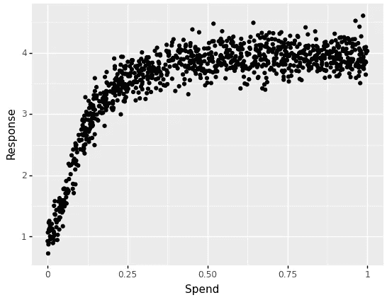

作者图片

现在，当我们拟合一个线性回归模型而没有首先转换我们的自变量时，会发生什么？

```
import statsmodels.api as sm
spend_with_intercept = sm.add_constant(spend)
ols_model = sm.OLS(response, spend_with_intercept)
ols_results = ols_model.fit()
ols_results.params
```

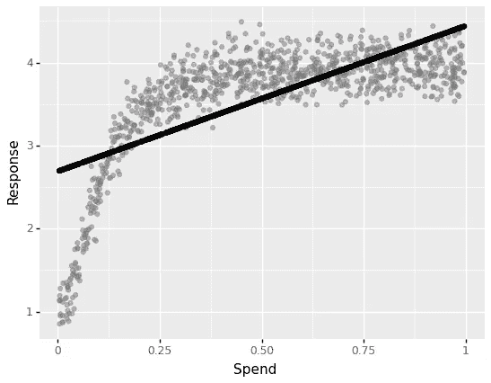

作者图片

正如所料，线性回归不能捕捉非线性关系。现在，在现实生活中，此时此刻，我们必须决定转换函数及其参数。让我们使用 hill 函数来转换我们的支出变量，该函数具有用于模拟响应变量和拟合线性回归模型的略微不同的参数。

```
**alpha** = 2
**gamma** = 0.3#hill transformation
**spend_transformed** = spend**alpha / (spend ** alpha + gamma ** alpha)X_hill_transformed = sm.add_constant(spend_transformed)
ols_model_hill_transformed = sm.OLS(response, X_hill_transformed)
ols_results_hill_transformed = ols_model_hill_transformed.fit()
ols_results_hill_transformed.params
```

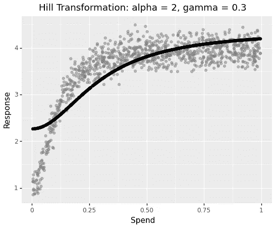

作者图片

该模型现在捕捉到了非线性，但在支出较低的地区，存在明显的不匹配。让我们用不同的参数值再试一次。


作者图片

当我们将 gamma 值移至更接近用于生成响应的原始值时，我们会得到越来越好的拟合。当然，建模者不会手动尝试不同的参数。相反，这个过程是由超参数优化框架自动完成的。然而，变换步骤仍然需要努力就适当的变换函数和计算时间达成一致，以找到近似的变换参数，从而更好地将模型拟合到数据。

有没有办法省略转换步骤，让模型找到非线性关系？是的。在我以前的一篇文章中，我描述了一种实现这一目标的机器学习方法:

[](/improving-marketing-mix-modeling-using-machine-learning-approaches-25ea4cd6994b) [## 使用机器学习方法改进营销组合建模

### 使用基于树的集合构建 MMM 模型，并使用 SHAP 解释媒体通道性能

towardsdatascience.com](/improving-marketing-mix-modeling-using-machine-learning-approaches-25ea4cd6994b) 

尽管使用基于任意树的机器学习算法的优点是提高了线性回归方法的准确性并处理了非线性，但是一个重要的缺点是这些算法不能像线性模型那样保持很好的可解释性。因此，需要像 SHAP 这样的额外方法来解释媒体表现，这对营销人员来说可能不是直观的。第二种方法是扩展线性模型，以允许:

*   保持可解释性
*   模拟非线性效应

这种扩展被称为广义加法模型，其中非线性效应的建模是通过使用所谓的平滑样条来实现的。

## 广义可加模型(GAM)和光滑样条综述

标准(加性)线性模型采用以下形式


作者图片

其中，β是系数，ε是误差项。

广义加性模型用以下形式扩展了线性回归:


作者图片

其中 *f* 是一个光滑函数。本质上，GAM 将平滑项的和与线性项的和相加。有很多[平滑函数的方法](https://www.rdocumentation.org/packages/mgcv/versions/1.8-40/topics/smooth.terms)，其中惩罚平滑样条因其计算效率而被推荐。

惩罚平滑样条线的工作方式如下:

首先，数据变量的范围被分成 K 个不同的区域，具有 K 个区域边界，称为*结*。第二，在每个区域内，低次多项式函数拟合数据。这些低次多项式被称为*基函数。*样条是加权基函数的总和，根据数据值进行评估。向最小平方损失函数添加惩罚来控制模型的平滑度。平滑参数*λ*控制估计平滑函数 *f* 的平滑度和波动度之间的权衡。*λ*的低值产生未补偿的样条，而*λ*的高值产生线性线估计。

## Python 中的广义加性模型

让我们回到上一个例子，用惩罚平滑样条拟合支出响应数据。

在 Python 中， [pyGAM](https://pygam.readthedocs.io/en/latest/) 是用于构建广义加法模型的包

```
pip install pygam
```

我使用 *LinearGAM* 函数对线性 GAM 建模。样条项通过使用期望变量索引的 *s* 函数来定义。 *n_splines* 控制应该安装多少个*基函数*。我将 lambda 设置为非常低的值 0.1，这意味着我几乎不会惩罚样条曲线的摆动

```
from pygam import LinearGAM, s
gam_hill = LinearGAM(s(0, n_splines=10), lam = 0.1).fit(spend, response)
```

让我们来理解模型的输出:

```
gam_hill.summary()
```

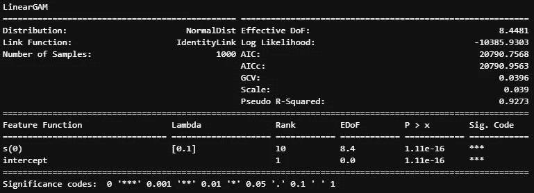

作者图片

值得一提的重要部分是:

*   秩-样条或基函数的数量
*   λ-平滑参数
*   EDoF——有效自由度。更高的 EDoF 意味着更复杂的样条。当 EDoF 接近 1 时，表明下划线项是线性的。R(pyGAM 的等价物)中的 mgcv 包的[文档建议了以下选择若干样条的经验法则:
    *与所有模型假设一样，非正式地检查* `*n_splines*` *的选择是有用的。如果模型项的有效自由度估计比* `*n_splines-1*` *小得多，那么这不太可能是非常值得的，但是随着 EDoF 接近* `*n_splines-1*` *，检查可能是重要的:增加* `*n_splines*` *并改装原始模型。如果这样做没有统计上的重要变化，那么* `*n_splines*` *就足够大了。当* `*n_splines*` *增加时，平滑度选择标准和/或有效自由度的变化，为拟合是否发生实质性变化提供了明显的数字度量。*](https://stat.ethz.ch/R-manual/R-patched/library/mgcv/html/choose.k.html)

让我们提取支出部分:

```
XX = gam_hill.generate_X_grid(term=0, n = len(response))
YY = gam_hill.partial_dependence(term=0, X=XX)
```

响应的期望值是包括截距在内的所有单项的总和:

```
intercept_ = gam_hill.coef_[-1]
response_prediction = intercept_ + YY
```

让我们绘制最终的花费-响应关系图:

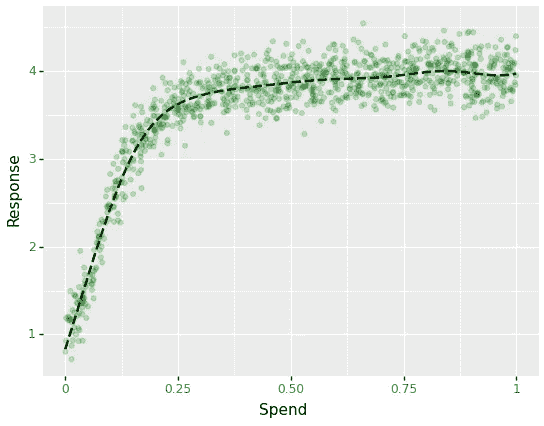

作者图片

该模型可以在不转换自变量的情况下捕捉非线性花费-响应关系。

为了完整起见，让我们来看看样条的基函数:

```
basis_functions = pd.DataFrame(gam_hill._modelmat(spend).toarray())
basis_functions["spend"] = spend#plot
ggplot(pd.melt(basis_functions, id_vars="spend"), aes("spend", "value", group="variable", color = "variable")) + geom_line() + ggtitle(f"{len(basis_functions.columns) - 2} Basis Functions plus Intercept")
```

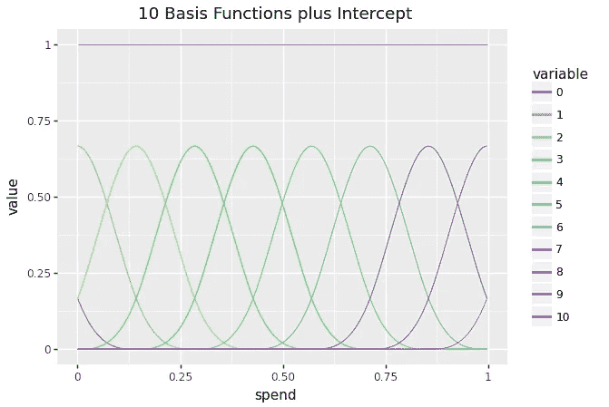

作者图片

生成的样条是基函数乘以相应系数的加权和:

```
basis = gam_hill._modelmat(spend).toarray()  
coefficients = gam_hill.coef_#omit intercept
spline = basis[:,:-1] @ coefficients[:-1]
```

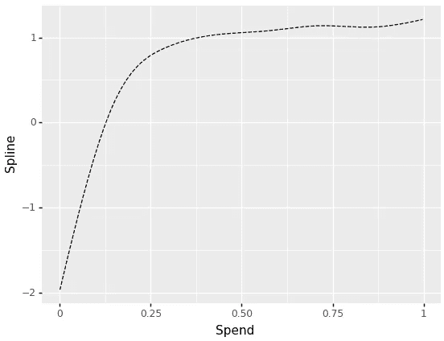

作者图片

我省略了截距的添加，因此该图显示了支出变量的分解平滑效果。

# 用广义加法模型模拟营销组合

现在，当我们理解了 GAM 是如何工作的，我将展示如何将它整合到 MMM 框架中。我将重用我在下面的文章中介绍的框架:

[](/improving-marketing-mix-modeling-using-machine-learning-approaches-25ea4cd6994b) [## 使用机器学习方法改进营销组合建模

### 使用基于树的集合构建 MMM 模型，并使用 SHAP 解释媒体通道性能

towardsdatascience.com](/improving-marketing-mix-modeling-using-machine-learning-approaches-25ea4cd6994b) 

变化很小。我用的是 GAM，而不是随机森林。解释黑箱模型所必需的 SHAP 成分不再需要了。由于 GAM 中成分的线性可加性，我们分析每个平滑媒体变量的影响几乎类似于线性回归模型。

## 数据

正如在我以前关于 MMM 的文章中一样，我继续使用由 [Robyn](https://github.com/facebookexperimental/Robyn) 在麻省理工学院许可下提供的数据集进行基准测试，并通过应用 Prophet 来分解趋势、季节性和假日，遵循相同的数据准备步骤。

该数据集包含 208 周的收入(从 2015 年 11 月 23 日到 2019 年 11 月 11 日),包括:

*   5 个媒体消费渠道:电视、网络、印刷品、facebook、搜索
*   2 个也有曝光信息(印象，点击)的媒体渠道:facebook_I，search_clicks_P(本文未使用)
*   无支出有机媒体:时事通讯
*   控制变量:事件、假期、竞争对手销售额(competitor_sales_B **)**

分析窗口为 2016 年 11 月 21 日至 2018 年 8 月 20 日的 92 周。

## 建模

建模步骤与我在上一篇文章中描述的完全相同:

[](/improving-marketing-mix-modeling-using-machine-learning-approaches-25ea4cd6994b) [## 使用机器学习方法改进营销组合建模

### 使用基于树的集合构建 MMM 模型，并使用 SHAP 解释媒体通道性能

towardsdatascience.com](/improving-marketing-mix-modeling-using-machine-learning-approaches-25ea4cd6994b) 

我将提到关于 GAM 的重要变化。

pyGAM 期望输入特性有一个非常非标准的定义。我已经编写了一个助手函数，它采用两种类型的特征:应该建模为线性的特征和应该建模为平滑样条的特征。此外，样条线的数量作为参数提供

```
def build_gam_formula(data, 
                      base_features, 
                      smooth_features, 
                      n_splines = 20):

    #set the first spline term
    channel_index = data.columns.get_loc(smooth_features[0])
    formula = s(**channel_index**, 
                **n_splines**, 
                **constraints**='monotonic_inc')

    for smooth_channel in **smooth_features**[1:]:
        channel_index = data.columns.get_loc(smooth_channel) #smooth term
        formula = formula + s(channel_index, 
                              n_splines, 
                              **constraints**='monotonic_inc') for base_feature in **base_features**:
        feature_index = data.columns.get_loc(base_feature) #linear term
        formula = formula + l(feature_index)return formula
```

应用于 6 个媒体通道和 5 个控制变量的结果公式如下所示:

```
s(5) + s(6) + s(7) + s(8) + s(9) + s(10) + l(0) + l(1) + l(2) + l(3) + l(4)
```

例如，s(5)意味着对数据集中列索引为 5 的变量应用平滑样条。

注意值为 *monotonic_inc.* 的*约束*参数在线性回归的情况下，我们通过将线性系数约束为正来应用一些与饱和效应和收益递减相关的商定业务逻辑，以便广告支出的增加不会导致响应的减少。

查看这篇文章了解更多细节:

[](/modeling-marketing-mix-with-constrained-coefficients-234b23190ee2) [## 用约束系数模拟营销组合

### 如何拟合一个 SciPy 线性回归并使用 RPy2 接口从 Python 调用 R 岭回归

towardsdatascience.com](/modeling-marketing-mix-with-constrained-coefficients-234b23190ee2) 

在 GAM 的上下文中，我将平滑样条约束为单调递增。

## 参数最优化

连同 5 个 adstock 参数，我为所有变量在 0.1 和 1000 之间的范围内优化平滑参数 lambda。注意:我不太清楚为什么 pyGAM 需要为明确定义为线性的变量设置平滑参数。

## 最终模型

我用 92 周的时间建立了最终模型。该模型的摘要如下所示:

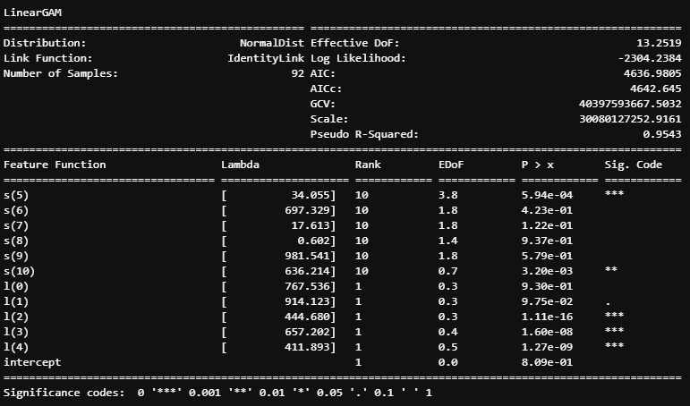

作者图片

该摘要示出了 6 个媒体频道中的 3 个获得了高平滑λ，并且它们对应的接近 1 的 EDoF 表明了几乎线性的关系。

如果将误差指标与评估进行比较，GAM 获得了比[贝叶斯方法](/modeling-marketing-mix-using-pymc3-ba18dd9e6e68)更高的准确性，但略低于[随机森林](/improving-marketing-mix-modeling-using-machine-learning-approaches-25ea4cd6994b)


作者图片

## 收益递减/饱和效应

让我们画出由此产生的花费-反应关系图。垂直线对应于渠道中的平均花费。x 轴是媒体支出。y 轴是支出对响应变量的影响

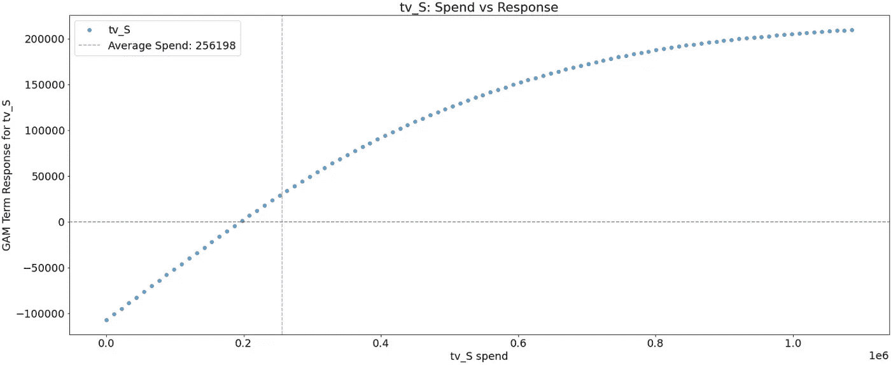

作者图片

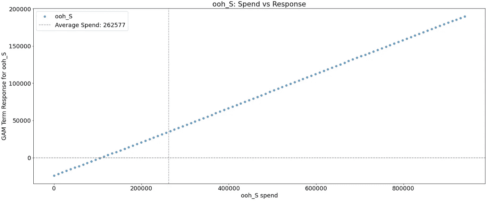

作者图片

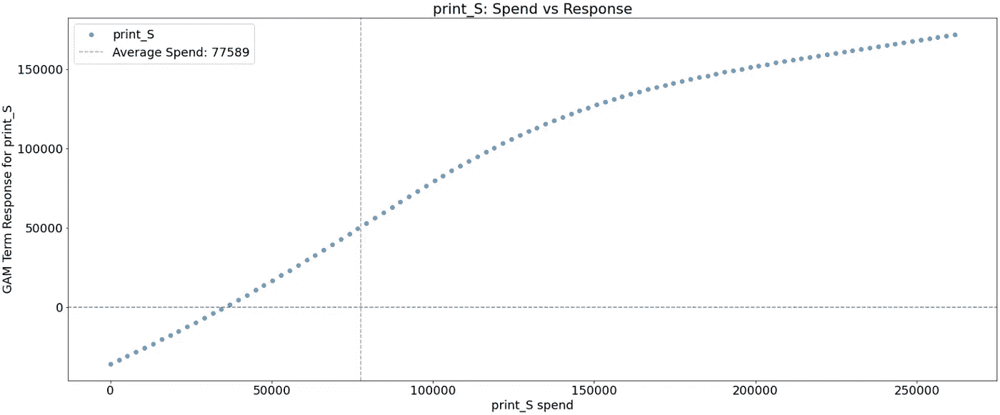

作者图片

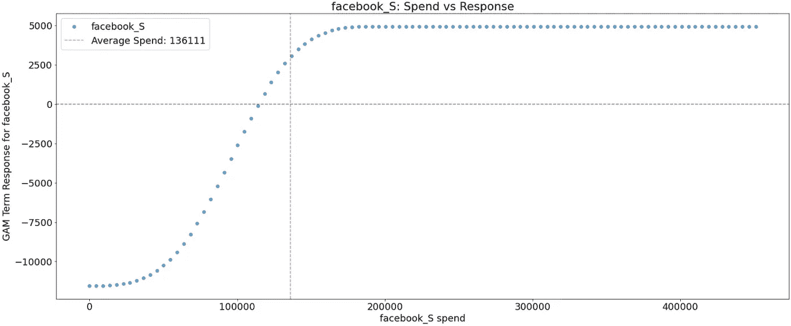

作者图片

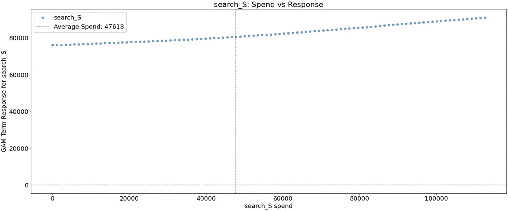

作者图片

正如在审查最终模型后所预期的那样，几个媒体渠道(search_S，ooh_S)具有线性效应。

以 *facebook_S，*为例，我们观察到收益递减的强烈 S 形，这表明广告支出从接近 20 万美元开始不会带来任何额外的反应增加。

取 *print_S，*其响应速度在大约 125K 花费时下降

观察 *search_S，*它的响应率几乎线性增加，但速度非常慢。

# 结论

在本文中，我展示了另一种营销组合建模方法，即在媒体渠道上应用惩罚平滑样条。这种方法不需要转换媒体支出变量来解释收益递减的非线性。最后，与线性回归模型相比，平滑样条导致更好的模型拟合，这增加了分解效果的可信度。

完整的代码可以从我的 [Github repo](https://github.com/slavakx/medium_posts) 下载

感谢阅读！