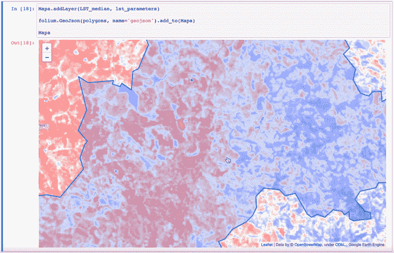
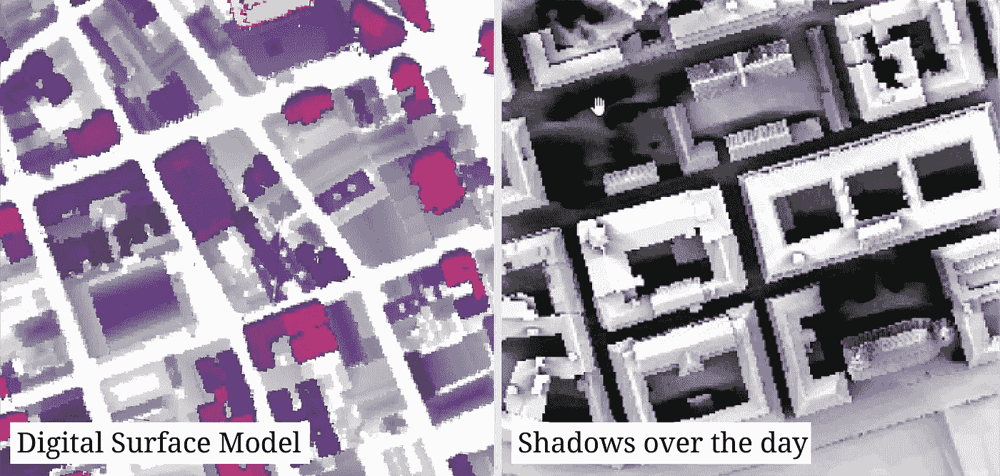
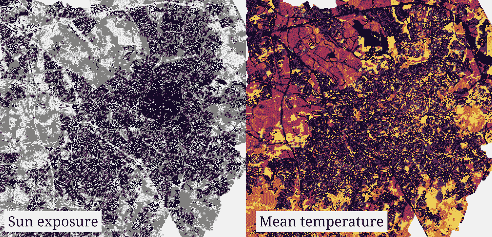
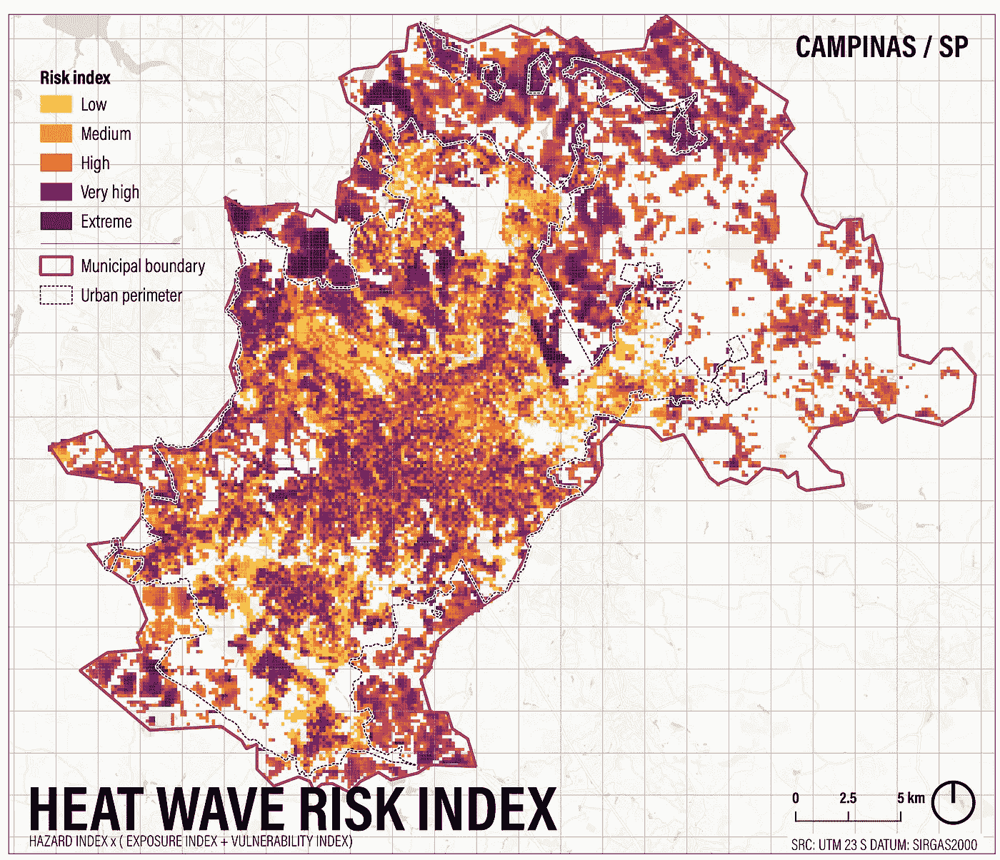

# 用卫星图像和激光雷达数据模拟城市热浪风险

> 原文：<https://towardsdatascience.com/modeling-urban-heat-wave-risk-with-satellite-imagery-and-lidar-data-3c00c63ea2db>

## 利用 GIS、统计技术和开放 python 库进行环境风险建模的方法

最近，[世界资源研究所](https://www.wri.org/)在[巴西](https://wribrasil.org.br/)的办公室在[城市 4 森林项目](https://cities4forests.com/)下给我分配了一项咨询任务，为与**气候变化**相关的几种**灾害**建立**风险**的模型，例如[坎皮纳斯](https://www.google.com/maps/place/Campinas+-+State+of+S%C3%A3o+Paulo,+Brazil/@-22.8948443,-47.1711193,11z/data=!3m1!4b1!4m5!3m4!1s0x94c8c8f6a2552649:0x7475001c58043536!8m2!3d-22.9050824!4d-47.0613327)市[城市规模的洪水、山体滑坡和热浪，坎皮纳斯](https://www.google.com/maps/place/Campinas+-+State+of+S%C3%A3o+Paulo,+Brazil/@-22.8948443,-47.1711193,11z/data=!3m1!4b1!4m5!3m4!1s0x94c8c8f6a2552649:0x7475001c58043536!8m2!3d-22.9050824!4d-47.0613327)是巴西大都市地区之外人口最多的城市，拥有 120 多万居民。

风险建模是 g is 软件最传统的用例之一，所以我认为它不会有什么突破性的东西。然而最终，评估暴露在城市热浪中的程度被证明是值得注意的。这是一个关于我们用高空间分辨率和地面真实值来建模风险指数的快速技术说明。

# 风险建模复习让我们开始

你可能以前读过这个，但是回忆一些关键概念也无妨。当**危险**事件(如热浪)发生，引发生命损失和基础设施损坏时，它会突出显示暴露于此类危险的**地理区域；**以及社会及其基础设施、资产和其他易受特定危害影响的过程。这就是为什么 IPCC 声明**风险**是**危害**面对给定**暴露**和给定**脆弱性**的产物。

风险等于危险乘以暴露加上脆弱性。图片作者。改编自 2014 年 IPCC 第五次评估报告。

# 计算危险强度

**危险**被定义为造成损害的现象，并以其位置、强度、频率和概率为特征。在这里，我们将使用 Landsat 8 热波段来获取过去 7 年夏季的地表温度。

为此，我们将使用 Google Earth Engine 的 Python API 来访问集合，将值转换为摄氏度，然后计算每个像素的中值。这里我使用的是 Jupyter 笔记本，但是您可以在任何 python IDE 中这样做。

一旦我们定义了我们感兴趣的区域，我们继续使用它的边界框来运行对 Google Earth 引擎的查询。我们将主要使用波段 10(用于地表温度)，但我们也加入了波段 4、3 和 2(用于自然颜色合成，以防万一)。在地球引擎的传感器的 [USGS 页面上有更多的信息。](https://developers.google.com/earth-engine/datasets/catalog/LANDSAT_LC08_C02_T1_L2#bands)

现在，我们可以开始处理我们选择的图像集合(在所选区域的时间段内共有 78 幅图像)。我们将获得每个像素的中值，并重新调整原始值，以获得地表温度(LST)，单位为摄氏度，遵循[美国地质调查局的建议](https://www.usgs.gov/faqs/how-do-i-use-scale-factor-landsat-level-2-science-products)。

太棒了。现在我们可以看看最终的乐队是什么样子。我将在我的 Jupyter 笔记本中使用 lyum，但是你可以使用任何映射库。

温度从 8 摄氏度到 50 摄氏度不等。图片作者。

由于一切看起来都很好，剩下的就是将结果导出到一个光栅文件，我们接下来可以在 GIS 软件中访问它。

# 用激光雷达数据和土地利用分类处理暴露

接下来我们的名单是**曝光。**暴露定义为位于危险易发区域的人员、基础设施和其他有形人力资产的情况。为了得到这个，我们将计算**潜在温度**——也就是说，有多少热量表面可以潜在储存或反射——。

为了做到这一点，我们将使用由法国城市规划办公室创造的方法。这个最近成为 QGIS 插件的工具通过模拟建筑物和树木的**阴影**以及材料的**热属性**来计算地面温度。

第一步是获取建筑物和树木的体积(来自坎皮纳市政厅收集的**点云** **激光雷达数据**)。这些反过来又被馈送到 QGIS 的 [UMEP 插件](https://github.com/UMEP-dev/UMEP)，该插件将为一天中的每个小时生成一个由建筑物和树木投射的**阴影**的栅格，以及一个像素范围从 0 到 1 的最终栅格，其中 0 是太阳根本照射不到的地方，1 是一整天都被阳光照射到的地方。

图片作者。

接下来，我们将获取土地覆盖数据(同样由市政厅提供，但使用[任何卫星图像监督分类工具](https://dges.carleton.ca/CUOSGwiki/index.php/Supervised_classification_in_QGIS)都可以轻松完成)，并为它们分配一系列指标，如反射率和反照率。ICEtool 提供了一个数据库，其中包含常见材料的值，在 Campinas 找到的大多数材料都完全符合该集合。

图片作者。

有了这两个输入，ICEtool 现在就能够生成一个点网格，并计算每个点的潜在温度，同时考虑到它获得了多少阳光以及它在反射或储存热量方面将如何表现。我们使用的是 ICEtool 的 1.0 版本，所以必须通过 QGIS 中的 Python IDE 来完成。事情应该更容易了，因为它已经成为一个真正的插件。

图片作者。

# 最重要的是脆弱性指标

最后，我们可以处理脆弱性指标。脆弱性被定义为由物理、社会、经济和环境因素决定的条件，这些因素增加了社区对灾害影响的易感性。这里我们将使用 2010 年人口普查提供的社会指标。所选择的变量是老年人的比例、可获得饮用水的人口比例和家庭平均收入。

我不会详细讨论如何获取巴西地理统计局 2010 年人口普查的数据，因为这在其他地方有很好的记录。相反，我将提供下面生成的三个地图。请注意，与其他两个变量不同，平均收入图的色标必须反转，因为较小的值代表较高的脆弱性。

图片作者。

# 用标准化的尺度把它们放在一起

你可能已经注意到，到目前为止，我们使用了几种不同的音阶。**危险**变量的像素为 30x30m，范围为 8 到 50 摄氏度。**曝光**变量的像素为 5x5m，范围为 10 到 33 摄氏度。而**脆弱性**变量由普查区域多边形表示，范围从 0 到 100%和从 45k 到 0 雷亚尔。这意味着为了能够将它们混合起来，我们需要使它们在空间和数字上兼容，所以我们不是在比较苹果和橘子。

第一个很简单:我们用 [Create Grid 命令](https://docs.qgis.org/2.6/en/docs/user_manual/processing_algs/qgis/vector_creation_tools/creategrid.html)在 QGIS 中创建了一个 150x150m 的**新网格**，它成为我们所有图层的新公共参考。接下来，我们需要**将数据**从不同的层迁移到这些新的单元中。这可以通过一个简单的“[按位置连接要素](https://www.qgistutorials.com/en/docs/3/performing_spatial_joins.html)”来完成，但它不太擅长处理原始数据中叠加了多个要素的像元。出于这个原因，我们宁愿使用 [**面积加权平均**插件](https://www.google.com/search?q=qgis+area+weighted+average&sxsrf=APq-WBsnNQLorT5N8nTwoC9cwEChKHlw5g%3A1649449998113&ei=DpxQYrmqBpzd1sQP8I-3sAU&ved=0ahUKEwi56diJqIX3AhWcrpUCHfDHDVYQ4dUDCA4&uact=5&oq=qgis+area+weighted+average&gs_lcp=Cgdnd3Mtd2l6EAMyCAghEBYQHRAeOgcIABBHELADSgQIQRgASgQIRhgAUOYGWP0MYO8NaAJwAXgAgAHBAYgB0QaSAQMwLjWYAQCgAQHIAQjAAQE&sclient=gws-wiz#:~:text=Area%20Weighted%20Average%20%E2%80%94%20QGIS,qgis.org%20%E2%80%BA%20plugins%20%E2%80%BA%20area_weighted_aver...)，它会将原始单元格中的值按相交面积按比例分配给新单元格。

第二次增容是常规的 [**归一化的**](https://www.techopedia.com/definition/1221/normalization#:~:text=Normalization%20is%20the%20process%20of,stored%20in%20only%20one%20place.) 的不同系列。这基本上是一个公式，其中我们取系列的最大值和最小值(如 10–33°C ),以便相应地将所有值缩放到范围从 0 到 1 的系列中。明智的做法是在这样做之前从系列中删除异常值。

图片作者。

一旦完成，我们准备将风险公式应用到新生成网格的每个单元，即**危险**乘以**暴露**加上**脆弱性**。

图片作者。

这将创建我们的最终风险指数。标度现在从 0 到 2 变化，因此我们可以再次归一化值，然后乘以 5，得到 5 个等级，我们称之为低、中、高、非常高和极端。

图片作者。

有趣的是，这一结果否定了城市热岛与更高的建筑密度有关的概念。我们清楚地看到，即使内城显示出一些高风险集群，风险最大的区域是城市周边地区，那里没有植被，水资源和收入都较低。

# 这是所有的乡亲

这一块就到此为止！如果你有问题或建议，不要犹豫，随时给我写信！

如果你喜欢这篇文章，可以考虑[请我喝杯咖啡](https://www.buymeacoffee.com/guilhermeiablo)，这样我就可以继续写更多的文章。

***如果你还不是中会员，想支持我这样的作家，可以随时通过我的推荐链接报名:***

 [## 通过我的推荐链接加入媒体——古伊列梅·m·亚布洛诺夫斯基

### 作为一个媒体会员，你的会员费的一部分会给你阅读的作家，你可以完全接触到每一个故事…

guilhermeiablonovski.medium.com](https://guilhermeiablonovski.medium.com/membership)