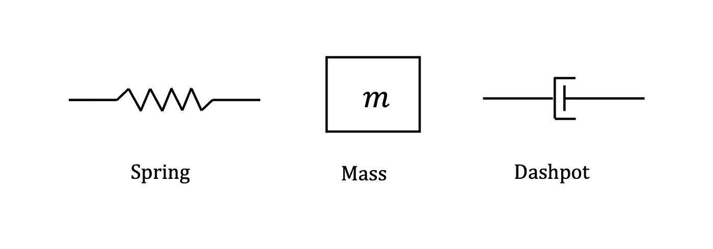
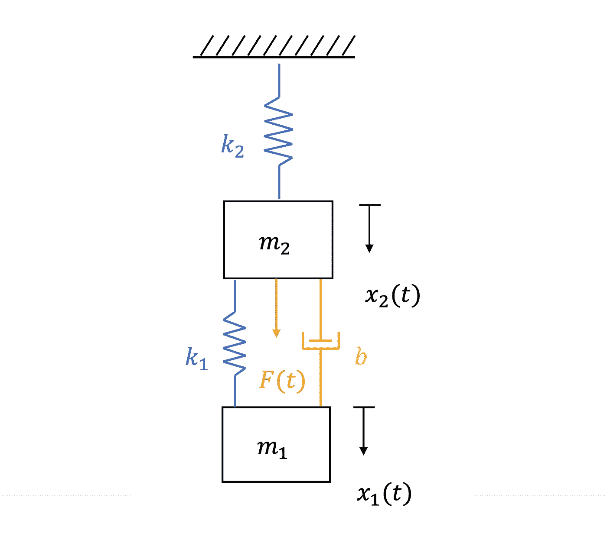
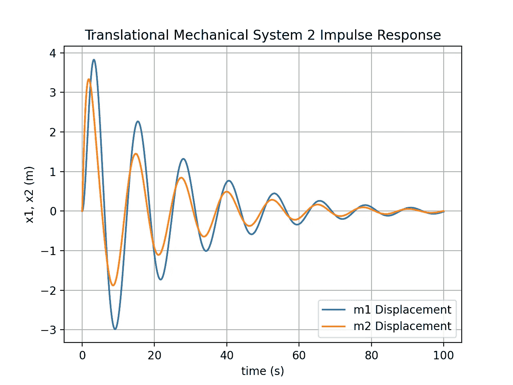
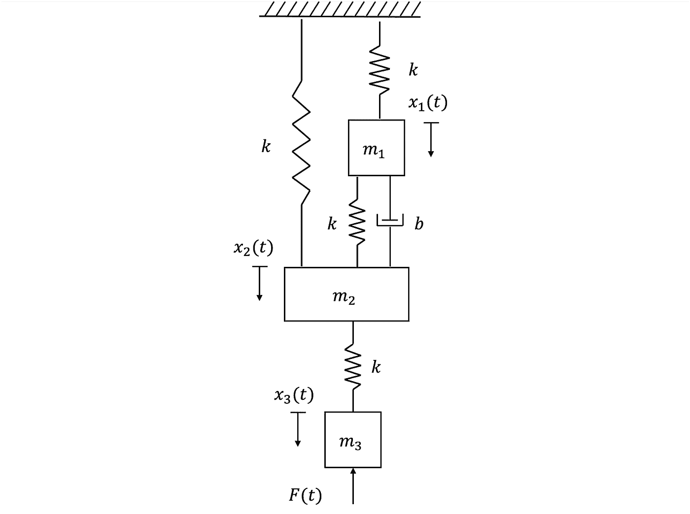
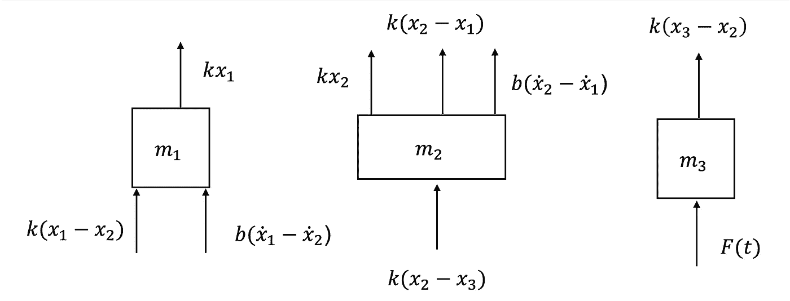
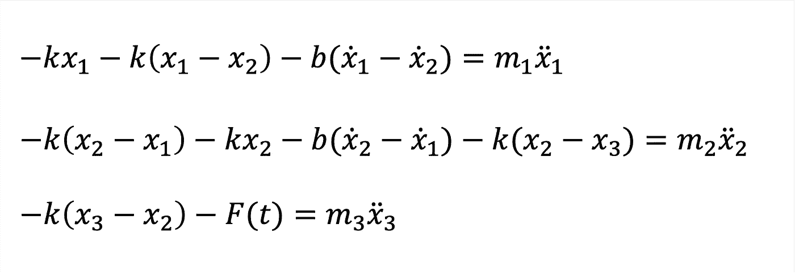

# 用 Python 建模动态系统

> 原文：<https://towardsdatascience.com/modelling-dynamic-systems-in-python-92c14d4b35d3>

## Python 中平移机械振动问题运动方程的数值积分

## 介绍

本文旨在为**建模** *物理系统*的动态响应提供*基础*。

**动态系统**包含*时变变量*，意味着*激励*和*响应*随时间变化。除了任何外部输入或干扰之外，系统的响应通常取决于*初始条件*，例如储存的能量。

模型是代表物理现象的数学抽象，包括**微分方程(DEs)** 。

高保真模型非常详细地描述了这个世界。然而，解决这些问题在计算上可能是昂贵且耗时的。因此，根据目的不同，模型通常包含**假设**和**简化**。

帕特里克·罗伯特·道尔在 [Unsplash](https://unsplash.com?utm_source=medium&utm_medium=referral) 上拍摄的照片

## 理论

**平移机械系统**沿*直线*移动。一级方程式赛车*的*悬架*就是一个例子。描述这些机械系统动态行为的基本变量*是:**

*   ***x*** ，*位移*米(m)
*   ***v*** ，*速度*以米每秒(m)为单位
*   **加速度*以米每秒平方(m)为单位*
*   ****F*** ，*力*牛顿(N)*

*图 1 展示了*三个基本元件*，通常包括振动问题、弹簧、惯性元件和减震器。*

**

*图 1 —基本振动元件(*图片由作者*提供)*

*   ***弹簧** : *胡克定律*指出弹簧的变形与作用力的方向和大小成正比，如等式 1 所示。弹簧储存**势能**。**弹簧常数**、 *k* ，以**牛顿每米(N/m)** 为单位测量弹簧的刚度。*

**

*等式 1——胡克定律。弹簧力与位移成比例 *x* ( *图片由作者*提供)*

*   ***惯性**:质量为 *m* 的正方形块代表一个惯性元件。正如牛顿第一定律所描述的，惯性是物体抵抗运动变化的固有属性。这些类型的元素储存**动能**。*
*   ***减震器/阻尼器**:减震器通过粘性摩擦对抗运动。在缓冲器 *b* 上施加一个力会产生一个与质量速度成正比的反作用力，如等式 2 所示。粘性阻尼系数 b 以**牛·秒/米**为单位测量。这是一个描述摩擦能量耗散的理论参数”。⁴*

**

*等式 2 —阻尼力与惯性元件的速度成比例(*图片由作者*提供)*

*将方程 1 和 2 以及方程 3 ( **牛顿第二定律)**应用于平移系统，允许形成运动的控制*方程。请注意，为了让牛顿定律成立，动量和加速度必须相对于一个*惯性系*来测量。**

**

*等式 3 —牛顿第二定律(*图片由作者*提供)*

> *每个惯性元素需要一个微分方程。*

*知道了物理元素和相应的控制方程，就有可能推导出机械系统的数学模型。然后可以使用软件定义的函数对模型进行数值求解。比如 [***Matlab 和 Simulink***](https://www.mathworks.com/products/simulink.html) 都有模拟振动问题的强大工具。*

**复习本* [*篇*](https://python.plainenglish.io/how-is-numerical-integration-done-using-python-4585344e5800) *对数值积分进行必要的介绍。**

* [## 如何使用 Python 进行数值积分

### 本文旨在演示如何使用 Python 对函数的积分进行数值计算。

python .平原英语. io](https://python.plainenglish.io/how-is-numerical-integration-done-using-python-4585344e5800)* 

## *振动问题示例*

*图 2 示出了示例性的*质量弹簧阻尼器*配置。**运动为一维**，正 *x 方向*水平向右。*

*假设结构处于*平衡状态*。 ***x₁*** 和 ***x₂*** 分别描述了 *m₁* 和*m₂*从平衡状态的位移。因此，最初 *x₁ = x₂ = 0* 。*

> *目标是求解 x₁*和 x₂**的运动方程****

********

****图 2-双质量动力系统示例(*图片由作者*提供)****

*   ******质量块 1** 通过弹簧 *k₁* 和减震器 *b₁* 并联连接在*固定壁*上。它依靠无摩擦轴承。****
*   ******质量块 2** 通过弹簧 *k₂* 与 *m₁* 连接，位于固定地面上。当 *m₂* 运动时，其自身与地板之间的摩擦力倾向于对抗运动( *b₂* )。****

****如上所述，**每个惯性元件都需要自己的 DE** 。因此，有两个描述*系统 1* 的运动方程。****

> *****关键挑战之一是确定作用在物体上的每个力的方向。*****

****下列方法确定 m₁:上的力的方向****

1.  ****孤立 m₁，这是感兴趣的惯性元素****
2.  ****保持所有其他惯性元件固定****
3.  ****在 x 轴正方向移动 *m₁* ，在这种情况下是向右****
4.  ****分析作用在 *m₁* 上的弹簧和阻尼力****

****应用这个策略为***的**自由体图(FBD)** 如图 3 所示。*******

**************

*******图 3 —质量 1 自由体图(图 2 系统) (作者*图片*)*******

*******总的来说，四种力量正在作用于 m₁.*******

*   ********代表来自弹簧₁.的回复力当 m₁向右移动时，弹簧拉伸并试图将 m₁拉回到平衡状态。********
*   ***********b*ẋ*₁****是阻尼力，同样，它也是反运动的*********
*   ***********k₂(x₁ — x₂)*** 是弹簧 *₂* 施加在 *m₁* 上的力。保持 *m₂* 不动并正向移动 m₁，弹簧 *₂* 从两端向外压缩和推动。因此，这往往会将 m₁向后推。必须认识到**弹簧 *₂* 长度取决于 *x₁* 和 *x₂*** *。*为了发生压缩， *x₁* 必须大于 x2。因此，这个力向左，大小等于*k₂(x₁——x₂).*********
*   *******最后， ***F(t)*** 是系统的外部输入或扰动。*******

*******接下来，将同样的方法应用于 *m₂* 。这一次保持 *m₁* 固定，并正向移动 *m₂* ，这导致图 4 中 *m₂* 的 FBD。*******

**************

*******图 4 —质量 2 自由体图(图 2 系统) (作者*图片********

*******最后，应用等式 3 中的**牛顿第二定律**并将作用在 *m₁* 和 *m₂* 上的力相加，得到两个运动方程，等式 4 和 5。*******

**************

*******等式 4 和 5——系统 1 的二阶运动微分方程(作者提供*图片)********

*******方程 4 和 5 是二阶方程，如前所述，它们可以简化为一系列一阶常微分方程。*******

********复习这篇* [*文章*](https://medium.com/geekculture/runge-kutta-numerical-integration-of-ordinary-differential-equations-in-python-9c8ab7fb279c) *对化一个高阶微分方程为一个一阶常微分方程组进行必要的介绍。********

******* [## Python 中常微分方程的龙格-库塔数值积分

### 在 Python 中使用 RK4 求解常微分方程

medium.com](https://medium.com/geekculture/runge-kutta-numerical-integration-of-ordinary-differential-equations-in-python-9c8ab7fb279c)******* 

## *******Python 实现*******

*******要点 1 显示了 Python 函数定义了为`odeint` `sympy`解算器准备好的 ODEs。*******

*******有不同类型的强制功能可用。**外力**模拟时变力的响应行为。在这种情况下，一个**步进输入**力干扰 *m₁.********

> *******阶跃激励在 t = 0 时将输入从零变为有限值。*******

*******要点 1 —用 Python 定义的系统 1*******

*******Gist 2 包含要模拟 *100 秒*的 Python 代码。初始位置和速度对应的所有**初始条件**均为**零**。*******

*******要点 2 —用于模拟执行的 Python 代码*******

*******图 5 显示了参数值`m1=1.2, m2=1.2, k1=0.9, k2=0.4, b1=0.8, b2=0.4`的**模拟结果**。 *m₁、m₂、k₁、k₂、b₁、*和 *b₂、*的值是任意的。*******

*******改变这些值将导致不同的响应；尝试查看输出变化。然而，****受迫弹簧质量阻尼器系统的稳态响应与初始条件无关。***********

******************

*********图 5 —系统 1 的稳态响应(*图片作者*)*********

*********图 5 是稳定响应。 *m₁* 在 ***稳态*** *中向前移动约 1.1 *cm* ，m2* 在 ***瞬变* *衰减*** 后也向右移动了 1.1 *cm* 。*********

## ********示例振动问题 2********

********下图 6 是另一个平移振动示例系统。上面应用了相同的程序来确定其**时变响应**。********

****************

********图 6 —示例 2 —双质量动力系统(*图片由作者*)********

********首先，绘制两个质量的 FBD，如图 7 和图 8 所示。*回想一下，力的方向是通过隔离感兴趣的惯性元件并以正位移移动，同时保持其他质量固定来确定的。*********

****************

********图 7 和图 8——图 6 系统中 m1 和 m2 的自由体图(*图片由作者*)********

********从 FBDs，数学模型变得明显。等式 5 表示 *m₁* 的运动，而等式 6 控制 m2 的响应。********

****************

********等式 5 和 6——图 6 系统的数学模型(作者的*图像)*********

********Gist 3 展示了 Python 代码，ODEs 实现为 Numpy 数组。强制函数类似于本模拟中的**狄拉克δ分布**。使用的参数值是`m1=2.2, m2=2.5, k1=1.1, k2=1.5, b=1.4`。********

********要点 3 —平移系统 2 脉冲模拟 Python 代码********

********图 9 描述了稳定的系统脉冲响应。两个物体都以正弦模式运动。这些*正弦波衰减*，最终，物体回到平衡状态 *x₁ = x₂ = 0。*********

****************

********图 9 —系统 2 脉冲响应(*图片由作者*提供)********

## ********示例振动问题 3********

********最后一个例子如图 10 所示。该设计包含**三个质量块**以及连接各元件的弹簧和减震器网络。********

****************

********图 10 —三质量动力系统(*图片作者*********

********上面概述的相同程序用于*确定惯性元件 FBDs* 以及随后的运动控制方程。图 11 显示了每个感兴趣的组件的图表。方程 7、8 和 9 是相应的方程组。********

****************

********图 11-三质量系统中 m1、m2 和 m3 的自由体图(作者提供*图片)*********

****************

********方程 7、8 和 9——三质量系统的运动方程(*图片作者*********

********三个惯性元件构成了机械装置。所以现在有*三个微分方程*，也就是说会有*六个初始条件*。********

********图 12 显示了系统的*单位脉冲响应*，运行时间为 300 秒，参数值为`m1=1.2, m2=2.0, m3=1.1, k=1.2, b=1.2`。********

****************

********图 12 —系统 3 单位阶跃响应(*图片由作者*提供)********

## ********结论********

********所有模拟都是从初始条件设置为零开始的。但是，尝试不同的初始条件，看看结果。显然，受迫弹簧质量阻尼器系统的****稳态响应与初始条件无关。**通常，动力学的关键方面是稳态响应。**********

********上面给出了三个用于模拟动态平移系统的例子。这篇文章仅仅触及了机械振动和动态系统建模的表面。********

******** [## Python 中的二体问题

### 想象两个物体的运动仅仅是由于它们相互的引力吸引

levelup.gitconnected.com](https://levelup.gitconnected.com/the-two-body-problem-in-python-6bbe4a0b2f88)  [## 通过我的推荐链接加入媒体-安德鲁·约瑟夫·戴维斯

### 作为一个媒体会员，你的会员费的一部分会给你阅读的作家，你可以完全接触到每一个故事…

medium.com](https://medium.com/@andrewdaviesul/membership) 

找到 Gist 4 中的 Python 代码来运行本文中的模拟。

要点 4——用 Python 建模动态系统

## 参考

[1]Charles m . Close
【2】[动力学系统建模与分析](https://youtube.com/playlist?list=PL4VMBEQr3gME29eeHZyT_lDw3KCdAmwXR)—Rick Hill
【3】[动力学与振动导论](https://www.brown.edu/Departments/Engineering/Courses/En4/Notes/vibrations_forced/vibrations_forced.htm) —工程学院(布朗大学
【4】[分数欠阻尼振荡器中粘性阻尼系数的实验评估](https://doi.org/10.1177/1687814016643068) — Escalante-Martínez J 等《机械工程进展》(2016 年 4 月)********