# 现代 LLMs:NLG 山，龙猫，地鼠和更多

> 原文：<https://towardsdatascience.com/modern-llms-mt-nlg-chinchilla-gopher-and-more-5053cfea8178>

## 更大的模型能解决我们所有的问题吗？

明白了吗？是一只地鼠！(照片由[卢克亚什·vaňátko](https://unsplash.com/@otohp_by_sakul?utm_source=unsplash&utm_medium=referral&utm_content=creditCopyText)在 [Unsplash](https://unsplash.com/s/photos/Gopher?utm_source=unsplash&utm_medium=referral&utm_content=creditCopyText) 上拍摄)

在这个概述中，我们将看看 GPT 协议 3 之后的大型语言模型(LLM)的产生[7]。GPT-3 令人难以置信的结果清楚地表明，增加语言模型(LMs)的规模是非常有益的。然而，问题是，*这种趋势什么时候会趋于平稳？*随着参数数量的不断增加，模型性能是否会继续呈指数级提高？**

这个问题很快被后续的 LLM 工作所回答，这些工作探索了包含多达 5300 亿个参数的模型。虽然在这项工作中有许多有趣的发现，但主要的收获是，仅仅把模型做得更大是不够的。超过某一点后，LLM 的性能开始趋于平稳(也就是说，并不比 GPT-3 好多少)。

然而，我们可以使用其他技术来提高 LLM 的性能。首先，我们可以不再增加模型的大小，而是更多地关注预训练语料库。如果这个预训练语料库的大小和质量增加，它往往有利于模型性能。简而言之，*让 LLMs 变得更好似乎是增加模型和数据规模的共同努力*。

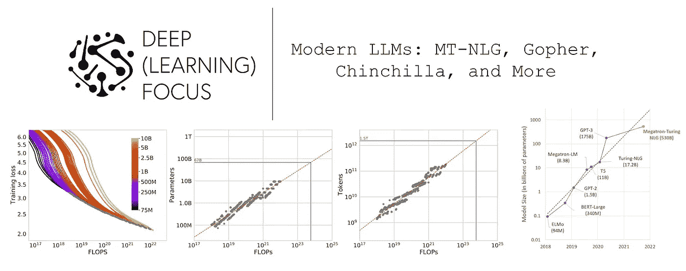

(来自[1]和[4])

# 语言建模入门

语言建模背后的基本概念已经在我最近写的关于 LLM 的前几篇文章中广泛讨论过了:

*   GPT 和 GPT-2 概述[ [博客](https://cameronrwolfe.substack.com/p/language-models-gpt-and-gpt-2)
*   GPT-3 概述[ [博客](https://cameronrwolfe.substack.com/p/language-model-scaling-laws-and-gpt)

**概念。**简单地说，LMs(和 LLM)是深度神经网络，专门解决一个单一的任务:预测文本序列中的下一个单词。尽管这个过程比这个过程多了一点[和](https://cameronrwolfe.substack.com/i/85568430/language-modeling),但一般概念真的就是这么简单。

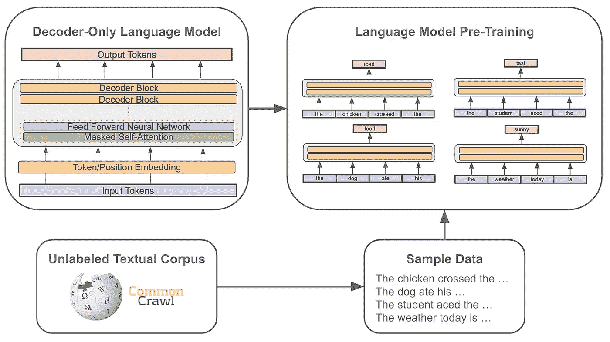

未标记文本上的语言模型预训练(由作者创建)

为了训练一个 LM，我们必须首先获得大量的未标记文本。然后，我们可以通过迭代以下步骤来执行[自我监督学习](https://cameronrwolfe.substack.com/p/language-understanding-with-bert#%C2%A7self-supervised-learning):

1.  一些文本样本
2.  试着预测下一个单词
3.  基于“正确的”下一个单词更新你的模型

这个过程称为语言模型预训练，如上图所示。有趣的是，这个训练过程允许(L)LM 从大量数据中学习，因为我们学习的文本数据不需要人工注释！我们可以从网上下载大量的原始文本数据，用于预训练。从如此庞大的语料库中学习对于发展对语言的多样化的、全面的理解是非常有益的。

**创建基础模型。**如果我们预先训练一个 LLM(顺便说一下，这是一个[昂贵的过程](https://arxiv.org/abs/2211.02001))，我们就可以进入一个神经网络，给定一些文本，它可以准确预测下一个单词。最初，这可能看起来没什么用，但是这些 LLM 拥有令人难以置信的自然语言知识基础。

为了理解为什么会这样，我们需要首先认识到预测文本序列中的下一个单词是一个困难的问题——即使作为人来做这件事也不是小事！准确地选择下一个单词实际上需要模型对语言进行深入细致的理解。这种理解非常有益，*因为它可以重新用于解决其他类型的语言任务*！

换句话说，这些 LLM 是一种[基础模型](https://crfm.stanford.edu/)——一个通用术语，指的是可以重新用于解决各种任务的大型神经网络。这些基础模型的学习过程分为两个阶段:预培训和情境学习。预训练过程如上所述，而上下文学习指的是使用通用 LLM 来解决更具体的下游任务的过程。

**等等……我们该怎么做？**我们可以通过多种方式重新利用 LLM 来解决下游任务。目前，很多研究都在研究零推理和少镜头推理技术来解决 LLMs 的各种任务。在高层次上，这些技术通过将下游任务重构为下一个单词预测问题来解决它。例如，我们可以将以下提示传递给 LLM:

*   “总结以下文档:
*   把这句话翻译成法语

然后，使用下一个单词预测，我们可以为这个提示生成一个文本响应，它(理想情况下)应该回答我们想要的问题。我们通过提示/请求 LLM 为我们解决任务来解决任务！以上提示都是零拍学习的例子。我们还可以执行少量学习，其中我们在提示中额外提供了几个正确输出的例子；下面是一个例子。

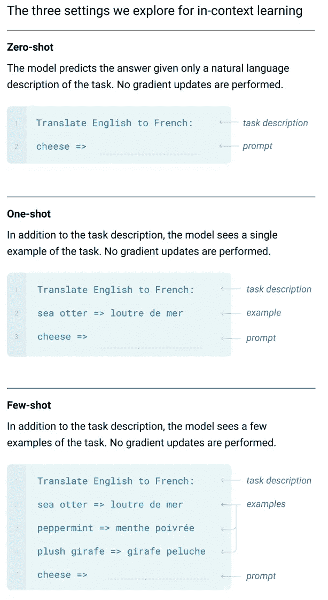

(摘自[7])

GPT-3 [7]推广了 LLM 的少量学习，它表明使用这种技术一定规模的语言模型表现相对较好。然而，这种性能仍然落后于通过监督学习或微调解决下游任务的基线技术。

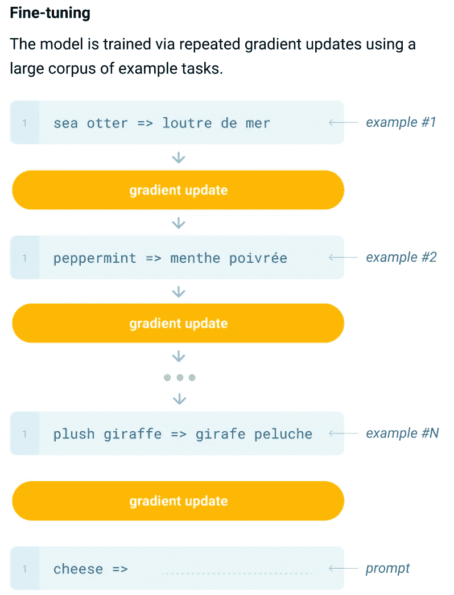

(摘自[7])

我们可以只对 LLM 进行微调(即，基于对输入和期望输出的训练来更新模型的参数),而不是执行少量推理；见上图。这种方法执行得相当好，但是它也有一些缺点:

*   需要进一步培训(可能很贵)
*   每个下游任务都需要一个专门的模型

用一个模型就能准确解决所有任务，那就太好了。事实上，这是基金会模型的最终目标。然而，就目前而言，似乎有必要进行微调以实现最佳性能。尽管如此，我们将在这个概述中看到，大多数当前的研究使用零/少镜头推理来测量 LLM 性能。

## 这一概述

到目前为止，希望 LLM 的概念和它们是如何工作的已经比较清楚了。在这个概述中，我们将重点关注 *(i)* 训练更大的 LLM 和 *(ii)* 使用更大的数据集进行预训练。现代 LLM 基于[纯解码器变压器架构](https://cameronrwolfe.substack.com/i/85568430/decoder-only-transformers)。这些模型的大小可以通过增加更多的层或增加每层的宽度来增加。为了获得更多的数据来训练这些模型，我们通常只是使用像 [Common Crawl](https://commoncrawl.org/) 这样的工具从网络上抓取文本，或者使用像 Pile dataset [5]这样的大型文本数据源。

我们将研究四篇探索现代 LLM 的论文，并试图改进 GPT-3 的结果。训练更大模型的最初尝试在某种程度上没有达到 GPT-3 设定的期望— *我们获得的性能改进没有我们希望的那么好*。后来的工作发现，让 LLM 成功不仅仅是简单地扩大规模——我们还必须提高预训练语料库的规模和质量。这导致了更有效的 LLM 的提议，其通过在更多数据上训练更小的模型来实现显著的结果。我们来看看吧！

# [用 DeepSpeed 和威震天训练威震天——图灵 NLG 530B，大规模生成语言模型](https://arxiv.org/abs/2201.11990) [1]

尽管 LLM 已经相当大了(例如，GPT-3 [7]包含 1750 亿个参数)，MT-NLG 530B，在[1]中提出，把它带到了一个新的水平。Nvidia 和微软的合作，这项工作训练了具有 5300 亿个参数的 LLM。像 GPT-3 这样的模型由于它们的尺寸已经很难训练，所以训练 MT-NLG 530 b——另一个[解码器专用变压器](https://cameronrwolfe.substack.com/i/85568430/decoder-only-transformers)，参数增加了>3 倍，如下图所示——显然相当困难。事实上，MT-NLG 需要一个专用的计算集群和几项分布式培训创新，以使培训易于处理且高效。

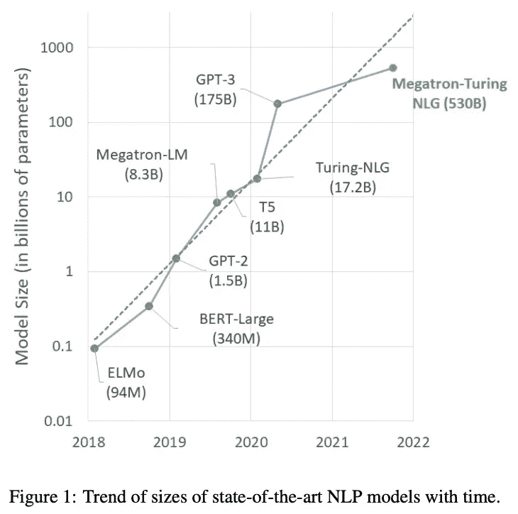

(来自[1])

使用数据、模型/管道和张量并行性的组合来训练模型；参见[这里](https://cameronrwolfe.substack.com/i/88082618/other-useful-details)对这些概念的快速讨论。基于 [Megatron-LM 库](https://github.com/NVIDIA/Megatron-LM)的分布式训练方法是这项工作的主要贡献——简单地设计一个能够训练具有 5300 亿个参数的 LLM 的系统是非常重要的。

当我们执行分布式训练时，有两种基本方法可以向训练过程添加更多的 GPU:

1.  为您的计算机添加更多 GPU
2.  添加更多的机器，每个机器都有 GPU

MT-NLG 的培训程序针对每种情况采用不同的分布式培训方法。在每台单独的机器中，我们使用张量切片(tensor-slicing)将训练分配给不同的 GPU，张量切片是一种模型并行的形式，它将单个层分成多个不相交的参数“切片”，每个切片都分配给单独的 GPU。然后，流水线并行被用于在不同的机器或计算节点之间分配训练。要了解有关这些技术的更多信息，请查看以下链接:

*   流水线并行[ [文档](https://pytorch.org/docs/stable/pipeline.html) ][ [教程](https://pytorch.org/tutorials/intermediate/pipeline_tutorial.html)
*   模型并行变量(包括张量切片)[ [博客](https://huggingface.co/transformers/v4.11.3/parallelism.html)

这种混合分布式训练方法是必需的，因为当在不同的机器上执行时，通信要昂贵得多。因为同一台机器上的 GPU 之间的通信非常快，张量切片在这种情况下工作得很好。然而，不同机器之间增加的通信时间使得在跨几个计算节点进行分布式训练时，流水线并行成为更有效的选择。

MT-NLG 有 105 层，隐藏维度 20K，每层有 128 个注意头。该模型在使用[普通爬行](https://commoncrawl.org/)和桩数据集【5】导出的大型文本语料库上训练。类似于先前的工作，执行大量的去重复和匹配，以从预训练语料库中移除副本和下游训练或测试数据。

执行这些过滤程序是因为我们不想“夸大”模型的测试性能。如果来自某个下游数据集的测试数据存在于预训练语料库中，那么我们的模型将通过简单地记忆数据来容易地解决这个任务。但是，这并没有真正反映模型的概括能力。

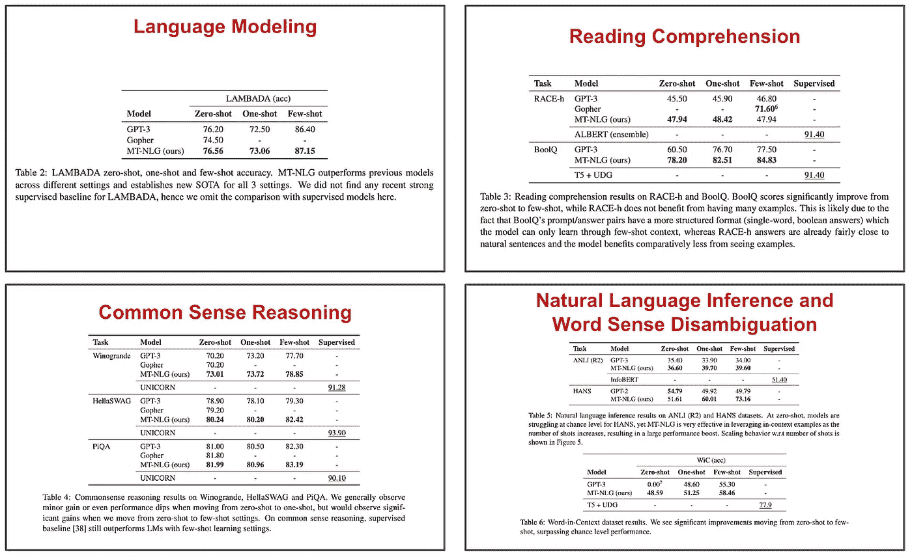

(来自[1])

经过预训练后，MT-NLG 类似于 GPT-3 进行评估，在大量不同的基准上使用任务不可知的零、一和少量推理；见上文。当评估这个庞大的模型时，我们看到的结果与 GPT-3 非常相似，但稍好一些。例如，MT-NLG 略胜一筹(即<1%) than GPT-3 on language modeling, and similar results are seen on common sense reasoning tasks (i.e., maximum of ~3% improvement across all tasks and shots).

On word-sense disambiguation, natural language inference, and reading comprehension tasks, MT-NLG improves upon the performance of GPT-3 more significantly. Thus, we see that *增加模型比例可能会使某些任务比其他任务受益更多*)。例如，MT-NLG 能够将 GPT-3 的零命中率词义消歧从 0%提高到 48.59%。然而，我们应该记住，在所有情况下，MT-NLG 的结果仍然低于监督基线。简单地增加模型规模(至少目前是这样)不足以使 LLM 达到人类水平的任务无关性能。

总的来说，MT-NLG 的贡献主要集中在工程方面。MT-NLG 改进了 GPT-3 的性能，但幅度不大。然而，就训练和利用模型而言，训练这种规模的模型确实带来了显著增加的复杂性。仅仅存储这种规模的模型的优化器的状态在单个 GPU 上是不可能的！随着这些 LLM 变得越来越大，驱动它们的核心概念保持不变，*但是处理这种大型模型的工程挑战变得越来越困难*。

# [缩放语言模型:方法、分析和来自训练 Gopher 的洞察力](https://arxiv.org/abs/2112.11446) [2]

(来自[2])

继续训练甚至比 GPT-3 [7]更大的 LLM 的趋势，[2]的作者简单地扩大了用于 LLM 预训练的参数数量、数据集大小和计算量。他们训练了许多 LLM，其大小从 4400 万到 2800 亿个参数。然后，通过分析这些模型在 152 个不同任务的大规模套件中的表现，对它们进行比较。上图中详细描述的评估基准比之前的工作更全面(例如，之前的工作只研究了这些任务中的 120 个)。

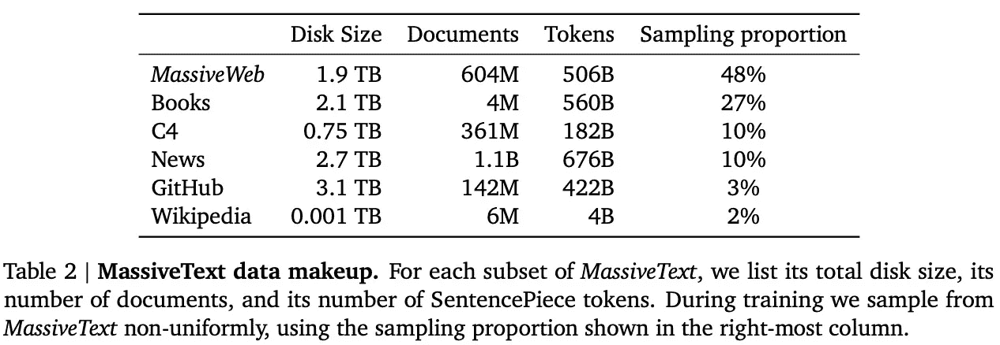

(来自[2])

为了预先训练他们的 LLM，作者构建了一个新的海量文本语料库，其中包含超过 2.3 万亿个标记；见上表。相比之下，用于训练 GPT-3 的基于 CommonCrawl 的语料库包含不到 500 个单词。因此，在[2]中用于预训练的数据集比我们在以前的工作中看到的任何语料库都大得多。

[2]中使用的确切训练策略取决于被训练的 LLM 的大小，但是作者采用了数据、模型和管道并行训练的不同组合来最大化预训练吞吐量。除了使用相对位置编码和 RMSNorm [8](而不是 [LayerNorm](https://leimao.github.io/blog/Layer-Normalization/) )之外，LLM 使用的底层架构与 GPT-3 相同。

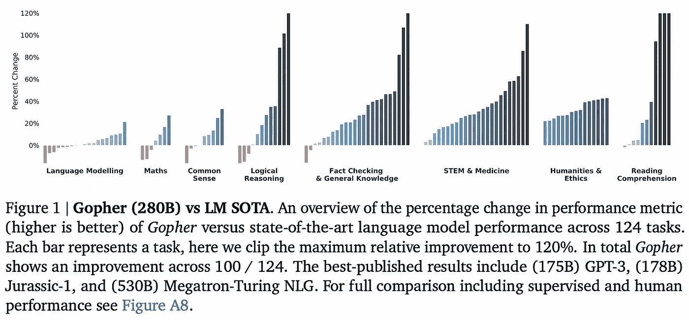

(来自[2])

与 MT-NLG [1]不同，[2]中的结果向我们展示了使用更大的 LLM 可以获得显著的好处。然而，为了实现这些性能优势，*大型 LLM 必须在更大、更高质量的语料库上进行预训练*。当评估[2]中最大的 LLMs 一个名为 Gopher 的 2800 亿参数模型——时，我们看到 152 个考虑的任务中有 81%有性能改进。上图提供了这些性能改进的更详细的概述。

在语言建模任务上，Gopher 的性能与 GPT-3 相似。在其他任务上，我们可以看到，最大的绩效改善发生在知识密集型任务上，如阅读理解和事实核对；见下文。

(来自[2])

尽管 Gopher 在事实检查方面优于最先进的基线，但我们应该注意到，对于阅读理解，LLM 的少数镜头性能再次远远落后于人类和监督学习的性能。简单地缩放模型和语料库规模(不幸的是)不足以让基础模型超越特定任务技术的性能——监督学习仍然占主导地位。

需要推理的任务(如数学、逻辑推理、常识推理等。)，我们看到较大的模型没有提供任何好处。事实上，Gopher 在这类任务上甚至优于以前的 LLM(以及一些正在考虑的较小的 LLM)。与基于知识的任务相比，*推理密集型任务似乎从模型规模中获益更少*。

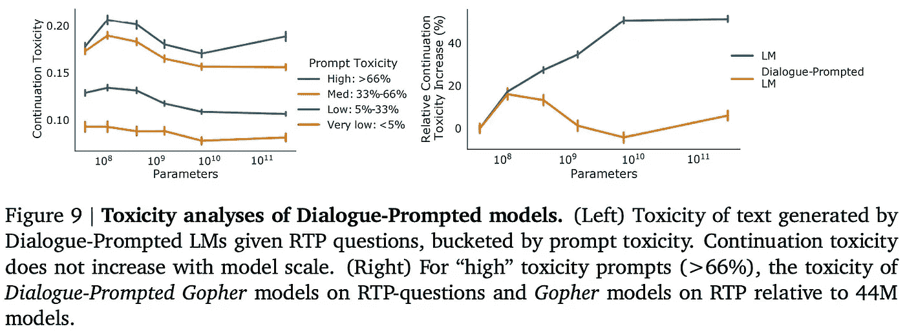

(来自[2])

[2]中的作者广泛研究了 Gopher 是否倾向于有偏见或有毒的行为。有趣的是，这样的结果向我们揭示，当提供给模型的提示本身有毒时，Gopher 经常发出有毒的文本；见上文。此外，这种影响随着规模而增加，其中较大的模型对毒性提示的反应更大。

(来自[2])

Gopher 还对某些社会群体的少数族裔有偏见，详见下图。然而，尽管有这样的发现，作者强调目前评估 LLM 偏倚和公平性的方法是有限的。相对于现有的社会规范，分析和改善 LLM 的行为是一个活跃和流行的研究领域。

# [侏罗纪-1:技术细节和评估](https://uploads-ssl.webflow.com/60fd4503684b466578c0d307/61138924626a6981ee09caf6_jurassic_tech_paper.pdf) [3]

除了增加类似 GPT-3 的 LLM 的尺寸，我们可以考虑不同形状的类似尺寸的模型。例如，研究人员在[3]中研究了一个名为 Jurassic-1 的 1780 亿参数解码器专用 LLM。该模型与 GPT-3 非常相似，但它略大，层数更少(即 76 层而不是 96 层)。考虑到层的减少，每层的宽度(即，每个[自关注头](https://cameronrwolfe.substack.com/i/76273144/self-attention)的隐藏尺寸)增加，产生在参数数量方面类似大小的模型。

(摘自[6])

Jurassic-1 的改进架构遵循了之前研究 LLM 深度和宽度之间权衡的工作[6]的建议。这项工作检查了不同深度的 LLM，并分析了模型深度和参数总数方面的性能。有趣的是，我们在这个分析中看到，LLM 的最佳深度随着它的大小而变化。只有当模型足够大，并且可以根据参数总数准确预测最佳深度时，使用更深的 LLM 才有意义；见上图。

[3]中的作者根据[6]中的经验预测选择侏罗纪-1 的深度；下面是该模型与 GPT-3 的结构比较。

(来自[3])

[3]中的作者还探索了使用多词标记，并增加了底层标记器的词汇量。这一变化极大地提高了标记的效率，意味着给定的句子或文本片段可以使用更少的标记进行编码。这里的基本思想是，减少模型的输入令牌数可以提高其效率——我们只是在处理一个更短的输入序列！要了解更多关于记号赋予器的信息，请点击这里的文章。

另外，更好的令牌效率意味着我们可以在提示中提供更多的[上下文示例](https://cameronrwolfe.substack.com/i/88082618/language-models-are-few-shot-learners)！这是因为像 Jurassic-1 和 GPT-3 这样的模型有一个最大的上下文长度，或者可以包含在输入中的标记数。如果我们有更好的令牌效率，我们可以将更多的数据放入相同的上下文长度中。下图说明了利用更多上下文相关示例的影响。

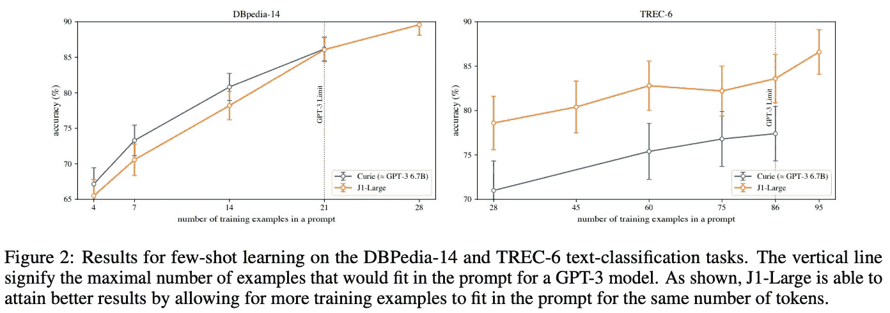

(摘自[3])

在执行文本生成时，令牌效率的提高带来了最大的不同——提高了 23%,文本生成需要以连续的方式单独生成每个令牌。训练和批量推理(例如，对一批示例运行一次正向传递)也分别加快了 1.5%和 7%。

侏罗纪 1 号的训练程序与 GPT 3 号非常接近。正如我们在之前的工作中所看到的，用于训练模型的优化器的状态(即，在优化过程中使用的所有模型参数及其相关统计数据)必须跨多个 GPU 和计算节点划分，因为由于模型的大小，该状态太大而不能存储在中央位置。

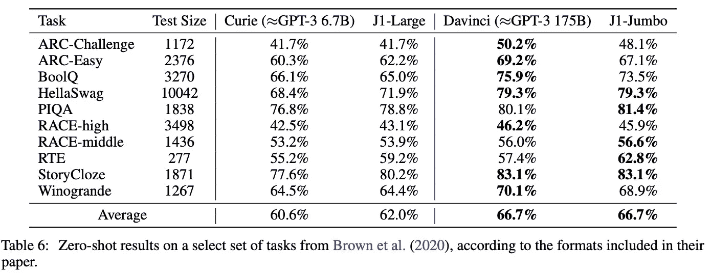

(来自[3])

使用随出版物一起发布的[公开测试套件](https://github.com/AI21Labs/lm-evaluation)对模型进行评估。这些设置中的大多数都是从 GPT-3 的评估中采用的，我们在上面显示的结果中看到，侏罗纪-1 在大多数情况下与 GPT-3 的表现相似。然而,[3]中的作者大多考虑零炮情况下的评估，声称设置比少炮评估更简单和确定。

总的来说，这项工作的主要价值似乎在于它对底层记号赋予器的修改。我们似乎并没有从训练一个肤浅但广泛的模型中获得任何巨大的好处。虽然使用更大的令牌词汇表会增加模型的内存使用量(即，因为我们必须存储更大的[嵌入层](https://cameronrwolfe.substack.com/i/88082618/language-modeling-at-a-glance)的所有参数)，但提高的令牌效率确实很有价值，因为它允许使用更多的上下文示例，并在几个方面提高了 LLM 效率。

# [培训计算优化 LLMs](https://arxiv.org/abs/2203.15556) [4]

为了最大化 LLM 的性能，之前对缩放趋势的分析[9]表明，我们应该尽可能地扩大模型的大小(即，非嵌入参数的数量)，同时缩小基础预训练数据集的大小(特别是通过 N^{0.74}的因子，其中 n 是我们模型中的参数数量)。这种对大规模 LMs 行为的分析启发了后来的工作，如 GPT-3，它在任务无关的少数镜头性能方面实现了突破性的改进。

由于 GPT-3 令人难以置信的效用，最近的研究，如我们在本帖中看到的工作，已经探索了更大的 LLM(例如，在 NLG 山高达 530B 的参数！).这些模型倾向于遵循[9]的建议——它们使用一个非常大的模型，但不会将底层数据集的大小增加到类似的程度。

有趣的是,[4]中的研究发现，这种扩展 LLM 的方法是次优的。相反，为了以计算优化的方式训练 LLM(即，在固定量的计算成本下实现最大性能)，我们在[4]中看到，LLM 和底层预训练语料库的规模应该相等地增加。简单地说，这意味着，相对于现有的工作，我们应该在更多的数据上训练 LLMs 见下文。

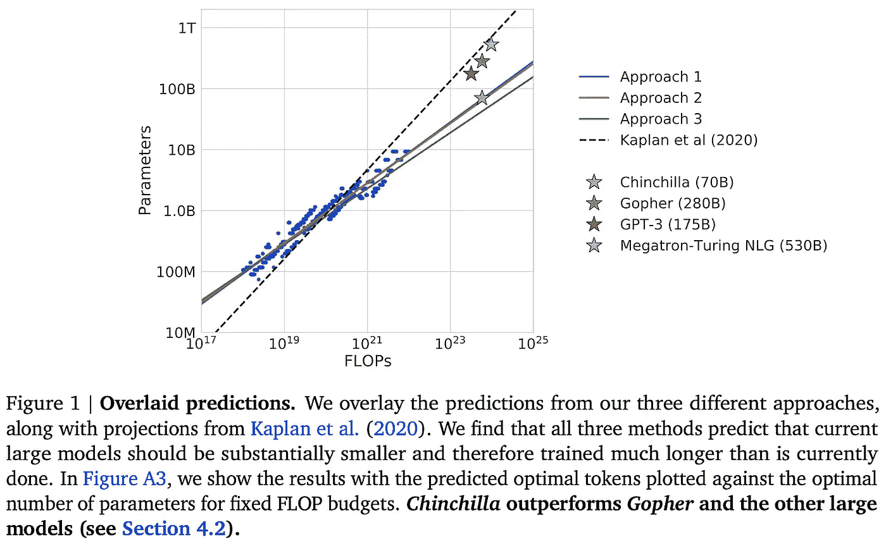

(摘自[4])

直观上，这种方法是有意义的，正如我们在 Gopher 出版物[2]中看到的那样，与 MT-NLG [1]等主要关注模型规模的模型相比，使用更大的预训练语料库和更大的模型可以产生更明显的性能优势。

为了使这种缩放过程更加具体，[4]考虑了不同大小的 LLM(即，从 7000 万到 160 亿个参数)N 和用于训练它们的令牌数 d。这里，我们应该记住，由于预训练数据的原始量，现代 LLM 是针对< 1 个时期(即，没有单个示例出现两次)进行训练的。在预训练期间观察到的记号的数量等于数据集的大小。

通过使用 N 和 D 的许多不同组合来训练 LLM，我们可以遵循类似于[8]的方法，尝试发现一个幂律，该幂律可以预测 LLM 的测试损耗，作为 N 和 D 的函数。在[4]中，作者训练了 400 多个 LLM，并做到了这一点。通过对这些模型的分析，我们可以找出 N 和 D 的什么组合最适合不同的计算预算。

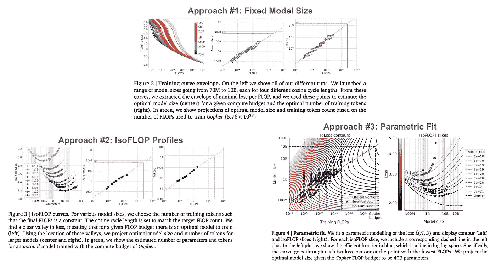

(摘自[4])

有趣的是，我们在这些实验中看到，训练的最佳方法与训练令牌的数量相等地缩放模型的大小。这与之前的分析相矛盾，之前的分析认为数据集的比例应小于模型大小[9]。然而，作者通过三种不同的分析方法验证了这些发现，这三种方法通过不同的技术研究结垢行为(参见[4]中的第 3.1-3.3 节)。所有这些研究都预测数据和模型大小应该同等缩放；见上文。

总的来说，这些发现告诉我们，现代 LLM 是 *(i)* 超大的和 *(ii)* 没有足够的数据训练。例如,[4]中的作者预测，具有与 Gopher 相同数量参数的模型应该用比>多 20 倍的数据来训练，以达到计算优化。因此，如果我们想要正确地训练 LLM，我们将需要更多的数据！

> “预计需要的训练数据量远远超过目前用于训练大型模型的数据量，这凸显了数据集收集的重要性，以及允许模型缩放的工程改进。”
> 
> —来自[4]

为了验证这些发现，作者训练了一个 700 亿参数的 LLM，称为 Chinchilla。与以前的模型相比，龙猫更小，但它在预训练期间观察到更多的数据；见下文。数据集和评估策略与 Gopher 出版物[2]相同。

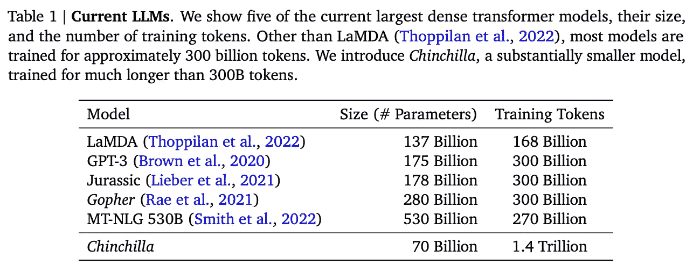

(摘自[4])

在对 Chinchilla 的评估中，我们看到该模型优于 Gopher 之类的大型 LLM，尽管包含的参数少了 4 倍！

(摘自[4])

该模型在大范围的任务中进行评估，并与其他几种现代 LLM 进行比较；见下文。在所有情况下，它的性能相当于或优于其他最先进的 LLM，表明模型比例可能没有我们最初认为的那么重要-预训练数据集的大小也很重要！

(摘自[4])

# 外卖食品

随着 GPT 协议 3 的提出，我们看到了通过增大 LLM 可以获得很多好处。然而，我们在这个概述中提出的问题是，模型比例是否是我们所有问题的答案。总的来说，我们已经知道，使 LLM 更大并不是实现改进的任务无关性能的唯一必要组成部分。另外，它也有一些缺点。主要的要点总结如下。

更大的 LLMs =更多的工程工作。随着 LLM 尺寸的增长，它们变得越来越难以处理。我们已经在 GPT-3 中看到了这一点的证明——训练一个具有 1750 亿个参数的模型需要不同分布式训练技术的组合，这是一项重大的工程壮举。对于更大的模型，如 MT-NLG，训练过程变得更加复杂。最近的努力[已经降低了训练 LLM 的成本](https://www.mosaicml.com/blog/gpt-3-quality-for-500k)，但是训练和部署这些模型所需的工程努力仍然是巨大的。

**数据很重要。**扩大 LLM 的规模最初似乎是实现更好性能的首选方法。GPT 3 太棒了，*为什么不把它做得更大一点呢*？然而，一旦我们看到随着模型变大，性能平台有所改善，我们就知道对更多数据进行训练也是非常重要的。LLM 性能的最大改进(例如，Gopher 和 Chinchilla [2，4])是通过模型和数据集缩放的组合实现的(比例大致相等)。

**深度还是宽度？**这是一个不太重要的发现，但似乎当前的研究[6]告诉我们，go-to LLM 架构可能比它们需要的更深入一些。在某些情况下，可能更有意义的做法是使它们变浅一点，并将保存的参数投资到每层的宽度中。

监督下的表演至高无上。尽管我们观察到 LLM 带来了难以置信的与任务无关的性能优势，但我们必须正确看待这些结果。我们从这篇综述的研究中看到，这些技术仍然达不到监督训练的效果。在很多情况下，我们仍然可以通过特定于任务的微调来获得显著的性能优势。尽管与任务无关的基础模型是一个很好的想法，但在我们能够在实际应用中利用这些模型而不执行任何特定于任务的调整之前，可能还需要一段时间。*如果能让我们的表现好得多，为什么不稍微调整一下呢*？

## 结束语

非常感谢你阅读这篇文章。如果你喜欢它，请在 [twitter](https://twitter.com/cwolferesearch) 上关注我，或者订阅我的[深度(学习)焦点时事通讯](https://cameronrwolfe.substack.com/)，在那里我挑选了一个关于深度学习研究的单个两周一次的主题，提供了对相关背景信息的理解，然后概述了一些关于该主题的流行论文。我是 [Cameron R. Wolfe](https://cameronrwolfe.me/) ，ale gion[的研究科学家，莱斯大学的博士生，研究深度学习的经验和理论基础。你也可以看看我在 medium 上的](https://www.alegion.com/)[其他著述](https://medium.com/@wolfecameron)！

## **参考书目**

[1] Smith，Shaden 等，“利用 deepspeed 和威震天训练威震天-图灵 nlg 530b，一个大规模生成语言模型。”arXiv 预印本 arXiv:2201.11990 (2022)。

[2] Rae，Jack W .等人，“缩放语言模型:方法、分析和来自训练地鼠的洞察力。”arXiv 预印本 arXiv:2112.11446 (2021)。

[3] Lieber，o .等人，“侏罗纪-1:技术细节和评估，白皮书，AI21 实验室，2021 年。”

[4] Hoffmann，Jordan 等人，“训练计算机优化的大型语言模型”arXiv 预印本 arXiv:2203.15556 (2022)。

[5]高，李奥等，“一个 800gb 的多元文本语言模型集”arXiv 预印本 arXiv:2101.00027 (2020)。

[6] Levine，Yoav 等人，“自我注意深度效率的限制”神经信息处理系统进展 33(2020):22640–22651。

[7]布朗、汤姆等人，“语言模型是一次性学习者。”神经信息处理系统进展 33(2020):1877–1901。

[8]张和森里奇。均方根层归一化。arXiv 预印本 arXiv:1910.07467，2019。

[9]卡普兰，贾里德等人，“神经语言模型的标度律。”arXiv 预印本 arXiv:2001.08361 (2020)。