# 基于神经网络的现代推荐系统

> 原文：<https://towardsdatascience.com/modern-recommendation-systems-with-neural-networks-3cc06a6ded2c>


作者图片

## 使用 Python 和 TensorFlow 构建混合模型

## 摘要

在本文中，我将展示如何使用 Python 和 TensorFlow 构建具有神经网络的现代推荐系统。


亚历山大·沙托夫在 [Unsplash](https://unsplash.com?utm_source=medium&utm_medium=referral) 上拍摄的照片

[**推荐系统**](https://en.wikipedia.org/wiki/Recommender_system) 是预测用户对多个产品偏好的模型。它们被用于各种领域，如视频和音乐服务、电子商务和社交媒体平台。

最常见的方法利用产品特征(基于内容)、用户相似性(协作过滤)、个人信息(基于知识)。然而，随着神经网络的日益普及，公司已经开始尝试将它们结合在一起的新的混合推荐系统。

在本教程中，我将展示如何使用传统模型，以及如何从头开始构建一个现代推荐系统。我将展示一些有用的 Python 代码，这些代码可以很容易地应用于其他类似的情况(只需复制、粘贴、运行)，并通过注释遍历每一行代码，以便您可以复制这个示例(下面是完整代码的链接)。

[](https://github.com/mdipietro09/DataScience_ArtificialIntelligence_Utils/blob/master/machine_learning/example_recommendation.ipynb) [## data science _ artificial intelligence _ Utils/example _ re commendation . ipynb at master…

### 数据科学项目和人工智能用例的示例…

github.com](https://github.com/mdipietro09/DataScience_ArtificialIntelligence_Utils/blob/master/machine_learning/example_recommendation.ipynb) 

我将使用由 [GroupLens Research](https://en.wikipedia.org/wiki/GroupLens_Research) 创建的 **MovieLens** 数据集，该数据集包含数百名用户评价的数千部电影(链接如下)。

[](https://grouplens.org/datasets/movielens/latest/) [## MovieLens 最新数据集

### 这些数据集会随着时间的推移而变化，不适合用于报告研究结果。我们将保留下载…

grouplens.org](https://grouplens.org/datasets/movielens/latest/) 

特别是，我将经历:

*   设置:导入包、读取数据、预处理
*   冷启动问题
*   使用 *tensorflow* 和 *numpy* 的基于内容的方法
*   使用 *tensorflow/keras 的传统协同过滤和神经协同过滤*
*   具有 *tensorflow/keras* 的混合(上下文感知)模型

## 设置

首先，我将导入以下**包**:

```
**## for data**
import **pandas** as pd
import **numpy** as np
import **re**
from **datetime** import datetime**## for plotting**
import **matplotlib**.pyplot as plt
import **seaborn** as sns**## for machine learning**
from **sklearn** import metrics, preprocessing**## for deep learning**
from **tensorflow**.keras import models, layers, utils  **#(2.6.0)**
```

然后我将读取**数据**，包括产品数据(本例中为电影)和用户数据。

```
dtf_products = pd.read_excel("data_movies.xlsx", sheet_name="products")
```

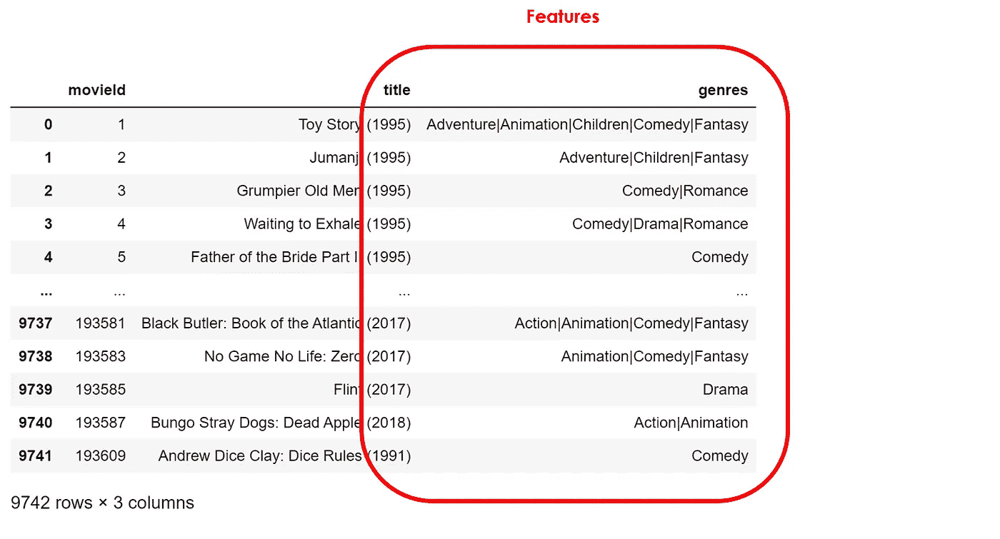

作者图片

在 product 表中，每行代表一个项目，右边的两列包含它的特性，这些特性是静态的(您可以将其视为电影元数据)。让我们读取用户数据:

```
dtf_users = pd.read_excel("data_movies.xlsx", sheet_name="users").head(10000)
```

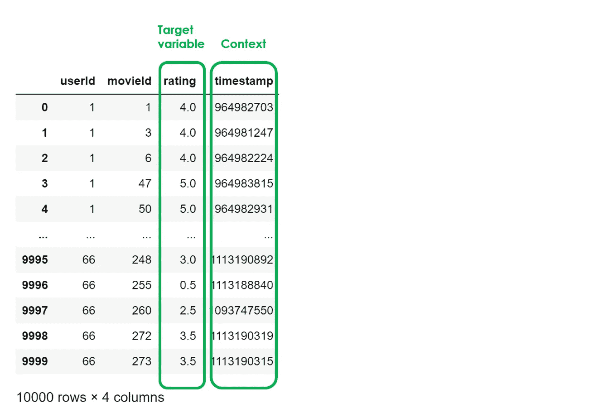

作者图片

这个表格的每一行都是一对用户-产品，显示用户对产品的评分，这是**目标变量**。显然，并不是每个用户都看过所有的产品。事实上，这就是为什么我们需要推荐系统。他们必须预测用户会给新产品什么样的评价，如果预测的评价是高/积极的，那么就推荐它。此外，这里还有一些关于目标变量上下文的信息(当用户给出评级时)。

让我们做一些**数据清理**和**特征工程**来更好地理解我们拥有什么以及我们如何使用它。

```
**# Products**
dtf_products = dtf_products[~dtf_products["genres"].isna()]dtf_products["product"] = range(0,len(dtf_products))dtf_products["name"] = dtf_products["title"].apply(lambda x: re.sub("[\(\[].*?[\)\]]", "", x).strip())dtf_products["date"] = dtf_products["title"].apply(lambda x: int(x.split("(")[-1].replace(")","").strip()) 
if "(" in x else np.nan)dtf_products["date"] = dtf_products["date"].fillna(9999)
dtf_products["old"] = dtf_products["date"].apply(lambda x: 1 if x < 2000 else 0) **# Users**
dtf_users["user"] = dtf_users["userId"].apply(lambda x: x-1)dtf_users["timestamp"] = dtf_users["timestamp"].apply(lambda x: datetime.fromtimestamp(x))dtf_users["daytime"] = dtf_users["timestamp"].apply(lambda x: 1 if 6<int(x.strftime("%H"))<20 else 0)dtf_users["weekend"] = dtf_users["timestamp"].apply(lambda x: 1 if x.weekday() in [5,6] else 0)dtf_users = dtf_users.merge(dtf_products[["movieId","product"]], how="left")dtf_users = dtf_users.rename(columns={"rating":"y"}) **# Clean**
dtf_products = dtf_products[["product","name","old","genres"]].set_index("product")dtf_users = 
dtf_users[["user","product","daytime","weekend","y"]]
```


作者图片

请注意，我从*时间戳*列中提取了 2 个上下文变量:*白天*和*周末*。我将把它们保存到数据帧中，因为我们以后可能需要它们。

```
dtf_context = dtf_users[["user","product","daytime","weekend"]]
```

关于产品，下一步是创建*产品-特性*矩阵:

```
tags = [i.split("|") for i in dtf_products["genres"].unique()]
columns = list(set([i for lst in tags for i in lst]))
columns.remove('(no genres listed)')for col in columns:
    dtf_products[col] = dtf_products["genres"].apply(lambda x: 1 if col in x else 0)
```


作者图片

矩阵是稀疏的，因为大多数产品没有所有的功能。让我们把它形象化，以便更好地理解情况。

```
fig, ax = plt.subplots(figsize=(20,5))
sns.heatmap(dtf_products==0, vmin=0, vmax=1, cbar=False, ax=ax).set_title("Products x Features")
plt.show()
```


作者图片

对于*用户-产品*矩阵，稀疏性变得更糟:

```
tmp = dtf_users.copy()
dtf_users = tmp.pivot_table(index="user", columns="product", values="y")
missing_cols = list(set(dtf_products.index) - set(dtf_users.columns))
for col in missing_cols:
    dtf_users[col] = np.nan
dtf_users = dtf_users[sorted(dtf_users.columns)]
```


作者图片


作者图片

深入模型之前的最后一步是**预处理**。因为我们将处理神经网络，所以缩放数据总是好的实践。

```
dtf_users = pd.DataFrame(preprocessing.MinMaxScaler(feature_range=(0.5,1)).fit_transform(dtf_users.values), 
columns=dtf_users.columns, index=dtf_users.index)
```


作者图片

最后，我们将数据分成*训练*和*测试*组。我将垂直拆分数据集，这样所有用户都将参加*培训*和*测试*，而 80%的产品用于培训，20%用于测试。像这样:

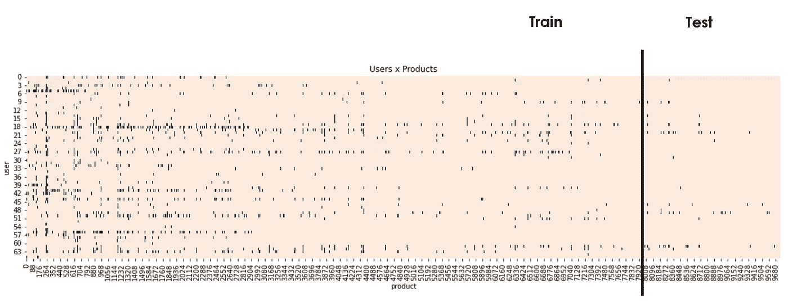

作者图片

```
split = int(0.8*dtf_users.shape[1])
dtf_train = dtf_users.loc[:, :split-1]
dtf_test = dtf_users.loc[:, split:]
```

好了，现在我们可以开始了…也许吧。

## 冷启动

想象一下，拥有一个全新的类似网飞的应用程序，第一个用户订阅。我们需要能够提供建议，而不依赖于用户以前的互动，因为还没有记录。当一个用户(或一个产品)是新的，我们就有了 [**冷启动问题**](https://en.wikipedia.org/wiki/Cold_start_(recommender_systems)) 。这个系统无法在用户和产品之间建立任何联系，因为它没有足够的数据。

为了解决这个问题，主要的技术是**基于知识的方法**:例如，询问用户的偏好以创建初始简档，或者使用人口统计信息(即青少年的高中节目和儿童的卡通)。

如果只有几个用户，可以使用基于内容的方法。然后，当我们有足够的评级(即每个用户至少 10 个产品，总用户超过 100 个)时，可以应用更复杂的模型。

## 基于内容

[**基于内容的方法**](https://en.wikipedia.org/wiki/Recommender_system#Content-based_filtering) 是基于产品内容。例如，如果*用户 A* 喜欢*产品 1、*和*产品 2* 与*产品 1* 相似，那么*用户 A* 可能也会喜欢*产品 2* 。如果两个产品具有相似的特征，则它们是相似的。

简而言之，这种想法是用户实际上对产品的功能而不是产品本身进行评级。换个角度说，如果我喜欢音乐和艺术相关的产品，那是因为我喜欢那些特性(音乐和艺术)。基于此，我们可以估计我有多喜欢具有相同功能的其他产品。这种方法最适合于已知产品数据但不知道用户数据的情况。

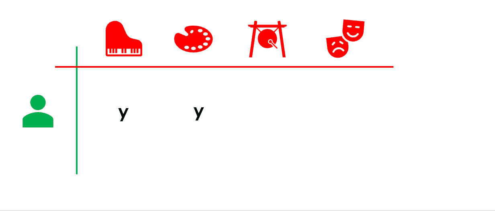

作者图片

让我们从数据中挑选一个用户作为我们第一个已经使用了足够多产品的用户的例子，让我们创建*训练*和*测试*向量。

```
**# Select a user**
i = 1
train = dtf_train.iloc[i].to_frame(name="y")
test = dtf_test.iloc[i].to_frame(name="y")**# add all the test products but hide the y**
tmp = test.copy()
tmp["y"] = np.nan
train = train.append(tmp)
```

现在我们需要估计用户给每个特性的权重。我们有*用户-产品*向量和*产品-特性*矩阵。

```
**# shapes**
usr = train[["y"]].fillna(0).values.T
prd = dtf_products.drop(["name","genres"],axis=1).values
print("Users", usr.shape, " x  Products", prd.shape)
```


通过将这两个对象相乘，我们获得了一个*用户特征*向量，其中包含了用户给每个特征的估计权重。这些权重应重新应用于*产品-功能*矩阵，以获得预测评级。

```
**# usr_ft(users,fatures) = usr(users,products) x prd(products,features)**
usr_ft = np.dot(usr, prd)**# normalize**
weights = usr_ft / usr_ft.sum()**# predicted rating(users,products) = weights(users,fatures) x prd.T(features,products)**
pred = np.dot(weights, prd.T)test = test.merge(pd.DataFrame(pred[0], columns=["yhat"]), how="left", left_index=True, right_index=True).reset_index()
test = test[~test["y"].isna()]
test
```

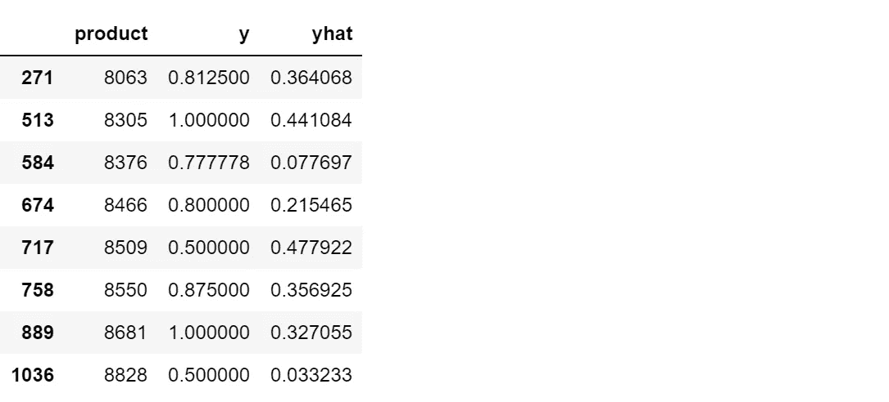

作者图片

如你所见，我使用简单的 *numpy 开发了这个简单的方法。*只使用 raw *tensorflow* 也可以做到这一点:

```
import tensorflow as tf**# usr_ft(users,fatures) = usr(users,products) x prd(products,features)**
usr_ft = tf.matmul(usr, prd)**# normalize**
weights = usr_ft / tf.reduce_sum(usr_ft, axis=1, keepdims=True)**# rating(users,products) = weights(users,fatures) x prd.T(features,products)**
pred = tf.matmul(weights, prd.T)
```

如何**评价**我们的预测推荐？我通常使用[精确度](https://en.wikipedia.org/wiki/Accuracy_and_precision)和[平均倒数排名(MRR)](https://en.wikipedia.org/wiki/Mean_reciprocal_rank) 。后者是一种统计度量，用于评估任何按正确概率排序的可能响应列表。

```
def **mean_reciprocal_rank**(y_test, predicted):
    score = []
    for product in y_test:
        mrr = 1 / (list(predicted).index(product) + 1) if product 
        in predicted else 0
        score.append(mrr)
    return np.mean(score)
```

请注意，指标会根据我们推荐的产品数量而变化。因为我们将预测的*前 k 个*项目与*测试*集中的项目进行比较，所以顺序也很重要。

```
print("--- user", i, "---")top = 5
y_test = test.sort_values("y", ascending=False)["product"].values[:top]
print("y_test:", y_test)predicted = test.sort_values("yhat", ascending=False)["product"].values[:top]
print("predicted:", predicted)true_positive = len(list(set(y_test) & set(predicted)))
print("true positive:", true_positive, "("+str(round(true_positive/top*100,1))+"%)")
print("accuracy:", str(round(**metrics**.**accuracy_score**(y_test,predicted)*100,1))+"%")
print("mrr:", **mean_reciprocal_rank**(y_test, predicted))
```


作者图片

我们得到了 4 个正确的产品，但订单不匹配。这就是为什么准确性和 MRR 低。

```
**# See predictions details**
test.merge(
       dtf_products[["name","old","genres"]], left_on="product", 
       right_index=True
).sort_values("yhat", ascending=False)
```


作者图片

## 协同过滤

[](https://en.wikipedia.org/wiki/Collaborative_filtering)**协同过滤是基于相似用户喜欢相似产品的假设。例如，如果*用户 A* 喜欢*产品 1* ，并且*用户 B* 与*用户 A* 相似，那么*用户 B* 可能也会喜欢*产品 1* 。两个用户喜欢相似的产品，就是相似的。**

**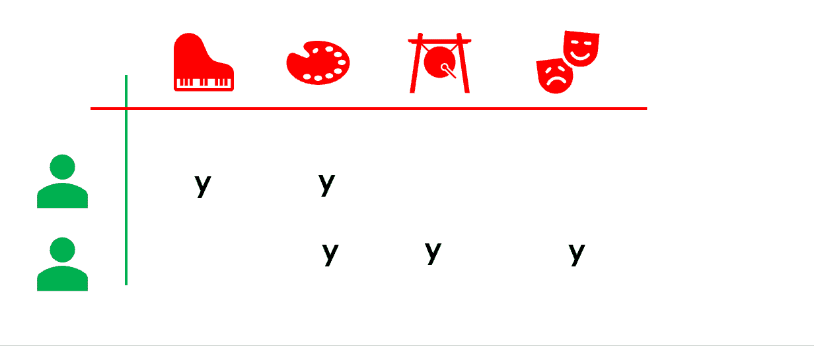**

**作者图片**

**这种方法不需要产品特性就能起作用，相反，它需要来自许多用户的许多评级。继续我们平台的例子，想象我们的第一个用户不再孤单，我们有足够的用户来应用这个模型。**

**当网飞在 2009 年举办了一场最佳算法的公开比赛，人们提出了几种实现方式时，协同过滤开始流行起来。它们可以分为两类:**

*   ****基于记忆—** 用相关度寻找相似用户，[余弦相似度](https://en.wikipedia.org/wiki/Cosine_similarity)，以及[聚类](https://en.wikipedia.org/wiki/Cluster_analysis)。**
*   ****基于模型—** 通过应用监督机器学习和[矩阵分解](https://en.wikipedia.org/wiki/Matrix_factorization_(recommender_systems))来预测用户将如何评价某个产品，矩阵分解将大的*用户-产品*矩阵分解为两个较小的因子，分别代表*用户*矩阵和*产品*矩阵。**

**在 Python 中，对用户最友好的包是 [*surprise*](https://pypi.org/project/scikit-surprise/) ，这是一个简单的库，用于构建和分析具有显式评级数据的推荐系统(类似于 *scikit-learn* )。它既可以用于基于记忆的方法，也可以用于基于模型的方法。或者，可以使用 *tensorflow/keras* 为更复杂的基于模型的方法创建嵌入，这正是我要做的。**

**首先，我们需要以下形式的数据:**

```
train = dtf_train.stack(dropna=True).reset_index().rename(columns={0:"y"})
train.head()
```

****

**作者的图片(对测试集做同样的事情)**

**主要思想是利用神经网络的嵌入层来创建*用户*和*产品*矩阵。重要的是要理解输入是用户-产品对，输出是评级。当预测一对新的用户-产品时，该模型将在*用户*嵌入空间中查找用户，在*产品*空间中查找产品。因此，您需要提前指定用户和产品的总数。**

```
embeddings_size = 50
usr, prd = dtf_users.shape[0], dtf_users.shape[1] **# Users (1,embedding_size)**
xusers_in = layers.Input(name="xusers_in", shape=(1,))xusers_emb = layers.Embedding(name="xusers_emb", input_dim=usr, output_dim=embeddings_size)(xusers_in)xusers = layers.Reshape(name='xusers', target_shape=(embeddings_size,))(xusers_emb) **# Products (1,embedding_size)**
xproducts_in = layers.Input(name="xproducts_in", shape=(1,))xproducts_emb = layers.Embedding(name="xproducts_emb", input_dim=prd, output_dim=embeddings_size)(xproducts_in)xproducts = layers.Reshape(name='xproducts', target_shape=(embeddings_size,))(xproducts_emb) **# Product (1)**
xx = layers.Dot(name='xx', normalize=True, axes=1)([xusers, xproducts]) **# Predict ratings (1)**
y_out = layers.Dense(name="y_out", units=1, activation='linear')(xx) **# Compile**
model = models.Model(inputs=[xusers_in,xproducts_in], outputs=y_out, name="CollaborativeFiltering")
model.compile(optimizer='adam', loss='mean_absolute_error', metrics=['mean_absolute_percentage_error'])
```

**请注意，我通过使用[平均绝对误差](https://en.wikipedia.org/wiki/Mean_absolute_error)作为损失，将此用例视为回归问题，即使我们毕竟不需要分数本身，而是需要预测产品的排序。**

```
utils.plot_model(model, to_file='model.png', show_shapes=True, show_layer_names=True)
```

**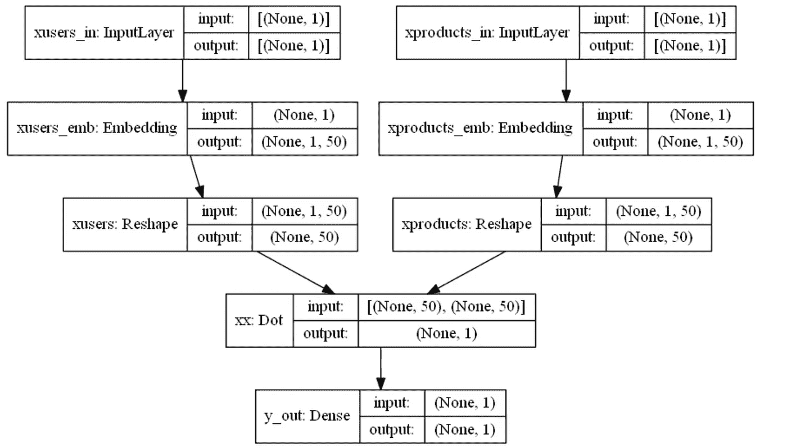**

**作者图片**

**让我们**训练和测试**模型。**

```
**# Train**
training = model.fit(x=[train["user"], train["product"]], y=train["y"], epochs=100, batch_size=128, shuffle=True, verbose=0, validation_split=0.3)model = training.model**# Test** test["yhat"] = model.predict([test["user"], test["product"]])
test
```

**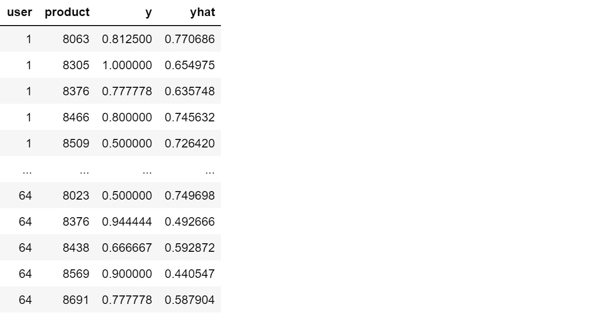**

**作者图片**

**我们可以通过比较为我们亲爱的第一个用户生成的推荐来评估这些预测(与前面的代码相同):**

****

**作者图片**

**目前，所有最先进的推荐系统都利用了深度学习。特别地，**神经协同过滤** (2017)结合了来自神经网络的非线性和矩阵分解。该模型不仅用于传统的协同过滤，还用于完全连接的深度神经网络，从而充分利用嵌入空间。额外的部分应该捕获矩阵分解可能遗漏的模式和特征。**

**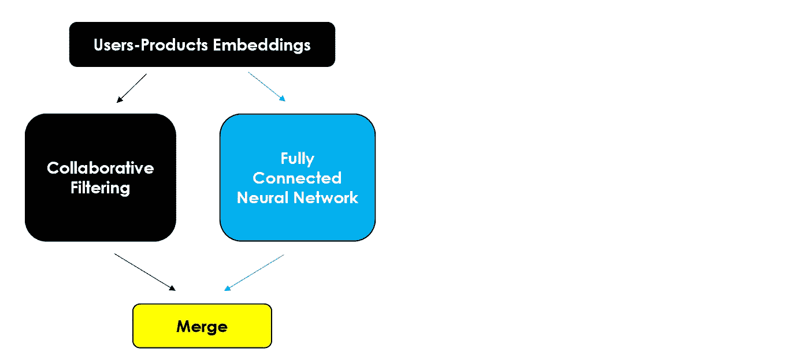**

**作者图片**

**用 Python 的术语来说:**

```
embeddings_size = 50
usr, prd = dtf_users.shape[0], dtf_users.shape[1]**# Input layer**
xusers_in = layers.Input(name="xusers_in", shape=(1,))
xproducts_in = layers.Input(name="xproducts_in", shape=(1,)) **# A) Matrix Factorization
## embeddings and reshape**
cf_xusers_emb = layers.Embedding(name="cf_xusers_emb", input_dim=usr, output_dim=embeddings_size)(xusers_in)
cf_xusers = layers.Reshape(name='cf_xusers', target_shape=(embeddings_size,))(cf_xusers_emb)**## embeddings and reshape**
cf_xproducts_emb = layers.Embedding(name="cf_xproducts_emb", input_dim=prd, output_dim=embeddings_size)(xproducts_in)
cf_xproducts = layers.Reshape(name='cf_xproducts', target_shape=(embeddings_size,))(cf_xproducts_emb)**## product**
cf_xx = layers.Dot(name='cf_xx', normalize=True, axes=1)([cf_xusers, cf_xproducts]) **# B) Neural Network**
**## embeddings and reshape**
nn_xusers_emb = layers.Embedding(name="nn_xusers_emb", input_dim=usr, output_dim=embeddings_size)(xusers_in)
nn_xusers = layers.Reshape(name='nn_xusers', target_shape=(embeddings_size,))(nn_xusers_emb)**## embeddings and reshape**
nn_xproducts_emb = layers.Embedding(name="nn_xproducts_emb", input_dim=prd, output_dim=embeddings_size)(xproducts_in)
nn_xproducts = layers.Reshape(name='nn_xproducts', target_shape=(embeddings_size,))(nn_xproducts_emb)**## concat and dense**
nn_xx = layers.Concatenate()([nn_xusers, nn_xproducts])
nn_xx = layers.Dense(name="nn_xx", units=int(embeddings_size/2), activation='relu')(nn_xx) **# Merge A & B**
y_out = layers.Concatenate()([cf_xx, nn_xx])
y_out = layers.Dense(name="y_out", units=1, activation='linear')(y_out)**# Compile**
model = models.Model(inputs=[xusers_in,xproducts_in], outputs=y_out, name="Neural_CollaborativeFiltering")
model.compile(optimizer='adam', loss='mean_absolute_error', metrics=['mean_absolute_percentage_error'])
```

**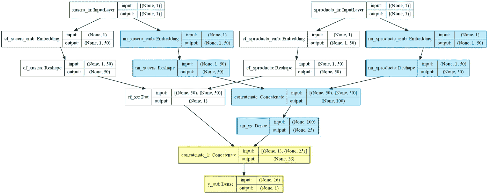**

**utils.plot_model(model，to_file='model.png '，show_shapes=True，show_layer_names=True)**

**您可以使用与以前相同的代码运行它，并检查它是否比传统的协同过滤执行得更好。**

****

**作者图片**

## **混合模型**

**让我们先回顾一下现实世界提供了什么样的数据:**

*   ****目标变量** —评级可以是显式的(即用户留下反馈)或隐式的(即如果用户看完整部电影，则假设是正面反馈)，无论如何它们都是必要的。**
*   ****产品特征** —项目(即电影类型)的标签和描述，主要用于基于内容的方法。**
*   ****用户资料** —关于用户的描述性信息可以是人口统计信息(即性别和年龄)或行为信息(即偏好、在屏幕上的平均时间、最频繁的使用时间)，通常用于基于知识的推荐。**
*   ****上下文** —关于评级情况的附加信息(即时间、地点、搜索历史)，通常也包含在基于知识的推荐中。**

**现代推荐系统在预测我们的口味时，会将它们结合起来。例如，YouTube 推荐下一个视频时，使用了谷歌知道的关于你的所有信息，而谷歌知道的很多。**

**在这个例子中，我有产品特性和关于用户何时给出评级的数据，我将把它们用作上下文(或者，它也可以用来建立用户简档)。**

```
features = dtf_products.drop(["genres","name"], axis=1).columns
print(features)context = dtf_context.drop(["user","product"], axis=1).columns
print(context)
```

****

**作者图片**

**让我们将额外信息添加到*训练*集合中:**

```
train = dtf_train.stack(dropna=True).reset_index().rename(columns={0:"y"})**## add features**
train = train.merge(dtf_products[features], how="left", left_on="product", right_index=True)**## add context**
train = train.merge(dtf_context, how="left")
```

****

**作者图片**

**请注意，您可以对*测试*集做同样的事情，但是如果您想要模拟真实的生产，您应该为上下文插入一个静态值。简单来说，如果我们在周一晚上为我们平台的用户做预测，上下文变量应该是*白天=0* 和*周末=0* 。**

**现在我们拥有了构建**上下文感知混合模型**的所有要素。神经网络的灵活性允许我们添加任何我们想要的东西，所以我将采用神经协同过滤网络结构，并尽可能多地包含模块。**

**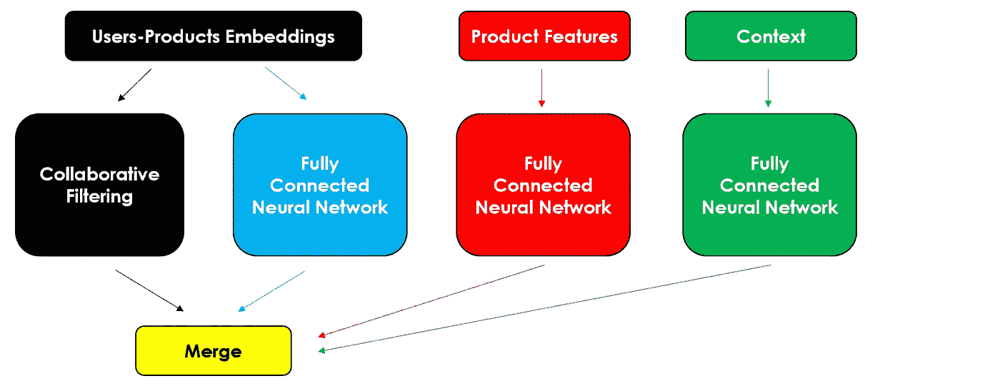**

**作者图片**

**尽管代码看起来很难，我们只是在已经使用的基础上增加了几层。**

```
embeddings_size = 50
usr, prd = dtf_users.shape[0], dtf_users.shape[1]
feat = len(features)
ctx = len(context) **################### COLLABORATIVE FILTERING ########################
# Input layer**
xusers_in = layers.Input(name="xusers_in", shape=(1,))
xproducts_in = layers.Input(name="xproducts_in", shape=(1,))**# A) Matrix Factorization
## embeddings and reshape**
cf_xusers_emb = layers.Embedding(name="cf_xusers_emb", input_dim=usr, output_dim=embeddings_size)(xusers_in)
cf_xusers = layers.Reshape(name='cf_xusers', target_shape=(embeddings_size,))(cf_xusers_emb)**## embeddings and reshape**
cf_xproducts_emb = layers.Embedding(name="cf_xproducts_emb", input_dim=prd, output_dim=embeddings_size)(xproducts_in)
cf_xproducts = layers.Reshape(name='cf_xproducts', target_shape=(embeddings_size,))(cf_xproducts_emb)**## product**
cf_xx = layers.Dot(name='cf_xx', normalize=True, axes=1)([cf_xusers, cf_xproducts])**# B) Neural Network
## embeddings and reshape**
nn_xusers_emb = layers.Embedding(name="nn_xusers_emb", input_dim=usr, output_dim=embeddings_size)(xusers_in)
nn_xusers = layers.Reshape(name='nn_xusers', target_shape=(embeddings_size,))(nn_xusers_emb)**## embeddings and reshape**
nn_xproducts_emb = layers.Embedding(name="nn_xproducts_emb", input_dim=prd, output_dim=embeddings_size)(xproducts_in)
nn_xproducts = layers.Reshape(name='nn_xproducts', target_shape=(embeddings_size,))(nn_xproducts_emb)**## concat and dense**
nn_xx = layers.Concatenate()([nn_xusers, nn_xproducts])
nn_xx = layers.Dense(name="nn_xx", units=int(embeddings_size/2), activation='relu')(nn_xx) **######################### CONTENT BASED ############################
# Product Features**
features_in = layers.Input(name="features_in", shape=(feat,))
features_x = layers.Dense(name="features_x", units=feat, activation='relu')(features_in) **######################## KNOWLEDGE BASED ###########################
# Context**
contexts_in = layers.Input(name="contexts_in", shape=(ctx,))
context_x = layers.Dense(name="context_x", units=ctx, activation='relu')(contexts_in) **########################## OUTPUT ##################################
# Merge all**
y_out = layers.Concatenate()([cf_xx, nn_xx, features_x, context_x])
y_out = layers.Dense(name="y_out", units=1, activation='linear')(y_out)**# Compile**
model = models.Model(inputs=[xusers_in,xproducts_in, features_in, contexts_in], outputs=y_out, name="Hybrid_Model")
model.compile(optimizer='adam', loss='mean_absolute_error', metrics=['mean_absolute_percentage_error'])
```

****

**utils.plot_model(model，to_file='model.png '，show_shapes=True，show_layer_names=True)**

**这种混合模型需要更多的输入，所以不要忘记输入新数据:**

```
**# Train**
training = model.fit(x=[train["user"], train["product"], **train[features]**, **train[context]**], y=train["y"], 
                     epochs=100, batch_size=128, shuffle=True, verbose=0, validation_split=0.3)model = training.model**# Test**
test["yhat"] = model.predict([test["user"], test["product"], **test[features]**, **test[context]**])
```

****

**作者图片**

**与其他方法相比，对于该特定用户，混合模型获得了最高的准确性，因为三个预测产品具有匹配的订单。**

## **结论**

**这篇文章是一个教程，展示了如何用神经网络设计和构建推荐系统。我们看到了基于数据可用性的不同用例:对单用户场景应用基于内容的方法，对多用户产品应用协作过滤。更重要的是，我们了解了如何使用神经网络来改进传统技术，并构建可以包含上下文和任何其他附加信息的现代混合推荐系统。**

**我希望你喜欢它！如有问题和反馈，或者只是分享您感兴趣的项目，请随时联系我。**

> **👉[我们来连线](https://linktr.ee/maurodp)👈**

> **本文是系列**用 Python 进行机器学习**的一部分，参见:**

**[](/deep-learning-with-python-neural-networks-complete-tutorial-6b53c0b06af0) [## Python 深度学习:神经网络(完整教程)

### 用 TensorFlow 建立、绘制和解释人工神经网络

towardsdatascience.com](/deep-learning-with-python-neural-networks-complete-tutorial-6b53c0b06af0) [](/machine-learning-with-python-classification-complete-tutorial-d2c99dc524ec) [## 用 Python 进行机器学习:分类(完整教程)

### 数据分析和可视化、特征工程和选择、模型设计和测试、评估和解释

towardsdatascience.com](/machine-learning-with-python-classification-complete-tutorial-d2c99dc524ec) [](/machine-learning-with-python-regression-complete-tutorial-47268e546cea) [## Python 机器学习:回归(完整教程)

### 数据分析和可视化、特征工程和选择、模型设计和测试、评估和解释

towardsdatascience.com](/machine-learning-with-python-regression-complete-tutorial-47268e546cea) [](/clustering-geospatial-data-f0584f0b04ec) [## 聚类地理空间数据

### 使用交互式地图绘制机器学习和深度学习聚类

towardsdatascience.com](/clustering-geospatial-data-f0584f0b04ec)**