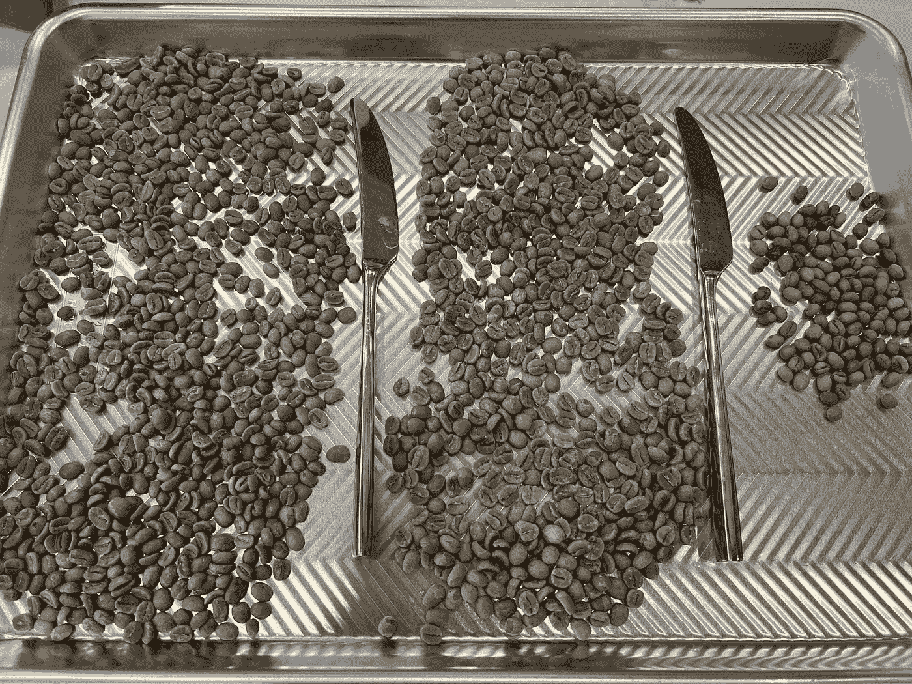
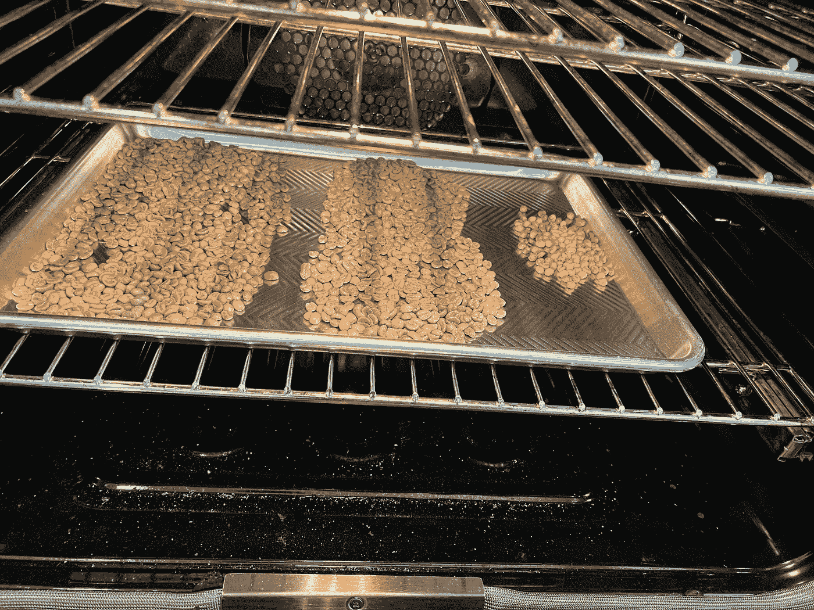
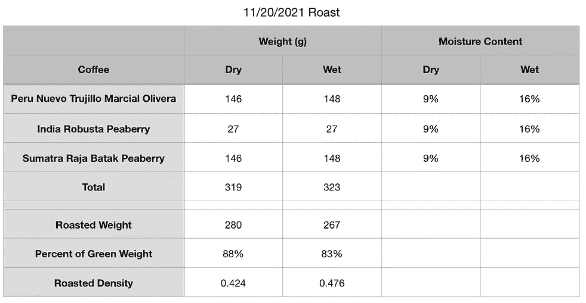
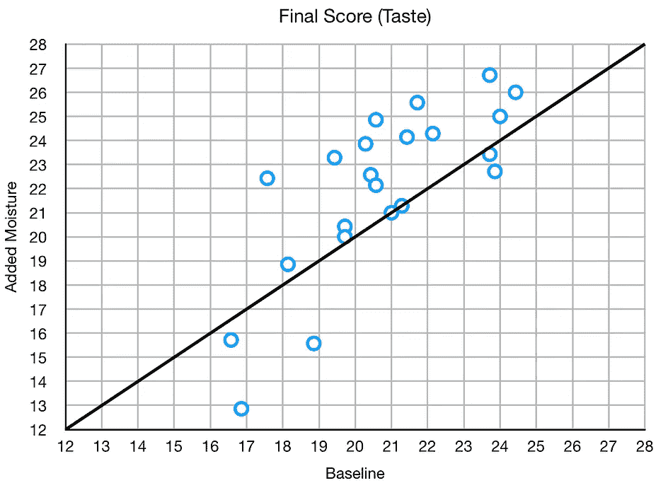
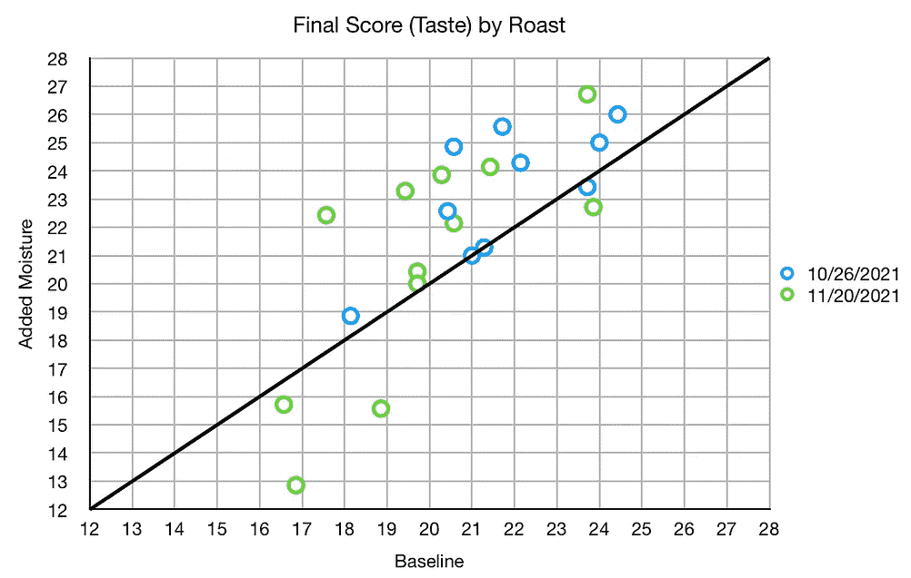
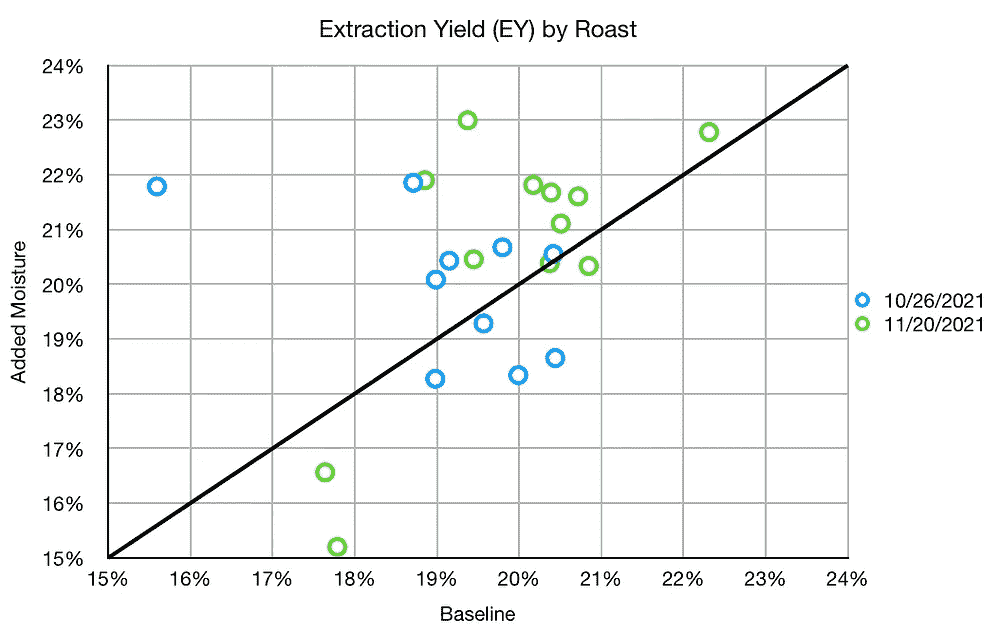
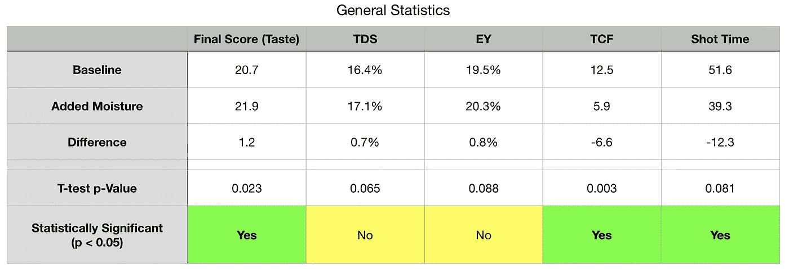

# 烘焙前保湿的绿色咖啡

> 原文：<https://towardsdatascience.com/moisturizing-green-coffee-before-roasting-4225cc949914>

## 咖啡数据科学

## 探索水分

一些烘焙师已经控制绿豆水分很长时间了。我想自己尝试一下，收集一些关于它如何影响味道和提取的数据。据我所知，绿豆中 16%的水分含量是最佳的，所以这是我的目标。

# 水分协议

Chris Feran 建议如下:

1.  测量青豆的水分
2.  添加所需量的水，以达到所需的水分含量(建议 16%)
3.  让豆子吸收最多 16 个小时，吸收最少的水分
4.  烤肉

# 添加水分

我不想购买湿度计，因为它们很贵。我没有数据表明这是值得的，所以我在华氏 180 度烘干我的生咖啡豆，直到它们的重量不再变化。

所有图片由作者提供。3 颗青豆

晒！

我观察了两种混合物(四次烘烤),它们分别保湿，但混合烘烤:

以下是 2021 年 10 月 26 日烘焙的咖啡豆外观:

左:普通烘焙，右:保湿烘焙

我查看了颗粒分布，保湿咖啡会导致颗粒分布变得更粗糙。所以我用磨得更细来补偿。我不确定粒子的形状是如何变化的。

# 绩效指标

我使用两个[指标](/metrics-of-performance-espresso-1ef8af75ce9a)来评估技术之间的差异:最终得分和咖啡萃取。

[**最终得分**](https://towardsdatascience.com/@rmckeon/coffee-data-sheet-d95fd241e7f6) 是评分卡上 7 个指标(辛辣、浓郁、糖浆、甜味、酸味、苦味和回味)的平均值。当然，这些分数是主观的，但它们符合我的口味，帮助我提高了我的拍摄水平。分数有一些变化。我的目标是保持每个指标的一致性，但有时粒度很难确定。

</coffee-solubility-in-espresso-an-initial-study-88f78a432e2c>**使用折射仪测量总溶解固体量(TDS)，该数字结合咖啡的输出重量和输入重量，用于确定提取到杯中的咖啡的百分比，称为**提取率(EY)** 。**

# **设备/技术**

**[浓缩咖啡机](/taxonomy-of-lever-espresso-machines-f32d111688f1):金快线**

**咖啡研磨机:[小生零](/rok-beats-niche-zero-part-1-7957ec49840d)**

**咖啡:[家庭烘焙咖啡](https://rmckeon.medium.com/coffee-roasting-splash-page-780b0c3242ea)，中杯(第一口+ 1 分钟)**

**咖啡准备:[后烘焙 5 天的湿度处理](/humidified-coffee-for-faster-degassing-and-better-espresso-3bdf601b2890)。**

**镜头准备:[断奏捣音](/staccato-tamping-improving-espresso-without-a-sifter-b22de5db28f6)**

**[预灌注](/pre-infusion-for-espresso-visual-cues-for-better-espresso-c23b2542152e):长，25 秒**

**输液:[压力脉动](/pressure-pulsing-for-better-espresso-62f09362211d)**

**[过滤篮](https://rmckeon.medium.com/espresso-baskets-and-related-topics-splash-page-ff10f690a738) : 20g VST**

**输入/输出:21g 输入，约 24g 输出**

**其他设备: [Atago TDS 计](/affordable-coffee-solubility-tools-tds-for-espresso-brix-vs-atago-f8367efb5aa4)、 [Acaia Pyxis 秤](/data-review-acaia-scale-pyxis-for-espresso-457782bafa5d)**

# **表演**

**对于这两次烘焙，我看了 22 对照片，每对照片的参数对于普通和保湿都是一样的。我看到了味道和提取的性能改善，但提取不太清楚，因为有几个镜头有所下降。**

********

**我可以通过烘烤来分解这些，但是没有太多的模式。有一些异常值。**

********

**在双尾配对 t 检验中，味道的变化似乎具有统计学意义，但 EY 和 TDS 只是错过了 0.05 的阈值。这对拍摄时间也有影响。增湿的喷射覆盖过滤器(覆盖过滤器的时间(TCF))更快，总喷射时间更短。**

****

**我打算在烘焙之前继续研究保湿的青咖啡豆。主要的挑战是在烤前保湿和烤后保湿之间，我不得不将壁龛调至零。这导致研磨机很难停下来，所以我不得不慢慢地将咖啡豆倒入研磨机，而不是一下子全部倒入。**

**我还想研究水分是如何影响颗粒形状的，尤其是对于较粗的颗粒。控制水分是全年保持一致性的关键，因为青豆中的水分受储存条件中湿度的影响。**

**如果你愿意，可以在推特、 [YouTube](https://m.youtube.com/channel/UClgcmAtBMTmVVGANjtntXTw?source=post_page---------------------------) 和 [Instagram](https://www.instagram.com/espressofun/) 上关注我，我会在那里发布不同机器上的浓缩咖啡照片和浓缩咖啡相关的视频。你也可以在 [LinkedIn](https://www.linkedin.com/in/dr-robert-mckeon-aloe-01581595) 上找到我。也可以关注我在[中](https://towardsdatascience.com/@rmckeon/follow)和[订阅](https://rmckeon.medium.com/subscribe)。**

# **[我的进一步阅读](https://rmckeon.medium.com/story-collection-splash-page-e15025710347):**

**[我的书](https://www.indiegogo.com/projects/engineering-better-espresso-data-driven-coffee)**

**[浓缩咖啡系列文章](https://rmckeon.medium.com/a-collection-of-espresso-articles-de8a3abf9917?postPublishedType=repub)**

**[工作和学校故事集](https://rmckeon.medium.com/a-collection-of-work-and-school-stories-6b7ca5a58318?source=your_stories_page-------------------------------------)**

**个人故事和关注点**

**[乐高故事启动页面](https://rmckeon.medium.com/lego-story-splash-page-b91ba4f56bc7?source=your_stories_page-------------------------------------)**

**[摄影飞溅页面](https://rmckeon.medium.com/photography-splash-page-fe93297abc06?source=your_stories_page-------------------------------------)**

**[改善浓缩咖啡](https://rmckeon.medium.com/improving-espresso-splash-page-576c70e64d0d?source=your_stories_page-------------------------------------)**

**[断奏生活方式概述](https://rmckeon.medium.com/a-summary-of-the-staccato-lifestyle-dd1dc6d4b861?source=your_stories_page-------------------------------------)**

**[测量咖啡磨粒分布](https://rmckeon.medium.com/measuring-coffee-grind-distribution-d37a39ffc215?source=your_stories_page-------------------------------------)**

**[浓缩咖啡中的粉末迁移](https://medium.com/nerd-for-tech/rebuking-fines-migration-in-espresso-6790e6c964de)**

**[咖啡萃取](https://rmckeon.medium.com/coffee-extraction-splash-page-3e568df003ac?source=your_stories_page-------------------------------------)**

**[咖啡烘焙](https://rmckeon.medium.com/coffee-roasting-splash-page-780b0c3242ea?source=your_stories_page-------------------------------------)**

**[咖啡豆](https://rmckeon.medium.com/coffee-beans-splash-page-e52e1993274f?source=your_stories_page-------------------------------------)**

**[浓缩咖啡用纸质过滤器](https://rmckeon.medium.com/paper-filters-for-espresso-splash-page-f55fc553e98?source=your_stories_page-------------------------------------)**

**[浓缩咖啡篮及相关主题](https://rmckeon.medium.com/espresso-baskets-and-related-topics-splash-page-ff10f690a738?source=your_stories_page-------------------------------------)**

**[意式咖啡观点](https://rmckeon.medium.com/espresso-opinions-splash-page-5a89856d74da?source=your_stories_page-------------------------------------)**

**[透明 Portafilter 实验](https://rmckeon.medium.com/transparent-portafilter-experiments-splash-page-8fd3ae3a286d?source=your_stories_page-------------------------------------)**

**[杠杆机维护](https://rmckeon.medium.com/lever-machine-maintenance-splash-page-72c1e3102ff?source=your_stories_page-------------------------------------)**

**[咖啡评论和想法](https://rmckeon.medium.com/coffee-reviews-and-thoughts-splash-page-ca6840eb04f7?source=your_stories_page-------------------------------------)**

**[咖啡实验](https://rmckeon.medium.com/coffee-experiments-splash-page-671a77ba4d42?source=your_stories_page-------------------------------------)**