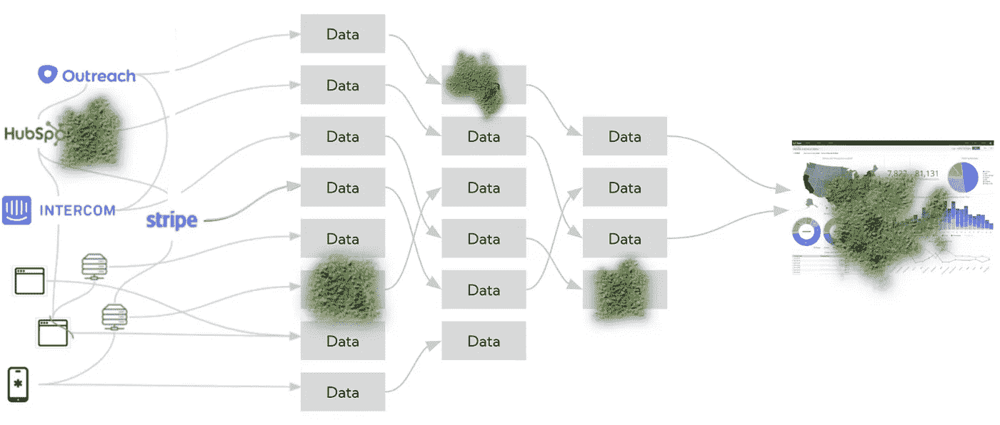

# 发霉的数据和仪表板

> 原文：<https://towardsdatascience.com/moldy-data-and-dashboards-25d498e6979f>

我用一张发霉食物的图片开始向我们的领导团队做演示，描述 data 当时的感受。

每个人的第一个表情是:“eww”接着是“啊是的，就是这种感觉！”。

资料来源:Unsplash.com

# 发霉的数据是什么时候

*   仪表板具有过时的指标定义
*   由于基础数据模型损坏，仪表板只能部分加载
*   KPI 目标是从过时的电子表格中导入的
*   周一早上，由你不知道的 Looker 提供的部分完整的预定 PDF 报告会在闲暇时发给数百人
*   一位高管将你去年匆忙制作的一个仪表板加入书签，现在还在用它做决策

有时候发霉的数据是无辜的。但更多时候不是。这意味着人们使用错误的信息来做决定。

> 发霉的数据会损害对数据的信任，并导致会议中更多的时间花在讨论数据的意义和是否正确上，而不是根据数据做出明智的决策。

霉菌导致更多的霉菌向下游流动。你闻不到它，也许你看不到它，但你肯定不想要它。

作者图片(灵感来自彼得·扬达的文章:[为什么数据分析师的角色从未如此艰难](https://petrjanda.substack.com/p/why-the-data-analyst-role-has-never)

仪表板应该受到额外的指责，因为它们最常把霉菌带到公司无辜的人面前。

**问题是仪表板看起来和感觉起来都像真正的软件程序。一些永恒的东西，一些你可以信任的东西。**

我不怪人们认为仪表盘是对的。毕竟，他们应该预料到这一点。

# 电子表格的美好往昔

15 年前，远在现代数据堆栈诞生之前，这些人依赖于从分析师汇总的电子表格中获取数据。这并不完美。

*   **电子表格是一项繁重的工作:** 它们必须手动更新——我清楚地记得，在之前的一份工作中，每周五早上，在执行 KPI 更新之前，我必须更新一份电子表格
*   **电子表格很脆弱** *:* 如果仪表板感觉像是用实心砖砌成的房子，那么电子表格就是用胶带粘在一起的细条做成的。一些临时的东西，从来不是 100%准确的，经常会有一些计算错误
*   **电子表格过期** *:* 它们不会自动更新，只在特定的地点和时间有效。谁不记得“年度预算 _v37.xls”

换句话说，电子表格感觉不像真正的软件。最终用户之间的合同是明确的；这是为你解决特定问题的东西，但使用时风险自担。

但是这份合同也意味着电子表格不会发霉。没有人期望挖掘出一个两年前的电子表格，并自动更新到自那时以来的业务发展情况。

# 我们将何去何从？

发霉的数据和仪表板在无意中将其呈现给错误的人方面扮演的角色是一个重要的问题。仪表板是人们看到的层，是确定数据信任的冰山一角和顶峰。

关于如何做得更好，我有一些建议

1.  仪表板应该自毁
2.  电子表格在现代数据堆栈中占有一席之地
3.  我们需要新的工具

# 仪表板应该自毁

在《碟中谍》中，汤姆·克鲁斯从《碟中谍》中得到的信息在被阅读后会自动销毁。如果仪表板也是这样会怎么样？

资料来源:Unsplash.com

如果仪表板工具迫使分析师填写“自毁时间”字段会怎样？在那之后，仪表板会消失，完全蒸发，眼不见心不烦，砰。

*肯定*，有些人会发火。波兰办公室销售团队中的一个人曾经在 Slack 上给你发了一份定制仪表板的 DM，并且每天都看着它，他会不高兴的。

*当然*，一些人会觉得他们进行“自助式根本原因分析”的能力将被剥夺，因为他们一直依赖于一个三年前离开加入脸书的人创建的仪表板。

*当然*，你每六个月向经理汇报的“可自助解决问题的百分比”分数将会下降。

*但是*作为一个从事数据工作并最终负责数据质量的人，你不可能支持以上所有内容(我知道我做不到)。

**你的工作是让这些人心烦意乱，但你这么做是有充分理由的——建立并维护数据信任文化。**

仪表板应该只是表示层。如果你的仪表盘充满了业务逻辑，以至于你不能在 30 分钟之内重新创建一个，你应该三思是否你已经得到了正确的设置。

> 开始的几个月，我检查了我们所有的仪表板，并在 80%的仪表板上添加了“☠️将在 30 天内被删除”。一个月内，我们的仪表板从 175 个增加到 30 个。— [数据总监卡尔·约翰](https://www.linkedin.com/in/carljohanrising/)

# 我敢说电子表格吗？

有一段时间，我认为一切都应该自助。分析师不应在电子表格中快速提取数据，而应多花 30%的时间在 Looker 中实现自助访问，这样每个人在未来几年都可以获得相同的数据。我告诉他们，所有数据都将是真正的自助服务。后来我改变了主意。

我现在相信，电子表格通常是有意义的数据工作共享的正确工具。这是最接近大众化的数据语言，人人共享。

就像 Figma 邀请整个公司参与设计过程一样，电子表格对数据也是如此。有了电子表格，没有数据凭证、认为 dbt 是一种心理疗法的人可以参与进来。想要将客户类型的列添加到潜在客户列表中吗？执行 VLOOKUP，并将您自己的数据带入。

这与现代数据堆栈形成鲜明对比，在现代数据堆栈中，类似的任务需要从更改 LookML 代码到创建 pull 请求，再到更新数据模型，同时保持 YML 文件不变，以便指标的定义在您的数据目录中保持一致。祝你向数据团队以外的人解释这一点时好运。

# 我们需要新的工具

我们应该停止使用仪表盘吗？绝对不行。拥有准确和最新的顶级公司 KPI，任何人都可以在仪表板中访问，这真是太棒了。几乎不管是什么投资，拥有这个并把它做好都是值得的。我的牛肉和发霉的仪表板在一起。

但是发霉的仪表盘只是冰山一角。通常情况下，发霉的仪表板是上游某个东西坏掉的结果。这种模式不应该被仪表板带到表面上。

**我们需要工具来告诉我们什么时候出了问题，这些工具不应该是全公司的仪表盘。**

*告诉我们数据何时过时的东西*。

介于捕获的所有数据和最终到达最终用户手中的数据之间的东西。

*在仪表板的数据点上创建一个✅，让每个人都充分相信它好用。*

*知道发霉数据并对通过仪表板暴露的内容持批评态度的东西*。

*在后台运行的东西*会自动将坏数据带到表面——无论它是来自错误的业务逻辑、后端系统中的故障还是不再执行它们应该执行的任务的电子表格导入。

*适合数据从业者工作流程的东西*，通过工作流程推动他们做高质量的数据工作，而不是大量的数据工作。

不要误解我。我喜欢 [ETL → ELT 的转变](https://fivetran.com/blog/etl-vs-elt),和其他数据呆子一样，可以无限制地对所有数据进行探索性分析。我绝对不希望这件事不了了之。我只是认为，这和所有这些都应该在仪表板中对业务最终用户可用的期望之间的界限已经太远了。

如果你有一些关于如何处理发霉的仪表板和数据的建议，请告诉我。