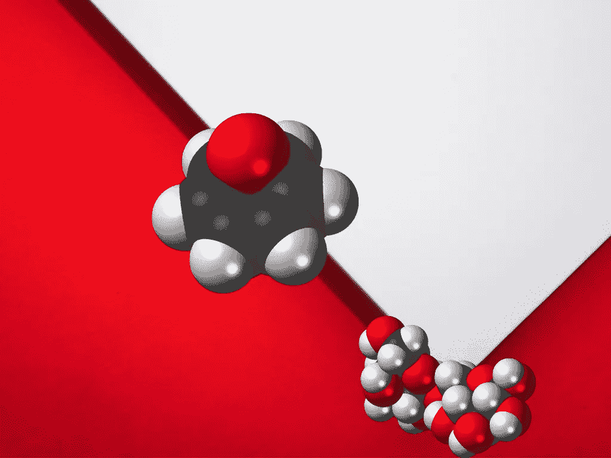
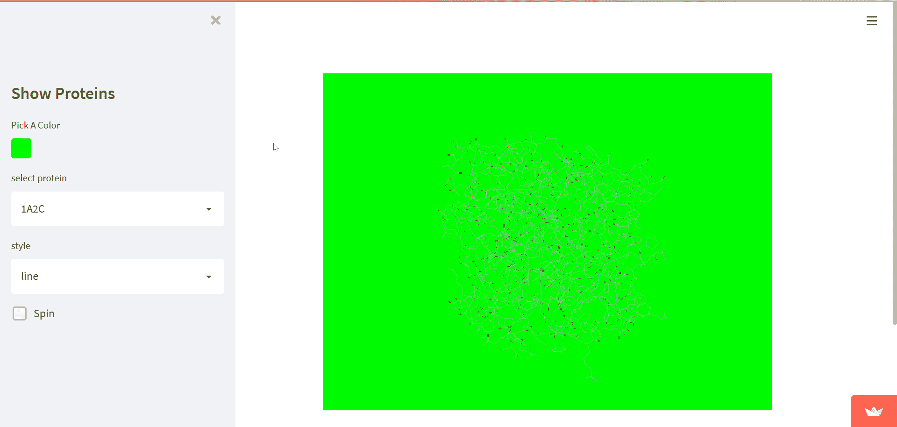
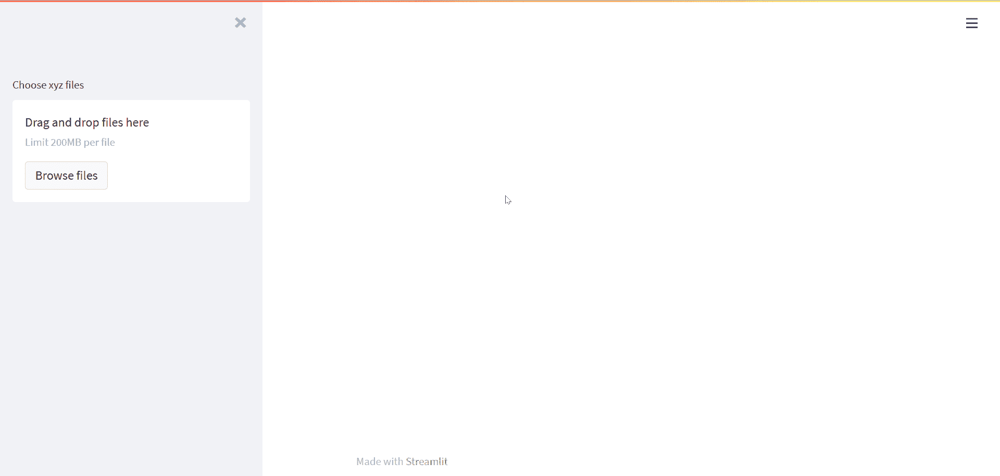

# 使用 RDKit 和 Py3DMol 在 Streamlit 中进行分子可视化(第 2 部分)

> 原文：<https://towardsdatascience.com/molecular-visualization-in-streamlit-using-rdkit-and-py3dmol-part-2-657d28152753>

## Py3DMol 和 stmol 组分



艺术品。图片由作者提供。

> 第一部分请点击此链接:[https://towards data science . com/molecular-visualization-in-streamlit-using-rd kit-and-py 3d mol-4e8e 63488 EB 8](/molecular-visualization-in-streamlit-using-rdkit-and-py3dmol-4e8e63488eb8)

# 1.介绍

W 当我问 [Adrien Treuille](https://medium.com/u/39dfc90d7a34?source=post_page-----657d28152753--------------------------------) [如何在 Streamlit](https://jnapoles.medium.com/is-it-possible-to-use-streamlit-to-visualize-molecules-b4e29700f61c) 上部署 3D 结构时， [TC Ricks](https://medium.com/u/a3d0cc1d5338?source=post_page-----657d28152753--------------------------------) 很快联系了我，他建议我开发一个 [Streamlit 组件](https://streamlit.io/components)，当时组件还没有向公众发布。我致力于此，最终开发出了[**stmol**](https://github.com/napoles-uach/streamlit_3dmol)*组件。这对我来说很紧张，但我确实学到了很多。*

*在这篇文章中，我想和你分享三个简单的例子，如何使用 *stmol* 、 *py3Dmol、*和 *RDKit* 轻松制作分子查看器。我真的希望这能对其他人做化学相关领域的优秀 web 应用有所帮助。*

*你可以在这里找到这篇博文[的回购。](https://github.com/napoles-uach/Medium_Mol)*

# *2.安装必备库。*

*由于我们将使用 *py3Dmol* 和 *stmol* (版本 0.0.7)，我们必须从安装这些库开始:*

```
*pip install py3Dmol
pip install stmol==0.0.7*
```

*(我们也需要 RDKit，所以去看看[之前的相关帖子](/molecular-visualization-in-streamlit-using-rdkit-and-py3dmol-4e8e63488eb8)！)*

*现在我们准备开始举例了！*

# ***3。第一个例子:展示蛋白质！***

*下面的代码应该是简单的，同时也是简洁的。生成的 web 应用程序允许选择一些用于呈现 3D 蛋白质结构的蛋白质标识符:*

*现在，让我解释一下代码，*

*   *第 1–3 行。调用图书馆。除了 *streamlit* 之外，显然我们还要调用 *Py3Dmol* ，但是我们也会从 *stmol* 中调用一个名为`showmol`的函数。如果你熟悉 *py3Dmol* ，函数`showmol`是渲染 3D 模型的`show`方法的替代。*
*   *四号线。我们在侧边栏中添加一个标题。*
*   *第[5，6]行。我们使用标准化的标签来识别 py3Dmol 稍后可以查询的一些蛋白质。*
*   *第 7–10 行。这里，我们在侧边栏中有三个小部件，一个用于设置背景颜色，另外两个选择框用于选择第 4 行给出的蛋白质标签，另一个用于选择分子渲染的样式。对于分子来说，更常见的是`stick`和`sphere`，而对于蛋白质来说，首选的是`cartoon`。第 10 行定义了一个复选框，如果我们想让分子旋转(感谢 [Avra](https://medium.com/u/bf79cad6afa1?source=post_page-----657d28152753--------------------------------) ！).*
*   *第 11-18 行。在这几行中，我们制作了 *py3Dmol* 对象`xyzview`。在第 11 行，我们对第 8 行选择的蛋白质进行查询，在第 13 行，我们设置第 7 行选择的背景颜色。从第 14 行到第 17 行，自旋被激活，这取决于复选框中的值。第 18 行放大到整个分子。*
*   *第 19 行。最后，在第 19 行，我们调用`showmol`来呈现最终的分子视图。这是这段代码中更重要的一步，因为没有这一步就不可能查看对象。我不得不说`showmol`接受 py3Dmol 对象作为参数，并且可选地接受窗口的宽度和高度，默认情况下窗口有`width=500`和`height=500`。*

*下面的 gif 展示了应用程序的运行情况:*

**

*运行中的 app2 的屏幕截图。作者 Gif。*

> *链接:[https://share . streamlit . io/napoles-uach/medium _ mol/main/app 2 . py](https://share.streamlit.io/napoles-uach/medium_mol/main/app2.py)*

# ***4。第二个例子:上传本地文件。***

*如果你有自己的某种已知格式的分子文件，比如' *xyz* '并且你想在你的应用程序中渲染这些分子，那该怎么办？这里，我们可以利用`file_uploader`小部件上传一些本地文件。因此，我们可以对前面的代码稍加修改来实现这一点。也许在这里建立一个函数是很方便的，它可以让分子在任何我们需要的时候使用它。因此，在下面的代码中，我们定义了执行此类任务的函数`render_mol`(第 5–12 行)。我们将通过在第 14 行设置`accept_multiple_files=True`让`file_uploader`接受多个文件。最后，我们将迭代所有这些，并每次都应用`render_mol`(第 15–17 行):*

*就是这样。同样，在不到 20 行代码的情况下，我们在 Streamlit 中有一个非常不错的分子查看器，正如您在下面的 gif 中看到的:*

**

*app3 运行中的屏幕截图。作者 Gif。*

> *链接:[https://share . streamlit . io/napoles-uach/medium _ mol/main/app 3 . py](https://share.streamlit.io/napoles-uach/medium_mol/main/app3.py)*

*在这种情况下，分子是来自“纳米管位置”的一些美丽的富勒烯。如果你有兴趣探索一些其他的，这里有链接:*

*[](https://nanotube.msu.edu/fullerene/fullerene-isomers.html)  

我邀请你下载一些富勒烯文件，然后尝试用这个应用程序将它们可视化。

# **5。第三个例子:RDKit + Py3Dmol。**

在最后一个例子中，我将结合我们所学的知识制作一个应用程序，将微笑字符串转换为 3D 分子结构。请看一下代码，我相信您会认出一些部分:

注意，函数`makeblock`返回一个 mol 对象，该对象包含从 SMILES 字符串生成的 3D 结构。第 14 行是我们用`MoltoMolBlock`方法从 2D 表示转换到 3D 的地方。还要注意的是，`render_mol`函数与之前使用的是一样的，唯一不同的是在第 19 行，我改变了给予`addModel`方法的格式。这次我需要的是 *mol* 格式(其他还有 *pdb* 、 *sdf* 、 *xyz* 等。).因此，您可以根据所使用的格式进行更改。你可以看到下面的应用程序工作:


app4 运行中的屏幕截图。作者 Gif。

> 链接:[https://share . streamlit . io/napoles-uach/medium _ mol/main/app 4 . py](https://share.streamlit.io/napoles-uach/medium_mol/main/app4.py)

如果您想深入了解将 RDKit 对象转换成 3D 结构的更多细节，您可以遵循 RDKit [文档](https://www.rdkit.org/docs/GettingStartedInPython.html)，因为我在这里做的是最简单的例子。

# **6。结论**

**Py3Dmol** 允许在 streamlit 网络应用程序中漂亮地渲染 3D 分子模型。为此，来自 **stmol** 组件的 *showmol* 函数很有帮助。当然，可能有一些解决方法可以达到同样的效果，但是我相信直接调用库并在 py3Dmol 代码中使用 *showmol* 会更容易。如果这个组件对你有用，请告诉我！

# 7.感谢

我想再次感谢 [Chanin Nantasenamat](https://medium.com/u/f94b47c3cfca?source=post_page-----657d28152753--------------------------------) 和 [Avra](https://medium.com/u/bf79cad6afa1?source=post_page-----657d28152753--------------------------------) 对这篇文章的善意评论。他们是生物化学专家和流线型忍者，我非常自豪能与他们合作。谢谢各位！

# 帮助我通过使用下面的链接成为媒体成员来继续创建这样的内容。只需 5 美元/月，你就可以在媒体上看到所有的故事，还可以用 2.27 美元支持我，谢谢！

# [https://medium.com/@jnapoles/membership](https://medium.com/@jnapoles/membership)* 

## *链接:*

*[https://github.com/napoles-uach/Medium_Mol](https://github.com/napoles-uach/Medium_Mol)*

*[https://share . streamlit . io/napoles-uach/medium _ mol/main/app 2 . py](https://share.streamlit.io/napoles-uach/medium_mol/main/app2.py)*

*[https://share . streamlit . io/napoles-uach/medium _ mol/main/app 3 . py](https://share.streamlit.io/napoles-uach/medium_mol/main/app2.py)*

*[https://share . streamlit . io/napoles-uach/medium _ mol/main/app 4 . py](https://share.streamlit.io/napoles-uach/medium_mol/main/app2.py)*

*[https://github.com/napoles-uach/streamlit_3dmol](https://github.com/napoles-uach/streamlit_3dmol)*

*[https://pypi.org/project/py3Dmol/](https://pypi.org/project/py3Dmol/)*

*[https://www.rdkit.org/docs/GettingStartedInPython.html](https://www.rdkit.org/docs/GettingStartedInPython.html)*

*[https://nanotube.msu.edu/fullerene/fullerene-isomers.html](https://nanotube.msu.edu/fullerene/fullerene-isomers.html)*

*https://streamlit.io/components*