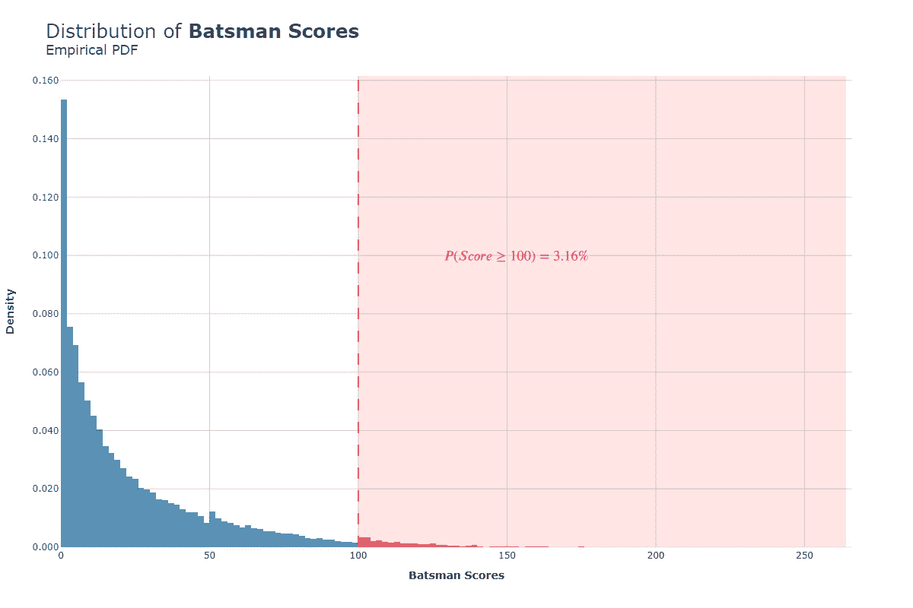
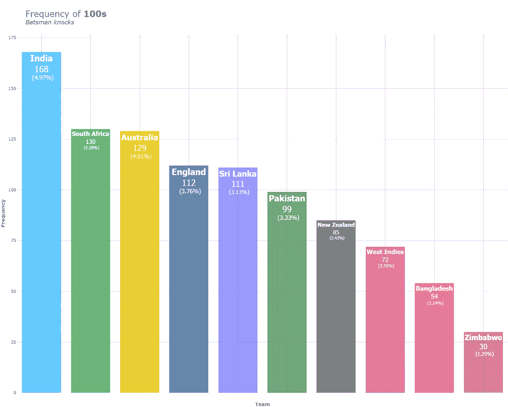
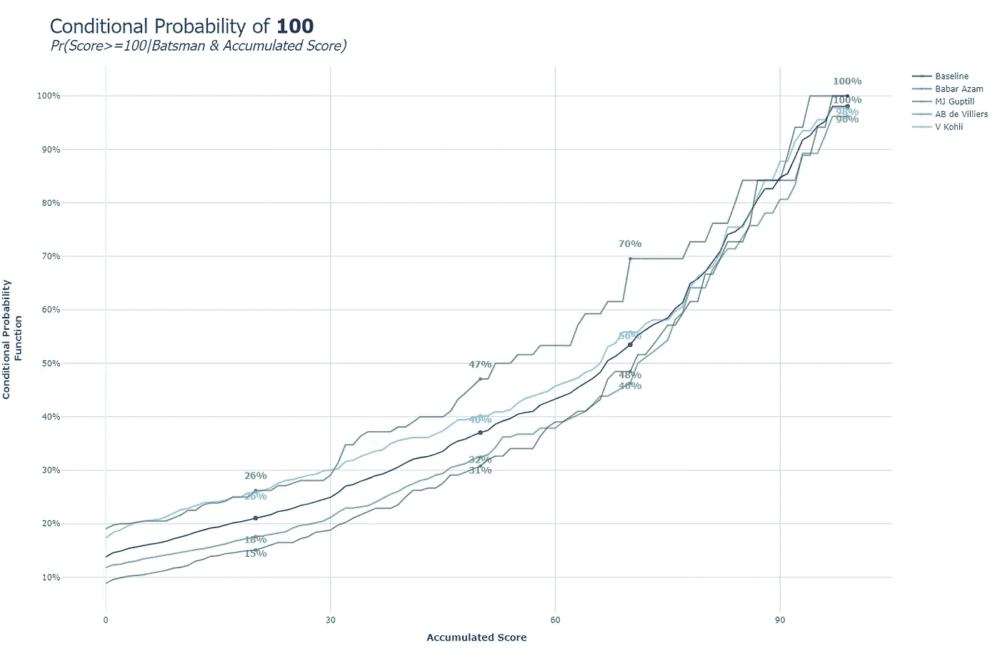

# 板球摇钱树:使用重复条件反射的概率为 100

> 原文：<https://towardsdatascience.com/money-balling-cricket-probability-of-100-using-repeated-conditioning-2fc8dbceb42e>

## 板球得分≥ 100 分的概率分析

[图片](https://unsplash.com/photos/xtbR_0vDuJc)来自[塔赞阿拉姆](https://unsplash.com/@tazain)的 Unsplash

自从我小时候看我的巴基斯坦队比赛，我就对 100 分着迷。我相信许多人会希望他们最喜欢的击球手最终得分一个世纪。然而，每个人都知道，不是每个击球手敲 100 分的结果。这个事件是罕见的，这使得它成为一个作为概率学生学习的完美主题。在这篇文章中，我将探讨击球手得分 100 的概率。然后使用条件概率的规则深入探究概率是如何变化的。

## **数据&方法论**

请查找有关数据来源和方法的重要信息:

1.  **数据来源:**所有数据均来自[cricsheet.org](https://cricsheet.org/)。他们提供 ODI、t20 和测试赛的详细数据。我不拥有这些数据，但是 cricsheet 数据在开放数据共享属性许可下是可用的。在本许可证下，每个人都可以自由地使用、构建和再分发数据，并赋予其适当的所有权。点击阅读关于许可证[的信息。](https://cricsheet.org/register/)
2.  **数据验证:**CRIC sheet 的创始人在验证数据源方面做得很好，误差极小。我使用汇总数据验证了这些数据，并将其与 ESPNcricinfo 等主要板球网站上的汇总数据进行了比较。
3.  **数据维度&时间:**数据集包含从 2004 年 1 月 3 日到 2022 年 4 月 16 日的 1998 个 ODI 匹配。几乎囊括了期间所有主要的男性 ODI 玩法。数据集包含打了 **1，059，669** 球，&34，466 击球手敲了&3900 局。
4.  **方法论:**这篇文章的核心目的是分析击球手击球得 100 分的概率。该方法将在后面详细解释，但主要使用概率规则，如全概率定律、条件概率和贝叶斯规则。

## **从基础开始**

概率问题通常可以分解成计数问题。在计算掷骰子数(骰子是六面的)的经典教科书示例中，可以很容易地模拟骰子，计算骰子落在 6 上的次数，然后除以掷骰子的总数。给定足够数量的掷骰子，人们可以找到经验观察到的掷出 6 的概率。如果是公平骰子，那么掷出 6 的概率是 1/6。

类似地，如果你要找到得分 100 或更高的概率，你可以计算总分≥ 100 的击球手击球次数，然后除以击球手击球的总次数。(击球手击球是指一场比赛中一名击球手的击球动作)。

图片由作者提供。击球手得分总数的直方图/经验概率密度函数。红色区域突出显示了导致 100 次或以上的所有敲击。— `Contains information from cricsheet which is made available under the ODC License`

> 上面的图在 x 轴上显示了击球手得分，在 y 轴上显示了相应的概率密度。将导致得分≥ 100 的击球手击球次数相加，我们得到 1，090 次击球手击球。在我们的数据集中击球手击球的总数是 34，466。除以两个 we 1090/34466 ≅ **3.16%** ，也就是说 10000 次敲击中只有大约 316 次产生一个世纪或更高的分数。

一个世纪当然是非常罕见的事件。作为一名统计建模师，我发现对不太可能发生的事件建模既具有挑战性，同时又令人着迷。这个事件可以建模为一个二元分类问题。然而，非常低的流行率使得模型很难以高准确度进行预测。为了建立好的模型，你应该根据数据中其他变量的变化来观察目标是如何变化的。

## **什么是概率条件作用？**

虽然这个概念用术语来描述似乎很深奥，但我相信每个人都有一个直观的想法。条件概率由公式 P(A|B) = P(A & B)/P(B)决定。为了得到给定事件 B 已经发生的概率，你取两个事件一起发生的概率— **P(A & B)** 然后除以 B 发生的总概率— **P(B)** 。

假设我们要计算巴基斯坦队在与澳大利亚队比赛的情况下得分≥ 200 的概率。根据我们观察到的巴基斯坦队在与澳大利亚队比赛时总分达到 200 或更高的次数，除以巴基斯坦队与澳大利亚队比赛的总次数，可以很容易地根据经验估计出这种概率。

图像由作者，' | '的意思是有条件的。∩的意思是&

我们可以继续增加更多的条件，比如比赛是在巴基斯坦主场还是在澳大利亚主场，巴基斯坦队是追赶还是进攻(设定比分)等等。您可以添加条件来查看在不同的场景下期望的概率是如何变化的。

## 团队训练

在数据集中，球队打出的总击倒次数中，按球队分组的得分超过 100 的击倒次数。不包括小球队。图片由作者提供。— `Contains information from cricsheet which is made available under the ODC License`

> 在第一部分中，观察到 3.16%的击球手击球得分≥ 100 分。合乎逻辑的下一步是根据哪个队击球来看一个世纪或更高分数的可能性有多大。在上面的图表中，每支球队都计算了导致 100 分的击球手击球次数，我们用每支球队击球手击球的总次数除以这个次数来得到这个频率。

在我们的数据集 3379 中，印度是敲门次数第二多的国家，也是百夫长敲门次数最多的国家。然而，它没有 100+的最高频率，该奖项由南非获得，南非的**敲击次数为 5.08%**100+次。巴基斯坦在 100+敲击总数(99)和频率( **3.33%** )方面都处于中间位置。略高于团队中立率 3.16%。津巴布韦在这方面的表现最差，在 2321 次敲门中，只有 30 次得分为 100+，得分率为 1.29%。

**喜欢这个故事吗？需要编码帮助？请考虑成为赞助人！**

<https://www.patreon.com/user/membership?u=78117613> [## 阿尔斯兰·沙希德|帕特里翁

www.patreon.com](https://www.patreon.com/user/membership?u=78117613) 

## 对球的调节存活了&局

条件概率函数，对击球手和击球局幸存的球应用条件。图片由作者提供。— `Contains information from cricsheet which is made available under the ODC License`

> 基线是中立局，进攻是第一局的敲打，追逐是第二局的敲打。“存活的球数”代表击球手到目前为止打出的球数。在每个数据点，该图显示击球手以 100+分结束击球的概率。当然，击球手存活的时间越长，他们积累的分数就越多，最终达到 100 分。费率根据局数分开(不包括对方球队得分低于 100 的追逐局)。击球手在第一局击球时更有可能得 100 分，而不是在追逐时。当击球手在 60 个球后幸存下来，他们可能会在第一局打出 100 多分 **21%** ，在底线得分 **19%** ，在第二局 **16.5%** 。注意:当击球手在 120 个球以上幸存下来时，剩下的击球次数非常少，所以这些数字很可能因为样本少而有偏差。

在第一局得分 100+的可能性更高，击球手存活的时间越长，他们获得 100 分的机会就越大，但必须注意的是，在此图中没有考虑累积得分。在对这个问题建模和预测概率(另一篇文章的主题)时，将存活的球数和累积的跑垒数组合起来似乎很直观。

## **以累计得分为条件&局**

条件概率函数，对击球手和击球局的累积得分进行调节。图片由作者提供。— `Contains information from cricsheet which is made available under the ODC License`

> 该图显示了得分≥100 的可能性，取决于击球手已经跑了多少次以及他们正在击球的局数。该图显示，当击球手已经跑了半个世纪(50 分)时，他们有 **21.5%** (第一局) **19.7%** (底线)& **17.3%** (第二局)至少跑 100 分的概率。在累计得分 75 & 80 之间，概率穿越 50%。有趣的是，即使累积了 99 次跑步，也只有 97.8%的机会达到 100 次。在从 99 达到 100 之前，有 2.2%的敲击导致出局/匹配结束。

不出所料，击球手跑得越多，获得至少 100 分的几率就越高。特别感兴趣的是概率变化多少，这可以帮助构建统计模型来预测 100+的结果。该曲线作为一个整体不是线性的，在 50 次运行后，概率增加的速度比 50 次运行前快得多。表明随着运行次数的增加，事件变得越来越容易预测！

## 球员和累积跑分的条件

条件概率函数，对球员和击球手的累计得分施加条件。图片由作者提供。— `Contains information from cricsheet which is made available under the ODC License.`

> 基线曲线反映了所选 4 名球员的“平均值”。100+的玩家级别的样本量非常小，顶级百夫长是 Virat Kholi，只有 43 次击倒，导致超过 100 次。所以这些数字应该以适度的怀疑态度来看待。尽管如此，可以看出 Babar Azam 具有最高的曲线，表明表现更好，但他的样本量是最小的，在数据集中只有 84 局。Virat Kholi 得 100 分的倾向比 Martin Guptill & AB De Villiers 上升得更快。有趣的是，马丁·古普提尔和巴巴尔·阿扎姆都没有达到 99 分，而科利·德·维利耶都达到了。

文章到此结束。我希望你喜欢它，请**通过电子邮件订阅**和**关注我**了解更多内容。在接下来的文章中，我将尝试在这个基础上建立一个几个世纪的预测模型。敬请期待！

以下是我的一些其他文章，你可能会喜欢:

1.  **Money-Balling Cricket-Statistically evaluate-a-Match:**[https://medium . com/mlearning-ai/Money-Balling-Cricket-Statistically-evaluate-a-Match-9 CDA 986d 015 e](https://medium.com/mlearning-ai/money-balling-cricket-statistically-evaluating-a-match-9cda986d015e)
2.  **谎言、弥天大谎、数据科学:**[https://medium . com/mlearning-ai/Lies-Big-Lies-and-Data-Science-6147 e 81 FB 9 fc](https://medium.com/mlearning-ai/lies-big-lies-and-data-science-6147e81fb9fc)
3.  **Money-Balling Cricket—Babar Azam 的平均跑垒:**[https://medium . com/@ arslanshahid-1997/Money-Balling-Cricket-Averaging-Babar-Azam-Runs-ADB 8de 62d 65 b](https://medium.com/@arslanshahid-1997/money-balling-cricket-averaging-babar-azams-runs-adb8de62d65b)

谢谢大家！