# 在 Slack 中监控您的 AWS Lambda 函数(或任何其他 AWS 服务)

> 原文：<https://towardsdatascience.com/monitor-your-aws-lambda-functions-or-any-other-aws-service-in-slack-809aaefe7e40>


照片由[布雷特·乔丹](https://unsplash.com/@brett_jordan?utm_source=medium&utm_medium=referral)在 [Unsplash](https://unsplash.com?utm_source=medium&utm_medium=referral) 拍摄

## 一种简单的基于 Python 的方法，将完整的错误回溯发送到 Slack

随着组织的发展，在 AWS Lambda 中定期运行 ELT 或批处理推理作业是很常见的。有很多关于使用 CloudWatch 警报监控 lambda 错误的文章，但是对于周期性的 Lambda 作业，这既过于复杂，也不能在通知中提供太多有用的信息，除了有一个错误。

在这里，我提出了一种更直接的方法来监控这些周期性的λ函数。使用这种方法，您将直接在您的 slack 通道中获得包含错误消息和每个错误追溯的通知，消除了挖掘日志来排除错误的需要。虽然这种方法确实涉及到了 CloudWatch，但它不需要 CloudWatch 警报或任何像 SQS 或凯尼斯这样的消息队列服务。

在我们开始之前，有一个快速的警告:如果你的 Lambda 函数每分钟处理很多请求并开始失败，你的 slack 通道将会崩溃💥带有错误消息。大容量 lambda 函数最好使用以下参考资料中详细描述的方法之一:

*   [通过 Slack 跟踪 AWS Lambda 函数误差](https://medium.com/@femidotexe/tracking-aws-lambda-functions-error-via-slack-2e9f0733e043)
*   [来自 AWS CloudWatch 警报的松弛通知](https://quick-refs.github.io/aws/slack-notifications-from-aws-cloudwatch-alarms)
*   [AWS Lambda 蓝图](https://aws.amazon.com/about-aws/whats-new/2015/12/aws-lambda-launches-slack-integration-blueprints/) (2015)

# 该方法概述

参见下面的基本架构。

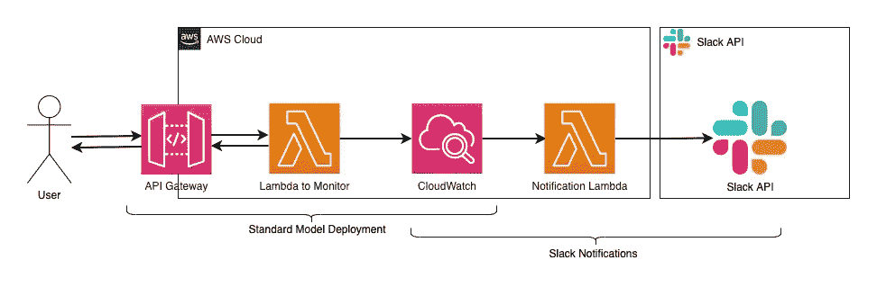

图片作者。根据发布的使用政策使用 AWS 架构图标和 Slack 徽标(1)。

用户向 API Gateway 发送一个请求，API Gateway 将该请求转发给我们用 Lambda 部署的模型。Lambda 模型将向 API 网关返回一个预测或错误，以发送回用户，并且还会将一条日志消息写入云观察日志。

到目前为止，我们在 AWS Lambda 上有一个标准的模型部署。每当日志包含文本`ERROR`时，CloudWatch 触发我们的通知 Lambda 向 Slack 发送一条消息，神奇的事情就发生了。

## 我们将如何实施:

1.  [将简单的线性模型部署到 lambda 函数，并将其连接到 API 网关端点](#5d4a)。
2.  [制造一个松弛的网钩](#e6cd)。
3.  [创建一个 Lambda 函数向 Slack 发送消息](#6213)。
4.  [配置一个 CloudWatch 来触发我们的通知 Lambda](#de7d) 。

# 让我们开始吧:

作为一个测试案例，我们将部署一个简单的模型，它将一个数字加倍，如果输入不是一个数字，就引发一个`ValueError`。如果你已经有一个 lambda 函数或者其他想要监控的 AWS 服务，你可以跳到[创建一个 Slack Webhook](#e6cd) 。

## 创建新的 Lambda 函数:

1.  转到 AWS 控制台中的 Lambda 服务。
2.  从侧边栏中选择`Functions`。
3.  选择`Create function`来——你猜对了——创建一个新功能。


作者图片

4.选择`Author from Scratch`，输入 Lambda 函数的名称，并选择运行时。我将调用我的函数`MonitorMe`，我使用 Python 3.8 作为运行时。接受其余默认设置并点击`Create function`。

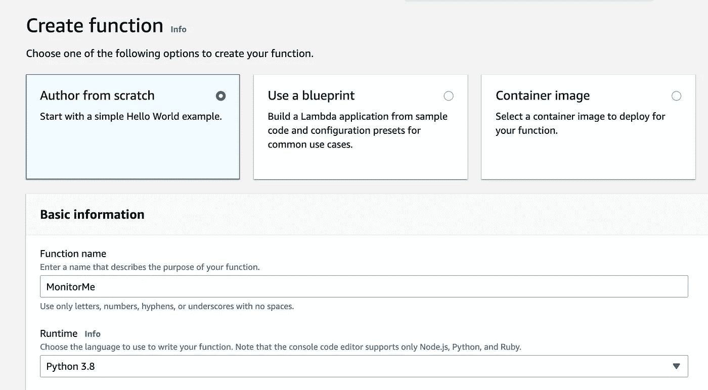

5.将下面的代码用于我们简单的 Lambda 模型。

**单步执行代码:**

API Gateway 通过`event`参数将查询字符串参数转发给我们的 Lambda 函数。

上面的代码首先将变量`x`设置为`event['queryStringParameters']['x']`。`event['queryStringParameters']`中的每个元素都是一个字符串，所以要使用`x`进行任何数值计算，我们必须将其转换为数值数据类型。我们用`x = float(x)`来做这件事。`float`是表示浮点数的数据类型，所以试图将任何不是数字的东西强制转换为`float`会导致我们的 Lambda 抛出异常。最后，我们将`x`加倍，并在我们的响应体中返回它。

## 创建 API 网关端点

没有这一步通知也可以工作，但是设置 API 相对简单，并且为我们的`MonitorMe` Lambda 提供了一个实际的`event` 变量来处理。

1.  访问 API 网关服务，在 HTTP API 面板上选择`Build`。


作者图片

2.将我们的`MonitorMe` Lambda 函数作为 API 集成进行连接。

点击`Add integration`

*   选择`Lambda`作为集成类型
*   确保选择了正确的区域(这应该与 Lambda 所在的 AWS 区域相匹配)，然后搜索我们在上面创建的`MonitorMe` Lambda 函数。
*   为 API 提供一个名称。我正在调用我的 API `MyAPI`。(聪明，我知道)
*   点击`Next`

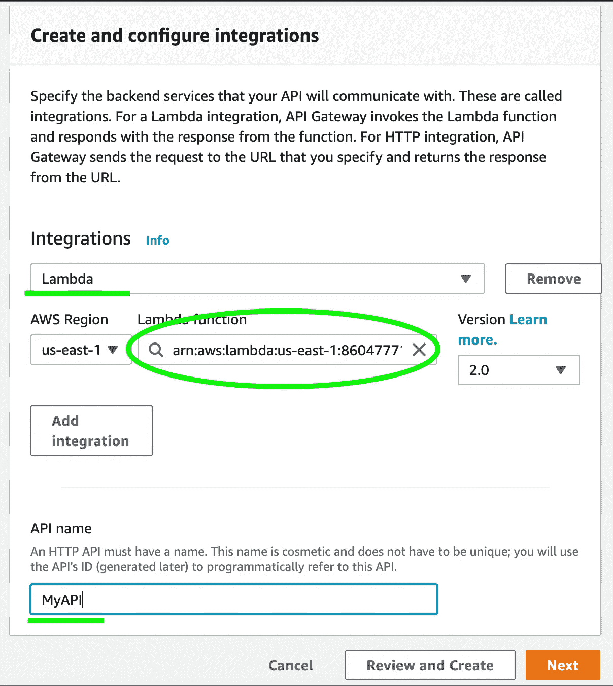

作者图片

3.现在我们需要一条路线。路由将操作分配给 URL 路径。我们将要设置的动作将一个请求转发给我们的`MonitorMe` Lambda 函数。

*   输入*资源路径的逻辑路径。*我使用了我们的 Lambda 函数的名字`MonitorMe`，但是你可以使用任何东西
*   选择`MonitorMe`作为*整合目标*。
*   点击下一个的*。*


作者图片

4.在下一个屏幕上，接受默认值。

确保*自动展开*打开。没有它，我们必须手动部署对 API 的任何更改。如果我们需要在部署到生产 API 之前部署到开发 API 进行测试，这将非常有用。对于这个例子，我们希望事情简单一些。


作者图片

## API 已部署。来测试一下吧！

1.  在`MyAPI`页面上找到`$default`阶段的`Invoke URL`。这是我们的基本网址。复制它。

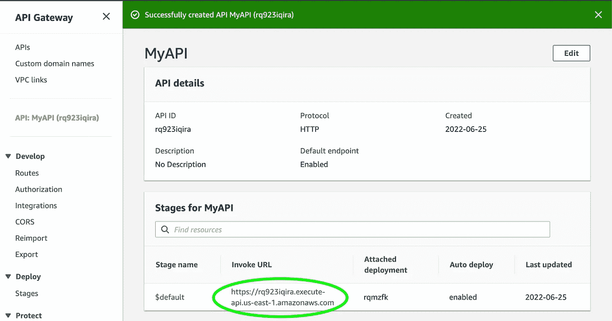

作者图片

2.将我们在 [API 创建步骤 3](#b1fb) 中创建的路由路径添加到基本 URL。用您在上一步中复制的基本 URL 替换`{YOUR API BASE URL}`。(URL 不区分大小写，但为了清晰起见，我将其大写):

```
https://{YOUR API BASE URL}/**MonitorMe**
```

3.通过追加一个`?x=`后跟要测试的值，将查询添加到 URL。这是我们向`MonitorMe` Lambda 函数发送参数的地方。例如:

```
https://{YOUR API BASE URL}/MonitorMe**?x=2**
```

4.把这个插入你的浏览器，然后。2x2= `4.0`


作者图片

这是一个非常有用的模型。😉

# 创建一个松弛的网钩

最后，我们开始进入项目的实质部分。我们将通过 webhook 向 Slack 发送消息。

1.  为您的通知创建一个渠道。我给我的打电话`aws-notifications`

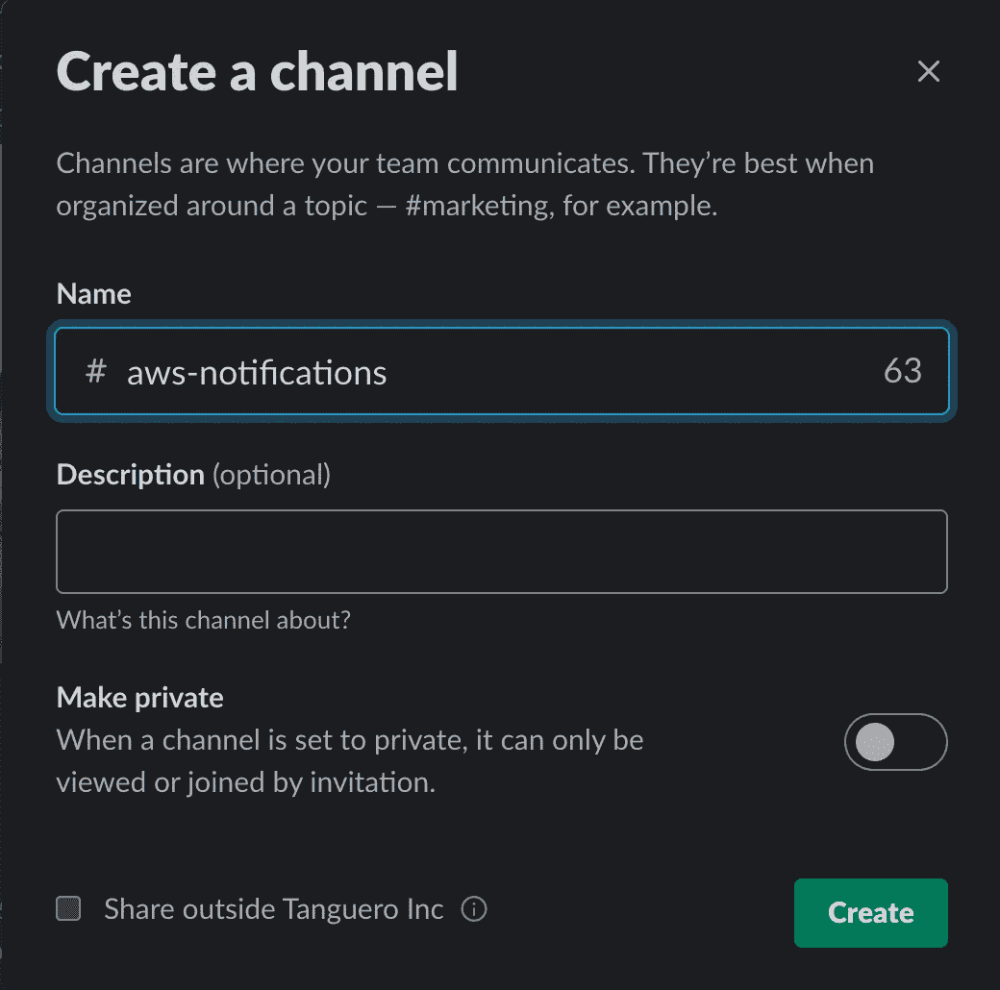

作者图片

2.参观 api.slack.com/apps。如果您尚未登录，您将看到一条消息，要求您登录您的 Slack 帐户以创建应用程序。动手吧。

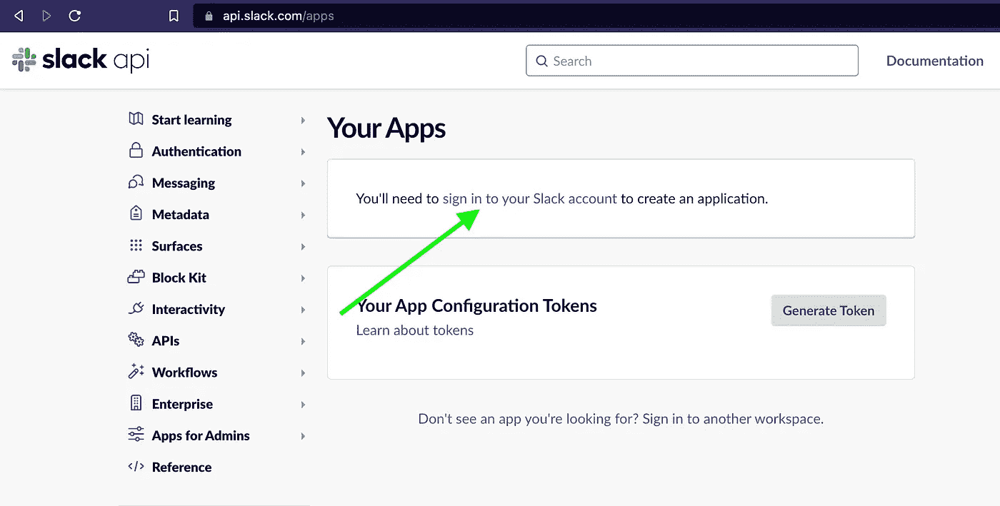

作者图片

3.登录后，您会看到一个标签为*创建应用*的按钮。点击它。


作者图片

4.我们想从头开始创建我们的应用程序。

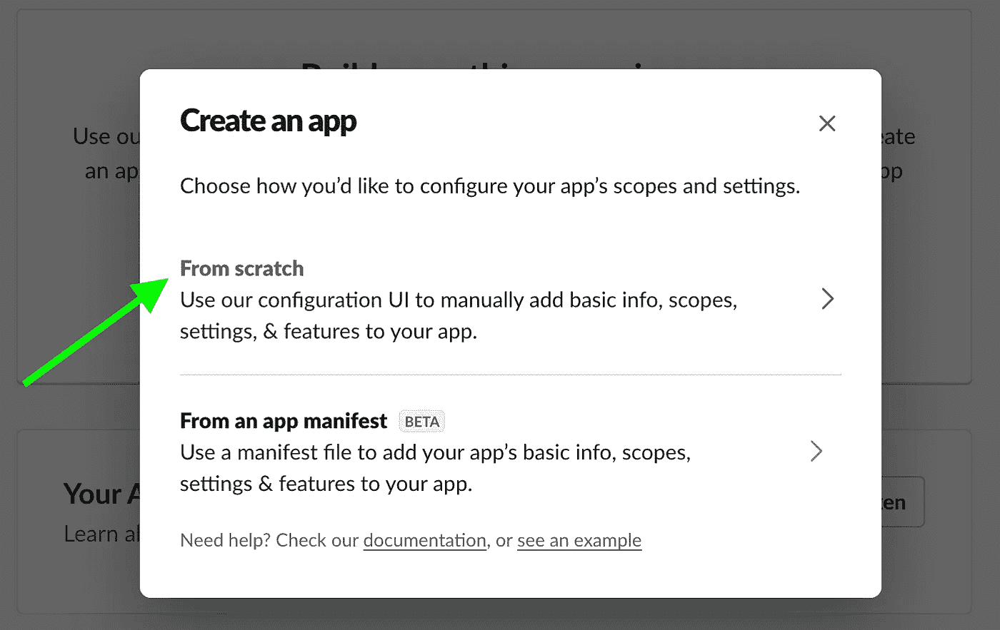

作者图片

5.在下一个屏幕上，添加应用程序名称，选择您的工作区，然后单击*创建应用程序*。


作者图片

6.一旦你创建了应用程序，Slack API 网站会方便地推荐一些功能。我们想要*传入的 Webhooks，*所以找到那个框并单击它。


作者图片

7.在“传入 webhooks”页面上，单击右上角的滑块打开 webhooks。这也将在页面底部展开一个设置部分。

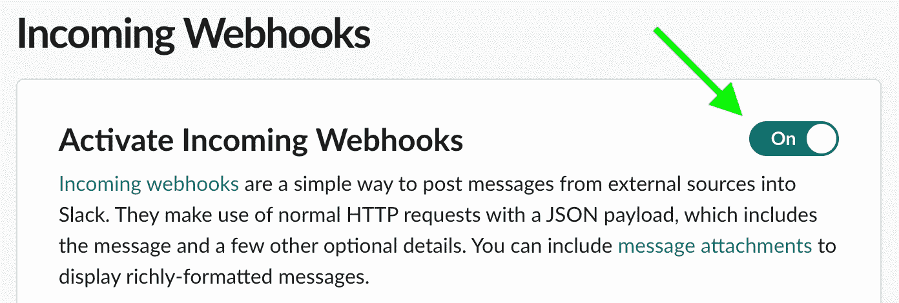

作者图片

8.点击页面底部设置部分的`Add New Webhook to Workspace`按钮。

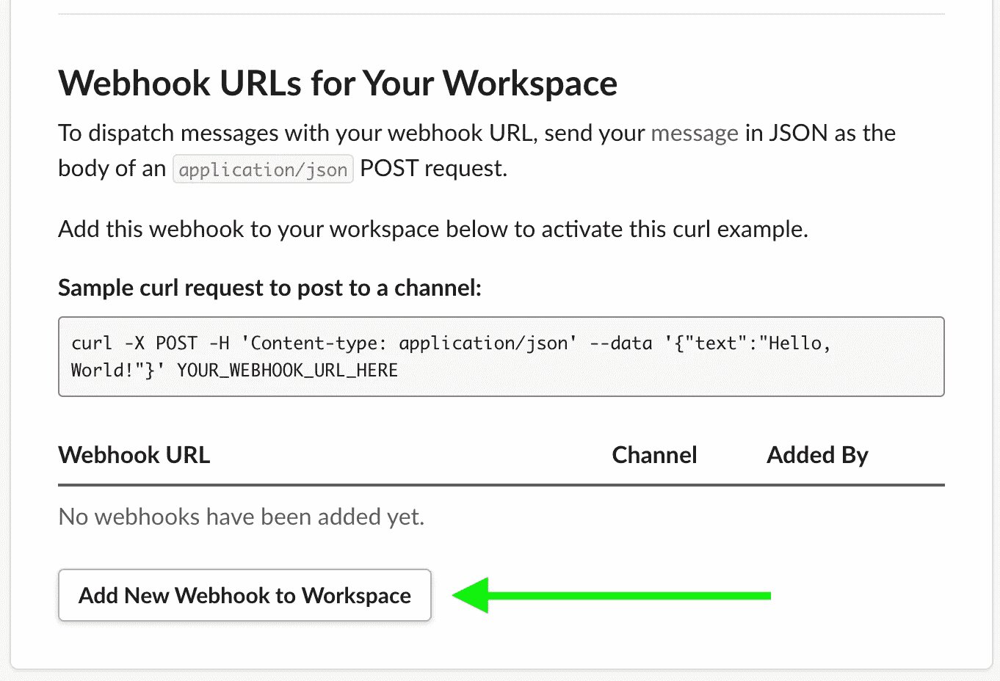

作者图片

9.选择我们之前创建的频道并*允许。*

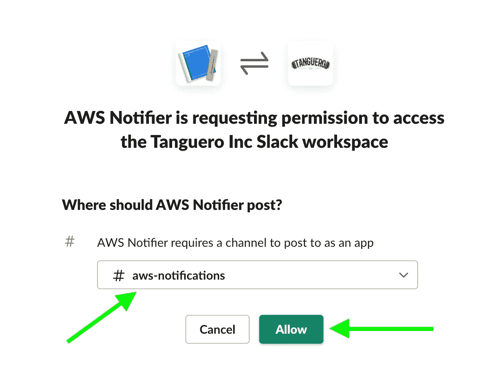

作者图片

10.现在，您将看到您已经创建了一个 webhook URL。curl 示例更新了，所以我们可以在命令行测试它。

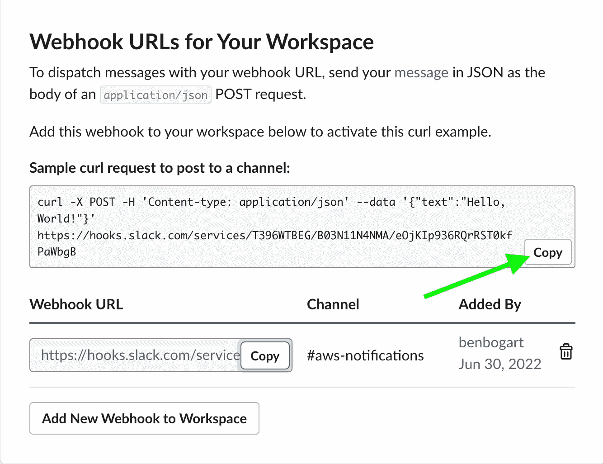

图片作者(写完这个帖子后我删除了这个 webhook😁)

只需抓取`Sample curl request to post to channel`代码，并将其粘贴到您的终端中，如下所示(如果您使用的是旧版本的 Windows，您可以按照[this stack overflow answer](https://stackoverflow.com/questions/9507353/how-do-i-install-and-use-curl-on-windows)中的说明安装 cURL):


作者图片

它将返回`ok`。检查你的 slack 频道，你会看到 AWS 通知程序的一个帖子，上面写着`Hello, World!`。

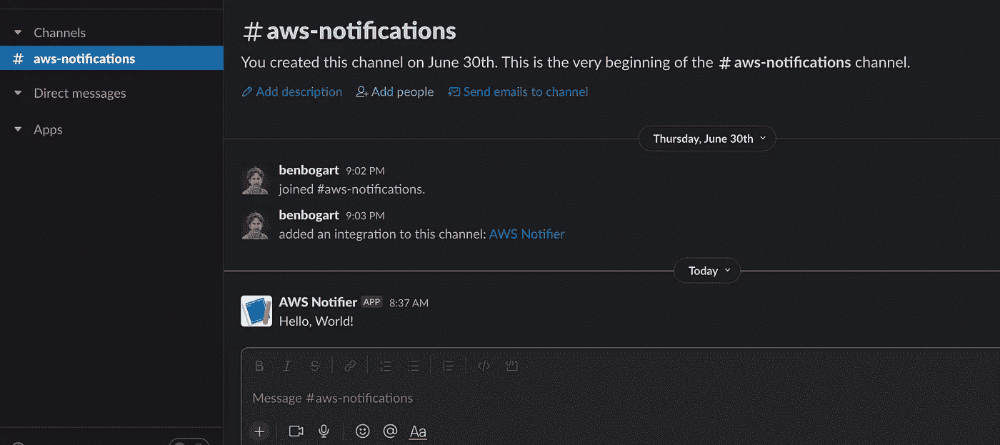

作者图片

耶！我们现在可以发布到我们的 slack 频道。

11.复制 Webhook URL。我们以后会需要它。


作者图片

# 创建一个 Lambda 函数向 Slack 发送消息

在本节中，我们将设置一个 Lambda 函数，当它被触发时，将向我们发送包含错误详细信息的 Slack 消息。

## 就像前面一样，创建一个新的 Lambda 函数:

1.  转到 AWS 控制台中的 Lambda 服务。
2.  从工具条中选择`Functions`。
3.  选择`Create function`创建一个新功能，您又猜对了。


作者图片

4.选择`Author from Scratch`，输入函数名，然后选择运行时。对于这一步，我将调用函数`Notify`并使用 Python 3.8 作为运行时。接受其余默认设置，并点击`Create function`。


作者图片

5.将以下代码复制并粘贴到新的 Lambda 函数中。

让我们单步执行代码

*   将`SLACK_WEBHOOK`设置为您之前创建的 slack webhook URL。 ***你必须将其更新为你创建的网页挂钩的 URL。***
*   当 Lambda 被调用时，AWS 调用`lambda_handler`函数。AWS 将`event`和`context`作为参数传入。`event`包含编码的错误信息。
*   接下来，Lambda 调用`decode_logpayload`来解码错误消息。这个函数做三件事:
    1。使用`base64decode`解码错误字符串。
    2。使用`gzip`解压解码后的错误字符串。
    3。将生成的 JSON 转换成 Python 字典并返回它。
*   然后我们构建松弛消息。关于 Slack 消息构造的细节可以在 Slack API 文档中的[创建丰富的消息布局](http://Creating rich message layouts)中找到。
    我们将每个`logEvent`添加到附件列表中。这确保了我们获得完整的日志消息。
    然后，我们用日志组名和包含错误日志的`logEvent`列表构建消息，日志组名标识抛出错误的 Lambda。
*   最后，我们用 urllib 的`Request`类创建一个请求对象，并用的`geturl`方法将其发送给`SLACK_ENDPOINT`。

# 最后一步:为我们的通知 Lambda 配置一个 CloudWatch 触发器。

这里有一个细节非常重要。我们在`**Notify**` 上创建触发器，Lambda **，**不是 Lambda 抛出错误。这意味着，如果您需要监控几个 lambda 函数，您需要为每个函数添加一个触发器到`Notify` Lambda。幸运的是，AWS 没有对单个 Lambda 函数的触发器数量进行限制。

## 设置触发器

1.  仍然在我们的`Notify` Lambda 中，从页面顶部选择`Add trigger`。

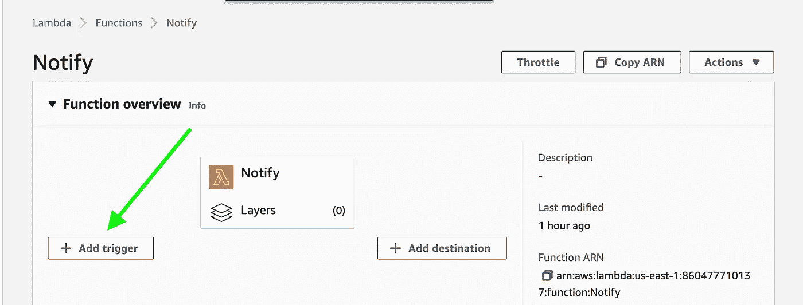

作者图片

2.这将打开触发器配置对话框。
选择`CloudWatch Logs`作为触发类型。
选择与您想要监控的 Lambda 日志相对应的日志组。如果你跟随，这将是`/aws/lambda/MonitorMe`。
命名过滤器。这可以是任何东西。狂野一点。
过滤模式将决定哪些日志触发通知 Lambda。这里我将简单地输入`ERROR`，它将匹配任何包含文本`ERROR`的日志。

> 您可以在 CloudWatch 文档中的[过滤器和模式语法](https://docs.aws.amazon.com/AmazonCloudWatch/latest/logs/FilterAndPatternSyntax.html)页面上找到有关 CloudWatch 过滤器的更多信息。

点击对话框右下角的添加。


作者图片

我们完事了。🌴

# 测试

让我们确保这一切按预期进行。我们有两个案例要测试:

1.  如果`MonitorMe` Lambda 记录了一个**而不是**错误的消息，我们应该**而不是**在 Slack 中得到一个通知。
2.  如果`MonitorMe` Lambda 确实记录了一个错误，我们应该会得到一个有用的消息。

## 案例一:`MonitorMe`执行成功

为了测试这一点，我们使用最初测试端点时使用的相同 URL 来访问我们的 API 端点:

```
https://{YOUR API BASE URL}/MonitorMe?x=2
```


作者图片

我们验证没有消息被发送到 Slack:

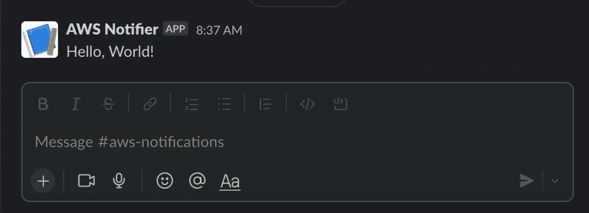

作者图片

什么都没发生。成功！

## 案例 2:执行`MonitorMe`失败

让我们修改 API 调用来发送一个字符串而不是一个数字。这将导致 Lambda 抛出一个错误。

```
https://{YOUR API BASE URL}/MonitorMe?x=wompwomp
```


作者图片

非常好。一个错误。我们来看看 Slack。

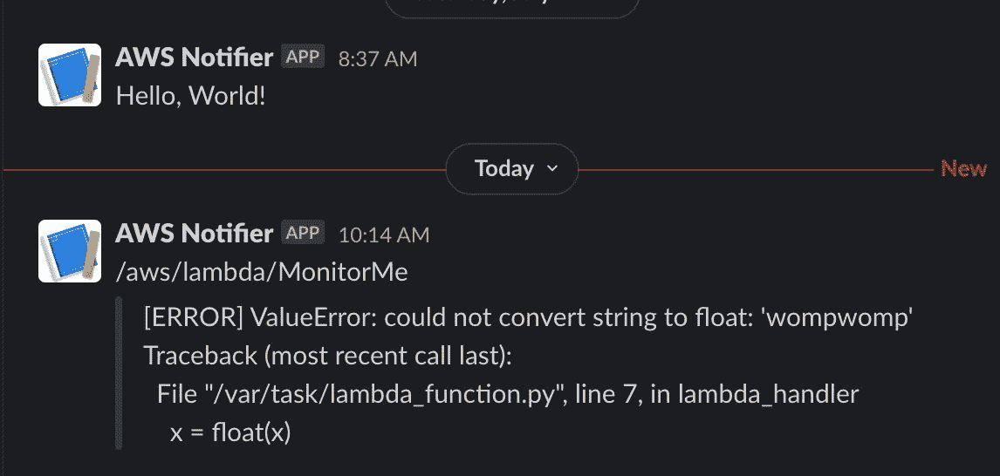

作者图片

太神奇了！我们不仅在 Slack 中收到了一个通知，而且通知还附带了错误回溯！我们可以看到这是`lambda_function.py`的第 7 行，错误来自试图将`wompwomp`转换为 float。

# 结论

还有其他方法可以从任何 AWS 服务中捕获错误并将其发送到 Slack。我在这篇文章的开头列出了一些文章，但是当您期望错误数量很少时，这种方法是更好的，因为它更直接，并且在 Slack 中给您完整的错误消息。

在 [Komaza](https://komaza.com/) ，我们使用这种方法来监控概念验证项目中的管道、数据质量检查，以及由我们的内部 web 应用之一手动触发的一些 Lambda 函数。我们立即发现了数据库模式更改、过期令牌和各种其他问题等错误，并能够在所有情况下在 24 小时内部署修复。这种相对简单的 Lambda 监控方法通过确保更高质量的数据和帮助我们更快地响应系统故障，改善了我们的利益相关者体验。

# 科马扎在招人

如果你想帮助我们为小农户提供改变生活的经济机会，同时为地球上最有效的碳封存引擎之一提供动力，请查看我们的[职业页面](https://komaza.com/careers/)。我们发展迅速，在肯尼亚和美国都有数据团队。

现在去做点好事吧。

# 参考

[1] [AWS 架构图标](https://aws.amazon.com/architecture/icons/) & [备用介质套件](https://slack.com/media-kit)

## 其他有用的文章:

*   [创建丰富的消息布局](https://api.slack.com/messaging/composing/layouts)(松弛文档)
*   [AWS CloudWatch 日志—过滤器和模式语法](https://docs.aws.amazon.com/AmazonCloudWatch/latest/logs/FilterAndPatternSyntax.html) (AWS 文档)
*   [为简单的通知设置一个松散的 web hook](https://bradley-schoeneweis.medium.com/setting-up-a-slack-webhook-for-simple-notifications-4a7bdc44b4bb)
*   [Femi OLA deji](https://medium.com/@femidotexe/tracking-aws-lambda-functions-error-via-slack-2e9f0733e043)通过 Slack 跟踪 AWS Lambda 函数误差
*   [来自 AWS CloudWatch 警报的松弛通知](https://quick-refs.github.io/aws/slack-notifications-from-aws-cloudwatch-alarms)(未归属)
*   [AWS Lambda 蓝图](https://aws.amazon.com/about-aws/whats-new/2015/12/aws-lambda-launches-slack-integration-blueprints/) (2015，AWS 文档)
*   [AWS CloudWatch 日志—过滤器和模式语法](https://docs.aws.amazon.com/AmazonCloudWatch/latest/logs/FilterAndPatternSyntax.html) (AWS 文档)