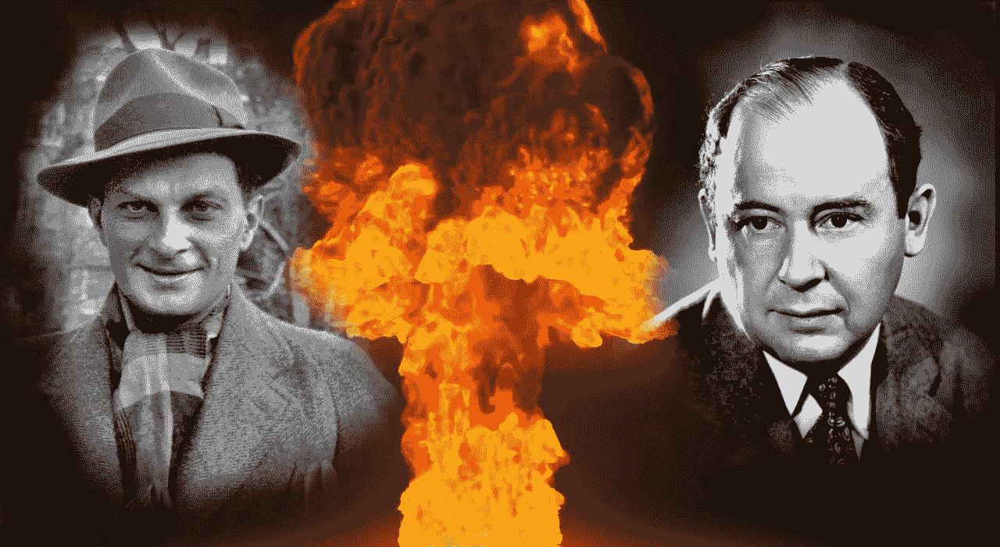
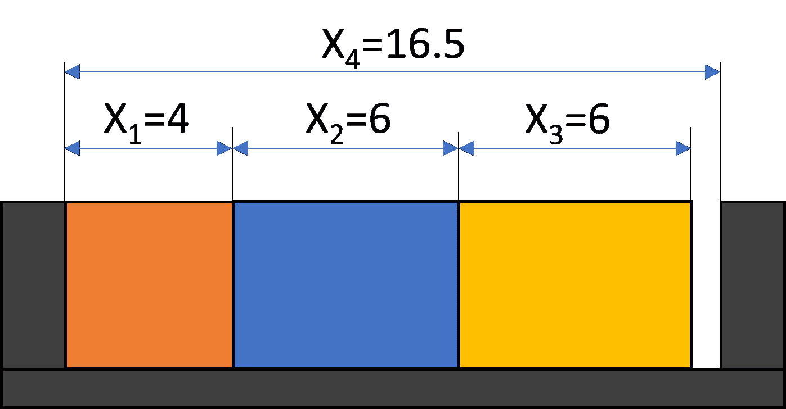
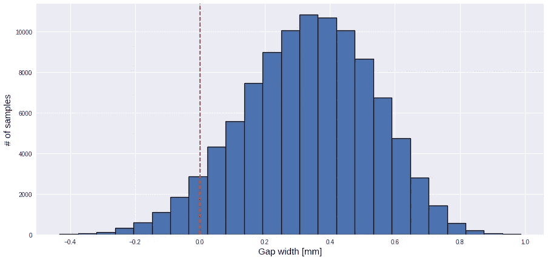
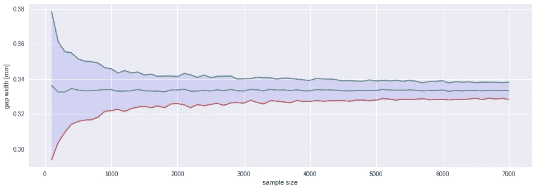

# 蒙特卡罗模拟——实用指南

> 原文：<https://towardsdatascience.com/monte-carlo-simulation-a-practical-guide-85da45597f0e>

## 一种通用的参数估计方法。Python 编程语言中的示例性实现。


图片由 [15299](https://pixabay.com/users/15299-15299/) 来自 [Pixabay](https://pixabay.com/photos/darts-dartboard-game-sports-target-102919/) 作者修改

**蒙特卡洛模拟**(或方法)是一种概率数值技术，用于估计给定的不确定(随机)过程的结果。这意味着这是一种模拟无法隐式建模的事件的方法。当我们的过程中有随机变量时，这通常是一种情况。

在本文中，我将简要介绍这种技术的背景，展示实现这种技术需要遵循的步骤，最后，将给出两个使用 Python 编程语言中的蒙特卡罗解决问题的例子。

1.  **一点历史**

蒙特卡洛模拟和许多其他数值方法一样，是在现代计算机出现之前由两位数学家发明的——它是在第二次世界大战期间开发的:[斯塔尼斯瓦夫·乌拉姆](https://en.wikipedia.org/wiki/Stanislaw_Ulam)和[约翰·冯·诺依曼](https://en.wikipedia.org/wiki/John_von_Neumann)。当时，他们都参与了曼哈顿计划，他们想出了这种技术来模拟高浓缩铀中的连锁反应。简单地说，他们在模拟原子弹爆炸。

解决“中子扩散”模型太复杂，难以描述和明确解决，特别是要记住他们只有 IBM 穿孔卡片机或后来的一台叫做 [ENIAC](https://en.wikipedia.org/wiki/ENIAC) 的计算机。在住院期间，斯坦尼斯瓦夫·乌拉姆靠打牌来打发无聊的时光，然后他有了一个新的想法。回到工作岗位后，他与约翰·冯·诺依曼实验室的一位同事分享了他的新想法。一种新的求解方法的发展得到了一个代号“蒙特卡洛”。方法以随机抽样和统计学为基础。多亏了它，两位数学家都能够加快计算过程，做出令人难以置信的好预测，并为项目提供当时非常需要的有用结果。



斯塔尼斯瓦夫·乌拉姆(左)和约翰·冯·诺依曼(右)在曼哈顿计划中一起工作；图片由 [AlexAntropov86](https://pixabay.com/users/alexantropov86-2691829/) 提供，来自 [Pixabay](https://pixabay.com/photos/nuclear-atom-bomb-atomic-science-2136244/) 和 [Wikimedia](https://en.wikipedia.org/wiki/Stanislaw_Ulam#/media/File:Stanislaw_Ulam.tif) (鸣谢:LANL)由作者修改

在洛斯阿拉莫斯国家实验室工作期间，斯坦尼斯瓦夫·乌拉姆于 1949 年发表了第一份描述蒙特卡洛模拟的非机密文件。

**2。现在申请**

目前，由于易于实现和可用的高计算能力，该技术被广泛用于各种行业。让我们看一些有文档记录的用例。

健康:

*   "[新冠肺炎样传染病传播的随机行走蒙特卡罗模拟研究](https://www.sciencedirect.com/science/article/pii/S0378437121002867)"
*   [韩国白菜、泡菜中有毒元素的人体健康风险评估，采用蒙特卡罗模拟](https://www.sciencedirect.com/science/article/pii/S0889157521002465)

金融:

*   "[使用随机准蒙特卡罗](https://www.sciencedirect.com/science/article/abs/pii/S0377221721009590)对风险条件值的敏感性估计"
*   “金融中的复杂系统:首次通过时间密度函数的蒙特卡罗评估”

生产:

*   "[使用蒙特卡洛模拟对生产计划进行稳健性评估](https://www.researchgate.net/publication/353589730_Robustness_evaluation_of_production_plans_using_Monte_Carlo_simulation)"
*   "[智能工业生产中在线决策的蒙特卡罗树搜索](https://www.sciencedirect.com/science/article/pii/S0166361521000403?dgcid=rss_sd_all)"

运输:

*   "[限制机场空域内 UAS 碰撞风险管理的三维(3D)蒙特卡罗模拟](https://www.sciencedirect.com/science/article/abs/pii/S1270963820306465)"

工程/科学:

*   基于石墨烯量子点的发光太阳能聚光器的蒙特卡罗模拟设计与优化
*   "[使用基于物理的系统性能模型和蒙特卡洛模拟对地下储气设施进行风险分析](https://www.sciencedirect.com/science/article/abs/pii/S0951832019304557)"
*   “使用基于蒙特卡罗的自适应阈值方法进行发电厂燃气轮机的非线性鲁棒故障诊断”

**3。蒙特卡洛方法的支柱**

蒙特卡洛模拟背后的核心概念是从一组给定的概率分布中进行多次随机抽样。这些可以是任何类型，例如:正常的，连续的，三角形，贝塔，伽玛，你能想到的。

要使用这种技术，您必须遵循四个主要步骤:

1.  确定流程的所有输入组件以及它们如何相互作用，例如，它们是相加还是相减？
2.  定义分布的参数。
3.  从每个分布中取样，并根据第 1 点整合结果。
4.  想重复多少次就重复多少次。

在此模拟的运行过程中，您的最终参数(例如成本或风险)将向正态分布收敛，即使源分布可能不同。这就是[中心极限定理](https://en.wikipedia.org/wiki/Central_limit_theorem)的效果，也是这种技术在各种行业大受欢迎的原因之一。

**4。Python 实现—基础知识**

蒙特卡罗模拟可以使用任何编程语言轻松实现。在这种情况下，我们将使用 Python。NumPy 库在这里非常方便，因为它实现了多个最流行的概率分布。例如:

*   [numpy.random.normal](https://numpy.org/doc/stable/reference/random/generated/numpy.random.normal.html) —正态分布
*   三角形分布
*   均匀分布
*   [numpy.random.weibull](http://numpy.random.weibull) —一种威布尔分布

**5。示例 1**

让我们假设我们有一个由 3 个阶段(X1，X2，X3)构成的过程。每一个都有一个平均持续时间(5、10 和 15 分钟)，它按照正态分布变化，我们知道它们的方差(都是 1 分钟)。


带参数的正态分布的符号


流程组件；作者图片

我们想知道这个过程超过 34 分钟的概率是多少？

这个例子是如此的简单，以至于我们可以手动解决它，然后验证蒙特卡罗结果。

我们知道所有的单个组件，所以让我们定义它们之间的关系(它是累加的):


现在我们可以开始编码了。单分量可以用一个短函数来表示:

下面显示的蒙特卡罗模拟代码使用这个函数作为一个基本块。这个用例的迭代次数被设置为 10 000，但是您可以更改它。代码的最后一部分检查退出 34 分钟限制的概率(再次使用抽样技术)。

运行以下代码后，我们得到以下答案，但每次运行代码时答案都会有所不同:

```
Probability of exceeding the time limit:  1.035 %
```

现在我们可以绘制估计参数(时间)的直方图。我们清楚地看到它遵循正态分布。


总时间直方图；作者图片

让我们用手工计算来验证我们的结果。


因此，总时间遵循带参数的正态方程:


为了计算概率，我们必须先找到 z 值。


我们现在从 z 分数表的[中读取 p 值。右尾概率我们计算为:](http://www.ttable.org/z-score-table.html)


正如你所记得的，我们的蒙特卡罗模拟给出了 1.05%的结果，这是非常接近的。

**6。例 2**

在这个例子中，假设我们想要在一个给定宽度的容器中组装三个积木。下图显示了标称尺寸。我们看到，通过设计，名义间隙为 0.5 毫米



容器内的三个块；作者图片

然而，由于技术原因，这三个块和容器的实际尺寸可以变化。为了便于演示，让我们假设这些变化都不符合正态分布。三个块将遵循下图所示的三角形分布，容器的尺寸分布将遵循+/-0.1 毫米范围内的均匀分布


三个区块 X1、X2 和 X3 的维度分布；作者图片

现在，通过简单地计算极端值，我们可以看到，在最糟糕的情况下，砖块有 17 毫米，集装箱的宽度只有 16.4 毫米，这意味着，在这种情况下，我们无法将它们全部放在一起。

问题是:我们无法将所有的块装进一个容器的概率是多少？

在这种情况下，块之间的关系如下所示:


通过修改前面的代码，我们获得了一个采样三角分布的函数。同样，我们可以获得均匀分布的采样函数。

MC 模拟的修改核心代码；

运行上述代码后，我们按以下顺序得到答案:

```
Probability of not fitting the blocks:  5.601 %
```

在检查了平均值和标准偏差之后，我们可以说关于预期间隙尺寸的更多信息:

```
The mean gap width will be 0.33mm with a standard deviation of 0.2mm.
```

现在，让我们绘制估计参数(间隙宽度)的直方图，以显示它遵循正态分布，即使没有任何输入分布属于这种类型。



遵循正态分布的间隙宽度直方图；作者图片

您现在可能想知道随着样本数量的增加，结果会如何变化。根据样本大小(从 100 到 7000 个样本)，查看下图，该图显示了 95%置信区间的间隙宽度估计值:



具有 95%置信区间的估计间隙宽度；作者图片

从该图中可以明显看出，估计值的平均值没有显著变化，但是分布随着样本数量的增加而减小。这意味着，随着新一轮的模拟，更大的样本给你更小的结果传播。然而，在某些时候添加更多的样本不再有帮助。

**7。总结**

正如你所看到的，蒙特卡洛基本上是一个非常简单而又非常强大的想法。读完这篇文章后，我希望你理解这个方法的核心概念，何时使用它，以及如何用 Python 编程语言实现它。