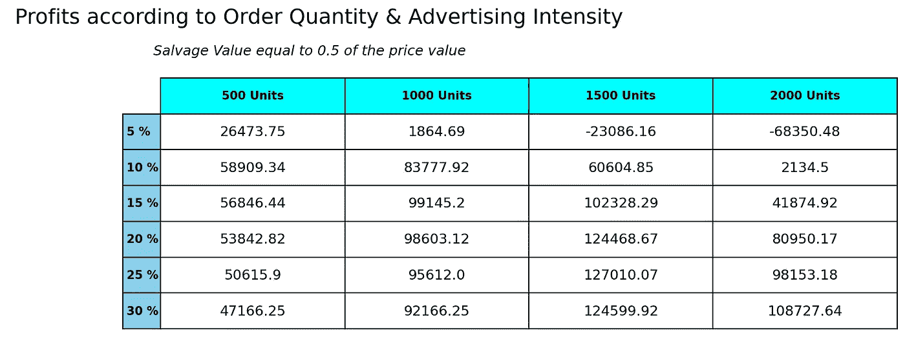

# 蒙特 卡罗模拟

> 原文：<https://towardsdatascience.com/monte-carlo-simulation-bf31bb78d39c>

## **第 6 部分:比较备选方案**


由[西蒙·伯格](https://unsplash.com/@8moments?utm_source=medium&utm_medium=referral)在 [Unsplash](https://unsplash.com?utm_source=medium&utm_medium=referral) 上拍摄的照片

在本系列的[第一篇](/monte-carlo-simulation-2b24fc810683)和[第二篇](https://medium.com/p/8db846f3d8ed#09a4-6a25f853d2de)文章中，我们将**蒙特卡罗模拟** (MCS)定义为“一个抽样实验，其目的是估计取决于一个或多个随机输入变量的感兴趣的量的分布”。这是一种定量技术，其现代发展是基于第二次世界大战期间曼哈顿计划中科学家约翰·冯·诺依曼、斯塔尼斯拉夫·乌拉姆和尼可拉斯·大都会研制第一颗原子弹的工作。从概念上讲，它是一种基于统计学的方法，用于确定基于重复随机抽样的多个结果的可能性。

一般来说，模拟技术，尤其是 MCS，在比较备选方案方面表现出色。对被研究系统的许多假设进行建模的**能力使它们成为最强大、最灵活的运筹学工具。**

任何模拟研究的最重要的目的之一是使用描述系统性能的定量统计方法来比较系统的选择。最终目标是根据决策问题确定哪个场景表现最好，并深入了解系统的行为。

因此，适当的模拟方法必须包括输入的彻底选择、客观和可测量的结果度量，以及对备选方案的最终分析和排序。

我们将通过运营管理模型中的一个经典例子来说明蒙特卡罗模拟的这些思想和概念:新闻供应商库存问题。

# **需求对广告敏感的报童问题**

新闻供应商库存问题经常出现在商业和运筹学**决策问题中。**仿照所谓的**报摊模式**。它试图回答下面的问题:**对于易腐的单一产品**订购多少，其特点是**随机需求**和固定售价。销售商希望最大化他/她的利润，但是，由于产品必须在销售期之前可用，他/她必须在观察实际产品需求之前决定订单的大小。

如本系列[第一篇](/monte-carlo-simulation-2b24fc810683)所述，问题的大致设置如下:

*   有一个卖主、一个供应商和客户。
*   未来一段时间的需求是不确定的(单周期模型)。
*   有一个决策变量(**库存水平 Q** )，必须对其进行计算，以确定利润最大化的决策(最优决策)。
*   不确定的客户需求由随机变量 *d* 及其对应的概率密度函数 *f(d)* 和累积分布函数 *F(d)表示。*
*   卖方完全知道单位固定初始成本(c)、单位销售价格( *s* )和残值( *u* )。残值是产品在使用寿命结束时的估计价值。习惯性的商业情况表明，销售价格高于购买成本，这反过来又高于残值。
*   高于库存水平的每一个需求单位都作为销售损失掉了；低于库存水平的每个需求单位都以残值出售。如果 *Q > d，(Q — d)* 单位剩余，必须由供应商回收；否则，*(d-Q)*单位代表销售损失。

经典报童问题的几个扩展已经被开发出来。其中之一涉及**广告敏感需求**:客户需求如何受到广告和营销努力的影响。

该扩展将客户需求建模为营销工作的函数。一定数量的潜在顾客收到了广告，但是做出购买决定的人数将取决于一个名为**广告效果**的因素。另一方面，所谓的**广告强度**与营销努力所针对的潜在客户数量有关。此参数将根据以下公式确定广告和营销成本:


由作者制作

其中α是常数。

因此，我们的具有广告敏感需求的报童模型包括以下等式:

*1)* *成本 _ 每订单= c * Q*

*2)**Revenue _ per _ Sales = s * minimum(d，Q)*

*3)**Revenue _ per _ Salvage = u * maximum(0，Q — d)*

*4)* *广告成本= C(AI)*

利润等式是:

*利润=每次销售收入+每次回收收入-每次订单成本-广告成本*

因此，利润是订货量(库存水平)和客户需求(广告强度)的函数。我们将使用蒙特卡罗模拟来估计订单数量，使不同广告强度值的预期利润最大化。该计算将通过对给定数据和场景进行采样来执行。订单数量和广告强度的每一个组合都是一个场景。

# **一个假设的报童问题的蒙特卡罗模拟**

我们将使用来自 Negahban [1]的数据模拟一个假设的报童问题。

我们公司想知道从供应商那里订购多少产品以便在下一季销售。

供应商为我们提供了四种选择:

备选 1: 500 件，每件成本为 200 美元

备选 2: 1000 件，每件成本为 190 美元

备选 3: 1500 件，每件成本为 175 美元

备选 4: 2000 件，每件 165 美元

我们为每个备选方案定义了相应的销售价格，并假设最初的残值相当于预测销售价值的 50%。

最后，我们选择了六种不同的广告强度(5%、10%、15%、20%、25%和 30%)。下表显示了代表不同强度随机需求的**正态分布**的 *loc* 和 *scale* 参数(平均值和标准偏差)的相应值。


由作者制作

我们有四个供应商选项和六个广告强度:这转化为 **24 个场景**。我们将为每个场景复制 3000 次运行，因此我们的主要点估计量(利润)的置信区间的半宽度对于我们的决策问题应该是合理的。

我们假设的新闻供应商问题的 python 代码如下:

```
[@author](http://twitter.com/author): darwt# Import Modules
import pandas as pd
import numpy  as npfrom scipy import stats
from scipy.stats import semimport matplotlib.pyplot as plt
from matplotlib.font_manager import FontProperties
from prettytable import PrettyTable

your_path = 'your_path'#..................................................................
# initialization module

list_Price_Per_Unit   = [330, 300, 270, 230]
list_Cost_Per_Unit    = [200, 190, 175, 165]multiplier = 0.50
list_Salvage_Per_Unit = list(np.array(list_Price_Per_Unit) * multiplier)list_advert_intens = [5, 10, 15, 20, 25, 30]
list_Mean_Normal = [288, 938, 1306, 1691, 1940, 2243]
list_Std_Normal  = [211, 262, 281,  308,  294,  289]
length1 = len(list_advert_intens)list_of_orders = [500,1000,1500,2000]
length2 = len(list_of_orders)alfa = 0.5 
confidence = 0.95                      ## selected by the analyst 
# .......................................................
column_labels = ["Advert.Intens.", "Order Quantity",
                 "Mean","Std.Dev","Var.","Std. Error", 
                 "Median", "Skewness", "Kurtosis",                    
                 "CI Half Width", "CI LL", 'CI UL']df = pd.DataFrame(columns=column_labels)
```

下面几行代码描述了这个特定报刊杂志模型的 MCS 背后的逻辑:

```
listM1, listM2, listM3, listM4, listM5, listM6 =[],[],[], [], [], [] 
list_of_Means = [listM1, listM2, listM3, listM4, listM5, listM6]Number_of_Replications = 3000for i in range(length1):

    for j in range(length2):
        list_of_profits = []
        for run in range(Number_of_Replications):

            Qty_Demanded = np.random.normal(                                          loc=list_Mean_Normal[i],scale=list_Std_Normal[i],size=1) 

            if Qty_Demanded >= 0:
                Qty_Demanded = int(Qty_Demanded)
            else:
                Qty_Demanded = 0

            Qty_Ordered  = list_of_orders[j]

            Qty_Sold = np.minimum(Qty_Demanded, Qty_Ordered)
            Qty_Left = np.maximum(0, Qty_Ordered - Qty_Demanded)

            Revenue_per_Sales = Qty_Sold * list_Price_Per_Unit[j]            
            Revenue_per_Salvage= Qty_Left * list_Salvage_Per_Unit[j]

            Cost_per_Order =  Qty_Ordered * list_Cost_Per_Unit[j]

            Cost_per_Advert = alfa * np.log(-1/((list_advert_intens[i]/100)-1))            
            Cost_per_Advert = Cost_per_Advert * 100000

            Profit = Revenue_per_Sales + Revenue_per_Salvage - Cost_per_Order - Cost_per_Advert

            list_of_profits.append(Profit)
```

我们使用 Numpy 和 Scipy 获得了一组关键的描述性统计指标，尤其是利润的期望值:

```
 media = np.mean(list_of_profits)
        stand = np.std(list_of_profits)
        var   = np.var(list_of_profits) 
        std_error = sem(list_of_profits)

        median = np.median(list_of_profits)
        skew   = stats.skew(list_of_profits)
        kurt   = stats.kurtosis(list_of_profits)

        dof  = Number_of_Replications - 1    
        t_crit = np.abs(stats.t.ppf((1-confidence)/2,dof))

        half_width =  round(stand *t_crit/np.sqrt(Number_of_Replications),2)  
        inf = media - half_width
        sup = media + half_width  

        inf = round(float(inf),2)
        sup = round(float(sup),2)

        list_of_statistics = []
        list_of_statistics.append(list_advert_intens[i])
        list_of_statistics.append(Qty_Ordered)
        list_of_statistics.append(round(media,2))
        list_of_statistics.append(round(stand,2))
        list_of_statistics.append(round(var,2))
        list_of_statistics.append(round(float(std_error),2))

        list_of_statistics.append(round(median,2))
        list_of_statistics.append(round(float(skew),2))
        list_of_statistics.append(round(float(kurt),2))

        list_of_statistics.append(round(half_width,2))
        list_of_statistics.append(round(inf,2))
        list_of_statistics.append(round(sup,2))

        df.loc[len(df)] = list_of_statistics

        list_of_Means[i].append(round(media,2))
```

我们使用 Matplotlib 显示了一个 6 行 4 列的表格，显示了 24 种情况下的利润。

```
row_list = [str(x) + ' %'     for x in list_advert_intens]
col_list = [str(x) + ' Units' for x in list_of_orders]

subtitle_text = 'Salvage Value equal to %s' %multiplier +
                ' of the price value'fig, ax = plt.subplots(1,1)
ax.axis('tight')
ax.axis('off')
profits_table = ax.table(cellText  =  list_of_Means, 
                         rowLabels = row_list,
                         colLabels = col_list,                      
                         rowColours =["skyblue"]*(length1),  
                         colColours =["cyan"]*length2, 
                         cellLoc='center', loc="center",
                         bbox = [0.1, 0, 1.9, 1.0])
ax.set_title(" Profits according to Order Quantity & Advertising Intensity",fontsize=18, y= 1.2 , pad = 4)plt.figtext(0.5, 0.95,
            subtitle_text,
            horizontalalignment='center',
            size= 12, style='italic',
            color='black'
           )profits_table.auto_set_font_size(False)
profits_table.set_fontsize(12)

for (row, col), cell in profits_table.get_celld().items():
  if (row == 0) or (col == -1):
      cell.set_text_props(
                       fontproperties=FontProperties(weight='bold'))plt.savefig(your_path +'Scenarios.png',bbox_inches='tight', dpi=150)
plt.show()
```

然后，我们使用 Matplotlib 绘制相同的数据，以实现更好的可视化:

```
fig, ax = plt.subplots()

for i in range(len(list_of_Means[0])):
    plt.plot(list_advert_intens,[pt[i] for pt in list_of_Means],
             label = list_of_orders[i],
             linestyle='--', marker = '*')
plt.legend()
plt.axhline(y = 0.0, color = 'k', linestyle = '-')

fig.suptitle('Monte Carlo Simulation',  fontsize=20)
plt.xlabel('Advertising Intensity (%)', fontsize=16)
plt.ylabel('Profit (U$S)', fontsize=16)
plt.xticks()plt.savefig(your_path +'ScenarioChart.png',
            bbox_inches='tight', dpi=150)
plt.show()
```

最后，我们将 *PrettyTable* 用于对应利润最大的场景的统计报告。

```
max_profit = df.loc[df["Mean"].idxmax()]

t = PrettyTable(['Statistic', 'Value'])
t.add_row(['Runs', Number_of_Replications])
t.add_row(['Advert.Intens.',max_profit['Advert.Intens.']])
t.add_row(['Order Quantity',max_profit['Order Quantity']])
t.add_row(['Mean', max_profit['Mean']])
t.add_row(['Median', max_profit['Median']])
t.add_row(['Variance', max_profit['Var.']])
t.add_row(['Stand. Error', max_profit['Std. Error']])
t.add_row(['Skewness', max_profit['Skewness']])
t.add_row(['Kurtosis', max_profit['Kurtosis']])
t.add_row(['Half Width',max_profit['CI Half Width']])
t.add_row(['CI inf', max_profit['CI LL']])
t.add_row(['CI sup', max_profit['CI UL']])

print(t)
```

**分析**

我们对 24 个场景中的每一个进行了 3000 次复制，将统计测量附加到数据帧上。表 1 显示了每个场景的平均利润。最佳的数字决策包括购买 1500 个单位，并以 25%的广告强度进行营销。



表 1，作者用 Matplotlib 做的。

图 1 显示了相同数据的线性图。图表显示，我们可以将广告强度降低到 20%，而不会严重损害我们的利润。


图 1，作者用 Matplotlib 做的。

表 2 显示了最大利润的置信区间的半宽度。置信区间的半宽度通常表示模拟研究中性能测量的估计精度。表中所示的半宽度符合我们的精度要求。


表 2，作者用 PrettyTable 做的。

最后，我们用两个不同的残值百分比重复了模拟:最初预测销售价值的 25%和 75 %。表 3 显示了新方案的平均利润(75%)。可以看出，我们的决策问题没有变化:我们必须购买 1500 台，并以 20%的广告强度进行营销努力。


表 3，作者用 Matplotlib 做的。

这是蒙特卡罗模拟的另一个实际实现，以非常简单的方式解决复杂的决策问题。毫无疑问，对于许多现实世界的系统来说，它是一种非常强大的建模、分析和计算性能指标的技术。

不要忘记给小费，尤其是当你把文章添加到列表中的时候。

[1] Negahban，A .“广告和病毒式营销的报童问题的混合模拟框架”。2013 年冬季模拟会议录。R. Pasupathy、s-h . Kim、A. Tolk、R. Hill 和 M. E. Kuhl 编辑。