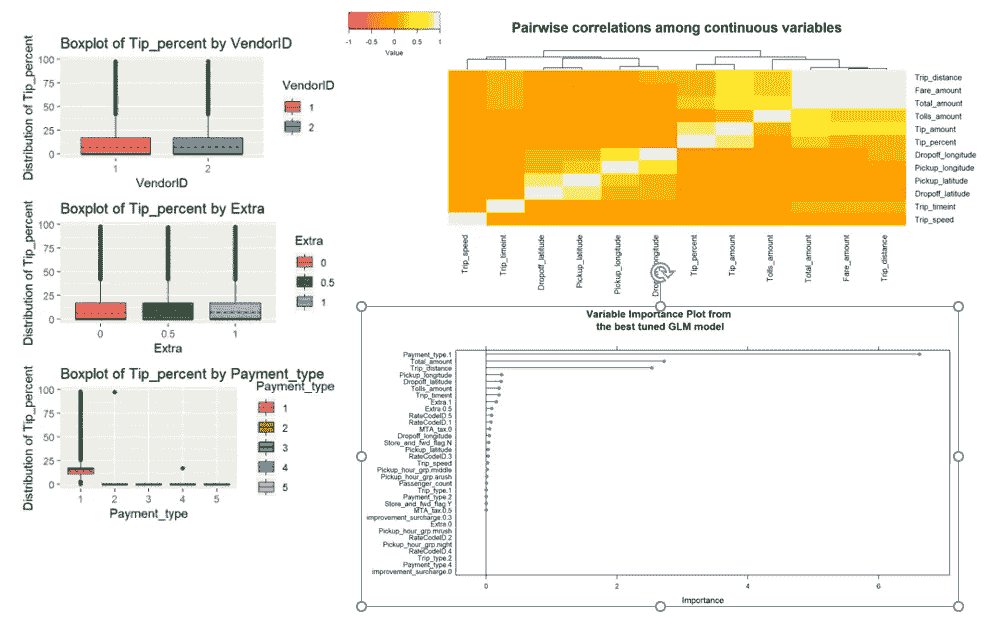

# 在数据科学领域取得成功最重要的软技能

> 原文：<https://towardsdatascience.com/most-essential-soft-skill-to-exceed-in-data-science-60be3f2af965>

## 实现您的分析项目真正价值的最佳实践

说到数据科学家这个职位，众所周知，他们是精通技术的人。主要是因为数据科学家应用各种数学和分析技术来从数据中获得洞察力。然而，很少有人谈论数据科学软技能，根据我自己的经验，这与技术技能一样重要，如果不是更重要的话。

在这篇文章中，我将分享最重要的软技能——向利益相关者、领导或高管沟通和展示你的工作！为什么我认为这是最重要的？好吧，不管你的技术技能有多好，如果你不能与他人交流，你就不能实现你的分析的真正价值。

## 数据科学的利益相关者

数据科学团队的利益相关者通常分为**四个**主要类别，

*   **利益相关方群体#1 客户和客户**，尤其是在咨询领域工作的数据科学家，您和您的团队可能会定期与客户召开会议，让他们了解最新的分析项目。目的是让他们参与治理和决策过程。
*   **利益相关方集团#2 贵公司的行政领导**。对于数据科学团队，我们需要确保我们的数据分析与企业战略保持一致。
*   **利益相关者组织#3 业务运营合作伙伴。**例如，客户服务团队通常不精通技术；然而，他们拥有非常丰富的领域知识，这就要求他们对数据科学团队可以在业务的哪些方面进行改进有好的想法。
*   **利益主体组织#4 IT 和数据架构师团队**，他们也是我们的合作伙伴。数据科学团队与他们一起工作，构建交付渠道，为业务决策流程提供支持。

******更新:你也可以在这里看我频道的视频版🎥，***

显然，数据科学家与不同背景的不同团队交流。最常见的情况是，我们在跨职能的环境中工作，我们的沟通和演示必须能够将分析结果传达给每个人，这一点很重要。这为我们的下一部分提供了一个良好的开端。

## 准备向利益相关方进行分析演示的技巧

首先也是最重要的，在开始准备之前，确保你了解 ***你的听众和这次演讲的目的*** 。

*   对于**技术人**来说，有时候需要讲术语、术语，甚至编程代码。这样做将有助于他们更好地了解你在努力实现什么，以及他们可能会做出多大的贡献。然而，对于**不太懂技术的人**，在一个非常高的层次上谈论你的方法论就足够了；
*   至于目标，如果演示是为了将分析结果传达给运营团队，那么我会使结果更具可操作性，并且还会将业务影响呈现出来。**一般的经验法则是强调商业价值，同时用数据来加强你的分析**，但是要非常简洁；

话虽如此，我也准备**用通俗易懂的英语**解释某些技术概念。举个例子，我们可以用下山的*类比*来解释梯度下降算法，其中(山的)底部点是我们的预测误差达到最小的地方。

另一个有用的准备技巧是**在演讲之前把你的提纲发过来**。它不必是什么花哨的东西，所需要的只是关于你要展示的内容的*要点*以及*关键结论和要点*

最后一个准备技巧是从技术角度来看的，**确保你的代码、原型或 MVP 工作正常**。想想看，有多少次您将要演示的分析产品突然停止工作了？还有，这总是发生在你开会之前，不是吗？因此，对您的代码或 MVP 进行双重检查为成功的交流和演示增加了一层额外的安全保障。

现在，与顾客或客户相反，他们联系数据科学家时已经想到了他们的任务或问题，我们的执行领导是一个特殊的利益相关者群体；因为在开始任何分析项目之前，我们需要首先获得他们的认可。

## **获得领导认同的最佳实践**

> **1。确定动机**

向高管推销分析想法时，作为第一步，我们应该主动**确定他们的真正动机，以及我们的数据分析对他们的目标有多大影响**。例如，如果行政领导关心的是如何防止信用卡欺诈，那么建立一个图像处理模型将超出他们的兴趣，不管它可能有多准确！这意味着，作为数据科学家，除了技术细节，我们还必须关注组织的全局。

> **2。业务绩效指标**

一旦我们理解了整个难题，我们将**设置清晰的项目计划、执行管道，以及业务性能指标**，这些指标通常不同于构建模型本身的模型评估指标。

例如，我将总结**这种预测模型可能带来的潜在财务节约或财务收益，而不是展示您的模型准确性或您的错误率有多低**。基本上，这些数字是激励高管实际买入的原因！

> **3。展示您的原型并解释您的模型**

当我们在模型开发过程中取得一些进展后，我会展示一个工作原型。根据具体的项目，它可以是简单的概括我们初步发现的可视化，或者，它可以是一个带有可变解释的基线模型。通过从业务角度展示驱动因素，我们将增加获得领导层认同的可能性。

> **4。让反馈回路运转起来**

最后但同样重要的一点是，我们需要经常不断地从高管那里收集反馈或意见；此外，确保管理他们的期望，因为我们不想过度宣传项目。教育高管，数据科学项目更像是一个迭代实验！

重要的是，他们要明白没有什么是完美的，数据科学之旅也不例外！从长远来看，让他们参与进来将有助于建立信任文化。

## 结论

技术技能对于成为一名优秀的数据科学家非常重要，但是，要真正为我们的组织提供最大的分析价值，数据科学家需要发展他们的软技能，如有效的沟通和演示！

希望你喜欢这篇文章，并从这篇文章中得到一些启发！

***想要更多数据科学和编程技巧？使用*** [***我的链接***](https://yilistats.medium.com/membership) ***注册 Medium，获得我所有内容的全部访问权限。***

***还订阅我新创建的频道*** [***《数据与吉谈》***](https://www.youtube.com/channel/UCbGx9Om38Ywlqi0x8RljNdw) ***😀***

# 更多有趣的文章

</best-of-both-worlds-automated-and-dynamic-sql-queries-from-python-5b74a24501b0>  </6-sql-tricks-every-data-scientist-should-know-f84be499aea5>  <https://levelup.gitconnected.com/6-hilarious-programmers-data-scientists-jokes-to-kick-start-2021-187f86dd6a4c> 