# 山地车分类分析

> 原文：<https://towardsdatascience.com/mountain-bike-categorization-analysis-61eb1d8bb259>

## 山地车(MTB)的规格是否足以区分不同类型的山地车类别？

贾斯汀·舒尔伯格和迈克·切尔文斯基


照片由[扬·kopřiva](https://unsplash.com/@jxk?utm_source=medium&utm_medium=referral)在 [Unsplash](https://unsplash.com?utm_source=medium&utm_medium=referral) 上拍摄

# 概观

对于这篇[文章](https://datacracy.netlify.app/post/2022-05-05-mtb-categorization-analysis/)，我与 [Mike Czerwinski](https://github.com/mczerwin) 一起确定山地车(MTB)的规格是否足以区分不同类型的山地车类别。

目前，全悬挂山地车分为 5 类:

*   **越野(XC)** |往往是最轻便、最灵活的车型，旨在让骑手处于高效的踩踏位置
*   **Enduro (EN)** |更重的车架、更大的行驶距离和更适合下坡的几何形状
*   **Trail (TR)** |最常见的自行车种类，被认为是 XC 和耐力赛的中间点
*   **All Mountain (AM)** |这是一个更小众的类别，一些制造商声称它比越野自行车更注重下坡，但不是像 Enduro 自行车那样为下坡比赛而设计的
*   **Downcountry (DC)** |介于 XC 和特雷尔之间的一个相对较新的类别。类似于所有的山地类，这些自行车不像 XC 自行车往往是特定的比赛，但比越野自行车更轻，更快。

设计自行车时要考虑的所有因素，这些类别之间没有明确的界限。例如，一个品牌的越野自行车可能是另一个品牌认为的越野自行车。流行的山地自行车网站 PinkBike 对所有类别的许多自行车进行了深入的分析，并涵盖了自行车应该归类为哪个类别以及多少类别才足够的主题，如这里的视频[所示。](https://www.youtube.com/watch?v=JYQJbymyG6k&ab_channel=Pinkbike)

> **此分析的目标是确定山地自行车应存在多少(如果有的话)独立类别。**

由于大多数规格和几何尺寸在自行车系列中有一个方向，因此有理由相信这些尺寸可以减少到更少的维度，甚至可能是一个连续的主要组成部分，而不是离散的类别。我们还可以根据这些规格和几何尺寸将自行车组合在一起。

例如，您可以在[这里](https://geometrygeeks.bike/understanding-bike-geometry/)找到一些不同类型的山地车几何规格图。

# 数据

这些数据是从每个山地车公司的网站上手动获取的。这个分析的所有数据和相关代码都可以在团队相应的 [GitHub 资源库](https://github.com/mczerwin/MTB-Categorization-Analysis)中获得。我们来看看数据。

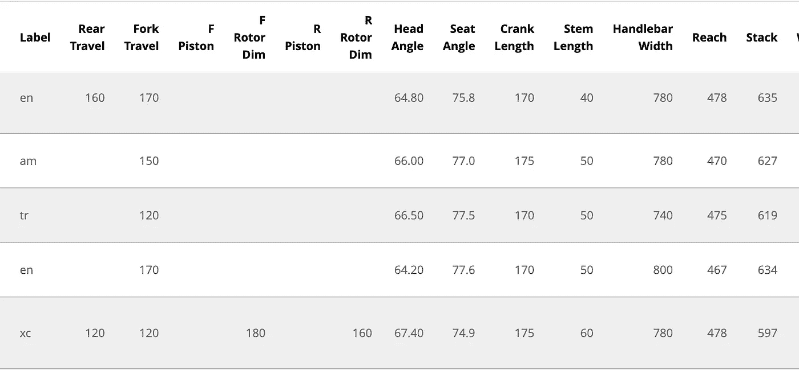

作者图片

# 电子设计自动化(Electronic Design Automation)

在这一节中，我们将看看数据集中的 74 辆山地自行车和 27 个特征中的一些。我们将尝试根据`label`来分解我们对数据的理解，这是我们作为每辆山地车类别的目标变量。

## 标签(山地车类别)

如前所述，我们的数据集中有 5 个山地车类别:

1.  越野赛
2.  耐力赛
3.  拖车(tr)
4.  所有山(上午)
5.  市中心

让我们来看看在我们的数据集中每一种有多少。

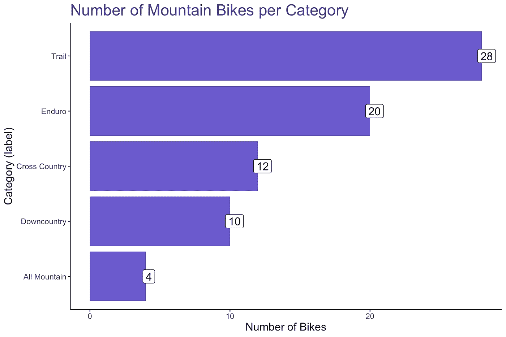

作者图片

我们看到，在我们的 74 辆自行车中，大多数都是越野自行车，最小的自行车组都是山地自行车。

## 分类变量

为了更好地理解我们的数据，我们将看看 4 个分类变量:

1.  环境
2.  大小
3.  前活塞(`f_piston`)
4.  后活塞(`r_piston`

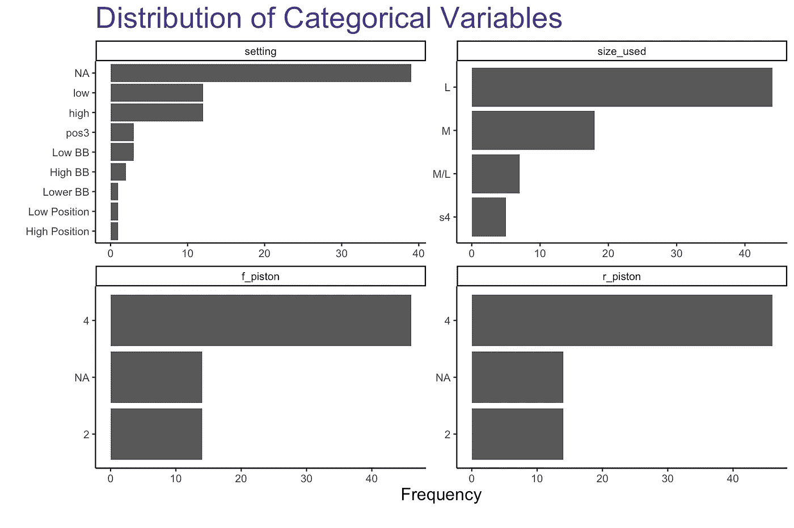

作者图片

*   我们看到，只有少数自行车有一个设置值，这是一个功能，允许骑车人稍微调整框架的几何形状，以提高骑车人的舒适度。稍后，我们将根据同一辆自行车的设置进行分组，并对结果进行平均，以获得自行车规格的更准确表示。
*   大多数分析的自行车有 4 个后/前活塞。这两个变量似乎完全同步，让我们相信它们高度相关。

但是，实际上，我们关心的是理解这些不同的变量如何与我们的目标变量`label`相互作用。让我们看看它们的分布，并寻找任何模式。


作者图片

这里我们看到:

*   大多数自行车的尺寸分布相当均匀。在很大程度上，我们试图找到适合本报告作者身高的自行车(大约。5 英尺 8 英寸-5 英尺 11 英寸)，这往往是大型自行车；然而，对于一些自行车，如 Trail，我们从中提取数据的特定自行车公司网站推荐了一辆中型自行车。
*   虽然大多数自行车有 4 活塞制动器，但在有 2 个活塞的自行车中，大多数是越野( *xc* )自行车。众所周知，4 活塞制动器具有更高的制动力，这在骑车人越想下坡时就越重要。然而，它们以额外的重量为代价，这是大多数 XC 车手会不惜一切代价避免的。

## 连续变量

为了分析数据集中的连续要素，我们为每个要素构建了密度图，以更好地了解它们的分布。

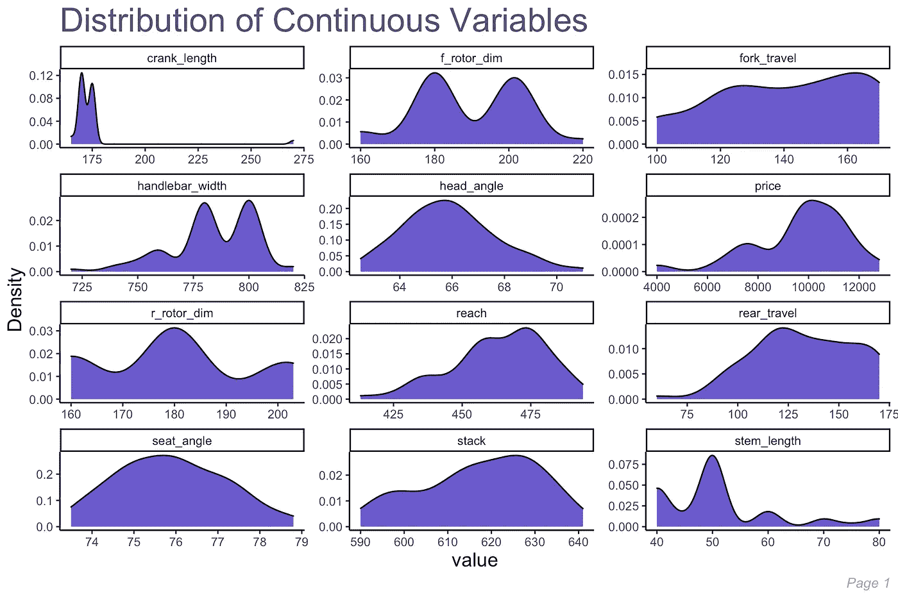

作者图片


作者图片

## ~正态分布变量:

*   链条长度
*   叉 _ 旅行
*   Bb _ 高度
*   座椅 _ 角度

## 偏斜变量:

*   头部 _ 角度(向右倾斜)
*   车把 _ 宽度(向左倾斜)
*   轴距(向左倾斜)

## 多模态分布变量:

*   f _ 转子 _ 尺寸/r _ 转子 _ 尺寸
*   茎长度

就像我们对连续变量所做的那样，让我们通过我们的目标变量`label`来观察这些预测值的分布，以寻找任何可辨别的模式。

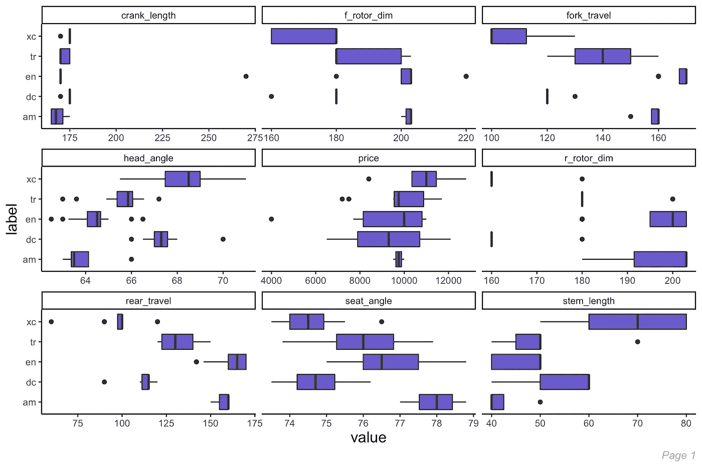

作者图片


作者图片

这里我们看到:

*   与其他自行车相比，越野( *xc* )自行车往往具有最大的头部角度和最小的座位角度。它们的茎长也是最长的，相差很大。总体而言，越野自行车往往是最有别于其他自行车类别；
*   所有的山地车( *am* )都有一个明显更小的高度，和耐力赛( *en* )自行车一起，比其他种类的自行车有更大的覆盖范围；
*   正如人们普遍预期的那样，对于这些连续变量中的大部分，越野自行车往往最适合处于中间位置。这是有道理的，因为他们倾向于区分越野自行车和耐力自行车。

## 通过倒装芯片设置平均自行车

因为一些自行车的网站对于相同尺寸的自行车会有两种不同的“设置”，所以我们选择包含这两种选项，并将两者平均在一起，以获得该类型自行车的一个中间值。我们最终对数据集中 47%的自行车执行了这个操作。

# 方法学

现在我们对山地车数据集有了更好的了解，我们将制定一个计划来证明以下假设:

为此，我们将:

*   尝试使用各种方法来减少功能集，看看是否有某些变量可以更好地用于区分不同的山地车类别。
*   应用各种聚类和分类算法，包括 K-Means 聚类，高斯混合模型和多类支持向量机，以反驳 5 种不同类别的山地车存在的概念。

# 功能集之间的差异

我们要做的第一件事是查看数据集中的任何要素是否比其他要素更能解释不同自行车之间的差异。也就是说，完全有可能两个特征是相似的，没有太大的差异，即使在一些不同的自行车类别中也是如此。为此，我们将:

1.  寻找高度相关的特征，并标记这些特征以进行潜在的移除；
2.  运行主成分分析(PCA ),看看某些特征是否比其他特征更能解释数据中的变化。

## 1.相互关系

首先，让我们来看看我们最高度相关的功能。我们将使用`corrplot()`函数按照特征向量的角度顺序对高度相关的特征进行更好的排序。


作者图片

这里我们看到一些明显的相关性，例如:

*   `f_piston`(前制动器)与`r_piston`(后制动器)完美关联，这是有道理的，因为山地车往往对前轮和后轮使用相同类型/规格的制动器。
*   `fork_travel`与:c("后 _ 行程"，"叉 _ 行程")的相关性在. 95 以上。这是有道理的；比如`rear_travel` *应该是*和`fork_travel`高度相关。

总之，以下是相关性最高的变量(即相关性高于. 9 或低于. 9 的变量):

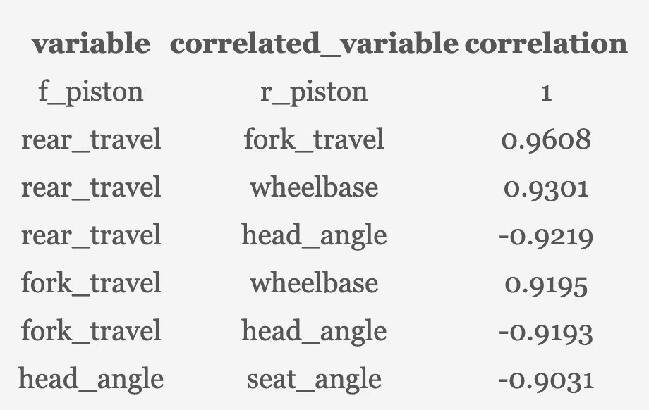

作者图片

这是一个很大的数目，特别是考虑到我们的数据集中只有 18 个连续的列！目前，我们将选择包含所有内容。但是稍后，当我们分析不同特性的重要性时，我们将首先去除上面的一些变量。

## 2.主成分分析

接下来，我们将对数据集应用 PCA。在这样做的时候，我们将不得不集中和调整我们的数据，因为某些测量的范围是如此的不同。让我们来看看解释数据中最大方差比例的 5 个主成分:


作者图片


作者图片

我们可以看到，实际上，我们的第一个主成分解释了超过一半的数据。从第二个主分量开始，有一个明显的拐点。之后，我们有一个巨大的下降。从我们的第 5 个主成分开始，近 82.4%的数据变异得到了合理的解释。这让我们相信，我们数据中的大部分变化都可以用一个主成分来解释！

让我们来看看我们的两大主要因素是如何解释 5 种不同的山地车类别的:

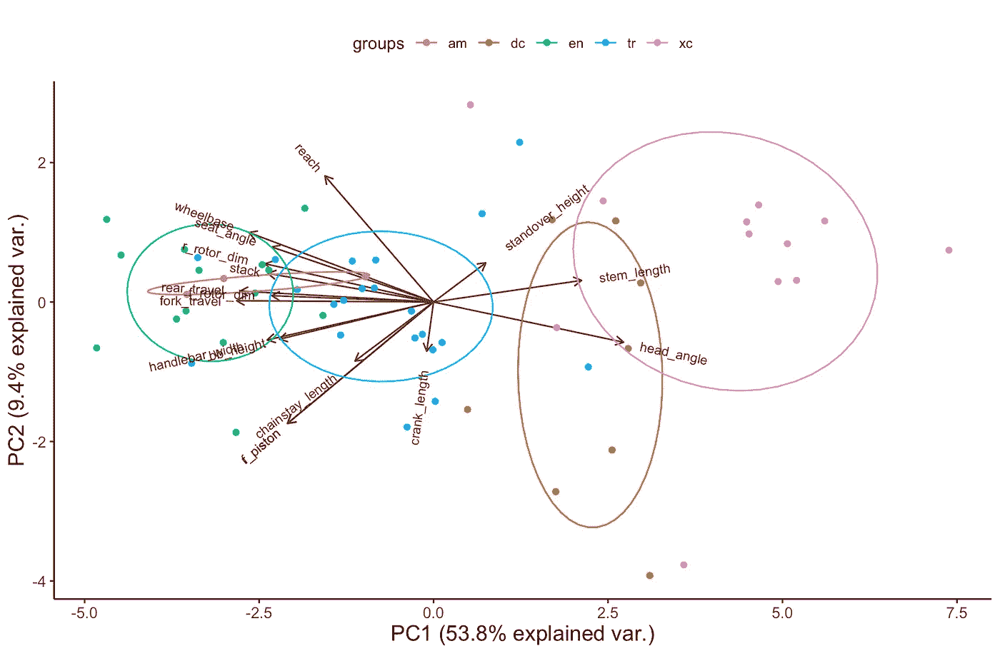

作者图片

这里我们可以看到，我们的前 2 个主成分，解释了我们数据中大约 63.2%的变化，已经是描述我们数据集中不同成分的很好的表示。即便如此，这些分组在二维图上还是清晰地标出来了，很容易看出不同的自行车类别(用颜色表示)是如何用我们现有数据的线性变换来解释的。

# 使聚集

因为我们正在调查山地自行车类别的有效性，一种方法是将该数据集视为无监督的，剥离自行车的`label`，并查看各种聚类算法是否可以重新创建 5 个不同的`label`。为此，我们将了解以下算法:

*   k 均值
*   高斯混合模型(GMM)
*   支持向量机(SVM)

## k 均值

我们将从使用 K-Means 聚类算法开始，查看不同数量的聚类( *k* )并查看自行车是否逻辑地分组在一起。

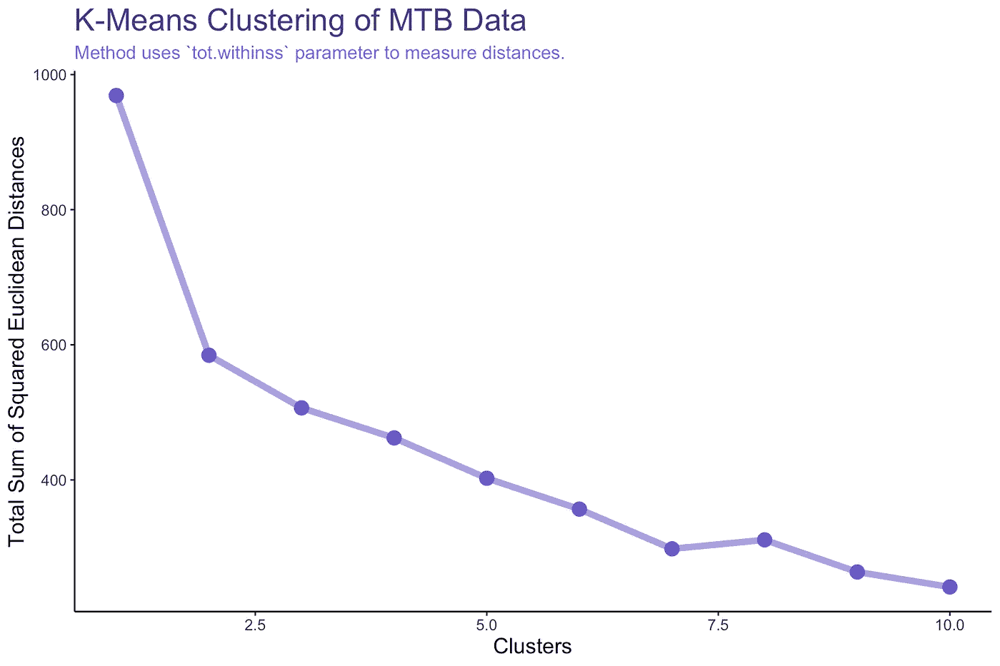

作者图片

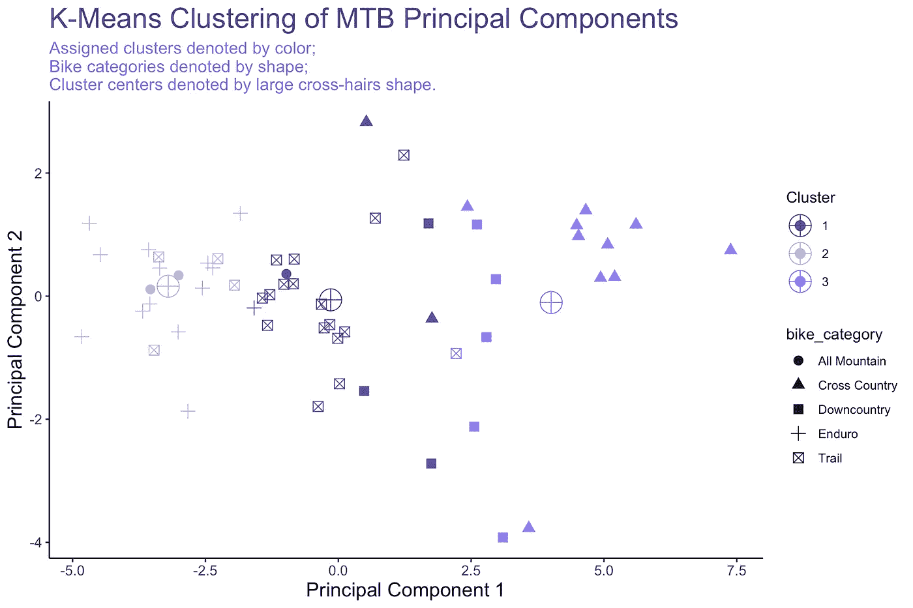

作者图片

上面，我们试图用我们数据中的前 2 个主成分来绘制 3 个聚类图。例如，我们可以在图表的右侧看到聚类#1，主要由越野自行车(图表中的三角形)和一些乡村自行车(用正方形表示)组成。越野自行车似乎也是第二类(灰色点)的一部分，还有越野自行车(用带“x”的方块表示)和一些耐力自行车(用“+”表示)。然而，越野自行车和大多数耐力自行车也在第三组中占有重要地位。

总的来说，很明显，我们的集群之间有明显的重叠，主要是沿着主成分 1 轴；相信我们的自行车可以在一个单一的、连续的范围内被区分开来。

*注意:在图的右下方(* `*PC2 < -4*` *)，我们看到两辆 Niner 自行车，几乎充当离群值。对于一个 5 英尺 10 英寸的骑手 Niner 建议一个中等大小，这导致其自行车上的低接触数。从早期的 PCA 图中，我们看到 Reach 与 PC2 非常一致，因此这些自行车在视觉上显得较低。*

## 高斯混合模型(GMM)

在这一节中，我们将采用一个更具概率性的模型来进行聚类。也就是说，我们将使用高斯混合模型(GMM)在山地车数据集中构建正态分布的子分组，其中每个子分组的密度代表一辆自行车属于该子分组的概率。与更基于质心的聚类方法 K-Means 不同，GMM 更基于分布的聚类方法。

一般来说，我们希望看到如下内容:

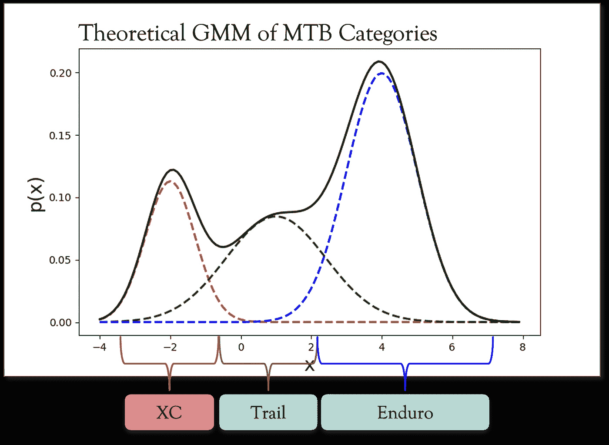

作者图片

其中，给定一种特定类型的自行车，我们可以预测一辆自行车属于类似于`Cross Country (xc)` vs. `Trail` vs. `Enduro`的类别的概率 p(x)。

我们将在 R 中运行`ClusterR::GMM()`函数来计算出最佳的集群数量。它使用期望最大化算法进行概率聚类；在每次迭代中，它的目标是最大化贝叶斯信息准则(BIC ),以确定最佳的聚类数。

```
## iteration: 1  num-clusters: 1
## iteration: 2  num-clusters: 2
## iteration: 3  num-clusters: 3
## iteration: 4  num-clusters: 4
## iteration: 5  num-clusters: 5
## iteration: 6  num-clusters: 6
## iteration: 7  num-clusters: 7
## iteration: 8  num-clusters: 8
## iteration: 9  num-clusters: 9
## iteration: 10  num-clusters: 10
```

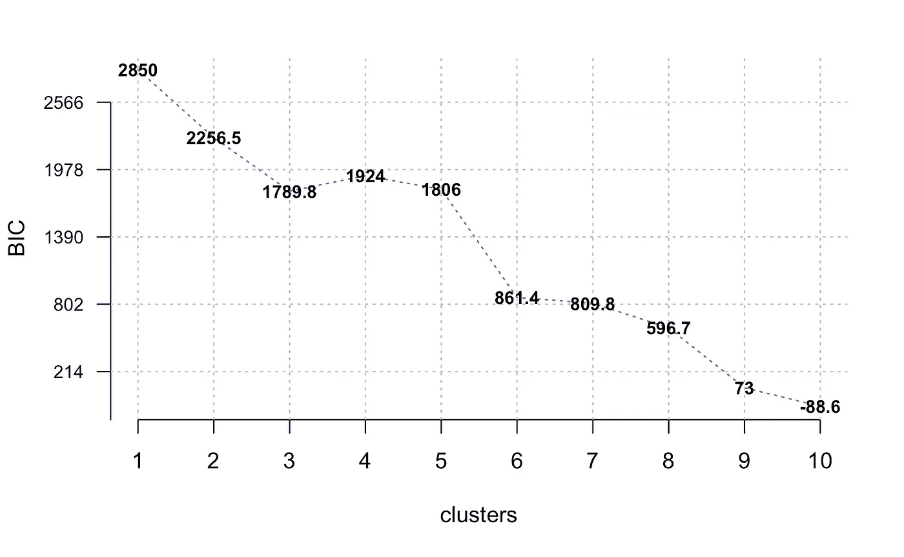

作者图片

从上面的图中，我们看到，随着集群数量的增加，BIC 值一般会降低*。然而，看来第一次大跌是在`clusters = 3`的时候。让我们尝试一下这个值，看看有哪些自行车类别被映射到 3 个分类中。*

## *GMM — 3 个集群*

*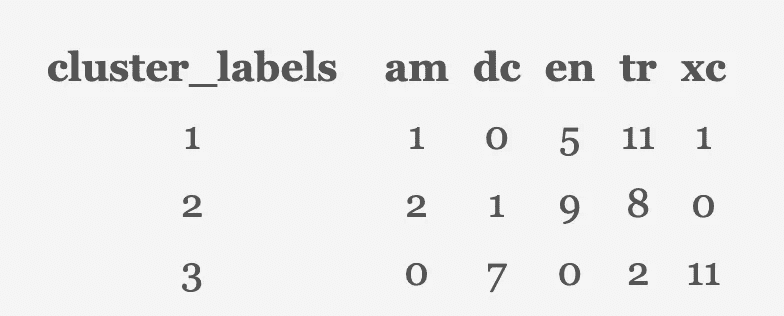*

*GMM — 3 个集群*

*在这里，我们可以看到预测的分类标签以及数据中实际的 5 个自行车类别。越野和耐力自行车主要被归为第 1 和第 2 类，而越野和越野自行车被归为第 3 类。这将使我们相信，最初的 5 个自行车类别可以用更少的聚类来充分解释。*

*即便如此，让我们通过查看属于某个分类标签的自行车的每个关联概率的密度，来看看每辆自行车属于某个分类的概率是如何出现的。*

*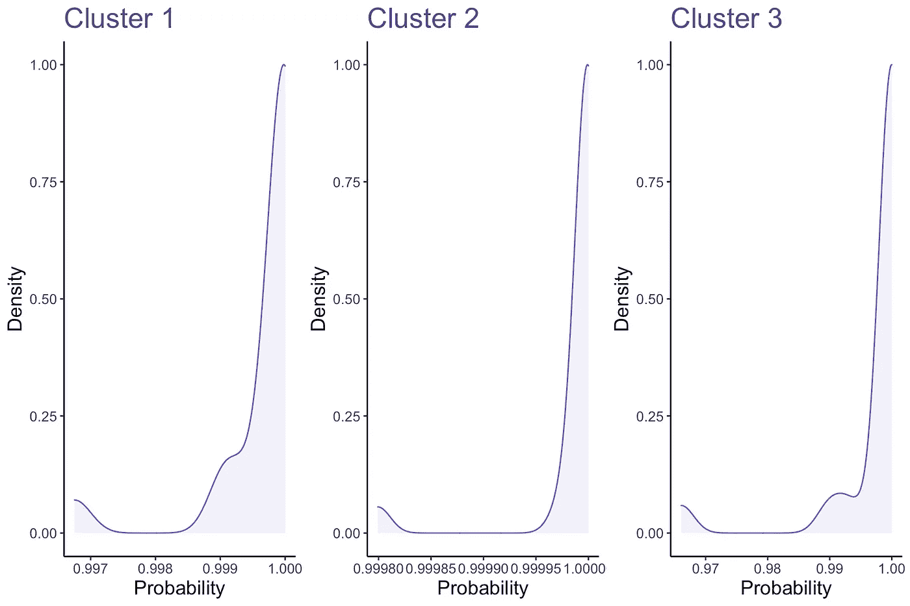*

*作者图片*

*上面，我们看到了与预测正确的类标签相关联的预期概率。也就是说，左边的图显示了 3-聚类高斯混合模型对于预测适合聚类#1 的自行车的准确度。一般来说，预测的概率都在 0.95 以上；也就是说，GMM 非常有信心将不同的自行车分成这三组。*

## *GMM——6 个集群*

*之前 BIC 图表中的下一个逻辑“拐点”在 6 个集群处。出于演示的目的，我们也展示一下这是什么样子。*

*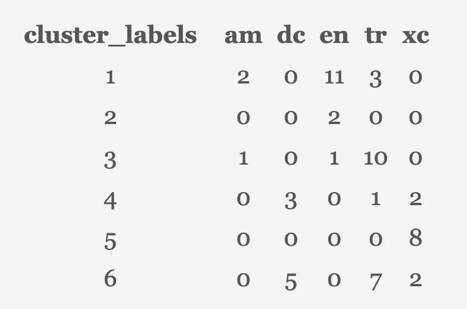*

*GMM——6 个集群*

*在这里，我们可以看到 6 个预测的分类标签以及数据中实际的 5 个自行车类别。这里有一些比我们之前看到的更清晰的可分性。例如，集群 2 仅由两辆耐力自行车组成，集群 5 仅由越野自行车组成。然而，耐力自行车在混合组 1 中占据显著位置；越野自行车在第 4 组和第 6 组中略有特色。总的来说，与使用 3 个集群相比，使用 6 个集群会混淆分组。*

## *多级 SVM*

*如果我们采取稍微不同的方法，选择将我们预先分配的`label`视为真理，那么我们可以将这种分析视为监督学习问题。*

*在本节中，我们选择将 All Mountain 和 Enduro 分类，因为它们在之前的 PCA 图表中完全重叠。我们还选择切换 Downcountry 类别的分类，将其作为一个单独的类别，并将其与 Trail 和 XC 分组，以试验模型的结果。*

*我们选择使用多类支持向量机(SVM)和网格搜索来调整核函数和γ值。对于每组参数，我们对所有数据行进行了 10 重交叉验证。我们决定不将数据作为测试集，因为我们的数据如此有限，10 倍 CV 应该评估模型在盲数据上的表现。*

*使用所有的数据，最好的 SVM 模型是 73%准确，使用γ=2.595024 的径向基核函数。*

*将县以下类别视为 XC，最佳模型的准确率为 81.6%，径向基核函数的γ=0.02983647。*

*将县以下类别视为 Trail，使用γ=3.764936 的径向基核函数，最佳模型的准确率为 80.0%。*

*从逻辑上讲，将越野自行车与它们相邻的类别组合在一起自然会提高性能；然而，这可能表明，内地类别更倾向于 XC 自行车。*

*为了可视化 SVM 分类器的结果，我们将所有特征映射到 2 个主成分。通过这样做，我们能够使用线性核达到 75%的更高精度，同时继续将县以下类别视为其自己的独特类别。*

*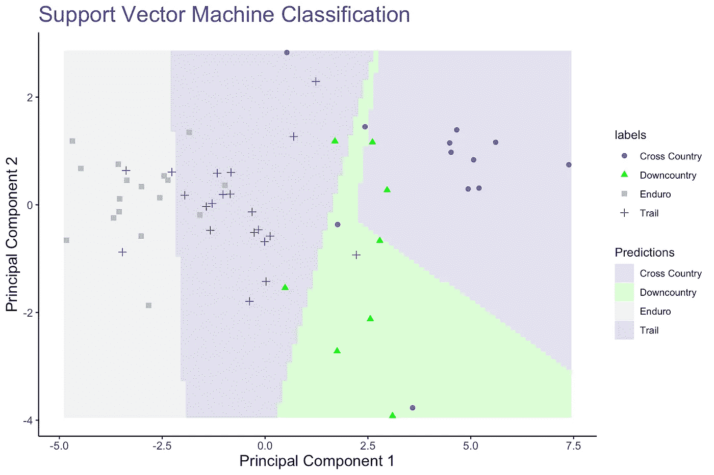*

*SVM — 4 个标签*

*在上图中，我们可以看到 SVM 是如何将自行车类别的实际标签紧密地映射到它们的预测类别的。存在一些错误分类(当不同颜色的点出现在不同的阴影区域时)，但总体而言，阴影 SVM 特征空间似乎是自行车类别的准确表示。*

*一个有趣的观察是，大多数边界线或多或少是垂直的，这表明类之间的大多数变化是沿着主成分 1 的。我们看到了 XC 和下郡边界之间的这种偏离，然而这种边界的有效性仍然是个问题，因为下郡类别本身或多或少是非正式的。让我们尝试将越野自行车重新映射到越野(XC)类别，并查看更新后的结果。*

*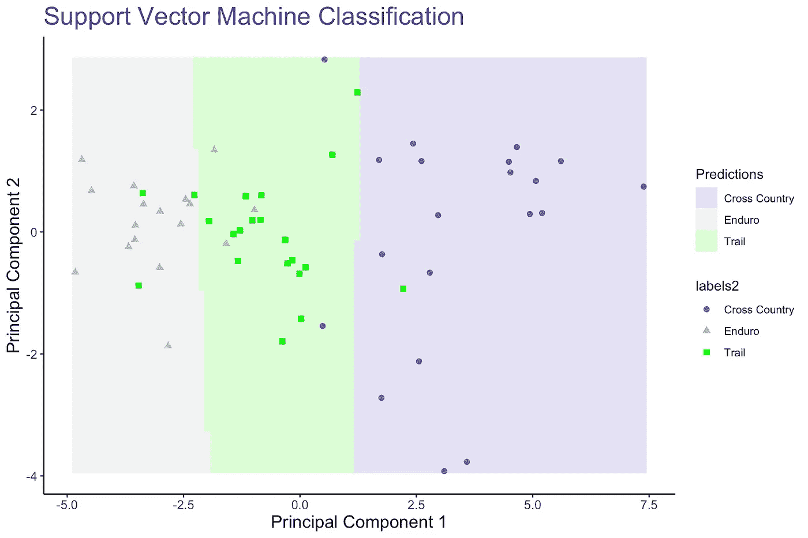*

*SVM — 3 个标签*

*将所有的乡村自行车映射到 XC，边界变得几乎完全垂直，这再次表明自行车的分类可以归因于主成分 1。不同的区域似乎是 3 种自行车类别的准确预测器，并且易于解释，这意味着我们已经有效地减少了模型中的偏差。*

# *调查的结果*

*   *所有的结果表明，试图离散分类全悬挂山地车或多或少是任意的。*
*   *山地车的分类应被视为一个连续的规模，越野(XC)自行车在一端，耐力赛(EN)自行车在另一端。*
*   *要获得特定自行车在该比例上的位置，可以使用自行车规格和第一主成分的线性组合。*
*   *这种新的测绘自行车系列可以为自行车制造商和消费者提供一种量化自行车骑行时操控性能的方法。*

*让我们从上面的数据中来看一个例子。一些自行车公司，如 Transition 和 Revel，并不像其他公司那样明确地对他们的自行车进行分类。对于这些品牌，我们根据一般属性以及媒体对它们的报道对它们进行了分类。让我们来看看狂欢游侠:*

*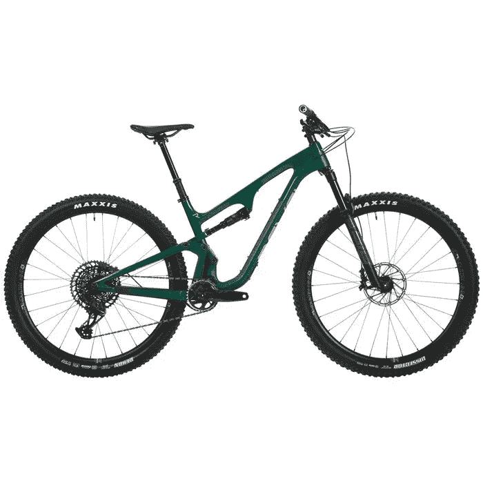*

*漂亮的自行车！*

**

*狂欢游侠规格*

*转换为输入向量:*

*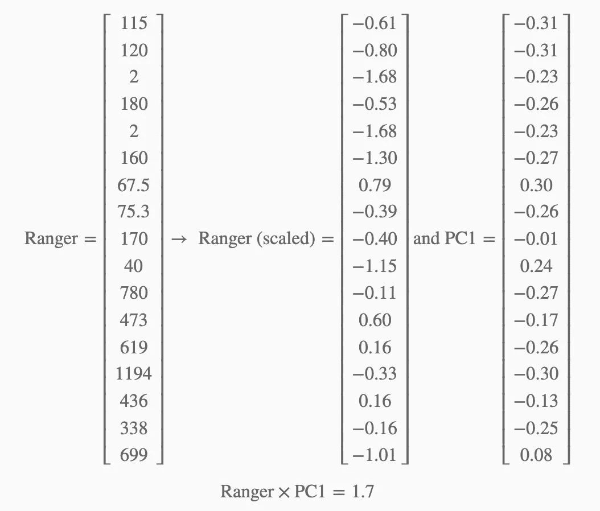*

*Revel Ranger w/ PCA*

*将 Revel Ranger 映射到其第一个主成分，我们得到的值为 1.7，这使我们正好在 Trail 和 XC 之间的边界附近，这与概述部分提到的 PinkBike 编辑在 [**视频**](https://www.youtube.com/watch?v=JYQJbymyG6k) 中对 Downcountry 的标注一致。*

# *改进分析的机会*

*本演示文稿和即将发布的报告中包含了一些改进分析的机会:*

*   ***包含更多的自行车(行)** |我们可以做出的最明显的改进是向我们的数据集添加更多的数据点。每辆自行车的数据都是由该报告的作者之一手工输入的。在输入大多数主要自行车品牌的自行车数据后，我们有了足够的数据来准确地可视化不同的自行车类别；然而，随着更多的自行车，我们的算法将变得更加稳健，受离群值的影响更小。*
*   ***包含更多自行车特征(专栏)** |尽管我们包含了所分析自行车的最有意义的规格/几何形状，但还有许多其他更小的特征可用于区分不同类型的自行车。*
*   ***包括所有尺寸的自行车** |我们选择使用与 5 英尺 10 英寸的骑手相对应的尺寸，但一些自行车制造商可能会将其解释为中号，而另一些制造商会将其解释为大号。*
*   ***包括多年的自行车** |随着自行车趋势的缓慢变化，观察数据如何随时间变化会很有趣。例如，在自行车的一次迭代中，落基山元素将其头部角度从 70 度减小到 65.8 度。包括过去几年的数据可以提供有价值的市场洞察，了解整个行业的发展趋势。*

# *杂项*

*这篇文章的范围是用 r 写的。完整的博文可以在我的博客网站[这里](https://datacracy.netlify.app/post/2022-05-05-mtb-categorization-analysis/)找到。源代码、数据等。可以在迈克的 GitHub 上找到[这里](https://github.com/mczerwin/MTB-Categorization-Analysis)。如果你想获得改进的想法/反馈/想法，请在这篇文章上留下评论，或者在我的博客网站上找到我的联系方式。*

**除非另有说明，本文所有图片均由作者创作。**