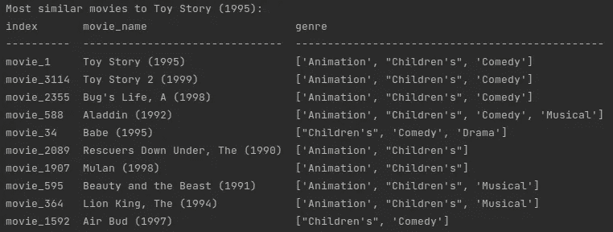
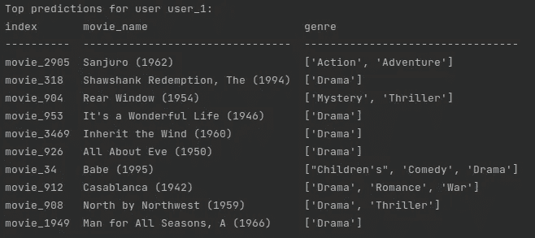
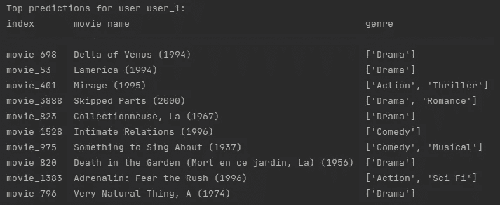
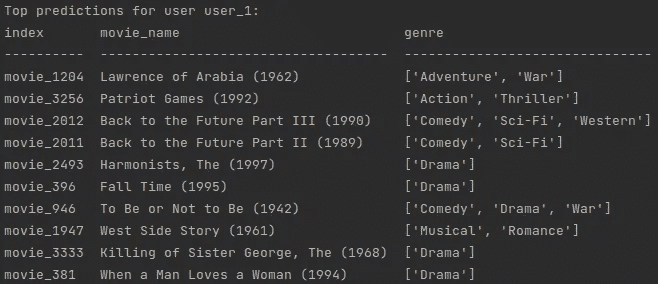
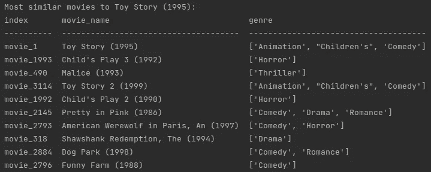
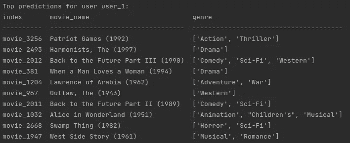
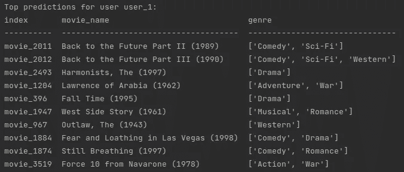

# movie lens-1 米深潜—第一部分

> 原文：<https://towardsdatascience.com/movielens-1m-deep-dive-part-i-8acfeda1ad4>

## 使用流行的基准数据集的实践推荐系统之旅


照片来自 [pexels](https://www.pexels.com/photo/food-snack-popcorn-movie-theater-33129/)

建议。我们都消费它们。无论是通过我们最喜欢的电影流媒体应用程序，在线购物，甚至被动地成为广告活动的目标。这些推荐是如何产生的？一个推荐系统如何利用互联网交易的巨大数据集来产生高质量和个性化的推荐？我发现这些问题很吸引人，因此我决定开始一段学习之旅，这篇文章旨在与你分享我的发现，亲爱的读者:)

我发现有足够多的关于推荐系统基础的理论博客帖子，并决定这将是一次关于最受欢迎的以推荐为重点的数据集之一的实践之旅— [MovieLens-1M](https://grouplens.org/datasets/movielens/1m/) [1](经许可使用)。在这个数据集中，我们得到了 6040 个独立用户对 2894 部电影的大约 100 万个历史评级。

该员额的结构如下:

*   第一部分—探索性数据分析(EDA)
*   第二部分—数据预处理(检索电影内容信息)
*   第三部分—设置推荐问题并获得基线分数
*   第四部分—使用协同过滤推荐电影
*   第五部分—使用基于内容的过滤推荐电影
*   第六部分——结论和展望

包含这个项目的所有代码和更多内容的笔记本可从这里获得:[https://colab . research . Google . com/drive/132 N2 lgqtt 1 nnz au 6cg 1 ifwpaefkk 9 qqe？usp =分享](https://colab.research.google.com/drive/132N2lGQTT1NnzAU6cg1IfwpaeFKK9QQe?usp=sharing)

这是对 MovieLens-1M 的两部分深潜的第一部分。下一部分将于近期发布，将专注于更高级的算法，并继续永无止境的 EDA 进程。快乐阅读！

# 第一部分— EDA

首先，从[这里](https://grouplens.org/datasets/movielens/1m/)下载 MovieLens-1M 数据集。然后，让我们做一些必要的导入，并为这个项目做好准备:

MovieLens-1M 数据集由 3 个文件组成— `users.dat, ratings.dat`和`movies.dat.`让我们来研究其中的每个文件，并了解我们正在处理的内容。我们将从电影的数据开始。

让我们画出每种类型电影的分布图。为此，我们必须将“流派”列转换成一个列表并“展开”它。注意，每部电影可能是几个流派的，在这种情况下，它将被多次计数。我们还将绘制每部电影发行年份的电影分布图。

让我们转到用户数据并检查它。“职业”列用代表每个职业的数字编码，但是对于 EDA，我们感兴趣的是实际数据。我们将通过从数据集的自述文件中提取相关行并相应地交换数据集中的值来获得它。

现在让我们来看看收视率。

让我们根据电影的平均等级来给电影分类。我们还将绘制每种类型被评级的次数。

现在，让我们将所有三个表(电影、用户和收视率)结合起来，看看每种电影类型的男性和女性收视率之间是否有任何差异。请注意，这里我们也将根据男性/女性的总数进行标准化，以便更好地回答我们的问题。

同样，我们在这个数据集中看到了一些典型的男性/女性差异(男性对动作片的评分高于女性，反之亦然)。这是一个很好的数据完整性检查，因为这些图是有意义的。

# 第二部分—数据预处理(检索电影内容信息)

在这一部分中，我们将检索一个重要的数据源，它将帮助我们稍后推荐电影，这就是电影情节摘要。我们将使用[维基百科 python 包](https://pypi.org/project/wikipedia/)从维基百科获得它们。

`There are 615 NaN movie plots`

我们发现我们无法获得 615 部电影的电影情节。这可能是因为他们的维基百科页面没有“情节”类别或其他原因。由于网页抓取不是这里的重点，我们将只放弃这些电影和所有与它们相关的评级。

# 第三部分—设置推荐问题并获得基线分数

我们将选择一个用户作为案例研究，我们将对其进行实际预测，看看这对我们是否有意义。最方便的是，我们将选择 ID #1 的用户。显示在下面的用户和她评价的电影中。我们可以看到她是一名女 K-12 学生(1 岁是数据中的一个错误，但我认为这无论如何都不是很重要)。她喜欢的前 20 部电影主要是经典的儿童热门电影，但也有一些异常的地方(《辛德勒的名单》、《飞越疯人院》)。


我们还将关注电影《玩具总动员》(1995)，对于每种预测方法，我们将检查哪些电影与嵌入空间中的这部电影最接近。

最后，开始推荐素材吧！我们将创建两个数据集分割:

1.标准训练/测试分割。这将用于评级预测回归任务

2.留一交叉验证分割。这将用于命中率预测(这通常被认为是推荐系统领域中更相关的度量)。通过从数据集中为每个用户取出一部电影并将其用作训练集来执行分割。所有其他用户的电影都将在列车上。然后，点击率是我们取出的电影在该用户的前 K 收视率中的百分比。

对于每种方法，我们将计算:

*   测试装置上的 RMSE
*   留一交叉验证集的命中率
*   用户#1 的最佳预测(案例研究)
*   与《玩具总动员》(1995)最相似的十部电影

现在，让我们定义一些辅助函数来帮助我们评估我们的算法(主要是—命中率)。我们将考察每种算法的两个衡量指标——RMSE 和命中率。这里的一些代码摘自 Sundog Education 的精彩推荐系统课程。我还将对最初的 KNN 和奇异值分解算法进行简单的调整，因为计算命中率需要很长时间，我希望至少能够实时测量进度。

让我们获得一个完全随机的推荐系统的结果，这样我们将能够评估我们的算法是比随机的更好还是更差(毕竟，我们希望事情变得更好而不是更差……)

*   注意—计算命中率需要很长时间

```
RMSE: 1.4960
HitRate: 0.02185430463576159
```

# 第四部分—使用协同过滤推荐电影

我们将使用经典的香草算法，从惊喜包中开箱即用(有一些小的调整，以显示在 KNN 的进展)。我不会在这里深入算法细节，因为我认为有很多很好的教程可以学习这些东西(只要谷歌推荐系统 SVD/KNN，你就可以开始了)。我将检查这些算法:

1.  德拉贡诺夫狙击步枪（Snayperskaya Vinyovka Dragunov 的缩写）
2.  基于用户的 KNN
3.  基于项目的 KNN

我们从奇异值分解开始:

```
RMSE: 0.8809
HitRate: 0.03923841059602649
```



不错！这是对随机分数的一个重大改进。但是当我们看用户#1 的预测时，他们仍然感觉有点“不对”。唯一的儿童电影是《宝贝》( 1995 年),我个人希望更多的儿童电影会出现在给这个用户的推荐中。

现在转到 KNN。我们将从基于用户的 KNN 开始。这意味着对电影 *m* 和用户 *u* 的预测将基于与 *u* 相似的用户口味。

```
RMSE: 0.9595
HitRate: 0.002152317880794702
```


RMSE 比随机要好，但命中率要差一些。我们还可以看到，user_1 的顶部预测似乎比 SVD 算法给出的预测更远。在基于用户的 KNN 中，项目之间没有相似性的概念，因此我们不会为该算法计算与玩具总动员(1995)最相似的电影。

现在让我们检查基于项目的 KNN 的性能，它通过用户已经评价的项目与他们尚未评价的其他项目的相似性向用户推荐项目。在代码方面，只需要对类实例化稍作修改。



```
RMSE: 0.9851
HitRate: 0.002152317880794702
```

RMSE 比基于用户的 KNN 差一点，命中率几乎为零。与《玩具总动员》(1995)最相似的电影似乎是合理的，但对 user_1 的预测再次不令人满意。到目前为止，KNN 算法未能胜过奇异值分解，奇异值分解被认为是一种更好的协同过滤算法。

到目前为止，我们还没有考虑到电影本身的特点。如果我了解一些电影的细节，也许会有助于我做出更好的推荐？我们去看看。这被称为基于内容的过滤。

# 第五部分—使用基于内容的过滤推荐电影

对于基于内容的过滤，我们将在三种方法中使用基于 KNN 的算法(其中两种基于项目，一种基于用户):

1.**电影情节(基于项目)**:根据情节描述创建所有电影的矢量表示。我们将首先对图描述中的所有单词进行词干分析，然后应用 TF-IDF 对每个文档进行矢量化。我们将根据以下内容生成相似性矩阵:

a.使用完整的 TF-IDF 矩阵

b.在特征选择之后使用 TF-IDF 矩阵

c.在特征选择和去除人名之后使用 TF-IDF 矩阵

2.**电影类型(基于项目)** : 我们将使用电影类型作为推荐的唯一来源，看看效果如何。

3.**用户年龄+性别(基于用户)**:我们将使用用户数据作为 KNN 预测器的特征。

我们将创建一个从 Surprise 的`KNNBasic.`继承而来的类，它的功能将与协作过滤的基于项目的 KNN 相同，唯一的不同是我们将为 fit 函数提供一个预先计算的相似性矩阵，而不是从评级数据中计算出来。

**第五部分 I —使用电影情节进行基于内容的过滤**

现在，让我们创建 TF-IDF 相似性矩阵

现在，获得方法#1 的结果(使用完整的 TF-IDF 矩阵)。注意，对于常规训练集和留一训练集，我们需要不同的余弦相似性矩阵，用于计算命中率，因为它们包含每个电影的不同内部 id。

```
RMSE: 1.0268
HitRate: 0.003973509933774834
```



毫无疑问，比协同过滤更糟糕。我们还看到，相似性矩阵并没有真正在电影之间产生有意义的关系(唯一与《玩具总动员》相似的儿童电影是《玩具总动员 2》)。让我们看看减少功能的数量是否有帮助。

```
Number of selected features:  784List of selected features:   ['abbi', 'abel', 'ace', 'adam', 'adel', 'adrian', 'adrien', 'affair', 'agent', 'agn', 'al', 'aladdin', 'alan', 'albert', 'alex', 'alfr', 'ali', 'alic', 'alicia', 'alien', 'allen', 'alli', 'alvin', 'alyssa', 'amanda', 'amelia', 'american', 'ami', 'amo', 'andi', 'andrea', 'andrew', 'angel', 'angela', 'angelo', 'angus', 'ann', 'anna', 'anni', 'antoin', 'anton', 'antonio', 'ape', 'archer', 'archi', 'ariel', 'arjun', 'armstrong', 'arni', 'arroway', 'art', 'arthur', 'arturo', 'ash', 'audrey', 'aurora', 'austin', 'axel', 'babe', 'babi', 'balto', 'bambi', 'band', 'bank', 'barbara', 'barn', 'barney', 'bastian', 'bate', 'bateman', 'batman', 'beach', 'beal', 'bean', 'beatric', 'beckett', 'becki', 'beldar', 'bella', 'ben', 'bendrix'...RMSE: 1.0314
HitRate: 0.003642384105960265
```



并没有真正的帮助…我们看到很大一部分信息特征是名字。我们不希望这样，因为名字并不能真正说明电影的内容。让我们去掉这些名字。

```
RMSE: 1.0284
HitRate: 0.0041390728476821195
```



好吧，这比前两种方法更合理。首先，命中率更高(尽管仍然比协同过滤方法低)，其次，类似于《玩具总动员》(1995)的电影实际上是相似的。第三，对 user_1 的最高预测似乎还过得去。现在让我们试试电影海报法，看看效果如何。

**第五部分第二部分——使用电影类型进行基于内容的过滤**

在这一部分，我将降低算法的复杂性，并创建一个仅基于电影类型的 KNN 推荐器。这意味着，如果一个人对儿童电影的评价很高，我们应该期待算法会推荐儿童电影。我们将使用 python`itertools`包创建所有可能的流派组合，然后应用我们的老朋友 TF-IDF 从这些数据中生成一个特征矩阵。

```
RMSE: 1.0138
HitRate: 0.0031456953642384107
```


毫不奇怪，与《玩具总动员》(1995)最相似的电影是那些具有相同或几乎相同类型的电影。除此之外，结果相当令人困惑，为什么 user_1 只获得战争电影的推荐？让我们提醒一下本文第三部分中的表格(它显示了 user_1 的所有评级)，我们看到在 user_1 的评级列表中有两部类型为“战争”的电影，并且它们都得了 5 分。user_1 评价的其他类型出现得更频繁，因此如果我们按类型平均 user_1 的分数——“战争”类型将获得满分，而其他类型则不会。

因为基于项目内容的 KNN 推荐器通过新项目与已经被用户 _1 评分的其他项目的相似性来为用户 _1 预测新项目，所以它将为它将在用户 _1 的上下文中看到的每部战争电影给出满分！KNN 推荐器忽略属于 0 相似性项目的分数，当生成战争电影的推荐时，它将只考虑战争电影的分数，因此总是预测完美的分数。

**第五.三部分——使用用户年龄+性别的基于内容的过滤**

让我们从根据用户的年龄和性别创建特征向量开始。我们将为“男性”分配 0，为“女性”分配 1，并保留“年龄”列。最后，我们将对列进行规范化，以便不受列大小差异的影响。使用这些值，我们将创建一个余弦相似性矩阵，就像我们对电影所做的那样，但这次我们将计算每个用户之间的相似性得分。这个相似性分数将会是我们基于用户的 KNN 推荐器的输入。

```
RMSE: 0.9784
HitRate: 0.00347682119205298
```


我们看到 RMSE 优于基于项目的方法，类似于我们在第四部分(协同过滤)中得到的结果，其中基于用户的推荐优于基于项目的推荐。但是命中率比我们尝试的一些基于项目的方法要差一点。看起来每种方法都有其优点和缺点，一个好的方法可能是以某种方式将它们结合起来，这将是下一部分的重点。

# 第六部分——结论和展望

在这篇文章中，涵盖了很多内容。

首先，我们检查了 MovieLens-1M 数据集，并从我们看到的图表中获得了一些非常有趣的见解，例如哪些电影类型的平均得分往往高于其他类型。然后，我们使用了一些来自`Surprise` python 包的普通推荐系统算法，并通过 SVD 算法获得了一些非常好的结果。

之后，我们尝试了基于内容的过滤，但不幸的是，这是一个徒劳的尝试。尽管如此，在研究过程中，我们揭示了 KNN 推荐系统(或一般的基于内容的过滤)的一个固有弱点，即针对特定用户的推荐仅基于他/她过去交互过的项目，如果该用户的交互中存在偏见，它将在 KNN 推荐中显示出来。这就是为什么当我们使用流派作为推荐的基础时，我们的 spotlight 用户(user_1)获得了战争电影的最高分，即使我们作为人类不一定同意。对于该用户，更可能的推荐是儿童/音乐剧等。

此外，我们看到，在处理自然文本时，比如电影情节，了解哪些特性对推荐影响最大是值得的。当我们删除在 TF-IDF 算法中排名非常高的人名时，我们突然获得了更好的结果，当与《玩具总动员》(1995)最相似的电影突然变得有意义时，这一点显而易见。

在下一部分中，我将把基于内容的过滤和协作过滤结合起来，这样可以两全其美。我已经看中了 [TensorFlow 推荐人](https://www.tensorflow.org/recommenders)套餐，我迫不及待地想一试。

下次见！

埃拉德

**推荐人:**

[1] *麦克斯韦·哈珀和约瑟夫·a·康斯坦。2015.电影镜头数据集:历史和背景。美国计算机学会交互式智能系统汇刊 5，4:19:1–19:19。*[*https://doi.org/10.1145/2827872*](https://doi.org/10.1145/2827872)