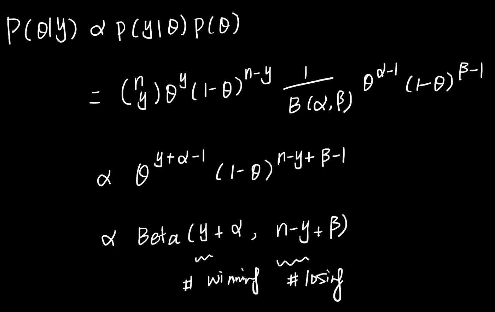
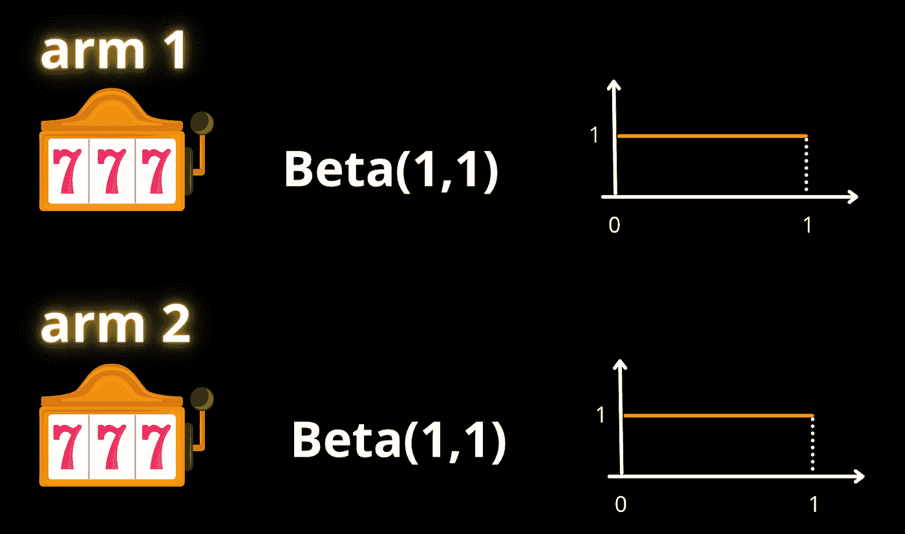
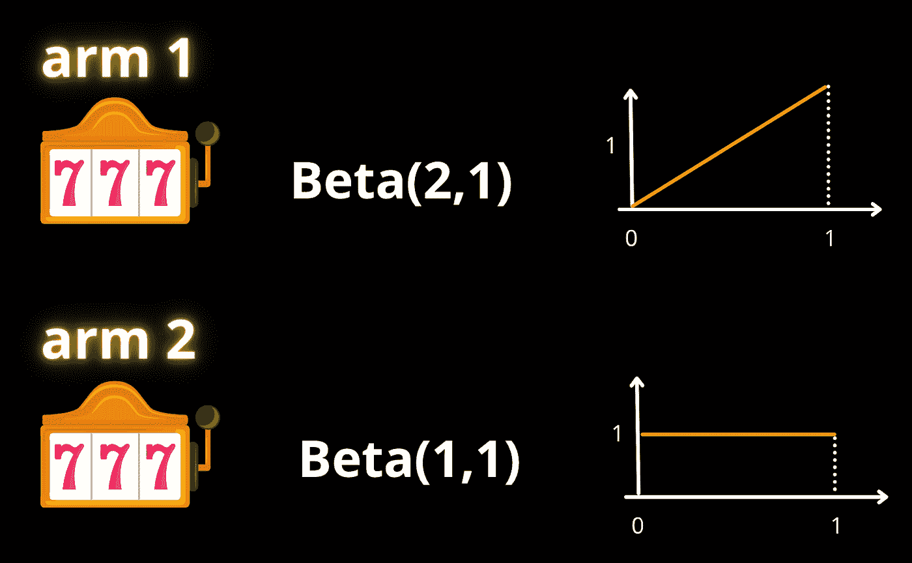
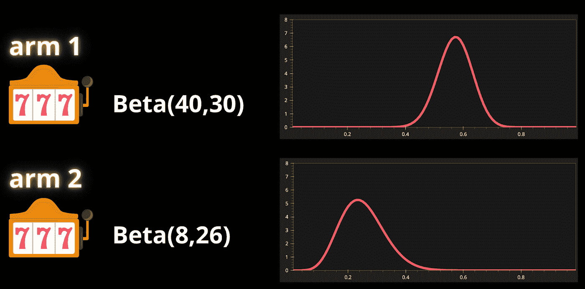
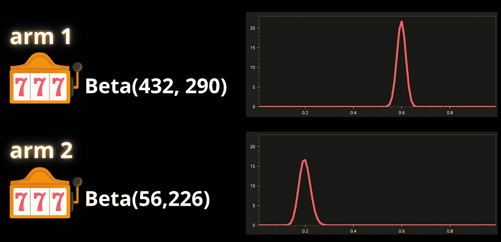

# 多臂土匪算法:汤普森采样

> 原文：<https://towardsdatascience.com/multi-armed-bandit-algorithms-thompson-sampling-6d91a88145db>

## 直觉、贝叶斯和一个例子

想象你面前有一排老虎机。你不知道哪台机器会给你最好的获胜机会。你如何找到最好的吃角子老虎机玩？你应该怎么做才能有更高的胜算？在一个更常见的场景中，想象你有各种版本的广告或网站布局，你想测试，什么是最好的策略？本文将带您通过 Thompson 采样算法来解决这些问题。

之前，我已经制作了两个视频，关于两个非常基本的算法的直觉: [ETC(探索然后提交)](https://www.youtube.com/watch?v=r5oz7by90-Y)和 [epsilon greedy](https://www.youtube.com/watch?v=EjYEsbg95x0) 。这两种算法都需要很长时间来找到最佳老虎机，有时他们不能找到最佳解决方案。可以考虑的更好的多臂 bandit 算法是 Thompson 采样。汤普森抽样也称为后验抽样。它是一种随机化的贝叶斯算法，容易理解和实现，而且用对数后悔法要快很多。

Thompson 采样在行业中也广泛用于各种用例。举个例子，

*   [Doordash](https://doordash.engineering/2022/03/15/using-a-multi-armed-bandit-with-thompson-sampling-to-identify-responsive-dashers/) 使用 Thompson 采样来动态学习哪些 dash 对消息更敏感，然后优化在给定时间内向谁发送消息的决策。
*   [亚马逊](https://dl.acm.org/doi/pdf/10.1145/3097983.3098184)利用汤普森抽样选择网站最优布局，一周内提升转化率 21%。
*   [脸书](https://www.youtube.com/watch?v=A-JJvYaBPUU&t=1474s)在视频上传过程中，使用一种称为约束汤普森采样的改进汤普森采样算法来优化视频质量。
*   [网飞](https://info.dataengconf.com/hubfs/SF%2018%20-%20Slides/DS/A%20Multi-Armed%20Bandit%20Framework%20for%20Recommendations%20at%20Netflix.pdf)在他们的推荐系统中使用了 Thompson 抽样和其他 bandit 框架。
*   [Stitch Fix](https://multithreaded.stitchfix.com/blog/2020/08/05/bandits/) 在其实验平台上增加了汤普森采样。

# **贝叶斯统计**

让我们首先从一些基本的贝叶斯统计开始。假设一只手臂只能给我们奖励或者不给我们奖励。一个手臂(X)的奖励遵循一个伯努利分布:X ~伯努利(θ)，意思是这个手臂成功会有概率θ的奖励，失败没有奖励概率 1-θ。

如果我们把这个手臂玩 n 次，总奖励/成功次数(Y)遵循一个二项式分布:Y ~二项式(n，θ)。

假设θ的先验分布为β(α，β):θ~β(α，β)

同样，θ是每个吃角子老虎机/手臂的获胜概率。我们的目标是找出这个θ是给定的什么数据，即 p(θ|y)。

根据贝叶斯规则，我们可以计算θ的后验分布，它与似然和先验成正比，然后我们写下二项式分布和β分布的方程，它与θ的 y+α+1 次方成正比，与(1-θ)的 n-y+β-1 次方成正比，后者与β(y+α，n-y+β)成正比。

有趣的是，贝塔分布与二项式家族共轭，这意味着如果我们从贝塔先验开始，我们将得到贝塔后验。

作者图片

在等式中，y 是成功的次数，n-y 是失败的次数。这意味着，在每个时间步，如果我们得到了奖励，我们就在第一个参数上加 1，如果我们没有得到奖励，我们就在第二个参数上加 1。最后，第一个参数应该是成功的次数加上 alpha，第二个参数应该是失败的次数加上 beta。接下来我会给你看一个具体的例子。

# **伯努利·汤普森抽样的一个例子**

让我们以两台老虎机(双臂)为例。注意，我们不知道两臂的实际获胜概率，但假设它们是 0.6 和 0.2。

## **在时间步长 1:**

让我们假设我们没有任何关于每只手臂的获胜概率的先验信息，因此让我们对两只手臂使用β(1，1)，即均匀分布。

作者图片

然后让我们从每个分布中随机抽取一个样本，比如我们为臂 1 抽取 0.8，为臂 2 抽取 0.4。因为 0.8 > 0.4，我们玩 arm 1。未知真概率 0.6，arm 1 会给我们奖励。假设手臂 1 确实给了我们奖励。然后，臂 1 的后验分布更新为β(2，1):

作者图片

## **在时间步长 2:**

让我们再次从每个分布中随机抽取一个样本。正如你在新的分配中看到的，手臂 1 有更高的机会抽到了更多的号码，手臂 2 有同等的机会抽到了任何号码。虽然相比 arm2，arm 1 抽到更高号码的几率更大。因为我们是随机抽取数字，所以 arm 2 仍然有机会抽取更高的数字。例如，我们为手臂 1 绘制 0.7，为手臂 2 绘制 0.9。因为 0.7 < 0.9, we play arm 2\. With 0.2 probability, arm 2 will give us a reward, let’s assume that arm 2 failed to give us a reward. Then the posterior distribution for arm 2 updates to Beta(1,2):

Image by Author

## **在时间步长 3:**

让我们再次从每个分布中随机抽取一个样本。假设我们为臂 1 绘制 0.8，为臂 2 绘制 0.3。我们玩 arm1。以 0.6 的概率，arm 1 会给我们一个奖励。假设这次 arm 1 没有给我们奖励。然后，臂 1 的后验分布更新为β(2，2):

作者图片

我们一遍又一遍地继续这个过程。随着时间步数的增加，后验分布应该越来越接近真实值。例如，在时间步长 100，我们可以得到 arm1 的β(40，30)和 arm2 的β(8，26)。请注意，这四个数字加起来应该是 104，因为我们从两臂的β(1，1)开始。

作者图片

然后在时间步长 1000，我们可以得到臂 1 的β(432，290)和臂 2 的β(56，226)，分布的平均值几乎与实际获胜概率完全匹配。随着时间的推移，标准差应该会越来越小。获胜手臂的标准偏差应该小于另一只手臂，因为一般来说，我们应该有更大的机会从获胜手臂获得更大的价值，因此我们更经常地玩那只手臂。但尽管如此，我们玩 arm 2 的非零概率非常小，这意味着在这一点上，我们将主要做开发而不是探索。对于 Thompson 采样，没有一个有限的截止时间来决定我们什么时候探索，什么时候利用，就像你在其他算法中看到的那样。

作者图片

总的来说，Thompson 采样执行以下操作:

*   在每个时间步，我们计算每个臂的θ的后验分布。
*   我们从每一个后验分布中抽取一个样本，并播放具有最大值的臂。

在我们的例子中，我们假设每个时间步的每个手臂遵循伯努利分布，并且获胜概率的先验分布遵循贝塔先验分布。使用其他分布也很常见，例如，可以使用具有高斯先验的高斯分布，或者一般指数族中的其他分布。

希望这篇文章能帮助你对 Thompson 采样算法有一个更好的直觉和理解。详细的遗憾分析，请看一下[这本书](https://tor-lattimore.com/downloads/book/book.pdf)。谢谢！

参考资料:

[https://door dash . engineering/2022/03/15/using-a-multi-armed-bandit-with-Thompson-sampling-to-identify-responsive-dashers/](https://doordash.engineering/2022/03/15/using-a-multi-armed-bandit-with-thompson-sampling-to-identify-responsive-dashers/)

[https://multithreaded . stitchfix . com/blog/2020/08/05/bottoms/](https://multithreaded.stitchfix.com/blog/2020/08/05/bandits/)

[https://dl.acm.org/doi/pdf/10.1145/3097983.3098184](https://dl.acm.org/doi/pdf/10.1145/3097983.3098184)

[https://www.youtube.com/watch?v=A-JJvYaBPUU&t = 1474s](https://www.youtube.com/watch?v=A-JJvYaBPUU&t=1474s)

[https://info . dataengconf . com/hub fs/SF % 2018% 20-% 20 slides/DS/A % 20 multi-Armed % 20 bandit % 20 framework % 20 for % 20 recommendations % 20 at % 20 net flix . pdf](https://info.dataengconf.com/hubfs/SF%2018%20-%20Slides/DS/A%20Multi-Armed%20Bandit%20Framework%20for%20Recommendations%20at%20Netflix.pdf)

[https://tor-lattimore.com/downloads/book/book.pdf](https://tor-lattimore.com/downloads/book/book.pdf)