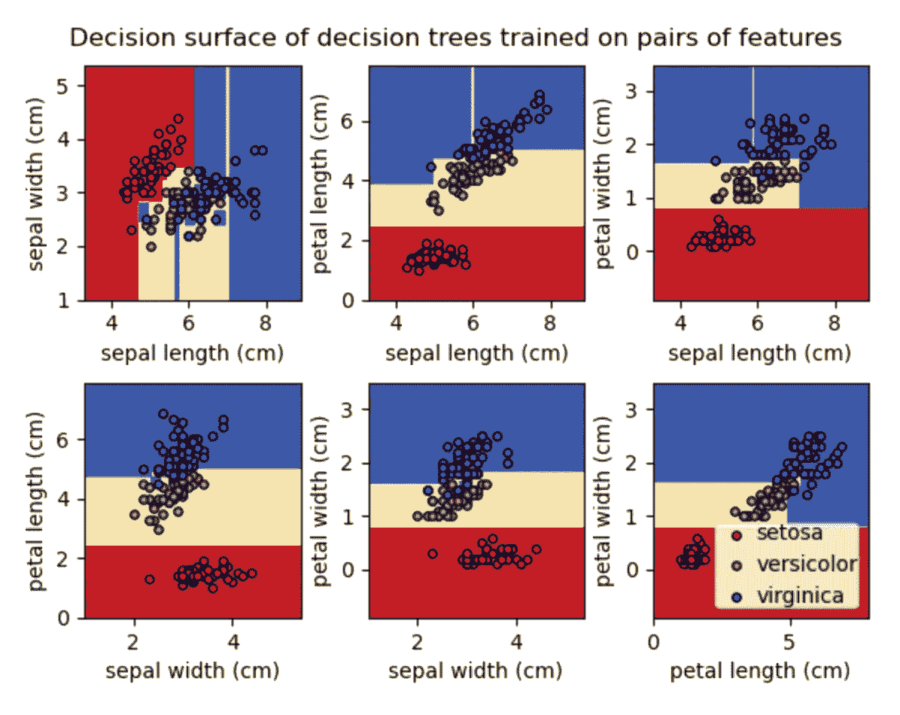
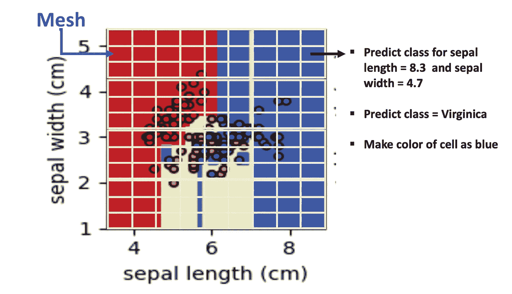
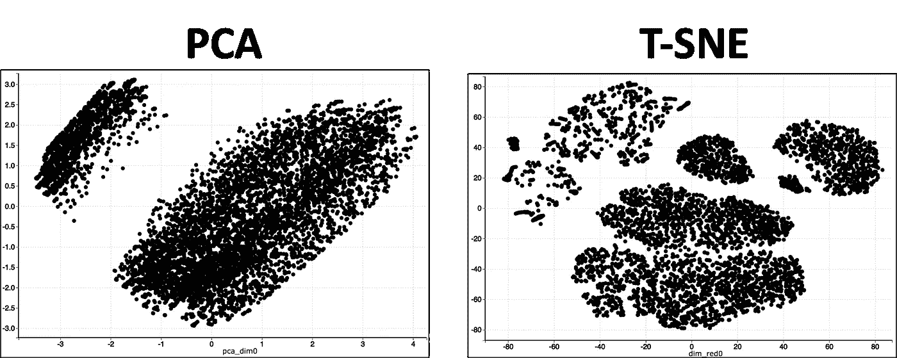
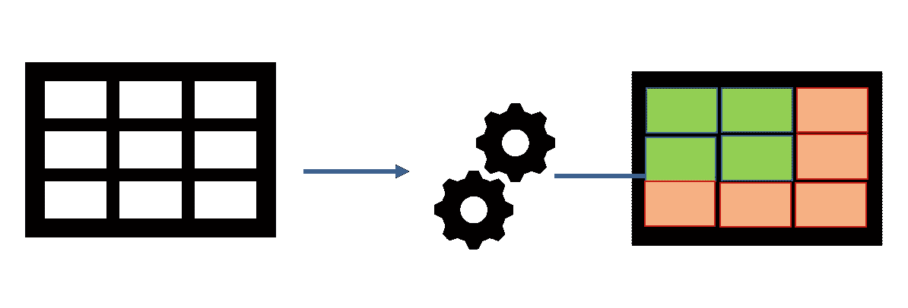
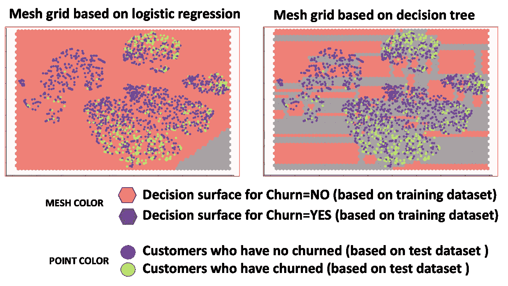
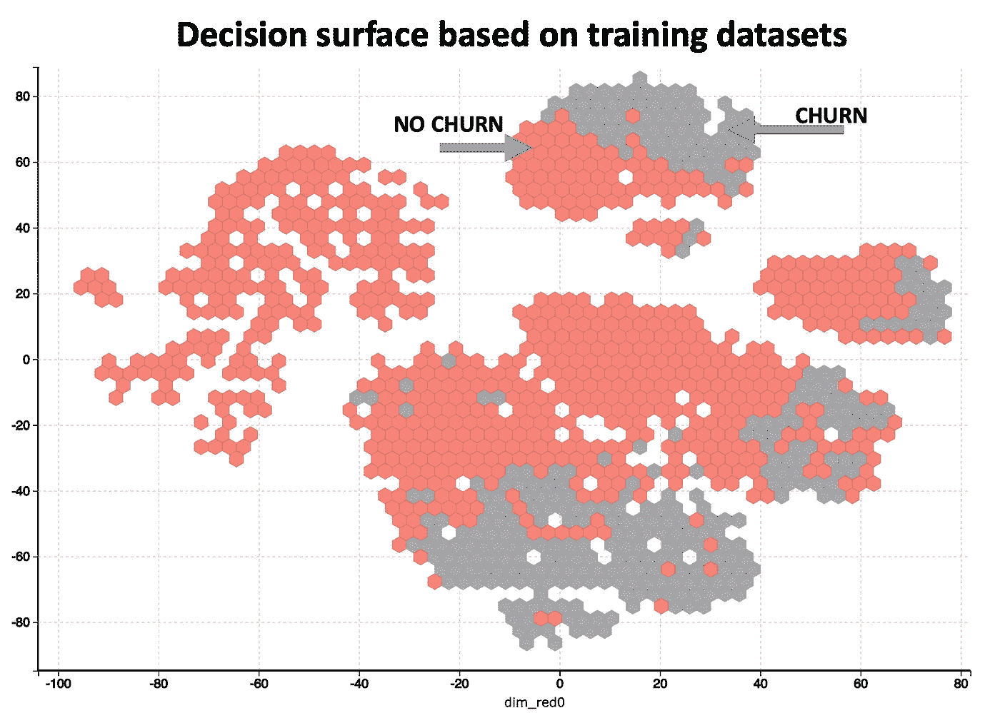
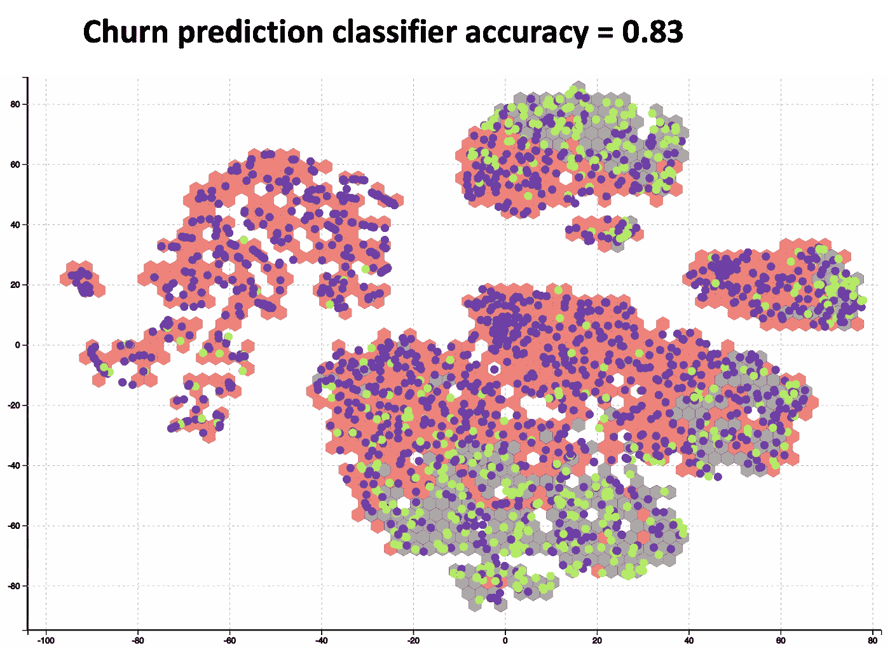

# 多维决策边界:当前方法失败的原因及如何使其有效

> 原文：<https://towardsdatascience.com/multi-dimensional-machine-learning-decision-boundary-how-to-get-it-to-work-7122dca3b3a>

## 决策边界是模型评估的一个非常重要的可视化工具。了解如何让它处理复杂的数据集。

丹尼尔·林肯在 [Unsplash](https://unsplash.com/s/photos/person?utm_source=unsplash&utm_medium=referral&utm_content=creditCopyText) 上的照片

所有方法在玩具数据集(如 Iris 数据集)上都运行良好，看起来很棒。然而，当您在真实数据集上尝试您的方法时，事情就崩溃了。决策边界或决策面就是这种情况的一个很好的例子。

决策边界或决策表面是理解机器学习分类器结果的一种很好的方式。在开源软件包网站上有各种各样的例子来解释如何制定决策界限。这些例子是理解这个概念的一个很好的来源，然而，它们在实践中是不够的。

这种不足的主要原因是现有的例子是玩具数据集，如虹膜数据集，其维度有限。在实际应用中，数据集有非常多的维度。

在这个故事中，我将展示一种多维决策边界的方法。

让我们首先回顾一下决策边界或决策面的目标。

# 决策边界或决策面的目标

机器学习分类器的视觉理解非常重要。有许多基于性能的可视化技术，如 ROC 曲线或精度和召回图。然而，基于性能的可视化不足以理解机器学习分类器。

此外，在许多应用中，仅基于性能的评估并不是最佳的。例如，机器学习分类器可以具有极好的 ROC，然而，底层分类器模型可能太复杂。模型的复杂性不能用性能指标来判断。

决策边界或决策面有助于我们通过以下方式更好地理解机器学习模型:

*   它帮助我们理解底层模型的复杂性。复杂的决策边界或决策面可能意味着模型复杂或过度拟合。
*   它告诉我们，在预测新数据时，我们应该有多大的信心。如果有太多的点非常接近决策边界的边缘，那么对新的和看不见的数据的预测就会出错。

# 当前确定多维决策边界的方法

以下是当前用于制定多维决策边界的不同方法。

## 取所有特征的两两组合

在这种方法中，采用所有特征的成对组合。在下面的例子中，数据有 4 个特征-萼片宽度、萼片长度、萼片宽度、花瓣长度。当我们对所有特征进行成对组合时，这给了我们 6 个可视化。

图片来源[https://sci kit-learn . org/stable/auto _ examples/tree/plot _ iris _ DTC . html # sphx-glr-auto-examples-tree-plot-iris-DTC-py](https://scikit-learn.org/stable/auto_examples/tree/plot_iris_dtc.html#sphx-glr-auto-examples-tree-plot-iris-dtc-py)

使用网格方法生成决策边界。对于每个可视化，X 轴和 Y 轴被分成小方框。这就形成了一个网格。例如，在下图中，网格有 9 个(在 X 轴上)* 12 个(在 Y 轴上)= 108 个框。

网格法—作者图片

每个框可以代表萼片长度和萼片宽度的值。对于每个盒子，然后使用训练的分类器来预测类别。框的颜色基于预测的类。

一旦获得彩色网格，来自测试数据集的数据点就绘制在网格上。

## 使用主成分分析(PCA)

在这种方法中，主成分分析用于将多维数据集简化为 2D 数据集。如上所述，网格方法用于将 2D 空间切割成许多盒子。一个 ***新的*** 机器学习分类器以 X 为 PCA 2D 值，Y 为类进行训练。

然后，该机器学习分类器将预测网格中每个点的类别。然后，预测的类可以用于制作网格栅格框的颜色。下图给出了一个说明性的例子。

一旦获得彩色网格，来自测试数据集的数据点就绘制在网格上。

主成分分析和网格方法—图片由作者提供

# 够了艾瑞斯。欢迎来到现实世界。

正如您到目前为止所看到的，决策边界就像在 Iris 数据集上散步一样。现在让我们看看上述方法是如何用于真实世界的多维数据集的。让我们来看一个电信公司客户的数据集。该数据集包含人口统计信息、服务、账单信息以及客户是否有过交易。

PS:数据集引用在文末说明

电信客户流失数据集(图片由作者提供)

这个数据大约有 20 个字段。几乎 50%的字段是分类的(非数字)。机器学习的任务是开发一个分类器来预测客户流失。现在让我们看看上述决策边界的方法是否可行。

## 对所有特征进行成对组合的方法对于高维数据不是可行的方法。

成对组合方法仅适用于少量维度。对于大量的特征，例如我们的电信数据集中的特征，它将悲惨地失败。会产生太多的可视化效果，同时查看许多可视化效果会变得很麻烦。此外，您将错过所有分类特征，因为这种方法只对数字特征有效。

## PCA 方法的问题在于…PCA 技术本身。

PCA 方法的问题是 PCA 技术的使用。PCA 技术通过基于最高变化分离点来工作。这意味着从数据的角度来看，PCA 空间中的两个相邻点可能非常不同。

为了理解为什么 PCA 不适合，让我们比较一下 PCA 和 TSNE。TSNE(t-分布式随机邻居嵌入)也是一种降维技术。下图显示了五氯苯甲醚和 SNE 霸王龙之间的对比。

PCA vs TSNE(图片由作者提供)

您可以观察到两种可视化效果看起来完全不同。主成分分析只有两种聚类结构，而 SNE 霸王龙有多种聚类结构。该数据集根据人口统计、服务和账单信息拥有各种各样的客户。如主成分分析所示，只有两个集群结构是不现实的。另一方面，T-SNE 是电信客户数据集的更现实的表示。

区别的原因是 PCA 本质上是通过基于最高变化场*将****点**尽可能远地**分离来工作的。***** **TSNE 基本上是通过**分组** **点** **根据点的特性尽可能接近**来工作的。**

**PCA 是一种很好的降维方法，但如果你想重用结果来制定决策边界，它就不好了。T-SNE 是一种更好的决策边界方法，因为我们希望实际数据中接近的点在决策表面上也接近。**

## **要不要网格…这是个问题**

**这里是一个网格着色工作原理的回顾。首先，我们基于对应于训练数据集(如 X)和实际标签(如 Y)的 TSNE 点创建分类器。**

****

**网格步骤 1(图片由作者提供)**

**一旦我们训练了分类器，我们就可以用它来预测网格中某个点的颜色。**

****

**网格步骤 2(图片由作者提供)**

**这种方法适用于简单的数据集。然而，对于复杂的数据集，mesh grid 并不理想。下面显示的是两个网格。左边的是基于逻辑回归分类器的颜色。右边的是基于决策树分类器的颜色。这些点对应于测试数据集。点的颜色基于流失预测。蓝点是测试数据集中没有搅动的客户。绿色的点是测试数据集中的顾客。**

****

**决策面(图片由作者提供)**

**查看决策面，它给人的印象是，我们预测客户流失的分类器非常不准确，因为决策面和测试点之间有很多差异。然而，预测流失的分类器具有 83%的 ROC。那么，问题出在哪里？**

**问题在于预测网格颜色的分类器。数据集太复杂了，不能只用两个 TSNE 点来预测客户流失与否。**

**因此，网格方法不适用于非常复杂和高维的数据集。**

# **多维数据集的决策边界方法**

**因此，基于目前的观察，这里给出了我们可以适用于多维数据集的方法。**

*   **不要使用成对散点图方法。**
*   **不要使用 PCA。用 TSNE 代替**
*   **放下网格。专注于创建一个正确的决策面，而不是一个带有网格的不正确的决策边界。如果我们直接使用训练数据集来生成决策面，就可以做到这一点。**

**这是基于训练数据集**的**决策面**。**没有使用网格。颜色基于直接获取训练数据集的 TSNE 点及其相应的标签(流失或不流失)。**

****

**基于训练数据的决策图(图片由作者提供)**

**现在我们可以叠加我们的测试点，得到如下所示的最终结果。回想一下，蓝点是测试数据集中没有搅动的客户。绿色的点是测试数据集中的顾客。**

****

**带有测试数据覆盖的决策表面(图片由作者提供)**

**这是上面的同一个图像以及所有的颜色代码注释。**

****

**带有测试数据覆盖的决策表面(图片由作者提供)**

**这看起来好多了，我们可以理解为什么分类器的准确率是 83%。大多数客户流失的测试点都落在预测流失的决策面上。此外，客户没有流失的大多数测试点都落在没有预测流失的决策面中。**

**这种方法适用于复杂的多维数据集。但是，有一些限制:**

*   **训练数据集需要非常大(至少超过 10000 行)。原因是我们使用从训练数据集得到的决策表面，而不是网格方法。因此，这需要大量的训练数据来制作一个好的决策表面。**
*   **测试数据集应该是训练数据集的子集。尽可能地去除异常值。这确保了测试数据的 TSNE 点被正确地映射到 2D 网格。**
*   **一般来说，TSNE 在非稀疏数据上工作得很好。所以这种方法通常用于非稀疏数据集。**

**希望你喜欢这篇文章，现在准备在复杂和多维数据集上做决策表面。**

**作为**的额外奖励**，这里有不同颜色和风格的决策面。享受吧。**

****

**决策表面的不同颜色和样式(图片由作者提供)**

# ****数据集引用****

**电信数据集可在此获得。允许与引文一起使用**

**[https://www.kaggle.com/blastchar/telco-customer-churn](https://www.kaggle.com/blastchar/telco-customer-churn)**

**Blastchar (2018)。Kaggle 数据集。[[www.kaggle.com](https://www.kaggle.com/blastchar/telco-customer-churn)][https://www.kaggle.com/blastchar/telco-customer-churn](https://www.kaggle.com/blastchar/telco-customer-churn)**

# ****附加资源****

# **网站(全球资讯网的主机站)**

**你可以访问我的网站进行零编码分析。[https://experiencedatascience.com](https://experiencedatascience.com/)**

**每当我发布一个新的故事，请订阅保持通知。**

** [## 每当 Pranay Dave 发表文章时，您都会收到电子邮件。

### 每当 Pranay Dave 发表文章时，您都会收到电子邮件。通过注册，您将创建一个中型帐户，如果您还没有…

pranay-dave9.medium.com](https://pranay-dave9.medium.com/subscribe) 

你也可以通过我的推荐链接加入 Medium

 [## 通过我的推荐链接加入 Medium—Pranay Dave

### 作为一个媒体会员，你的会员费的一部分会给你阅读的作家，你可以完全接触到每一个故事…

pranay-dave9.medium.com](https://pranay-dave9.medium.com/membership) 

## Youtube 频道

这是我的 YouTube 频道
[https://www.youtube.com/c/DataScienceDemonstrated](https://www.youtube.com/c/DataScienceDemonstrated)的链接**