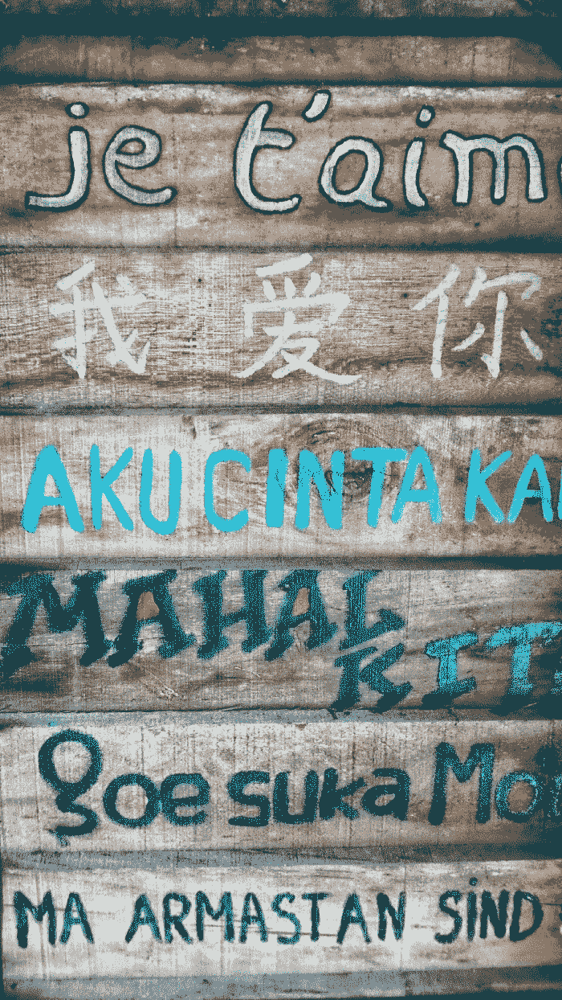
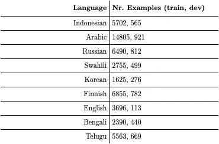

# 多语言 NLP:在 10 分钟或更短时间内开始使用 TyDiQA-GoldP 数据集

> 原文：<https://towardsdatascience.com/multilingual-nlp-get-started-with-the-tydiqa-goldp-dataset-in-10-minutes-or-less-c56c01ad47d2>

## 检索、处理和使用数据集的实践教程



照片感谢来自 [Unsplash](https://unsplash.com/photos/ZzWsHbu2y80) 的[汉娜·莱特](https://unsplash.com/@hannahwrightdesigner)。

# 介绍

TyDiQA-GoldP [ [1](https://aclanthology.org/2020.tacl-1.30.pdf) ]是一个困难的抽取式问答数据集，通常用于测试问答模型。数据集的价值在于数据的创建方式。注释者被给予随机维基百科文章的前 100 个字符，并被要求提出他们有兴趣找到其答案的问题。引用这篇论文中的一个例子，给定提示“苹果是一种水果”，人类注释者可能会问“史蒂夫·乔布斯死于什么疾病？”。这种生成数据集的策略模拟了人类的好奇心，这可能是 TyDiQA-GoldP 比其他多语言提取 QA 数据集更难的原因之一，例如 XQuAD [ [2](https://arxiv.org/pdf/1910.11856.pdf) ]和 MLQA [ [3](https://arxiv.org/abs/1910.07475) ]。一旦创建了问题，通过选择问题提示的 Google 搜索结果中出现的第一篇文章，就可以找到匹配的维基百科文章。然后要求注释者在文章中找到与问题匹配的最佳答案，如果存在这样的答案的话。那些没有答案的问答配对被丢弃，而对于那些有答案的配对，只有包含答案的段落被保留。

每个实例由以下内容组成:一个问题、一个答案(文本)、答案的起始范围和实例 ID。该数据集涵盖以下语言:英语(en)、孟加拉语(bn)、韩语(ko)、泰卢固语(te)、斯瓦希里语(sw)、俄语(ru)、芬兰语(fi)、印度尼西亚语(id)、阿拉伯语(ar)。因此，它涵盖了 5 种文字(拉丁文、梵文、西里尔文、韩文、阿拉伯文)和 7 个语系(印欧语系(印度雅利安语、日耳曼语、斯拉夫语)、亚非语系、乌拉尔语系、南岛语系、朝鲜语系、尼日尔-刚果语系、德拉威语系)。与许多多语言 NLP 数据集不同，原始的 TyDiQA-GoldP 是**而不是**并行的。这意味着实例不能匹配，因为它们不是通过翻译创建的。然而，DeepMind [ [4](https://arxiv.org/abs/2003.11080) ]通过获取英语子集并将其翻译成其他语言，创建了一个平行版本的 TyDiQA-GoldP。表 1 显示了原始 TyDiQA-GoldP 数据集中每种语言的实例数量，而表 2 显示了 DeepMind 生成的数据集的统计数据。表 3 显示了数据集英文子集的一个实例。



**表 1:** 原始 TyDiQA-GoldP 数据集中每种语言的示例数量


**表 2:** 并行数据集中每种语言的示例数量。注意，数字 3969 对应于数据集的英语子集，该子集被用作翻译成其他语言的基础。括号中的数字显示了所有语言的公共数据点的数量(15%由于翻译错误而丢失)


**表 3:**ty diqa-GoldP 英文子集的一个示例

TyDiQA-GoldP 通常用作多语言 NLP 的基准，并行数据集作为 DeepMind 的 XTREME [ [4](https://arxiv.org/abs/2003.11080) ]数据集的一部分出现。总的来说，这是一个非常困难的数据集，模型在 F1 得分上达到 77.6，在精确匹配上达到 68[[4](https://arxiv.org/abs/2003.11080)]。作为比较，人类的表现是 90.1。最初的 TyDiQA-GoldP 相对较大，适合进行微调，特别是提高非拉丁语系语言的性能。并行 TyDiQA-GoldP 数据集相对较小，适合在公开可用的 GPU(如 Colab)上进行训练。

在这篇文章中，我提供了一个实践教程，用于从多个来源(从平面文件和通过`datasets` API 从 HuggingFace)检索数据集，处理它(检查数据有效性，找到匹配的实例)并将其用于原始设置和来自 DeepMind 的并行设置(将其标记用于训练)。为了确保流畅的用户体验，我写这篇文章时考虑了以下几点:

*   不到 10 分钟
*   用于快速检索数据集的可用脚本
*   数据差异的解释(如有)

# 检索数据集

## 非平行设置

在非并行设置中，开发集和训练集都可以从 TyDiQA [库](https://github.com/google-research-datasets/tydiqa)下载。json 文件。开发集可以在[这里](https://storage.googleapis.com/tydiqa/v1.1/tydiqa-goldp-v1.1-dev.json)找到，而训练集可以在[这里](https://storage.googleapis.com/tydiqa/v1.1/tydiqa-goldp-v1.1-train.json)找到。下载后，文件可以读入`datasets.Dataset`类，如下所示:

值得注意的是，非平行的 TyDiQA-GoldP 数据集也存在于 HuggingFace 上，并且在两个不同的位置复制！它可以从 TyDiQA HuggingFace 数据集[库](https://huggingface.co/datasets/tydiqa)和 XTREME HuggingFace 数据集[库](https://huggingface.co/datasets/xtreme)中下载。将两者都作为`datasets.Dataset`类加载的代码如下所示(我个人更喜欢 XTREME 类，因为它更快……):

值得注意的是，虽然。json 文件与 HuggingFace 数据中的不匹配，数据集是相同的。原始格式的两个数据集混合了所有语言。我们将在“处理数据集”一节中看到如何为每种语言创建单独的数据集。

## 平行设置

数据集只能从 XTREME 存储库中下载，具体来说就是这里的[和](https://console.cloud.google.com/storage/browser/xtreme_translations/TyDiQA-GoldP?pageState=(%22StorageObjectListTable%22:(%22f%22:%22%255B%255D%22))&prefix=&forceOnObjectsSortingFiltering=false)。**不要使用 HuggingFace XTREME 存储库中的版本，因为那只适用于非平行设置(我是通过艰苦的努力才知道的……)。**

> **验证数据:**注意，虽然与训练数据存在差异，但验证数据并非如此。首先，验证数据没有“平行”设置。来自 TyDiQA 文件的验证子集(称为“dev”)和 XTREME/TyDiQA HuggingFace 存储库都是相同的。因此，最简单的方法是使用非平行设置的函数，并为分割指定“验证”。值得注意的是，来自 XTREME GitHub repo 的 **translate-test** 不要与验证数据混淆。

# 处理数据集

检索数据集后，我运行了一些简单的验证检查。这些是:

*   确保没有空洞的问题、上下文或答案
*   确保训练子集只有一个答案
*   检查每个数据集的 id 是否唯一

幸运的是，这些测试通过了非并行设置和并行设置。

## 非平行设置

> 此部分是可选的。只有当您希望按语言分割数据集时，它才是有用的，请记住数据集不是并行的

## 平行设置

对于这个设置，我运行了两个额外的测试来确保数据确实是并行的:

*   对照文献中报告的数据集大小检查数据集大小(在平行设置的情况下)
*   确保每种语言的数据集大小相同(在并行设置的情况下)

不幸的是，这两项测试都失败了。对于后者，我得到了每种语言的以下数据集大小:

```
bn: 3585/3585 ids unique
fi: 3670/3670 ids unique
ru: 3394/3394 ids unique
ko: 3607/3607 ids unique
te: 3658/3658 ids unique
sw: 3622/3622 ids unique
id: 3667/3667 ids unique
ar: 3661/3661 ids unique
```

对于为什么会有缺失的数据点，我的最佳猜测是翻译过程本身会导致错误。这是因为问答任务并不简单，直接翻译可能提供不再匹配的问答对，因此这些例子被丢弃。在匹配 id 以找到真正并行的示例总数之后，我剩下 3150 个数据点，这意味着丢失了 15%的数据集(从并行数据的角度来看)。

我发现的问题是，TyDiQA-GoldP 验证集的大小似乎与 XTREME 论文中报告的任何数字都不匹配。首先，据称数据集有一个“开发”集和一个“测试”集，但是，在 XTREME GitHub repo 上没有找到。其次，“验证”数据集的大小与“开发”和“测试”数据集的大小不匹配。这是我在他们的 GitHub [页面](https://github.com/google-research/xtreme/issues/95)上提出的一个公开的问题。

也就是说，下面给出了查找公共实例和检查是否有空实例的函数:

> (可选—仅当您希望将数据集用作本文提供的 PyTorch 类的一部分时)

我们可以保存处理过的数据集，供 PyTorch 数据类以后使用。

# 使用数据集

在这一节中，我提供了 TyDiQA 的标记化参数(和代码),以及允许在训练循环中直接使用的 PyTorch 数据集类(仅用于并行情况)。我还为 TyDiQA-GoldP 数据集提供了一个学术和实践用例。

## 将数据集符号化

因为我们的问题是抽取式问答，所以我们需要在标记之前对每个例子做一些处理。主要是，我们必须注意不要从上下文中截断答案。因此，当提供一个最大长度的**时，我们还需要提供一个**步幅**。这样，我们可以确保很长的上下文被拆分成多个实例，确保至少在其中一个实例中，我们会有完整的答案。我们还将标记器参数**截断**设置为“second_only ”,以确保只有上下文被截断。我们指定 **max_length** 为 **384** 和 **stride** 为 **128** ，直接取自 XTREME GitHub [库](https://github.com/google-research/xtreme)。我们还需要确保训练示例的处理方式不同于验证示例。下面提供了执行此操作的函数:**

## PyTorch 训练循环的数据集类

以下代码准备了 TyDiQA-GoldP 数据集(来自预处理的源),以便在 PyTorch 样式的循环中进行训练。

## 学术用例:将你的 QA 模型推向极限

TyDiQA-GoldP 很难，因为它的创建方式，也因为语言的选择(例如，它有低资源语言，如斯瓦希里语和泰卢固语)。这使得它成为评估 QA 模型跨语言性能的绝佳选择。

> 然而，值得注意的是，由于上面提出的开放问题，复制您在文献中看到的结果可能需要一点反复试验的过程，因为不清楚在得出该结果时使用了哪种状态的数据。

## 实际用例:TydiQA-GoldP 微调问答

原始的 TyDiQA-GoldP 数据集有利于微调，原因有二:a)数据集相当大，b)很难。更重要的是，它包含了一套非常多样化的语言。除了介绍中提到的 7 个语系和 4 种文字外，该数据集中的语言还涵盖了一系列有趣的语言现象，例如[ [4](https://arxiv.org/abs/2003.11080) ]:

*   **音调符号:**字母上决定发音的符号。TyDiQA-GoldP 示例:阿拉伯语
*   **广泛复合:**多个词的组合，如:Note+book=Notebook。TyDiQA-GoldP 的例子:泰卢固语
*   **绑定词:**句法上独立，但音韵上依赖的词，例如 it's = it is。TyDiQA-GoldP 的例子:孟加拉语
*   **词形变化:**修饰一个词来表达语法信息，如:桑，唱，唱。TyDiQA-GoldP 示例:俄语
*   **派生:**由动词创造名词，例如 slow→slow。TyDiQA-GoldP 示例:韩语

# 结束语

*   TyDiQA-GoldP 是一个多语言的抽取式问答数据集
*   本质上它是不平行的，但是存在一个基于原始英语子集的小型平行版本
*   非平行数据集有 1636–14805 个数据点，而平行数据集有 3150 个数据点
*   它涵盖 9 种语言，跨越 4 种文字和 7 个语系
*   这是一项艰巨的任务和数据集
*   对于对多语言问答感兴趣的人来说，这是一个很好的介绍，因为它的大小，但不要期望很高的分数！

## 作者说明

我个人花了很长时间来确定使用哪些 TyDiQA 数据集进行并行训练和评估。由于在网上没有找到类似的文章，我决定写这篇文章，这样至少可以在网上找到一些参考资料来总结 TyDiQA 数据集的不同来源。我真的希望保持更新，好像我找到了我提出的公开问题的答案。

如果您对这一行感兴趣，请考虑通过我的推荐链接获得中级会员资格来支持我:

<https://namiyousef96.medium.com/membership>  

这对我很有帮助，因为你的一部分会员费会归我(别担心，这对你没有额外的费用！)同时让您完全访问 Medium 上的所有文章！

# 参考

## GitHub 仓库

**TyDiQA**

<https://github.com/google-research-datasets/tydiqa>  

**极限**

<https://github.com/google-research/xtreme>  

## 拥抱面孔储存库

**泰迪卡**

<https://huggingface.co/datasets/tydiqa>  

**Xtreme**

<https://huggingface.co/datasets/xtreme#licensing-information>  

## 引用表

[1] Clark J et al. *TYDI QA:用类型多样的语言回答信息搜索问题的基准*。供货地:【https://aclanthology.org/2020.tacl-1.30.pdf 

[2] Artetxe 等*论单语表征的跨语言迁移性*。来自:[https://arxiv.org/pdf/1910.11856.pdf](https://arxiv.org/pdf/1910.11856.pdf)

[3] Lewis 等人 *MLQA:评估跨语言抽取问题回答*。可从:[https://arxiv.org/abs/1910.07475](https://arxiv.org/abs/1910.07475)

[4]胡等 *XTREME:一个评估跨语言泛化的大规模多语言多任务基准*。来自:[https://arxiv.org/abs/2003.11080](https://arxiv.org/abs/2003.11080)

## 声明

*   *ty diqa-GoldP 可根据 Apache 2.0 许可使用(参见*[*GitHub*](https://github.com/google-research-datasets/tydiqa/blob/master/LICENSE)*上的许可信息)*
*   *所有图片、表格和代码均由作者提供，除非另有说明*