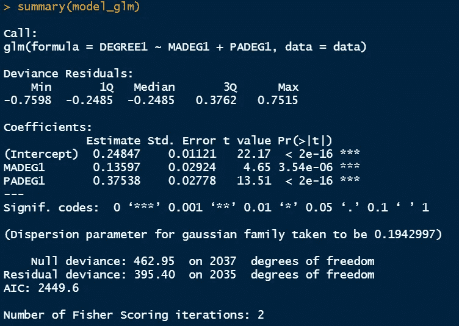
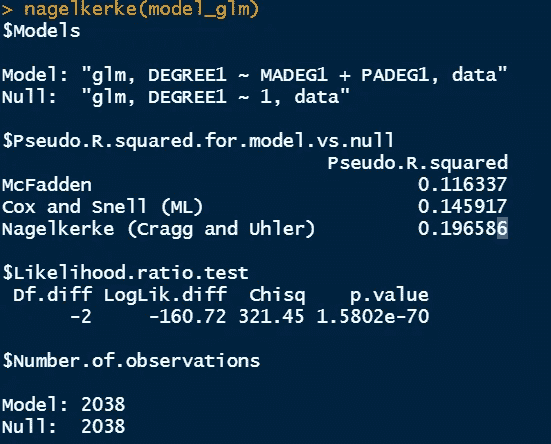

# R 中二分变量的多元 Logistic 回归

> 原文：<https://towardsdatascience.com/multiple-logistic-regression-in-r-aa65c2a91e22>

## R 系列中的统计

金伯利农民在 [Unsplash](https://unsplash.com/s/photos/education?utm_source=unsplash&utm_medium=referral&utm_content=creditCopyText) 上拍摄的照片

> **简介**

简单的逻辑回归只包含一个预测变量，我们之前已经用 R 实现了它。我们还讨论了拟合优度的统计数据。通常，真实世界的数据有几个预测变量。有时，我们根本不知道将额外的变量作为预测因素是否会使模型更加稳健。因此，我们需要始终将完整模型与嵌套模型进行比较，并从数据中得出结论。这里，我们将增加独立参数的数量，并扩展我们对多元逻辑回归的研究。

> **数据集**

2016 年综合社会调查(GSS)的数据将用于证明逻辑回归。数据从[宗教数据档案协会](https://www.thearda.com/data-archive?fid=GSS2016&tab=3)下载，由汤姆·w·史密斯收集。该数据集包括从近 3，000 名受访者收集的回答，并包含与若干社会经济因素相关的数据。它包含各种类型的数据，如与一个人的婚姻状况、教育状况、工作时间、就业状况等相关的信息。让我们仔细看看这个数据集，以便更好地理解它。

对于每个个体，学位列提供教育水平，而 MADEG 列提供每个个体母亲的教育水平。在这项研究中，我们旨在确定母亲的学士学位水平是否是子女学士学位水平的良好预测因素。该数据集包含普通编码的分类数据。

学位数据[图片由作者提供]

MADEG 数据[图片由作者提供]

> **我们正在努力寻找的答案**

在之前的多元逻辑回归文章中(链接如下)，

 [## R 中二分变量的简单 Logistic 回归

### R 系列中的统计

towardsdatascience.com](/simple-logistic-regression-for-dichotomous-variables-in-r-8befbe3e95b4) 

我们试图回答以下问题。

> 母亲的教育水平会影响孩子的教育水平吗？

我们对数据的分析揭示了 MADEG 的正系数，它代表了母亲的教育水平。从下图结果部分的解释中可以看出，截距估计值为 0.257，MADEG 系数估计值为 0.316。因此，预测变量(即母亲的教育水平)每增加一个单位，孩子的教育水平值为 1 的 logit 概率将增加 0.31598。然而，这仍然代表正斜率，表明响应变量随着预测变量的增加而增加。因此，如果孩子的母亲拥有学士学位，孩子获得学士学位的可能性就会增加。

现在，我们将提出一个新的问题。

> 父亲的受教育程度与孩子的受教育程度有关系还是不相关？

当我们引入另一个独立变量时，简单的逻辑回归就变成了多元逻辑回归。

> **R 中的实现**

为了在 R 中执行这个回归研究，我们需要安装以下库。数据存储在一个 excel 文件中，我们将使用 glm()函数。现在的区别是增加了 PADEG，代表父亲的教育水平。

r 代码[按作者]

R 中的输出窗口[图片由作者提供]

R 中的输出窗口[图片由作者提供]

R 中的输出窗口[图片由作者提供]

***解读结果***

作为实施逻辑回归过程的第一步，我们需要将输出成功的概率转换为对数度量，以便确定预测变量的系数和截距。我对下面的数据做了简单的解释。此外，为了便于比较，我还将简单逻辑回归的输出窗口放在了同一个位置。

仅考虑 MADEG 时简单逻辑回归的系数

仅考虑 MADEG 时简单逻辑回归的伪 R

仅考虑 MADEG 时，简单逻辑回归的 AIC/BIC

1.  MADEG 系数为 0.136，PADEG 系数为 0.375，截距系数保持相似。我们可以得出结论，母亲的教育水平每增加一个单位，孩子的教育水平为 1 的对数概率增加 0.135，这仍然是正的；父亲的教育水平每增加一个单位，孩子的教育水平为 1 的对数概率增加 0.375，这也是正的。换句话说，当母亲和父亲的学士学位都被考虑在内时，孩子获得学士学位的可能性就增加了。
2.  相关的 p 值小于 0.05，这也告诉我们拒绝零假设。这里的零假设是“预测变量的系数为 0，基本上不影响响应变量”。因此，我们可以得出结论，母亲和父亲的学士学位教育显著影响孩子的学士学位。
3.  伪 R 值也可以与简单的逻辑回归对应物进行比较。很明显，当父亲的教育水平包括在内时，这种情况下的伪 R 值增加了。这意味着完整的模型比简单的逻辑斯蒂模型更适合。
4.  AIC/BIC 的统计数据也可以进行比较。同样明显的是，在完整模型中，AIC/BIC 值较小。较小的 AIC/BIC 值表示更好的拟合，这也支持 pseudo R 的陈述，其中我们也得出完整模型更好的结论。
5.  简单逻辑回归模型的偏差为 532.11，而新模型的偏差为 395.40，这意味着新模型与饱和模型的偏差较小。在饱和模型中，参数的数量等于样本大小，因为它包含每个观察值的一个参数。零偏差和剩余偏差之间的差异用于确定当前模型的显著性。
6.  我们也可以通过减去这两个模型之间的偏差来计算对数似然比。这是为了在几个嵌套模型与考虑了所有可能预测变量的完整模型之间进行比较。

> 对数似然比=简化模型的偏差-完整模型的偏差

***结论***

我们已经讨论了多元逻辑回归及其在 R 中的实现。我们还浏览了 R 的输出并解释了来自一般社会调查的结果。预测变量的正系数表明，随着母亲和父亲的学士学位值从 0 增加到 1，孩子的学士学位变为 1 的概率分别增加 0.135 和 0.375，或者换句话说，可以得出结论，母亲和父亲的教育对我们数据集中孩子的教育有显著影响。

感谢阅读。

 [## 用我的推荐链接加入媒体

### 阅读 Md Sohel Mahmood(以及媒体上成千上万的其他作家)的每一个故事。您的会员费直接…

mdsohel-mahmood.medium.com](https://mdsohel-mahmood.medium.com/membership)  [## 每当 Md Sohel Mahmood 发表文章时，都会收到一封电子邮件。

### 每当 Md Sohel Mahmood 发表文章时，都会收到一封电子邮件。通过注册，您将创建一个中型帐户，如果您还没有…

mdsohel-mahmood.medium.com](https://mdsohel-mahmood.medium.com/subscribe)