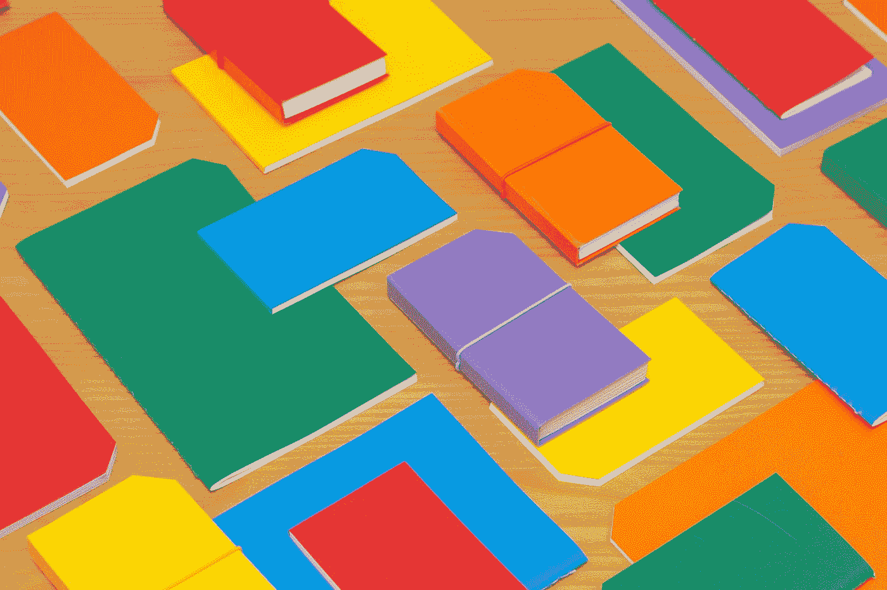
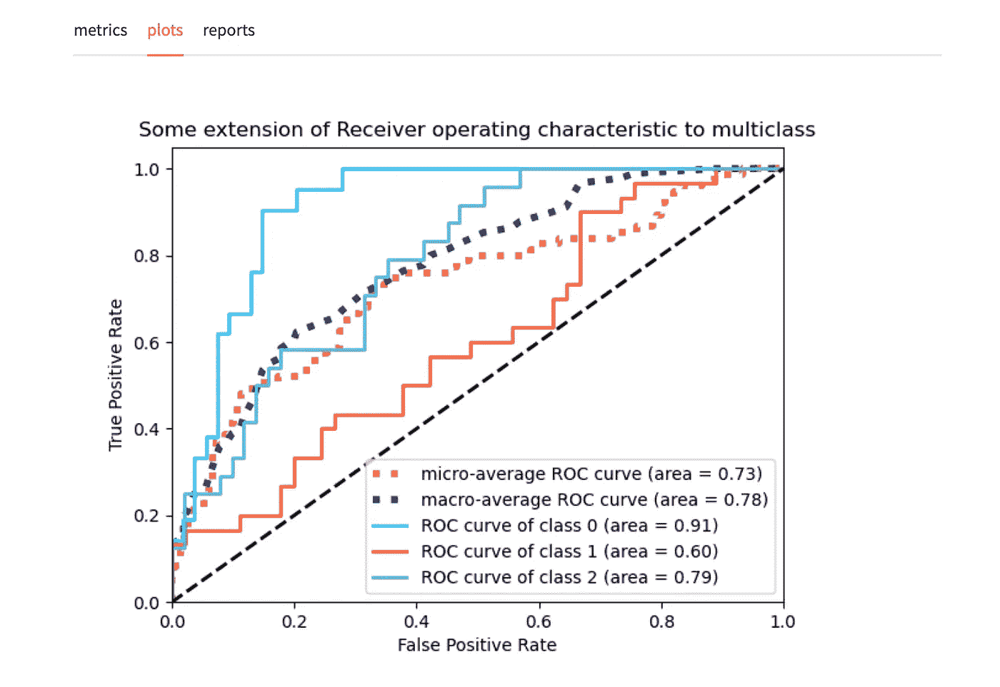
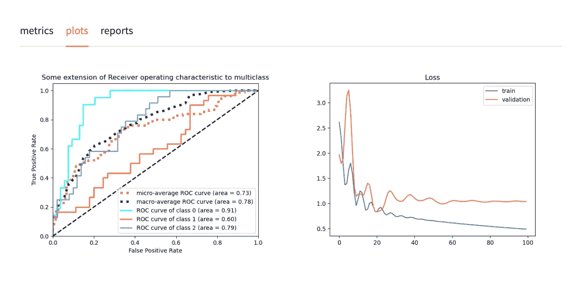
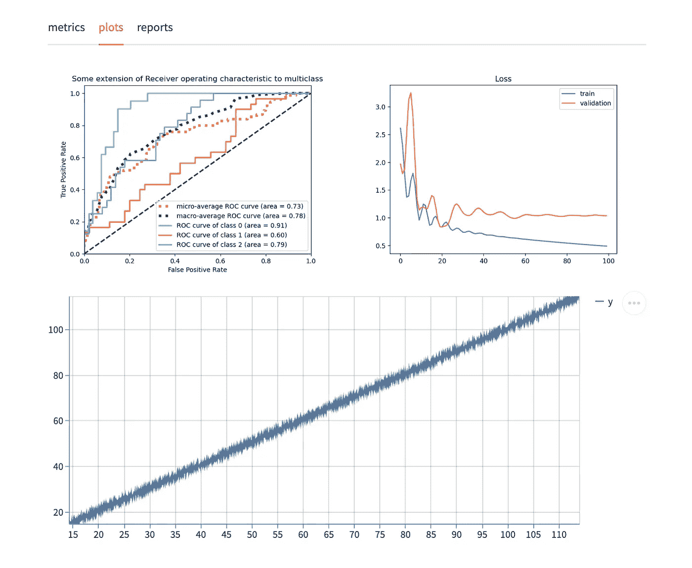
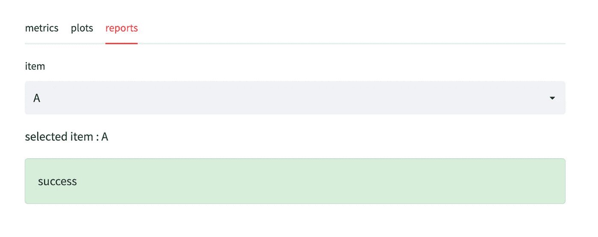
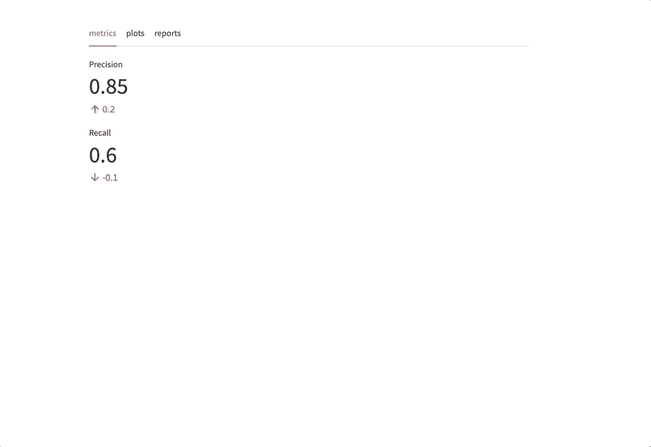
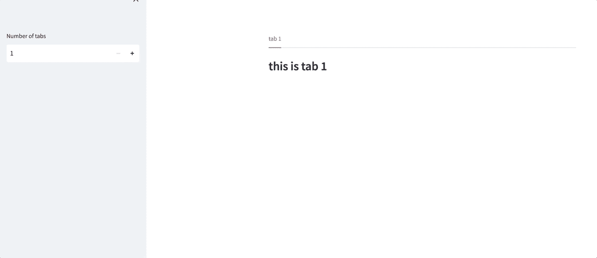

# 多个选项卡现在是 Streamlit 的一部分

> 原文：<https://towardsdatascience.com/multiple-tabs-are-now-part-of-streamlit-9f15169aab9a>

## 一个新的小部件，可以更好地构建应用程序的布局

照片由[大卫·布鲁诺·席尔瓦](https://unsplash.com/@brlimaproj?utm_source=medium&utm_medium=referral)在 [Unsplash](https://unsplash.com?utm_source=medium&utm_medium=referral) 上拍摄

作为一名数据科学家，我经常使用 Streamlit 来构建交互式 web 应用程序并展示演示和原型。

Streamlit 非常容易使用，它有一个非常直观的语法，可以让你很快熟悉原型制作。你现在不需要了解 HTML 或 JavaScript 就能构建优秀的 web 应用。

Streamlit 提供了一个简洁的 [API](https://docs.streamlit.io/library/api-reference) 来用 Python 制作和设计交互式应用。

这个 API 在一个活跃的社区的帮助下不断发展，这就是为什么我们今天将探索最近添加到它的一个功能。

> ***本帖是对这一新特性的快速回顾。它包括代码示例、语法概述，并概述了一些可以从添加选项卡中受益的用例。***

让我们看一看🔍

  

# 快速提醒

从版本`1.11.0`开始，Streamlit 引入了`st.tabs`；一个将多个容器插入不同标签的新组件。

Streamlit 宣布推出新的 st.tabs 功能

# 语法💻

和往常一样，语法非常简单，⭐️.

首先通过向`st.tabs`函数传递一个选项列表来创建选项卡。

每个选项对应一个选项卡的名称。

作者截图

现在，要向每个选项卡添加内容，您有两种选择。

1 —通过`with`语句在每个选项卡上使用上下文管理器

2-直接调用每个选项卡的方法。

我个人更喜欢第一种方法，因为它使代码更干净，更容易阅读。使用上下文管理器有助于快速识别每个选项卡的内容。

# 例子📊

你可以在标签页中添加任何你想要的东西。

→指标

作者截图

→一个情节

作者截图

→多幅图

作者截图

→混合图表和牛郎星图表(或 plotly、bokeh 和 matplotlib 图表)

作者截图

→输入部件(选择框、输入文本、滑块等。)

作者截图

选项卡基本上是你想在 Streamlit 中创建的任何东西的容器。
它们提供了相关内容组之间的简单导航。

# 活性天然成分

就 UX 而言，我发现标签之间的转换快速而平滑。

作者截图

# 以编程方式创建选项卡

`st.tabs`还允许您动态创建选项卡并向其中插入内容。

下面是一个创建任意数量选项卡的示例。

作者 GIF

# 那么什么时候应该使用 Streamlit 选项卡呢？

使用选项卡的目的是在独立的视图中对相关内容进行分组。

以下是我使用它们的地方:

*   将机器学习实验总结为多个选项卡，这些选项卡包含数据帧格式的度量(训练和测试)、交互图、原始数据和预测
*   可视化工作流:例如，数据在管道的每个阶段经历的所有转换。比如一个话题抽取 app
*   一个深入的探索性数据分析:类似于[熊猫概况](https://pandas-profiling.ydata.ai/docs/master/index.html)产生的东西，但是结果分散在多个标签上

# 最后的话

我喜欢 Streamlit 和背后的社区不懈地生产。

选项卡，当然还有许多即将推出的功能，将为这个伟大的库带来更多的功能，让人们能够构建有用的应用程序，并获得更好的用户体验。

如果你是 Streamlit 及其生态系统的新手，你可以看看我以前的一些帖子:

        

或者查看以下链接:

*   [https://docs . streamlit . io/library/API-reference/layout/ST . tabs](https://docs.streamlit.io/library/api-reference/layout/st.tabs)
*   [https://youtu.be/LYXTKpnwB2I](https://youtu.be/LYXTKpnwB2I)

今天到此为止。下次见！👋

## 新到中？你可以每月订阅 5 美元，并解锁各种主题的无限文章(技术、设计、创业……)你可以通过点击我的推荐链接[来支持我](https://ahmedbesbes.medium.com/membership)

 