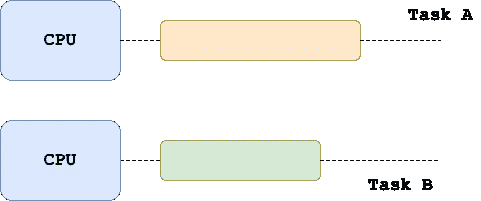

# Python 中的多线程和多处理

> 原文：<https://towardsdatascience.com/multithreading-multiprocessing-python-180d0975ab29>

# Python 中的多线程和多处理

## 深入探讨 Python 中的多线程和多处理，以及它们与并发性和并行性的关系

奥斯曼·拉纳在 [Unsplash](https://unsplash.com/s/photos/lines?utm_source=unsplash&utm_medium=referral&utm_content=creditCopyText) 上拍摄的照片

## 介绍

线程和多处理是编程中两个最基本的概念。如果你已经写了一段时间的代码，你应该已经遇到过一些用例，在这些用例中，你想要在你的代码的某些部分中加速特定的操作。Python 支持各种机制，使得各种任务能够(几乎)同时执行。

在本教程中，我们将理解**多线程**和**多处理**，并在实践中了解如何在 Python 中实现这些技术。我们还将根据应用程序是由 *I/O* 还是 *CPU* *绑定*来讨论使用哪种技术。

在讨论线程和多处理之前，理解这两个经常互换使用的术语很重要。**并发**和**并行**是密切*相关*但*截然不同的*概念。

## 并发性和并行性

在许多情况下，我们可能需要加速代码库中的一些操作，以提高执行的性能。这通常可以通过并行或并发执行多个任务来实现(即，通过在多个任务之间交错)。您能否利用并发性或并行性实际上取决于您的代码，但也取决于运行它的机器。

在**并发执行中，**两个或多个任务可以在重叠的时间段内开始、执行和完成。因此，这些任务不一定要同时运行——它们只需要以重叠的方式取得进展。

> 并发性:至少有两个线程正在进行的情况。一种更通用的并行形式，可以将时间片作为虚拟并行的一种形式。
> 
> — [孙的多线程编程指南](http://docs.oracle.com/cd/E19455-01/806-5257/6je9h032b/index.html)

现在让我们考虑一个用例，我们有一台带有单核 CPU 的计算机。这意味着需要作为应用程序的一部分执行的任务不能在完全相同的时间进行，因为处理器一次只能处理一个任务。并发运行多个任务意味着处理器执行上下文切换，以便多个任务可以同时进行。

并发性的主要目标之一是当其中一个任务被迫等待(比如等待来自外部资源的响应)时，通过来回切换来防止任务相互阻塞。例如，任务 A 进行到某个点时，CPU 停止处理任务 A，切换到任务 B 并开始处理一段时间，然后它可以切换回任务 A 完成它，最后返回到任务 B，直到它也完成这个任务。

下图显示了一个由两个任务组成的应用，这两个任务在一个内核中同时执行。

并发执行—来源:作者

另一方面，在**并行性**中，多个任务(或者甚至一个任务的几个组件)**实际上可以同时运行**(例如，在一个多核处理器或者一台有多个 CPU 的机器上)。因此，在具有单个处理器和单核的机器上不可能有并行性。

> 并行性:当至少两个线程同时执行时出现的情况。
> 
> — [孙的多线程编程指南](http://docs.oracle.com/cd/E19455-01/806-5257/6je9h032b/index.html)

借助并行技术，我们能够最大限度地利用硬件资源。考虑一下我们有 16 个 CPU 内核的情况，启动多个进程或线程来利用所有这些内核可能比只依赖一个内核而其余 15 个内核处于空闲状态更明智。

在多核环境中，每个内核可以同时执行一项任务，如下图所示:

平行——来源:作者

概括来说，并发性可以被视为系统或程序的**属性**，指的是单个 CPU(内核)如何在看似**的同时(即并发地)处理多个任务**，而并行性是实际的**运行时行为**，即几乎同时并行执行至少两个任务。此外，需要强调的是**在任务执行过程中，并发性和并行性可以结合在一起**。事实上，我们可以有各种各样的组合；

*   **既不并发，也不并行**:这也称为*顺序* *执行* 任务严格地一个接一个地执行。
*   **并发，但不并行**:这意味着任务看似同时进行*但实际上系统在并发进行的各种任务之间切换，直到全部执行完毕。因此，没有真正的并行性，因此没有两个任务在完全相同的时间被执行。*
*   **并行，但不并发**:这是一个相当罕见的场景，在任何给定的时间只有一个任务被执行，但任务本身被分解成并行处理的子任务。但是，每一个任务都必须在下一个任务被拾取和执行之前完成。
*   **并发和并行**:这可能以两种方式发生；第一种是简单的并行和并发执行，应用程序启动多个线程在多个 CPU 和/或内核上执行。实现这一点的第二种方式是当应用程序能够同时处理多个任务，但同时它也将每个单独的任务分解成子任务，以便这些子任务最终可以并行执行。

并行与并发——来源:作者

现在，我们已经对并发和并行的工作原理有了基本的了解，让我们使用 Python 中的一些例子来探索多处理和多线程。

## Python 中的线程

线程是在进程上下文中执行的一系列指令。一个进程可以产生多个线程，但是所有的线程都将共享相同的内存。

当在 Python 中对 CPU 受限的任务进行多线程实验时，您最终会注意到执行并没有得到优化，甚至在使用多线程时会运行得更慢。通常，在多核机器上使用多线程代码应该能够充分利用可用的内核，从而提高整体性能。

**事实上，Python 进程不能并行运行线程，但它可以在 I/O 绑定操作期间通过上下文切换来并发运行它们。**

这一限制实际上是由 GIL 实施的。Python 全局解释器锁 (GIL)防止同一进程中的线程同时执行。

> GIL 是一个互斥体，保护对 Python 对象的访问，防止多个线程同时执行 Python 字节码— [Python Wiki](https://wiki.python.org/moin/GlobalInterpreterLock)

GIL 是必要的，因为 Python 的解释器**不是线程安全的**。每当我们试图访问线程中的 Python 对象时，这个全局锁就会被强制执行。在任何给定时间，只有一个线程可以获取特定对象的锁。因此，受 CPU 限制的代码不会因为 Python 多线程而获得性能提升。

> **CPython 实现细节:**
> 
> 在 CPython 中，由于[全局解释器锁](https://docs.python.org/3/glossary.html#term-global-interpreter-lock)，一次只有一个线程可以执行 Python 代码(尽管某些面向性能的库可能会克服这一限制)。
> 
> 如果你想让你的应用更好的利用多核机器的计算资源，建议你使用`[*multiprocessing*](https://docs.python.org/3/library/multiprocessing.html#module-multiprocessing)`或者`[*concurrent.futures.ProcessPoolExecutor*](https://docs.python.org/3/library/concurrent.futures.html#concurrent.futures.ProcessPoolExecutor)`。
> 
> - [Python 文档](https://docs.python.org/3/library/threading.html)

您可以在我最近的一篇文章中[阅读更多关于 Python 的全局解释器锁的内容，但是现在提供的信息应该足以理解全局解释器锁如何限制 Python 中多线程应用程序的能力(以及潜在的为什么它是“必需的”)。](/python-gil-e63f18a08c65)

现在，我们已经了解了 Python 中多线程应用程序的工作原理，让我们编写一些代码并利用这一技术。

在 Python 中，线程可以通过使用`[**threading**](https://docs.python.org/3/library/threading.html)`模块来实现。现在让我们考虑一个用于下载图像的函数——这显然是一个 I/O 绑定的任务:

示例 CPU 绑定函数—来源:作者

然后，让我们尝试使用下面的代码片段从 Unsplash 下载一些图像。请注意，为了更清楚地展示线程化的效果，我们有意尝试下载这些图像 5 次(参见`for`循环):

使用 Python 从 Unsplash 下载图像(I/O 绑定任务)—来源:作者

因此，我们的小应用程序运行良好，但我们肯定可以做得更好，并通过利用线程优化代码(不要忘记，下载多个图像是一个 I/O 绑定的任务)。

从带线程的 Unsplash 下载图像—来源:作者

概括地说，Python 中的线程化允许在单个进程中创建多个线程，但是由于 GIL，它们不会完全同时运行。**在并发运行多个 I/O 绑定任务时，线程仍然是一个非常好的选择**。现在，如果您想要利用多核机器上的计算资源，那么多处理是一条可行之路。

您还应该注意到，线程化伴随着与管理线程相关的开销，因此您应该避免将它们用于基本任务。此外，它们还增加了程序的复杂性，这意味着调试可能会变得有点棘手。因此，只有在有明确价值时才使用线程。

## Python 中的多重处理

现在，如果我们想要利用多核系统并最终在真正并行的环境中运行任务，我们需要执行多处理而不是多线程。

在 Python 中，可以使用`[**multiprocessing**](https://docs.python.org/3/library/multiprocessing.html)`模块(*或* `[*concurrent.futures.ProcessPoolExecutor*](https://docs.python.org/3/library/concurrent.futures.html#concurrent.futures.ProcessPoolExecutor)`)来实现多处理，该模块可用于生成多个操作系统进程。因此，Python 中的**多重处理避开了 GIL** 和由此产生的限制，因为现在每个进程都有自己的解释器，从而拥有自己的 GIL。

> `[*multiprocessing*](https://docs.python.org/3/library/multiprocessing.html#module-multiprocessing)`是一个支持使用类似于`[*threading*](https://docs.python.org/3/library/threading.html#module-threading)`模块的 API 来生成进程的包。
> 
> `[*multiprocessing*](https://docs.python.org/3/library/multiprocessing.html#module-multiprocessing)`包提供了本地和远程并发，通过使用子进程而不是线程，有效地避开了[全局解释器锁](https://docs.python.org/3/glossary.html#term-global-interpreter-lock)。
> 
> 因此，`[*multiprocessing*](https://docs.python.org/3/library/multiprocessing.html#module-multiprocessing)`模块允许程序员充分利用给定机器上的多个处理器。它可以在 Unix 和 Windows 上运行。
> 
> - [Python 文档](https://docs.python.org/3/library/multiprocessing.html#module-multiprocessing)

在上一节中，我们讨论了线程化，我们看到线程化根本不能改善 CPU 受限的任务。这可以通过使用多重处理来实现。让我们使用与前一节相同的函数`append_to_list()`，但这次我们将使用`multiprocessing`而不是`threading`，以便利用我们的多核机器。

现在让我们**考虑一个 CPU 受限的操作**，它涉及一个将多个随机整数追加到一个列表中的函数。

受 CPU 限制的任务——来源:作者

现在让我们假设我们想要运行这个函数两次，如下所示:

没有多重处理的 CPU 受限任务——来源:作者

让我们`time`这个执行并检查结果。

现在让我们稍微重构一下我们的代码，现在使用两个不同的进程，以便每个函数调用都在它自己的进程中执行:

CPU 受限任务的多重处理——来源:作者

最后让我们来看一下`time`以及执行和检查结果:

我们可以清楚地看到(尽管`user`和`sys`时间保持大致相同)，但是`real`时间下降了一倍，甚至比两倍还多(这是意料之中的，因为我们实际上将负载分配给了两个不同的进程，以便它们可以并行运行)。

总的来说，当我们需要利用多核系统的计算能力时，可以使用 Python 中的多处理。事实上，多处理模块允许您在**并行**中运行多个任务和进程。与线程相比，`multiprocessing`通过使用子进程而不是线程来避开 GIL，因此多个进程可以同时运行。这种技术最适合 CPU 密集型任务。

## 最后的想法

在今天的文章中，我们介绍了编程中的两个最基本的概念，即并发性和并行性，以及它们在执行时如何区别甚至组合。此外，我们还讨论了线程和多处理，探讨了它们的主要优点和缺点，以及一些最终可以帮助您了解何时使用其中一个的用例。最后，我们展示了如何用 Python 实现线程或多处理应用程序。

概括一下，

**穿线**

*   线程共享相同的内存，可以读写共享的变量
*   由于 Python 全局解释器锁，两个线程不会同时执行，而是并发执行(例如上下文切换)
*   对受 I/O 限制的任务有效
*   可以用`[threading](https://docs.python.org/3/library/threading.html#module-threading)`模块实现

**多处理**

*   每个进程都有自己的内存空间
*   每个进程可以包含一个或多个子进程/线程
*   由于进程可以在不同的 CPU 内核上运行，因此可以通过利用多核机器来实现并行性
*   对 CPU 受限的任务有效
*   可以用`[multiprocessing](https://docs.python.org/3/library/multiprocessing.html#module-multiprocessing)` 模块(或`[concurrent.futures.ProcessPoolExecutor](https://docs.python.org/3/library/concurrent.futures.html#concurrent.futures.ProcessPoolExecutor)`)实现

[**成为会员**](https://gmyrianthous.medium.com/membership) **阅读介质上的每一个故事。你的会员费直接支持我和你看的其他作家。你也可以在媒体上看到所有的故事。**

 [## 通过我的推荐链接加入 Medium-Giorgos Myrianthous

### 作为一个媒体会员，你的会员费的一部分会给你阅读的作家，你可以完全接触到每一个故事…

gmyrianthous.medium.com](https://gmyrianthous.medium.com/membership) 

**你可能也会喜欢**

 [## 什么是 Python 全局解释器锁(GIL)？

### 理解 Python 中全局解释器锁的用途以及它如何影响多线程

towardsdatascience.com](/python-gil-e63f18a08c65)  [## Python 中的扩充赋值

### 了解增强赋值表达式在 Python 中的工作方式，以及为什么在使用它们时要小心…

towardsdatascience.com](/augmented-assignments-python-caa4990811a0)