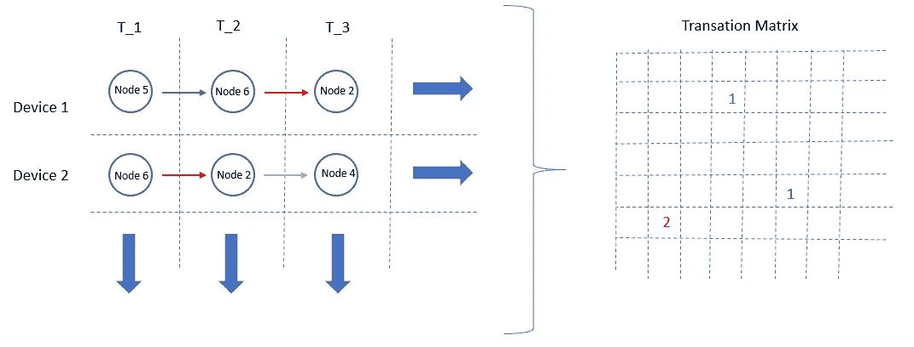

# 基于生长神经气体和谱聚类的多元时间序列聚类

> 原文：<https://towardsdatascience.com/multivariate-time-series-clustering-using-growing-neural-gas-and-spectral-clustering-adc83680639f>

## 一种基于图论的时间序列聚类方法

聚类是一种无监督的方法，有很多应用领域。它也可以应用于时间序列，尽管它不像时间序列的预测和异常检测那样流行。重点是分析整个系统，该系统有许多不同的 KPI 随时间流动，并将系统的行为表示为状态，并将相似的行为聚集在一起。换句话说，获取特定时间段的系统快照，并检测变化模式。

在这篇文章中，我提到了一种新颖的实现方法，它将生长神经气体(GNG)和谱聚类结合起来用于这个目的。


艾伯·布朗在 [Unsplash](https://unsplash.com?utm_source=medium&utm_medium=referral) 上的照片

## 场景定义和数据集检查

让我们假设一个系统由几个设备组成，每个设备由 100 个不同的 KPI 表示，这些 KPI 随时间流动，换句话说，多变量时间序列用于确定系统的总体概况。目标是检测系统的不同行为，并沿着定义的时间段对它们进行聚类。类似地，我们也可以洞察我们遇到的异常情况。为了保持较小的数据量和简单快速的计算，我使用了一个简化的数据集。为了澄清这一点，请看一下图 1 中数据集的简化版本。您甚至可以通过忽略“设备”列并研究随时间推移会创建多个 KPI 的单个设备，将此数据集转换为更简化的数据集。

为了不失去对研究的关注，我简单地假设数据已经过预处理，这意味着丢失的值已经得到处理，并且数据已经过规范化。


图片由作者提供—图 1

## 1-应用 GNG

GNG 主要用于学习图形格式数据的拓扑结构。GNG 算法是由 Fritzke 于 1995 年首先提出的。[在原论文](https://proceedings.neurips.cc/paper/1994/file/d56b9fc4b0f1be8871f5e1c40c0067e7-Paper.pdf)中，基本说明了它的工作原理。这是一种简单的无监督神经网络方法，类似于[自组织映射(SOMs)](/self-organizing-maps-1b7d2a84e065) 。然而，GNG 和 SOM 都不包括常见的神经网络结构和步骤，如层、前馈和反向传播。类似地，GNG 和 SOM 中的*权重*概念基本上对应于节点在空间中的位置，并由具有特征大小的向量来表示。

它们都是迭代方法，并且在其迭代期间具有相似的最佳匹配单元/最近单元推理。然而，它们在实现上也有基本的区别。与 SOM 不同的是，在 GNG 中，您不需要在流程开始时初始化节点，这些节点是通过迭代动态确定的，这就是“增长”的来源。GNGs 试图将数据包含到拓扑中，在拓扑中，模型在每次迭代中表现最差。通过这种方式，它们不会均匀增长，也不会覆盖整个数据。gng 通常也用于从图像生成[有趣的动画。我利用](http://neupy.com/2018/03/26/making_art_with_growing_neural_gas.html) [NeuPy](http://neupy.com/apidocs/neupy.algorithms.competitive.growing_neural_gas.html) 包来实现 python 中的 GNG，它提供了一个简单的抽象。

您可以在下面找到一个简单的介绍性代码片段，它为我们的数据组成了一个简单的 GNG 模型。直接影响模型的性能和准确性的一个重要参数是节点的数量，换句话说，就是数据表示的分辨率。要找到节点计数的最佳数量并不那么简单，在我们的例子中，您可能只需要根据唯一的设备数量和工作时间窗口实现一些简单的推理。注意，在 Neupy 包中为 GNG 模型实现的*图*属性提供了对数据拓扑结构的洞察。

```
from neupy import algorithms
import pandas as pd
import numpy as np
from sklearn.neighbors import KNeighborsClassifier
from sklearn.cluster import KMeans
from scipy import statsgng = algorithms.GrowingNeuralGas(
 n_inputs=self.n,
 n_start_nodes=5,
 shuffle_data=True,
 verbose=True,
 step=0.1,
 neighbour_step=0.01,
 max_edge_age=50,
 max_nodes=100,
 n_iter_before_neuron_added=100,
 after_split_error_decay_rate=0.5,
 error_decay_rate=0.995,
 min_distance_for_update=0.05
 )
epoch = 100
gng.train(df_scaled_data, epochs=epoch) # only including features, features are named as '0', '1', '2' ...
g = gng.graph
node_list = g.nodes
```

在构建了 GNG 模型之后，我们还有一个问题需要补充。也就是找出哪个样本匹配到哪个节点。我们可以简单地利用具有 *n_neighbors=1* 参数的 KNN 算法来将样本与最近的节点进行匹配。

```
number_of_features = 92 # we have 92 different KPIs in our data
node_koor_node = []
for node in gng.graph.nodes:
 row = node.weight[0].tolist()
 row.append(node_list.index(node))
 node_koor_node.append(row)df_train = pd.DataFrame(node_koor_node)
df_test = pd.DataFrame(df_scaled_data)X_train = df_train.iloc[:, 0:number_of_features] 
y_train = df_train.iloc[:, number_of_features]
X_test = df_test.iloc[:, 0:number_of_features]knn = KNeighborsClassifier(n_neighbors=1)
knn.fit(X_train, y_train)
knn_result = knn.predict(X_test)scaled_sample_node_matching = []
for i, data in enumerate(df_scaled_data):
 row = data.tolist()
 node_idx = knn_result[i]
 row.append(node_idx)
 scaled_sample_node_matching.append(row)df_scaled_sample_node_matching = pd.DataFrame(scaled_sample_node_matching)
df_scaled_sample_node_matching = df_scaled_sample_node_matching.rename(columns={number_of_features: “node”})df_node_sample_match = pd.merge(df_static_cols, df_scaled_sample_node_matching, left_index=True,
                   right_index=True) # df_static_cols includes static columns and datetime
```

## 2-包括时间行为

好的，到目前为止还不错，但是我们忽略了一些重要的东西。这是关于时间序列的。GNG 没有考虑数据中的时间行为，换句话说，样本之间的时间依赖性。我们必须在数据中包含时间行为。出于这个原因，我们简单地忽略了所有的边在前面的步骤中建立的 GNG，而保持节点和他们在空间中的位置。在我们的例子中，通过考虑相同器件的连续时间周期之间的转换来重新计算边缘。为了澄清这一点，请看下图。



作者图片—图 2

在上一步中，我们确定了分布在数据空间中的节点及其包含的所有样本。换句话说，我们知道哪些设备在什么时间位于哪个节点上。通过利用这些信息，我们还能够组成邻接矩阵，向我们显示节点之间的转换。邻接矩阵是图结构的一个非常重要的表示。在我们的例子中，我们不构成仅由 0 和 1 组成的二元邻接矩阵。我们计算节点之间转移的概率(换句话说，接近程度)，将该值保存在邻接矩阵的每个单元中。在这个意义上，我们构造了一个加权邻接矩阵。它也被称为亲和矩阵。

此外，我们还构建了用新边更新的图的度矩阵。度矩阵在除对角线以外的每个单元中包括零，并且基本上指定每个节点的度，从对应的节点出去多少条边。

```
device_list = df_node_sample_match['DEVICE'].unique()
n = len(gng.graph.nodes)
mat_transition = np.zeros((n, n))
previous_node = -1for device in device_list:
    df_device = df_node_sample_match.loc[df_node_sample_match['DEVICE'] == device]
    df_device = df_device.sort_values('DATETIME') for i, row in df_device.iterrows():
        current_node = row['node']
        if (previous_node != -1):
            mat_transition[previous_node, current_node] = mat_transition[previous_node, current_node] + 1
        else:
            print('It is the starting node, no transaction!')
        previous_node = current_node
    previous_node = -1df_adjacency = pd.DataFrame(mat_transition)df_adjacency['sum_of_rows'] = df_adjacency.sum(axis=1)
list_degree = df_adjacency['sum_of_rows'].tolist()
degree_matrix = np.diag(list_degree)# calculating transition probability
df_affinity = df_adjacency.loc[:, :].div(df_adjacency["sum_of_rows"], axis=0)
df_affinity = df_affinity.drop(["sum_of_rows"], axis=1)
df_affinity = df_affinity.fillna(0)
```

## 3-应用谱聚类

谱聚类是一种降维技术，主要是将高维数据集聚类成更小的相似聚类。它的推理来自于图论，目的是根据拓扑中的连通性来检测接近的节点，并分别对它们进行聚类。它也适用于不同的数据形式。谱聚类的主要步骤如下:


[谱聚类的主要步骤，来源](https://en.wikipedia.org/wiki/Spectral_clustering)

为了更好地理解谱聚类，请看一下 K-means 和谱聚类在图 3 中下面的圆形数据上的行为。谱聚类利用拉普拉斯矩阵(图拉普拉斯)的谱(特征向量),该谱是通过使用亲和度矩阵和度矩阵计算的。注意，我们已经在上一步中计算了两个矩阵。所以，我们准备好看拉普拉斯矩阵了。


使用两种不同方法对圆形数据进行聚类，图片由作者提供—图 3

而拉普拉斯矩阵可以用等式 *L = D - A* 来计算；其中 *D* 是度矩阵，而 *A* 是邻接矩阵(在我们的情况下是亲和矩阵)，归一化拉普拉斯矩阵可以被定义为以下等式:


归一化拉普拉斯方程，[来源](https://en.wikipedia.org/wiki/Laplacian_matrix)

对于我们的问题，我们[更喜欢](https://math.stackexchange.com/questions/1113467/why-laplacian-matrix-need-normalization-and-how-come-the-sqrt-of-degree-matrix/1113572)使用归一化拉普拉斯算子而不是拉普拉斯矩阵。可以借助下面的代码片段进行计算。

```
I = np.identity(df_affinity.shape[0])
sqrt = np.sqrt(degree_matrix)
D_inv_sqrt = np.linalg.inv(sqrt)
normalised_laplace = I — np.dot(D_inv_sqrt, df_affinity).dot(D_inv_sqrt)
df_normalised_laplace = pd.DataFrame(normalised_laplace)
```

作为第二步，我们确定具有对应的最小 *k* 特征值的特征向量，其中 *k* 是指聚类的数量。调整最佳聚类数并不简单。你可以找到一个解释的方法来确定它[这里](/spectral-clustering-aba2640c0d5b)。归一化拉普拉斯矩阵的第二特征值给出了对图的连通性的洞察。在我们的例子中，我们选择它为 10。为了找到图拉普拉斯的特征向量和特征值，我们利用了[奇异值分解(svd)](/simple-svd-algorithms-13291ad2eef2) 技术。另一种可能是使用 NumPy 包的 [*eigh*](https://numpy.org/doc/stable/reference/generated/numpy.linalg.eigh.html) 方法。

```
number_of_nodes = df_affinity.shape[0]
cluster_number = 10
u, s, vN = np.linalg.svd(normalised_laplace, full_matrices=False)
vN = np.transpose(vN)
eigen_vecs = vN[:, number_of_nodes — cluster_number:number_of_nodes] # 10 eigenvectors with smallest 10 eigenvalues
```

作为最后一步，组成的特征向量子集可用于对数据进行聚类，只需输入 *k-means* 。聚类之后，我们将节点与相应的聚类进行匹配。

```
# Clustering
kmeans = KMeans(n_clusters=cluster_number, max_iter=1000, random_state=0)
kmeans.fit(eigen_vecs)
labels = kmeans.labels_
cluster_centers = kmeans.cluster_centers_# node-cluster matching
clusters = dict()
for i, n in enumerate(node_list):
 if labels[i] not in clusters:
    clusters[labels[i]] = list()
 clusters[labels[i]].append(i)
```

## 4-确定异常群集和根本原因

集群是最终目的地吗？不太可能。一个可能的问题是定义异常集群。另一种说法是找出设备和相应的时间在我们的情况下以异常的方式表现。此外，这种异常的原因也是一个问题。很明显，小星团往往是异常的。以这种方式，例如，我们可以得出结论，表示小于整个数据的 10%的聚类是异常聚类。我们预计少数几个聚类将覆盖大部分数据。对我们来说这是一个开放的研究领域，仍然在研究。更先进的技术比基于规则的方法更受欢迎。此外，领域专家还可以解释聚类结果，并对异常情况发表意见。

在定义异常集群之后，能够检测这些异常的根本原因将是研究的一个资产。此时，异常群集和正常群集之间的每个 KPI 分布的差异出现在表中。为了测量和排序两种分布之间的差异，您可以利用 *Kolmogorov-Smirnov* 测试。你也可以在这里找到不同的选项[。对于异常聚类中样本的每个 KPI(特征),我们只需应用 *Kolmogorov-Smirnov* 检验来找到与正常聚类的相应 KPI 的相似性。特征越不相似，就越有可能是异常的原因。](https://medium.com/geekculture/techniques-to-measure-probability-distribution-similarity-9145678d68a6)

```
# We somehow determine the anomaly clusters
anomaly_clusters_list = [3, 4, 5, 7, 8, 9]
normal_cluster_list = [0, 1, 2, 6]node_cluster_matching = []
for i in range(len(node_list)):
 for j in range(cluster_number):
   if i in clusters[j]:
     node_cluster_matching.append([i, j])df_node_cluster_matching = pd.DataFrame(node_cluster_matching)
df_node_cluster_matching.columns = [‘node’, ‘cluster’]
df_sample_node_cluster = pd.merge(df_node_sample_match, df_node_cluster_matching, on=[‘node’], how=’inner’)list_ = np.arange(0, number_of_features, 1).tolist()
list_ = [str(i) for i in list_]
list_.append(‘cluster’)df_anomaly_clusters_data = df_sample_node_cluster.loc[
 df_sample_node_cluster[‘cluster’].isin(anomaly_clusters_list)]
df_anomaly_clusters_data = df_anomaly_clusters_data.loc[:, df_anomaly_clusters_data.columns.isin(list_)]
df_anomaly_clusters_data = df_anomaly_clusters_data.reset_index(drop=True)df_normal_clusters_data = df_sample_node_cluster.loc[
 df_sample_node_cluster[‘cluster’].isin(normal_cluster_list)]
df_normal_clusters_data = df_normal_clusters_data.loc[:, df_normal_clusters_data.columns.isin(list_)]
df_normal_clusters_data = df_normal_clusters_data.reset_index(drop=True)dict_of_cluster_feature_pvaluelist = dict()
for c in anomaly_clusters_list:
 filtered_anomaly_data = df_anomaly_clusters_data.loc[df_anomaly_clusters_data[‘cluster’] == c]
 pvalue_feature_list = []
 for i in range(number_of_features):
 anomaly_clusters_data_feature = filtered_anomaly_data[str(i)].to_numpy().tolist()
 normal_clusters_data_feature = df_normal_clusters_data[str(i)].to_numpy().tolist()
 result = stats.ks_2samp(anomaly_clusters_data_feature, normal_clusters_data_feature)
 print(‘Result of cluster ‘ + str(c) + ‘ feature ‘ + str(i))
 print(result)
 pvalue = result.pvalue
 if pvalue <= 0.05:
 pvalue_feature_list.append([i, pvalue])
 pvalue_feature_list.sort(key=lambda x: x[1])
 pvalue_feature_list = pvalue_feature_list[0: 3] # lets say we pick top 3 probable features for root cause 
 dict_of_cluster_feature_pvaluelist[‘c’ + str(c)] = pvalue_feature_list
```

目前就这些。感谢 Sezin Gürkan、Ersin Aksoy 和 Amir Yavariabdi，我非常感谢他们对这项研究做出的宝贵贡献。

## 有用的链接

<https://medium.com/starschema-blog/growing-neural-gas-models-theory-and-practice-b63e5bbe058d>  </spectral-clustering-aba2640c0d5b>  <https://math.stackexchange.com/questions/1113467/why-laplacian-matrix-need-normalization-and-how-come-the-sqrt-of-degree-matrix/1113572>  <https://www.mygreatlearning.com/blog/introduction-to-spectral-clustering/#WhatisSpectralclustering>    <https://math.stackexchange.com/questions/573888/how-do-i-compute-the-eigenvectors-for-spectral-clustering-from-a-singular-value>  <https://stats.stackexchange.com/questions/314046/why-does-andrew-ng-prefer-to-use-svd-and-not-eig-of-covariance-matrix-to-do-pca>  <https://machinelearningmastery.com/singular-value-decomposition-for-machine-learning/>  </pca-and-svd-explained-with-numpy-5d13b0d2a4d8>  <https://stackoverflow.com/questions/24913232/using-numpy-np-linalg-svd-for-singular-value-decomposition> 