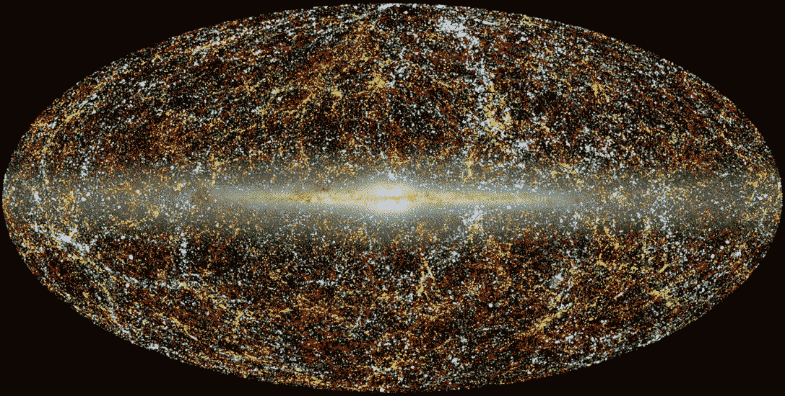

# 来自随机性的分形音乐

> 原文：<https://towardsdatascience.com/music-from-randomness-3452061e0f6>

## 音乐作为数据系列

## 精心挑选的变量可以让随机的音符序列听起来像音乐


分形构图“布雷克 8”的动画中的一帧(图片由作者提供)

我的生活似乎是一连串的事件和事故。然而当我回头看时，我看到了一个模式。

―本华·B·曼德博(1924 年至 2010 年)

## 动机和背景

音乐是多维数据的丰富来源。该数据可以采用乐谱的符号形式，通常由 [MIDI](https://cecm.indiana.edu/361/midi.html#:~:text=) 值表示，或者采用音频信号的形式。

多年来，我一直使用 MIDI 数据来识别音乐中的分形结构。MIDI 文件因质量不稳定而臭名昭著，这是由人为和机器错误造成的。需要对数据集进行质量筛选和清理，以处理缺失、损坏或重复的值、异常值，有时还有全局计时问题。这项工作大量使用探索性数据分析工具，包括图形检查、统计汇总、数据平滑、拟合和关键分析。

一个自然产生的问题是，我是否能在某种程度上逆转这个过程；也就是说，用一个已知分布的音乐特征的合成数据集，通过算法把它变成音乐，或者说，任何人都可能喜欢听的音乐。

算法音乐目前是一个活跃的领域，其结果可以采取多种形式。虽然方法之间的界限可能是模糊的，但流行的生成方法包括[随机方法](https://www.masterclass.com/articles/aleatoric-music-explained)、[进化/遗传方法](https://en.wikipedia.org/wiki/Evolutionary_music)、[基于马尔可夫的模型](/markov-chain-for-music-generation-932ea8a88305)、非音乐媒体(例如图像和文本)的音频/MIDI 映射，以及[神经网络](https://openai.com/blog/musenet/)。

以某种程度上独立于人类作曲家的方式创作音乐的想法至少可以追溯到莫扎特的时代。他的[*Musikalisches würfelspiel*](https://gbrachetta.github.io/Musical-Dice/)*(“音乐骰子游戏”)可能是将随机输入源应用于音乐创作的最著名的例子。计算机生成和计算机辅助作曲的现代时代于 1957 年到来，伴随着勒贾伦·希勒和伦纳德·艾萨克森的 [*伊利亚克组曲*](http://www.personal.psu.edu/meb26/INART55/illiac_suite.html#) (更多细节参见[妙瑞卡信息](https://www.musicainformatica.org/topics/illiac-suite.php))。当然，当前通过算法创作各种风格的现实音乐的努力的前沿集中在人工智能的复杂性和力量上，正如 OpenAI 的[自动点唱机](https://openai.com/blog/jukebox/)所证明的那样。*

*这些现有的方法大多试图使用、编纂或学习现有的音乐结构。对我来说，问题是，我能做多少小事情来创作出悦耳的音乐？向大自然看齐似乎是个不错的起点。*

## *幂律*

*在这里，我们将介绍一种似乎是算法合成的新方法，它使用了一种叫做<https://www.youtube.com/watch?v=7jUp1rR-Q4I>*幂律的[分形几何](https://users.math.yale.edu/public_html/People/frame/Fractals/)的基本属性。幂律存在于自然科学和社会科学中令人难以置信的一系列现象中。以下是几个例子:**

*   **生物多样性**
*   **植物和动物的循环系统**
*   **棉花价格**
*   **星系分布**
*   **财富分配**
*   **地震**
*   **飓风和洪水**
*   **语言词汇用法**
*   **海岸线的长度**
*   **肿瘤生长**
*   **城市系统**

****

**揭示星系分布的近红外天空全景。(图片: [T .杰瑞特，Image 加州理工](https://wise2.ipac.caltech.edu/staff/jarrett/papers/LSS/XSCz_allsky.html))**

**幂律也可能出现在音乐的许多特征中，如音高、音程、持续时间、节奏变化，以及一种叫做*motive scaling 的分形结构形式。*动机音阶[至少在五个世纪前就出现了](https://medium.com/@harlan.j.brothers/the-dawn-of-fractal-music-b7be801477a9)伴随着法佛兰德作曲家若斯金·德斯·佩雷斯的作品。**

## **分形音乐**

**“分形音乐”这个术语对不同的人有不同的含义。对一些人来说，它仅仅意味着“来自分形图像的音乐”然而，将图像映射到音乐声音并不能确保这些映射的声音也具有分形属性。这有点像罗伯特·弗罗斯特的一首诗翻译成粤语时要押韵。**

**伯努瓦·曼德尔布罗一直有一种强烈的直觉，音乐是可测量的分形。这就是我们将使用这个术语的含义。分形几何首先是几何学，它的名字意味着测量。至少，真正分形的音乐必须具有某种可测量的尺度特性。**

**我们将在以后的文章中探讨更广泛的分形音乐主题。这里，我们将研究一个我们称之为*旋律音程缩放*的属性。它描述了旋律中单个音符之间的距离分布。例如，旋律音程缩放可以在约翰·塞巴斯蒂安·巴赫的一些作品中找到。**

## **实验**

**这是一个带有独奏的简短作品的动画，使用下面描述的算法生成:**

**分形构图“布雷克 8”的动画**

**通过观察独奏音符之间的垂直间距分布，您可以对音程缩放有一个直观的感觉。总的来说，小型跳跃多，中型跳跃少。这些都被很少的大跳跃打断。计数和大小之间的这种关系可以用幂律精确地描述。**

## **一点数学知识**

**考虑一个[异质](https://statisticsbyjim.com/basics/heterogeneity/)系列不同大小的旋律音程，{ *s* ₁ *，s* ₂ *，s* ₃ *，* …}。我们统计每种尺寸的区间数{ *N* ₁， *N* ₂， *N* ₃，…}，其中 *Nₖ* 对应尺寸的区间数 *sₖ* 。如果当我们绘制一个 *N* 对 *s* 的双对数图时，这些点落在一条直线上，则该序列具有旋律音程标度。这条线的斜率可以解释为元素集的维度*d*——在本例中是区间。这是因为取幂律关系的对数将其转换为线性方程:**

****

**如果我们让 *y* =Log[N]和 *x* =Log[1/ *s* ，那么我们得到的就是一条线的方程，*y*=*MX*+*b*，其中 *d* = *m* 和 *b* =0。关于这种类型的分析及其在巴赫大提琴组曲中的应用的详细描述，请参见[1]。**

## **该算法**

**这意味着我们可以:**

1.  **选择维度和间隔大小范围。**
2.  **使用上面的公式，计算我们需要多少个尺寸区间来满足我们选择的尺寸所定义的幂律。**
3.  **基于此计算创建间隔分布，其中每种大小的间隔一半为正，另一半为负。**
4.  **随机排序该分布以确保异质性。**
5.  **累积产生的音程序列来产生我们的旋律。**

**以下是步骤 1 到 3 的伪代码:**

```
**// Assignments:2^(-1/12) ← sizeRatio
dimension ← fractal dimension of set  /* dimension > 0 */
scalingRange ← number of levels of scaling in set  /* scalingRange ≥ 3 */
largeCount ← number of the largest elements in set// Implementation:countRatio := Exp[dimension*Log[1/sizeRatio]]sizes := Table[1/ratio^k, (k, 1, scalingRange)]counts := 
 Table[largeCount*countRatio^(k-1), (k, scalingRange, 1, -1)]  /* k counts down from scalingRange to 1 */data := Log[Transpose[sizes, counts]]Fit[data, (1, x), x]  /* perform linear regression, if desired, to confirm dimension */melodicIntervalSet := Join[data,-1*data]**
```

**我们假设在您选择的语言中，步骤 4 和 5 是熟悉的操作。在将上述算法付诸实践时，还需要解决当累计的间隔总和超过标准 MIDI 范围(0 到 127)时的边界问题。**

****警告**:这个过程产生的旋律会变得非常怪异。然而，有了适当的参数和正确的上下文，结果可能是令人惊讶的音乐。**

**对于上面的构图， *Brecker 8* ，这里是音程的分布，对于一个 *k* 半音的音程，每个音程的大小等于 2^( *k* /12】:**

****

**数值 2^( *k* /12)来源于西方音乐常用的[等音律](https://www.wikiwand.com/en/12_equal_temperament)音阶的物理学。以下是数据图表:**

****

**Brecker 8 的间隔计数与间隔大小的关系图。(图片由作者提供)**

**虽然此示例源于关注改变一组旋律音程的维度的效果，但是也可以通过算法结合其他幂律(例如，与持续时间或动态相关的幂律)来给出更人性化的感觉(参见示例[4])。**

**我发现这件作品特别吸引人的是，一个随机过程可以创造出一些东西，尽管如此，由于它所作用的元素和它出现的背景的潜在分布，这些东西是“有意义的”。至少在音乐中，随机性不需要听起来那么随机。**

## **参考**

**巴赫大提琴组曲中的音程音阶**

**[2] [音乐的分形几何](https://www.pnas.org/doi/abs/10.1073/pnas.87.3.938)**

**[3] [曼德尔-巴赫之旅:音乐和视觉分形的联姻](https://www.researchgate.net/publication/52005982_Mandel-Bach_Journey_A_Marriage_of_Musical_and_Visual_Fractals)**

**【4】[100 秒的圆周率](https://www.youtube.com/watch?v=SNpab2PDquw)**

***如果你喜欢这篇文章，你可以考虑成为 Medium 会员，这样就可以无限制地访问 Medium 上的所有内容:***

**<https://medium.com/@harlan.j.brothers/membership> **