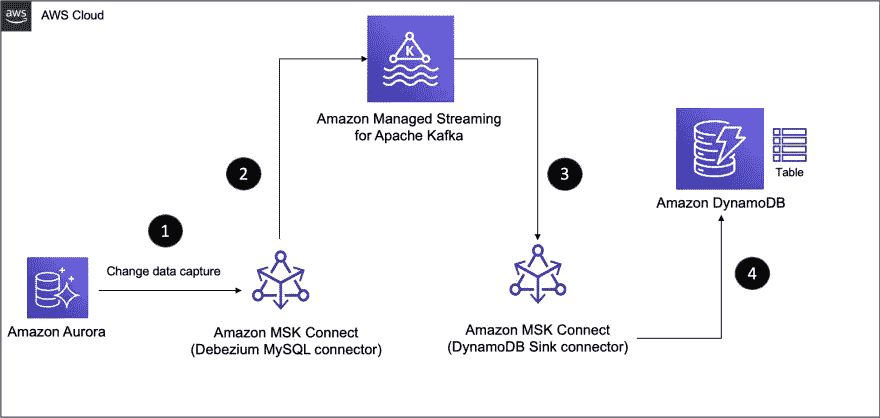
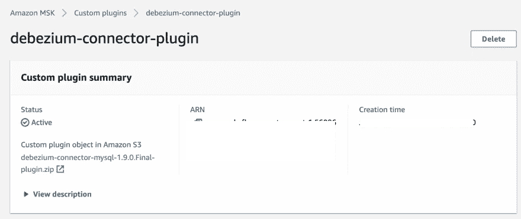
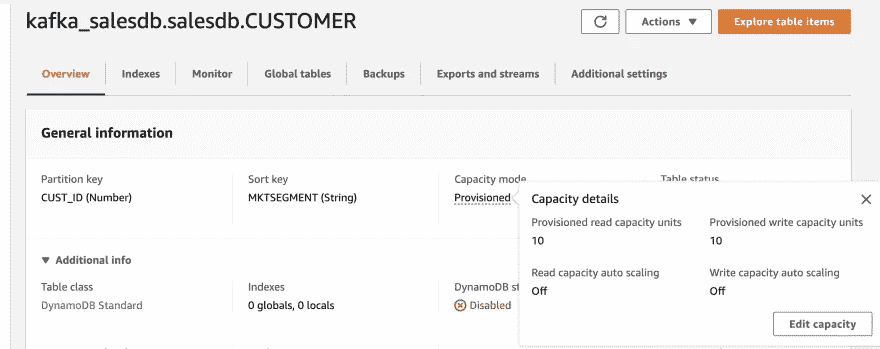
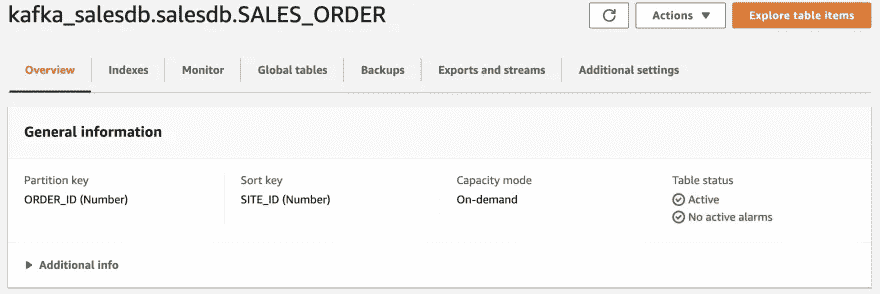

# MySQL 到 DynamoDB:使用 Kafka 在 AWS 上构建流数据管道

> 原文：<https://towardsdatascience.com/mysql-to-dynamodb-build-a-streaming-data-pipeline-on-aws-using-kafka-c2cf0b6e35b6>

## **通过 MSK 连接使用变更数据捕获在 Aurora MySQL 和 DynamoDB 之间同步数据**

这是博客系列的第二部分，它提供了 Kafka 和 Kafka Connect 的数据管道的逐步演示。出于演示目的，我将使用 AWS，但是这些概念适用于任何等效的选项(例如，在 Docker 中本地运行这些选项)。


由[达丽娅·朱姆](https://unsplash.com/@darya_jumelya?utm_source=medium&utm_medium=referral)在 [Unsplash](https://unsplash.com?utm_source=medium&utm_medium=referral) 上拍摄的照片

这一部分将展示*变更数据捕获*的作用，它让您可以跟踪数据库表中的行级变更，以响应创建、更新和删除操作。例如，在 MySQL 中，这些变更数据事件通过 [MySQL 二进制日志(binlog)](https://dev.mysql.com/doc/internals/en/binary-log-overview.html) 公开。在第 1 部分中，我们在数据管道的源部分使用了 Datagen 连接器——它帮助我们为 MSK 主题生成模拟数据，并使事情变得简单。

[](/build-a-data-pipeline-on-aws-with-kafka-kafka-connect-and-dynamodb-97642cdb0cfb) [## 使用 Kafka、Kafka connect 和 DynamoDB 在 AWS 上构建数据管道

### 将 DynamoDB 与 MSK 和 MSK 连接集成

towardsdatascience.com](/build-a-data-pipeline-on-aws-with-kafka-kafka-connect-and-dynamodb-97642cdb0cfb) 

我们将使用 Aurora MySQL 作为数据源，并通过[Debezium connector for MySQL](https://debezium.io/documentation/reference/1.9/connectors/mysql.html)利用其变更数据捕获功能，从 [Aurora MySQL](https://docs.aws.amazon.com/AmazonRDS/latest/AuroraUserGuide/Aurora.AuroraMySQL.html) 中的表中实时提取数据，并将其推送到 MSK 主题。然后，我们将像以前一样继续使用 DynamoDB 接收器连接器。

**如果你刚接触**[**Debezium**](https://debezium.io/)**…**

它是一个分布式平台，构建在不同数据库中可用的变更数据捕获功能之上。它提供了一组 [Kafka Connect 连接器](https://debezium.io/documentation/reference/1.2/connectors/index.html)，这些连接器利用数据库表中的行级更改(使用 CDC)并将它们转换成事件流。这些被发送到 Kafka，并可用于所有下游应用程序。

这是这篇博文中提出的解决方案的高级示意图。



高层架构(图片由作者提供)

我假设您是从第 1 部分开始学习的，在第 1 部分中，已经介绍了本教程所需的基础设施和服务的创建过程。如果您还没有，请参考[第 1 部分](/build-a-data-pipeline-on-aws-with-kafka-kafka-connect-and-dynamodb-97642cdb0cfb)章节中的**准备基础设施组件和服务**章节

# 数据管道第 1 部分:Aurora MySQL 到 MSK

让我们首先创建管道的前半部分，将 Aurora MySQL 表中的数据同步到 MSK 的一个主题。

在本节中，您将:

*   下载 Debezium 连接器产品
*   在 MSK 创建自定义插件
*   将 Debezium 源连接器部署到 MSK 连接

最后，数据管道的前半部分将准备就绪！

## 创建自定义插件和连接器

**将 Debezium 连接器上传到亚马逊 S3**

登录 Kafka 客户端 EC2 实例并运行以下命令:

```
sudo -u ec2-user -i
mkdir debezium && cd debeziumwget https://repo1.maven.org/maven2/io/debezium/debezium-connector-mysql/1.9.0.Final/debezium-connector-mysql-1.9.0.Final-plugin.tar.gz
tar xzf debezium-connector-mysql-1.9.0.Final-plugin.tar.gzcd debezium-connector-mysql
zip -9 ../debezium-connector-mysql-1.9.0.Final-plugin.zip *cd ..
aws s3 cp ./debezium-connector-mysql-1.9.0.Final-plugin.zip s3://msk-lab-<ENTER_YOUR_AWS_ACCOUNT_ID>-plugins-bucket/
```

**创建自定义插件**

> *有关如何创建 MSK 连接插件的分步说明，请参考官方文档中的* [*使用 AWS 管理控制台*](https://docs.aws.amazon.com/msk/latest/developerguide/msk-connect-plugins.html) *创建自定义插件。*

创建定制插件时，确保选择您在上一步上传到`S3`的 Debezium 连接器 zip 文件。



**创建 Debezium 源连接器**

> *关于如何创建 MSK 连接连接器的逐步说明，请参考官方文档中的* [*创建连接器*](https://docs.aws.amazon.com/msk/latest/developerguide/msk-connect-connectors.html#mkc-create-connector-intro) *。*

要创建连接器:

1.  选择您刚刚创建的插件。
2.  输入连接器名称，并选择 MSK 集群和 IAM 身份验证
3.  您可以在连接器配置部分输入下面提供的内容。确保根据您的设置替换以下配置:

*   `database.history.kafka.bootstrap.servers` -输入 MSK 集群端点
*   `database.hostname` -输入 Aurora RDS MySQL 端点

> *保持其余配置不变*

```
connector.class=io.debezium.connector.mysql.MySqlConnector
database.user=master
database.server.id=123456
tasks.max=1
database.history.kafka.topic=dbhistory.salesdb
database.history.kafka.bootstrap.servers=<ENTER MSK CLUSTER ENDPOINT>
database.server.name=salesdb
database.port=3306
include.schema.changes=true
database.hostname=<ENTER RDS MySQL ENDPOINT>
database.password=S3cretPwd99
database.include.list=salesdb
value.converter.schemas.enable=false
key.converter.schemas.enable=false
key.converter=org.apache.kafka.connect.storage.StringConverter
value.converter=org.apache.kafka.connect.json.JsonConverter
database.history.consumer.security.protocol=SASL_SSL
database.history.consumer.sasl.mechanism=AWS_MSK_IAM
database.history.consumer.sasl.jaas.config=software.amazon.msk.auth.iam.IAMLoginModule required;
database.history.consumer.sasl.client.callback.handler.class=software.amazon.msk.auth.iam.IAMClientCallbackHandler
database.history.producer.security.protocol=SASL_SSL
database.history.producer.sasl.mechanism=AWS_MSK_IAM
database.history.producer.sasl.jaas.config=software.amazon.msk.auth.iam.IAMLoginModule required;
database.history.producer.sasl.client.callback.handler.class=software.amazon.msk.auth.iam.IAMClientCallbackHandler
transforms=unwrap
transforms.unwrap.type=io.debezium.transforms.ExtractNewRecordState
```

1.  在**访问权限**下，为连接器选择正确的 IAM 角色(名称中带有`AuroraConnectorIAMRole`的角色)
2.  点击下一个的**进入**安全**选项——保持不变**
3.  点击**下一个**。对于**日志交付**，选择**交付至亚马逊云观察日志**。找到并选择`/msk-connect-demo-cwlog-group`
4.  点击**下一步** —在最后一页，向下滚动并点击**创建连接器**以启动流程并等待连接器启动。

完成后，连接器转换到**运行**状态，继续以下步骤。

## 测试管道

我们想要确认来自`salesdb`数据库中的`SALES_ORDER`表的记录是否已经被推送到 MSK 主题。为此，从 EC2 主机运行 Kafka CLI 消费程序。

> *注意题目名称*`*salesdb.salesdb.SALES_ORDER*`*——这是根据 Debezium 约定*

```
sudo -u ec2-user -iexport MSK_BOOTSTRAP_ADDRESS=<ENTER MSK CLUSTER ENDPOINT>/home/ec2-user/kafka/bin/kafka-console-consumer.sh --bootstrap-server $MSK_BOOTSTRAP_ADDRESS --consumer.config /home/ec2-user/kafka/config/client-config.properties --from-beginning --topic salesdb.salesdb.SALES_ORDER | jq --color-output .
```

在另一个终端中，使用 MySQL 客户端连接到 Aurora 数据库并插入几条记录:

```
sudo -u ec2-user -iexport RDS_AURORA_ENDPOINT=<ENTER RDS MySQL ENDPOINT>mysql -f -u master -h $RDS_AURORA_ENDPOINT  --password=S3cretPwd99USE salesdb;select * from SALES_ORDER limit 5;INSERT INTO SALES_ORDER (ORDER_ID, SITE_ID, ORDER_DATE, SHIP_MODE) VALUES (29001, 2568, now(), 'STANDARD');
INSERT INTO SALES_ORDER (ORDER_ID, SITE_ID, ORDER_DATE, SHIP_MODE) VALUES (29002, 1649, now(), 'ONE-DAY');
INSERT INTO SALES_ORDER (ORDER_ID, SITE_ID, ORDER_DATE, SHIP_MODE) VALUES (29003, 3861, now(), 'TWO-DAY');
INSERT INTO SALES_ORDER (ORDER_ID, SITE_ID, ORDER_DATE, SHIP_MODE) VALUES (29004, 2568, now(), 'STANDARD');
INSERT INTO SALES_ORDER (ORDER_ID, SITE_ID, ORDER_DATE, SHIP_MODE) VALUES (29005, 1649, now(), 'ONE-DAY');
INSERT INTO SALES_ORDER (ORDER_ID, SITE_ID, ORDER_DATE, SHIP_MODE) VALUES (29006, 3861, now(), 'TWO-DAY');
```

如果一切都设置正确，您应该在消费者终端中看到记录。

```
{
  "ORDER_ID": 29001,
  "SITE_ID": 2568,
  "ORDER_DATE": 1655279536000,
  "SHIP_MODE": "STANDARD"
}
{
  "ORDER_ID": 29002,
  "SITE_ID": 1649,
  "ORDER_DATE": 1655279536000,
  "SHIP_MODE": "ONE-DAY"
}
{
  "ORDER_ID": 29003,
  "SITE_ID": 3861,
  "ORDER_DATE": 1655279563000,
  "SHIP_MODE": "TWO-DAY"
}
...
```

**压缩变更事件有效负载的秘密**

请注意变更数据捕获事件负载有多紧凑。这是因为我们将连接器配置为使用 Kafka [单消息转换](https://kafka.apache.org/documentation/#connect_transforms) (SMT)的`io.debezium.transforms.ExtractNewRecordState`。默认情况下，Debezium 的变更事件结构非常复杂——除了变更事件，它还包括元数据，如模式、源数据库信息等。它看起来像这样:

```
{
  "before": null,
  "after": {
    "ORDER_ID": 29003,
    "SITE_ID": 3861,
    "ORDER_DATE": 1655279563000,
    "SHIP_MODE": "TWO-DAY"
  },
  "source": {
    "version": "1.9.0.Final",
    "connector": "mysql",
    "name": "salesdb",
    "ts_ms": 1634569283000,
    "snapshot": "false",
    "db": "salesdb",
    "sequence": null,
    "table": "SALES_ORDER",
    "server_id": 1733046080,
    "gtid": null,
    "file": "mysql-bin-changelog.000003",
    "pos": 43275145,
    "row": 0,
    "thread": null,
    "query": null
  },
  "op": "c",
  "ts_ms": 1655279563000,
  "transaction": null
...
```

多亏了 Kafka SMT(使用`transforms.unwrap.type=io.debezium.transforms.ExtractNewRecordState`指定)，我们可以有效地`flatten`事件有效负载，并根据我们的需求定制它。

> *详见 Debezium 文档中的* [*新记录状态提取*](https://debezium.io/documentation/reference/stable/transformations/event-flattening.html) *。*

# 数据管道第 2 部分:MSK 到 DynamoDB

现在，我们可以将注意力转移到管道的后半部分，在 DynamoDB Sink 连接器的帮助下，该部分负责将数据从 MSK 主题传递到 DynamoDB 表。

如果 DynamoDB 表不存在，连接器会自动为您创建一个，但它使用默认设置，即在[配置模式](https://docs.aws.amazon.com/amazondynamodb/latest/developerguide/HowItWorks.ReadWriteCapacityMode.html#HowItWorks.ProvisionedThroughput.Manual)下创建一个表，其中包含`10`读取容量单元(rcu)和`10`写入容量单元(wcu)。



但是您的用例可能需要一个配置。例如，为了处理大量数据，您可能想要配置[自动缩放](https://docs.aws.amazon.com/amazondynamodb/latest/developerguide/AutoScaling.html)，或者更好的是，为您的表激活[按需模式](https://docs.aws.amazon.com/amazondynamodb/latest/developerguide/HowItWorks.ReadWriteCapacityMode.html#HowItWorks.OnDemand)。

这正是我们要做的。

## 在继续之前，创建一个 DynamoDB 表

使用以下设置:

*   表名— `kafka_salesdb.salesdb.SALES_ORDER`(不要*而要*改变表名)
*   分区键— `ORDER_ID`(数字)
*   范围键— `SITE_ID`(数字)
*   容量模式—按需



就这样，你可以走了！

## 创建自定义插件和连接器

> *有关如何创建 MSK 连接插件的分步说明，请参考官方文档中的* [*使用 AWS 管理控制台*](https://docs.aws.amazon.com/msk/latest/developerguide/msk-connect-plugins.html) *创建自定义插件。*

创建自定义插件时，确保选择您在上一步上传到`S3`的 DynamoDB 连接器 zip 文件。

> *关于如何创建 MSK 连接连接器的逐步说明，请参考官方文档中的* [*创建连接器*](https://docs.aws.amazon.com/msk/latest/developerguide/msk-connect-connectors.html#mkc-create-connector-intro) *。*

要创建连接器:

1.  选择您刚刚创建的插件。
2.  输入连接器名称，并选择 MSK 集群和 IAM 身份验证
3.  您可以在连接器配置部分输入下面提供的内容。确保根据您的设置替换以下配置:

*   为`topics`属性使用正确的主题名称(在本例中我们使用`salesdb.salesdb.SALES_ORDER`，因为这是 Debezium source connector 采用的主题名称格式)
*   对于`confluent.topic.bootstrap.servers`，输入 MSK 集群端点
*   对于`aws.dynamodb.endpoint`和`aws.dynamodb.region`，输入您创建 DynamoDB 表的地区，例如`us-east-1`

> *保持其余配置不变*

```
connector.class=io.confluent.connect.aws.dynamodb.DynamoDbSinkConnector
tasks.max=2
aws.dynamodb.region=<ENTER AWS REGION e.g. us-east-1>
aws.dynamodb.endpoint=https://dynamodb.<ENTER AWS REGION>.amazonaws.com
topics=salesdb.salesdb.SALES_ORDER
value.converter.schemas.enable=false
key.converter=org.apache.kafka.connect.storage.StringConverter
value.converter=org.apache.kafka.connect.json.JsonConverter
table.name.format=kafka_${topic}
confluent.topic.bootstrap.servers=<ENTER MSK CLUSTER ENDPOINT>
confluent.topic.security.protocol=SASL_SSL
confluent.topic.sasl.mechanism=AWS_MSK_IAM
confluent.topic.sasl.jaas.config=software.amazon.msk.auth.iam.IAMLoginModule required;
confluent.topic.sasl.client.callback.handler.class=software.amazon.msk.auth.iam.IAMClientCallbackHandler
aws.dynamodb.pk.hash=value.ORDER_ID
aws.dynamodb.pk.sort=value.SITE_ID
```

1.  在**访问权限**下，为连接器选择正确的 IAM 角色(名称中带有`DynamoDBConnectorIAMRole`的角色)
2.  点击**下一步**进入**安全**选项——保持不变
3.  点击下一个的**。对于**日志交付**，选择**交付到亚马逊云观察日志**。找到并选择`/msk-connect-demo-cwlog-group`**
4.  点击**下一个** —在最后一页，向下滚动并点击**创建连接器**以启动该过程并等待连接器启动。

完成后，连接器转换到**运行**状态，继续以下步骤。

**选择 DynamoDB 主键**

在上述配置中，我们将`aws.dynamodb.pk.hash`和`aws.dynamodb.pk.sort`分别设置为`value.ORDER_ID`和`value.SITE_ID`。这意味着 Kafka 主题事件有效负载中的`ORDER_ID`字段将被用作分区键，而`SITE_ID`的值将被指定为范围键(根据您的需求，您也可以将`aws.dynamodb.pk.sort`留空)。

# 测试端到端管道

作为初始加载过程的一部分，连接器确保 Kafka topic 中的所有现有记录都被持久化到连接器配置中指定的 DynamoDB 表中。在这种情况下，您应该在 DynamoDB 中看到不止`29000`条记录(根据`SALES_ORDER`表),并且您可以运行查询来浏览数据。


为了继续测试端到端管道，您可以在`SALES_ORDER`表中插入更多数据，并确认它们通过 Debezium source 连接器同步到 Kafka，并通过 sink 连接器同步到 DynamoDB。

# 删除资源

完成后，删除您创建的资源。

*   删除 S3 桶的内容(`msk-lab-<YOUR ACCOUNT_ID>-plugins-bucket`)
*   删除云形成堆栈
*   删除 DynamoDB 表
*   删除 MSK 连接连接器、插件和自定义配置

# 结论和总结

变更数据捕获是一个强大的工具，但我们需要一种方法来利用这些事件日志，并使其对依赖于该数据的其他服务可用。在这一部分中，您看到了我们如何利用这一功能，使用 Kafka Connect 在 MySQL 和 DynamoDB 之间建立流数据管道。

这是本系列的一个总结，以后还会有更多(当然！).快乐大厦！