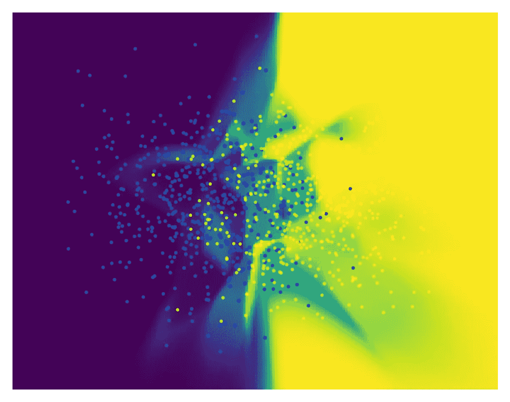
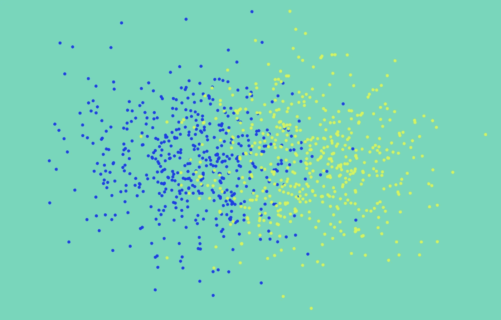
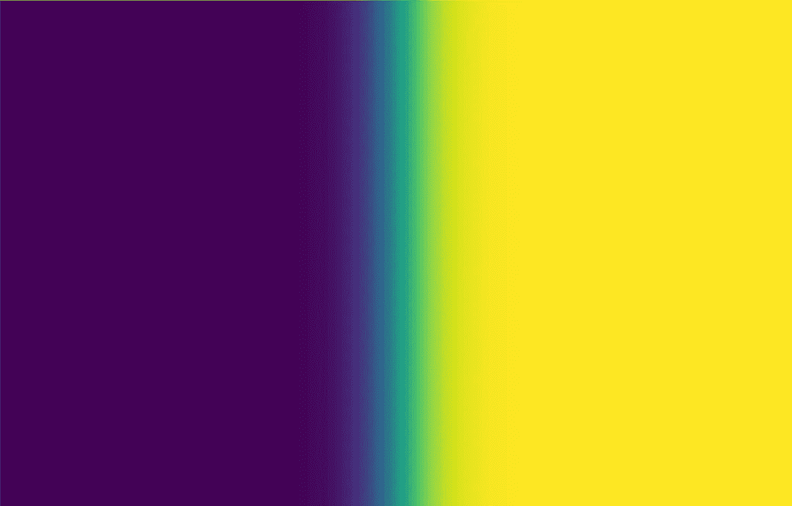
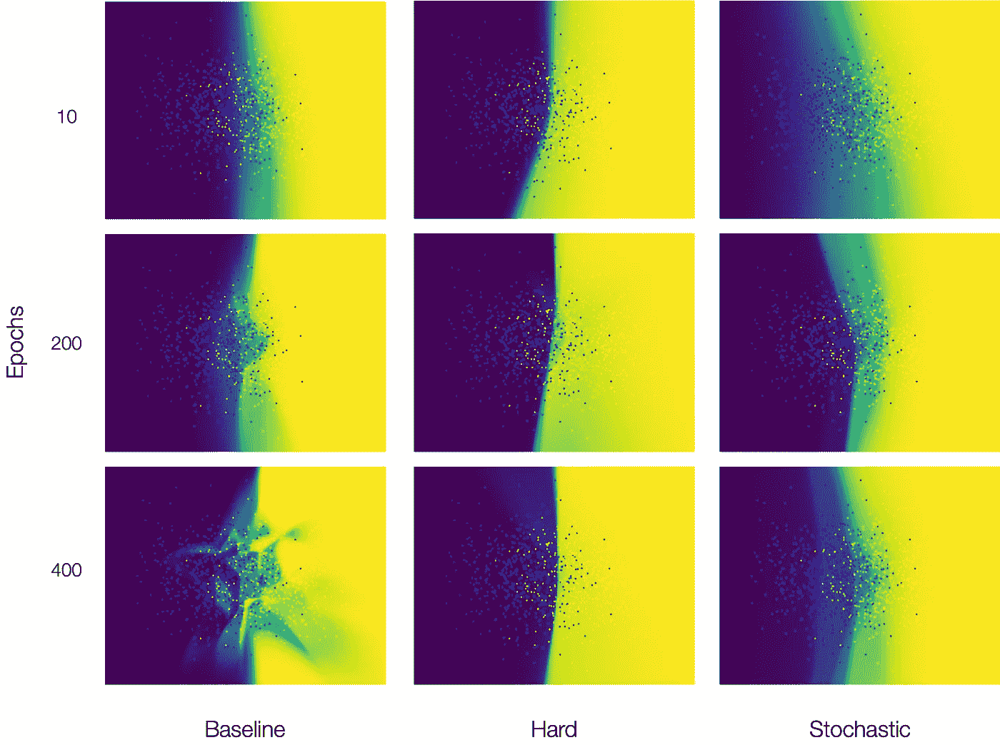

# n-学生学习

> 原文：<https://towardsdatascience.com/n-student-learning-fc4e452ad006>

## 有助于对抗过度拟合和模型不确定性的架构。

过拟合决策边界。

过拟合是机器学习领域的一个基本问题，在用噪声数据进行训练的情况下尤为重要。当我们扩展数据集时，由于仔细的人类标记的不可行性，噪声量自然增加。

在下面的文章中，我们将介绍 N-Student Learning 背后的主要思想，这是一种多网络架构，可以应用于任何网络，以减少过度拟合的影响。该设置还允许对网络如何学习对数据中的任何噪声或不确定性建模进行精确控制。

*除特别注明外，所有图片均为作者所有。*

# **问题**

## 过度拟合

**监督分类**的目标是对输入空间和标签空间之间的关系进行建模，通常给定输入-标签对的训练数据集(例如，学习将动物图像分类到正确的类别)。

具体来说，标签是 **one-hot** ，这意味着每个输入的标签都是一个 100%正确的类别，而不是多个类别的概率分布。

n 学生学习解决了**过拟合**的问题，特别是在监督分类领域。过度拟合可以粗略地描述为一种现象，在这种现象中，机器学习模型使用训练数据的异常来学习解决给定的任务，这些训练数据不能推广到看不见的数据。在最坏的情况下，过度拟合意味着以泛化为代价记住训练集的标签，这是对深度神经网络训练的严重关注(其中参数的绝对数量允许它们记住甚至随机的标签)。

非常适合与过度适合的决策界限

在上图中，我们看到了一个过度拟合的例子，使用了从两个类中抽取的 20 个点的小数据集。该数据集中的类被很好地分开，但是包含一些异常值。

虚线是**决策边界**，将模型预测为蓝色的区域与模型预测为红色的区域分开。正如我们所看到的，过拟合决策边界“记忆”了一些异常值，创建了输入空间的一些部分，这些部分将很难推广到新的示例。

过度拟合对网络的损害程度取决于数据的质量。如果我们有一个完美的训练集，那么精确地拟合数据就不是问题了。令人担忧的是，我们训练集中的标签是不完美的——在某种程度上有噪音。

## 两种形式的标签噪声

我想首先区分两种可能会影响具有独热标签的数据集的标签噪声的基本来源:**错误**和**随机性**。

最简单的噪声类型是当标签中有错误时。一个例子是对猫和狗的高分辨率图像进行分类的任务。想象一下，一个人类标签员被用来生成训练集标签，他们有时会意外地选择不正确的标签，从而给数据集带来错误。我指定高分辨率的原因是为了清楚地表明，给定任何图像，它是狗还是猫都是完全明确的，因此标记过程中的任何噪声都可以直接归因于标记过程中的误差。在训练集中记忆这些种类的错误将对模型推广到看不见的数据有明显的负面影响。

由随机性引起的标签噪声是一种更加微妙的标签噪声形式，它发生在问题域本身具有随机性的时候。一个很好的例子是利用图像诊断黑色素瘤的问题。给定一个皮肤镜图像，并不总是能够肯定地说这是否是一个黑色素瘤病例。很多时候，对图像的最佳预测可能是患者有 80%的可能性患有黑色素瘤，因为 20%的时间，同一图像可能实际上显示良性黑色素瘤模仿者。然而，我们没有这些柏拉图式的概率——我们的一次性数据集将皮肤镜图像与特定患者是否被诊断患有黑色素瘤的二元信号配对。最佳的 80%可能性和我们收到的 100%有把握的标签之间的差距产生了这个“随机噪声差距”。当像这样的任务被定义时，我们隐含地希望网络输出对患者被诊断患有黑色素瘤的可能性的准确估计，而不仅仅是最可能的答案。这种类型的随机噪声是网络可能过度适应的另一种形式的噪声。

基于误差的噪声和随机噪声之间的共性是，给定来自输入域的特定示例，生成的标签可能不总是相同的。

在错误的情况下，人类标签员可能在一种情况下正确地标记了猫，但在另一种情况下却意外地选择了狗。

在随机情况下，完全相同类型的皮肤镜图像可能会导致一个患者出现黑色素瘤，但不会导致另一个患者出现。

在没有任何领域知识的情况下，特别是在没有数据集具有何种噪声的先验知识的情况下，我声称这两种形式的噪声是无法区分的。

## gaussians 的乐趣——可视化错误和随机性

让我们通过下面的蓝色和黄色点的玩具数据集来看看这意味着什么。

蓝黄玩具数据集

我们注意到，如果一个点在最左侧，它几乎肯定是蓝色的，如果这个点在最右侧，它几乎肯定是黄色的。然而，当我们接近中间时，正确的类变得更加模糊。

对数据的一个似乎合理的解释是，平面上实际上有两个非常不相交的类，但数据集的标签中存在错误(特别是在两个类变得更加相似的中间区域)。在这种情况下，两个类之间的“最佳”决策边界可能如下所示:

最佳决策边界，假设噪声是由于**误差**造成的。

另一个看似合理的解释是，这些数据基本上是随机的——给定飞机上的一个位置，它可能属于任何一类。在这种情况下，最佳决策边界将在中间具有一种类别梯度。正如您可能已经猜到的，这些点实际上是从两个高斯分布中提取的，因此我们可以通过简单地计算从给定位置的每个高斯分布中提取一个点的概率来生成一个最佳的“软”决策边界。

最佳决策边界，假设噪声是由于**随机性**造成的。

在这两个高斯模型的背景下，我之前的说法是，这两种解释都是合理的，如果不事先知道数据集中存在哪种噪声，我们就无法知道中间重叠的数据点是由标注过程中的错误还是随机性引起的。

*注意:你可能仍然认为仅仅从数据集来看，由于重叠，很明显中间的点是随机的。如果我要生成这些相距更远的高斯分布，使得这些类除了少数异常值之外是完全不相交的，我怀疑随机性质会远不那么明显。*

# **2-学生学习**

## 建筑

简而言之，N 学生学习范式涉及多网络架构的训练，其中每个“**学生网络**”从数据集的不同子集学习。在整个训练过程中，每个学生继续在自己的子集上进行训练，但一些标签被来自其他网络的**伪标签**所取代。

伪标注是使用网络输出为数据生成新标注的过程。现在，让我们假设伪标签是通过取网络分配最高概率的类来生成的。这些被称为“**硬伪标签”**，我们将在后面展示，基于所选择的伪标签方法，我们可以控制学生是学习将数据中的噪声建模为错误还是随机。

让我们继续描述一个简单的**双学生设置**。

1.  将训练数据集分成两半
    —d₁和 D₂
2.  并行训练两个网络
    –n₁和 N₂
3.  通过在各自的数据集上训练每个网络来预热网络
    –n₁在 D₁训练
    –n₂在 D₂训练
4.  在每个时期，在每个网络各自的数据集上训练每个网络，用另一个网络生成的伪标签替换一部分样本。
    —{N₂'s 标签上的 N₁列车开往 d₁}
    —{n₁'s 标签上的 n₂列车开往 D₂}

关键的见解是，每个网络只在自己的数据集上训练，所以它不能过度适应它为其生成伪标签的数据集。网络 1 的数据集 2 的伪标签在 D₂.中应该没有任何依赖于实例的噪声 D₁.的 N₂'s 伪标签也是如此

这种设置的有效性依赖于机器学习算法在过度拟合之前进行概括的想法。通过对没有过度拟合的伪标签进行训练，网络可以收敛到对训练数据中的噪声更鲁棒的解决方案。

正如您可能想象的那样，有许多方法可以将这种 2 学生设置推广到更多学生和不同的数据集分割，但我们不会在这里深入讨论。

## 与高斯人相处更有趣——控制不确定性

最后，我们将通过返回到可靠的蓝色和黄色数据集来看到所有这些。为了激励我们对伪标签方法的选择，让我们考虑如何从一个已经泛化但还没有过度拟合的网络的输出中生成伪标签。(我们假设使用交叉熵损失，其鼓励网络的输出分布代表训练数据中的标签分布。)

如果我们对该问题的先验知识告诉我们，真正的标注是一次性标注(数据集中的噪声是由错误引起的)，那么我们会希望网络生成一次性标注，忽略可能来自数据集中的错误的其他类的任何小概率。我们可以通过使用硬伪标签来做到这一点。

如果我们认为问题从根本上来说是随机的，那么我们会想要与网络输出的分布相匹配的伪标签。我们可以通过将网络输出(在类上的分布)作为伪标签，或者通过从网络输出中随机采样来选择一个独热标签来做到这一点。我们分别称这些为“软伪标签”和“**随机伪标签**”。(它们对于无限大的批量大小是等价的，但是随机伪标签在实践中表现得更好。)

现在让我们看看当我们使用硬的和随机的伪标记方法训练两个 2 学生设置时会发生什么。针对时期 10、200 和 400(训练迭代次数)示出了网络的软决策边界，并且正常训练的相同网络将被用作基线(没有 2 学生设置)。

我们看到的是，基线网络过度适应数据集中的噪声，从而创建了一个复杂的决策边界，该边界容纳了其参数所能处理的尽可能多的噪声。

相比之下，硬伪标记网络在中间绘制了一个清晰的决策边界。如果我们假设中间的模糊数据点是噪声的结果，这正是我们想要的。

随机伪标记网络输出分层的决策边界。如果我们的假设是数据不容易出错，并且模糊性来自随机性，那么这个决策边界很好地代表了蓝色和黄色类别的条件概率。

在许多方面，这个数字概括了我的论文工作。给定一个没有领域知识的数据集，就不可能确定标注中的噪声是由标注错误还是随机效应引起的。然而，我们通常对数据集和可能存在的噪声类型有很强的先验知识。通过选择适当的伪标记方法，我们可以精确地控制模型从数据中学习哪种分布。

n-学生学习是我在布兰代斯大学计算机科学本科论文的一部分。

这篇文章是一年多的学习和研究的成果。我的希望是，任何偶然发现这一点的人都能够带着新的见解离开，不管他们之前在机器学习方面有多少经验。

对于那些希望深入研究的人来说，这里有一个到论文本身的链接。

整篇论文深入讨论了这里提出的主题，并证明了 N 学生学习在各种基准噪声标签数据集上的表现优于许多最先进的方法。

如果您对这项工作有任何疑问，或者对如何以更清晰、更易懂的方式解释这些概念有任何建议，请联系我们。