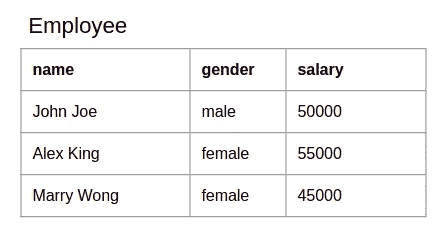
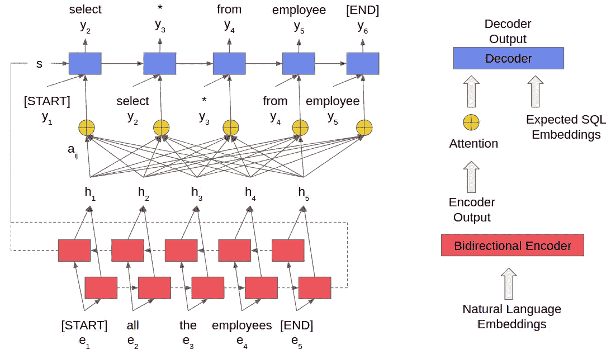
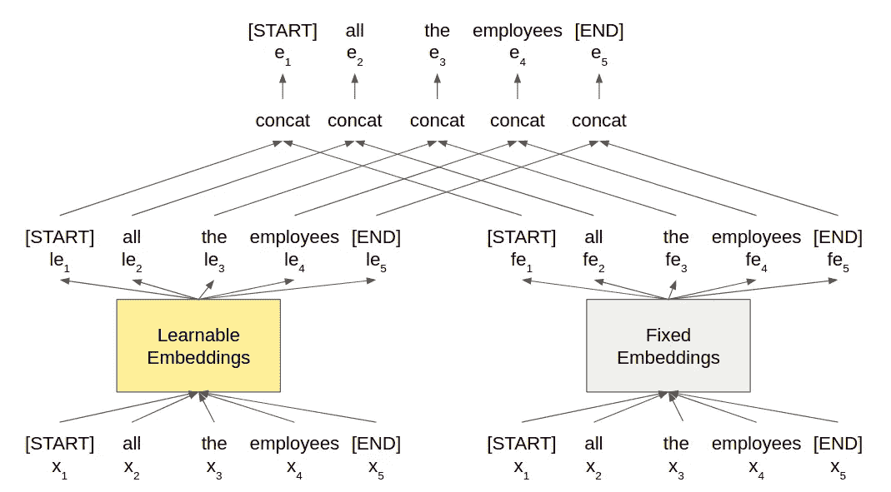
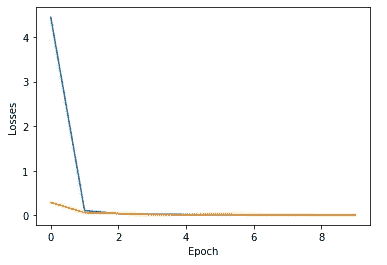
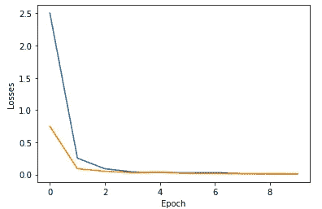

# 使用 Tensorflow 从自然语言到 SQL

> 原文：<https://towardsdatascience.com/natural-language-to-sql-from-scratch-with-tensorflow-adf0d41df0ca>

## 使用 Tensorflow 训练机器学习模型从自然语言问题/指令翻译为 SQL 查询的端到端教程。

> **简介**

在这篇博文中，我们将关注一个有趣的任务:将自然语言翻译成 SQL。对此的学术术语是数据库自然语言接口(NLIDB)。尽管 NLIDB 仍然是一个活跃的研究领域，但是为一个简单的表建立模型实际上非常简单。我们将为一个包含 3 列的雇员表做这件事:姓名、性别和薪水(如图 1 所示)。在这篇博文结束时，您将学习如何从一串自然语言输入(如`show me the names of the employees whose income is higher than 50000`)到 SQL 查询输出`select e.name from employee e where e.salary > 50000`。



图 1:雇员表

> **概述**

在本节中，我们将从较高的层面解释核心思想。

这个任务的核心是一个机器翻译问题。虽然这可能很吸引人，只是扔在一个序列到序列的机器翻译模型，直接从输入的自然语言到输出的 SQL 查询，它在实践中表现不佳。主要原因是模型可能会遇到列值的词汇外(OOV)标记。尽管模型可以在某种程度上容忍其他次要的未知单词，但 OOV 对于列值是致命的。想象一下，在上面的例子中，我们有一个不同的薪水值，它来自训练数据集没有覆盖的简介——60000、70000、80000，你能想到的——总会有一个超出词汇表的薪水数字。name 列也是如此。OOV 令牌将被映射到一个`[UNK]`符号，并被提供给翻译模型。因此，模型无法在 SQL 输出中重建准确的实际列值。

处理这种情况的典型方法是通过一个称为架构链接的过程来运行原始输入，该过程识别并缓存列值，并用模型在训练期间看到的占位符来替换它们。例如，在模式链接之后，简介中的输入示例将变成`show me the names of the employees whose income is higher than [salary_1]`。在训练过程中，模型被赋予类似`select e.name from employee e where e.salary > [salary_1]`的标签输出。因此，该模型实际上正在学习如何从列值替换的自然语言输入转换为列值替换的 SQL 输出。最后一步是通过查找模式链接步骤缓存的相应列值来填充占位符。

现在有了高层次的理解，让我们深入到具体的步骤。

> **数据采集**

我们将从数据采集开始。为了完全控制端到端的过程，也为了让它更有趣，我们将从头开始生成训练数据。这个数据生成步骤的预期结果是一个列值替换的自然语言句子和列值替换的 SQL 查询对的列表。虽然你可以继续手工制作一万个训练对，但这很乏味，而且可能不包括模型在推理过程中会遇到的大量语言变化。

相反，我们只手动创建几十个训练对模板来引导数据生成，然后对可能的列名和条件进行采样来实例化训练对。模板可能如下所示:

```
Show me [cols] of employees whose [cond_cols] order by [comp_cols] in descending order
select [cols] from employee where [cond_cols] order by [comp_cols] desc
```

然后，我们可以对雇员列(姓名、性别、薪水)的组合进行采样，以填充`[cols]`部分，对预定义条件(例如，性别= `[gender_1]`、薪水> `[salary_1]`和薪水< `[salary_2]`)的组合进行采样，以填充`[cond_cols]`，对可比列的组合进行采样(在本例中只有薪水)以填充`[comp_cols]`部分。显然，我们需要预先为自然语言语句和 SQL 查询定义`[cols]`、`[cond_cols]`和`[comp_cols]`的可能内容。这通常被称为指定领域的本体。

通过实例化具体的训练对，我们可以很容易地从几十个训练对增加到几百个训练对。接下来，我们需要扩充训练对，以包含更多的语言变体。我们可以通过用释义替换自然语言句子中的短语来做到这一点。基本上，对于句子中的每一个单词或多个单词的短语，我们通过将其改为释义来创建一个新的句子。SQL 查询保持不变，因为我们关注的是自然语言句子中的语言变化。然后，新句子和原始 SQL 查询对被添加到训练数据集中。我们从释义数据库中获取释义。关于如何使用释义数据库进行自然语言增强的具体代码，请参见这篇[博文](https://betterprogramming.pub/hands-on-augmentation-of-natural-language-dataset-using-paraphrase-database-5f4dfcd23141)。这使得我们可以从数百个训练对增加到数千个训练对，这足以完成这项任务。

> **自然语言到 SQL 模型**

现在我们有了成千上万个替换了列值的自然语言和 SQL 查询对，我们可以构建我们的翻译模型了。我们使用一个序列到序列的模型，注意机制在这篇[的博文](/end-to-end-attention-based-machine-translation-model-with-minimum-tensorflow-code-ae2f08cc8218)中有详细描述。架构的 RNN 部分如图 2 所示。



图 2: RNN 建筑

不过，我们对架构的嵌入部分做了一个改动。来自机器翻译[博客文章](/end-to-end-attention-based-machine-translation-model-with-minimum-tensorflow-code-ae2f08cc8218)的原始翻译模型仅仅从零开始学习输入单词嵌入。在这个模型中，我们仍然要学习输入单词嵌入，但除此之外，我们将加载一个固定的预训练单词嵌入层，并将这两个嵌入层的输出连接起来，以提供给模型的其余部分。参见图 3 中的图解。



图 3:自然语言嵌入架构

基本原理是我们可能没有足够的训练数据来表示自然语言输入的语言变化。所以我们想要一个预先训练好的单词嵌入层。但与此同时，我们希望保持我们自己从零开始训练的嵌入，以捕捉这个特定领域中的细微差别。下面是加载固定的预训练单词嵌入层的代码片段。

加载预先训练的嵌入

一旦我们有了这些，我们将在机器翻译[博客文章](/end-to-end-attention-based-machine-translation-model-with-minimum-tensorflow-code-ae2f08cc8218)中使用类似的代码进行机器翻译。唯一的区别是，如上所述，我们将把固定嵌入层的输出与自然语言嵌入层连接起来，并将其馈送到递归神经网络层(而不仅仅是从自然语言嵌入层获得输出)。完整的模型代码请参见下面的代码片段。关于如何创建模型初始化参数`nl_text_processor`、`sql_text_processor`和训练循环代码，请随意参考机器翻译[博文](/end-to-end-attention-based-machine-translation-model-with-minimum-tensorflow-code-ae2f08cc8218)。

翻译模型代码

我们对模型进行了 10 个时期的训练，并用一些自然语言输入进行了试验:



翻译培训

```
Input: show me the name of the employee whose salary is higher than [salary_1]
Output: select e.name from employee e where e.salary > [salary_1]Input: get me employee with name [name_1]
Output: select * from employee e where e.name like '%[name_1]%'Input: which employee has the highest salary
Output: select * , e.salary from employee e order by e.salary desc limit 1
```

> **模式链接模型**

现在，剩下的唯一任务是链接列值。给目标一个自然语言句子，如`show me the names of the employees whose income is higher than 50000`，模式链接应该输出`show me the names of the employees whose income is higher than [salary_1]`，它可以被翻译模型使用。同时，我们应该记住`[salary_1]`是 50000。当我们从翻译模型`select e.name from employee e where e.salary > [salary_1]`获得 SQL 输出时，我们将写回实际的列值 50000，以创建最终的可执行 SQL 查询`select e.name from employee e where e.salary > 50000`。

有许多方法可以将原始输入链接到模式。有些使用基于规则的语法检测来识别潜在的列值。其他方法扫描不同大小的输入范围，并确定它们与列值的相似程度。相似性可以通过计算 span 的单词嵌入和列的集合嵌入之间的欧几里德距离来测量。可以通过对列值的代表性样本的所有单词嵌入求和来预先计算列的聚合嵌入。

我们将在这里探索一种新的方法。我们将使用相同的机器翻译方法来预测/生成任何给定输入的输出掩码。让我们将预定义的占位符映射到一个整数，其余的非列值映射到零。

```
[name_1]: 1, [salary_1]: 2, [salary_2]: 3, [gender_1]: 4, others: 0
```

然后，让我们通过用随机值替换翻译训练对中的占位符来生成链接训练数据的模式。有关更多详细信息，请参见以下代码片段:

模式链接数据生成

我们有如下链接训练数据对的模式。我们可以将训练数据输入到与之前完全相同的机器翻译模型架构中。

```
All employees with name John Joe and salary 50000 and gender male 0      0       0    0    1   1   0     0     2    0     0     4
```

我们对它进行了 10 个纪元的训练，并尝试了几个输入示例。



图式链接训练

```
# [name_1]: 1, [salary_1]: 2, [salary_2]: 3, [gender_1]: 4, others: 0Input: name of the employee whose salary is higher than 50000
Output: 0    0  0     0       0      0    0    0     0    2Input: get me employee whose name is John Joe
Output: 0   0     0      0     0   0   1   1Input: show me employees whose salary is between 450000 and 650000
Output: 0    0     0       0      0    0    0       2    0     3
```

现在，我们只需要使用输出作为掩码来标记原始输入中的占位符。请注意，对于像 name 这样的多单词值，我们需要将它们折叠成一个占位符。

至此，我们已经完成了从自然语言输入到可执行 SQL 输出所需的所有步骤。

> **推荐论文**

*   用于数据库的端到端神经自然语言接口([链接](https://arxiv.org/abs/1804.00401))。
*   数据库自然语言接口的神经方法:综述。
*   辅助任务([链接](https://arxiv.org/abs/1908.11052))的 Zero-shot Text-to-SQL 学习。
*   一个可迁移学习的数据库自然语言接口([链接](https://arxiv.org/abs/1809.02649))。
*   面向跨域数据库中复杂文本转 SQL 的中间表示([链接](https://arxiv.org/abs/1905.08205))。
*   PPDB:释义数据库([链接](https://aclanthology.org/N13-1092/))。
*   从用户反馈中学习神经语义解析器([链接](https://arxiv.org/abs/1704.08760))。
*   近期数据库自然语言接口的比较调查([链接](https://arxiv.org/abs/1906.08990))。