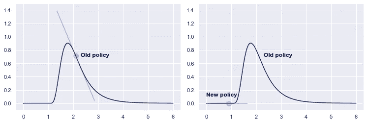
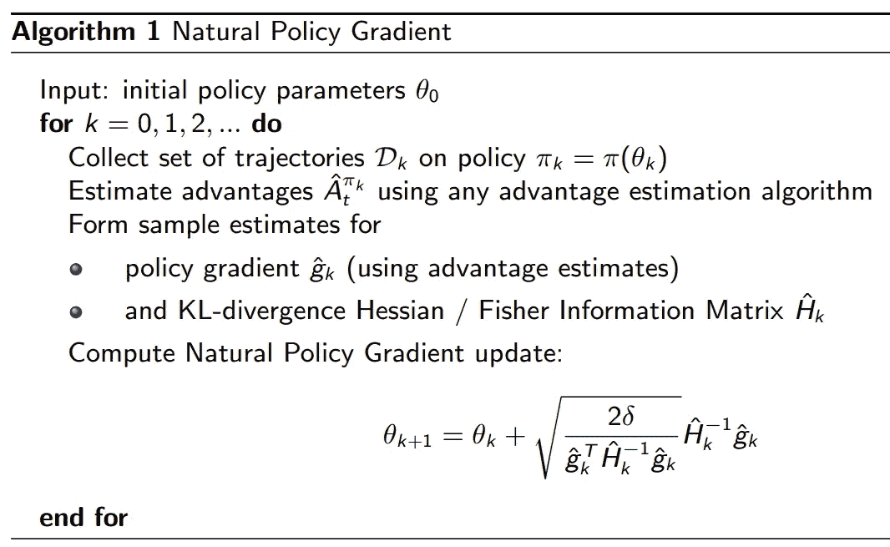

# 解释强化学习中的自然策略梯度

> 原文：<https://towardsdatascience.com/natural-policy-gradients-in-reinforcement-learning-explained-2265864cf43c>

## 传统的政策梯度方法存在固有的缺陷。自然梯度收敛得更快更好，形成了当代强化学习算法的基础。

自然策略梯度在统计流形上推进策略，确保相同黎曼距离的一致更新。[罗伯特·卢克曼在 [Unsplash](https://unsplash.com?utm_source=medium&utm_medium=referral) 上的照片]

策略梯度算法是现代强化学习的基础。其思想是，通过简单地跟随目标函数的梯度(即偏导数的向量)，我们最终会达到最优。这是一个聪明的方法:( I)直接优化政策(而不是学习间接价值函数),( ii)让奖励函数引导搜索。然而，政策梯度有**的根本缺陷**。本文解释了自然渐变的概念，揭示了传统渐变的缺点以及如何弥补它们。

虽然自然梯度的受欢迎程度已经被 [TRPO](/trust-region-policy-optimization-trpo-explained-4b56bd206fc2) 和 [PPO](/proximal-policy-optimization-ppo-explained-abed1952457b) 等算法超越，但掌握它们的基本原理对于理解这些当代 RL 算法至关重要。**自然政策梯度**部署不同的思维方式，仅仅观察损失函数并不总是清晰的。

然而，对自然梯度的完整讨论是相当技术性的，需要许多冗长的推导。为了保持这篇文章的简洁，我主要关注于**推理和直觉**，为更深入的推导提供外部参考。此外，假设对传统(普通)策略梯度和加强算法有扎实的理解。

</policy-gradients-in-reinforcement-learning-explained-ecec7df94245>  

# 一阶政策梯度的问题

在传统的策略梯度方法中，**梯度∇只给出了权重更新**的*方向*。它没有告诉我们在这个方向上要走多远。导数定义在一个无穷小的区间上，这意味着梯度只在局部*有效*，在函数的另一部分可能完全不同。

因此，我们在采样(使用当前策略)和更新(基于采样数据)之间迭代。每个新策略卷展都允许重新计算梯度并更新策略权重θ。

行为由步长α控制。这产生了以下众所周知的策略梯度更新函数:

传统的策略梯度更新函数，基于目标函数梯度∇_θJ(θ和步长α更新策略权重θ

更新过程中可能会出现两个常见问题:

*   **超调**:更新错过了回报高峰，落在了次优政策区域。
*   **下冲**:在梯度方向上采取不必要的小步导致收敛缓慢。

在监督学习问题中，由于数据是固定的，超调并不是*太大的问题。如果我们超过了，我们可以纠正下一个时代。但是，如果 RL 更新导致不良策略，未来的样本批次可能不会提供太多有意义的信息。有点戏剧性:**我们可能永远无法从一次糟糕的更新中恢复过来。非常小的学习率可能会解决这个问题，但会导致收敛缓慢。***

*超调的例子。如果进入梯度方向的步长太大(左)，更新可能会错过奖励峰值，并落在低梯度的次优区域(右)。【作者图片】*

更新后，我们降落在一个平坦的，次优的地区。低梯度仅引起小的权重更新，并且将需要多次迭代才能再次逃逸。

> 这里一个有趣的观察是，当我们应该执行一个谨慎的更新时，我们执行了一个大的更新，反之亦然。正如我们将在后面看到的，自然渐变正好相反。

让我们做一个思维实验。为了进行适当大小的权重更新，我们可能会决定给参数变化设置一个**上限。假设我们在参数空间中定义一个最大距离作为约束。我们可以这样定义这个问题:**

一种权重更新方案，限制了旧参数和更新参数之间的欧几里德距离。

其中| |δθ| |表示更新前后参数之间的欧几里德距离。

这听起来很合理，因为它应该避免超调，同时也没有必要限制更新大小。不幸的是，**它并不像你预期的那样工作**。例如，假设我们的策略是由θ_1=μ和θ_2=σ参数化的高斯控制，并且我们设置了上限ϵ=1.下图中的两个更新都满足约束！

正态分布对的比较。左边有μ_1=0，μ_2=1，σ_1=σ_2=0.3。右边有μ_1=0，μ_2=1，σ_1=σ_2=3.0。虽然两对之间的欧几里德距离是 1，但是很明显右边的一对比左边的一对更相似。[图片由作者提供]

在这两种情况下，欧几里德距离都是 1:sqrt[(1–0)+(0.3–0.3)]和 sqrt[(1–0)+(3–3)]。然而，对分布(即随机策略)的影响是完全不同的。

问题是给参数空间**封顶并不能有效地给我们操作的统计流形**封顶。请注意，政策是概率分布，改变概率会改变预期回报。这是我们优化并想要控制的流形。

> 我喜欢把统计流形想象成分布的“家族”。例如，正态分布的集合族(由μ和σ参数化)构成了一个流形。另一个例子是将神经网络视为输出值的分布。改变随机策略可以被视为在定义目标函数的流形上移动(由参数θ占据)。

参数 cap 仅在统计流形是线性的情况下才起作用，但这种情况很少发生。为了防止策略本身在更新期间改变太多，我们必须考虑**分布对参数变化**有多敏感。传统的策略梯度算法没有考虑这种曲率。要做到这一点，我们需要进入**二阶导数**的领域，这正是自然政策梯度所做的。

# 缩小政策之间的差异

我们发现，感兴趣的是*分布*(即由θ参数化的策略)之间的差异，而不是*参数* θ和θ_old 本身之间的差异。幸运的是，存在多种距离来计算两个概率分布之间的**差。本文将使用文献中最常见的 **KL 散度**。从技术上来说，它不是一种度量(因为它是不对称的)，但可以这样认为(对于小的差异，它是近似对称的):**

策略π和π_old 之间的 Kullback-Leibner 散度(也称为“相对熵”)。它描述了两个概率分布之间的距离。

> 在之前显示的正态分布示例中，KL 散度分别为 0.81661 和 0.023481[[公式通过维基百科](https://en.wikipedia.org/wiki/Kullback%E2%80%93Leibler_divergence#Multivariate_normal_distributions) ]

在这一点上，引入 KL 散度和**费希尔信息矩阵**之间的联系是很好的(后面我们会看到为什么)。费希尔信息矩阵是描述统计流形的*曲率*的黎曼度量，即流形对边缘参数变化的灵敏度。矩阵可以被视为对考虑曲率的距离的校正——想象一下在地球仪上而不是在平坦的地球上测量距离。

如果我们局部地定义 KL 散度*，即δθ= 0，结果证明两者是等价的。在这种情况下，零阶和一阶导数变成 0，可以被删除。二阶导数的**矩阵由 Hessian 矩阵表示，在这种情况下，它相当于 Fisher 信息矩阵:***

**

*局部地，KL 散度等价于 Fisher 矩阵。这一结果有助于实际应用。*

*这个结果对于实际的实现将是至关重要的，但是现在让我们先确定一下。*

> *如果 Fisher 矩阵是一个单位矩阵，那么流形上的距离就是欧氏距离。在这种情况下，传统政策梯度和自然政策梯度是等价的。实际上，这种情况很少见。*

*与之前类似，我们对允许的更新变更设置了一个**约束。然而，这一次，我们将其应用于*策略*的 KL 散度，而不是*参数空间*的欧几里德距离。调整后的问题如下:***

**

*一个权重更新方案，它限制了新旧策略之间的 KL 差异。注意，这个方案考虑的是分布之间的差异，而不是参数。*

*通过求解这个表达式，我们确保在参数空间中执行大的更新，同时确保**策略本身不会改变太多**。然而，计算 KL 散度需要评估所有的状态-动作对，所以我们需要一些简化来处理实际的 RL 问题。*

# *拉格朗日松弛和泰勒展开*

> *对于接下来的部分，可以在卡耐基梅隆的[演讲幻灯片中找到一个精彩而详细的推导(作者 Katerina Fragkiadaki)。为了保持对直觉的关注，我只强调最突出的结果。](https://www.andrew.cmu.edu/course/10-403/slides/S19_lecture13_NaturalPolicyGradients.pdf)*

*我们将找出这个问题的解决方法。首先，我们使用拉格朗日松弛法将散度约束转化为罚函数，得到一个更容易求解的表达式:*

**

*通过执行 Langrangian 松弛，我们得到一个惩罚而不是约束大的政策变化的表达式。这个表达式比较好解。*

*鉴于典型的 RL 问题太大，无法计算所有状态和动作的散度 D_KL，我们必须求助于近似方法。利用**泰勒展开**——根据导数来近似函数——我们可以基于通过部署策略π_θ获得的样本轨迹来逼近 KL 散度。*

*上述拉格朗日松弛的泰勒展开看起来如下(为了便于标记，考虑θ=θ_ old+δθ):*

**

*逼近最佳权重更新方案的泰勒展开。展开取损失的一阶展开和 KL 散度的二阶展开。*

*简而言之，损失项 J(θ)用**一阶泰勒展开**(即梯度 w.r.t. θ)来近似，类似于传统的政策梯度(本质上是局部线性化)。KL 散度用**二阶泰勒展开**来近似。当局部逼近 KL 散度(即δθ= 0)时，零阶和一阶差评估为 0，因此我们可以消除它们。这里感兴趣的是二阶导数。*

> *为什么损失项 J(θ)没有二阶展开？首先，第二项相对于散度来说可以忽略不计。第二，费希尔矩阵是正定的，但是当也混合在损失项的海森中时，这可能不成立。*

*为了使表达式不那么吓人，我们可以(I)用 Fisher 信息矩阵代替二阶 KL 导数，以及(ii)删除所有不依赖于δθ的项。这给我们留下了一个稍微友好的表达:*

**

*权重更新方案的简化泰勒展开，代入费希尔矩阵，并删除不依赖于δθ的项*

*撇开符号紧凑性不谈，为什么要用费希尔矩阵代替二阶导数呢？事实证明等价是非常方便的。海森矩阵是一个|θ|⋅ |θ|矩阵，每个元素都是二阶导数。完整的计算可能相当麻烦。然而，对于费希尔矩阵，我们有一个替代表达式，它是梯度的**外积。无论如何，由于我们已经需要传统策略梯度的这些值，因此计算开销大大减少:***

**

*费希尔信息矩阵可以表示为政策梯度的外积。该表达式在局部等价于 Hessian 矩阵，但在计算上更有效地生成。*

*因此，如果我们能够像我们习惯的那样计算梯度，我们就拥有了执行权重更新所需的所有信息。还要注意，期望意味着我们可以使用样本。*

*需要了解的信息相当多，所以让我们简要回顾一下到目前为止我们已经完成的工作:*

*   *为了防止政策偏离太远，我们对新旧政策之间的 KL 差异进行了限制。*
*   *使用**拉格朗日松弛**，我们将约束转化为惩罚，给我们一个单一的(无约束的)表达式。*
*   *由于我们不能基于样本直接计算 KL 散度，我们使用**泰勒展开**作为权重更新方案的近似。*
*   *对于小的参数变化，使用**费希尔信息矩阵**来近似计算 KL 散度，对此我们有一个现成的表达式。*
*   *整个近似是一个**局部结果**，假设θ=θ_old。因此，整个原理只适用于小的政策变化。*

*现在，让我们看看如何解决这个问题。*

# *求解 KL 约束问题*

*是时候回到拉格朗日松弛法的泰勒展开式了。我们如何求解这个表达式，即找到最优权重更新δθ？*

**

*权重更新方案的简化泰勒展开可以使用拉格朗日方法来解决*

*嗯，我们可以通过**将梯度 w . r . t .δθ设置为零**来找到所需的更新(朗格方法)。求解表达式(现在转换为最小化问题，假设θ=θ_old)得出:*

**

*通过将导数 w . r . t .δθ设置为 0 来求解松弛泰勒展开式*

*该解决方案可以被重新安排以找到权重更新δθ:*

**

*重新安排解决方案允许表达最佳权重更新*

*注意-1/λ是一个常数，可以被吸收到学习速率α中。事实上，α可以通过分析推导出来。从最初的约束，我们知道 KL 散度应该至多是ϵ.对于固定的学习率α，我们不能保证α F(θ)^-1 ∇_θJ(θ)≤ϵ.从代数上来说，我们可以推断出一个动态学习速率α(t11 ),它确保(再次近似地)更新的大小等于ϵ.遵守这一约束会产生以下学习率:*

**

*动态学习速率α确保权重更新的 KL-散度(通过近似)不超过散度阈值ϵ*

*最后，从重新排列中，我们提取 ***自然*策略梯度**，这是针对流形的曲率校正的梯度:*

**

*自然策略梯度 w.r.t .目标函数是标准梯度乘以逆 Fisher 矩阵，说明黎曼空间的曲率*

*这个自然梯度在距离限制内给出了黎曼空间中最陡的下降方向，而不是传统假设的欧几里得空间。注意，与传统的策略梯度相比，**唯一的区别是** **与逆 Fisher 矩阵相乘！**事实上，如果费雪矩阵是一个单位矩阵——实际上很少是——传统的和自然的政策梯度是等价的。*

*最终的权重更新方案如下所示*

**

*自然政策梯度的权重更新方案。动态学习率确保每次更新同等地改变分布。*

*这种方案的强大之处在于，它总是以相同的幅度改变策略，而不管分布的表示。*

*最终结果在两个方面不同于传统的政策梯度:*

*   ***考虑到政策对局部变化的敏感性，梯度由逆向 Fisher 矩阵**进行“修正”。由于矩阵是倒置的，在陡坡处(高灵敏度)更新趋于谨慎，而在平坦表面处(低灵敏度)更新趋于较大。传统的梯度方法(错误地)假设更新之间的欧几里德距离。*
*   ***更新权重/步长α具有适应梯度和局部灵敏度的动态表达式**，确保ϵ量级的策略改变，而不管参数化。在传统方法中，α是一个可能不适合的可调参数，通常设置为某个标准值，如 0.1 或 0.01。*

*尽管背后的机制相当不同，但在表面上，传统政策梯度方法和自然政策梯度方法惊人地相似。*

*自然策略梯度算法的完整概要总结如下。注意，在实践中，我们总是对梯度和 Fisher 矩阵使用样本估计。*

**

*自然政策梯度算法，来自[柏克莱的深度 RL 课程，作者约书亚·阿奇姆](http://rail.eecs.berkeley.edu/deeprlcourse-fa17/f17docs/lecture_13_advanced_pg.pdf)*

# *自然渐变的问题*

*自然梯度克服了传统方法的基本缺陷，考虑了目标函数定义的流形如何随参数更新而变化。具体来说，自然梯度允许逃离高原，谨慎地接近回报高峰。从理论上讲，自然政策梯度**应该比传统政策梯度**收敛得更快更好。*

*在它们最纯粹的形式中，**自然梯度算法通常是不实用的**。这有许多原因。*

*首先，泰勒展开提供了高达二阶的*局部近似*。由于这个原因，估计的 Hessian 可能不是正定的。在实践中，自然梯度法在数字上是脆弱的，并不总是产生稳定的结果。大量的数学推导可能看起来令人信服，但泰勒展开、样本近似和严格的局部有效性(假设θ = θ_old)会极大地影响现实世界的性能。*

*第二，费希尔信息矩阵占据了|θ|⋅|θ|空间。考虑一个有 10 万个参数的神经网络，你可以想象笔记本电脑上的 100 亿个矩阵不会飞。此外，计算矩阵的逆矩阵是 O(N)复杂度的运算，这相当繁琐。因此，对于深度 RL 方法，自然策略梯度通常会超过**内存和计算限制**。*

*最后，我们习惯于与复杂的**一阶随机梯度优化器**——如 ADAM，它也考虑二阶效应——在广泛的问题上提供出色的结果。二阶优化方法(即自然梯度算法)没有利用这些优化器。*

*诸如共轭梯度和克罗内克因子化近似曲率(K-FAC)的方法可以(部分地)解决上述问题。在实践中，诸如信赖域策略优化( **TRPO** )和特别是邻近策略优化( **PPO** )的方法已经在流行度上超过了自然梯度，尽管它们植根于相同的数学基础。*

*</trust-region-policy-optimization-trpo-explained-4b56bd206fc2>  </proximal-policy-optimization-ppo-explained-abed1952457b>  

# 结束语

当对比自然政策梯度和传统政策梯度时，差异看起来相当有限。最后，我们只在我们所熟悉的梯度上增加了一个倒置的费希尔矩阵——考虑了局部敏感性。尽管如此，我们优化的方式是非常不同的，考虑**策略距离而不是参数距离**。通过确保策略在更新权重时不会偏离太远，我们可以执行更稳定和一致的更新。

自然策略梯度伴随着一系列数字挑战**，尤其是在处理大规模优化时(例如，具有大量参数的神经网络)。此外，在理论基础上进行了大量的近似和简化；修行可能更不守规矩。对于现实世界的实现，最近的策略优化现在通常是首选的。**

**尽管如此，对自然梯度的**理解**对于那些希望了解强化学习最新技术的人来说是非常重要的。**

***喜欢这篇文章？你可能也会喜欢以下的 RL 作品:***

**</why-reinforcement-learning-doesnt-need-bellman-s-equation-c9c2e51a0b7>  </a-minimal-working-example-for-continuous-policy-gradients-in-tensorflow-2-0-d3413ec38c6b>  </a-minimal-working-example-for-discrete-policy-gradients-in-tensorflow-2-0-d6a0d6b1a6d7>  

# 进一步阅读

对于自然政策梯度的起源，我建议阅读 Amari (1998 年)和 Kokade (2001 年)的**基础论文**，以及 Martens (2020 年)最近的反思。

*   阿马里，S. I. (1998 年)。[自然梯度在学习中很有效。](https://d1wqtxts1xzle7.cloudfront.net/32944066/Amari_-_Natural_Gradient_works_efficiently_in_learning-with-cover-page-v2.pdf?Expires=1662047457&Signature=KiOeWpPHdAWivpd0vlFhsg4bbZt~AmV1GA5ZL9ZwUMdjDPzzLB7fMeFiaBOQ11wYGgW5MKXX-gGgGgqQms3aHjpGYivUeN~U0xeXBwceDoz6jh4~7i8G--7rdavlU0HVj1sxX1vrQUSk~qVXqbsjKm-wCtwuk9o6jXUfeJql1PGTv65T70akN6rWVPUb3mW7Xw8drbgBfDsUh1AWCrczpSuWUIZG4n~gCzmGzfqb~Jfj3zBy~WbzSLNFUgMoT3FsrI-fq0~gMkmyXKThnd~4gY00k445Y0HKQmHjNq5RO9~OCr9~kx1tTvks6Zd9BBjtUBmHPAywLiQzPHWPEAf0-A__&Key-Pair-Id=APKAJLOHF5GGSLRBV4ZA) *神经计算*， *10* (2)，251–276。
*   Kakade，S. M. (2001 年)。[天然的政策梯度。](https://proceedings.neurips.cc/paper/2001/file/4b86abe48d358ecf194c56c69108433e-Paper.pdf) *神经信息处理系统的进展*、 *14* 。
*   Martens，J. (2020 年)。[对自然梯度法的新见解和新观点。](https://www.jmlr.org/papers/volume21/17-678/17-678.pdf) *《机器学习研究杂志》*， *21* (1)，5776–5851。

就**讲座幻灯片**而言，我发现以下几张特别有帮助。

*   高级政策梯度(CS 285)。加州大学伯克利分校。
*   Achiam，J. (2017 年)。[高级政策梯度方法。加州大学伯克利分校。](http://rail.eecs.berkeley.edu/deeprlcourse-fa17/f17docs/lecture_13_advanced_pg.pdf)
*   自然政策梯度(CMU 10-403)。卡内基梅隆。

最后，以下**帖子**从不同角度提供了很棒的解释。

*   克里斯蒂娅(2018)。自然梯度下降。[ [链接](https://agustinus.kristia.de/techblog/2018/03/14/natural-gradient/)
*   自然渐变。【[链接](https://julien-vitay.net/deeprl/NaturalGradient.html)
*   扬·彼得斯(2010 年)。政策梯度方法。Scholarpedia，5(11):3698。【[链接](http://www.scholarpedia.org/article/Policy_gradient_methods)
*   OpenAI (2018)。信任区域策略优化。[ [链接](https://spinningup.openai.com/en/latest/algorithms/trpo.html#id2)***