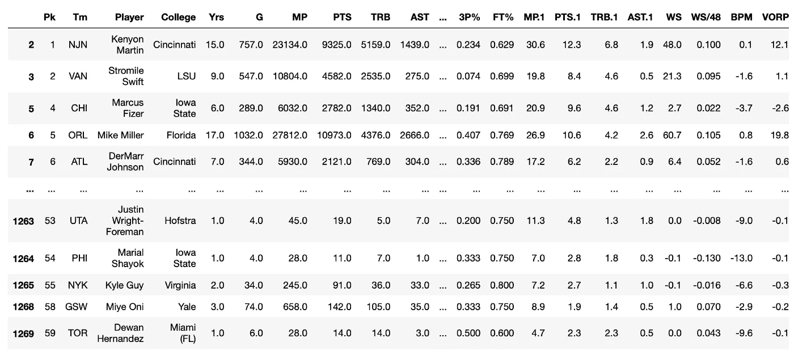
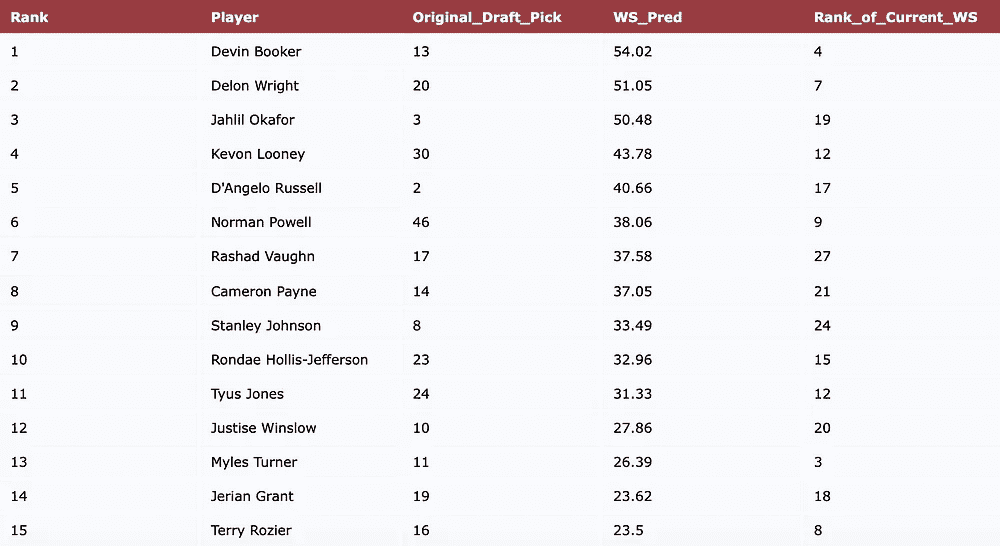
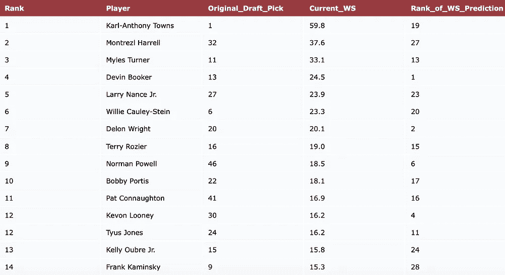
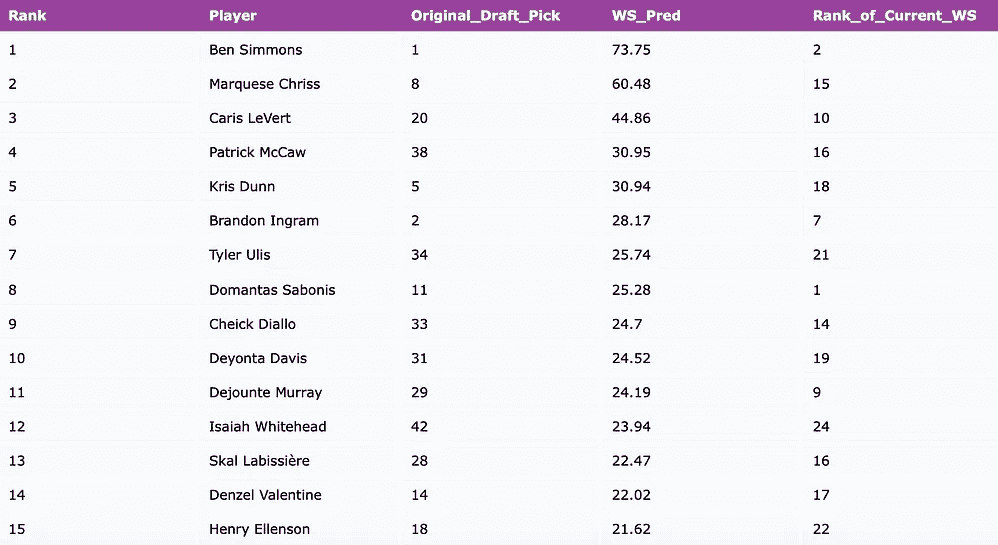
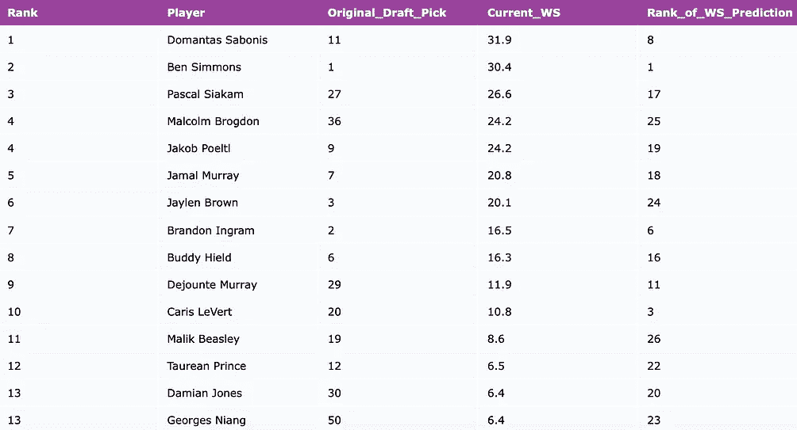
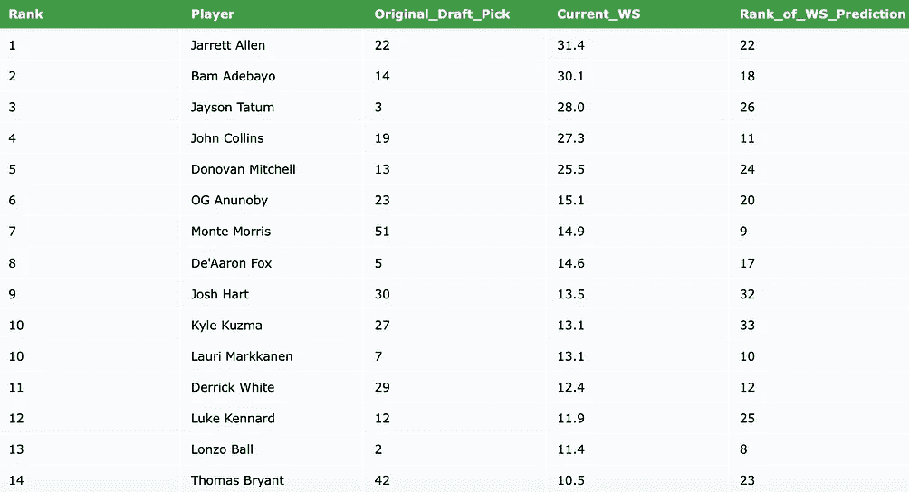
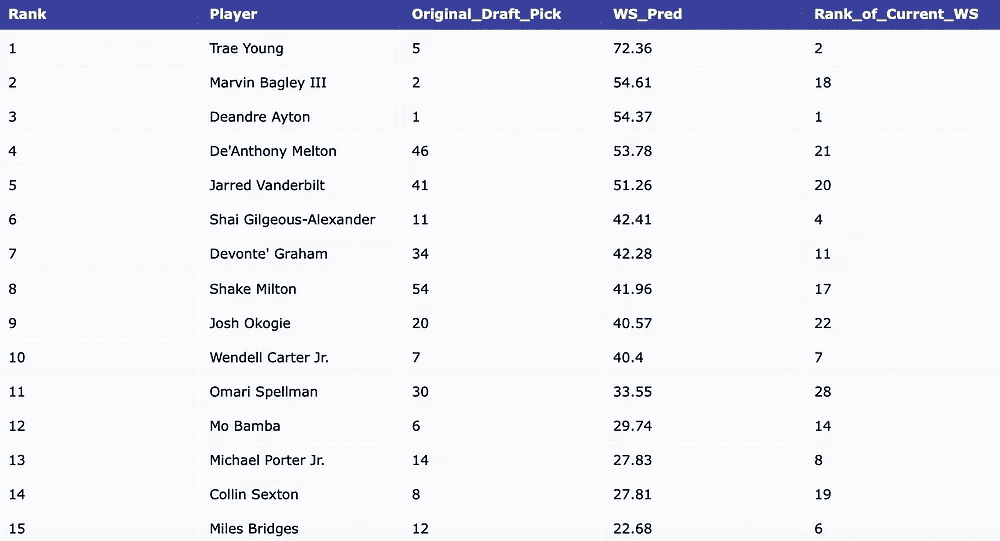
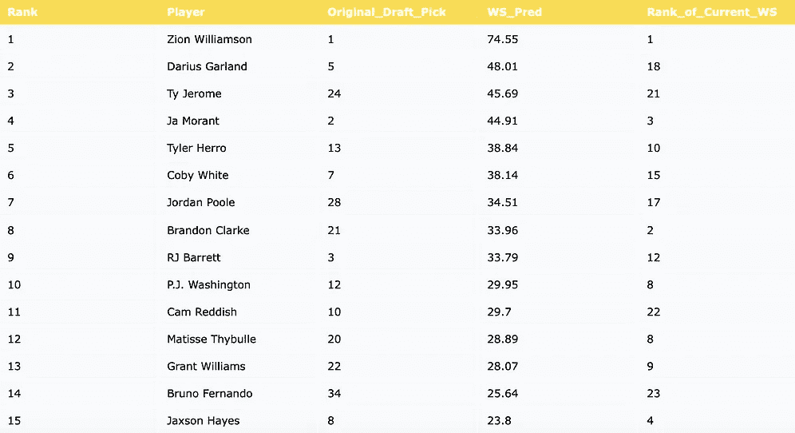
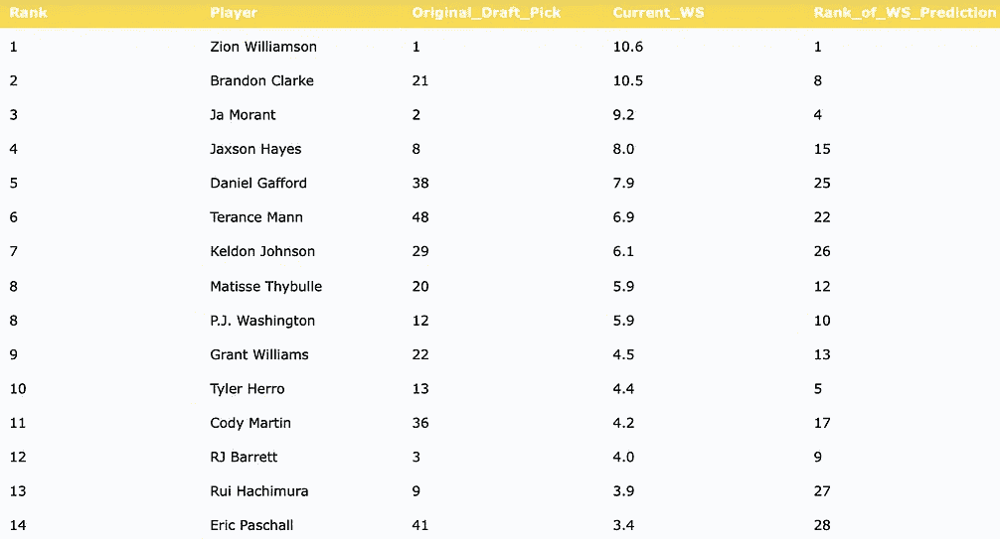

# NBA 选秀分析:使用机器学习预测 NBA 的成功

> 原文：<https://towardsdatascience.com/nba-draft-analysis-using-machine-learning-to-project-nba-success-a1c6bf576d19>

## 利用机器学习预测 NBA 成功的尝试。

埃德加·恰帕罗在 [Unsplash](https://unsplash.com?utm_source=medium&utm_medium=referral) 上拍摄的照片

# 介绍

众所周知，建立一个成功的体育特许经营最关键的部分之一是尽可能获得最有天赋的球员。对于 NBA 球队来说，获得这种天赋最可靠的方法是在 NBA 选秀中进行选择。每年一次，NBA 球队和他们的球迷充满了希望，他们可以带来一个大学明星，他可以将他们的成功转化为职业水平。

然而，在现实中，NBA 选秀是一门非常不精确的科学，经常导致有很高期望的球员无法实现他们的期望。作为一名 NBA 选秀的狂热粉丝，我想确定是否有可能利用一名选秀候选人的大学生涯来帮助评估他们在 NBA 的未来时的决策过程。对我来说，这似乎是数据分析和运动的一个很好的交集，也是一个获得新技能的机会。

我知道我的篮球统计一站式商店将是[篮球参考](https://www.basketball-reference.com/)。在做了一些研究之后，我发现了 Python 的 [BeautifulSoup](https://www.crummy.com/software/BeautifulSoup/bs4/doc/) 库，我知道它能很好地为我工作，能够以有效的方式从 Basketball-Reference 获取数据。

**注**:本文使用的所有代码都可以在 GitHub 上找到，整理在这个[笔记本](https://github.com/shmir234/NBA_Draft_Analysis_ML)中。

# 收集数据

如前所述，我从篮球参考中获得了这个项目的 NBA 数据。我还需要 NCAA 篮球统计数据来进行分析，这些数据是我从[体育参考大学篮球](https://www.sports-reference.com/cbb/)中获得的。为了获得这些数据，我使用了 Python 库 Beautiful Soup，它允许从 HTML 和 XML 文件中提取数据。我的第一步是从过去的 NBA 选秀中获取数据。我最初选择看过去的 20 次 NBA 选秀，主要是因为 NBA 比赛的变化是多么迅速，并希望在当前的 NBA 格局中预测成功。

我得到这个数据的页面就是上面的。本页面的网址为[https://www . basketball-reference . com/draft/NBA _ { draft _ year }。html](https://www.basketball-reference.com/draft/NBA_2019.html) 。为了获得几个 NBA 选秀的数据集，我需要利用一个 for 循环来遍历年份列表，并更新多个 NBA 选秀的 URL。一旦完成，我就可以获得过去 20 次 NBA 选秀中所有球员的数据集以及他们的 NBA 职业统计数据。

我的下一个目标是获得大学统计数据，这些数据将与这些数据中每个适用的球员相关联。在此之前，我选择了查看所有入选球员的比赛分布，因为我想看看典型的 NBA 职业生涯长度是什么样的。

在创建可视化之前，我删除了没有参加过任何 NBA 比赛的球员以及没有上过大学的球员。有很多原因可以解释为什么被选中的球员可能从未在 NBA 打过一分钟，这可能包括海外球员被选中并选择留在海外职业联赛，甚至在一些不幸的情况下严重受伤。

很明显，NBA 比赛的分布是右偏的，这是有道理的，因为有一个不断轮换的有希望的 NBA 球员名单年复一年地进入联盟。NBA 球员只持续 2-3 个赛季的情况比勒布朗·詹姆斯这样职业生涯跨越近 20 年的人要常见得多。为了确保在我即将进行的分析中有一个像样的 NBA 表现基线，我决定删除任何没有在 NBA 打过至少 82 场比赛(相当于一个完整赛季)的球员。

在做了这些更改之后，我按照前面类似的过程来获取数据中剩余球员的大学统计数据。

个人球员学院统计链接如下:[https://www . sports-reference . com/cbb/players/{ player _ first _ name }-{ player _ last _ name }-1 . html](https://www.sports-reference.com/cbb/players/stephen-curry-1.html)。我获得的大学球员的数据集包括 NBA 选秀的职业大学统计数据。

我考虑了 4 个指标来作为回归模型的目标变量，以表明 NBA 职业生涯的成功水平；WS、WS/48、VORP 和 BPM。对其中每一项的快速描述:

# 目标选择

WS — [Basketball Reference](https://www.basketball-reference.com/about/ws.html) 将胜率定义为“试图将团队成功的功劳分配给团队中个人的球员统计数据。”获胜份额的计算包括将进攻和防守获胜份额记入玩家的贷方。这包括计算球员相对于联盟平均水平的边际进攻和防守影响，以制定一个指标，量化球员在整个 NBA 职业生涯中对胜利的影响。

WS/48 —与 Win Shares 相同的计算方法，根据上场时间进行标准化调整。因为赢的份额是用统计数据计算的，他们更喜欢在球场上花更多时间的球员。这一统计数据使得所有球员在上场时间相同的情况下发挥的作用更加公平。

VORP——根据[篮球参考，](https://www.basketball-reference.com/about/glossary.html) VORP 被定义为“一名球员在替补水平(-2.0)以上贡献的每 100 场球队财产的分的盒子得分估计，转化为一支平均球队，并按比例分配给 82 场比赛的赛季。乘以 2.70 以转换为胜于替换。

BPM——再次参考[篮球参考](https://www.basketball-reference.com/about/bpm2.html)，“框加/减，2.0 版(BPM)是一个**基于篮球框得分的指标**，评估一名篮球运动员在球场上对球队的贡献。它只基于传统篮球框得分中的信息，不包括逐场比赛数据或非传统框得分数据(如扣篮或偏转)。”

我决定利用 WS 作为回归模型中目标变量的最终选择。这些指标都不能完美概括一名 NBA 球员在球场上的影响力，但是当我们看一看 NBA 职业领袖获奖份额列表时，我们可以看到这个指标无疑指向了正确的方向。在这个指标中表现最好的是那些名人堂成员和球员，如果他们今天退役的话。

观察 WS 在数据中的分布，我们可以看到它是右偏的。这非常有意义，因为赢球份额是一个在球员整个职业生涯中累积的统计数据。

在决定了我的目标变量之后，我继续准备我将使用的数据，以便为机器学习模型清理数据。这包括处理大学统计数据中任何缺失的值，并删除任何不必要的功能。

在回归模型中训练数据之前，我选择执行特征选择，以便确定和过滤哪些大学统计数据将具有 NBA 胜利份额的最强信息增益。完成这个过程后，将作为解释性特征保存在我的模型中的大学统计数据包括:

*   比赛开始次数——球员在整个大学生涯中开始的比赛次数(比赛开始时在球场上)。
*   每场比赛的投篮次数——每场比赛的总投篮次数。
*   每场比赛投中 3 分——每场比赛投中 3 分的次数。
*   三分球命中率——三分球投篮次数除以投篮次数。
*   每场比赛的罚球次数——每场比赛的罚球次数。
*   每场比赛的进攻篮板——队友投篮不中后每场比赛的篮板数。
*   每场防守篮板——在对方球员失误后每场比赛的篮板数。
*   每场比赛的总篮板数——每场比赛进攻篮板和防守篮板的总和
*   场均助攻——每场比赛中队友直接传球投篮的次数。
*   每场比赛的阻挡次数——每场比赛中，球员挡出(或阻挡)对方球员投篮的次数。
*   每场比赛失误次数——每场比赛中球员失去对对方球队的控球权的次数。
*   每场比赛的得分——每场比赛的总得分。

# **训练/测试数据确定**

因为 Win Shares 是一个累积的统计数据，所以我在选择预测模型的训练集时必须非常小心。这些选秀中的许多球员仍然有许多 NBA 比赛要打，特别是那些从 2010 年 NBA 选秀开始的球员，他们的球员可能刚刚进入他们的最佳 NBA 岁月。正因为如此，我选择限制我的模型的训练数据，以包括 2000-2009 年 NBA 选秀的球员，同时对 2015-2019 年 NBA 选秀进行测试。

我对此的推理是，2000-09 年选秀的球员将退出联盟/在这一点上走下坡路，因此他们的胜率将不再迅速增加，这将是最近 NBA 选秀的情况。我利用随机森林回归模型作为预测模型。该模型的预测高于这些 NBA 球员的实际获胜份额，这是意料之中的，因为这些球员仍在职业生涯的前 7 年内，并有望积累更多的获胜份额。为了说明这一点，我选择用一个主观的过程来分析我的模型的结果，而不是严格地看任何准确性指标。

下面，我比较了 NBA 选秀前 15 名球员的预测胜率和前 15 名球员的实际胜率。

# 回归结果

交互式图表(将鼠标悬停在数据点上以查看玩家姓名和价值)

从视觉上，我们可以看到模型对胜利份额的预测与这些 NBA 选秀的当前地位之间的差异。如前所述，这是意料之中的，因为赢球份额是在球员的整个 NBA 职业生涯中累积的。我将不得不等待根据平均绝对误差或平均绝对百分比误差来评估我的模型，直到这些选秀班的球员退出他们的 NBA 职业生涯。

# **2015 NBA 选秀**

我的模型对这个选秀班的预测结果是一个大杂烩。2015 年选秀中的第一名是卡尔-安东尼·唐斯，他肯定会是一个重新起草的共识前三名，他在职业生涯中迄今为止一直带领这个选秀班赢得份额。

但是，在我的模型中，他在预测的 Win 份额中不在前 15 名之内(排名第 19 位),这是一个相当大的差异。Towns 已经超过了我的模型对他职业生涯的预测 30 %,他还有很长的职业生涯要走，这增加了这种差异。

尽管如此，我的模型确实预测了一些球员，他们将被认为超过了他们原来的选秀位置，包括德文·布克，德隆·赖特，凯文·鲁尼，朗德-霍利斯·杰弗逊，诺曼·鲍威尔，泰尔斯·琼斯，迈尔斯·特纳和鲍比·波蒂斯。

特别是德文·布克，他是第 13 顺位，在我的模型中表现非常好，他在上赛季带领菲尼克斯太阳队进入 NBA 总决赛时，在 NBA 中也支持了这一点。如果给 NBA 总经理一个重来的机会，这些球员很可能会比他们最初的选秀之夜更早被选中。

我的模型预测的最大失误应该是贾利尔·奥卡福、斯坦利·约翰逊、特雷·莱尔斯和温斯洛法官，他们在职业生涯中迄今为止都只不过是边缘轮换球员。

体育作家重新起草比较:

 [## 重新起草 2015 年 NBA 选秀班:卡尔-安东尼唐斯，德文布克，克里斯塔普斯·波尔津吉斯

### 回顾 2015 年 NBA 选秀班，巨星球员的匮乏让人大跌眼镜。实际上，这是一个…

fadeawayworld.net](https://fadeawayworld.net/nba/re-drafting-the-2015-nba-draft-class-karl-anthony-towns-devin-booker-kristaps-porzingis) 

# **2016 NBA 选秀**

我的模型有最初的第一选择，本·西蒙斯，有最高的预测胜率，如果他现在不坐在这个 NBA 赛季，他最有可能在他的职业生涯中证明这个预测。

然而，球员的第二名、第四名和第五名将不得不被归类为失误，因为马奎斯·克里斯、帕特里克·麦考和克里斯·邓恩与选秀中的前五名选手相去甚远。与他们在选秀之夜实际被选中的地方相比，像卡里斯·勒维特、多曼塔斯·萨博尼斯和德章泰·穆雷这样的球员在模型中的表现都很好。

其他城市如泰勒·尤利斯、德扬泰·戴维斯、以赛亚·怀特海德、斯卡尔·拉比西埃和亨利·埃伦森都没能进入前 15 名。与我的模型的差异还包括没有杰伦·布朗，贾马尔·穆雷，帕斯卡尔·西亚卡姆在预测的前 15 名 WS 中，因为他们都被证明是 NBA 全明星级别的球员。

体育作家重新起草比较:

 [## 重新起草 2016 年 NBA 选秀

### 由于有多达 11 名未来全明星球员，2016 年 NBA 选秀可能会成为 2010 年代最好的选秀。当一对夫妇…

www.yardbarker.com](https://www.yardbarker.com/nba/articles/redrafting_the_2016_nba_draft/s1__33314207) 

# **2017 NBA 选秀**

我的模型，就像大多数 NBA 球探和前台一样，预测马克尔·富尔茨将是 2017 年 NBA 选秀班的最佳球员。不幸的是，像球探和前台一样，这个模型没有考虑到富尔茨在他仍然年轻的 NBA 职业生涯中一直困扰他的伤病。

从我的模型来看，下四个最高玩家的预测赢股，Tony Bradley、Dennis Smith Jr .、Semi Ojeleye 和 T.J. Leaf，在该选秀类的实际赢股方面远未达到最高。朗佐·鲍尔在预测获胜份额方面排在第 8 位，作为今年在芝加哥公牛队爆发的人，看起来是一个很好的赌注。

对于今年的选秀班来说，有几个球员在模型中表现出色，但他们在 NBA 职业生涯中迄今为止一直受到伤病的困扰。除了前面提到的马克尔·富尔茨，这还包括扎克·科林斯和哈里·贾尔斯。最重要的是，我的模型没有识别出这个选秀级别的几个最大的抢断，包括贾勒特·阿伦，巴姆·阿德巴约和多诺万·米切尔。

体育作家重新起草比较:

 [## 重新起草 2017 年 NBA 选秀班

### 2017 年 NBA 重新草案让我们到了一个点，在这个点上，大多数参与的球员仍然，希望，在…

bleacherreport.com](https://bleacherreport.com/articles/2890076-re-drafting-the-2017-nba-draft-class) 

# **2018 NBA 选秀**

对于 2018 年的 NBA 选秀，我的模型预测了许多球员，他们在职业生涯中已经超越了他们的 NBA 选秀，然而这些球员的顺序仍然有很大的争议。

这个球员名单将包括贾里德范德比尔特，德安东尼梅尔顿，动摇米尔顿和德文特格雷厄姆。另一个因伤未能达到预期的球员也在我的模型中表现出色，马文·巴格利三世(Marvin Bagley III)，他是选秀之夜的 2 号选择。或者，像小温德尔·卡特、沙伊·吉尔吉斯·亚历山大、小迈克尔·波特、科林·塞克斯顿、莫·邦巴和迈尔斯·布里奇斯这样的球员在他们的 NBA 职业生涯中仍然很年轻，但没有人会质疑他们应该在这个选秀班的前 15 名中获得一席之地。

体育作家重新起草比较:

 [## NBA 选秀:卢卡·东契奇在 2018 年 NBA 选秀中升至第一

### 在球员参加比赛之前就对他们进行评价是不公平的，尽管我们一直在这样做…

hoopshabit.com](https://hoopshabit.com/2021/08/18/nba-draft-luka-doncic-rises-2018-redraft/) 

# **2019 NBA 选秀**

2019 年的 NBA 选秀仍然非常新鲜，球员在职业生涯胜利份额方面有足够的空间，但我对我的模型的预测相对满意，这些预测基于迄今为止预测胜利份额前 15 名球员的 NBA 表现。锡安·威廉姆森和贾·莫兰特在他们年轻的 NBA 职业生涯的第二个赛季就被评为全明星，而大流士·加兰将在本赛季加入他们。泰勒·赫罗，马蒂斯·蒂布尔，布兰登·克拉克，乔丹·普尔和 P.J .华盛顿都在职业生涯中击败了他们的选秀选择，并期待在未来的许多赛季中证明他们是选秀日抢断。

我的模型预测的失误将不得不包括泰杰罗姆，卡姆雷德和布鲁诺费尔南多，他们迄今为止不会被认为是 NBA 选秀的前 15 名球员。

体育作家重新起草比较:

 [## 2019 NBA 复赛:锡安、Ja 莫兰特和其他班的土地在哪里？

### 是时候决定哪些 NBA 球队获得了 2019 年 NBA 选秀的权利，哪些球队可能希望再次尝试...

bleacherreport.com](https://bleacherreport.com/articles/2931305-2019-nba-re-draft-where-do-zion-ja-morant-and-the-rest-of-the-class-land) 

# 结论

我的分析给我的一个关键收获是，NBA 选秀是一门非常不精确的科学，在预测大学毕业生的 NBA 未来时，需要结合数字分析和传统的球员侦察才能获得最佳的准确性。

虽然我的模型正确地预测了相当多的球员，他们现在会被认为是 NBA 选秀中的“抢断者”(与他们在 NBA 的表现相比，他们在选秀中的表现晚于他们应该被选中的球员)，但如果你跟随我的模型去开球，你也会以一些选秀“失败者”(被过早选中的球员)告终，并错过了在现实生活中表现比我的模型预测的好得多的球员。

我在这个项目中遇到的一些问题可以在以后的项目中解决，这些问题包括:

*   为模型提供更多的训练数据——我可以包括 2000 年以前 NBA 选秀的数据，但是，我觉得 NBA 在过去的二十年里变化太大了。为了获得对当今 NBA 真实的预测，我选择省略一些我认为会混淆模型预测的数据。但是，在这样做的时候，我限制了模型可用的训练数据量。
*   纳入国际球员——将选秀前在海外比赛的球员纳入预测也是有益的，方法是将他们纳入该模型的数据集中，或者创建一个单独的模型。今天，国际球员约占 NBA 的 25%，在选秀预测中错过这些球员就排除了一批有才华的球员，包括卫冕联盟 MVP 尼古拉·约基奇。
*   赢得份额可能不是衡量个人成功的最佳指标。篮球是一项团队运动，因此衡量个人表现并不简单。一些非常有天赋的球员可能会被选入糟糕的情况/球队，在这种情况下，他们将不会获得与他们的天赋水平相当的预期胜利份额。在大多数情况下，这将在球员的整个职业生涯中随着他们在球场上的情况变化而平衡，但仍可能导致模型结果的差异。

总之，我了解到，是的，人们可以利用大学篮球统计数据来预测 NBA 选秀的成功前景。然而，仅仅基于大学表现的预测并不理想，因为有许多无法量化的方面会影响他们的 NBA 职业生涯，如球员无形资产和伤病，这些都无法用大学统计数据来解释。

*更多内容请看*[***plain English . io***](http://plainenglish.io/)*。报名参加我们的* [***免费周报***](http://newsletter.plainenglish.io/) *。在我们的* [***社区***](https://discord.gg/GtDtUAvyhW) *获得独家获得写作机会和建议。*