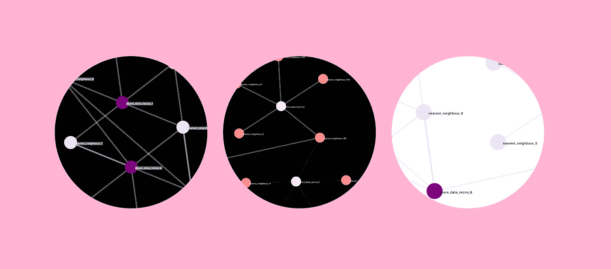
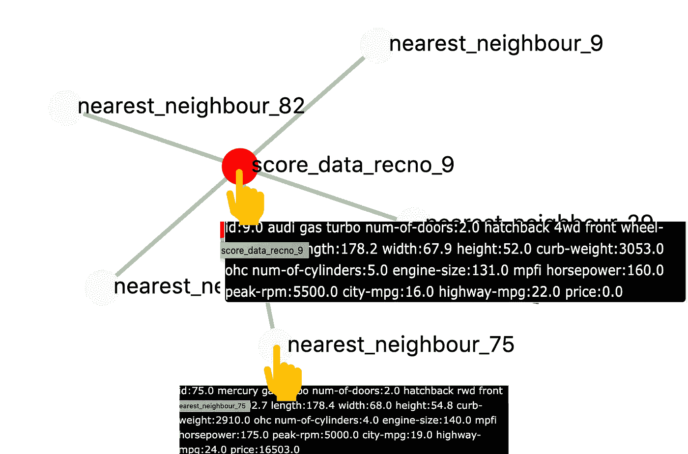
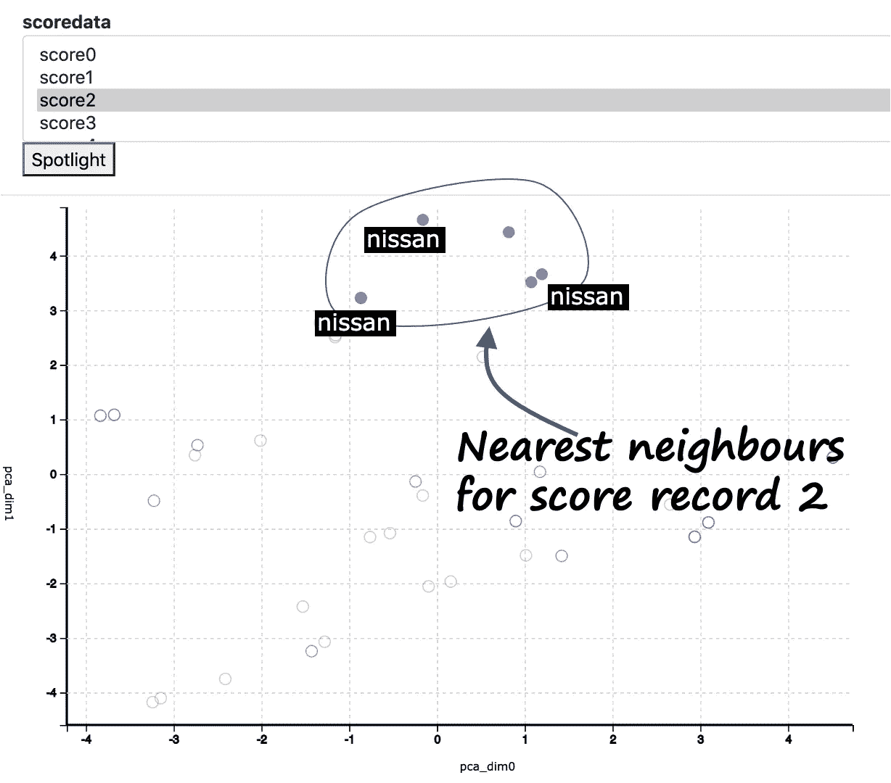
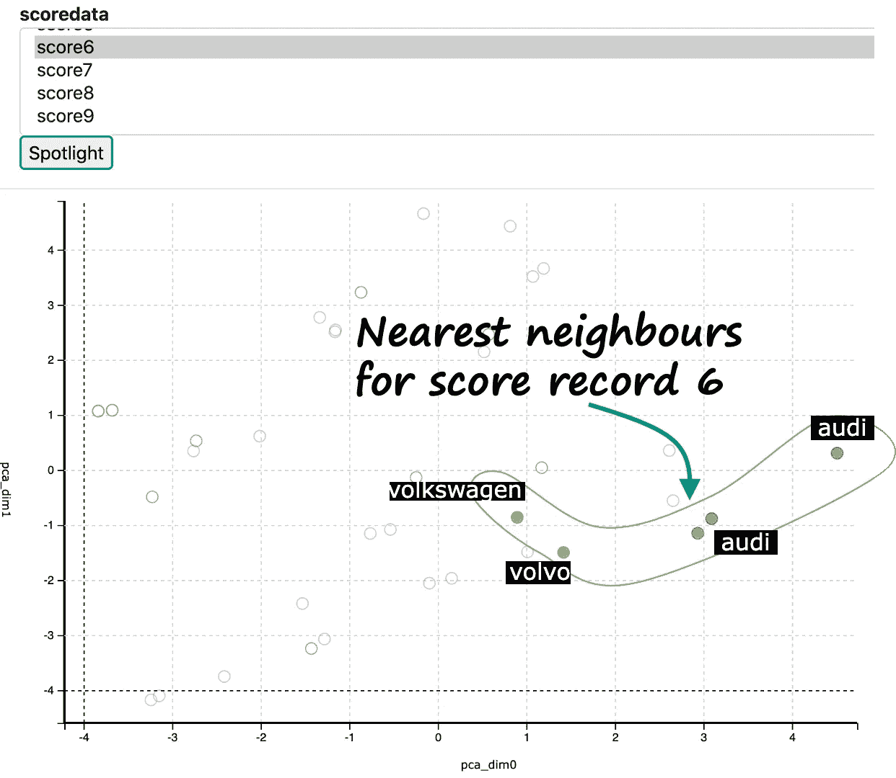

# 最近邻丢失的图像显示

> 原文：<https://towardsdatascience.com/nearest-neighbor-missing-visuals-revealed-63060215c2b3>

## 如何用最先进的视觉效果分析和解释 KNN 结果

KNN 视觉效果(图片由作者提供)

无监督的 K-最近邻(KNN)算法可能是最简单的机器学习算法。然而，简单的算法并不意味着分析结果也同样简单。根据我的研究，并没有很多分析 KNN 算法结果的方法。在本文中，我将向您展示如何分析和理解无监督 KNN 算法的结果。

我将使用汽车数据集。这里显示了一个样本数据集。这些数据包括汽车的构造、不同的技术特征，如燃料类型、长度、宽度、车门数量等。以及汽车的价格。该数据大约有 25 个字段，其中大约有 15 个数值字段。

汽车样本数据(图片由作者提供)。

数据分为两部分——训练和评分。训练数据集用于训练 KNN 模型。然后，使用该模型来寻找评分数据集中数据的最近邻。

这里的图片将有助于理解 KNN 的结果。

# **可视化最近邻居的网络图**

可视化最近邻居的一个优雅方法是使用网络图。评分数据集中的数据是一个中心节点，并与其最近的邻居相关联。

网络图(图片由作者提供)

此外，可以添加悬停工具提示来查看节点背后的细节。这样可以很好地理解分数数据中特定记录的最近邻。

悬停工具提示(作者图片)

# 使用图表分析的力量

由于网络图基于图形分析，您还可以分析邻居之间的连接方式。这有助于找到一个社区的邻居以及孤立的邻居。

最近邻输出的图形分析(图片由作者提供)

将最近邻算法与图形分析相结合是了解整体结果的强大工具。

# 使用 PCA 和聚光灯了解邻居兼容性

在现实生活中，一个人可以有好邻居，也可以有坏邻居！同样，KNN 可以识别最近邻，但是，这并不意味着最近邻总是相似或相容的。

我们可以使用 PCA 和聚光灯技术来验证这种“邻域兼容性”,如下所示。我们对所有训练和评分数据使用 PCA 来将数据减少到二维。降维数据用散点图绘制。然后，我们可以使用聚光灯技术来突出显示评分数据集中特定记录的最近邻。关于聚光灯技术的更多信息，请参见我的文章[这里](https://towardsdatascience.com/spotlighting-a-visual-approach-to-precisely-interpret-the-clustering-f4c56dba39bbhttps://towardsdatascience.com/spotlighting-a-visual-approach-to-precisely-interpret-the-clustering-f4c56dba39bb)

分数记录 2 的最近邻分析(图片由作者提供)

上面显示的是得分记录 2 的所有最近邻。你会观察到所有的点都彼此相对靠近。这意味着最近的邻居彼此相对兼容，因为它们具有或多或少相同的特征。更进一步，检查显示大部分的车都是尼桑，这也证明了我们的观察。

现在让我们对得分记录 6 进行同样的分析，如下所示。

分数记录 6 的最近邻分析(图片由作者提供)

你会发现邻居彼此相距较远。这意味着最近的邻居彼此不太兼容。观察圆点后面的汽车，我们可以看到它是奥迪、沃尔沃和大众旅行车的混合体。因此，即使这些点被归类为最近邻，这些车也是互不相同的。

# 结论

概括起来

*   网络图和图形分析是可视化 KNN 无监督算法结果的绝佳方式
*   使用主成分分析和聚焦技术，可以分析最近邻的兼容性

# 观看演示并亲自尝试

你可以访问我的网站，使 KNN 分析以及其他没有编码的分析:【https://experiencedatascience.com】T2

这是我的 Youtube 频道上的一步一步的教程和演示。您将能够使用零编码根据您的数据定制演示。

Youtube 视频链接(作者图片)

请**订阅**,以便在我发布新故事时随时获得通知。

  

你也可以通过我的推荐链接**加入 Medium** 。谢谢你。

  

## 数据源引用

数据来自[https://archive.ics.uci.edu/ml/datasets/automobile](https://archive.ics.uci.edu/ml/datasets/automobile)。

Dua d .和 Graff c .(2019 年)。UCI 机器学习知识库[http://archive . ics . UCI . edu/ml]。加州欧文:加州大学信息与计算机科学学院。