# 速度需求:优化脸书-预言家拟合方法，运行速度提高 20 倍

> 原文：<https://towardsdatascience.com/need-for-speed-optimizing-facebook-prophet-fit-method-to-run-20x-faster-166cd258f456>

## 简化贝叶斯模型

这是优化 Prophet 内部机制系列文章的第二部分。[第一部分](/how-to-run-facebook-prophet-predict-x100-faster-cce0282ca77d)不是理解这部分的先决条件，但推荐。

自从我发布了第一部，先知套装的[下载量](https://pepy.tech/project/fbprophet)达到了 3000 万。这是最常见的时间序列预测软件包之一。尽管[不是最准确的](https://www.microprediction.com/blog/prophet)算法，但它开箱即用，效果相对较好，但仍允许微调其超参数，并添加额外的回归变量(即，可能与您的目标相关的任何数据，如油价、天气)，这使它成为许多用例的良好基线算法。

但是它的速度仍然是一个问题。在第一部分中，我们看到预测可能需要整整一秒钟，但我们设法将这个时间减少到了 15 毫秒左右。尽管如此，根据变化点的数量和是否使用季节性，拟合一个项目需要 50-100 毫秒。这些运行时将 Prophet 的可扩展性限制在相对较小的数据集，因为每个项目都需要单独进行调整。但它不必如此；就像预测一样 Prophet 的拟合方法可以通过几个技巧进行显著优化。

但在我们继续之前，一个免责声明:在第一部分的结尾，我提供了可以取代预言家的不确定性预测的代码；在这篇文章中，我将展示如何优化拟合，但编写完整的功能代码，包括 Prophet 可以接受的所有参数，需要更多的工作。但是在这个过程中，我们将探索时间序列建模中的新思想，更好地理解幕后的预言家，甚至学习一点贝叶斯统计。

## 先知入门

Prophet 模型是一个加法回归模型，有三个主要部分:

趋势、季节性、节假日(我们可以添加其他回归变量，因为它们的功能是相同的)


先知模型组件(图片由作者提供)

我们将从关注趋势因素开始，随着我们对它的优化，我们将看到添加其他项并不是一个挑战。我们将局限于趋势是线性的情况。

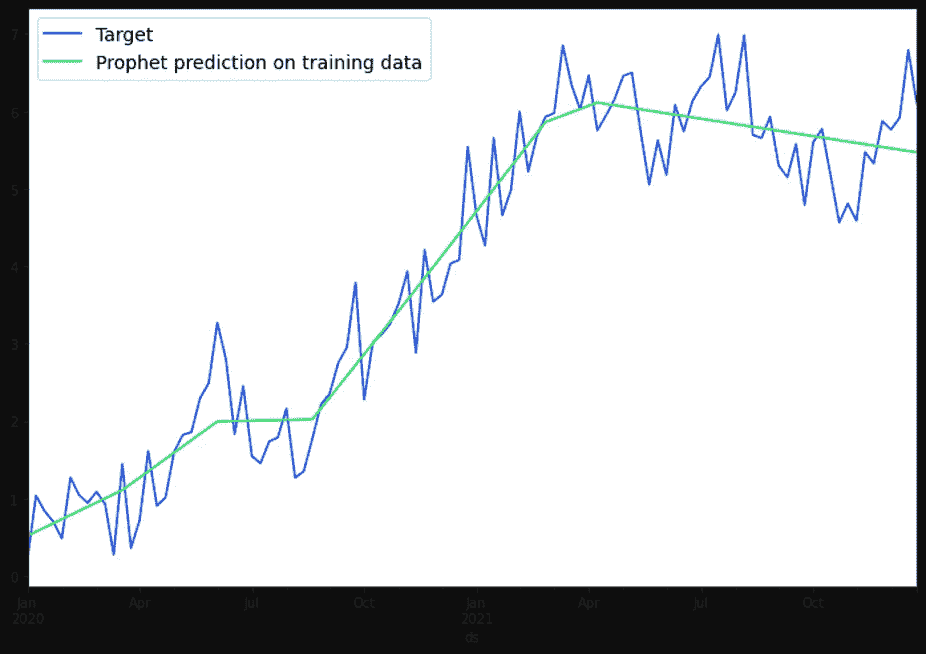

预言家用变点拟合线性趋势(图片由作者提供)

如上所述，Prophet 为数据拟合了线性斜率，但为斜率创建了变点。当预测未来时，仅使用最终斜率，但变点的数量和大小会影响不确定性区间(见[第一部分](/how-to-run-facebook-prophet-predict-x100-faster-cce0282ca77d))。

变点数由用户设置(默认为 25)，并且均匀分布在数据中，不包括最后的 20%。先知没有“找到”变点；它创造了许多变化点，并让拟合过程使用正确的。

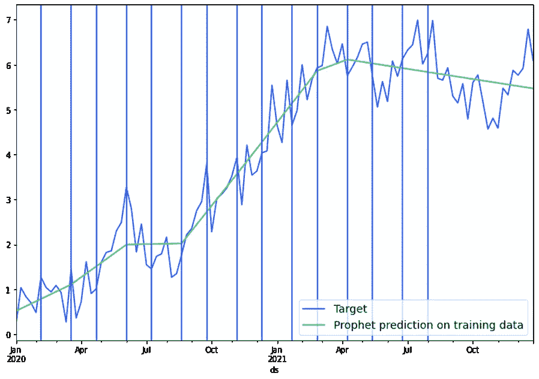

由预言者放置潜在的改变点(图片由作者提供)

在上图中，垂直线代表由 Prophet 创建的变点，但是正如您所看到的，它们中的大多数不会导致斜率发生有意义的变化。Prophet 使用贝叶斯模型来查找数据的最佳参数(截距、当前初始斜率和斜率之间的差值)。由于贝叶斯模型的作用，大多数斜率之间的差值为 0。

## 贝叶斯先验和正则化

无需深究贝叶斯建模的美妙之处，这里有一些基本的东西:当使用贝叶斯方法估计参数时，你必须提供一个“先验”，它代表你在看到数据之前*相信*你的参数会在哪里。贝叶斯模型采用这个先验和数据，并返回“后验”——这些参数值最可能位于何处的更新信念。

对于 Prophet 中的斜率增量，使用的先验是拉普拉斯，如下所示:

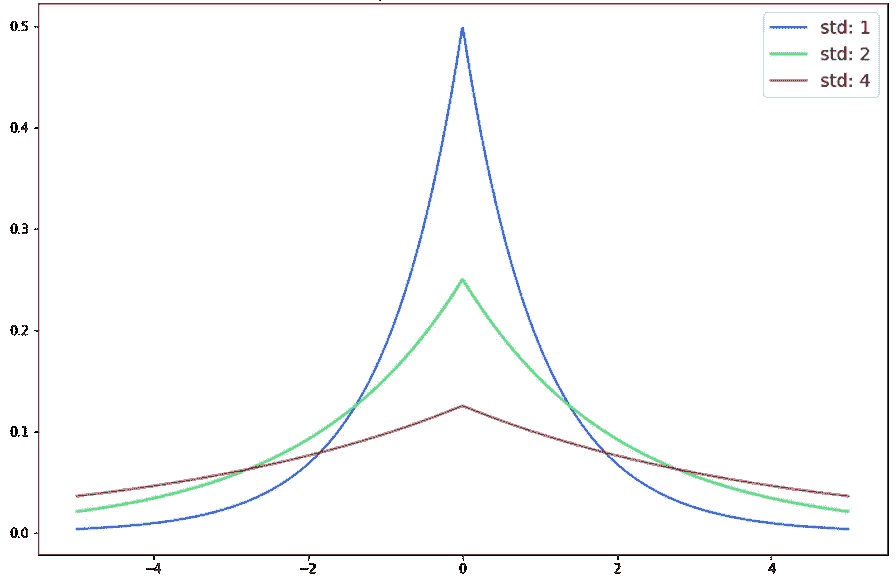

平均值为 0 和不同标准差的拉普拉斯分布(图片由作者提供)

换句话说，Prophet 告诉模型，它应该假设两个连续斜率之间的差值可能在零左右，除非数据高度表明斜率发生变化，否则没有差值。Prophet 创建了许多潜在的变化点，但在拟合它们的参数时，它确保通过使用以零为中心的先验，大多数变化点将被忽略。这个想法就像在损失函数中添加一个正则项——它促使优化器倾向于小值。

修改拉普拉斯的比例会改变其对结果的影响:较小的标准偏差意味着我们确定大多数增量必须接近零，而较大的标准偏差意味着非零值也是可能的，因此模型不会将增量推向零。同样，就像调整线性回归中正则化的强度一样。在 Prophet 中，您可以使用 changepoint_prior_scale 参数调整拉普拉斯先验标准差。如下所示，它可以显著地影响模型实际使用的变点的数量。

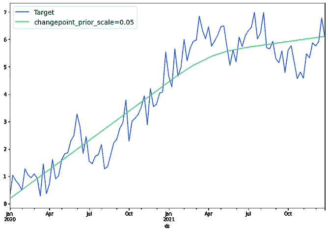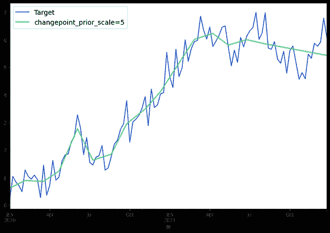

拉普拉斯先验对变点拟合的影响(作者图片)

Prophet 使用 pystan，一个贝叶斯建模库，来寻找最佳增量。但是贝叶斯建模需要非常长的时间来拟合(几十毫秒！).如果我们可以用简单的线性回归来代替它，我们可以在不牺牲性能的情况下减少运行时间，增加算法的可伸缩性。

## 模拟坡度

为了用线性回归模型代替 pystan，我们需要找到一种使用特征来表示斜率和斜率变化的方法。

为了模拟单个斜率，我们可以创建一个线性要素，其值为 1，2，3，4，5，…，n，对应于手头的时间序列，其中 n 是时间序列的长度。如果我们在线性回归中使用这个特性，很容易想象它能完成什么。

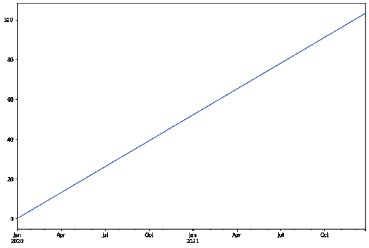

作为线性回归特征的简单线性趋势(图片由作者提供)

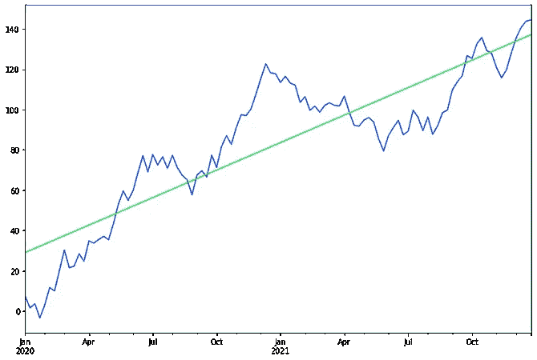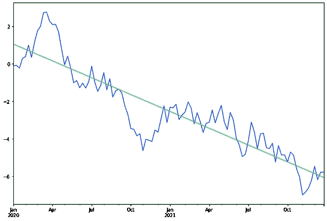

仅使用线性趋势拟合的时间序列(作者图片)

线性回归找到最佳系数——代表这个斜率应该有多陡；回归也可以产生一个负系数的向下斜率。我们可以很容易地将这个特性添加到其他表示季节性和额外回归量的特性中。

但这是一个单一的斜坡。我们能创建一个特征来表示坡度变化吗？这个怎么样:

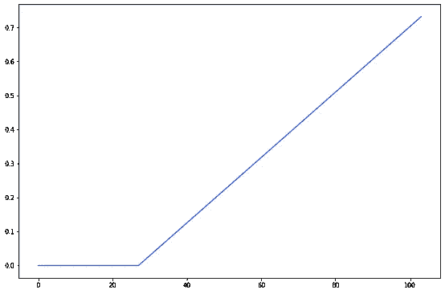

线性趋势变点特征(图片由作者提供)

新的特征值是 0，0，0，0，…，0，1，2，3，4…这可能会让你想起 Relu activation 函数，但这里是作为一个特性，而不是作为一个函数。

其系数表示变点前后斜率之间的差值。加上初始坡度特征，您可以创建此形状:

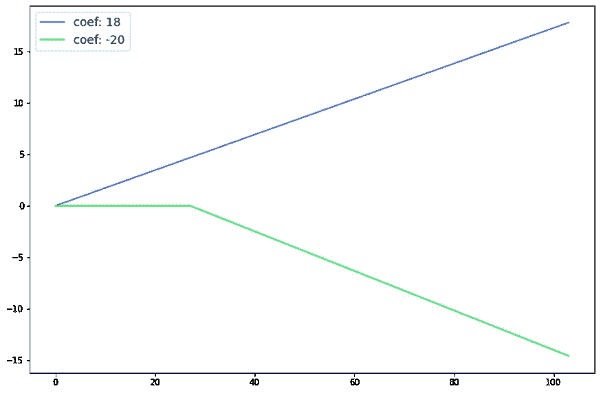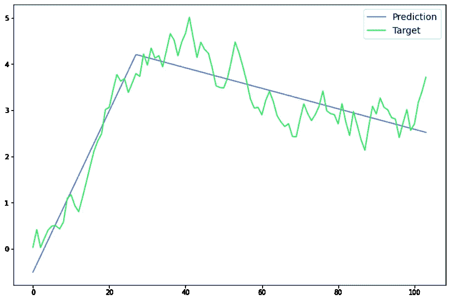

寻找线性趋势和变点特征的系数的线性回归。每个特征乘以其系数(左)。他们的总和(右)。图片作者。

我们可以创建任意数量的这些变点特征，允许回归在每个变点采用新的斜率。

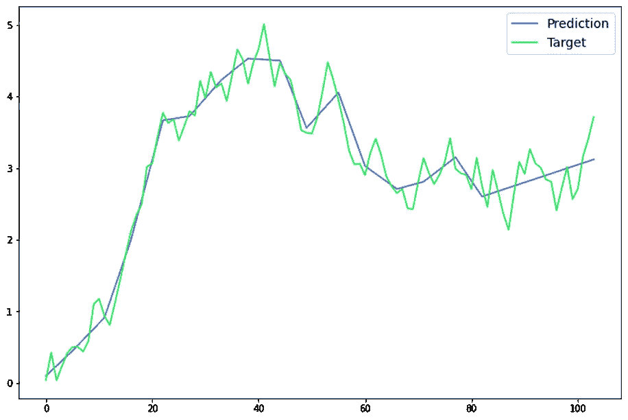

“梳状”特征-固定间隔的变点特征和基于特征的拟合(图片由作者提供)

我们称之为“梳子”特征。我们可以通过训练 Prophet 并使用其训练的增量作为这些特征的系数来确认这些特征表示与 Prophet 相同的增量。

给了我们:


将预言者的 delta 系数与梳状特征一起使用，得到与预言者相同的结果(图片由作者提供)

梳状特征乘以 Prophet 找到的增量，然后相加得到完全相同的预测。我们已经表明，我们可以使用“梳子”将 Prophet 转换成线性模型。

但这不是我们想要的——我们想要自己训练那些 deltas 系数，没有 pystan。我们能使用线性回归模拟拉普拉斯先验吗？

## 没有先知的训练先知

回想一下，之前的要点是将系数推向 0。这可能会让你想起 L1 正则化——惩罚系数的绝对值——这不是没有原因的:可以证明具有拉普拉斯先验的贝叶斯模型的最大后验(MAP)估计等价于具有 L1 正则化的线性回归(也称为 Lasso 回归)。拉普拉斯先验是同一概念的贝叶斯解释。贝叶斯主义者不考虑成本函数，而是考虑先验知识。

因此，我们可以在梳状特征上训练回归，并得到与 Prophet 完全相同的结果。正如我提到的——标准差决定了模型将系数“推向”零的力度，就像 L1 阿尔法一样，但相反:标准差越大意味着正则化程度越低，而阿尔法值越大意味着正则化程度越高(系数越高，则“成本”或“损失”越大)。我们所需要的是将拉普拉斯先验的标准偏差(在 changepoint_prior_scale 中给出)转换成等效的 L1α的公式。


从 b(拉普拉斯标准)到 L1 正则化参数的转换公式(图片由作者提供)

其中 b 是拉普拉斯的标准偏差，sigma 是模型预测误差的标准偏差。

等等，什么？在我们训练一个模型之前，如何使用误差的标准差？我们不能，但我们可以估计一下。让我们假设它是 0.3，用这个转换运行套索:

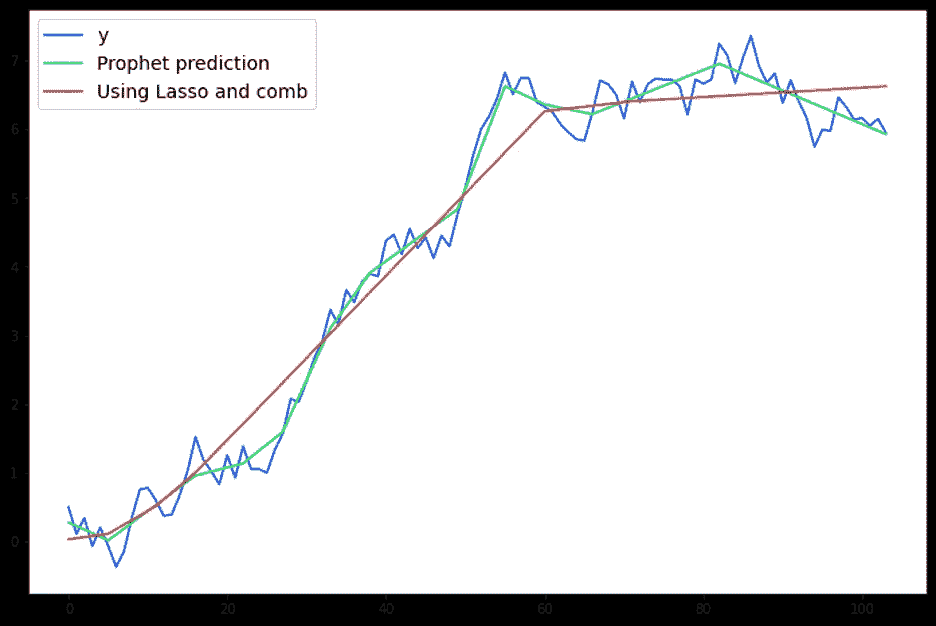

Prophet 和 comb-Lasso 训练与估计 sigma 的比较(图片由作者提供)

不坏，但不完全是；我们的阿尔法不符合拉普拉斯先验，因为我们的西格玛估计是错的。但现在我们有了一个预测，我们可以更好地估计误差，并重新计算正确的阿尔法。我们可以迭代地重复这个过程:创建一个模型，估计误差的标准偏差，并重新计算 alpha。

通过使用 changepoint_prior_scale，我们将得到以下比较结果:

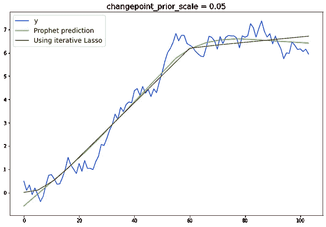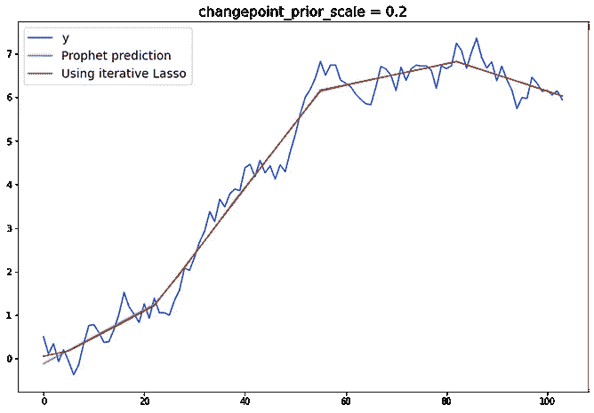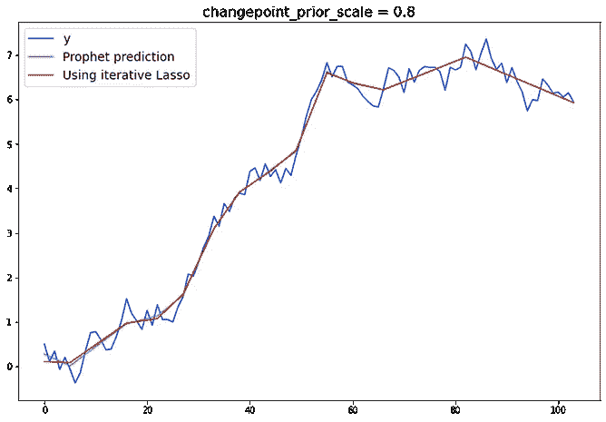

Prophet 和 Lasso 结果的比较，给定 prior_scale 中的更改(图片由作者提供)

正如你所看到的，我们可以创建一个几乎相同的符合先知，使用梳子的特点和这种转换从拉普拉斯标准。您可以对先前的 std 使用不同的值进行实验，并看到 Prophet 和 Lasso 都会相应地更改其正则化并保持相似。但是训练几个套索难道不比训练一个先知慢吗？没有。

```
%%timeit
m = Prophet(n_changepoints=15, changepoint_prior_scale=changepoint_prior_scale, growth='linear', uncertainty_samples=None, yearly_seasonality=False)
m.fit(ds)
```

输出:

```
60.2 ms ± 658 µs per loop
```

Prophet 需要 60 毫秒来拟合时间序列。我们的迭代套索呢？

```
%%timeit
lr = lasso_by_laplace_prior(feat, ds.y / scale, changepoint_prior_scale)
```

输出:

```
11.2 ms ± 239 µs per loop
```

即使 5-10 个套索也比 pystan 的优化器快得多。事实上，如果你分析套索拟合，你会发现每次拟合花费的大部分时间都花在预处理 X 和 y 上(例如归一化它们)。目前，预处理发生在每次迭代中，但它可以放在循环之外，只发生一次，这将减少套索训练时间至少 50%。

如果我们不是特别关心模仿 Prophet，而只是想对时间序列建模，我们可以简单地使用 comb 特性，添加季节性特性和其他回归变量，并设置一个单一的 alpha。毕竟，先验的 alpha 和标准差都是任意值(可以使用交叉验证进行优化)，为什么我们要关心找到精确匹配呢？我想不出任何原因，除了它给了我们一个学习机会，让我们了解预测、正则化和时间序列建模。所以，假设我们想要精确地模仿 Prophet，但是更快，还缺少什么？

## **特定特征正则化**

如果你仔细观察上面的例子，你会注意到，与 Prophet 相比，Lasso 的初始斜率没有那么陡。原因是 Prophet 仅将拉普拉斯先验(或 L1 正则化)置于斜率之间的变化**δ**上，而不是初始斜率上。我们的套索模型调整了所有的特征，包括初始坡度，所以它不能完美地模仿它。

在我们继续之前，我想指出先知的建模在某种意义上有点奇怪。举以下例子:

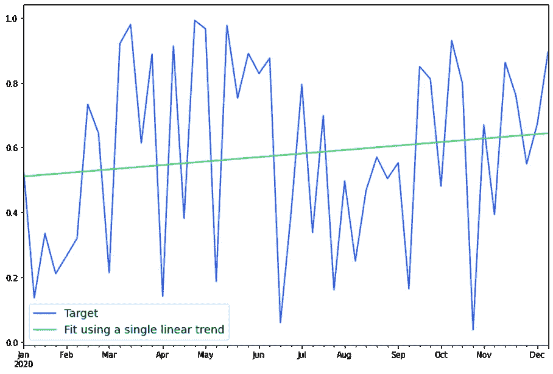

完全随机的数据符合线性趋势(图片由作者提供)

这个时间序列的值是完全随机产生的，但是你可以发现一些斜率完全是由于偶然。但是如果我们想要预测这个随机序列的未来，使用斜率会导致过度拟合，而最好的预测就是这些值的平均值。先相信根本没有斜率是有意义的，只有在斜率非常明显的情况下才相信没有斜率，这不太可能随机发生。

Prophet 实际上在初始斜率上放置了一个先验(在任何贝叶斯模型中，技术上你都必须这样做)——先验是高斯分布，而不是拉普拉斯分布。


std=1 的拉普拉斯和高斯分布(图片由作者提供)

高斯曲线比拉普拉斯曲线更平坦，因此它对零的限制更少，Prophet 用于高斯先验的标准差是 5。由于数据的最大值为 1，初始斜率通常低于 5。换句话说，Prophet 在技术上在初始斜率上放置了一个先验，但它是一个“无信息先验”——它几乎没有限制其系数的值。正如我们刚刚看到的，不调整初始斜率可能会有问题。

但是让我们继续效仿 Prophet:如果 L1 正则化等价于拉普拉斯先验，那么什么等价于高斯先验？你猜对了——你[可以证明](https://bjlkeng.github.io/posts/probabilistic-interpretation-of-regularization/)L2(惩罚平方系数)将产生与高斯先验相同的地图。因此，我们需要对不同的特征使用不同的正则化参数来仿真 Prophet。遗憾的是，sklearn 不允许这样做-相同的正则化值必须应用于所有要素。我们将解决这个问题，但在此之前，让我们谈谈季节性和 Prophet 中的其他组件。

## **季节性和额外回归量**

Prophet 中的季节性是使用正弦波特征建模的。Prophet 自动创建一组不同频率的正弦波来代表每周、每月和每年的季节性。Pystan 找到正弦波的最佳系数，使它们的总和最符合数据。作为傅立叶级数，这些正弦波非常灵活，适合大多数季节性形状。

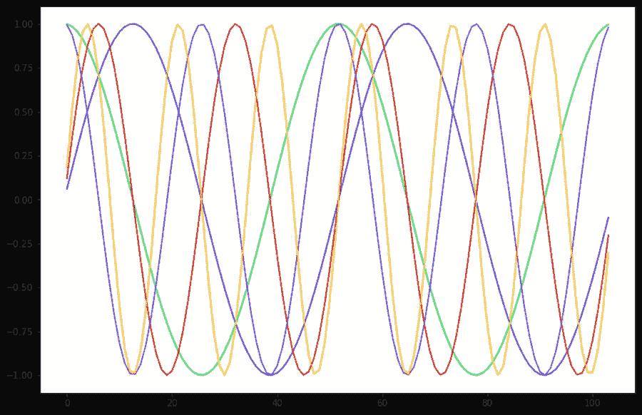

使用正弦波特征训练时间序列(图片由作者提供)

他们的先验/正规化呢？Prophet 对季节性要素使用高斯先验，您可以使用 Prophet 中的 seasonality _ prior _ scale 参数设置其比例。默认的等级是 10，这也意味着——几乎没有规律可言。节假日和额外回归量被视为相同-默认为宽高斯先验。

## 把所有的放在一起

我们基本上完成了，我们所需要的是编写一个带有自定义损失函数的线性回归，该函数可以针对不同的要素采用不同的正则化参数-L2 用于季节性和初始坡度，L1 用于梳状要素。正则化损失为:


成本函数的正则化部分(图片由作者提供)

其中:

*   σ是误差的标准偏差
*   b 是变点先验标度(变点的拉普拉斯先验标准)
*   s 是季节性先验标度(季节性的高斯先验标准差)
*   β_fs 是第一个斜率的系数(线性上升特征)
*   β_cp 是梳状特征的系数
*   β_s 是季节系数

正则化损失被加到平方误差损失上以获得代价函数。

然后，我们使用 Adam 等梯度下降优化器来最小化成本。我们可以将 sigma 估计合并到流程中，而不是像 Lasso 那样迭代运行这个模型:优化器每 k 次迭代重新估计 sigma。

请注意，梳状和季节性正弦特征仅取决于时间序列的长度。这意味着除非添加额外的回归变量，否则该模型中的所有特征都不是特定于目标的。我们可以为整个数据集创建一次 X。

我创建了一个 PyTorch 实现，它可以采用 L1 和 L2 正则化参数或拉普拉斯和高斯先验的标准偏差**每个特征**。因为只优化 20-30 个参数不是 PyTorch 的强项，所以这种实现采用包含多个项目的整个数据集，并同时但单独地估计每个项目的系数，这对于每个项目来说要快得多。用于将该模型的结果与原始预言家的结果进行比较的代码和示例脚本可以在这里找到。

这里有几个适合的例子:

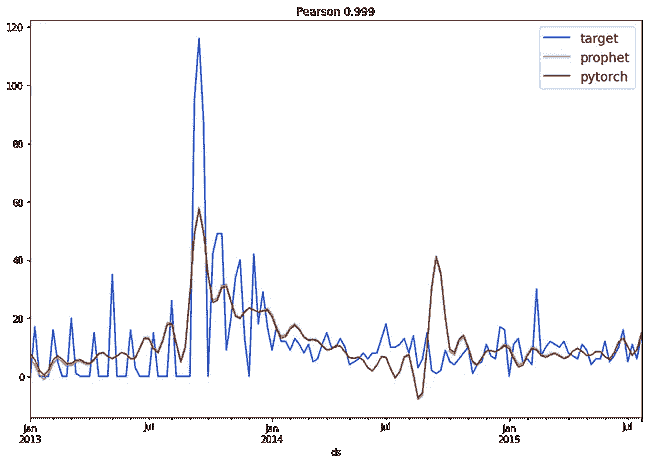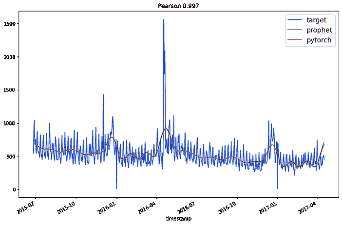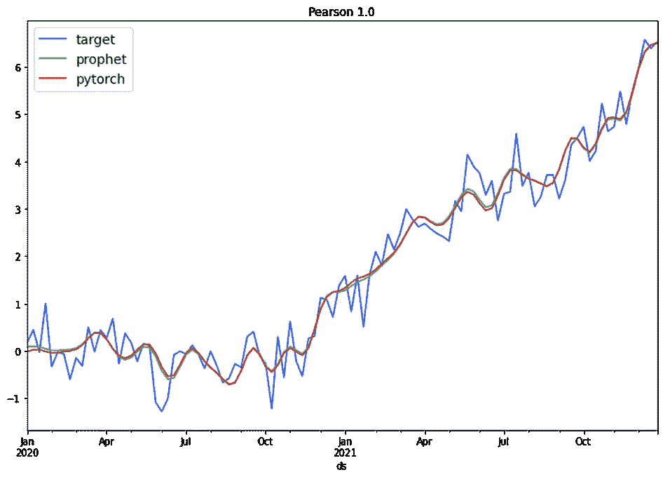

Prophet 预测和 PyTorch 实现的拉普拉斯模拟特定特征正则化的比较(图片由作者提供)

该实现和原始 Prophet 之间的平均 Pearson 相关是 0.995。由于实现中的微小差异(我不会深入讨论，但它们可以通过更多的工作来减少)，以及梯度下降优化器的随机特性，它仍然有点偏离。无论如何，没有理由认为新的实现不太准确。

我们的模型模拟了贝叶斯模型，使用简单的线性回归，每个特征正则化。但是 Prophet 的运行时间大约是每个项目 60 毫秒，PyTorch 实现的运行时间大约是每个项目 3 毫秒。可以做更多的事情来减少运行时间，当损失函数收敛时提前停止，并学习速率调度程序，但这超出了我们的范围。

## **结论和要点**

在本系列的第一部分优化预测代码中，我提供了可以轻松替换 Prophet 原始预测代码的代码。但是对于 fit 来说，情况要复杂得多:一个完整的实现需要能够添加额外的回归量和假日，并自动检测是否使用每周、每月和每年的季节性，这可以从 Prophet 复制过来。产品化之前还需要做更多的工作，但都是技术性的。如果有人经常使用 Prophet 承担这个项目是值得的。

那么，这个练习的目的是什么？

首先，“梳状”特征作为一种创造性的建模斜率变点的方法可以被其他时间序列模型借鉴。

其次，我希望这种解决问题的形式，在研究 Prophet 的具体机制时，贝叶斯回归和正则化的贝叶斯解释是有启发性的，所学到的经验教训可以帮助解决其他问题。

最后，这足以证明我的座右铭:任何模型，*可以*是线性回归*应该*是线性回归。线性回归是优雅的，令人难以置信的快，并且尽可能的容易解释。许多数据科学家经常急于使用更复杂的模型，忽略了线性回归的力量，而线性回归通常也能达到同样的效果。在这种情况下，只需要一点创造性的特性工程就可以将 Prophet 简化为线性回归模型，并显著提高其运行时间。

## 我们将何去何从？

进一步研究的一个领域是斜率变化点的自动检测。一个好的斜率变化检测算法可以同时提高精度和运行时间，而不是创建大量的变点并依靠正则化来避免过度拟合。

在本系列的第一篇文章中，我们发现拟合过程需要 60-100 毫秒，而预测可能需要整整一秒钟；然后，我们将预测减少到大约 10 毫秒。进一步优化预测方法没有多大意义，因为大部分时间都花在了拟合上。

现在 fit 减少到大约 3 毫秒，它再次成为消耗大部分运行时间的预测方法。在本系列的第 3 部分中，我们将回到我们在第 1 部分中开发的矢量化预测方法，看看我们如何在几微秒内实现类似的结果，完成 fit & predict 的 1000 倍运行时改进。