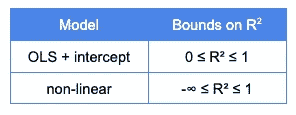
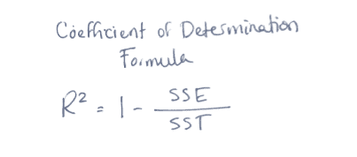
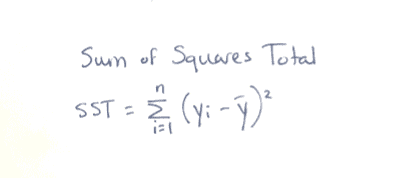
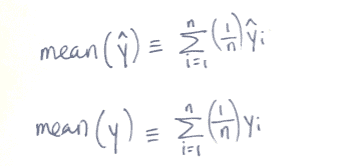
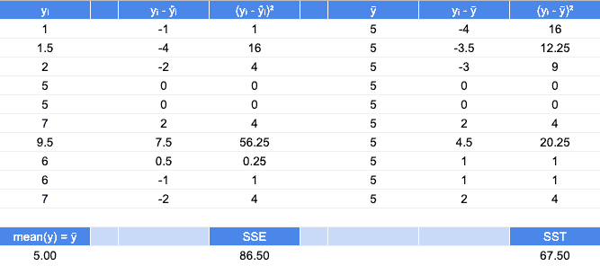

# 否定 R2:你错在哪里？

> 原文：<https://towardsdatascience.com/negative-r2-where-did-you-go-wrong-9d4f2aa84cfb>

## 理论系列

## 统计例子

最近，我进行了一项机器学习任务，并在我的维持测试集上获得了一个负面的 R2 评分指标。

“等等！R2 不是…方形的吗？不是应该在 0 和 1 之间吗？我到底做了什么？”

最初，我非常关心我的机器学习任务的状态。在谷歌搜索了几分钟后，我仍然只是略微担心我的机器学习任务的状态。无论如何，我很好地回顾了负 R2 值意味着什么，以及它是如何意外获得的。这篇文章提供了对统计数字的数学来源的更深入的了解，以帮助阐明这一结果的意义。

接收到负的 R2 值表明模型的预测值比使用平均值作为预测值时表现更差。你自己的谷歌搜索可能会产生类似的陈述。在这里，我用一个数据例子来解释为什么。

按作者分列的数字

# 为什么用 R2？

R2 是决定系数，由投入解释的结果中的变化比例。在预测连续结果的回归任务中，它经常被用作性能指标。

在经典线性回归中，R2 的值介于 0 和 1 之间。这篇文章提供了一个很好的基于证据的解释。然而，简而言之，当包含截距时，该证明适用于普通最小二乘(OLS)建模方法。如果您使用非线性模型(正如我们数据科学社区中的许多人所做的那样)，请将这些约束抛之脑后。现在我们的决定系数范围从负无穷大变为 1。

按作者分类的表格

事实上，对于 R2 是否应该用于非线性模型，有一些合理的争论。这一论点是基于这样一个事实，即 R2 并不是一个常规可靠的模型拟合预测器，这一点由 Spiess & Neumeyer 在 2010 年的一篇期刊论文[中证明。](https://bmcpharma.biomedcentral.com/articles/10.1186/1471-2210-10-6)

顺便说一句，R2 作为 OLS 的拟合优度也不是固有的有用指标，至少在通过评估模型残差确定线性假设有效之前是如此。

在任何情况下，虽然 R2 不应被用作唯一的性能指标，但不可否认的是，R2 可以与其他指标一起用于评估模型性能，如 MAE(平均绝对误差)、MSE(均方误差)、RMSE(均方根误差)或可能的调整 R2。

# 什么是 R2？

在经典回归中，目标是预测结果。这个结果变量的变化可以用 3 个值来表示:SSR、SSE 和 SST。这些是样本中方差的平方和。平方项使我们不必处理负值的复杂情况。SSR、SSE 和 SST 的不同别名变得特别容易混淆，所以请注意我已经尽了最大努力在一个地方编译了一些常见的替代命名约定。接下来，我将只使用下表中左边两列的缩写。

R2 境内的数量(按作者分列)

在 OLS 模型中，SSR + SSE = SST。一直都是。

这些统计数据相关的原因是因为决定系数是 SSE 和 SST 的函数。

按作者分列的数字

使用 n 个观察值的样本，我们可以计算紫色 SSE 值，作为观察值 I 的真实结果(yᵢ)和拟合/预测结果(ŷᵢ)之间的平方差之和

按作者分列的数字

使用 n 个观测值，我们还可以将蓝色 SST 值计算为真实结果(yᵢ)和结果样本平均值(ȳ).)之间的平方差之和

按作者分列的数字

计算出 SSE 和 SST 之后，我们就可以计算出我们想要的指标，R2。

按作者分列的数字

# R2 反面例子

让我们使用一个有 10 个观察值的玩具数据集。每个观察值都有一个模型的拟合/预测估计值，并且每个观察值都有真实的结果，如下表所示。不提供实际型号有两个原因:

a)我编的。

b)该性能指标可以应用于几乎任何模型的拟合值，因此它与为什么 R2 可以取负值的问题无关。

按作者分类的表格

按作者分列的数字

注意拟合值的平均值和真实值的平均值是相同的，5。在中心趋势相同的情况下，也许这个模型是对观察结果的合理预测？

表格中的值绘制如下。假设黑点代表真实的结果值。蓝点代表我们模型结果的预测值(即拟合值)。每个观察值的总变化量可以按上述方法划分。为清晰起见，下图中只显示了一个观察值。总变化(由 SST 解释)分为两个量，由模型拟合(SSR)解释的变化和由拟合值中的误差(SSE)解释的变化。

按作者分列的数字

对于每个指标，SSE 和 SST，都有差异，这些差异的平方显示在相应的列中。该模型的 SSE 误差平方和为 86.5，而 SST 误差平方和为 67.5。

因为 SST < SSE，这表明如果我们放弃我们的模型，只预测平均真实值(5.0)作为每个点的预测统计，该估计将比我们当前的模型产生的拟合值表现得更好。虽然这不是一个理想的结果，但这意味着这种表现不一定是误判的结果。对于具有截距的 OLS 模型，R2 介于 0 和 1 之间的原因是，如果无法获得更好的拟合，其截距将取平均值，其β系数将取值为 0。

作者的玩具数据

从上证综指和 SST 计算 R2 后，我们得到一个四舍五入的 R2 指标-0.28，这确实是负的，因为模型性能低于仅使用样本均值获得的性能。

按作者分列的数字

总之，我们已经解释了决定系数的来源，解释了为什么在某些情况下它可以呈现负值，并且举例说明了如何计算具有负值的玩具数据集。

如果我们回到我的机器学习任务，它提供了之前令人担忧的负面 R2 结果，似乎我只需要稍微担心一下，因为我的模型在技术上确实起作用了……它只是一个糟糕的模型。好吧，祝我下次好运。

如果您对其他性能指标或统计量有任何疑问，请在下面发表评论！

一如既往，继续坚持下去，尽管最近有负面表现模式的失败。

> "失败是走向伟大的另一块垫脚石。"――奥普拉·温弗瑞

凯特·沃尔报道:

</level-up-with-python-quickly-produce-pdfs-with-stunning-visuals-d6750c9c7be2>  </probability-for-data-scientists-the-capable-chi-squared-distribution-abced58fa157> 