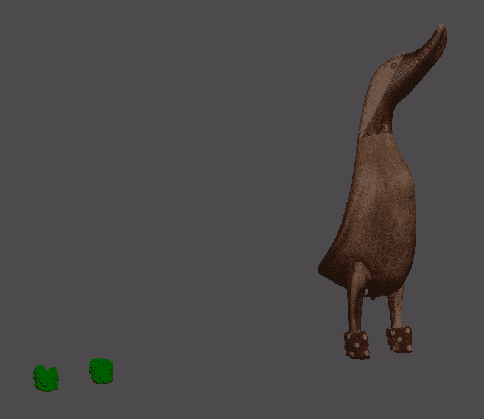
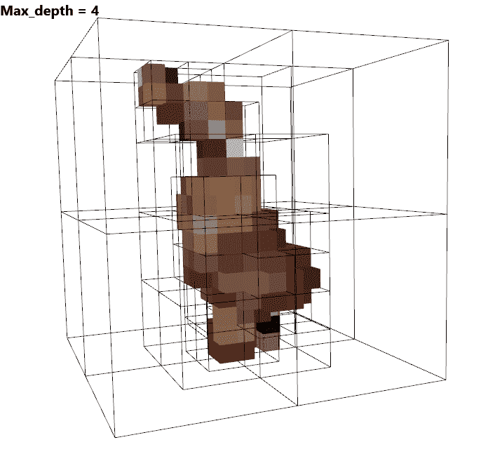
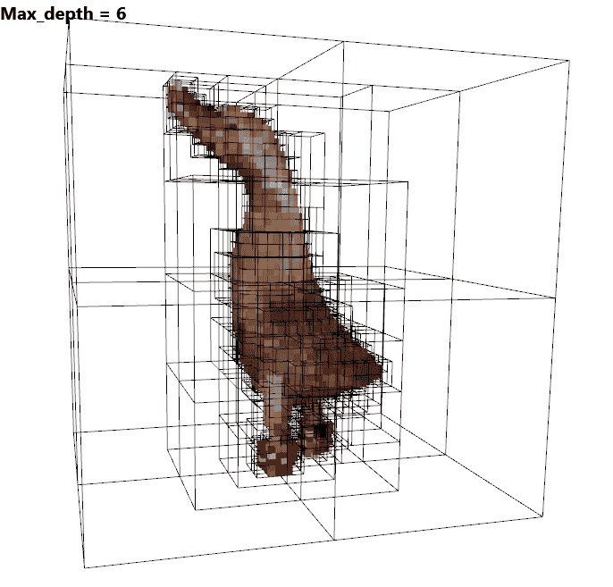
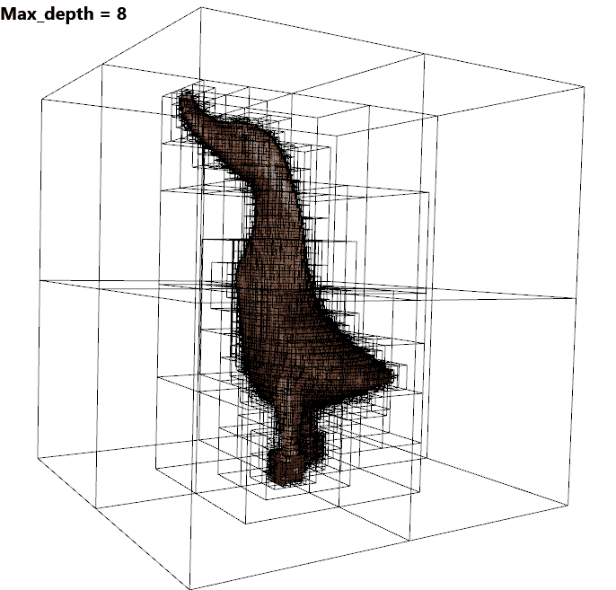
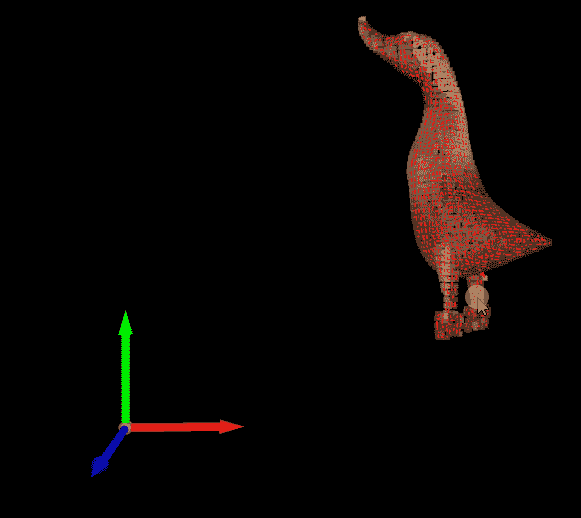
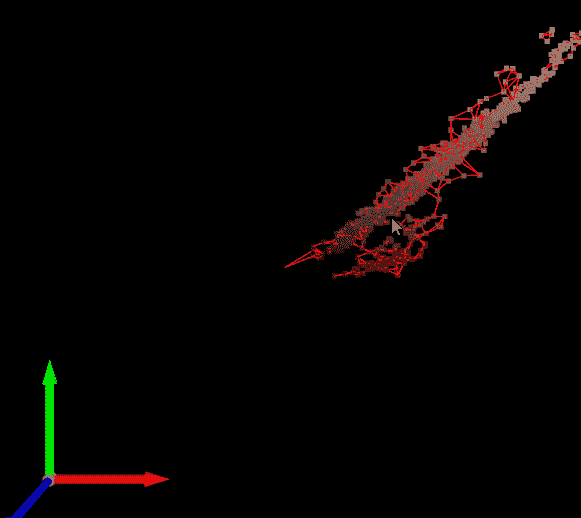
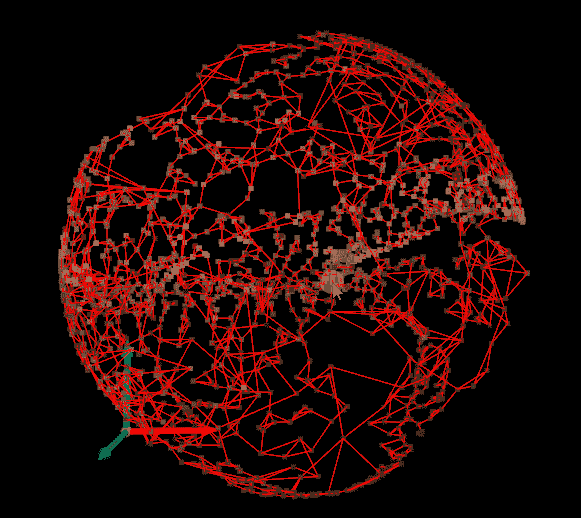
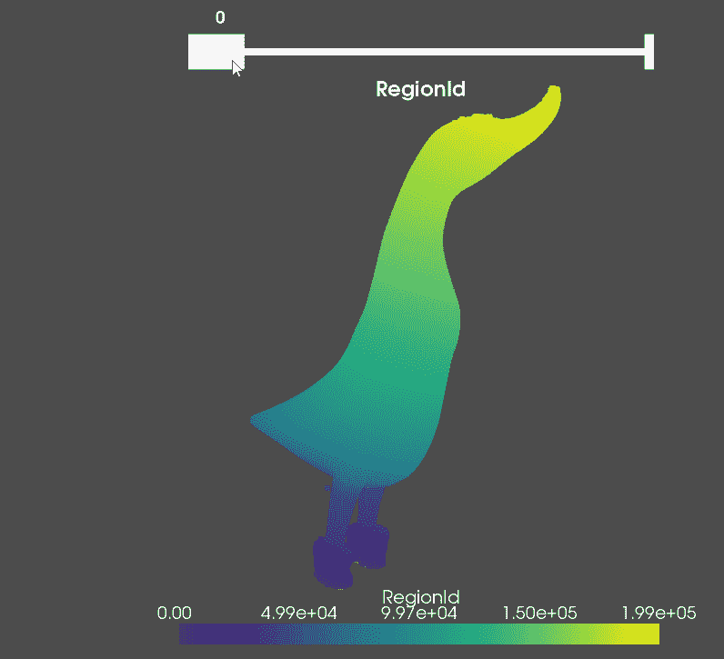
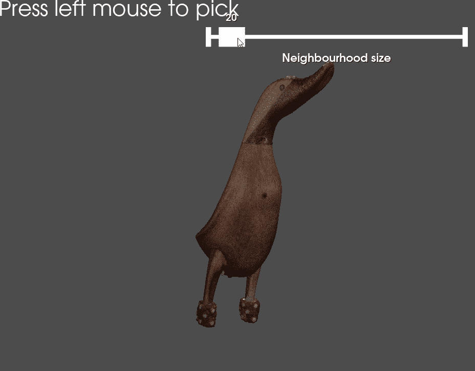
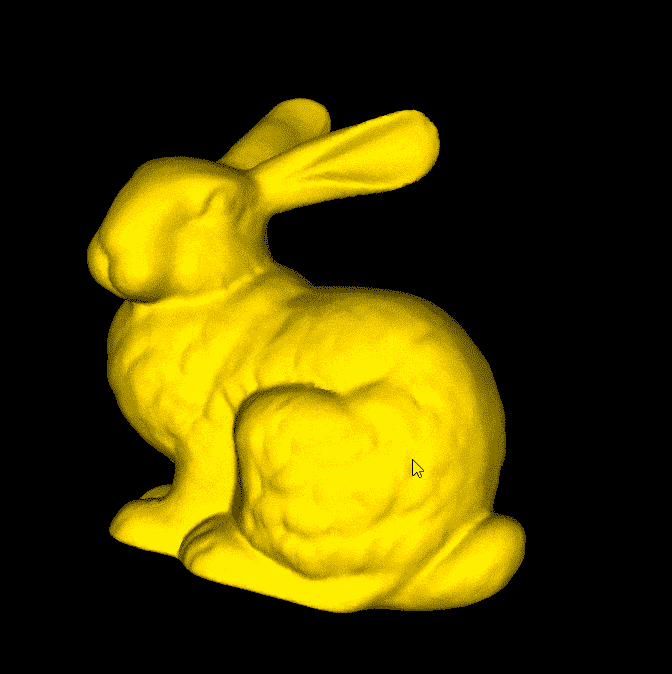

# Python 中网格和点云的邻域分析、KD 树和八叉树

> 原文：<https://towardsdatascience.com/neighborhood-analysis-kd-trees-and-octrees-for-meshes-and-point-clouds-in-python-19fa96527b77>

> 距离计算和邻域分析是理解网格和点云的形状、结构和特征的基本工具。本文将使用三个最广泛使用的 Python 3D 数据分析库— [Open3D](http://www.open3d.org/) 、 [PyVista](https://docs.pyvista.org/) 和 [Vedo](https://vedo.embl.es/) 来提取基于距离的信息，将其可视化，并展示示例用例。一如既往，所有代码，连同使用网格和点云数据提供。谁说 3D 对象的邻域分析应该很难？

邻域操纵示例|图片由作者提供

与深度图或体素相比，点云和网格表示三维空间中的非结构化数据。点由它们的(X，Y，Z)坐标表示，并且在 3D 空间中可能彼此靠近的两个点在数组表示中可能远离。点之间的距离也不相等，这意味着它们中的一些可以紧密地聚集在一起，或者彼此远离。这导致了这样一个事实，即与图像中的相同问题相比，理解某个点的邻域不是一项无足轻重的任务。

点之间的距离计算是点云和网格分析、噪声检测和去除、局部平滑和智能抽取模型等的重要部分。距离计算也是 3D 深度学习模型的一个组成部分，既用于数据预处理，也是训练管道的一部分[7]。此外，经典的点云几何特征依赖于最近点的邻域计算和 PCA 分析[2，8]。

使用 PyVista(左)和 Vedo(右)计算点云中的点和网格中的顶点的邻域的示例|图片由作者提供

特别是对于非常大的点云和复杂的网格，如果以蛮力的方式进行，所有点之间的距离的计算会变得非常资源密集和昂贵。我们将在本文中关注的库使用不同的 [KD 树](https://en.wikipedia.org/wiki/K-d_tree)或[八叉树](https://en.wikipedia.org/wiki/Octree)的实现，将一个对象的 3D 空间划分成更易管理和结构化的象限。这样，这种划分可以一次完成，并且可以加速和简化所有后续的距离查询。由于深入研究 KD 树和八叉树超出了本文的范围，我强烈建议您在深入研究给出的示例之前观看这些 YouTube 视频——多维数据 KD 树、[四叉树和用于表示空间信息的八叉树](https://youtu.be/xFcQaig5Z2A)，尤其是 [K-d 树——计算机爱好者](https://youtu.be/BK5x7IUTIyU)

作者用 Open3D | Image 计算八叉树

在本文中，我们还将简要介绍点云中各点之间的测地线距离的计算。这个距离是连通图结构中两点之间的最短路径，我们计算两点之间存在的边的数量。这些距离可用于捕捉有关 3D 对象的形状和点组成的信息，也可用于处理 3D 表面的图形表示。

在本文中，我们将仔细研究三个 Python 库——[open 3D](http://www.open3d.org/)、 [PyVista](https://docs.pyvista.org/) 和 [Vedo](https://vedo.embl.es/) ，以及它们生成 3D 网格和点云的邻域和邻接分析的能力。选择这三个库是因为它们提供了简单易用的距离计算功能，可以在深度学习和处理管道中轻松实现。这些库也是功能齐全的，并提供了分析和操纵网格和点云的方法。我们还将使用 SciPy 提供的 [KD-tree](https://docs.scipy.org/doc/scipy/reference/generated/scipy.spatial.KDTree.html) 实现，因为它是高度优化和并行化的，这使得它在处理大规模 3D 对象时非常有用。关于这三个库的安装说明以及如何用它们构建交互式可视化的例子，您可以在下面查看我以前关于 python 库的文章。

    

为了演示点云和网格上的体素化，我使用了两个对象。先是**里的一个鸭子雕像点云。ply** 格式，包含每个点的 *X、Y 和 Z* 坐标，以及它们的 *R、G 和 B* 颜色，最后是 *Nx、Ny 和 Nz* 法线。鸭子雕像是使用运动摄影测量学的结构创建的，并且**可以在商业、非商业、公共和私人项目中免费使用**。这个对象是一个更大的数据集[1]的一部分，已经用于噪声检测和检查方法的开发[2]，以及规模计算[3]。二、著名的[斯坦福兔女郎](http://graphics.stanford.edu/data/3Dscanrep/)中的一个**对象。使用 ply** 格式，因为它容易获得，并且在网格分析研究中广泛使用。在引用适当的引文后，兔子可以自由地用于**非商业应用和研究**。

为了跟随教程，除了使用的库和它们的依赖项，您还需要 NumPy 和 SciPy。所有代码都可以在 GitHub 库[这里](https://github.com/IvanNik17/python-3d-analysis-libraries)获得。

# 使用 Open3D 进行邻域计算

作者在 Open3D | Image 中使用 FLANN KD 树可视化计算点云中每个点的 KNN

O [pen3D](http://www.open3d.org/) 被认为是用于 3D 可视化的 Python 库的标准，因为它包含用于点云、网格、深度图以及图形分析和可视化的方法。它可以在 Linux、Mac 和 Windows 上轻松设置和运行，它包含一个专门用于深度学习的完整分支，称为 Open3D-ML，并具有内置的 3D 重建方法。

Open3D 包含直接从点云或体素网格构建八叉树的现成方法。首先使用`open3d.geometry.Octree(max_depth=maximum_depth_of_the_structure)`初始化八叉树，然后使用方法`name_of_octree.convert_from_pointcloud(name_of_point_cloud)`直接从点云中生成八叉树。该方法隐式继承了点云的颜色信息。下面显示了不同深度的八叉树，以及简单的代码。

作者使用 Open3D | Image 生成了不同深度(4，6，8)的八叉树

一旦生成八叉树，就可以使用`traverse`和一个将为每个节点处理的函数对其进行遍历，如果找到所需信息，还可以提前停止。此外，八叉树具有以下功能:

*   定位一个点属于哪个叶节点— `locate_leaf_node()`
*   向特定节点插入新点— `insert_point()`
*   寻找树的根节点— `root_node`

Open3D 还包含使用 FLANN [5]基于 KD-trees 构建的距离计算方法，也可以通过不同的绑定[在这里](https://github.com/flann-lib/flann)找到。首先使用函数`open3d.geometry.KDTreeFlann(name_of_3d_object)`从点云或网格生成 KD 树。然后，该树可以用于搜索许多用例。首先，如果需要一个特定点的 K 个最近邻点，可以调用函数`search_knn_vector_3d`以及要查找的邻点数量。第二，如果需要特定半径内某点周围的邻居，可以调用函数`search_radius_vector_3d`和半径的大小进行搜索。最后，如果我们需要限制也在特定半径内的最近邻居的数量，可以调用函数`search_hybrid_vector_3d`，它结合了前面两个函数的标准。这些函数还有一个更高维度的变体，用于使用例如`search_knn_vector_xd()`来搜索 3 维以上的邻居，其中维度需要手动设置为输入。KD 树本身是一次性预计算的，但是搜索查询是一次对一个点进行的。

为了可视化在点云中寻找点的邻居的过程，我们将使用`LineSet()`结构，它采用几个节点和边，并构建一个图形结构。为此，我们首先将鸭子雕像点云加载为 Open3D 点云，并对其进行二次采样，以便于可视化。我们为此使用了`voxel_down_sample()`内置函数。然后，我们计算缩减采样点云的 KD 树。为了更好地显示距离是如何计算的，我们首先初始化 visualizer 对象，将背景改为黑色，然后只绘制点云。最后，我们使用`register_animation_callback()`注册一个动画回调函数。这个初始设置如下面的代码所示。

一旦初始设置完成，就可以为每个更新周期调用回调函数，并为每个点生成邻域。为点云中的每个点调用函数`search_knn_vector_3d`,需要 k 个最近邻。该函数返回点数、点的索引和点本身。为了生成线段，采用找到的相邻点，以及从中心点到每个相邻点的边数组。因为我们知道只有 k 个找到的邻居，所以我们生成边缘数组作为每个的中心和边缘索引的相同堆栈。创建的线集被添加到主线集对象，并且几何图形和渲染器被更新。一旦遍历了所有点，就通过调用`clear()`来重置线集。回调函数的代码如下所示。

既然我们已经看到了如何使用 Open3D 中的内置函数计算 KD-trees，我们将扩展这个概念。我们看了如何使用 3D 点的坐标之间的距离，但是我们也可以在其他空间上工作。鸭子雕像带有点云中每个点的计算法线和颜色。我们可以使用这些特征以同样的方式构建 KD 树，并探索这些特征空间中的点之间的关系。除了为这些特性构建 KD 树之外，我们将使用 SciPy 中预先构建的函数，只是为了探索生成数据的替代方法。构建 KD 树是通过 SciPy 的`spatial`部分完成的。要构建它们，我们可以调用`scipy.spatial.KDTree(chosen_metric)`。一旦我们有了树结构，那么我们就可以调用`name_of_tree.query(array_points_to_query, k = number_of_neighbours)`。这与 Open3D 实现不同，在 open 3d 实现中，我们可以一次查询一个点的最近点。当然，这意味着通过 SciPy 实现，我们可以使用高度优化的函数来预先计算所有距离，这对加快后面的计算很有用。查询函数的输出是两个数组—最近点距离和每个查询点的最近点索引，格式为 *N x k* ，其中 N 是查询点的数量，k 是相邻点的数量。

所有其他功能与上一个示例相同，但为了更清晰地展示，我们将这些步骤分成一个功能:

*   我们向下采样点云

*   我们计算 KD 树和点之间的边

*   我们构建一个线集并输出点云进行可视化，最后，创建一个 visualizer 对象并显示所有内容。

最后，我们可以选择计算邻域并可视化不同的特征空间。这些示例如下所示，显示了坐标、法线和颜色空间中可视化的坐标、法线和颜色的邻域。

使用作者的 Open3D 和 SciPy | Image 计算和可视化不同特征空间(坐标空间(左)、颜色空间(中)和法向空间(右))的 k-最近邻

# 使用 PyVista 进行邻域计算

Py vista 是一个全功能的库，用于点云、网格和数据集的分析、操作和可视化。它建立在 VTK 之上，提供简单的开箱即用的功能。PyVista 可用于创建具有多个情节、屏幕、小部件和动画的交互式应用程序。它可以用来生成三维表面，分析网格结构，消除噪声和转换数据。

PyVista 包含许多现成的函数，用于对点和顶点进行分组、计算邻域以及查找最近的点。PyVista 中最简单的功能之一是使用 VTK 的[连通性过滤器](https://vtk.org/doc/nightly/html/classvtkConnectivityFilter.html#details)对点进行分组，并根据距离和连通性标准(如共享顶点、法线方向之间的距离、颜色等)提取连通单元。这个连通性可以通过调用`name_of_3d_object.connectivity()`来计算。这将返回一个标量数组，其中包含每个点的区域 id。此外，如果我们将`largest=True`添加到连接函数调用中，我们可以直接得到最大的连通区域。我们可以通过`add_mesh_threshold(3d_object_name)`将这些连接区域 id 与 PyVista 中内置的交互式阈值功能相结合，以便能够可视化和提取所需的区域。下面给出了代码。

作者在 PyVista | Image 中使用连通性过滤器和交互式阈值工具

除此之外，PyVista 还具有内置的邻域和最近点计算功能。这是通过`find_closest_point(point_to_query, n = number_of_neighbors)`函数完成的，其中一个点可以作为输入，以及要返回的邻域的大小。该函数返回输入中邻域内的点的索引。该函数与 Open3D 函数具有相同的限制，在 open 3d 函数中，一次只能计算一个点的一个邻域。由于这需要对大量的点进行处理，因此 SciPy 的实现更快、更优化。PyVista 中的 [API 参考](https://docs.pyvista.org/api/core/_autosummary/pyvista.DataSet.find_closest_point.html?highlight=find_closest_point#pyvista.DataSet.find_closest_point)也提到了这一点。

为了演示`find_closest_point`的功能，并在 PyVista 的用例中给它更多的上下文，我们将动画演示鸭子雕像点云的重建，一次一个点邻域。这可以用作创建抽取函数、邻域分析函数等的基础。我们还将把整个东西整齐地打包在一个类中，这样就可以很容易地调用它。

作者使用 PyVista | Image 的内置最近点检测和动画可视化功能，一次重建一个邻域的点云

为了生成第二个点云并可视化当前点及其邻域，我们利用 PyVista 通过名称跟踪添加到绘图仪的对象这一事实。我们把每件事都绘制成在每次更新交互时调用的回调函数。为了更好地理解动画回调和网格更新是如何工作的，你可以看看[数据可视化](/python-libraries-for-mesh-and-point-cloud-visualization-part-1-daa2af36de30)和[网格体素化](/how-to-voxelize-meshes-and-point-clouds-in-python-ca94d403f81d)文章。

作者使用 PyVista | Image 中的小部件将最近点选择和邻域计算与交互式选择和邻域大小更改相结合

最后，我们可以展示如何使用`find_closest_point()`将邻域计算与创建小部件和捕获鼠标事件的可能性结合起来。我们将创建一个应用程序，可以检测用户在点云上单击的点，并计算其邻居。找到的邻居数量将根据滑块微件进行选择。

使用`enable_point_picking()`选择点。在这个函数中，我们需要给出一个回调，以及使用`show_message`输入设置将显示在屏幕上的消息，并能够使用`left_clicking=True`直接点击鼠标左键。

为了设置滑块小部件，我们使用了`add_slider_widget`方法，我们设置了一个回调函数，以及滑块和事件类型的最小值和最大值。回调将做的唯一的事情是获得滑块的新值，然后如果点被选中，调用函数来计算最近点并可视化它们。

这两个函数都被设置为回调函数，并创建了一个简单的参数类来跟踪所有的共享变量。

# 使用视频进行邻域和距离计算

edo 是一个强大的 3D 对象的科学可视化和分析库。它具有用于处理点云、网格和 3D 体积的内置函数。它可用于创建物理模拟，如 2D 和 3D 对象运动、光学模拟、气体和液体流动模拟以及运动学等。它包含一个全功能的 2D 和 3D 绘图界面，带有注释、动画和交互选项。它可以用来可视化直方图，图形，密度图，时间序列等。它构建于 VTK 之上，与 PyVista 相同，可以在 Linux、Mac 和 Windows 上使用。有关安装和配置 Vedo 的更多信息，可以查看我以前的文章[网格、点云和数据可视化的 Python 库(第 1 部分)](/python-libraries-for-mesh-and-point-cloud-visualization-part-1-daa2af36de30)。

Vedo 有现成的功能，可以通过函数`closestPoint()`找到给定半径内所有最近的点或 k 个最近的邻居。它在网格或点云上与需要找到其邻居的点以及半径或邻居数量一起被调用。在内部，该函数调用 VTK `vtkPointLocator` [对象](https://vtk.org/doc/nightly/html/classvtkPointLocator.html)，该对象用于快速定位 3D 空间中的一个点，方法是将该点周围的空间区域划分为矩形桶，并找到落在每个桶中的点。该方法被认为比 KD 树和八叉树慢，因此对于较大的点云，SciPy 实现是优选的。

计算网格上选定点的邻域，在其上拟合一个圆，并使用作者的视频图像计算其中所有点的平均法线

为了演示 Vedo 中的邻域检测是如何工作的，我们将创建一个简单的例子，在这个例子中，用户单击一个网格来选择一个顶点，然后计算邻域。我们将通过展示如何使用它来计算邻域的平均法线并拟合一个圆来扩展它。这个简单的示例可以扩展到拟合其他图元，如球体或平面，并可用于计算局部邻域特征、智能去噪、抽取和空洞填充。对于这些例子，我们将使用[斯坦福兔子](http://graphics.stanford.edu/data/3Dscanrep/)网格。

我们将通过使用函数`vedo.fitCircle(neighbourhood_points_array)`来拟合一个圆，然后通过使用`vedo.Circle()`生成一个圆并使用`vedo.Arrow()`生成法向量来可视化它。我们通过调用`plot_name.addCallback('LeftButtonPress', name_of_callback_function)`来实现鼠标点击回调。

这里需要提到的是，对于回调函数，我们首先使用`event['actor']`检查是否有对象被选中，然后如果有对象，使用`event['picked3d']`获取选中的点。每次我们移除代表中心点、邻近点、圆和箭头的所有旧演员，并建立新演员。

另一个有趣的可以直接从 Vedo 计算的距离度量是[测地线距离](https://en.wikipedia.org/wiki/Geodesic)。测地线距离是 3D 对象的流形或曲面上的点之间的最短距离或路径。这非常类似于平面上两点之间的直线。测地线距离是一条分段平滑曲线，积分后是给定点之间的最短路径。测地线距离对于计算球体或球形空间中的点之间的距离非常有用，它用于测量地球上点之间的最短距离。从一个更简单的角度来看，如果我们将测地线距离与欧几里德距离进行比较，测地线距离会考虑点所在曲面的基础形状，而欧几里德距离则不会。在 Vedo 中，有一个现成的函数叫做`name_of_mesh.geodesic()`，它计算网格上两个给定点之间的距离。要求是网格是防水的，并且没有任何几何缺陷。该函数返回由两点之间的所有边组成的路径对象。它使用 [Dijkstra 的算法](https://en.wikipedia.org/wiki/Dijkstra%27s_algorithm)来寻找最短路径，其实现基于【6】中描述的算法，如 VTK 的[类描述](https://vtk.org/doc/nightly/html/classvtkDijkstraGraphGeodesicPath.html)中所述。

作者利用视频图像计算网格上交互选择的两点之间的测地距离

我们将通过创建一个交互式测地线路径计算示例来利用这一点，在该示例中，用户选择 3D 网格上的两个点，并可视化它们之间的路径。为此，我们将再次使用方法`addCallback('LeftButtonPress')`，以及一个保存所选点的列表，在每次新的点击时添加和删除它们。下面给出了代码。

# 结论

网格和点云的距离和邻域计算对于分析它们的表面、检测缺陷、噪声和感兴趣的区域是非常强大的工具。基于邻域计算局部特征是智能 3D 对象抽取、重构、水印和平滑的一部分。计算每个点的 K-最近邻是从点云生成图表、体素化和表面构建的重要部分。最后，许多处理 3D 对象的深度学习模型需要计算点邻域和最近点距离。通过这篇文章，我们展示了在 Python 中计算这些信息可以快速简单地完成。我们还展示了可以用 Python 创建基于距离计算的交互式应用程序和动画，而不会牺牲可用性。我们还展示了如何计算不同深度的 KD 树和八叉树。

既然我们知道了如何计算点邻域，下一步就是从中提取局部要素和表面信息。在下一篇文章中，我们将研究用于特征提取的 Python 库——基于 PCA 的和几何的。

    

如果你想了解更多关于从点云和网格中提取特征的内容，可以看看我的一些关于 3D 曲面检测[8，9]，噪声检测[1]，点云分割[7]的文章。你可以在我的 [**页面**](https://ivannikolov.carrd.co/) 上找到这些文章，加上我的其他研究，如果你看到一些有趣的东西或者只是想聊天，请随时给我留言。敬请关注更多内容！

# 参考

1.  **尼科洛夫一世**；麦德森，C. (2020)，“GGG——粗糙还是嘈杂？SfM 重建中的噪声检测指标”，门德利数据，V2；[https://doi.org/10.17632/xtv5y29xvz.2](https://doi.org/10.17632/xtv5y29xvz.2)
2.  **尼科洛夫，I.** ，&马德森，C. (2020)。粗暴还是吵闹？SfM 重建中噪声估计的度量。*传感器*、 *20* (19)、5725；[https://doi.org/10.3390/s20195725](https://doi.org/10.3390/s20195725)
3.  **尼科洛夫，I.** ，&马德森，C. B. (2020)。使用距离传感器测量计算 SfM 的绝对尺度和尺度不确定性:一种轻便灵活的方法。在*3D 成像、建模和重建的最新进展*(第 168-192 页)。IGI 环球；[https://drive . Google . com/file/d/10 te 6 fgme 6 NC 3t 9 zrzmytjaatei 36 gskn/view](https://drive.google.com/file/d/10Te6fgmE6nC3t9zRZMYTJaaTEI36gskn/view)
4.  加德纳，a .，乔，c .，霍金斯，t .，和德贝韦克，P. (2003 年)。线性光源反射计。*ACM Transactions on Graphics(TOG)*， *22* (3)，749–758；[https://dl.acm.org/doi/pdf/10.1145/882262.882342?casa _ token = rndulsy 2 deq AAAA:SXWQGGvMD _ 3 ojn 20 xvnhk 2 uyvakmehtbdu-_ xwxqjnbneiki 72 a 41 ij 8 q 2 steyfhd 8 lqztxvzsjmg](https://dl.acm.org/doi/pdf/10.1145/882262.882342?casa_token=RNdulsy2dEQAAAAA:SXWQGGvMD_3OjN20XvnHK2uyvAKJMEhTBDu-_xWXqjnbNEiki72a41ij8q2Steyfhd8LQZTxvzsjMg)
5.  Muja 和 d . g . Lowe(2009 年)。具有自动算法配置的快速近似最近邻。 *VISAPP (1)* ，*2*(331–340)，2；[https://lear . inrialpes . fr/~ douze/enseignement/2014-2015/presentation _ papers/muja _ flann . pdf](https://lear.inrialpes.fr/~douze/enseignement/2014-2015/presentation_papers/muja_flann.pdf)
6.  科尔曼，T. H .，莱瑟森，C. E .，里维斯特，R. L .，，斯坦，C. (2001 年)。算法导论第二版。*克努特-莫里斯-普拉特算法；*https://MIT press . MIT . edu/books/introduction-algorithms-second-edition
7.  Haurum，J. B .，Allahham，M. M .，Lynge，M. S .，Henriksen，K. S .， **Nikolov，I. A.** ，& Moeslund，T. B. (2021 年 2 月)。使用合成点云的下水道缺陷分类。在 *VISIGRAPP (5: VISAPP)* (第 891–900 页)；[https://www.scitepress.org/Papers/2021/102079/102079.pdf](https://www.scitepress.org/Papers/2021/102079/102079.pdf)
8.  **Nikolov，I. A.** ，& Madsen，C. B. (2021)。使用砂纸粒度量化风力涡轮机叶片表面粗糙度:初步探索。在*第 16 届计算机视觉理论与应用国际会议*(第 801–808 页)。科学出版社数字图书馆；[https://doi.org/10.5220/0010283908010808](https://www.scitepress.org/Link.aspx?doi=10.5220/0010283908010808)
9.  **Nikolov，I. A.** ，Kruse，E. K .，Madsen，C. B，“图像采集设置如何影响风力涡轮机叶片检测的 SfM 重建质量”，Proc。SPIE 11525，SPIE 未来传感技术，115251 p(2020 年 11 月 8 日)；https://doi.org/10.1117/12.2579974