# Excel 中的嵌套表:可视化无模式数据结构

> 原文：<https://towardsdatascience.com/nested-table-in-excel-9977637a74aa>


由 [Unsplash](https://unsplash.com/s/photos/russian-doll?utm_source=unsplash&utm_medium=referral&utm_content=creditCopyText) 上的 [Didssph](https://unsplash.com/@didsss?utm_source=unsplash&utm_medium=referral&utm_content=creditCopyText) 拍摄的照片

## 使用 power query 和 JSON 在单元格内创建表格

# 介绍

无模式数据配置允许我们创建任何形式的数据，而无需定义列或列名。这与 Microsoft Excel 多年来使用的数据模式有很大不同。在定义“数据”之前，首先定义一个表:创建新的列名并定义预期的内容(数据类型？这一栏下面是什么样的数据？)在列数组下面。现在，有了无模式，我们甚至不需要定义列名。起初很难想象，但本文解释了什么是无模式数据，以及如何在 Microsoft excel 中充分利用它。

这在 Microsoft Excel *本身*中是不可能的，但是如果我们超越 Excel 的能力，从数据结构的角度来考虑问题，**我们就可以把一切都放在单元格中。我的意思是，字面上的一切(我们，非程序员，很可能需要，公平)。一张照片？还是另一张桌子？或者，作为一个制图员，一个几何图形让我们从数据中绘制出地图？**

## 数据科学的动机

在数据科学中，我们必须了解我们如何构建和存储数据。生成表格的常见范例是说明列名和类型并填入数据！这样，我们在列中输入的每个数据都必须限制在表的结构中。这就是我们在 Ms Excel 和 RDBMS(关系数据库管理系统)中的做法，比如依赖于 sql(结构化查询语言)的 Postgresql 和 MySQL。这意味着我们需要首先定义表模式，然后通过符合模式来填充表！

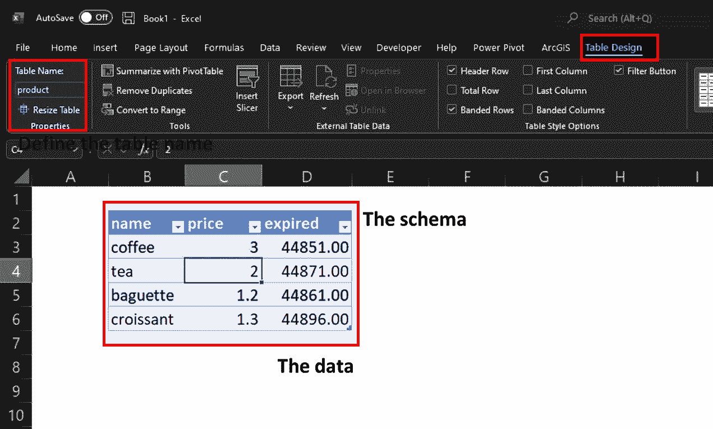

来源:作者(2022)

当我们的数据是动态的，需要改变模式时，这就成问题了！例如，如果有关于我们的特性的新信息，我们需要存储它，我们需要再次指定列名和类型！

如果我告诉你模式对于结构化我们的数据是不必要的呢？您知道我们不必指定列名和类型吗？如果有新信息，我们可以原样存储。

这篇文章展示了大多数人拥有的软件中的无模式数据结构:Microsoft Excel。实际上，我认为不太可能使用 Ms Excel 来编辑或操作无模式数据库，但它是欣赏无模式数据的一个很好的直觉练习。

# JSON (Javascript 对象符号)简介

关于 JSON 和无模式的更全面的主题可以在 MongoDB 的这个页面上找到。它是无模式的 NoSQL 数据库软件，采用 JSON 格式作为数据结构。本节将简要介绍内容。

[](https://www.mongodb.com/unstructured-data/schemaless) [## 无模式数据库

### 传统的关系数据库定义良好，使用模式来描述每个功能元素，包括…

www.mongodb.com](https://www.mongodb.com/unstructured-data/schemaless) 

无模式意味着我们不是用表而是用 JSON 格式来组织数据。CSV 格式是表数据结构的一个示例，如下图所示:

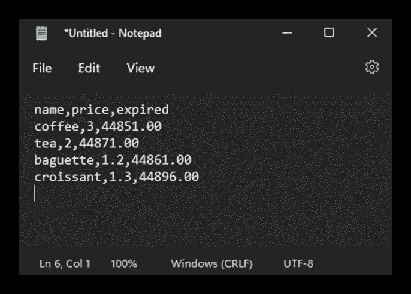

表数据结构，来源:作者(2022)

在我们将 CSV 文件转换成 JSON 文件之前，让我们先了解一下 JSON。JSON 就像 CSV 它是一个文本文件，但是 JSON 格式看起来怎么样呢？

> JSON 数据由方括号和花括号组成

表是行的列表(或数据的列表)，就像下面的“雇员”列表。这个列表或数组由方括号定义。

```
["**sutan**", "**john**", "**jane**"]
```

然后，我们可以用花括号展开每个员工信息。我们将这些花括号组视为行，用逗号分隔它们，并将它们放在方括号内。

```
**[**{"name":"**sutan**", "medium":"perkotaan"}, {"name": "**john**", "medium": "johndoe"},{"name": "**jane**", "medium": "janedoe"}**]**
```

我们可以对`"`标记内的内容递归地这样做！将信息扩展到新的大括号中。

下表中的信息是相同的


来源:作者(2022)

所以，我们知道，

> 列表是一个表格

而且，

> 花括号是行，方括号是列表；

我们也知道…

> 表格是行的列表；

因此…

> 表格是大括号的列表

一个表就是一堆行，基本上就是一堆方括号。

请注意，我们可以在这些括号内任意键入任何内容。我想给 Sutan 添加一个 Twitter 帐户，但是我没有 John 和 Jane 的 Twitter 帐户。

```
**[**
{"name":"sutan", "medium":"perkotaan", **"twitter": "urban_planning"**}, 
{"name", "john", "medium": "johndoe"},
{"name", "jane", "medium": "janedoe"}
**]**
```

或者，添加另一个数据，也许，约翰的年龄？

```
**[**
{"name":"sutan", "medium":"perkotaan", "twitter": "urban_planning"}, 
{"name": "john", "medium": "johndoe"**, "age": 30**},
{"name": "jane", "medium": "janedoe"}
**]**
```

或者，再套一桌！例如，简的技能

```
# employees data**[**
     {"name":"sutan", "medium":"perkotaan"},
     {"name": "john", "medium": "johndoe", "age": 30},
     {
     "name": "jane",
      "medium": "janedoe",
     "skills" : **[**
          {"name": "ms excel", "years": 5},
          {"name": "ms word", "years": 2},
          {"name": "arcgis", "years": 4}
          **]**
     }
**]**
```

该嵌套表类似于 Excel 中的下图(仅可视化，而不是实际的数据存储):

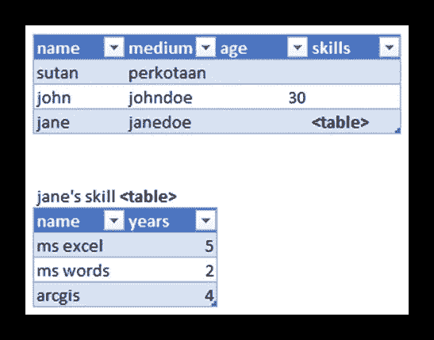

来源:作者(2022)

回到最初的产品 CSV 文件。现在，为了使它无模式化，我们用 JSON 格式重构**相同的产品数据**；它看起来会像这样:

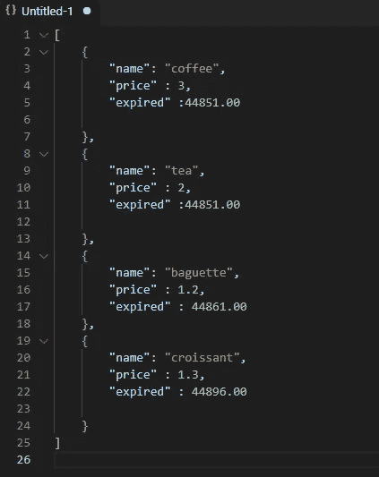

来源:作者(2022)

然后我们可以为表嵌套更多的信息！我在 Ms Excel 中制作了下面的图像，但是请再次注意:Ms Excel 在这里只是为了可视化 JSON 文件，在这个文件中我们嵌套了我们的表。


来源:作者(2022)

# Excel 中的 JSON:超级查询

使用记事本(或任何文本编辑器)，将示例 JSON 雇员数据保存为一个`.json`文件，如下图所示。例如，这是我之前展示的员工数据。

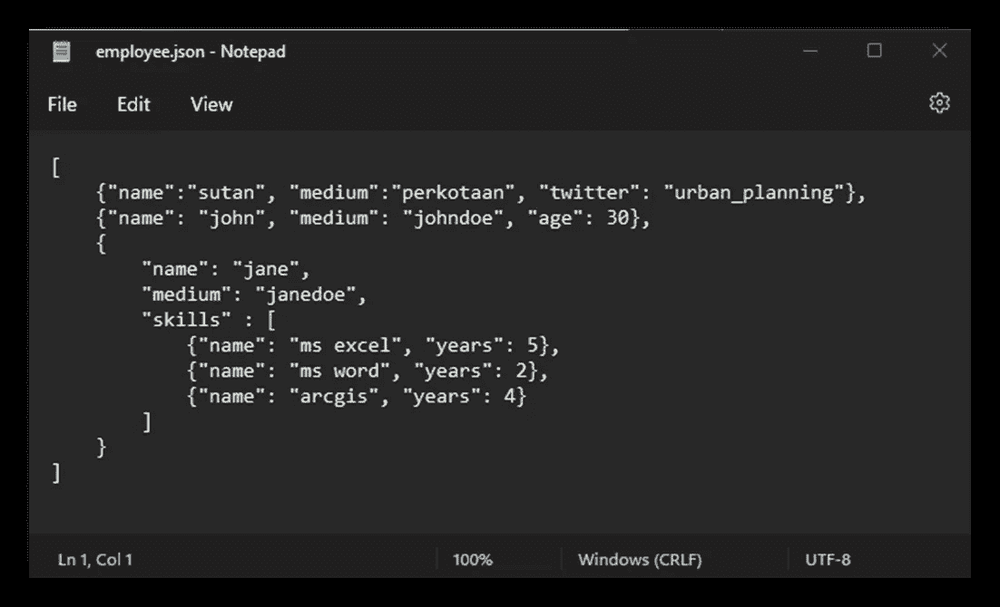

来源:作者(2022)

然后，我们可以使用 Ms Excel 导入文件，方法是转到 data 选项卡，从文件获取数据，然后单击 JSON。

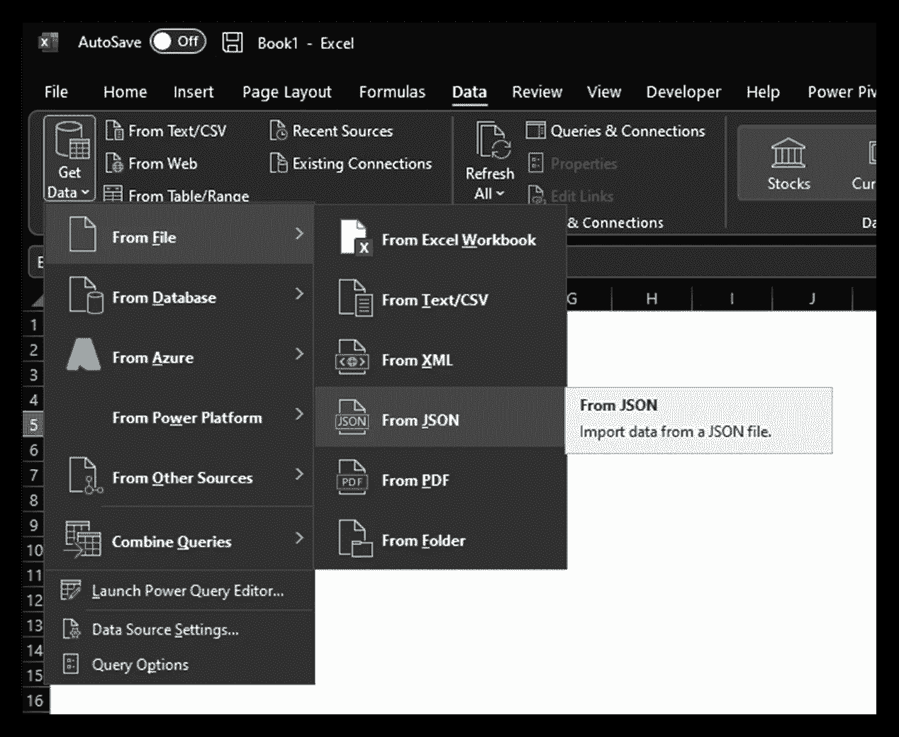

来源:作者(2022)

这将打开 power query 编辑器，我们将把 JSON 文件转换成一个表

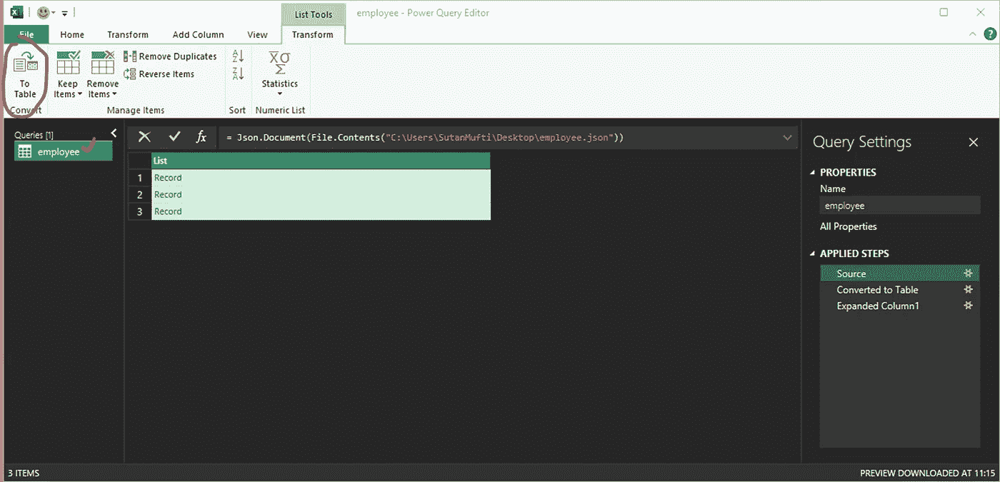

来源:作者(2022)

展开该列，


现在我们可以看到嵌套表列表

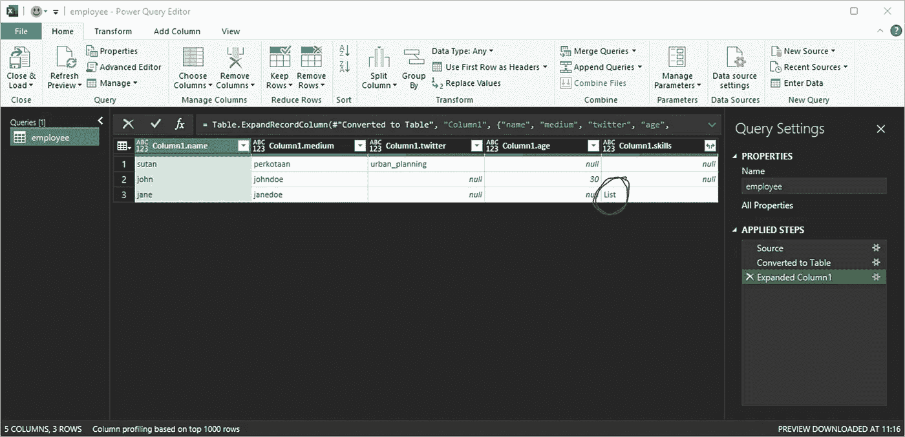

来源:作者(2022)

如果我们点击**列表**，我们可以将它展开为一个新表！”**列表**基本上是一张表！这里我们可以看到 JSON 中定义的 Jane 的技能。

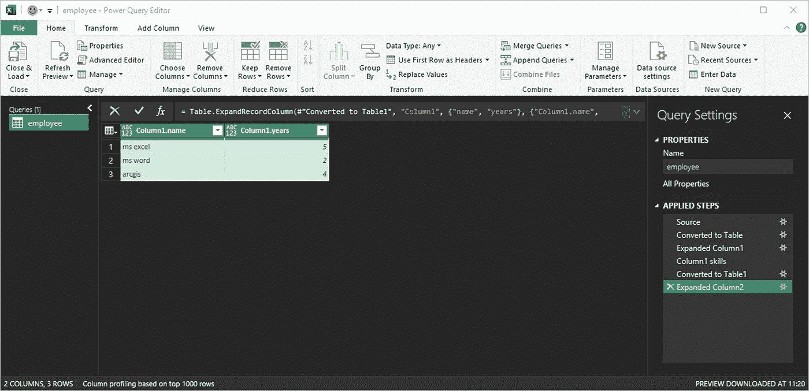

来源:作者(2022)

单击 close & load(左上角)，这将基于我们在 power 查询中定义的 JSON 连接在 excel 中生成一个表。在这一步，它将返回 Jane 的技能，就像我们在 power 查询中访问 Jane 的技能一样。

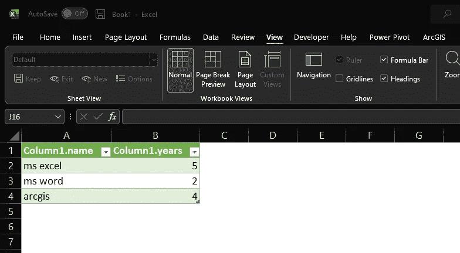

来源:作者(2022)

或者如果我们后退一步，我们可以加载雇员数据。

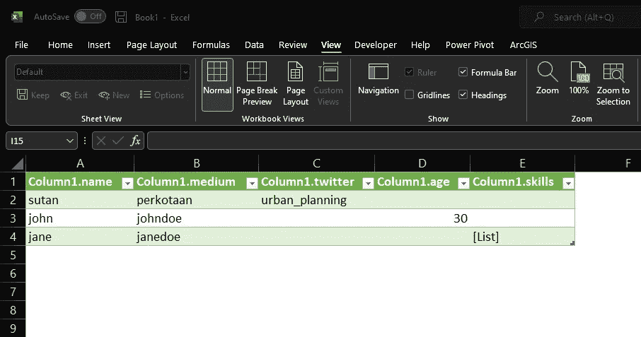

来源:作者(2022)

但最重要的是，对我来说，**指的是 JSON 文件**。所以绝对数据存储在 JSON 文件中；如果我们编辑 JSON 文件，Excel 文件也会被编辑。

# 结论

本文通过可视化无模式数据结构来构建无模式数据结构。这种无模式的数据利用 JSON 格式来构建数据，在数据中，我们用花括号定义每个特性，并用方括号将特性分组。对于阅读本文的计算机科学家来说，我相信这并不新鲜，但是对于不熟悉数据结构基础但需要结构化数据的专业人员来说，这种想法是新颖的，可以节省大量时间。

为了可视化无模式数据结构，我展示了 JSON 如何允许我们在 Excel 单元格中存储任何数据，包括表格。当我们可以通过使用 Power Query 在 Ms Excel 的单元格中托管一个表时，我们就理解了无模式数据。