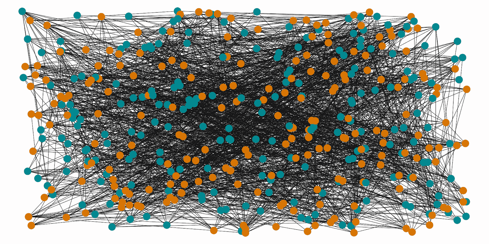

# 用于图形深度学习的神经层扩散

> 原文：<https://towardsdatascience.com/neural-sheaf-diffusion-for-deep-learning-on-graphs-bfa200e6afa6>

## 从代数拓扑的角度看 GNNs

## **图形神经网络(GNNs)连接到扩散方程，在图形的节点之间交换信息。作为纯粹的拓扑对象，图被隐含地假定为具有平凡的几何。使用一种更一般的结构称为细胞绞线，我们可以赋予图形一个可学的几何结构。我们证明了细胞束上的扩散过程可以解决任何节点分类任务，并且可以提供关于过度平滑、处理嗜异性数据的问题以及 GNNs 的表达能力的新见解。**

基于 Shutterstock 的图像。

*本文由克里斯蒂安·博德纳尔和弗朗切斯科·迪·乔瓦尼合著，基于 c·博德纳尔、f·迪·乔瓦尼等人的论文*、[*【神经束扩散:对 GNNs*](https://arxiv.org/pdf/2202.04579.pdf) *中异嗜性和过度光滑的拓扑透视】(2022) arXiv:2202.04579。它是通过微分几何和代数拓扑* *的透镜的* [*图神经网络系列的一部分。另请参见之前讨论*](/graph-neural-networks-through-the-lens-of-differential-geometry-and-algebraic-topology-3a7c3c22d5f?source=your_stories_page----------------------------------------) [*神经扩散偏微分方程*](/graph-neural-networks-as-neural-diffusion-pdes-8571b8c0c774?sk=cf541fa43f94587bfa81454a98533e00) *、* [*图重布线与瑞奇流*](/over-squashing-bottlenecks-and-graph-ricci-curvature-c238b7169e16?sk=f5cf01cbd57b4fee8fb3a89d447e56a9) 、*[*拓扑消息传递*](https://michael-bronstein.medium.com/a-new-computational-fabric-for-graph-neural-networks-280ea7e3ed1a?sk=3d4185067ef3c1cf81793deada08e18f) *的系列帖子。看一段 Aleksa gordi**详细讲解论文的* [*视频和 Cristian 在 AIMS 2020 几何深度学习课程中的*](https://www.youtube.com/watch?v=JiQmkhsbRwk) [*嘉宾谈*](https://www.youtube.com/watch?v=TgPMuvH5j1I) *。**

*图形神经网络(GNNs)已经成为机器学习领域的“一等公民”[1]，并在从粒子物理到纯数学定理证明等问题中获得了成功应用[2]。大多数 gnn 基于消息传递[3]，通过它，相邻节点之间的信息在图上传播。*

*两种现象通常与某些 gnn 有关:在*嗜异性*设置中表现不佳【4】和*过度平滑*【5–6】。前者源于 gnn 通常建立在*同向性*(即相邻节点是相似的)的假设上，这通常看起来是不现实的【7】。后一种现象指的是应用多个消息传递层来产生接近常数的特性的趋势，导致性能随着深度而下降，以及深度 GNNs 的不可行性[8]。*

*在最近的一篇论文[9]中，我们认为这两个问题在底层图的“几何”中有一个共同的根源。像流形一样，图也是拓扑对象[10]:它们有邻域的概念(在图上，这是由一对节点之间的边捕获的)，但没有距离或方向。我们可以通过用向量空间结构装饰每个节点和边(这种向量空间被称为*茎*)以及每个关联节点和边的茎之间的一组线性变换(*限制映射*)来定义图上的一些几何概念。*

**

**通过将向量空间与图中的每个节点和边(分别为“梗”ℱ(u)、ℱ(v 和ℱ(e=(u,v)相关联，并在这些空间之间为每个关联节点-边对(u⊴e 和 v⊴e).)建立“限制图”，在图上构建细胞层**

*这个图，连同其上构建的茎和限制性图谱，被称为*细胞束*。[束](https://en.wikipedia.org/wiki/Sheaf_%28mathematics%29)是代数拓扑中的主要研究对象，可以粗略地认为是描述定义在拓扑空间上的数据的一种非常通用的方式【11】。虽然它们在连续情况下的定义有些技术性和复杂性，但细胞束是离散拓扑空间(细胞复形，其中图是一个特例)上的一个类似的和更容易掌握的结构。1977-1978 年，[罗伯特·麦克弗森](https://en.wikipedia.org/wiki/Robert_MacPherson_%28mathematician%29)在布朗大学的一次研讨会上首次发现了细胞束。麦克弗森的学生艾伦·谢泼德在 1985 年完成的博士论文[12]中对该理论进行了第一次全面的发展。这项工作，然而，几乎没有人注意到；最近，Robert Ghrist 和他以前的博士生 Justin Curry 和 Jakob Hansen 已经复活并将其引入应用领域。*

*在我们讨论的上下文中，细胞层的概念与微分几何中的*连接*的概念密切相关，顾名思义，微分几何“连接”光滑流形上两个相邻点的切空间【16】。这种机制规定了切向量如何局部移动，允许执行*并行传输*【17】——从而赋予流形(拓扑对象)一种几何结构。连接的各种选择导致流形的不同性质和其上发生的物理过程。*

**

**在一个管汇上平行运输。在向量空间ℱ(w 和ℱ(u 之间移动向量的结果通常是路径相关的(在这个例子中，从 w 到 u 沿着 e₃或者沿着 e₁和 e₂到 v 的路径产生不同的结果)。**

# *层的选择决定了表现力*

*本着类似的精神，我们证明了通过适当构造限制图来选择图上的层结构，会导致图上扩散过程的不同行为。由于 GNNs 可以解释为离散化的扩散方程[18]，这种形式允许我们研究不同 GNN 模型在不同环境下的表达能力和局限性。*

*一层上的扩散受微分方程支配*

***ẋ**(*t*)=**δx**(*t*)*

*从一些初始条件开始 **x** (0)= **x** 。这看起来像一个标准的图形扩散方程，有一个重要的区别:我们现在有了维度为 *d* 的*矢量*数据(排列成大小为*和*×1】*的块矢量 **x** ，编码层结构【19】的*层拉普拉斯***δ**是*和* ×**

****

***与图的节点相关联的空间一起形成 0-共链 C⁰的空间(“节点信号”* ***x*** *)和图的边上的空间 1-共链 c(“边信号”* ***y*** *)。共同边界图δ:C⁰→C 是测量节点空间之间“不一致”的梯度算子的一般化；类似地，地图δᵀ:C →C⁰相当于散度算子。谢夫拉普拉斯被定义为****δ****=δᵀδ，是微分几何中使用的霍奇拉普拉斯的离散版本。***

**在极限 *t* →∞中，层扩散方程的解属于层拉普拉斯算子的*调和空间*:该空间包含符合层沿所有边的限制图【21】的信号，使得**δx**= 0**【22】。这是对谐波信号的经典定义的概括，谐波信号在每个节点上等于其邻居的平均值。****

****任何节点分类任务都可以被描述为寻找正确的层，在该层上，层扩散的极限能够线性地分离节点特征。这种观点可以作为 Weisfeiler-Lehman 图同构测试层次结构[23，48]的替代方法，用于表征从扩散过程中获得的 gnn 的表达能力。扩散的分离能力通常取决于层的构造以及关于基础图的结构和节点特征或标签的假设(嗜同性对嗜异性)。****

****具有对称和非零限制图的 *d* =1 维(标量)茎的选择对应于具有严格正边权重的标准加权图拉普拉斯算子。从这种扩散过程中产生的 GNN 架构是 GCN 类型的图形卷积模型[24–25]。这种模型可以在某些同质假设下分离两类节点[26]；然而，这类滑轮在嗜异性环境中不够强大[27]。我们表明，为了解决嗜异性的情况，必须放弃对称假设，允许非对称限制图[28]，这在标量情况下相当于允许负边权重。这为为什么最近的论文[29–31]显示负权重对处理异性很有用提供了理论依据。****

********

****具有两个分别包含正负标量特征的不同节点(红色和绿色)的嗜异性设置示例。不对称限制图(在这种情况下，+1 或-1 边权重)是调和它们所必需的。****

****考虑到两个以上的节点类，我们表明更高维的主干(提供一定的“表示宽度”)是分离这种情况所必需的[32]。这种额外的“宽度”概念可以对特征通道的数量起到补充作用，以增加 GNN 模型的表达能力。我们表明使用 *d* × *d* 对角可逆限制图允许分离 *d* 类【33】。使用正交限制图(相当于节点向量的旋转和反射)会产生更好的表达能力:对于 *d* =2 或 4，相关的扩散过程可以分离至少 2 个 *d* 类。正交设置特别有趣，因为它与同步问题有关[21]，最近以正交 GNNs [34]和 Taco Cohen 在其博士论文[35]中开发的规范等变卷积模型的形式进行了研究。****

********

*****在具有四个节点类(颜色编码)的合成嗜异性数据集上通过层扩散进行节点分类的示例。节点特征是二维的(由平面中的节点坐标表示)，并且限制图是正交的(旋转+反射矩阵)。与我们的理论一致，层扩散能够线性地分离极限中的节点。*****

# ****层卷积网络和能量最小化****

****为了将层理论与图形上的深度学习联系起来，我们考虑以下 GNN 层，该层最初由 Hansen 和 Gebhart 提出[36]:****

******y**=σ((**I**—**δ**)(**I**⊗**w**₁)**xw**₂).****

****这里 **X** 是具有 *f* 个通道的输入特征的 *nd* × *f* 矩阵， **W** ₁和 **W** ₂是 *d* × *d* 和 *f* × *f* 可学习的权重矩阵(前者作用于**x 的每个块 和 GCN [25]中一样，**δ**是大小为 *nd* × *nd，*t44】I**是适当维数的单位矩阵，⊗表示[克罗内克乘积](https://en.wikipedia.org/wiki/Kronecker_product)【37】，σ是 ReLU 或 Leaky ReLU 等非线性。 通过类比 GCN [38]，我们将这一层称为*层卷积网络* (SCN)。SCN 模型可以被视为层扩散方程的离散的、参数化的和非线性的版本。****

****一个关键问题是 SCNs 是否以及何时在一定程度上趋向于像层扩散一样。为了分析这一点，我们检查 SCN 层如何影响*层狄利克雷能量*ℰ(**x**)= trace(**x**ᵀ**δx**)。这是一种类似于经典狄利克雷能量的二次形式，测量 **X** 与层拉普拉斯的调和空间的距离(即信号与层结构的不一致程度)。扩散方程是狄利克雷能量的梯度流，使其随时间最小化。****

****在 GCNs(SCN[38]的标量版本)的特殊情况下，蔡和王[6]表明，一个 gcn 层的应用必然*降低*狄利克雷能量，即 **Y** 、 **X** 。因此，随着深度的增加，特征往往会变得更平滑，这种现象在这种类型的图形神经网络中很常见。****

****在我们更一般的设置中，这种行为可能会根据层和相关层拉普拉斯**δ**的选择而变化。特别地，该不等式在沿所有边都相等的 *d* 维正交限制图的情况下成立【39】。此外，沿所有边的关系的对称性是一个必要条件:只要我们有一个边，其中限制图是不同的，我们就可以找到一个任意小的线性变换，增加狄利克雷能量[40]。****

****在 ReLU 型σ假设下的 *d* =1 维(标量)情况下，具有正号边是狄利克雷能量降低的必要条件。这是 Oono 和[5]以及蔡和王[6]关于广义神经网络过光滑性的结果的推广。有趣的是，如果σ被假设为线性的，那么即使是带负号的边，狄利克雷能量也会最小化。****

# ****从数据中学习束允许特征与图形几何一起进化****

****最后，我们提出了一个基于层扩散(SCN 型层)的 GNN 架构，其中层可以从数据中学习。具体地，该层由形式为𝚽( **x** ᵤ、 **x** ᵥ、 *d* × *d* 矩阵值函数的参数限制图定义，该矩阵值函数可以进一步被约束为正交或对角的。这允许 GNN 在图上“发现”正确的层结构，以最适合下游任务的方式修改扩散的属性。****

****此外，GNN 的每一层中的层都可能不同(通过其对当前图层的要素的依赖性)这一事实是域和数据的一种*共同进化*形式。在 GNN 的文献中，类似的想法是将计算图与输入图分离，这通常以*图重新布线*(改变图作为预处理步骤【41】)或*潜在图学习*(在学习期间改变图【42】)的形式实现。****

****我们最近在非欧几里德神经扩散[43]的工作中研究了图形“几何”演变的另一种方法，其中图形被嵌入到联合位置特征空间中。这个空间上的一个可学习的扩散过程，称为 *graph Beltrami flow* ，导致同时的特征扩散和图形重布线。学习一层的优势在于它是“内在地”完成的，并且不需要在环境空间中嵌入任何类型的图。****

# ****结束语****

****神经层扩散遵循了图 ML 架构设计的一个新趋势:首先将输入图“提升”到一个结构更丰富的对象中，然后在这个对象上进行操作。这样，GNNs 可以避免使用输入图作为“计算结构”，这仍然是当前结合消息传递范例使用的主要方法。****

****我们遵循这一理念的工作包括最近关于拓扑消息传递的论文[44–45](其中图被制成单纯或细胞复合体，在其上适当定义的消息传递被证明比经典的 Weisfeiler-Lehman 更具表达性)，图 Ricci 流(在图上构建 Ricci 曲率的离散类比，以量化和消除造成过度挤压的瓶颈[46]并将其用于节点嵌入[47])，以及前面提到的图 Beltrami 流[43]。****

****第二，有限层扩散的节点分离能力为研究 GNNs 的表达能力提供了一个新的框架，该框架脱离了传统的 Weisfeiler-Lehman 层级[48]。层形式主义允许做出明智的架构选择——例如，证明在某些嗜异性设置或正交消息传递函数中使用负权重的合理性。****

****最后，gnn 是[几何深度学习蓝图](/geometric-foundations-of-deep-learning-94cdd45b451d?sk=184532175cb936d7b25d9adebd512629)的一个特例，将 Felix Klein 的几何群论处理(“[埃尔兰根程序](https://en.wikipedia.org/wiki/Erlangen_program)”)引入机器学习【49】。正如埃尔兰根计划的精神蔓延到其他学科，并在微分几何，代数拓扑和物理学中产生了新的理论[50]，我们相信几何深度学习的下一步发展应该从这些类比中获得灵感。通过求助于上述领域的强大工具，可以得出新的理论见解和计算模型[51]，到目前为止，这些工具在最大似然法中探索不足，在应用领域中被认为是“奇异的”。****

****[1]引用 Petar Velič ković在我的 [2021 年预测帖子](/predictions-and-hopes-for-graph-ml-in-2021-6af2121c3e3d?sk=e2dfa5d2f63dab879a2d097382a3cf66)中的话。****

****[2] A. Davies 等.用人工智能指导人类直觉推进数学(2021)，自然 600:70–74。****

****[3] J. Gilmer 等人，[量子化学的神经信息传递](https://arxiv.org/pdf/1704.01212.pdf) (2017) ICML。****

****[4]朱等，[超越图神经网络中的同伦现象:当前的局限与有效设计](https://proceedings.neurips.cc/paper/2020/file/58ae23d878a47004366189884c2f8440-Paper.pdf) (2020) NeurIPS。****

****[5] K. Oono 和 t .铃木，[图神经网络对节点分类的表达能力呈指数下降](https://openreview.net/pdf?id=S1ldO2EFPr) (2020) ICLR。****

****[6]蔡志勇，王等，[关于图神经网络过光滑问题的一个注记](https://arxiv.org/pdf/2006.13318.pdf) (2020) arXiv:2006.13318 .****

****[7]早期的 graph ML 基准测试，如 Cora、Citeseer 和 Pubmed 是高度同质化的，这给 GNNs 的性能带来了一些错误的印象。最近专门针对这个问题开发的数据集指出，一些流行的 GNN 模型在嗜异性环境中的表现令人失望。****

****[8]参见我那篇有争议的博文[我们需要深度图神经网络吗？](/do-we-need-deep-graph-neural-networks-be62d3ec5c59?sk=8daa06935676e78bdb229017d3c4bac9)在走向数据科学。****

****[9] C .博德纳尔，f .迪·乔瓦尼等人，N [eural 层扩散:GNNs](https://arxiv.org/pdf/2202.04579.pdf)(2022)arXiv:2202.04579 中关于异质和过度光滑的拓扑透视。****

****[10]拓扑学和几何学区别的一个典型例子是关于一个拓扑学家的早餐有一个油炸圈饼和一杯咖啡的笑话，它们在拓扑学上是等价的(两者都同胚于一个环面)。这个例子借用了拓扑学中“橡胶片几何”的比喻:一个可拉伸的圆环面可以变形为一个咖啡杯，这个过程将影响点之间的局部距离和角度(几何)，但不会影响点之间的连接方式(拓扑学)。在这篇博文的[中可以看到一个流行的拓扑介绍。](https://www.cantorsparadise.com/what-is-topology-963ef4cc6365)****

****[11]层理论的发展归功于法国数学学派，它始于代数拓扑学家让·勒雷在战争时期的工作，随后在 20 世纪 50 年代由昂利·嘉当、让·皮埃尔·塞尔、奥斯卡·扎里斯基、亚历山大·格罗滕迪克和其他人发展。H. Miller， [Leray 在 of lag XVIIA:The origins of sheaf theory，sheaf 上同调，and spectral sequences](https://klein.mit.edu/~hrm/papers/ss.pdf) ，1999 中把 sheaf theory 的诞生归功于让·勒雷在二战期间被囚禁的一个戏剧性插曲。战争爆发时他是一名军官，1940 年法国军队被击败后，他被囚禁在德国 T2 的 T3 战俘营里。勒雷和其他战友被允许举办一个数学研讨会，他是主席。由于担心他在力学和流体动力学方面的专业知识会让德国人强迫他为纳粹战争效力，Leray 选择代数拓扑作为最抽象和“无害”的教学科目。他的工作后来分两部分出版，分别是《J. Leray，Sur la forme des espaces topologiques et Sur les points fixes des representations 》( 1945 年)和《J. Math》。pures et appl . 24:95–167 和 169–199，副标题为“*un cours de topologie algébrique professoréen captivité*”(囚禁期间教授的代数拓扑课程)。****

****[12] A. Shepard，[分层空间导出范畴的细胞描述](http://justinmcurry.com/wp-content/uploads/2022/02/shepard.pdf)，博士论文，布朗大学，1985 年。****

****[13] J. M. Curry，[滑轮、共沉和应用](https://arxiv.org/pdf/1303.3255.pdf) (2014)。宾夕法尼亚大学博士论文。参见[贾斯汀关于蜂窝绳轮历史的推特帖子](https://twitter.com/currying/status/1496201117163794432?s=20&t=oD-9NWs3k9L2hC1h3A0m9A)。****

****[14] J. Hansen 和 R. Ghrist，[迈向细胞束的光谱理论](https://arxiv.org/pdf/1808.01513.pdf) (2019)。应用与计算拓扑学杂志，3(4):315–358。****

****[15] J. Hansen 和 R. Ghrist，[关于话语束的意见动态](https://arxiv.org/pdf/2005.12798.pdf) (2021)。暹罗应用数学杂志，81(5):2033–2060。****

****[16]严格地说，限制图从节点的向量空间到边的向量空间。更正确的连接类比是*运输图* —对于一条边 *e* =( *u* ， *v* )，从 *u* 到 *e* 的限制图与从 *e* 到 *v* 的转置图的组合。注意，虽然连接必须是可逆映射，但限制映射不是必须的。****

****[17]光滑流形上的一个连接规定了一种对切向量场进行微分的方式(因此又有一个名字， [*协变导数*](https://en.wikipedia.org/wiki/Covariant_derivative) )。有多种方法可以做到这一点。如果流形额外配备了黎曼度量，则存在一个唯一的“规范”连接，称为 [*李维-奇维塔连接*](https://en.wikipedia.org/wiki/Levi-Civita_connection) 。****

****[18] B. Chamberlain，J. Rowbottom 等人，[GRAND:Graph Neural Diffusion](https://arxiv.org/abs/2106.10934)(2021)ICML。另见[附带的博文](/graph-neural-networks-as-neural-diffusion-pdes-8571b8c0c774?sk=cf541fa43f94587bfa81454a98533e00)。****

****[19]我们使用归一化的层拉普拉斯算子；参见我们论文中的定义 4。****

****[20]注意柄的尺寸 *d* 与特征通道的数量不同。一个类似的例子是微分几何中的切向量场；在这种情况下， *d* 对应于流形的维度(及其切空间)。****

****[21]因此，层扩散可以被看作是一个全球性的“同步”过程。A. Singer 和 H.-T. Wu 在《纯数学和应用数学通讯》65(8)(2012)中的文章[《向量扩散图和连接拉普拉斯算子》以及我的博士生 A. Kovnatsky 等人的文章](https://arxiv.org/pdf/1102.0075.pdf) [MADMM:流形上非光滑优化的一般算法](https://arxiv.org/pdf/1505.07676.pdf) (2016)研究了图拉普拉斯算子与正交限制映射(称为*连接拉普拉斯算子*)的同步问题****

****[22]或者，**x**∈ker(δ)，即调和空间是拉普拉斯算子的核。****

****[23] B. Weisfeiler 和 A. Lehman，将图简化为标准形式以及其中出现的代数(1968)。nauchno-Technicheskaya informatisia 2(9):12–16 介绍了图同构测试，这种测试最近在 GNN 文献中很流行，因为它等价于某些形式的消息传递。参见[我的帖子](/expressive-power-of-graph-neural-networks-and-the-weisefeiler-lehman-test-b883db3c7c49?sk=5c2a28ccd38db3a7b6f80f161e825a5a)和 C. Morris 等人， [Weisfeiler 和 Leman 围棋机器学习:迄今为止的故事](https://arxiv.org/pdf/2112.09992.pdf) (2021) arXiv:2112.09992 的历史笔记和深入综述。****

****[24] M. Defferrard 等人[图的卷积神经网络与快速局部谱滤波](https://papers.nips.cc/paper/6081-convolutional-neural-networks-on-graphs-with-fast-localized-spectral-filtering.pdf) (2016) NIPS。****

****[25] T. Kipf 和 M. Welling，[使用图卷积网络的半监督分类](https://arxiv.org/pdf/1609.02907.pdf) (2017) ICLR。描述了 GCN 的建筑。****

****[26]我们论文中的命题 13。****

****[27]我们论文中的命题 14。****

****[28]见我们论文中的命题 16。此外，在命题 18 中，我们陈述了在具有正边权重的图上的扩散不能分离仅具有来自通过边连接的不同类的两个节点的平凡的异嗜情况。不对称边权重有时在图 ML 文献中被称为“各向异性”，类似于连续扩散方程(其中该术语表示依赖于方向的扩散率)。****

****[29] Y. Yan 等，[同一枚硬币的两面:图卷积神经网络中的异嗜性和过度光滑](https://arxiv.org/pdf/2102.06462.pdf) (2021) arXiv:2102.06462。****

****[30] E. Chien 等，[自适应通用广义 PageRank 图神经网络](https://openreview.net/pdf?id=n6jl7fLxrP) (2021) ICLR。****

****[31] D. Bo 等，[超越图卷积网络中的低频信息](https://ojs.aaai.org/index.php/AAAI/article/view/16514/16321) (2021).****

****[32]我们论文中的命题 19。****

****[33]我们论文中的命题 21。****

****[34]郭，正交图神经网络(2021) arXiv:2109.11338 .****

****[35]t . Cohen 研究了连续 O( *d* )向量束，等变卷积网络(2021)，阿姆斯特丹大学博士论文。2021 年 4 月，我是他的博士委员会的成员，一生中只有一次机会看到他穿着白色领带和燕尾服。这个框架的离散实例由 m .魏勒等人进一步发展，[坐标独立卷积网络](https://arxiv.org/pdf/2106.06020.pdf) (2021) arXiv:2106.06020 和 P. de Haan 等人，[规范等变网格 CNN:几何图形上的各向异性卷积](https://openreview.net/pdf?id=Jnspzp-oIZE) (2021) ICLR。****

****[36] J. Hansen 和 T. Gebhart，Sheaf neuro networks(2020)neur IPS 拓扑数据分析及其他研讨会。****

****【37】克罗内克乘积 **I** ⊗ **W** ₁的 an *n* × *n* 单位矩阵 I 和可学习的 *d* × *d* 权重矩阵 **W** ₁产生大小为 *nd* × *nd* 的块对角矩阵作用在 *nd* 的每个块上****

****[38]对于 *d* =1，获得 GCN 的残差变量，在这种情况下，该层的形式为**Y**=σ((**I**-**δ**)**XW**)。****

****[39]本文中的定理 25。****

****[40]即，对于任何ε>0，存在一个矩阵 **W** ，其中‖**w**<ε使得ℰ((**I**⊗**w**)**x**)>ℰ(**x**。参见我们论文中的 27 号提案。****

****[41]图形重新布线通常对图形进行预处理，以使其对消息传递更友好(例如，消除瓶颈和减少过度挤压现象)以及降低计算复杂度(例如，通过邻居采样)。****

****[42]“潜在图形学习”是 GNN 型架构的通称，该架构从数据构建和更新图形，以指导其发展。第一个这样的架构之一是由 Y. Wang 等人开发的[用于在点云上学习的动态图形 CNN](https://arxiv.org/pdf/1801.07829.pdf)(2019)。ACM Trans 图形 38(5):146。看到我关于这个话题的[博文](/manifold-learning-2-99a25eeb677d?sk=1c855a020f09b72edfa50a8aba5f24a0)。****

****[43] B. P. Chamberlain 等人， [Beltrami 流和图形上的神经扩散](https://arxiv.org/pdf/2110.09443.pdf) (2021) NeurIPS。****

****[44] C .博德纳尔，f .弗拉斯卡，等，[魏斯费勒和雷曼 go 拓扑:消息传递单纯网络](http://proceedings.mlr.press/v139/bodnar21a/bodnar21a.pdf) (2021) ICML。****

****[45] C .博德纳尔、f .弗拉斯卡等人，[魏斯费勒和雷曼 go cellular:CW Networks](https://arxiv.org/pdf/2106.12575.pdf)(2021)neur IPS。****

****[46] J. Topping，F. Di Giovanni 等人，[通过曲率理解图的过度挤压和瓶颈](https://arxiv.org/pdf/2111.14522.pdf) (2022) ICLR。见[附随博文](/over-squashing-bottlenecks-and-graph-ricci-curvature-c238b7169e16?sk=f5cf01cbd57b4fee8fb3a89d447e56a9)。****

****[47] F. Di Giovanni，G. Luise 和 M. M. Bronstein，[曲率感知图嵌入的异构流形](https://arxiv.org/pdf/2202.01185.pdf) (2022) arXiv:2202.01185。****

****[48]我们研究了节点分类问题中的表达能力，而 Weisfeiler-Lehman 形式主义通常应用于图分类。这两个框架都适用于这两种环境。****

****[49]参见我们的“原型书”M. M. Bronstein 等人的[几何深度学习:网格、组、图、测地线和量规](https://arxiv.org/abs/2104.13478) (2021)以及我在 2021 年 ICLR 的[主题演讲](https://www.youtube.com/watch?v=w6Pw4MOzMuo)。****

****[50]埃尔兰根方案对整个几何学和数学产生了深远的方法和文化影响。最初从克莱因的蓝图中排除的黎曼几何，在五十年后被卡坦纳入，导致微分几何的现代公式。用 20 世纪 40 年代范畴理论的创始人艾伦伯格和麦克莱恩的话来说，诸如代数拓扑、纤维束和束的理论以及范畴理论(粗略地说，是物体之间关系的理论)等数学新领域是“埃尔兰根计划的延续”。****

****[51]参见[我的博客文章](/graph-neural-networks-beyond-weisfeiler-lehman-and-vanilla-message-passing-bc8605fa59a?sk=3a058b427798d601ebb2d618fca89a8f)更详细地描述了“物理启发”图形 ML 的想法。****

****作者感谢 Taco Cohen、Justin Curry 和 Nils Hammerla 对这篇文章的校对。关于图形深度学习的其他文章，请参见我在《走向数据科学》中的 [*其他帖子*](https://towardsdatascience.com/graph-deep-learning/home) *，* [*订阅我的帖子*](https://michael-bronstein.medium.com/subscribe) *和* [*YouTube 频道*](https://www.youtube.com/c/MichaelBronsteinGDL) *，获取* [*中等会员*](https://michael-bronstein.medium.com/membership) *，或者关注我的* [*Twitter*](https://twitter.com/mmbronstein)****