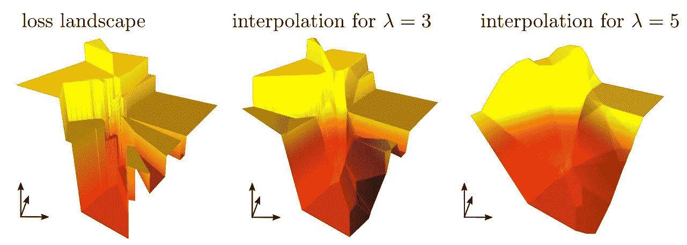
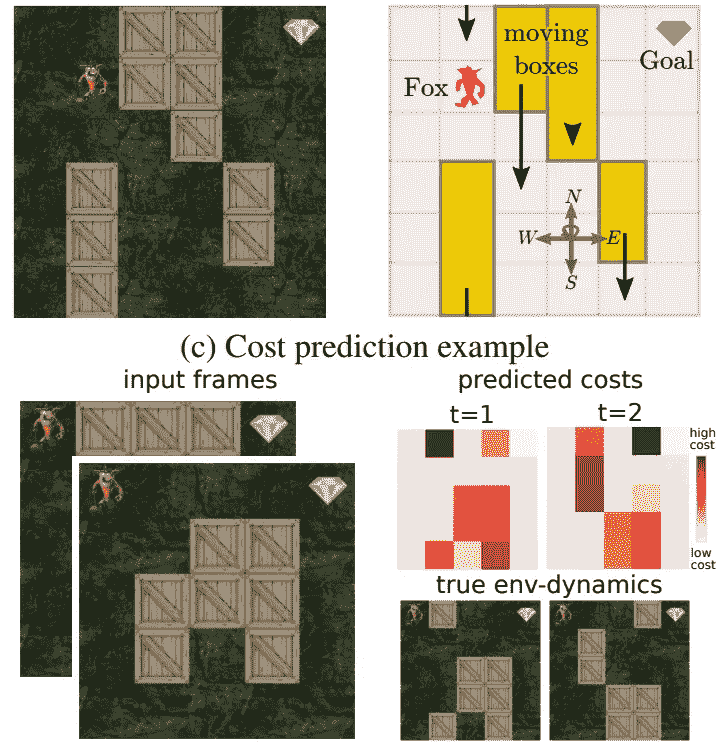

# 神经算法策略:组合学能帮助强化学习吗？

> 原文：<https://towardsdatascience.com/neuro-algorithmic-policies-can-combinatorics-help-reinforcement-learning-ccafdca5c89>

照片由在 [Unsplash](https://unsplash.com?utm_source=medium&utm_medium=referral) 上拍摄

## 在这篇博文中，我们探索了黑盒微分在模仿学习环境中的应用，与朴素神经网络策略相比，它带来了相当大的改进。

不久前，我们发表了一篇论文[2]，讨论了将组合层引入神经网络的问题。这个问题的核心是梯度计算。由于引入了一个嵌入了“离散程序”的层，从而形成了一个分段恒定的景观，输出被公式化为一个优化问题的解决方案(很值得一个大的聚光灯中心图片):

这比看起来要简单，基本上你可以把 **w** 和它的东西作为层的输入，而 **y(w)** 是问题 **w** 的解决方案。在神经网络中使用这种层有些不幸。梯度为 0 或未定义，无信息。为了将优化推向最小值，我们需要一些不同的东西来指导更新，梯度在它的标准形式下是没有用的。我们所做的贡献是认识到我们可以在反向通道上变出一个人工梯度，这可以用下面的等式来描述:

[2]

受超参数 **λ** 支配的是梯度返回的目标的景观，这个目标是“虚构的”，我们从未构建它，它被梯度公式所隐含。并且，增加 **λ** 会使目标函数的原始景观变得更平滑，并给出合理的更新方向(分段仿射)，为此，唯一需要做的是访问关于层输出的梯度，以便对 **w** 进行正确的扰动:

[1]

现在，这个公式已经适用于各种设置，其中我们有某种隐藏在**非结构化数据集**中的**组合问题**，在我之前的博客文章[深度学习和组合学的融合](/the-fusion-of-deep-learning-and-combinatorics-4d0112a74fa7)和论文中有更多描述。现在我想把你们的注意力转向模仿学习。

## 模仿问题

假设我们有一个控制问题，你需要学习一个策略来最大化回报(强化学习设置)，现在我给你一串来自专家(在这方面做得很好的人或事)的轨迹，现在你应该从中学习一个策略。

好吧，你可能会瞄准的一种方法是直接监督学习，采用神经网络并填充数据，因为你已经标记了给定观察的专家行为。这可能会带你到某个地方(我们稍后会看到在哪里)。

另一种方法是提取价值函数并最大化它(离线 RL)。这只有在我们可以使用奖励函数的情况下才有效(这适用于无模型和基于模型的方法)。在强化学习(除了反向强化学习)中，我们假设我们可以访问这些轨迹中的成本/回报。现在，去掉每一步轨迹的成本，你还剩下什么？只有行动。

基于模型的呢？你可以学习一个过渡模型，对吗？这对您没有任何好处，因为您无法从模型中评估采样轨迹，并且您没有任何数据来学习成本函数，不是吗？

## 拯救组合学

好消息来了。通过使用[2]中的理论，并知道我们需要解决哪个组合问题来使其适合顺序决策设置，我们可以实现令人印象深刻的泛化性能。具体来说，我们都知道 Dijkstra 最短路径算法，问题是我们如何将 Dijkstra 转换到依赖于时间的设置。事实上，正如人们长期以来所知，这是相对容易的。您只需将时间维度添加到图表中，并为每个时间步长添加适当的节点间连接。在潜在规划图中混合一个初始位置预测器和一个目标预测器，你会得到什么？神经算法策略。

神经算法策略管道[1]

它们可以简单地从专家的轨迹中训练出来，最棒的是——它们是可以解释的。当我们通过黑盒微分训练神经算法策略时，我们在潜在规划图中有可解释的成本。为了说明这一点，我编写了一个简单的玩具环境，名为 Crash jewel hunt，目标是让狐狸靠近珠宝，同时避开危险的移动盒子(恰好具有静态动力学)。

[1]

从技术角度来说，策略的输入是一系列图像，输出应该是一个最佳动作。

事实证明，首先，午睡是有用的，因为正如我所说的，它们是可以解释的。在上图中，您可以看到 Crash 需要遍历的地图上的高成本对应于 Crash 用来做出最佳决策的盒子位置(甚至是未来的盒子位置)。

其次，午睡只是概括得非常快。如果你看下图，你会看到一个午睡(蓝色)优于一个香草模仿学习神经网络政策。我们还在 ProcGen 基准测试中观察到了这种行为，您可以在本文中找到结果。在评估该政策时，确保培训和测试级别之间绝对没有重叠。这使得归纳变得特别困难。

根据 x 轴[1]上的等级数训练得出的策略，图中的每个点显示了超过 1000 个看不见的测试等级的成功率。

在下图中，您可以看到来自 ProcGen 基准测试(Chaser 环境)的玩具环境中的计划示例。目标是尽快收集绿色球体并避开敌人。这件事很酷的一点是，用于训练政策的数据来自人类，这肯定是不完美的数据，到处都有很多小错误。然而，国家行动方案能够从这类数据中学习，并提取组合的微妙之处，以实现良好和可解释的绩效。

[1]

尽管如此，考虑到午睡，还有很多工作要做。用于规划的潜在图也可以从数据中提取，而目前它是我们放入算法中的某种先验知识。理想情况下，整个管道应该从数据中学习…或者应该吗？嗯嗯……待定:)

## 参考

[1] Vlastelica 等人，神经算法策略实现快速组合泛化，ICML 2021

[2] Vlastelica，Paulus 等人，黑盒组合求解器的微分，ICLR 2020 年

## 其他资源

这类工作的其他博客文章:[黑盒组合求解器的分化](/the-fusion-of-deep-learning-and-combinatorics-4d0112a74fa7)

我的网址: [jimimvp.github.io](http://jimimvp.github.io)