# 神经生成模型和艺术的未来

> 原文：<https://towardsdatascience.com/neurogenerative-models-and-the-future-of-art-e73d457b4bb6>

最新的文本到图像模型可以基于文本提示生成令人惊叹的图像，既逼真又艺术，在许多现有艺术家的风格化下。在这篇文章中，我展示了一些例子，并试图推测这对我们欣赏艺术的方式可能产生的影响。

*柏林城市风景油画—* [*【稳定扩散】*](https://github.com/CompVis/stable-diffusion) *(左)，粉彩画的一男一女站在夕阳下的大海前接吻—* [*稳定扩散*](https://github.com/CompVis/stable-diffusion) *(右)—生成* [*德米特里·索什尼科夫*](http://soshnikov.com)

# 神经生成模型

在过去的几个月里，我们看到了神经模型领域的快速发展，它可以根据文本提示生成图像，即所谓的**文本到图像**。第一个严肃的模型出现在 2021 年 1 月，是来自 [OpenAI](https://openai.com/) 的 [DALL-E](https://openai.com/blog/dall-e/) 。2022 年 4 月，DALL-E 2 紧随其后，谷歌的型号 [Imagen](https://imagen.research.google/) 也差不多在同一时间问世。这两个模型都没有开放供一般使用，模型权重不可用，它们的使用只能作为进行封闭测试的服务的一部分。

然而，神经生成模型最受欢迎的是最近在艺术爱好者中流行的[中期](https://www.midjourney.com/home/)。该模型针对艺术创作者，是使用专门数据集进行训练的结果。然而，Midjourney 也不是免费使用的——您只能获得大约 20 个免费的图像生成来进行实验。

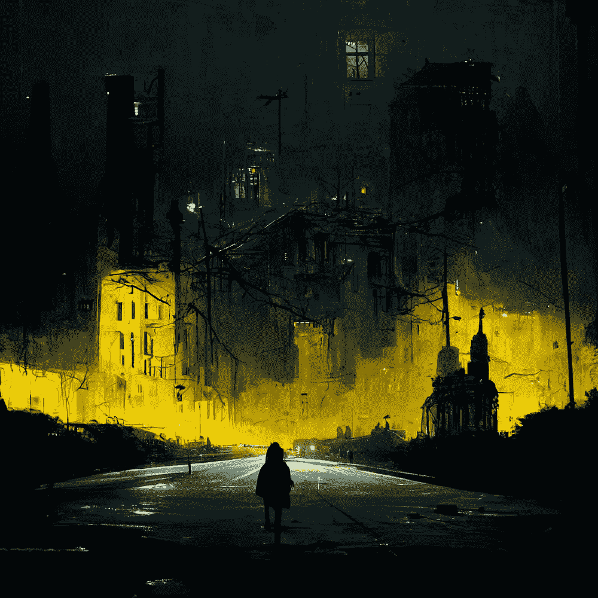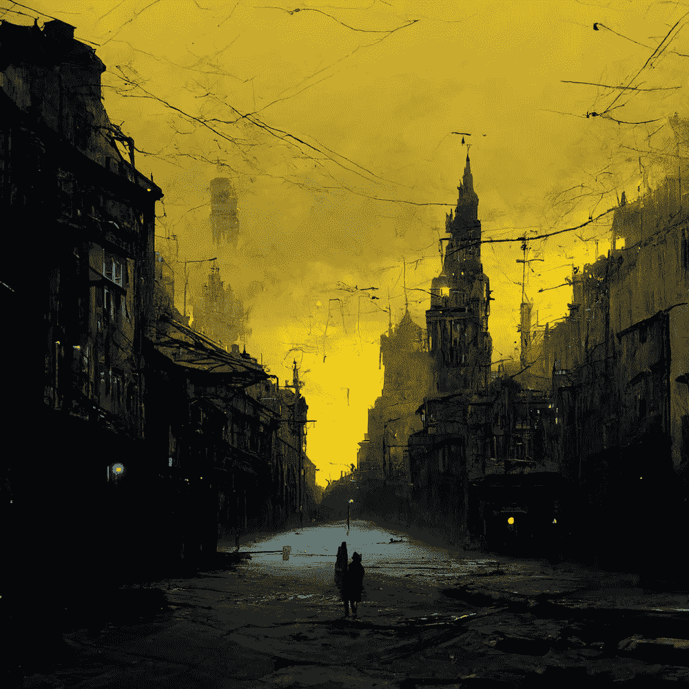

*黑暗的废弃城市，黄色的路灯，街上绝望的人，artstation 上的趋势*——*由中途生成* [*德米特里·索什尼科夫*](http://soshnikov.com)

然而，开放的神经生成模型正在积极开发中，其权重/代码可以在开源中获得。直到最近，最流行的方法是 [VQGAN+CLIP](https://habr.com/ru/company/skillfactory/blog/581794/) ，在本文中描述为[，它基于 OpenAI 提供的](https://arxiv.org/pdf/2204.08583.pdf) [CLIP](https://openai.com/blog/clip/) 模型。CLIP 能够匹配文本提示与给定图片的对应程度，因此 VQGAN+CLIP 反复调整 VQGAN 生成器，以产生越来越符合提示的图像。

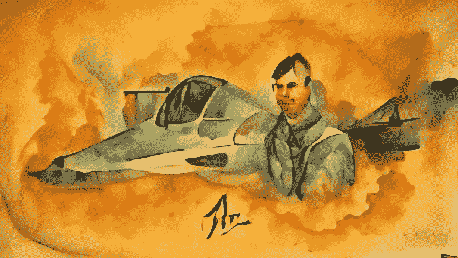

*一个飞行员在他的飞机前面，VQGAN+CLIP。* [*德米特里·索什尼科夫*](http://soshnikov.com)

还有一个 DALL-E 的俄罗斯变种，叫做 [ruDALL-E](https://rudalle.ru/) ，这个[已经被 Sber/](https://habr.com/ru/company/sberbank/blog/586926/) [SberDevices](http://sberdevices.ru/) 和 [AIRI](https://airi.net/ru/) 训练过。那些型号和重量都是[自由分发的](https://github.com/ai-forever/ru-dalle)，他们用俄语作为提示语言。

*猫，坐在窗前看风景——通过* [*ruDALL-E 纵横比*](https://github.com/shonenkov-AI/rudalle-aspect-ratio) *生成，由*[*Dmitry Soshnikov*](http://soshnikov.com)生成

> 神经艺术社区的一个重要里程碑发生在 2022 年 8 月 21 日——名为[稳定扩散](https://huggingface.co/CompVis/stable-diffusion)的最先进的神经生成模型的代码和权重由[稳定](http://stability.ai/)[公开发布](https://stability.ai/blog/stable-diffusion-public-release)。艾

# 稳定扩散

在这篇文章中，我不会详细讨论稳定扩散是如何工作的。简而言之——它结合了 Imagen(在训练期间在文本解释模型中使用冻结的权重)和上一代生成模型的最佳思想，称为**潜在扩散**。主要思想是使用 autoencoder 将原始 512x512 图片转换到更低维的空间——所谓的*潜在表示*，然后使用*扩散*过程合成这个表示，而不是完整的图片。与对像素表示进行操作的模型相比，潜在扩散花费更少的时间和计算资源，并且给出更好的结果。在开放的 [LAION](https://laion.ai/) 数据集上训练稳定扩散。

我有机会参加稳定扩散训练的早期阶段，这给了我一些时间来准备这个简短的概述它的能力。

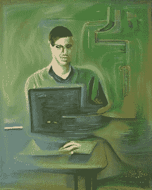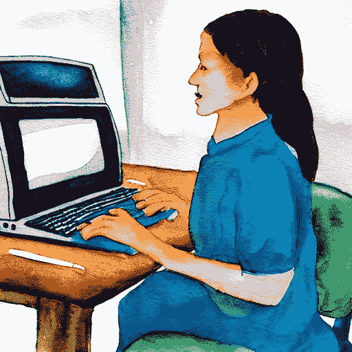

*计算机系青年男教师油画肖像* — VQGAN+CLIP(左)*计算机系青年女教师水彩画* — [稳定扩散](https://github.com/CompVis/stable-diffusion)(右) [Dmitry Soshnikov](http://soshnikov.com) 生成

如这个例子所示，与 VQGAN+CLIP 相比，稳定扩散给出明显更好的结果。这就是为什么我认为稳定扩散模型的公开发布是艺术/设计生态系统的重要一步，因为它赋予了艺术家非常强大的神经图像生成的新能力。

正如《稳定扩散》的创作者所说，最终我们有了一个模型，这个模型让*知道很多关于图像的事情。例如，模特知道大多数名人的长相(除了我最喜欢的[弗朗卡·波滕特](https://ru.wikipedia.org/wiki/%D0%9F%D0%BE%D1%82%D0%B5%D0%BD%D1%82%D0%B5,_%D0%A4%D1%80%D0%B0%D0%BD%D0%BA%D0%B0)):*

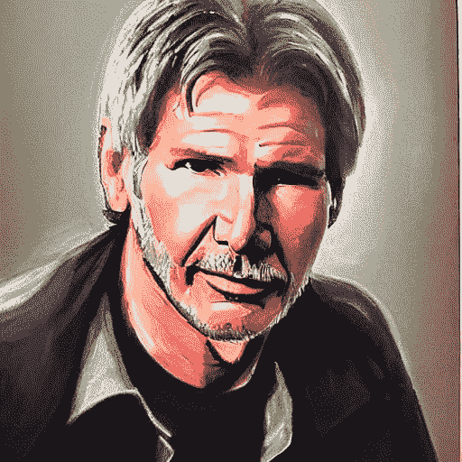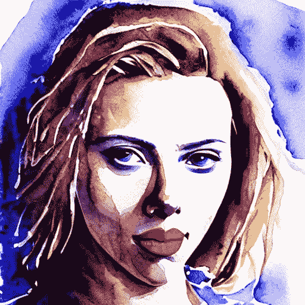

*从左至右:哈里森·福特的油画肖像、*斯嘉丽·约翰逊的水彩肖像、杰瑞德·莱托的蜡笔画—[德米特里·索什尼科夫](http://soshnikov.com)生成

这个例子还显示了模型可以使用不同的技术创建图像:油画、粉彩、水彩或铅笔素描。但这还不是全部——它还可以模仿特定艺术家的风格:

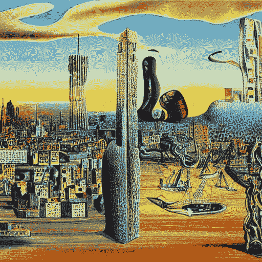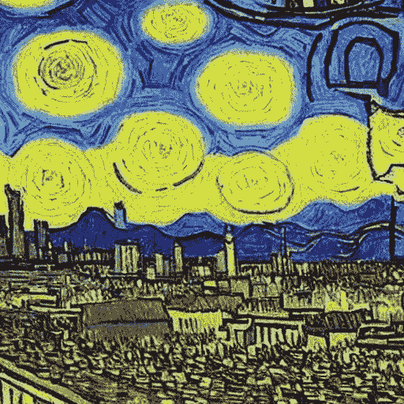

不同艺术家风格的图片，由提示生成*大城市风景由<作者姓名>，由*生成[德米特里·索什尼科夫 ](http://soshnikov.com)

此外，该网络知道世界各国首都的著名景点:

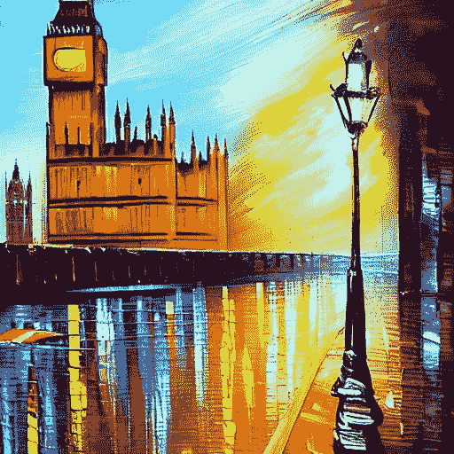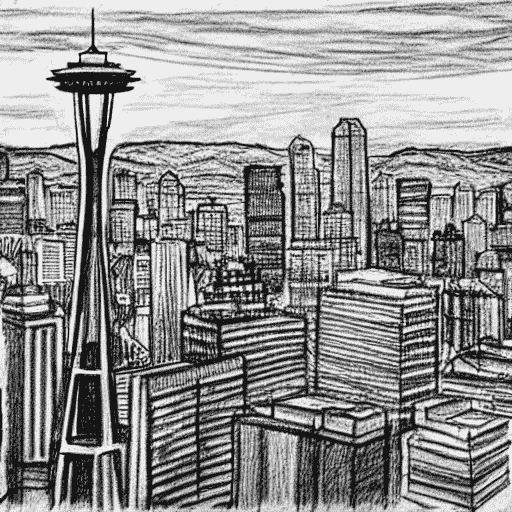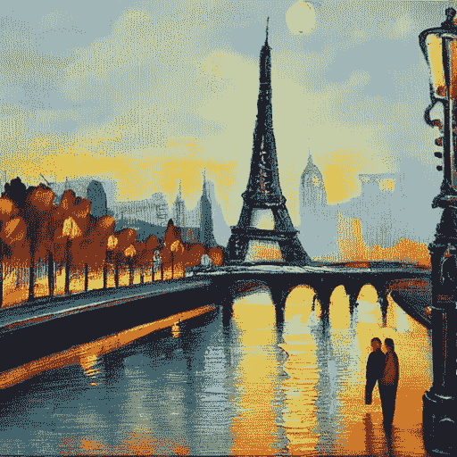

*伦敦，油画由* [*稳定扩散*](https://github.com/CompVis/stable-diffusion) *(左)，西雅图，铅笔素描由* [*稳定扩散*](https://github.com/CompVis/stable-diffusion) (中)，水彩由 [*稳定扩散*](https://github.com/CompVis/stable-diffusion) *(右)——生成由* [*德米特里·索什尼科夫*](http://soshnikov.com)

上面的例子展示了网络能够*记忆*图像并且*将*图像与不同的风格/技术相结合。我们也可以试着看看网络是如何想象抽象概念的，比如**爱情**、**孤独**或者**绝望**:

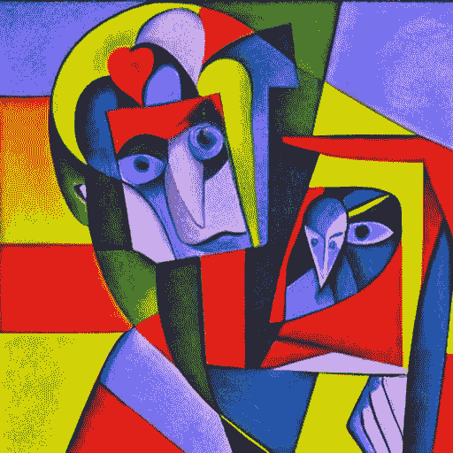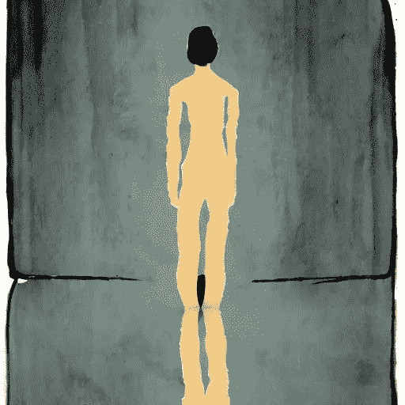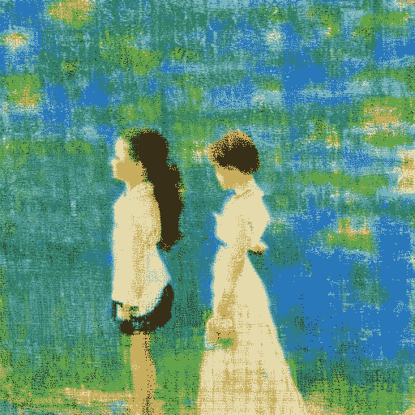

*抽象的爱情概念，立体主义*(左)*抽象的孤独概念*(中)*分离，印象派风格(右)——生成经由*<https://github.com/CompVis/stable-diffusion>**稳定扩散由* [*德米特里·索什尼科夫*](http://soshnikov.com)*

# *怎么试？*

*尝试稳定扩散最简单的方法是使用 [Dream Studio](http://beta.dreamstudio.ai/) ，这是 Stability.AI 最近发布的一款工具，目前它只包括通过文本提示生成，但很快他们承诺会添加额外的功能，如修复或图像到图像生成。它给你有限数量的图像生成来玩。*

*类似的神经图像生成工具还有[夜咖](https://creator.nightcafe.studio/)。除了生成，你还可以成为社区的一部分，分享你的成果，参与讨论。*

*对于那些能够使用 Python 和 Pytorch 的人，请随意使用 [Colab 笔记本](https://colab.research.google.com/github/huggingface/notebooks/blob/main/diffusers/stable_diffusion.ipynb)。*

# *哪里/如何使用神经生成*

*一旦你得到了他非常强大的神经生成工具，并且有机会玩它，你很快就会开始问这个问题——**那又怎样？你如何使用这个工具？***

*当然，你现在可以生成许多美丽的绘画图像，将它们打印在画布上，并开始在当地的跳蚤市场上出售。或者你可以声称自己是这些作品的作者(或者至少是与艾的合作作者)，并开始安排自己的展览，或者参加第三方展览。但是有那么简单吗？*

*先把你能不能把 AI 创作称之为“艺术”，卖“廉价”图片能赚多少钱的问题放一边。让我们想想神经生成的其他生产性用途:*

*   ***随机产生的灵感**。有时，在寻找一个新的想法或构图时，艺术家随机地在画布上泼洒颜料，寻找灵感，或者他们使用湿水彩颜料，试图适应颜色在整体画面中的随机扩散。这种随机性正是神经网络所做的——它随机地将以前在训练数据集中看到的图像模式放在一起。在许多情况下，神经网络可以给我们意想不到的结果——就像在下面的例子中，当我们要求它生成一个三角形嘴巴的男人时，却得到了一个嘴巴周围有红色东西的有趣图像。这个意想不到的形象可以给艺术家一个新的思考方向。*

*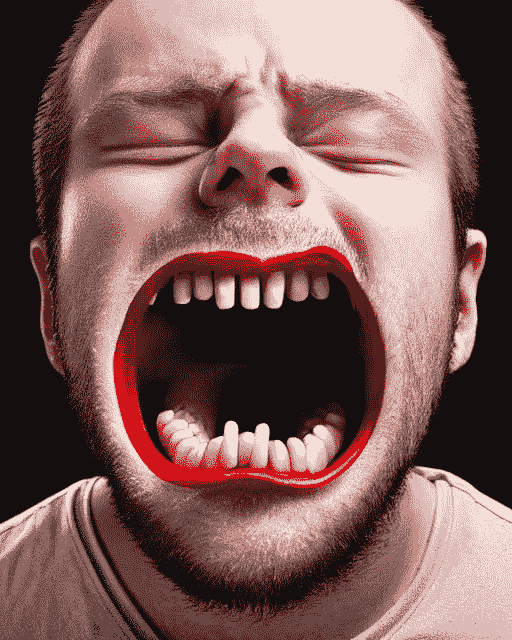**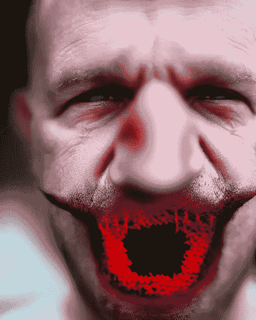*

**一个嘴巴张得大大的人的吓人照片(左)，一个嘴巴张得像等边三角形的人的吓人照片(右)——生成通过* [*稳定扩散*](https://github.com/CompVis/stable-diffusion) *通过* [*德米特里·索什尼科夫*](http://soshnikov.com)*

*   ***绘制人工制品**。在某些情况下，一件艺术品的主要价值在于想法和信息，而不在于实际的实现。像这样的图像起着次要的作用，我们可以利用人工智能来生成这些图像。例如，我们可以使用人工智能来生成营销横幅的图像，或者为一些国际活动生成不同国籍的人的图像。*

*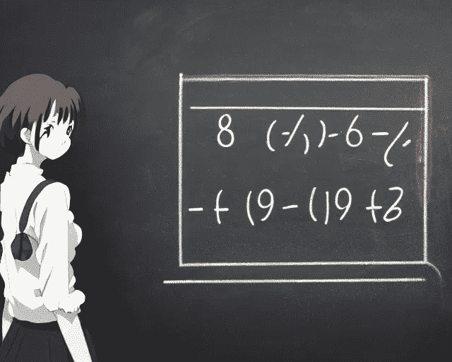***

*可以用作横幅的动漫作品——通过[稳定传播](https://github.com/CompVis/stable-diffusion)由 [Dmitry Soshnikov](http://soshnikov.com) 生成*

*   *获得灵感的方法之一是观看不同人制作的神经生成流。这是一个在短时间内看到许多非常不同的想法的好方法，可以拓宽我们的思维视野，帮助我们产生新的想法，然后用传统的方式表达出来。这个我以后再讲。*
*   *除了传统的数字工具和技术之外，使用神经生成作为起点，或者作为实现最终人工制品的步骤之一。这让我们能够更好地控制如何表达最初的想法，并使我们真正成为人工智能产品的**共同作者**，允许融合人工智能和我们自己的想法。*
*   *前一点的一个变化是顺序使用神经生成，使用诸如**修补**(使用神经生成重新生成或填充图像内的区域的能力)、**图像到图像**(当我们将文本提示与初始草图一起使用时，显示整体构图，并要求网络产生详细的图像)，或通过潜在空间搜索来找到最初创建的图像的变化。*
*   ***用于教育的神经生成**。由于生成网络“知道”知名艺术家的风格和不同的艺术技巧，我们可以通过动态生成样本图像来在艺术教育中使用这一点。比如我们可以拿一个日常用品(比如*勺子*)，让网络用不同艺术家的风格画出来。这使得教育更具互动性，并可能对学习者产生更多情感影响，因为他们自己成为创造过程的一部分。*

*我相信你可以想到文本到图像的神经生成的许多其他用途！欢迎在评论中提出建议！*

*顺便说一下，我们仍然需要解决的一个有趣的问题是这些过程产生的人工制品的版权问题。拥有封闭网络的公司(如 DALL-E/OpenAI)通常声称对网络产生的结果拥有所有权，而稳定传播则采用更加开放的[creativml open rail M 许可证](https://github.com/CompVis/stable-diffusion/blob/main/LICENSE)，该许可证赋予艺术家对创作内容的所有权(和责任)，同时明确禁止某些不道德的使用场景。*

# *快速工程的艺术*

*文本到图像的生成看起来似乎很简单，但实际上，要得到想要的结果，仅仅写一个简短的提示是不够的，比如“ **a girl** ”。下面的例子显示了我们如何使提示更加精细，以达到我们想要的结果:*

*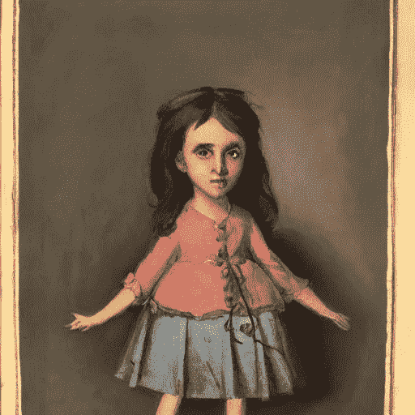*****

**一个女孩*(左)*一个漂亮女孩的肖像*(中)*一个金发碧眼的漂亮欧洲女孩，虚幻引擎，在 Artstation 上流行(右)——生成经由* [*稳定扩散*](https://github.com/CompVis/stable-diffusion) *由* [*德米特里·索什尼科夫*](http://soshnikov.com)*

*网络看到了很多图像，知道了很多，但有时很难达到一些特定的结果，因为*网络的想象力是有限的*。换句话说，它从未在训练数据集中见过这样的组合，并且它很难将几个高级概念组合在一起。一个很好的例子就是我们在上面看到的*一个长着三角嘴的男人*的形象。*

*为了达到接近你脑海中想象的图片的效果，你可能需要几个文本提示，使用一些特殊的技巧来微调图像。以下是其中的一些技巧:*

*   ***明确提及技法** : *比尔·盖茨水彩肖像*，或*比尔·盖茨布面油画**
*   *在提示中提供**具体艺术家**的名字:*比尔·盖茨肖像，毕加索* — [稳定扩散艺术家指南](https://proximacentaurib.notion.site/e2537cbf42c34b7e9a9a4126f81dfd0d)*
*   *提供**日期/时间段** : *比尔·盖茨观看 IBM PC 个人电脑示意图，老照片，20 世纪 60 年代**
*   *使用一些**修改器** : *棕褐色*，*哑光*，*高细节*等。[稳定扩散调节剂指南](https://proximacentaurib.notion.site/2b07d3195d5948c6a7e5836f9d535592)*
*   *使用一些可能出现在训练数据集中的**额外修改器**，如*虚幻引擎*、artstation 上的*趋势*、 *8k* 等。*

*除了提示本身，您还可以控制其他一些生成参数:*

*   ***图像尺寸**。稳定扩散是在 512x512 图像上训练的，但您可以在生成过程中指定不同的图像大小，主要限制是您的 GPU 的视频内存。然而，请记住，网络*试图用一些有意义的细节*填充图像的所有区域。例如，如果您在宽水平图像中要求一个肖像，结果将可能包含几个人的肖像。克服这一点的一个方法是明确地在空白空间中作为网络来画一些东西。*
*   ***扩散的步骤数**。少量的步骤导致图像不太详细，有时看起来很好。然而，一般来说，步骤越多越好。[例题](https://proximacentaurib.notion.site/Stable-Diffusion-Steps-6a7c7e61e6ed4c2f9516e4f67075d7f2)*
*   ***引导比例**(或 *cfg 比例*)参数控制文本提示的权重，即指定生成的图像与我们的提示的精确对应程度。较小的数字给网络更多的灵活性来绘制它想要的，这通常会导致更一致的图像。较高的数字有时会导致混乱的结果，但通常更适合提示。*

# *AI 能有创造力吗？*

*大约两年前，我在我关于人工智能和艺术的博客文章中思考过同样的问题。从那时起，创造人工智能艺术的过程被大大简化了。在 GANs 时代，艺术家必须收集根据一些标准选择的图像数据集，训练 GAN 模型(这不仅需要时间，而且通常是非常棘手的过程)，然后从 100 多幅生成的图像中挑选一些好的人工制品。现在几乎任何稳定扩散或者中途生成的图像看起来都比较好。*

*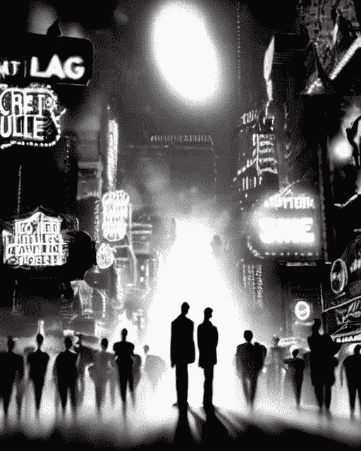**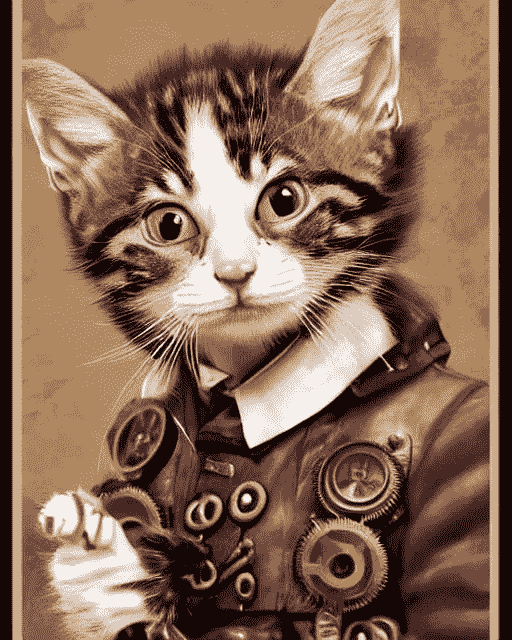**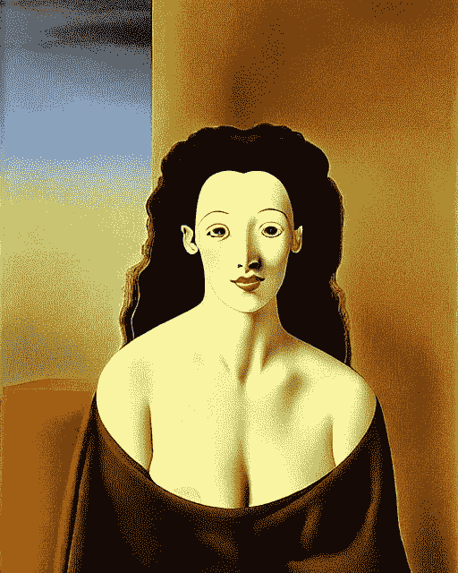*

*黑暗城市之夜(左)，蒸汽朋克小猫#13(中)，神经达利的年轻女人(右)——由[德米特里·索什尼科夫](http://soshnikov.com)，经由[稳定扩散](https://github.com/CompVis/stable-diffusion)*

*我们是否应该称**为艺术**是从我们刚刚想到的一个想法在几分钟内创造出来的东西，这确实是有疑问的。我喜欢采用一个原则，而**艺术是人们愿意为**付费的东西——然而，根据这个原则，我们不太可能看到对现在充斥互联网的成千上万的中途/稳定扩散生成的图像的大量需求。*

> **合适的人工智能艺术总是由人类和神经网络共同努力创造出来的。随着 AI 变得更有能力，一个人类艺术家需要思考他/她能带来的* ***附加值*** *。没有我们增加的足够的价值——我们无法感到自豪或真正拥有工作，我们也不会有成就感。**

*思考我们带来的价值的另一面，是思考 AI 能给我们的艺术过程带来的价值。但是我们需要考虑平衡。*

*当使用文本到图像模型时，即使我们不对图像应用任何后处理，人类艺术家的重要作用如下:*

*   ***提出最初的想法**。创作一件艺术品是为了向世界表达某种观点，并对观众产生情感上的影响，这种影响会放大这种观点。只有渴望创造和自我表达的人才能知道他/她想对世界说什么。*神经网络没有自我表达的欲望*。*

***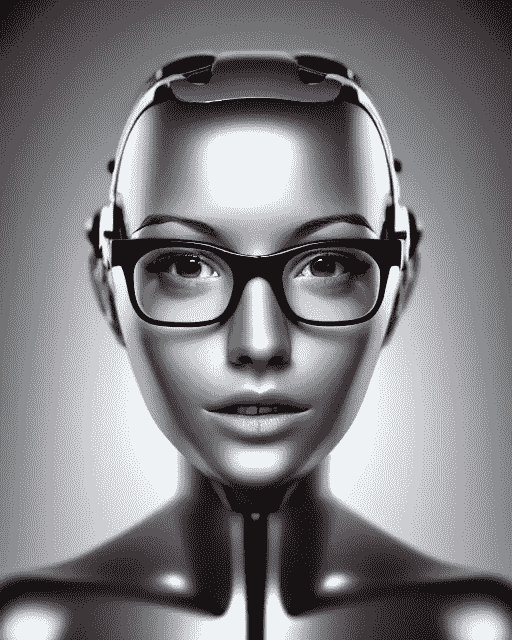**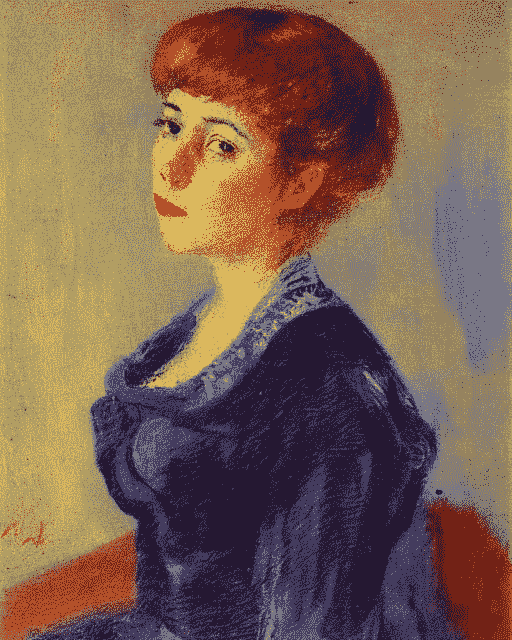**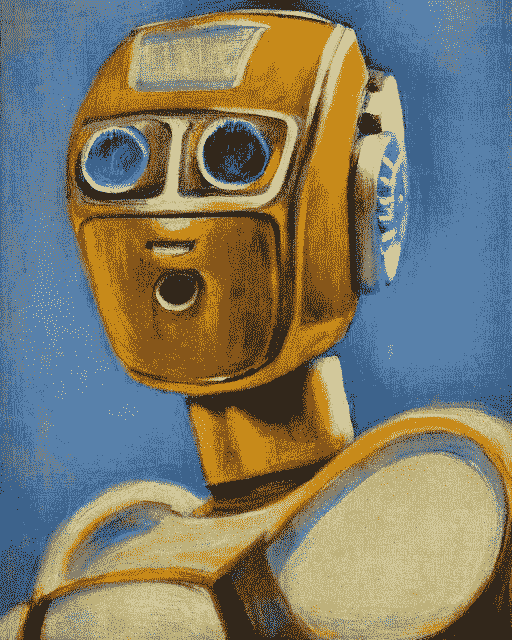*

*来自 [Dmitry Soshnikov](http://soshnikov.com) 的“人与机器人”集合，通过[稳定扩散](https://github.com/CompVis/stable-diffusion)生成*

*   ***提示工程**我们已经讲过了。*
*   *根据只有人类才有的美丽或情感效果的标准来挑选结果。尽管有人试图收集能引起“共鸣”且情感强烈的图像数据集，但目前尚不可行的是，将美的概念形式化，或建立一个分类器来确定好的艺术与坏的艺术。*
*   *想想**对作品**的定位以及如何让它为世人所知，或者说如何“推销”它(这个词的广义)。一个除了你没有人会看到的生成的图像对人类来说没有什么价值。除非在你死后人们会发现它，它会让你出名——但我对此不抱太大希望。*

*正如我已经强调的，随机的文本到图像的生成并不太有趣，在许多情况下，我们会看到艺术家使用神经生成来实现他们的想法，使用像修补，图像到图像，生成视频([穿越时间](https://www.youtube.com/watch?v=Bo3VZCjDhGI)就是一个很好的例子)，或者探索潜在的空间并看到相应的图像转换。*

> **在过去的某个时间点，摄影取代了经典的肖像和风景画，迫使艺术家们寻找更具创造性的方式来可视化我们的现实。类似地，神经艺术的产生会导致更有趣的想法和技术，并将提高艺术家的创造力。**

# *体验神经艺术的新方式*

*我们经常来博物馆和画廊体验传统艺术。在某种程度上，博物馆和画廊展示的是经过社区过滤的策划内容。人工智能艺术的数字本质允许不同形式的策展。此外，由于生成人工智能图像比制作传统绘画要“便宜”得多，我们面临的图像量要大得多。*

*最初，稳定扩散和中途等生成模型是通过 Discord 社区向测试者开放的，在那里你可以使用机器人来进行生成。稳定扩散社区有 40 多个频道，每个频道都是从某人的文本提示中产生的几乎持续不断的图像流。网络创建者使用这些反馈在大量不同的文本提示上测试模型。*

## *神经生成流*

*作为这个社区的成员之一，我注意到观看这些源源不断的不同图像非常鼓舞人心！在博物馆里，我们看到的作品数量相对较少，每件作品背后都有一位伟大的艺术家和一个故事，与此不同，在神经生成流中，我们看到大量未经剪辑的图像，制作成本很低。然而，这并没有让这些艺术品变得无趣——它们中的许多都包含着原创的想法，或者至少是*的暗示*，让我们的大脑迸发出自己的想法和情感。我们只需要调整我们的“艺术消费习惯”来处理这种源源不断的需求。*

> *你可以把参观博物馆比作去餐馆，在那里你可以享用精心挑选的菜肴和葡萄酒。消费神经生成流就像一个自助餐，你可以吃到各种国际菜肴，有 20 种碳酸饮料。*

*稳定扩散不协调中的神经生成通道是混乱的，但我们也可以想象按主题分离这些通道，这样一个流中的所有图像都有一些主题约束。例如，我们可以让一个流显示猫和小猫，另一个流显示遥远星球的风景。*

## *艺术对象中神经生成的整合*

*使用神经生成的方法之一是将其构建到一个更大的艺术对象中，其中最终结果将由自动构造的文本提示生成。作为一个例子，我们可以想象一个系统，它将在社交网络中获取一个人的个人资料，以某种方式从他/她的帖子中提取他的口头画像，然后使用稳定的扩散来产生一个**社交网络画像**。*

## *神经生成党*

*如果我们有机会通过某种互动过程参与到艺术创作的过程中，我们会更加情绪化，这不是什么秘密。此外，让我们考虑到艺术的重要作用是鼓励我们思考，甚至更好——进行对话并得出一些结论。*

**

*神经生成党，布面油画——由[德米特里·索什尼科夫](http://soshnikov.com)通过[稳定扩散](https://github.com/CompVis/stable-diffusion)生成*

*拥有这种互动和对话的一个很好的方式是组织一个**神经生成聚会**——这是我们最近和几个朋友尝试的一种形式，现在正在寻求扩大规模。一个想法就是召集一群人(最好是线下，有一些酒和开胃菜，但线上也是一个选项)，一起做神经生成。*

*以下是一些让它更有条理的规则:*

*   *为聚会确定一个主题，例如孤独、爱情或生命的意义。这将限制我们的探索，但也使它更有意义，围绕一个重要的想法，我们想探索。*
*   *我们可以用一个非常简单的提示来开始生成，然后根据我们到底想在图片中看到什么来使它变得更详细。例如，我们可以从“孤独”这个词开始，然后到达“两个老人互相看着对方”这样的东西。我们可以从网络生成的图像、与观众的对话和小组讨论中获得更多的含义和想法。*
*   *我们也可以要求观众说出他们对正在探索的概念的联想，以及哪些风格和艺术家与之相关联。然后，我们可以立即进行实验，并获得视觉确认。*
*   *神经生成的所有步骤都应该被**记录**/保存，并且作为聚会的结果，我们可以**发布最好的结果**——在博客帖子中，或者一篇文章中，或者甚至考虑参加一个展览。*

*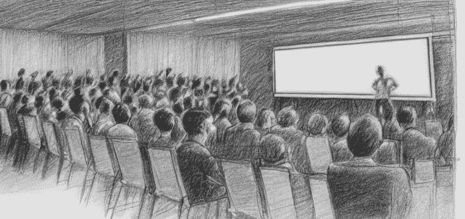*

*神经生成党，铅笔素描——由 [Dmitry Soshnikov](http://soshnikov.com) 通过[稳定扩散](https://github.com/CompVis/stable-diffusion)生成*

*为什么我认为这种形式很棒:*

*   *神经生成作为**统一的理由来谈论一个重要的话题**。即使我们没有创造任何伟大的人工制品(这不太可能)——我们也会喜欢彼此交谈。这个演讲是有条理的，也是一个互相了解的好方法。*
*   *在晚会期间，我们将看到许多新创作的艺术作品，可以比作**集体参观博物馆**。*
*   *图像将在那里被创建，来自我们想出的提示——这使得**每个参与者都是共同创建者**，并从快速的结果中给他带来创造力和多巴胺的快乐。*

*要举办一场成功的派对，以下角色非常重要:*

*   *提示大师(Prompt Master)——对神经生成有一定经验的人，可以调整文本提示。在大多数情况下，他也是负责技术方面的人——如何运行 Jupyter 笔记本或神经生成工具，如何保存图像等。*
*   ***艺术专家**，他知道不同的艺术风格和技巧，还能指导创作过程，估计结果有多有价值。*
*   *所有其他参与者不需要特殊技能，可以根据自己的喜好扮演更主动或更被动的角色。然而，鼓励人们积极参与是一个好主意——为此你可能还需要一个**主持人**。*

*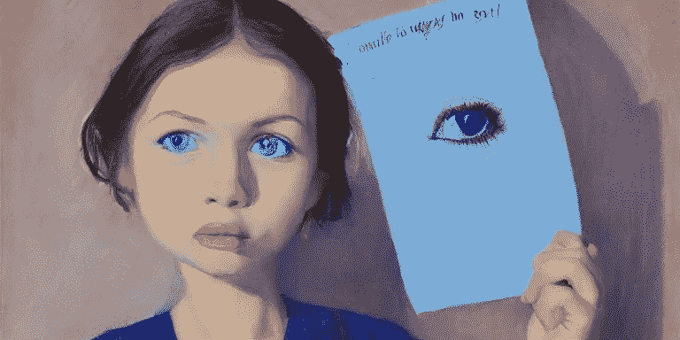*

# *外卖食品*

*我们生活在一个非常有趣的时代，当神经网络变得有创造力时(真的吗？)，并可以自动化视觉艺术家或故事作家越来越多的工作。我真诚地希望它能引领我们人类创造出新的艺术形式和风格，并扩展和丰富我们对世界的感知。为了实现这一点，重要的是我们不仅要仔细观看这一场景，而且要积极参与和实验！*

**原载于 2022 年 8 月 22 日 https://soshnikov.com*<https://soshnikov.com/scienceart/neural-generative-models-and-future-of-art/>**。***