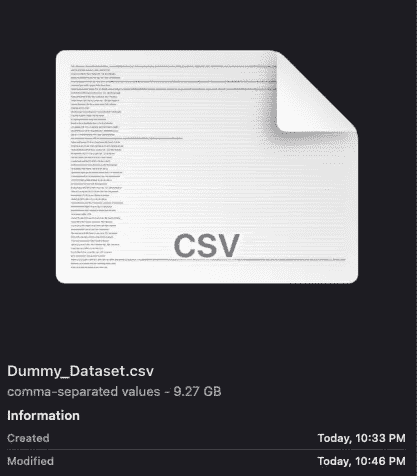
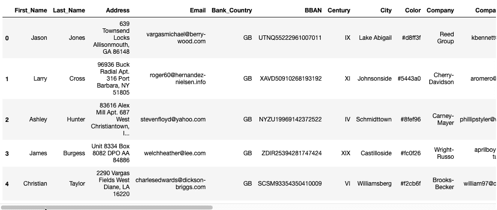
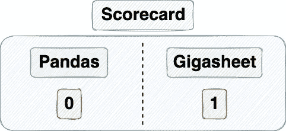
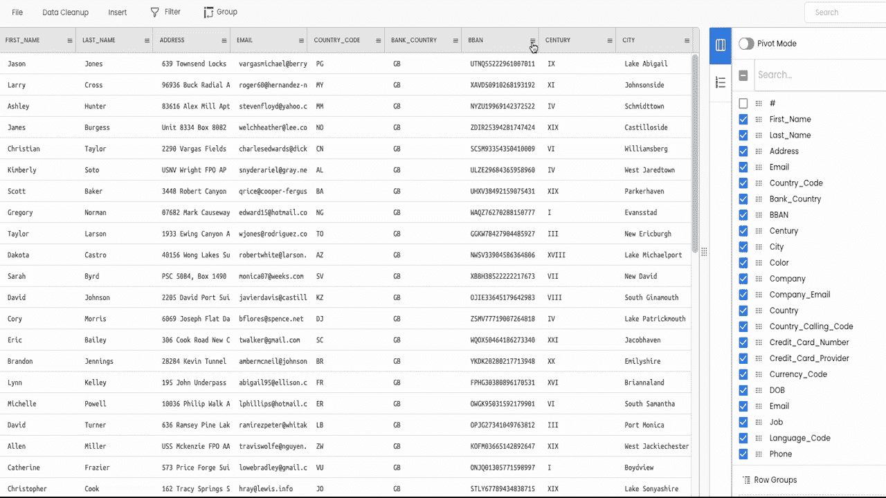
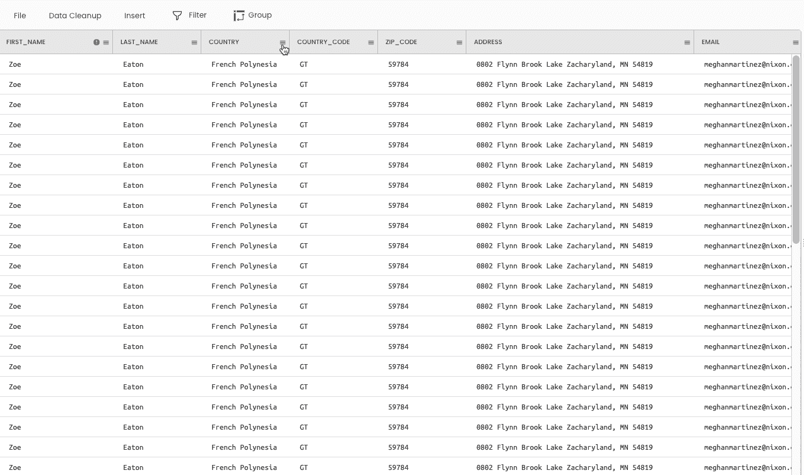
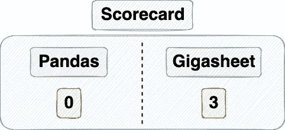

# 永远不要担心优化。使用无代码 Pandas 将数 GB 的表格数据处理速度提高 25 倍

> 原文：<https://towardsdatascience.com/never-worry-about-optimization-process-gbs-of-tabular-data-25x-faster-with-no-code-pandas-e85ede4c37d5>

## 没有更多的运行时和内存优化，让我们直接开始工作

[自由股票](https://unsplash.com/@freestocks?utm_source=medium&utm_medium=referral)在 [Unsplash](https://unsplash.com?utm_source=medium&utm_medium=referral) 上的照片

# 动机

Pandas 使分析表格数据集的任务变得轻而易举。圆滑的 API 设计提供了广泛的功能，几乎涵盖了所有的表格数据用例。

然而，只有当有人向规模化过渡时，他们才会体验到熊猫的深远局限性。我以前在下面的博客中谈到过这个问题:

  

总之，**panda 几乎所有的限制都源于它的单核计算框架**。

换句话说，即使您的 CPU 有多个可用(或空闲)的内核，Pandas 也总是依赖于单个内核，这抑制了它的性能。

此外，熊猫的数据帧天生就很大。Pandas 从不优化 DataFrame 的列的数据类型。因此，如果您必须处理大型数据集(大小为 GBs):

1.  您应该一次只在内存中加载一个数据块，处理它，丢弃它并加载下一个数据块，或者，
2.  如果出于某种原因，您需要整个数据集，那么您应该调整数据类型以适应内存。

此外，在许多情况下，数据通常被分割到多个 CSV 文件中。因此，如果您想一起分析整个数据，必须[合并多个 CSV 文件](https://www.gigasheet.com/post/merge-csv-files)的数据，然后对其进行处理。

我在之前的一篇博客中讨论了更多的方法:

  

不幸的是，如果您需要内存中的整个数据集，但是尽管优化了内存使用，您还是不能加载它，那么您就不走运了。

即使你成功地加载了数据集，也不能保证你能够处理它。

由于中间计算也需要内存，这可能最终导致以下情况:

内核死亡(图片由作者提供)

回到起点。

我相信你们很多人都去过那里。我知道这令人沮丧，特别是当你的目标是进行快速分析时，比如绘制一些条形图，估计组统计数据等。

此外，老实说，除非您正在构建一个旨在为最终用户服务的数据科学管道，否则数据科学家为什么要花费数小时来优化内存呢？在我看来，这抑制了他们的生产力。

# 解决办法

我希望在这一点上，你明白这个问题是真实的。

为此，让我们讨论一个潜在的解决方案——[giga sheet](https://www.gigasheet.com/)，在我看来，它是熊猫的革命性替代方案，不仅适用于大型数据集，也适用于小型数据集。

在下面的博客中，我详细介绍了如何使用 Gigasheet 从 Pandas 过渡到“无代码 Pandas”。

  

然而，这篇博客的重点略有不同。

在这篇博客中，我将简要展示在熊猫身上处理大型数据集是多么具有挑战性，以及 Gigasheet 是如何让它变得轻而易举的。

此外，Gigasheet 这样的工具有两个最大的优势:

1.  你不用写任何代码。
2.  您不必担心运行时或内存优化。

太神奇了。我们开始吧🚀！

# 资料组

出于演示的目的，我将使用一个使用 [Faker](https://faker.readthedocs.io/) 创建的虚拟数据集。如下所示，它占用了 9gb 多一点的磁盘空间。

虚拟数据集大小(图片由作者提供)

前五行如下所示:

虚拟数据集的前五行(作者提供的 Gif)

此外，如下所示，数据集有 30 多行和 25 列。

Gigasheet Dashboard 中显示的行和列(作者图片)

# 熊猫大战 Gigasheet

接下来，让我们在 Pandas 中执行一些常见的操作，测量它们的运行时间，并将其与 Gigasheet 进行比较。

由于 Gigasheet 是一个无代码工具，测量运行时间有点挑战性。因此，为了比较，我将使用这里上传的屏幕记录的持续时间来近似 Gigasheet 的运行时间。

## #1 过滤

过滤是在表格数据分析期间执行的常见操作。让我们过滤`Country_Code`列上的数据帧，并选择值为`MY`的所有行。

→ **熊猫**

→ **Gigasheet**

选择“应用”后，计时器立即启动(作者 Gif)

在 Gigasheet 中过滤只花了两秒多一点。与耗时近 25 秒的熊猫相比，Gigasheet 快了 92%。

熊猫 vs. Gigasheet 记分卡(图片由作者提供)

## #2 分类

接下来，让我们对`BBAN`列上的数据帧进行升序排序。

→ **熊猫**

这里，我们可以使用`sort_values()`的方法。

→ **Gigasheet**

这些步骤如下所示:

选择“分拣纸张”后，计时器立即启动(作者 Gif)

在 Gigasheet 中排序需要 5 秒多一点的时间。另一方面，熊猫用了将近 2 分钟——性能提高了 **96%** 。

熊猫 vs. Gigasheet 记分卡(图片由作者提供)

## #3 分组

接下来，让我们对`Country`列上的数据帧进行分组，并找到一些东西:

1.  每组中的记录数。
2.  唯一的数量`Zip_Codes`。

→ **熊猫**

回忆我们在引言中讨论的内容:

> 即使你以某种方式成功加载了数据集，也不能保证你能够处理它。

## →千兆页

Gigasheet 中的分组(Gif by Author)

Gigasheet 计算所需的聚合没有任何麻烦。

熊猫 vs. Gigasheet 记分卡(图片由作者提供)

然而，Gigasheet 再次成为明显的赢家。

# 结论

在这篇博客中，我演示了如何利用 Gigasheet 并对大型数据集执行三种典型操作。

而在熊猫身上，执行这些操作确实需要相当长的时间。然而，Gigasheet 中的相同操作效率很高。

事实上，对于 Pandas，我们从未获得分组操作的结果，因为它破坏了 Jupyter 内核。另一方面，Gigasheet 名副其实，轻松处理一切。

在结束之前，我想补充的一点是，通过这篇文章，我并不是说 Gigasheet 是(或将会是)熊猫的最终替代品。

人们可以用 Pandas 或 Excel 做更多的事情，这是 Gigasheet 所做不到的。然而，除了没有代码之外，它轻松处理大型数据集的能力使它成为这种情况下的绝对赢家。

此外，Excel 最大的问题是它的最大行数限制。这阻碍了大规模数据分析项目的工作，而 Excel 不支持这种项目。

事实上，即使您正在处理中等大小的数据集，Gigasheet 也可以派上用场。我最近写了一篇关于从熊猫到 Gigasheet 转变的详细文章，你可以在这里阅读:

  

**一如既往感谢阅读**！

[🚀**订阅数据科学每日一剂。在这里，我分享关于数据科学的优雅技巧和诀窍，一天一个技巧。每天在你的收件箱里收到这些提示。**](https://avichawla.substack.com/)

[🧑‍💻**成为数据科学专家！获取包含 450 多个熊猫、NumPy 和 SQL 问题的免费数据科学掌握工具包。**](https://subscribepage.io/450q)

[**获取机器学习领域排名前 1%的研究论文、新闻、报道、推文的每周汇总。**](https://AlphaSignal.ai/?referrer=Chawla)

我喜欢探索、实验和撰写关于数据科学概念和工具的文章。你可以在 [LinkedIn](https://www.linkedin.com/in/avi-chawla/) 上和我联系。