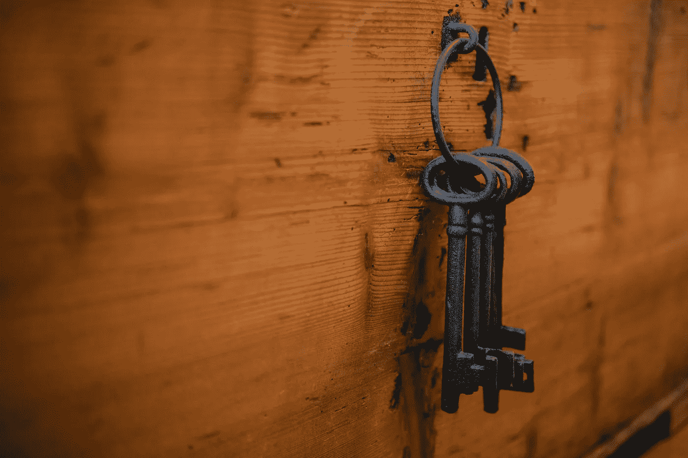

# 如何向 Python 字典添加新键

> 原文：<https://towardsdatascience.com/new-key-python-dict-e4c637f1f223>

## 在 Python 字典中添加新的键值对



照片由[Silas k hler](https://unsplash.com/@silas_crioco?utm_source=unsplash&utm_medium=referral&utm_content=creditCopyText)在 [Unsplash](https://unsplash.com/s/photos/key?utm_source=unsplash&utm_medium=referral&utm_content=creditCopyText) 拍摄

Python 字典是该语言中最强大和最常用的数据结构之一，因为它允许用户维护一组键值对。对于那些不太熟悉 Python 数据结构的人来说，字典相当于其他语言中的地图，比如 Java。

Python 字典是一个可变的、有序的(从 Python 3.7 开始，它们是插入有序的)键-值对集合，集合中的每个键都是唯一的(不同的键可能有相同的值)。

在今天的文章中，我们将演示如何对 Python 字典执行一些简单的操作，比如在现有对象中添加或更新键值对。

首先，让我们创建一个示例字典，我们将在整个教程中引用它来演示我们前面介绍的概念。

```
d = {
  'a': 100,
  'b': 'hello',
  'c': True,
}
```

## 如何在字典中添加单个键值对

在现有字典中添加键-值对的最简单方法是通过给(新的)所需键赋值:

```
>>> d['e'] = 'newValue'>>> print(d)
{'a': 100, 'b': 'hello', 'c': True, 'e': 'newValue'}
```

请注意，如果该键已经存在，上述操作将用新指定的值替换旧值。如果您想确保只有在键不存在的情况下才添加新值，您可以在运行上述赋值之前简单地进行检查:

```
if 'e' not in d.keys():
   d['e'] = 'newValue'
```

或者，您也可以使用`update()`方法在现有字典中添加新的键值对。该方法接受另一个字典作为输入(包含新的键值对):

```
>>> new = {'e': 'newValue'}
>>> d.update(new)
>>> print(d){'a': 100, 'b': 'hello', 'c': True, 'e': 'newValue'}
```

事实上，您甚至可以用几种不同的方式调用`update`方法:

```
>>> d.update(e='newValue')
# OR
>>> d.update(dict(e='newValue'))
```

然而要注意的是，赋值方法在计算上比`update()`更便宜。

最后，从 Python 3.9 开始，`|=`操作符也可以用来更新字典。

```
>>> d |= {'e': 'newValue'}
>>> print(d)
{'a': 100, 'b': 'hello', 'c': True, 'e': 'newValue'}
```

## 添加多个键值对

我们在上一节中讨论的`update`方法是一次性添加多个键值对时最常用的方法。

```
>>> new = {'e': 'newValue', 'f': 'anotherValue'}
>>> d.update(new)
>>> print(d){'a': 100, 'b': 'hello', 'c': True, 'e': 'newValue', 'f': 'anotherValue'}
```

同样，我们也可以使用我们之前介绍的`|=`(如果在 Python 3.9+上)来添加多个新的键值对:

```
>>> d |= {'e': 'newValue', 'f': 'anotherValue'}
>>> print(d){'a': 100, 'b': 'hello', 'c': True, 'e': 'newValue', 'f': 'anotherValue'}
```

## 更新字典

同样，我们可以使用前面探索过的各种方法来更新字典中现有的键值对。

当我们对字典中已经存在的键进行赋值时，所赋的值将覆盖相应的值:

```
>>> d['a'] = 200
>>> print(d)
{'a': 200, 'b': 'hello', 'c': True}
```

或者，要一次更新多个元素，可以使用`update`方法:

```
>>> updated = {'a': 200, 'c': False}
>>> d.update(updated)
>>> print(d)
{'a': 200, 'b': 'hello', 'c': False}
```

## 最后的想法

Python dictionary 是一个非常强大的数据结构，用于促进日常编程任务中不同种类的操作。

在今天的简短教程中，我们演示了如何在现有的字典集合中插入新的键值对，以及如何更新单个或多个元素。

[**成为会员**](https://gmyrianthous.medium.com/membership) **阅读媒体上的每一个故事。你的会员费直接支持我和你看的其他作家。你也可以在媒体上看到所有的故事。**

<https://gmyrianthous.medium.com/membership>  

**相关文章你可能也喜欢**

</python-iterables-vs-iterators-688907fd755f>  </diagrams-as-code-python-d9cbaa959ed5>  </python-poetry-83f184ac9ed1> 