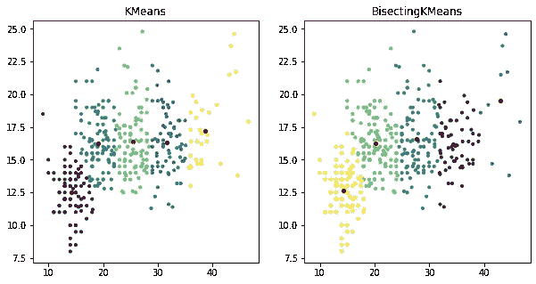
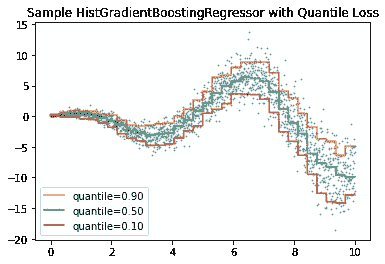
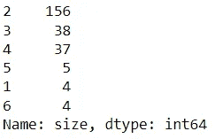
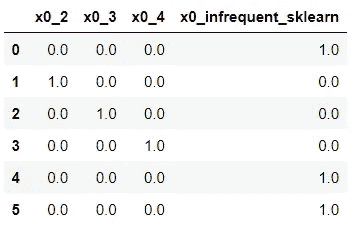

# 新的 Scikit-Learn V.1.1.0 更新版本主要亮点

> 原文：<https://towardsdatascience.com/new-scikit-learn-v-1-1-0-update-release-top-highlight-f2f94985c63e>

## 来自 Scikit 的激动人心的更新-了解


[斯科特·格雷厄姆](https://unsplash.com/@homajob?utm_source=medium&utm_medium=referral)在 [Unsplash](https://unsplash.com?utm_source=medium&utm_medium=referral) 上拍照

[Scikit-Learn](https://scikit-learn.org/stable/index.html) 是使用 Python 环境的数据科学家的主要机器学习包。该软件包提供了许多在我们日常工作中使用的有用的 API。

2022 年 5 月，Scikit-Learn 发布了新的 V.1.1.0 更新，提供了各种令人兴奋的功能更新。有哪些更新？让我们开始吧。

但是，请在我们离开之前将 Scikit-Learn 更新到最新版本。

```
pip install --upgrade scikit-learn
```

# 平分意味着

平分 K 均值是 Scikit-Learn 中无监督机器学习 K 均值的一个新的附加变体。该方法在聚类过程中实现了简单的除法分层算法。

在正常的 K-Means 中，聚类过程是通过同时创建 K 个质心来进行的。将通过计算簇内和簇间相似性来评估所得的簇。星团的质心类似于重心。

然而，在分割 K-Means 时，我们并没有同时创建 K 形心。相反，质心是基于前一个聚类逐步选取的。我们每次都要分割集群，直到达到 K 的数目。

使用二等分 K-Means 有几个优点，包括:

*   如果有大量集群，效率会更高
*   更便宜的计算成本
*   它不会产生空簇
*   聚类结果是有序的，将创建一个可见的层次结构。

让我们尝试一个简单的比较正常的 K-均值和平分 K-均值。我将使用 seaborn 包中的一个样本数据集来模拟结果。

```
import numpy as np
from sklearn.cluster import KMeans
import seaborn as sns
from sklearn.cluster import KMeans, BisectingKMeans
import matplotlib.pyplot as pltmpg = sns.load_dataset('mpg')
mpg = mpg.dropna().reset_index(drop = True)X = np.array(mpg[['mpg', 'acceleration']])km = KMeans(n_clusters=5, random_state=0).fit(X)
bisect_km = BisectingKMeans(n_clusters=5, random_state=0).fit(X)fig, ax = plt.subplots(1, 2, figsize=(10, 5))
ax[0].scatter(X[:, 0], X[:, 1], s=10, c=km.labels_)
ax[0].scatter(km.cluster_centers_[:, 0], km.cluster_centers_[:, 1], s=20, c="r")
ax[0].set_title("KMeans")ax[1].scatter(X[:, 0], X[:, 1], s=10, c=bisect_km.labels_)
ax[1].scatter(
    bisect_km.cluster_centers_[:, 0], bisect_km.cluster_centers_[:, 1], s=20, c="r"
)
_ = ax[1].set_title("BisectingKMeans")
```



作者图片

如上图所示，二等分 K-Means 可以有效地、直观地为最远部分的数据创建一个聚类。

# 基于 HistGradientBoostingRegressor 的分位数损失函数建模

Scikit-Learn 中的 HistGradientBoostingRegressor 是一个梯度推进回归器，是一个集成树模型，具有基于直方图的学习模型。

基于直方图的模型比普通的梯度推进回归模型更有效，因为该算法将连续特征绑定到用于训练目的的离散箱中，而不是通常的分裂技术。

根据文档，HistGradientBoostingRegressor 模型适用于超过 10.000 个样本的大数据集。

在最近的更新中，HistGradientBoostingRegressor 增加了一个新的分位数损失函数供我们使用。分位数损失函数预测可能的范围，我们称之为预测区间。您可以在这篇文章[中进一步阅读分位数回归建模。](/quantile-regression-from-linear-models-to-trees-to-deep-learning-af3738b527c3)

通过一个额外的分位数损失函数，我们现在可以通过`loss="quantile"`并使用新的参数`quantile`。使用下面的教程，我们可以跟踪每个分位数的回归预测。

```
from sklearn.ensemble import HistGradientBoostingRegressor
import numpy as np
import matplotlib.pyplot as plt# Simple regression function for X * cos(X)
rng = np.random.RandomState(55)
X_1d = np.linspace(0, 10, num=2000)
X = X_1d.reshape(-1, 1)
y = X_1d * np.cos(X_1d) + rng.normal(scale=X_1d / 3)quantiles = [0.9, 0.5, 0.1]
parameters = dict(loss="quantile", max_bins=32, max_iter=50)
hist_quantiles = {
    f"quantile={quantile:.2f}": HistGradientBoostingRegressor(
        **parameters, quantile=quantile
    ).fit(X, y)
    for quantile in quantiles
}fig, ax = plt.subplots()
ax.plot(X_1d, y, "o", alpha=0.5, markersize=1)
for quantile, hist in hist_quantiles.items():
    ax.plot(X_1d, hist.predict(X), label=quantile)
_ = ax.legend(loc="lower left")
plt.title('Sample HistGradientBoostingRegressor with Quantile Loss')
```



作者图片

# OneHotEncoder 中不常见的类别，并在所有变形金刚中获取功能名称

一键编码是应用于分类特征以产生数字特征的常见分类过程。使用 Scikit-Learn `OneHotEncoder`，我们可以根据我们的数据开发出用于生产环境的变压器。如果你从来没有听说过什么是独热编码，你可以在下面的文章中读到它。

</4-categorical-encoding-concepts-to-know-for-data-scientists-e144851c6383>  

在最新的更新中，Scikit-Learn 添加了一个新参数`OneHotEncoder`来对所有罕见值进行分组，而不是将每个罕见值创建到新的数字特征中。让我们用一个样本数据集来尝试一下。我将使用 Seaborn 的 tips 样本数据集。

```
import seaborn as sns
tips = sns.load_dataset('tips')
tips['size'].value_counts()
```



作者图片

正如我们从上图中看到的，与其他值相比，1、5 和 6 的大小类别值并不常见。在这种情况下，我想将它们分组。我们可以用下面的代码来实现。

```
from sklearn.preprocessing import OneHotEncoder#We establish that any values frequency below 6 is considered as rare
enc = OneHotEncoder(min_frequency=6, sparse=False).fit(np.array(tips['size']).reshape(-1, 1))
enc.infrequent_categories_
```


作者图片

不常见的类别正是我们所期望的。如果我们尝试将分类值转换成数字列，这就是我们将得到的结果。

```
encoded = enc.transform(np.array([[1], [2], [3], [4],[5],[6]]))
pd.DataFrame(encoded, columns=enc.get_feature_names_out())
```



作者图片

所有不常用的类别现在都被认为是一个特征。这将帮助我们最大限度地减少创建的特征数量，避免维数灾难。

此外，Scikit-Learn 中的所有变形金刚现在都允许我们获得特性的名称。`get_features_names_out`属性将为转换器输出中的每一列提供字符串名称。

```
enc.get_feature_names_out()
```


作者图片

# 关于特征选择的附加参数

Scikit-Learn 最近向变压器`SequentialFeatureSelector`添加了新参数`n_features_to_select=’auto'`，并将 callable 传递给变压器`SelectFromModel`的`max_features`。

SequentialFeatureSelector 是一种贪婪搜索算法，用于进行特征前向选择或后向选择以形成特征子集。该估计器将根据估计器交叉验证分数在每次迭代中添加或删除特性。

使用`'auto'`参数，当分数提高不超过`tol`参数时，结束特征将自动结束。如果`tol`参数为`None`，则选择一半的特征。

在变形金刚`SelectFromModel`中，如果我们将 callable 传递给`max_features`参数，那么允许的最大特性数量将使用`max_feaures(X)`的输出。

# 迷你批处理

非负矩阵分解或 NMF 是一种用于降维和特征提取的多元分析算法。该方法常用于自然语言处理、推荐引擎、面部识别等。你可以在这里阅读更多关于 NMF 的信息。

MiniBatchNMF 是一种在线优化 NMF 的方法，它通过将数据划分为小批量来优化 NMF 模型。该模型适用于大型数据集，因为该过程会更快，但预测精度较低。这里的可以参考教程[。](https://scikit-learn.org/stable/modules/generated/sklearn.decomposition.MiniBatchNMF.html#sklearn.decomposition.MiniBatchNMF)

# **结论**

Scikit-Learn 最近已将软件包更新到版本 1.1.0，以下是重点更新:

*   新的二分均值算法
*   HistGradientBoostingRegressor 的新分位数损失
*   OneHotEncoder 中不常见的类别
*   从变形金刚中获取特征的名称
*   关于特征选择的附加参数
*   新的 MiniBatchNMF 算法

希望有帮助！

> 在我的 [**社交媒体上访问我**](https://bio.link/cornelli) 进行更深入的交谈或有任何问题。

> *如果您不是作为中等会员认购，请考虑通过* [*我的推荐*](https://cornelliusyudhawijaya.medium.com/membership) *进行认购。*