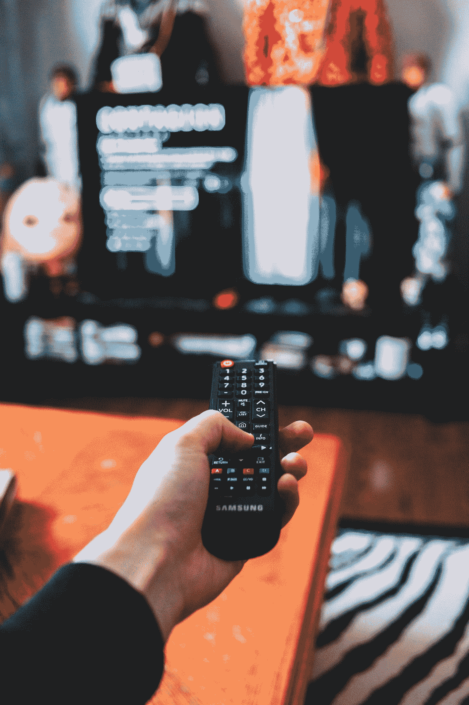

# 娱乐数据科学的新前沿

> 原文：<https://towardsdatascience.com/next-frontiers-in-entertainment-data-science-b63860124f3e>

## 超越什么和什么时候，超越我们如何思考和感受

Ahmet Yal nkaya 在 [Unsplash](https://unsplash.com?utm_source=medium&utm_medium=referral) 上拍摄的照片

像无数其他行业一样，娱乐行业正在被数据所改变。毫无疑问，数据总是在指导演艺圈决策中发挥作用，例如，电影跟踪调查[1]和尼尔森数据[2]的形式。但随着流媒体的日益突出及其实现的无缝消费测量，数据在理解、预测和影响电视和电影消费方面从未如此重要。

作为娱乐领域的数据科学家和媒体偏好研究人员，我有幸置身于分析电视/电影消费数据的行业前沿，能够跟上世界各地机构的媒体偏好研究。正如接下来的各种引用所表明的那样，这里提出的组件概念本身并不是什么新东西，但我想应用我的背景知识来汇集这些想法，为我认为是增强我们理解、预测和影响全球视频内容消费的能力的下一个前沿领域制定一个结构化的路线图。虽然数据可以在内容生命周期的许多早期阶段发挥作用，例如在绿色照明过程[3]或生产[4]中，而且我要说的内容可能与各个阶段相关，但我主要是从更下游的角度来写的，随着内容的消费，在发布前后，正如我在行业和学术工作中培养的那样。

# 除了查看和元数据

照片由[约书亚·索蒂诺](https://unsplash.com/@sortino?utm_source=medium&utm_medium=referral)在 [Unsplash](https://unsplash.com?utm_source=medium&utm_medium=referral) 拍摄

当您在娱乐领域工作时，您最终会处理大量标题消费数据和元数据。在很大程度上，这是不可避免的——所有“元数据”和“观看数据”的真正含义是关于正在观看什么以及观看多少的数据——但是很难不开始感觉到基于这种数据的模型，正如在内容相似性分析中常见的那样(例如[5][6][7][8])，输出落入熟悉模式的结果。例如，这些天来，当我看到“类似的节目/电影”推荐时，我脑海中的一个声音会说，“这可能是基于元数据的推荐，”或者“那些看起来像基于收视率的推荐”，这是基于我在使用这些模型时所看到的。当然，我不能 100%肯定，对于可能使用更多现成方法的小型服务，声音更有信心；在更大的平台上，推荐经常是天衣无缝的，以至于我不会去想缺陷，但是谁知道会有什么神奇的酱料加入其中呢？

我并不是说查看数据和元数据将不再重要，也不是说使用这些数据的模型无法解释消费的巨大差异。我想说的是，当谈到最佳分析和预测收视率时，仅仅这些因素能让我们走多远是有限的——我们需要新的方法来增强对观众及其与内容的关系的理解。我们想了解和预见标题 *X* 在时间点 *A* 之后的流行，“它在 *A* -1 时流行，它将在 *A* 时流行”，或者，“标题 *Y* 与 *X* 相似，曾流行，所以 *X* 将流行”，特别是由于经常在 *A* -1 或*之间的相似性让我们来谈谈一种数据，我认为这种数据对于提高对收视率的理解和预测能力至关重要。*

# 心理测量学:谁在观察，为什么

照片由[麦迪森·柳文欢](https://unsplash.com/@artbyhybrid?utm_source=medium&utm_medium=referral)在 [Unsplash](https://unsplash.com?utm_source=medium&utm_medium=referral) 上拍摄

当谈到媒体消费时，人们喜欢谈论人口统计学。事实上，任何上过电影商务课的人都可能熟悉“四象限电影”，或者一部对 25 岁以上和 25 岁以下的男女都有吸引力的电影。但是人口统计学在解释和预测效用上是有限的，因为它们通常会告诉我们谁是谁，但不一定会告诉我们为什么。

这就是心理测量学(又名心理测量学)可以提供帮助的地方。同一人群中的个体很容易有不同的倾向、价值观和偏好；一个例子是将男人或女人分成倾向于 DIY 者、早期采用者、环保主义者等的能力。基于它们在不同维度上的测量特征[10]。类似地，不同人口统计的人很容易有相似的特征，例如高度寻求刺激，乐于接受新的体验，或者在政治上认同左/右。这种心理测量变量确实被证明会影响媒体偏好——例如，令人愉快的人更喜欢脱口秀和肥皂剧[11]，寻求更高感觉的人更喜欢暴力内容[12][13]——并提高推荐模型的能力[14][15]。我自己的研究表明，与单独的人口统计数据相比，即使是简化的心理测量方法也可以在模型拟合类型偏好数据方面产生改进[16]。消费者数据公司已经开始认识到心理测量数据的重要性，其中许多公司以某种形式将这些数据纳入他们的服务[17][18][19]。

心理测量数据在个人层面上可能是有用的，它们通常被收集或汇总，以提供群体层面(受众、用户群、国家等)的各种心理测量特征。一些这样的数据可能会在来源处“预先汇总”，例如 Hofstede 的文化维度[20]。就收集而言，当直接收集观众中的所有观众不可行时(例如，当您无法调查数百万用户时)，来自回应观众的自我报告调查数据的“种子”集可用于使用最近邻法估算类似非回应者的值。心理测量数据在冷启动问题场景中也可能是有益的——如果你没有关于特定观众观看什么或他们将观看特定标题多少的直接数据，那么关于他们的特征的指向内容类型的数据难道不是有用的吗？

# 作为观众-内容特质互动的消费

埃里克·麦克林在 [Unsplash](https://unsplash.com?utm_source=medium&utm_medium=referral) 上的照片

上面的部分特别讨论了心理测量学，但是放大一点，它更广泛地推动的是观众/观众特征空间的扩展，超越了人口统计学和行为统计学。这是因为所有的消费本质上都是观众特征和内容特征之间的互动。这个概念比听起来更简单，也更好理解；它真正的意思是，观众的某些元素(观众特质)意味着他们更多(或更少)被一段内容的某些元素(内容特质)所吸引。甚至熟悉的类型偏好的刻板印象——儿童更喜欢动画，男人更喜欢动作片，等等。—固有地关注观众-内容特质的相互作用(在上述示例中，观众年龄-内容类型，观众性别-内容类型)，以及前述关于观众心理测量对内容偏好的影响的研究([11][12][13][16])也属于这一范式。

我们拥有的观众特征越多，我们可以考虑的可能与某种内容特征相互作用的东西就越多，从而影响他们消费该标题的兴趣。反过来，这也意味着拥有新形式的数据标题也是有益的。人们似乎更容易“深入”标题数据，以元数据的形式(流派、演员、工作人员、工作室、奖项、平均评论等。)，但仍然有扩展标题端的空间，特别是如果像上面建议的那样通过收集心理测量等来扩展观众端的数据。在这方面，标签和标记是一个很好的起点。通过捕捉机器自己仍然难以检测的潜在信息，人类标记尤其有益，例如幽默、讽刺、挖苦等。[21][22] —但是自动化流程可以提供有用的一致的基线内容标签[23]。然而，如今，标签只是生成额外标题端数据的开始。可以从标题的音频和视频中设计出各种各样的特征，也可以从文本中提取故事的情感弧线。

一旦你从观众-内容互动的角度考虑消费，并在观众和标题两方面扩大数据收集，可能性就真的出现了。例如，您可以对片头中角色的种族/民族和性别进行编码，并查看片头演员/工作人员和流媒体平台的典型用户之间的人口统计相似性如何影响片头的成功。或者，你可能想对标题的信息感觉值进行编码，看看这与标题对某个寻求高度感觉的群体的吸引力有什么关系。或者，您可能希望使用来自 OpenSubtitles 等的数据来确定系统中所有标题的叙事弧类型，并查看是否出现了某些弧对某些心理图形的个人的吸引力的任何模式。

# 解析管道:感知、兴趣、响应

昆腾·德格拉夫在 [Unsplash](https://unsplash.com?utm_source=medium&utm_medium=referral) 上的照片

最后，需要更细致地考虑消费渠道，从兴趣到反应。虽然很容易被归为消费者对某个标题感觉的“好”信号，但对某个内容感兴趣、观看和喜欢完全是两码事。如果可能的话，完整的观看过程应该被分解成消费前和消费后两个阶段。

*感知(消费前)*:不同人口统计特征[27]的个体，可能具有不同的心理特征，会对同一媒体产品产生不同的感知。这些感觉可以由产品的品牌设计、字体、颜色和广告等要素来塑造[28][29][30]。可以说，感知对管道的下一阶段有重要影响。

*兴趣，和选择(预消费):*首先，虽然和前者相关但肯定增加了后者的可能性，值得注意的是，兴趣(又名偏好)并不等同于选择(又名选择)[31]。虽然对其中一个的分析可能经常与另一个相关，但我们不能总是假设一个对某样东西感兴趣或很可能对某样东西感兴趣的人总是会选择消费它。像推理行动模型[32]这样的模型很好地说明了这一点，在该框架内，对观看电影感觉良好的个人可能不会观看该电影，因为他们认为观看所述电影是不利的。检查驱动兴趣选择转换的因素可能是有益的。

*反应(消费后)*:最后，还有个人看完一段内容后的感受。这可以简单到他们是否喜欢它；尽管人们很容易将高收视率与《哇，人们真的很喜欢那部电影》相提并论，但在查看数据集时，关键是要记住，人们看某部电影的程度和他们是否喜欢这部电影是相关的，但最终是分开的事情，正如任何一个对这部电影感到兴奋但又被它的平庸所击垮的人可以证明的那样；我自己的研究表明，对看不见的内容感兴趣的效果可能不同于，甚至是相反的，对喜欢看得见的内容的效果。除了喜欢，回应还可以包括一些元素，如观众对内容的情感感受[34]，他们与角色的关系[35]，他们沉浸在故事情节中的程度[36]，等等。

媒体偏好和消费不需要被认为是一个单一的、固定的过程，而是以这种方式分离出来，一个流动的模块化过程，其中上游过程的战略管理可以影响期望结果的可能性，无论它们可能是什么。我们如何有选择地优化不同人口统计和心理统计群体对媒体产品的感知，以获得对某个标题的最大兴趣，或者优化预期的下游结果？我们如何将兴趣转化为选择？某些上游感知或过高的兴趣水平是否会与某个标题的内容产生负面影响，从而导致对该标题的最终反应比感知不同或兴趣不那么极端时更加负面？此外，虽然我提供了潜在的关键机制与管道的每个步骤相关，但某些机制可能与管道的多个阶段或不同阶段相关，例如，(潜在的)观众角色相似性([37][38])可能会影响广告曝光后对标题的感知和兴趣，而社交网络效应([39])可能意味着某些个人的消费后反应会严重影响其他个人的消费前兴趣。

# 结论

照片由 [Unsplash](https://unsplash.com?utm_source=medium&utm_medium=referral) 上的 [Aziz Acharki](https://unsplash.com/@acharki95?utm_source=medium&utm_medium=referral) 拍摄

作为一个行业，我们刚刚开始触及数据如何帮助我们理解、预测和影响内容消费的表面，这些只是我的一些想法，我认为随着数据科学在娱乐领域变得越来越普遍和关键，这些将是重要的考虑因素。受众心理测量将有助于增强对受众的了解，这是人口统计学无法单独做到的；考虑新受众和内容特征之间的互动将提供卓越的战略洞察力和预测能力；细致入微地考虑从兴趣到反应的整个消费渠道将有助于优化预期结果。如果你对此感兴趣，并且想和我聊更多，请随时添加我并联系 [LinkedIn](http://me.dm/r-PNlcNtF-_9?source=email-8e08e5914349-1641392225891-newsletter.subscribeToProfile-------------------------2a7733a5_5ad6_4a51_a0c5_bcd6be708f28--------a45a8f6e03c3) ！

在撰写本文时，丹尼·金(宾夕法尼亚大学博士； *是南加州大学安嫩伯格传播与新闻学院的研究附属机构，并将很快在娱乐界开创一个令人兴奋的新职位！他的专业领域包括媒体偏好、数据科学、媒体心理学、媒体管理和媒体品牌。*

# 参考

[1]新闻周刊工作人员，[，好莱坞，电影，追踪，追踪报道](http://me.dm/r-tKC-CouROa?source=email-8e08e5914349-1641392225891-newsletter.subscribeToProfile-------------------------2a7733a5_5ad6_4a51_a0c5_bcd6be708f28--------a45a8f6e03c3) (2002)，新闻周刊。

[2]尼尔森，[庆祝 95 年创新](http://me.dm/r-MUs6Ao3N0c?source=email-8e08e5914349-1641392225891-newsletter.subscribeToProfile-------------------------2a7733a5_5ad6_4a51_a0c5_bcd6be708f28--------a45a8f6e03c3) (2018)，尼尔森。

[3] A. Massey，[人工智能和数据分析能带来轰动一时的电影吗？](http://me.dm/r-v_1x6IYltX?source=email-8e08e5914349-1641392225891-newsletter.subscribeToProfile-------------------------2a7733a5_5ad6_4a51_a0c5_bcd6be708f28--------a45a8f6e03c3) (2020)，ESRI《在哪里》杂志。

[4] J. Walraven，[网飞](http://me.dm/r-yT5lMqim3c?source=email-8e08e5914349-1641392225891-newsletter.subscribeToProfile-------------------------2a7733a5_5ad6_4a51_a0c5_bcd6be708f28--------a45a8f6e03c3)数据科学与娱乐制作(2019)，数据科学沙龙。

[5] M. Soares，P. Vianna，[为更好的基于电影内容的推荐系统调整元数据](https://link.springer.com/article/10.1007/s11042-014-1950-1) (2015)，多媒体工具和应用。

[6] S. Nazir，T. Cagali，C. Newell，M. Sadrzadeh，[电视节目多模态内容向量的余弦相似性](https://arxiv.org/abs/2009.11129) (2020)，arxiv.org。

[7] T. Anwar，V. Uma，[推荐系统方法与使用协同过滤的电影推荐的比较研究](https://link.springer.com/article/10.1007/s13198-021-01087-x) (2021)，国际系统保证工程与管理杂志。

[8] R. Lavanya，B. Bharathi，[利用协同过滤方法解决数据稀疏性的电影推荐系统](https://dl.acm.org/doi/abs/10.1145/3459091) (2021)，ACM Transactions on Asian and Low-Resource Language Information Processing。

[9] J. Hellerman，[什么是四象限，什么是四象限电影(定义及实例)](http://me.dm/r-nilU2OswGe?source=email-8e08e5914349-1641392225891-newsletter.subscribeToProfile-------------------------2a7733a5_5ad6_4a51_a0c5_bcd6be708f28--------a45a8f6e03c3) (2021)，无电影学派。

[10] R. Abzug，[电视观众研究的未来](http://me.dm/r-tFYNzKA2Zu?source=email-8e08e5914349-1641392225891-newsletter.subscribeToProfile-------------------------2a7733a5_5ad6_4a51_a0c5_bcd6be708f28--------a45a8f6e03c3) (2011)，南加州大学安嫩伯格分校诺曼·李尔中心。

[11] G. Kraaykamp，K. van Eijck，[个性、媒体偏好和文化参与](http://me.dm/r-ywolMn22Dx?source=email-8e08e5914349-1641392225891-newsletter.subscribeToProfile-------------------------2a7733a5_5ad6_4a51_a0c5_bcd6be708f28--------a45a8f6e03c3) (2005)，个性和个体差异。

[12] K. Greene，M. Krcmar，[预测接触和喜欢媒体暴力:使用和满足方法](http://me.dm/r-IeGYwOiS1_?source=email-8e08e5914349-1641392225891-newsletter.subscribeToProfile-------------------------2a7733a5_5ad6_4a51_a0c5_bcd6be708f28--------a45a8f6e03c3) (2005)，传播研究。

[13] M. Slater，[疏离感、攻击性和感觉寻求是青少年使用暴力电影、计算机和网站内容的预测因素](http://me.dm/r-akcC9_Rzmy?source=email-8e08e5914349-1641392225891-newsletter.subscribeToProfile-------------------------2a7733a5_5ad6_4a51_a0c5_bcd6be708f28--------a45a8f6e03c3) (2006 年)，《传播杂志》。

[14] E. Khan，M. S. Hossain Mukta，M. Ali，J. Mahmud，[从个性和价值观预测用户的电影偏好和分级行为](http://me.dm/r--xCuIuOptf?source=email-8e08e5914349-1641392225891-newsletter.subscribeToProfile-------------------------2a7733a5_5ad6_4a51_a0c5_bcd6be708f28--------a45a8f6e03c3) (2020)，ACM Transactions on Interactive Intelligent Systems。

[15] O. Nalmpantis，C. Tjortjis，[《50/50 推荐器:一种将个性融入电影推荐系统的方法》](http://me.dm/r-nQGmSBorYh?source=email-8e08e5914349-1641392225891-newsletter.subscribeToProfile-------------------------2a7733a5_5ad6_4a51_a0c5_bcd6be708f28--------a45a8f6e03c3) (2017)，EANN 2017:《神经网络的工程应用》。

[16] D. Kim，[在电视上寻找快乐和意义，捕捉自应用内:通过移动应用](http://me.dm/r-y5saSnNR5H?source=email-8e08e5914349-1641392225891-newsletter.subscribeToProfile-------------------------2a7733a5_5ad6_4a51_a0c5_bcd6be708f28--------a45a8f6e03c3) (2020)自我报告的快乐主义和享乐主义对电视消费的影响，《广播和电子媒体杂志》。

[17] N. Ripley，[康姆斯克介绍 Plan Metrix 多平台](http://me.dm/r-EkdEj0SFU6?source=email-8e08e5914349-1641392225891-newsletter.subscribeToProfile-------------------------2a7733a5_5ad6_4a51_a0c5_bcd6be708f28--------a45a8f6e03c3) (2017)，康姆斯克。

[18]尼尔森，[尼尔森数据即服务(DAAS)](http://me.dm/r-CEUJAUWgyl?source=email-8e08e5914349-1641392225891-newsletter.subscribeToProfile-------------------------2a7733a5_5ad6_4a51_a0c5_bcd6be708f28--------a45a8f6e03c3) ，尼尔森。

[19]分子。[分子推出心理学&媒体消费洞察](http://me.dm/r-vRekMD56Fa?source=email-8e08e5914349-1641392225891-newsletter.subscribeToProfile-------------------------2a7733a5_5ad6_4a51_a0c5_bcd6be708f28--------a45a8f6e03c3) (2019)，分子。

[20]霍夫斯塔德的见解。[民族文化](http://me.dm/r-uanBhj4D1n?source=email-8e08e5914349-1641392225891-newsletter.subscribeToProfile-------------------------2a7733a5_5ad6_4a51_a0c5_bcd6be708f28--------a45a8f6e03c3)。霍夫斯泰德洞察。

[21] D. Riffe，S. Lacy，B. Watson，F. Fico，[分析媒体信息](http://me.dm/r-vghtg6OIR8?source=email-8e08e5914349-1641392225891-newsletter.subscribeToProfile-------------------------2a7733a5_5ad6_4a51_a0c5_bcd6be708f28--------a45a8f6e03c3) (2019)，Routledge。

[22] S. Lewis，R. Zamith，A. Hermida，[大数据时代的内容分析:计算和手动方法的混合方法](http://me.dm/r-Ko4757RbwO?source=email-8e08e5914349-1641392225891-newsletter.subscribeToProfile-------------------------2a7733a5_5ad6_4a51_a0c5_bcd6be708f28--------a45a8f6e03c3) (2013)，广播杂志&电子媒体。

[23] D. Eck，P. Lamere，T. Bertin-Mahieux，S. Green，[音乐推荐社交标签的自动生成](http://me.dm/r-xR5-KAEo9O?source=email-8e08e5914349-1641392225891-newsletter.subscribeToProfile-------------------------2a7733a5_5ad6_4a51_a0c5_bcd6be708f28--------a45a8f6e03c3) (2007)，NIPS 07:第 20 届神经信息处理系统国际会议论文集(2007)。

[24] Y. Deldjoo，M. Dacrema，M. Constantin，H. Eghbal-zadeh，S. Cereda，M. Shcedl，b .约内斯库，p .克雷莫内西，[电影基因组:缓解电影推荐中的新项目冷启动](http://me.dm/r-PfjnPDxv-4?source=email-8e08e5914349-1641392225891-newsletter.subscribeToProfile-------------------------2a7733a5_5ad6_4a51_a0c5_bcd6be708f28--------a45a8f6e03c3) (2019)，用户建模与用户适配交互。

[25] M .德尔·维奇奥，a .哈尔拉莫夫，g .帕里，g .波格雷纳，[《用数据科学提高好莱坞的生产力:利用电影的情感弧线推动娱乐产业的产品和服务创新》](http://me.dm/r-c4FIMEf8nC?source=email-8e08e5914349-1641392225891-newsletter.subscribeToProfile-------------------------2a7733a5_5ad6_4a51_a0c5_bcd6be708f28--------a45a8f6e03c3) (2021)，运筹学学会杂志。

[26] O. Toubia，J. Berger，J. Eliashberg，[如何量化故事的形状预测其成功](http://me.dm/r-E0adl-D2fz?source=email-8e08e5914349-1641392225891-newsletter.subscribeToProfile-------------------------2a7733a5_5ad6_4a51_a0c5_bcd6be708f28--------a45a8f6e03c3)，美国国家科学院院刊。

[27] D. Kim，[媒体品牌个性认知的人口统计学差异:多水平分析](http://me.dm/r-eM8M7vtIAR?source=email-8e08e5914349-1641392225891-newsletter.subscribeToProfile-------------------------2a7733a5_5ad6_4a51_a0c5_bcd6be708f28--------a45a8f6e03c3) (2018)，国际媒体管理杂志。

[28] T. Lieven，B. Grohmann，A. Herrmann，J. Landwehr，M. van Tilburg，[品牌设计对品牌性别认知和品牌偏好的影响](http://me.dm/r-7RMTILgK2B?source=email-8e08e5914349-1641392225891-newsletter.subscribeToProfile-------------------------2a7733a5_5ad6_4a51_a0c5_bcd6be708f28--------a45a8f6e03c3) (2015)，《欧洲营销杂志》。

[29] E. Seimiene，E. Kamarauskaite，[品牌元素对品牌个性感知的影响](http://me.dm/r-d_1hHcQYoy?source=email-8e08e5914349-1641392225891-newsletter.subscribeToProfile-------------------------2a7733a5_5ad6_4a51_a0c5_bcd6be708f28--------a45a8f6e03c3) (2014)，Procedia —社会和行为科学。

[30] M. Favier，F. Celhay，g . Pantin-sohire，[少是多还是烦？包装设计的简单性和品牌感知:香槟的应用](http://me.dm/r-NFOerxAL8g?source=email-8e08e5914349-1641392225891-newsletter.subscribeToProfile-------------------------2a7733a5_5ad6_4a51_a0c5_bcd6be708f28--------a45a8f6e03c3) (2019)，零售和消费者服务杂志。

[31] S. Knobloch-Westerwick，(2015)，Routledge。

[32] M. Fishbein，[健康促进的理性行动方法](http://me.dm/r-tKe_prLqLs?source=email-8e08e5914349-1641392225891-newsletter.subscribeToProfile-------------------------2a7733a5_5ad6_4a51_a0c5_bcd6be708f28--------a45a8f6e03c3) (2008 年)，医疗决策。

[33] D. Kim，[被我们是谁和我们渴望成为谁吸引到银幕上:电影偏好中的品牌自我一致性差异](http://me.dm/r-x7AfN502dn?source=email-8e08e5914349-1641392225891-newsletter.subscribeToProfile-------------------------2a7733a5_5ad6_4a51_a0c5_bcd6be708f28--------a45a8f6e03c3) (2020)，国际媒体管理杂志。

[34] R. Nabi，M. Green，[叙事情感流在促进说服性结果中的作用](http://me.dm/r-t7SeLIoMQw?source=email-8e08e5914349-1641392225891-newsletter.subscribeToProfile-------------------------2a7733a5_5ad6_4a51_a0c5_bcd6be708f28--------a45a8f6e03c3) (2015)，媒体心理学。

[35] H. Hoeken，M. Kolthoff，J. Sander，[故事视角和人物相似性作为认同和叙事说服的驱动因素](http://me.dm/r-bY6rpJt29L?source=email-8e08e5914349-1641392225891-newsletter.subscribeToProfile-------------------------2a7733a5_5ad6_4a51_a0c5_bcd6be708f28--------a45a8f6e03c3) (2016)，人类传播研究。

[36] M. Green，T. Brock，[换位在公共叙事说服力中的作用](http://me.dm/r-C8HXAYaVLP?source=email-8e08e5914349-1641392225891-newsletter.subscribeToProfile-------------------------2a7733a5_5ad6_4a51_a0c5_bcd6be708f28--------a45a8f6e03c3) (2000)，《人格与社会心理学杂志》。

[37] J. Cohen，M. Hershman-Shitrit，[与电视角色的中介关系:人格特质中感知和实际相似性的影响](https://www.jbe-platform.com/content/journals/10.1075/ssol.7.1.05coh) (2017)，文学的科学研究。

[38] R. Matthew Montoya，R. Horton，J. Kirchner，[实际的相似是吸引的必要条件吗？实际相似性和感知相似性的荟萃分析](https://journals.sagepub.com/doi/abs/10.1177/0265407508096700) (2008)，《社会与个人关系杂志》。

[39] J. Krauss，S. Nann，D. Simon，K. Fischbach，P. Gloor，[通过情感和社会网络分析预测电影成功和奥斯卡奖](https://aisel.aisnet.org/cgi/viewcontent.cgi?article=1185&context=ecis2008) (2008)，ECIS 2008 会议录:欧洲信息系统会议。