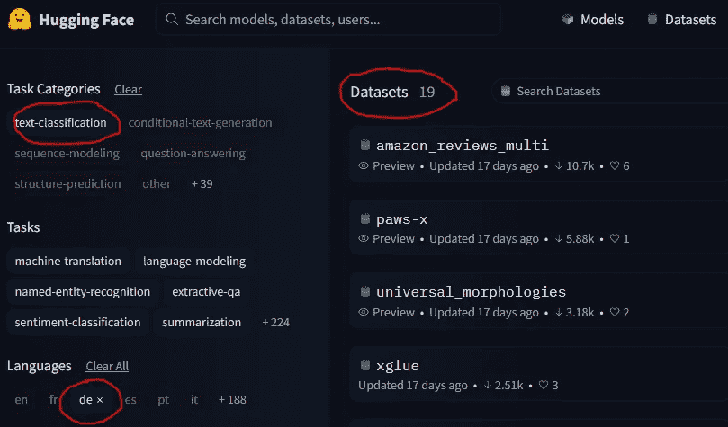
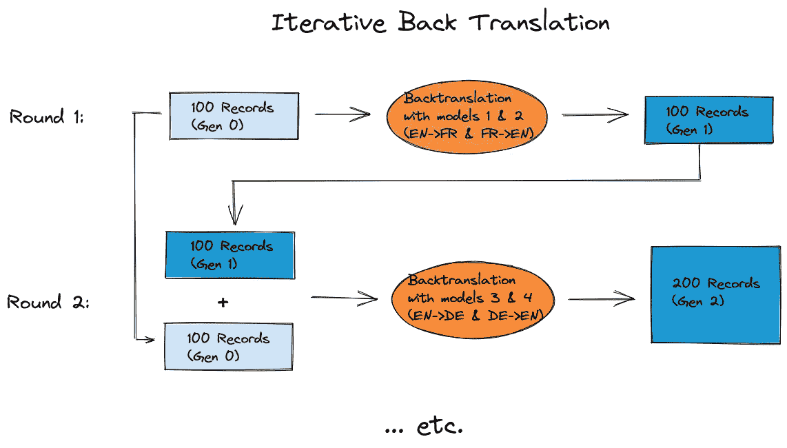
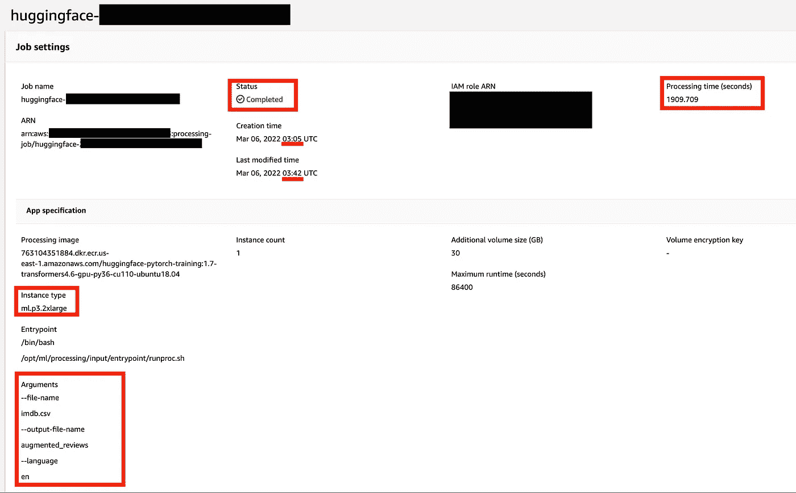

# 亚马逊 SageMaker 上的 NLP 数据增强

> 原文：<https://towardsdatascience.com/nlp-data-augmentation-on-amazon-sagemaker-4d5b77b5512f>

## 使用 SageMaker 处理作业，通过拥抱脸的变形模型轻松扩充您的 NLP 数据集

马库斯·温克勒在 [Unsplash](https://unsplash.com?utm_source=medium&utm_medium=referral) 上的照片

**联合博文由** [**索比亚汗**](https://www.linkedin.com/in/saubia-khan-a8b188158/)**[**若昂莫拉**](https://www.linkedin.com/in/joaomoura1996/)**[**黑科霍兹**](https://www.linkedin.com/in/heikohotz/) **。观点是我们自己的。******

# ****这篇博文是关于什么的？****

****机器学习模型是非常数据密集型的，对于自然语言处理(NLP)模型来说尤其如此。作为一个例子，让我们考虑一个 NLP 模型，该模型试图检测客户评论的情绪是积极的还是消极的。因为人类的语言如此丰富，有几乎无限多的方式来传达同样的意思和情感。在理想世界中，我们的 NLP 模型从所有这些不同的可能性中学习说同样的事情。当然，问题是，当我们训练模型时，我们手头几乎从来没有这种类型和数量的数据。****

****数据稀缺是自然语言处理中的一个常见挑战。在撰写本文时，拥抱脸模型中心包含超过 29，000 个模型。相比之下，他们的数据集中心“仅”包含 2，800 个数据集。这种挑战对于非英语语言来说更是如此。过滤数据集中心的*德语*(一种相当常见的语言)和*文本分类*(一项非常常见的 NLP 任务)，留给我们的只有 19 个数据集可供选择:****

********

****作者图片****

****这就是数据增强可以发挥作用的地方——这是丰富或综合扩大机器学习模型训练数据集的过程。****

# ****为什么数据增强很重要？****

****使用 NLP 数据增强有很多好处，我们想强调其中的三个主要好处:****

*   ******提高模型性能:**数据扩充是提高模型性能的最有前途的技术之一。[这篇论文](https://arxiv.org/pdf/1901.11196.pdf)显示，通过使用数据增强，文本分类任务的性能提高了近 3%。3%的性能提升可能听起来不算多，但对于 ML 模型性能来说，这实际上是一件大事。考虑到增加数据所需的少量工作成本，这一点尤其正确。****
*   ******访问更高级的模型:**没有足够的数据来完成 NLP 任务有时会限制可以使用的 NLP 模型的选择。Google Research 和多所大学之间的一项综合研究表明，数据增强使得大规模 NLP 模型的使用成为可能，否则由于数据稀缺，这将不是一个可行的选择。****
*   ******偏差缓解:**偏差是一个常见且具有挑战性的问题，尤其是在 NLP 中。我们可能都听说过 NLP 模型突然生成攻击性文本或仇恨言论的故事。这篇[论文](https://dl.acm.org/doi/10.1145/3375627.3375865)表明数据扩充可以显著消除 NLP 模型中的偏差。****

# ****我们将在本教程中做什么？****

****在本教程中，我们将在 Amazon SageMaker (SM)上演示 NLP 数据增强是简单、直接和经济高效的。我们将使用一种叫做 ***反向翻译*** *，*的技术，在这里我们将利用来自拥抱脸模型中心的翻译模型将客户评论翻译成不同的语言，然后再翻译回原来的语言。这种技术将产生一组新的顾客评论，它们在意义上非常相似或相同，但在措辞上有细微的不同。****

****大规模地这样做可能需要大量资源，这就是为什么我们展示如何使用 [Amazon SageMaker 处理](https://docs.aws.amazon.com/sagemaker/latest/dg/processing-job.html)来扩充数据。通过 SM 处理，我们可以使用简化的托管体验来运行我们的数据处理工作负载，在我们的案例中，使用反向翻译来扩充数据。****

****如前所述，NLP 数据稀缺在非英语语言中尤其是一个挑战。然而，为了使本教程更容易理解，我们决定使用英语数据集。我们将从一个包含 100 条记录的小型数据集开始，到最后，我们的初始数据集将增加 15 倍以上，达到 1，500 多条记录。****

****说到 Github 回购，这里是我们回购的[链接](https://github.com/marshmellow77/sm-hf-nlp-data-augmentation)，在这里你可以找到我们所有的代码。我们开始吧！****

# ****反向翻译简介****

****反向翻译是扩充文本数据的常用技术。这种方法的想法是把一个句子翻译成任何其他语言，然后再翻译回原来的语言。结果文本与原始文本略有不同，并为我们提供了更多数据来训练模型:****

********

****作者图片****

****生成的文本可能使用稍微不同的术语，也可能不总是语法正确。但这是这种技术的一个受欢迎的特性，因为现实生活中的数据总是会带来可能有一些错误的文本。重要的是，整体情绪保持不变，文本略有不同。****

# ****解决方案概述****

****我们的方法利用 SageMaker 与 Hugging Face 的集成来下载数据集和翻译模型，并利用 SageMaker 处理作业来配置计算基础架构:****

********

****我们首先从拥抱脸数据集中心下载数据集，清洗它，并将其存储在 S3。然后，我们开始处理作业，并将其指向数据集的 S3 位置。我们还提供了一个将由作业执行的定制处理脚本。该脚本将从 S3 加载数据，从拥抱脸模型中心加载相应的翻译模型，执行反向翻译，并将生成的扩充数据集存储回 S3。最后，我们将回顾数据扩充的结果。****

# ****数据集****

****在本教程中，我们将使用 [IMDB 数据集](https://huggingface.co/datasets/imdb)，它由 50，000 条带有情感标签的电影评论组成。该数据集是作为这篇[论文](https://aclanthology.org/P11-1015/)的一部分创建的，并获得了[知识共享署名 4.0 国际许可](https://creativecommons.org/licenses/by/4.0/)。我们可以从拥抱脸数据集中心下载数据集，并将其存储在熊猫数据帧中。我们将数据集限制为 100 条记录，并确保所有评论都是英文的:****

****让我们先来看看数据:****

********

****作者图片****

****我们可以看到评论里有一些 HTML 标签。如果我们保留它们可能不会有什么影响，但是删除它们很简单，所以让我们编写一个函数来做这件事并清理整个数据集:****

****最后，我们将数据作为 CSV 文件存储在 S3:****

# ****处理脚本****

****我们的处理脚本将从 S3 加载数据，然后执行几轮反向翻译。每一轮涉及两个翻译模型，一个是从英语到任意语言的翻译，一个是翻译回英语的翻译(例如 EN→FR，然后 FR→EN)。在每一轮之后，结果被附加到原始数据集，并且具有不同“中间”语言的新一轮反向翻译开始:****

********

****作者图片****

****在本教程中，我们的目标是将数据集的大小增加约 15 倍，因此我们决定使用 4 轮反向翻译，这将产生 1，600 条记录(2⁴ *100)。在某些情况下，翻译可能在两个方向上都进行得很好，并且回译的文本将与原文相同。因此，我们必须对数据集进行重复数据消除，最终我们将得到总共不到 1，600 条记录。****

## ****运行处理脚本****

****在 SageMaker 上运行处理作业非常简单——只需设置一个 HuggingFaceProcessor 对象，并将其指向要处理的数据。如何做到这一点的代码可以在这个[笔记本](https://github.com/marshmellow77/sm-hf-nlp-data-augmentation/blob/main/sm-data-aug-hf-pj.ipynb)中找到。处理作业完成后，我们可以看到关于运行时间和其他关键指标的详细信息:****

********

****作者图片****

****在这种情况下，我们可以看到整个数据扩充练习花了大约 35 分钟才完成。****

# ****查看结果****

****一旦处理工作结束，我们就可以从 S3 提取结果，并检查我们得到了多少条记录:****

****我们从 100 个评论开始，现在我们有 1592 个评论，一点也不差！让我们回顾一些补充评论，并将其与原始评论进行比较:****

********

****作者图片****

****这看起来不错——就像我们上面的例子一样，我们可以看到评论的整体意义和观点被保留下来，但确切的措辞略有不同。这正是我们所希望的结果。这个数据集现在可以用于下游的 NLP 任务，如情感分析。****

# ****结论****

****在本教程中，我们将初始 NLP 数据集的大小增加了十倍以上，从 100 条记录增加到 1，592 条记录。我们通过使用反向翻译技术、利用 SM 处理作业以及整合拥抱脸和亚马逊 SageMaker 实现了这一点。扩充的数据集现在可以用于下游的 NLP 任务，例如情感分类。****

****感谢阅读，我们希望你喜欢这个教程，并发现它很有用。如有任何问题或意见，请联系我们。****