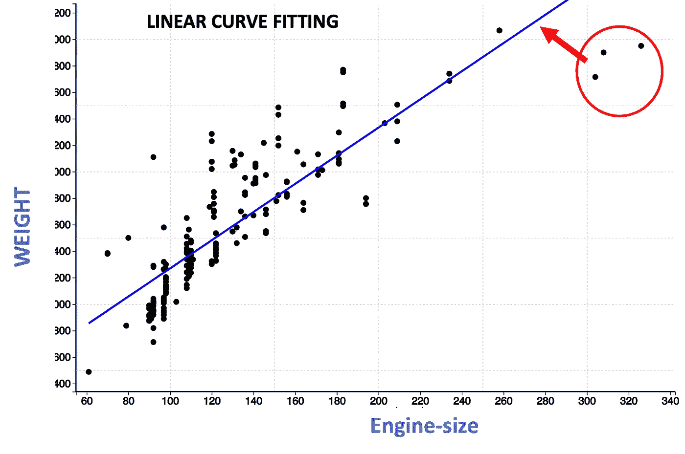
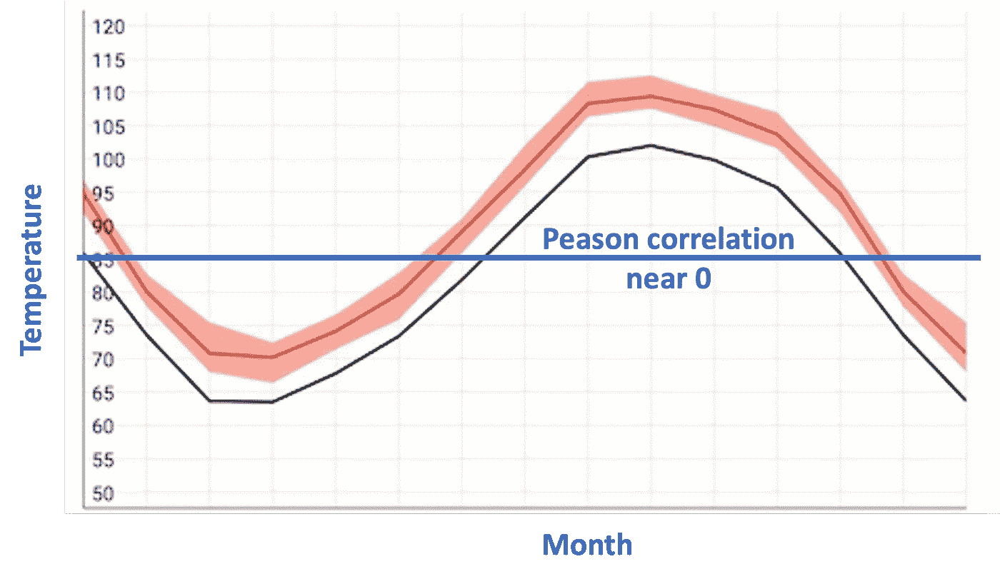
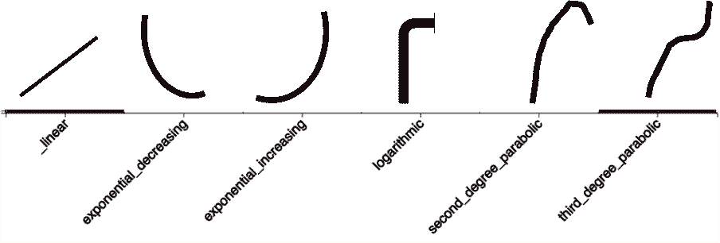
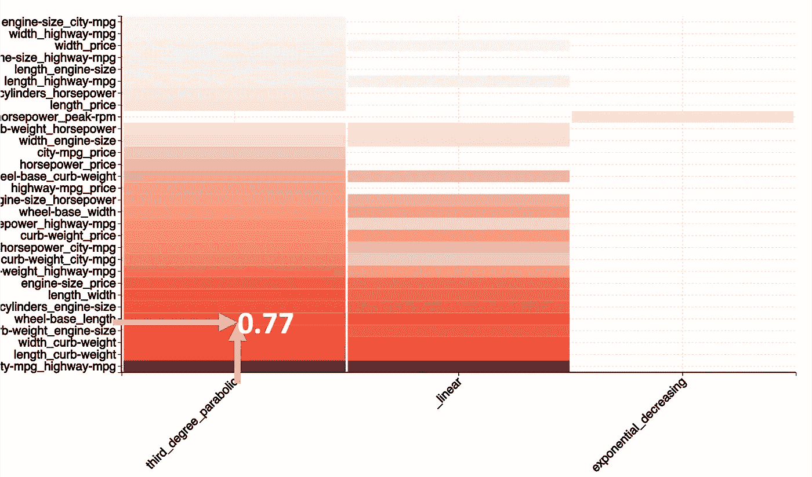
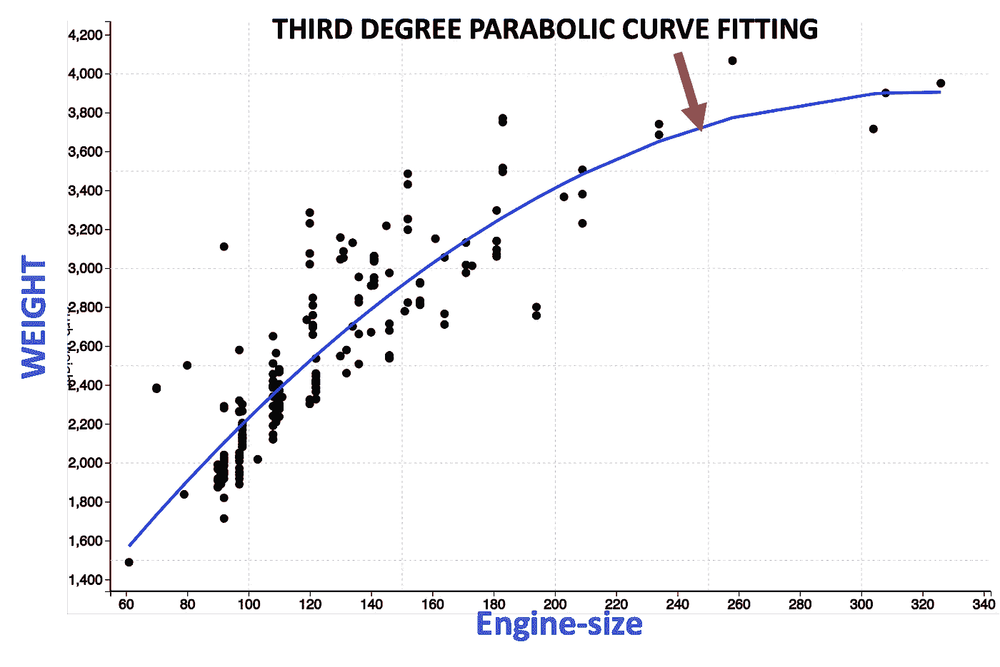

# 非线性相关矩阵——无人问津的急需技术

> 原文：<https://towardsdatascience.com/non-linear-correlation-matrix-the-much-needed-technique-which-nobody-talks-about-132bc02ce632>

## 为什么过度使用相关矩阵，为什么需要非线性相关矩阵

照片由[JJ·乔丹](https://unsplash.com/@jjjordan?utm_source=unsplash&utm_medium=referral&utm_content=creditCopyText)在 [Unsplash](https://unsplash.com/s/photos/secret?utm_source=unsplash&utm_medium=referral&utm_content=creditCopyText) 上拍摄

即使有不可计数的数据科学技术和算法，有时你仍然会有缺失某些东西的感觉。一个缺少或很少谈论的这样的东西是非线性相关矩阵。

我们习惯了著名的相关矩阵。然而，在本文中，您将看到相关矩阵可能会导致对数据的错误解释。相关矩阵的局限性证明了需要更复杂的东西，例如非线性相关矩阵。

为了说明这个故事，我将使用一个汽车数据集。这里显示了一个样本数据集。我们将在本视频中使用的数据与汽车相关。这些数据包括汽车的构造、不同的技术特征，如燃料类型、长度、宽度、车门数量等。以及汽车的价格。该数据大约有 25 个字段，其中大约有 15 个数值字段。

汽车样本数据(图片由作者提供)。

注意:数据集引用可在文章末尾找到

# 相关矩阵…好得令人难以置信

让我们首先从检查相关矩阵开始。数据集有超过 15 个数值字段。衡量这些数值字段之间相关性的相关矩阵如下所示。

相关矩阵(图片由作者提供)

X 轴和 Y 轴对应于数据中的数值字段。每个单元具有指示两个场之间的相关强度的相关系数。相关系数越高，颜色越深。

发动机尺寸与重量的相关系数约为 0.84。这意味着这两个领域之间有很强的正相关性。换句话说，这意味着随着发动机尺寸的增加，重量也线性增加。

现在让我们通过观察两个场之间的散点图来看看这是真是假。

散点图发动机尺寸与重量(图片由作者提供)

只看这些点，我们看到发动机尺寸在 60 到 200 之间，重量有线性增加。然而，在发动机尺寸为 200 之后，重量并不是线性增加，而是持平。因此，这意味着发动机尺寸和重量之间的关系不是严格的线性关系。

我们还可以通过执行线性曲线拟合来确认非线性性质，如下图中的蓝线所示。您将观察到标记在红色圆圈中的点完全偏离了直线，这表明直线不能正确地捕捉模式。

线性曲线拟合(图片作者提供)

我们从观察细胞的颜色开始，这表明有很强的相关性。然而，当我们查看散点图时，我们得出结论，这是不正确的。那么，问题出在哪里？

问题出在技术的名称上。由于它被称为相关矩阵，我们倾向于用它来解释所有类型的相关性。该技术基于皮尔逊相关性，严格地说，它只测量线性相关性。因此，该技术更合适的名称应该是线性相关矩阵。

另一个问题是我们可能错过了一些重要的模式。如果相关矩阵不表示强相关，通常不进行调查。然而，这也可能表示非线性关系或模式。例如，相关矩阵显示月份和温度之间没有相关性。然而，月份和温度之间有很大的关系。

月份与温度(图片由作者提供)

# 为什么我们真的需要非线性相关矩阵

到现在为止，你一定已经意识到数据中的相关性并不总是严格线性的。为了正确地表示数据中的关系，我们需要一个矩阵来度量数据中的线性和非线性关系。

> 所以，向非线性相关矩阵问好。

非线性相关矩阵(图片由作者提供)

非线性相关矩阵在 Y 轴上有数值字段对，在 X 轴上有最常见的非线性相关类型。通常出现的不同类型的非线性关系类型是指数递减、指数递增、对数、二阶抛物线和三阶抛物线。这个非线性关系的列表不是穷举的，因为还有其他非线性关系。然而，最常见的是下面显示的象征性的。

让我们放大矩阵，找出前 50 个值。

放大到前 50 个值(图片由作者提供)

我们可以观察到发动机尺寸和重量之间有很强的三阶非线性关系。让我们通过进行曲线拟合来确认。

三次曲线拟合(图片由作者提供)

您可以观察到三次曲线比线性曲线更适合。这证实了发动机尺寸和重量之间的非线性关系。

总之，作为数据科学家，我们应该摆脱对线性相关矩阵的过度依赖。理解不同的非线性模式是正确解释数据的关键。非线性相关矩阵是更全面地确定相关性的好方法。

## 数据源引用

数据来自 https://archive.ics.uci.edu/ml/datasets/automobile。

Dua d .和 Graff c .(2019 年)。UCI 机器学习知识库[http://archive . ics . UCI . edu/ml]。加州欧文:加州大学信息与计算机科学学院。

## 额外资源

# 网站(全球资讯网的主机站)

你可以访问我的网站，使非相关矩阵以及其他零编码分析。【https://experiencedatascience.com 

请**订阅**,以便在我发布新故事时随时获得通知。

<https://pranay-dave9.medium.com/subscribe>  

您也可以通过我的推荐链接**加入 Medium**

<https://pranay-dave9.medium.com/membership>  

## Youtube 频道

这里是我的 YouTube 频道的链接【https://www.youtube.com/c/DataScienceDemonstrated
T3