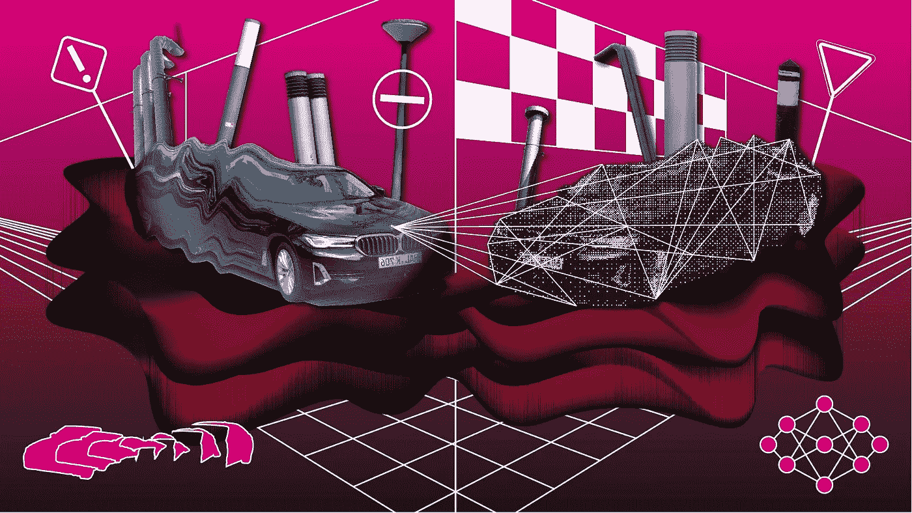

# 数字双胞胎的非技术性介绍

> 原文：<https://towardsdatascience.com/non-technical-intro-to-digital-twins-d7401b01486>

## [公平和偏见](https://towardsdatascience.com/tagged/fairness-and-bias)

# 数字双胞胎的非技术性介绍

## 理解复杂技术及其伦理的新的和传统的例子

“这幅图涉及自动驾驶汽车、环境传感和神经网络。在汽车中实现的计算机视觉系统需要区分重要的街道标志和环境中其他不重要的元素，如烟囱。”[安东·格拉博勒](https://www.instagram.com/antongrabolle) / [更好的 AI 图像](https://www.betterimagesofai.org) / *自动驾驶* /由 [CC-BY 4.0](https://creativecommons.org/licenses/by/4.0/)

一项闪亮的新技术正在席卷整个机构。不，不是区块链、机器学习或 Web3。这是一对数字双胞胎，一个分析、理解、维护和改善物理和社会基础设施的数字解决方案。

现在，我不是最懂技术的人——你在*读了一篇关于数据科学*的帖子，这可能会让你成为这个房间里最懂技术的人——所以我将在第一部分用两个例子来定义数字双胞胎。在第二节中，我简要描述了数据伦理或现代数据科学伦理的三个常见问题。这些“困惑”与准确性、假设和谦逊有关。在第三部分的第三个方面(谦逊)，我建议采用“传统”技术，这也符合我们对“数字双胞胎”(任务控制中心和全球定位系统)的定义。最后，在第一节的定义和第三节提出的例子之后，我讨论了数字孪生的两种类型的“依赖”是可行的。一方面，我引入了介入依赖，即那些被“数字化”的东西——或者说数字双胞胎*代表的*——被操纵以允许数字双胞胎被创建。另一方面，我将基础设施依赖定义为包括那些首先使数字双胞胎成为可能的技术进步——例如，互联网或大数据分析的最佳实践。

# 2.什么是数字孪生？

我的第一个数字双胞胎的例子是世界上第一个 3D 打印的不锈钢桥。在这个例子中有两件有趣的事情:3D 打印和数字孪生。通过以创新的方式建造，这座桥的创造者能够安装传感器，“输入智能数字双胞胎，它将从实时数据中学习，包括应变，位移，振动数据和环境因素，如空气质量和温度，这些都是在运营期间从桥上收集的。”因此，数字双胞胎编辑数据并进行分析。复杂的算法可以用来模拟桥梁的潜在风险，维修可以相应地安排，有更多的数据可以利用。例如，想象一下，一辆汽车驶过大桥(考虑到它的尺寸和[是行人](https://mx3d.com/industries/infrastructure/mx3d-bridge/)的事实，我无法想象这是被允许的)，并对大桥造成了比设计更大的压力。这将反映在数字双胞胎中，在充分的监控下，可能会有一个工程师团队被派往现场，并制定计划来解决任何可能的损害，并减轻此类事件进一步发生的风险。

其次，考虑一下[是一个农场的数字孪生兄弟](http://www.eng.cam.ac.uk/news/cambridge-engineers-unveil-digital-twin-support-future-farming)。再次，特殊的功能被用于测试的数字双胞胎，这个农场是世界上第一个地下农场。在这个农场，“农作物全年都在无农药的环境中生长，由 led 灯、通风设备、除湿机和灌溉箱控制。”因此，数字双胞胎从翻新的地下掩体周围的各种传感器收集详细数据，并允许基于证据的决策。

我邀请你深入研究这两个例子，因为它们很吸引人。(至少，我觉得他们是！)现在，我希望它们已经足够直观，能让你我分享对数字双胞胎的以下基本理解:

> *数字孪生是一种计算机模型，它通过利用实时数据并允许对其进行分析来反映某种现象，例如物理或农业基础设施。*

这个定义至少有四个“抽象层次”(Floridi， [2011](https://doi.org/1093/acprof:oso/9780199232383.001.0001) ):

1.  一个**数据库**，收集和组织有关现象的数据。
2.  现象和数据库之间的数据输入。
3.  一个用于数据分析的**界面**，因为算法(将人类保持在循环中)将需要为决策者提供有用的信息——无论是工程师、农民还是其他人。
4.  一个正在被表现的**现象**(我选择“现象”这个词来捕捉任何物体或事件，因为我不想限制数字双胞胎可能会表现什么)。

通过这样定义技术，我们可以继续分析它可能引发的三个常见的伦理问题。

# 2.伦理困惑

在这一节中，我简要介绍了数据伦理的三个标准问题，描述了它们与数字双胞胎案例相关的原因，并提到了参考资料以获取更多信息。

# 2.1.不够准确

按照我们上面对数字孪生兄弟的定义，不可靠性可能来自设计不良的数据库和数据输入。例如，如果数据库不使用适当的元数据处理数据，那么输入数据库的任何数据对人类决策者(以及他们的算法同伴)来说都是无用的。同样，需要对这种现象进行维护——无论是桥梁、农场还是其他什么——以确保事先可能没有计划的新事件(回想一下 3D 打印的桥上意外出现的汽车)能够由没有考虑新参数的数据准确描述(或许在桥的元数据中需要一个“非法装载”标志)。因此，一种[人在回路的方法](https://hai.stanford.edu/news/humans-loop-design-interactive-ai-systems)可以检查数字双胞胎的数据和模型。

**有用资源:**les lie([2019](https://www.turing.ac.uk/research/publications/understanding-artificial-intelligence-ethics-and-safety))《准确性、可靠性、安全性和鲁棒性》(第 30–34 页)有助于思考 AI(人工智能)系统变得不准确的不同方式，以及减轻此类风险的工具。(尽管我建议参考莱斯利的指导来讨论任何使用“数据”的研究。)

# 2.2.未经检验的假设

科学哲学家海伦·朗吉诺( [1990](https://press.princeton.edu/books/paperback/9780691020518/science-as-social-knowledge) )建议批判假设应该成为正常科学探究的一部分。数字双胞胎不应该被区别对待。回想一下地下农场的情况，想象一下，例如，传感器被放置在农场周围，只检测*的温度和光照水平。对于维护数字双胞胎的数据科学家来说，这些可能是非常有用的指标，他们*认为*温度和光线是高科技农场产量的关键。但是通风，湿度，甚至运动呢？这些是农民自己可能更了解并认为对决策同样有用的指标。*

根据这种说法，假设不必是关于“人类种类”(Hacking， [1996](https://doi.org/10.1093/acprof:oso/9780198524021.003.0012) )的，比如种族或性别，这是一个常见的概念，引发了关于认知和其他偏见的无休止的辩论。更确切地说，我认为任何理论前的或不知情的概念都可能成为必须被挑战的假设，就像朗吉诺所说的那样。为了达到这一效果，数字双胞胎必须通过不同的研究领域获得丰富的信息。

**有用的资源:** *图灵共享资源*包含了一本全面的手册来学习[负责任的研究和创新](https://turing-commons.netlify.app/rri/)，数据伦理俱乐部和 Jean Goulding Institute 都在研究[数据危险标签](https://very-good-science.github.io/data-hazards/contents/data-hazards.html)，这对于仔细检查你自己的假设并在小组中测试它们特别有用(这是个人最喜欢的研究伦理的方法)。

# 2.3.认知谦逊

认知谦逊相当于——非常粗略地说——对自己的知识保持清晰和诚实。这与想象中的场景有关，数据科学家构建、维护和分析地下农场的数字孪生兄弟，却不知道农民们知道是无价的某些数据。这不是数据科学或任何特定研究领域或专业领域所独有的。我们都会犯认知骄傲的罪(见麦地那， [2013](https://doi.org/10.1093/acprof:oso/9780199929023.001.0001) )。然而，认知谦逊在一个可能会助长其特殊错误的领域变得重要:“新技术偏见”(Elsbach & Stigliani， [2019](https://doi.org/10.5465/amp.2017.0079) )。这种偏见是由于新技术的新颖性，人们更喜欢新技术而不是旧技术。作为一种偏见，它被认为是潜意识的，因此，据称是免费的任何批判性反思。那么，明确指出[人工智能不能绝对解决所有问题](https://www.aimyths.org/ai-can-solve-any-problem)就成了流言终结者的任务。在这个世界上，大型科技公司可以利用“光环效应”，这种效应来自于将产品或服务称为“人工智能”(实际上[并不意味着太多](https://www.aimyths.org/the-term-ai-has-a-clear-meaning))，重要的是，数据科学的产出，尤其是数字双胞胎，不要宣扬新技术的神话。

**有用资源:**给自己一个自我推销的机会，参见 Kherroubi Garcia ( [2021a](https://link.medium.com/A4Z23Haw5lb) 和 [2021b](https://link.medium.com/nLGPErlw5lb) )关于重视数据科学中认知谦逊和多样性的文章；但是我也必须链接到有益的和令人大开眼界的 AImyths.org 网站！

# 3.传统数字双胞胎

早先的两个数字双胞胎的例子——一座人行桥和一个地下农场——让我们就数字双胞胎的简化定义达成一致。然而，谦逊的道德价值要求对新技术有清晰的认识，以减轻光环效应。我想建议两种相对传统的技术，它们可能会挑战任何对数字双胞胎新奇感的无端热情。我注意到我选择这些技术是因为它们是众所周知的，而不是因为我非常了解它们！

第一个例子是数字地图。考虑一下[的 OpenStreetMap](https://www.openstreetmap.org/) ，它有效地提供了世界城市景观的数字化版本。其他类似的地图包括[谷歌地图](https://www.google.com/maps)和 [Moovit 应用](https://moovitapp.com/)。这些提供了关于城市景观的数据和旅行规划的信息，等等。这种地图之前的设备是“卫星导航系统”，它基于全球定位系统(GPS)技术，帮助司机尽可能高效地导航道路并到达目的地。

更现代的数字地图和传统 GPS 之间的一个显著区别是，我们可以在手机上使用的新应用程序利用实时数据，而卫星导航系统将地图存储在本地。这意味着 satnavs 比 Moovit 等应用程序提供的“数字双胞胎更少”，因为它们更新的频率更低。在计划好的路线上突然发生的导致拥堵的车祸不会反映在传统的卫星导航上，但有望由“个人助理”如苹果的“Siri”通知。

有了这些，我们就有了相当广泛的技术，这些技术(1)利用巨大的数据库，(2)依靠数据反馈来(3)实现关于(4)所代表的现象(城市景观)的决策过程。

**数字孪生的第二个例子**与 GPS 不无关系。实际上，这是一种更古老的技术或方法，它甚至是 GPS 最初创建所必需的:**任务控制中心**。

任务控制中心是那些巨大的房间，里面有几十名科学家，甚至更多我们在太空旅行电影中看到的计算机屏幕。位于德克萨斯州休斯顿的 NASA 任务控制中心可能是最著名的一个。这些可能被视为数字双胞胎的原因是，它们为地面上的科学家提供了大量关于航天器的数据，以便他们就数千公里外的许多高科技设备做出关键决策。

从发射到火星的火箭，到为地球上的人们提供互联网连接的人造卫星，向控制中心提供尽可能准确的数据至关重要。为了透视它们的复杂性，考虑一下在分析这些遥远的人工制品时所涉及的一些物理限制。例如，来自火星漫游者的数据需要大约 20 个小时才能传回控制中心。而且，出于显而易见的原因，维修人员不能在短时间内被派往外太空(就像他们对阿姆斯特丹大桥的担忧做出回应一样)。

任务控制中心所做的——令人印象深刻——是(1)维护大量数据(2)持续反馈(3)在证据和数据分析的基础上做出决策，大约(4)代表现象(这也是非常先进的技术)。

我必须指出，这两个例子只是当前技术的建议，它们可能被认为是数字双胞胎的早期形式。我真的希望他们提供直观的例子来挑战数字双胞胎的新奇感。我很想知道这两种技术如何(如果)不应该被认为是数字双胞胎，所以请在下面评论你的想法！

# 4.技术新颖性和依赖性

如果我们同意之前对数字双胞胎的定义，那么数字双胞胎并不新奇的潜在结论应该不会太有争议。建立在这种自我强化的推理之上(这本身就有问题！)，我们或许可以更接近数字双胞胎的本质。在这一部分，我想说的是，像大多数新技术一样，由于其他技术的进步，数字双胞胎将变得更加普遍。我称这些*其他*进步为“依赖”，因为数字双胞胎*依赖于它们*。数字双胞胎至少有两种依赖类型:*介入*和*基础*。

首先，**任务控制中心显示了介入依赖的作用**。这种依赖类型被称为干预，因为数字双胞胎依赖于由人类*干预*形成的现象。它与我们对数字双生子的定义中的第(1)级有关。只有在*创造*宇宙飞船时考虑到它们的远程控制——先发制人地需要任务控制中心——我们才能创造数字双胞胎！这座特别建造的桥梁和地下农场——世界上第一个此类项目——提供了干预依赖的例子。数字双胞胎*依赖于*他们代表的现象是为双胞胎的目的而设计的。

其次，数字地图提供了基础设施依赖性的一个例子。被视为数字双胞胎的数字地图只有在卫星图像和互联网的发展下才成为可能。这些技术进步为基础设施创造了条件，"当大规模的技术提供了当地的做法时，这种基础设施就出现了，然后可以以一种自然的、现成的方式加以利用"(Star & Ruhleder， [1996](http://www.jstor.org/stable/23010792) : 114)。就数字地图而言，*基础设施依赖*与创建谷歌地图或 Moovit 等服务所必需的开发相关。

考虑到数字双胞胎定义的四个抽象层次，基础设施依赖性构成了数字双胞胎定义的层次(2)到(4)的一部分。没有这些技术，就没有用于数据存储和组织的数据库、数据馈送或数据分析能力。

# 5.数字双胞胎的新领域

综上所述，我们已经看到了数字孪生兄弟的一个可能的定义和分析数字孪生兄弟的四个抽象层次。我们还看到了数据伦理中的三个重要问题与新技术的关系。不过，出于认知上的谦逊，我认为数字双胞胎可能没有我们想象的那么新奇。

此外，这种分析带来的是数字双胞胎创新的一系列条件——依赖性:干预性和基础设施。假设计算能力和数据科学已经足够先进，可以为数字双胞胎的发展提供最佳基础设施，那么问题就在于干预依赖性:数字双胞胎可以代表什么现象？飞行任务控制中心需要开发航天器；3D 打印桥梁需要一种全新的桥梁建造方法；地下农场依靠现代水培技术。看起来，数字双胞胎依赖于他们所代表的现象的重大改变。

这并不是要贬低数字双胞胎的潜力。更确切地说，是想知道在选择应该制造什么样的数字双胞胎中的*时，是否需要一定程度的实用主义。似乎不可能给*任何*现象“附加”一个数字双胞胎。例如，如果没有极其先进的传感器或以某种方式生活在其中的纳米机器人，人类身体的数字双胞胎就不可能存在——我们可能离实现这一目标不远了。旧建筑的数字复制品也很难部署，因为关于传统建筑的文档非常有限。*

首先，对所代表的物理或社会系统的干预程度似乎是必要的。通过重视准确性、拥有检验假设的机制以及接受认知谦逊，我们可以确保创造技术上可行的数字双胞胎。

# 进一步阅读

除了上面*伦理难题*部分的链接，我还推荐英国数字建筑中心在 2018 年 12 月开发的[双子原则](https://www.cdbb.cam.ac.uk/DFTG/GeminiPrinciples)，以及由 Sopra Steria 的研究人员通过研讨会进行的【2021 年分析(我有幸参加了研讨会！).

* *免责声明*
虽然第一节中的例子是真实的(我在艾伦图灵研究所的研究伦理委员会工作时遇到过)，但我觉得它们特别直观，并指出(I)我对这些项目没有任何“内部知识”，(ii)我介绍的场景完全是虚构的，是我自己制作的，以及(iii)这篇文章绝不反映我以前的雇主！