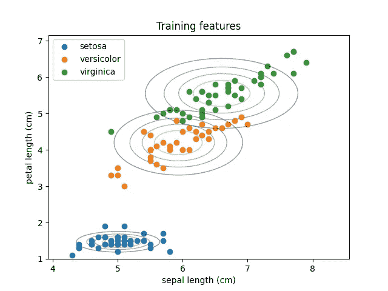

# 不那么天真的贝叶斯

> 原文：<https://towardsdatascience.com/not-so-naive-bayes-eb0936fa8b4a>

## 通过释放简单贝叶斯分类器的天真假设来改进它


尽管非常简单，朴素贝叶斯分类器往往在一些现实世界的应用程序中工作得很好，如著名的文档分类或垃圾邮件过滤。它们不需要太多的训练数据，速度非常快。因此，它们经常被用作分类任务的简单基线。许多人不知道的是，我们可以通过一个简单的技巧让他们变得不那么天真。


# 为什么朴素贝叶斯是贝叶斯？

朴素贝叶斯是一种简单的概率算法，它利用了贝叶斯定理，因此得名。贝叶斯定理是一个简单的数学规则，它告诉我们如何从`P(B|A)`到`P(A|B)`。如果我们知道某样东西给定另一样东西的概率，我们可以通过下面这个简单的等式来还原它:


贝叶斯定理

如果你需要复习上面的概率符号，不要犹豫，绕道去[这篇关于主题](/on-the-importance-of-bayesian-thinking-in-everyday-life-a74475fcceeb)的介绍性文章。

朴素贝叶斯算法以非常简单的方式利用贝叶斯定理。它使用训练数据来计算给定目标的每个特征的概率分布，然后，基于定理，它得到相反的结果:给定特征的目标的概率。一旦我们有了特征，这足以预测新数据的分类概率。


# 实践中的朴素贝叶斯

让我们看看它的实际效果。我们将使用臭名昭著的[鸢尾数据集](https://scikit-learn.org/stable/auto_examples/datasets/plot_iris_dataset.html)，其中的任务是根据花瓣和萼片的测量结果将花朵分为三个鸢尾种类。为了直观形象，我们将只使用两个特征:萼片长度和花瓣长度。让我们从加载数据开始，并留出一部分数据供以后测试。

现在让我们实现朴素贝叶斯算法。我们将从头开始，而不是使用现成的 scikit-learn 实现，以便我们可以在以后的基础上轻松添加 sklearn 中缺少的功能。

我们将使用 *empiricaldist* 包来做这件事。这是一个建立在 *pandas* 之上的很好的小工具，它允许我们轻松地定义和计算概率分布。如果你好奇，我在这里写了更多关于它的内容。

首先，我们需要从一个关于鸢尾属物种的先验信念开始。在我们看到它的尺寸之前，让我们说一朵花同样可能是这三个物种中的任何一个。

```
>> prior
0    0.333333
1    0.333333
2    0.333333
Name: , dtype: float64
```

我们将实现朴素贝叶斯分类器的一个流行版本，称为高斯朴素贝叶斯。它假设给定目标的每个特征都是正态分布的，或者在每个目标类中，每个特征都可以用正态分布来描述。我们将从训练数据中估计这些分布的参数:我们只需要按目标对数据进行分组，并计算每个类的两个特征的均值和标准差。这允许我们将每个要素类组合映射到参数化的正态分布。

```
>> normals
[{0: <scipy.stats._distn_infrastructure.rv_frozen at 0x136d2be20>,
  1: <scipy.stats._distn_infrastructure.rv_frozen at 0x136d07a60>,
  2: <scipy.stats._distn_infrastructure.rv_frozen at 0x136cfe1c0>},
 {0: <scipy.stats._distn_infrastructure.rv_frozen at 0x136d07a90>,
  1: <scipy.stats._distn_infrastructure.rv_frozen at 0x136cda940>,
  2: <scipy.stats._distn_infrastructure.rv_frozen at 0x136be3790>}]
```

我们有两本词典，每本都有三种正态分布。第一本字典描述每个目标类的萼片长度分布，而第二本字典处理花瓣长度。

我们现在可以定义基于数据更新先验的函数。

`update_iris()`将先验、特征值和对应于该特征的正态分布字典作为输入，并使用适当的正态分布计算每个类别的可能性。然后，根据贝叶斯公式将先验与似然相乘得到后验概率。

`update_naive()`迭代我们正在使用的两个特性，并为每个特性运行更新。

我们现在可以迭代测试集，并对所有测试示例进行分类。请注意，我们使用的正态分布的参数是基于训练数据估计的。最后，让我们在测试集上计算准确度。

```
>> acc
0.9333333333333333
```

我们的测试准确率达到了 93.3%。为了确保我们得到了正确的算法，让我们将它与 scikit-learn 实现进行比较。

```
>> acc_sklearn
0.9333333333333333
```


# 为什么朴素贝叶斯是朴素的？

朴素贝叶斯假设给定目标的每对特征之间的条件独立性。简而言之，它假设在每一个类中，这些特性彼此不相关。这是一个强有力的假设，也是一个相当天真的假设。想想我们的鸢尾花:期望更大的花同时具有更长的萼片和更长的花瓣并不是不合理的。事实上，在我们的训练数据中，这两个特征之间的相关性为 88%。让我们看看训练数据的散点图。


训练特征之间的相关性。图片由作者提供。

似乎对于三种鸢尾属植物中的两种，花瓣和萼片长度确实表现出很强的相关性。但我们的朴素算法忽略了这种相关性，并将每个特征建模为正态分布，独立于另一个特征。为了使这一概念更加直观，我们来显示要素的这三个正态联合分布的等值线，每个类别一个。



假设独立正态分布。图片由作者提供。

等高线与图的轴对齐，表明这两个特征之间假定缺乏相关性。朴素贝叶斯的天真假设显然不适用于*杂色鸢尾*和*海滨鸢尾*！


# 让朴素贝叶斯不那么朴素

到目前为止，我们已经假设每个特征是正态分布的，并且我们已经将这些分布的平均值和标准偏差估计为每个类别中相应特征的平均值和标准偏差。这个想法可以简单地扩展到考虑特征之间的相关性。

我们可以用一些正协方差来定义它们的联合分布，而不是为这两个特征中的每一个定义两个独立的正态分布，来表示相关性。我们可以再次使用训练数据协方差作为估计。

```
>> multi_normals
{0: <scipy.stats._multivariate.multivariate_normal_frozen at 0x1546dd1f0>,
 1: <scipy.stats._multivariate.multivariate_normal_frozen at 0x1546ddaf0>,
 2: <scipy.stats._multivariate.multivariate_normal_frozen at 0x1546dd970>}
```

上面的代码和之前的非常相似。对于每个类别，我们定义了一个用训练数据的均值和协方差参数化的多元正态分布。

让我们将这些分布的轮廓叠加到散点图上。


这些分布似乎更符合数据。同样，我们可以迭代测试集，并基于给定目标的特征的联合多元正态分布，用新模型对所有测试示例进行分类。注意，这次我们没有用`update_naive()`，而是直接用`update_iris()`。唯一的区别是，我们传递给它一个多元法线，而不是用两个独立的单变量法线调用它两次。

```
>> acc
0.9666666666666667
```

我们已经设法将精确度提高了 3.3 个百分点。然而，主要的一点是，我们可以摆脱朴素贝叶斯的朴素独立性假设，并希望以一种非常简单的方式使它更好地适应数据。

这种方法在 scikit-learn 中不可用，但是可以随意使用我下面定义的简单实现。

这里是如何使用它。

```
>> acc
0.9666666666666667
```


# 来源

*   *艾伦·b·唐尼认为贝氏。Python 中的贝叶斯统计，*第二版，奥赖利，2021
*   Scikit-learn 的关于朴素贝叶斯的[文档](https://scikit-learn.org/stable/modules/naive_bayes.html)


如果你喜欢这篇文章，为什么不订阅电子邮件更新我的新文章呢？并且通过 [**成为媒介会员**](https://michaloleszak.medium.com/membership) ，可以支持我的写作，获得其他作者和我自己的所有故事的无限访问权限。

需要咨询？你可以问我任何事情，也可以在这里 为我预约 1:1 [**。**](http://hiretheauthor.com/michal)

你也可以试试我的其他文章。不能选择？从这些中选择一个:

[](/on-the-importance-of-bayesian-thinking-in-everyday-life-a74475fcceeb) [## 贝叶斯思维在日常生活中的重要性

### 这个简单的思维转变将帮助你更好地理解你周围不确定的世界

towardsdatascience.com](/on-the-importance-of-bayesian-thinking-in-everyday-life-a74475fcceeb) [](/comparing-things-the-bayesian-approach-b9a26ddb5ef1) [## 比较事物:贝叶斯方法

### 如何进行包含不确定性的概率比较

towardsdatascience.com](/comparing-things-the-bayesian-approach-b9a26ddb5ef1) [](/the-gentlest-of-introductions-to-bayesian-data-analysis-74df448da25) [## 贝叶斯数据分析最温和的介绍

towardsdatascience.com](/the-gentlest-of-introductions-to-bayesian-data-analysis-74df448da25)