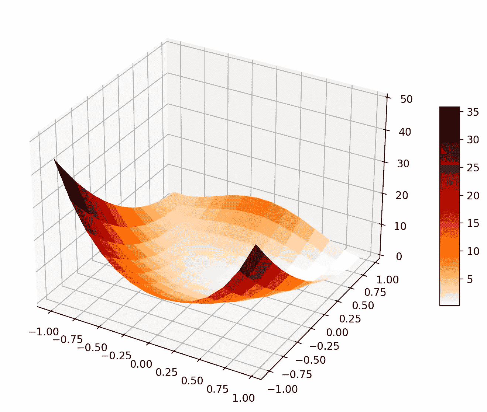

# 基于 L-BFGS 方法的数值优化

> 原文：<https://towardsdatascience.com/numerical-optimization-based-on-the-l-bfgs-method-f6582135b0ca>

## 我们将使用 Rosenbrock 函数的一个最小化示例来检验有限内存的 Broyden、Fletcher、Goldfarb 和 Shanno (L-BFGS)优化方法。此外，我们将比较 L-BFGS 方法和梯度下降法的性能。L-BFGS 方法以及其他几个数值优化例程是机器学习的核心。

# 介绍

最优化问题旨在找到给定目标函数的最小值或最大值。最优化问题有两种确定性方法——一阶导数法(如梯度下降法、最速下降法)和二阶导数法(如牛顿法)。一阶导数方法依赖于沿着下坡/上坡的导数(或梯度)来寻找函数的最大值(最优解)。基于导数(Hessian，包含二阶导数的矩阵)的导数的二阶导数方法可以更有效地估计目标函数的最小值。这是因为二阶导数给了我们走向最优解的方向和所需的步长。

L-BFGS 方法是一种二阶优化算法，属于一类拟牛顿方法。对于不能直接计算的问题，它近似于二阶导数。牛顿法使用海森矩阵(因为它是二阶导数法)。然而，它有一个限制，因为它需要计算 Hessian 的逆运算，这可能是计算密集型的。拟牛顿法使用梯度近似 Hessian 的逆，因此在计算上是可行的。

BFGS 方法(L-BFGS 是 BFGS 的扩展)在每次迭代中更新海森矩阵的计算，而不是重新计算它。然而，Hessian 及其逆的大小取决于目标函数的输入参数的数量。因此，对于一个大问题来说，粗麻布的尺寸可能是一个需要处理的问题。L-BFGS 通过假设前一次迭代中的 Hessian 逆的简化来解决这个问题。与基于梯度的完整历史的 BFGS 不同，L-BFGS 基于最近的 n 个梯度(通常为 5-20，存储要求小得多)。

# 牛顿方法

详细的数学计算见下面的帖子:

[](https://www.earthinversion.com/techniques/the-L-BFGS-optimization-method/) [## 基于 L-BFGS 方法的数值优化

### 在这篇文章中，我们将检查有限内存的布罗伊登，弗莱彻，戈德法布和山诺(L-BFGS)优化方法…

www.earthinversion.com](https://www.earthinversion.com/techniques/the-L-BFGS-optimization-method/) 

让我们从数学上看看我们是如何解决牛顿法的:

利用泰勒展开式，我们可以将二次可微函数 f(t)写成


为了获得最小值/最大值，这给出


这给出了向最佳点方向移动的步长。

# 罗森布罗克函数的 L-BFGS 实现

Rosenbrock 函数是一个非凸函数，用于优化算法的性能测试。

```
# l-bfgs-b algorithm local optimization of a convex function
from scipy.optimize import minimize
from scipy.optimize import rosen, rosen_der
import numpy as np
from matplotlib import cm
import matplotlib.pyplot as plt
import time
np.random.seed(122)

def plot_objective(objective):
    # Initialize figure 
    figRos = plt.figure(figsize=(12, 7))
    axRos = plt.subplot(111, projection='3d')

    # Evaluate function
    X = np.arange(-1, 1, 0.15)
    Y = np.arange(-1, 1, 0.15)
    X, Y = np.meshgrid(X, Y)
    XX = (X,Y)
    Z = objective(XX)

    # Plot the surface
    surf = axRos.plot_surface(X, Y, Z, cmap=cm.gist_heat_r,
                        linewidth=0, antialiased=False)
    axRos.set_zlim(0, 50)
    figRos.colorbar(surf, shrink=0.5, aspect=10)
    plt.savefig('objective_function.png',bbox_inches='tight', dpi=200)
    plt.close()

## Rosenbrock function
# objective function
b = 10
def objective(x):
    f = (x[0]-1)**2 + b*(x[1]-x[0]**2)**2
    return f

plot_objective(objective)

# derivative of the objective function
def derivative(x):
    df = np.array([2*(x[0]-1) - 4*b*(x[1] - x[0]**2)*x[0], \
                         2*b*(x[1]-x[0]**2)])
    return df

starttime = time.perf_counter()
# define range for input
r_min, r_max = -1.0, 1.0

# define the starting point as a random sample from the domain
pt = r_min + np.random.rand(2) * (r_max - r_min)
print('initial input pt: ', pt)

# perform the l-bfgs-b algorithm search
result = minimize(objective, pt, method='L-BFGS-B', jac=derivative)
print(f"Total time taken for the minimization: {time.perf_counter()-starttime:.4f}s")
# summarize the result
print('Status : %s' % result['message'])
print('Total Evaluations: %d' % result['nfev'])

# evaluate solution
solution = result['x']
evaluation = objective(solution)
print('Solution: f(%s) = %.5f' % (solution, evaluation))
```

这给了

```
$ python lbfgs_algo.py 
initial input pt:  [-0.68601632  0.40442008]
Total time taken for the minimization: 0.0046s
Status : CONVERGENCE: NORM_OF_PROJECTED_GRADIENT_<=_PGTOL
Total Evaluations: 24
Solution: f([1.0000006  1.00000115]) = 0.00000
```

该方法在 24 次迭代中收敛到最小值需要 0.0046 秒。



用作测试优化函数的 Rosenbrock 函数(图片由作者提供)

# 梯度下降法

```
import numpy as np
import time
starttime = time.perf_counter()

# define range for input
r_min, r_max = -1.0, 1.0

# define the starting point as a random sample from the domain
cur_x = r_min + np.random.rand(2) * (r_max - r_min)

rate = 0.01 # Learning rate
precision = 0.000001 #This tells us when to stop the algorithm
previous_step_size = 1 #
max_iters = 10000 # maximum number of iterations
iters = 0 #iteration counter

## Rosenbrock function
# objective function
b = 10
def objective(x):
    f = (x[0]-1)**2 + b*(x[1]-x[0]**2)**2
    return f

# derivative of the objective function
def derivative(x):
    df = np.array([2*(x[0]-1) - 4*b*(x[1] - x[0]**2)*x[0], \
                         2*b*(x[1]-x[0]**2)])
    return df

while previous_step_size > precision and iters < max_iters:
    prev_x = cur_x #Store current x value in prev_x
    cur_x = cur_x - rate * derivative(prev_x) #Grad descent
    previous_step_size = sum(abs(cur_x - prev_x)) #Change in x
    iters = iters+1 #iteration count
print(f"Total time taken for the minimization: {time.perf_counter()-starttime:.4f}s")
print("The local minimum occurs at point", cur_x, "for iteration:", iters)
```

这给了

```
$ python gradient_descent.py 
Total time taken for the minimization: 0.0131s
The local minimum occurs at point [0.99991679 0.99983024] for iteration: 2129
```

梯度下降法获得相同 Rosenbrock 函数最小值的总运行时间为 0.0131 秒(比 lbfgs 多 3 倍)。这种情况下的总迭代次数是 2129 次。

# 结论

我们讨论了二阶导数方法，如牛顿法，特别是 L-BFGS(一种拟牛顿法)。然后，我们比较了 L-BFGS 方法和基于一阶导数的梯度下降法。我们发现，L-BFGS 方法比梯度下降法收敛的迭代次数少得多，总运行时间比 L-BFGS 少 3 倍。

# 参考

1.  [BFGS 优化算法简介](https://machinelearningmastery.com/bfgs-optimization-in-python/)
2.  [数值优化:了解 L-BFGS](https://aria42.com/blog/2014/12/understanding-lbfgs) 1。[L-BFGS 是如何工作的？](https://stats.stackexchange.com/questions/284712/how-does-the-l-bfgs-work)
3.  [罗森布罗克函数](https://en.wikipedia.org/wiki/Rosenbrock_function)

*原载于 2022 年 3 月 11 日*[*https://www.earthinversion.com*](https://www.earthinversion.com/techniques/the-L-BFGS-optimization-method/)*。*