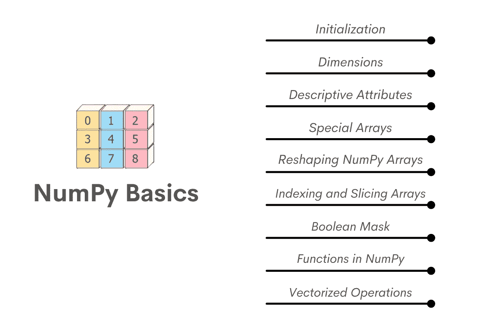

# 数据科学面试的数字

> 原文：<https://towardsdatascience.com/numpy-for-data-science-interviews-1f86e7277ddd>

## *数据科学 NumPy 简介*


作者在 [Canva](https://canva.com/) 上创建的图像

NumPy 是 Python 数据科学生态系统中用于科学计算的基础库。NumPy 的一些关键特性包括

*   速度:NumPy 数组比标准 Python 列表快 50 倍
*   性能:NumPy 融合了 Python 的易用性和 C 的速度
*   索引和广播:熊猫中广泛使用的特性是从 NumPy 继承来的。
*   计算工具:NumPy 拥有全面的数学函数和计算工具，几乎可以满足所有需求。您可以执行诸如曲线拟合、优化、线性代数、变换等操作。，得心应手。
*   NumPy 是许多其他科学计算库构建的基础。一些使用 NumPy 的知名库有
    - Stats 和 ML 库:SciPy、Statsmodels、Scikit-Learn、SpaCy
    -可视化:Matplotlib、Seaborn、Plotly、Bokeh、Altair
    -数组操作:PyTorch、Dask、TensorFlow
    - ETL: Pandas

如果你是一个有抱负的数据科学家，精通 NumPy 是意料之中的。幸运的是，NumPy 简单易学。在这个由两部分组成的系列中，我们将从 NumPy 的基础开始，转到 NumPy 的高级用法。

# 对金钱的需求

让我们举一个简单的例子。假设你想从 A 点到 B 点，有多种旅行方式。你可以骑自行车试着走路，或者你可能想开车。有很多选择，你可以选择跑车或 SUV，甚至在车辆中。如果你不知道你将在什么样的地形上行驶，你可能会更适合使用 SUV，因为这就是它们的设计目的——一种多功能车辆。然而，如果你的目标是在尽可能短的时间内完成旅程，并且你知道道路铺设良好，没有来自另一个方向的意外交通，你会选择跑车，因为你可以快速通过距离。简而言之，这就是标准 Python 列表和 NumPy 数组之间的区别。Python 列表是您的全地形车，而 NumPy 数组是跑车。Python 列表旨在处理可以插入到列表中的所有类型的数据。然而，假设。您知道数据是同质的和数字类型的数据(整数、浮点、布尔、日期时间等。)并涉及大量计算。在这种情况下，您最好使用 NumPy。

让我们看一个简单的用例。假设我们有一个简单的五种元素的列表。我们想创建另一个列表，包含这些元素除以 5 的结果。我们将不得不遍历列表并逐元素执行操作，因为对整个列表执行除法操作将导致错误。

```
mylist **=** [10,20,30,40,50]
mylist **/** 5**--------------------------------------------------------------------**
**TypeError**                                 Traceback (most recent call last)
**~\AppData\Local\Temp/ipykernel_21064/503464290.py** in <module>
      1 mylist **=** **[10,20,30,40,50]**
**----> 2** mylist **/** **5**

**TypeError**: unsupported operand type(s) for /: 'list' and 'int'
```

即使这五个元素都是数字，Python 列表也不允许您执行这种除法运算，因为 Python 运算设计用于所有可能的情况。由于列表不需要只包含数字数据类型，Python 不允许这样做。

输入 NumPy。使用 NumPy 数组，我们可以简单地将整个数组除以 5。就像你会对熊猫系列做的一样(事实上，熊猫系列从 NumPy 获得这些能力)。

```
myarray **=** np**.**array(mylist)
myarray **/** 5array([ 2.,  4.,  6.,  8., 10.])
```

使用 NumPy 的另一个原因是速度。NumPy 数组比 Python 标准列表快得多。这里有一个简单的例子。我们将添加两个 Python 列表，每个列表包含一百万个元素。比较列表操作和等价的 NumPy 操作，我们发现 NumPy 比标准列表快 20 倍。( ***注:速度可能不同*** )

```
size_of_vec **=** 1000000

**def** pure_python_version():                                                
    time_python **=** time**.**time()                                             
    my_list1 **=** range(size_of_vec)                                         
    my_list2 **=** range(size_of_vec)
    sum_list **=** [my_list1[i] **+** my_list2[i] **for** i **in** range(len(my_list1))]  
    **return** time**.**time() **-** time_python                                      

**def** numpy_version():                                                      
    time_numpy **=** time**.**time()                                              
    my_arr1 **=** np**.**arange(size_of_vec)                                      
    my_arr2 **=** np**.**arange(size_of_vec)
    sum_array **=** my_arr1 **+** my_arr2                                         
    **return** time**.**time() **-** time_numpy                                       

python_time **=** pure_python_version()                                       
numpy_time **=** numpy_version()                                              
print("Pure Python version {:0.4f}"**.**format(python_time))
print("Numpy version {:0.4f}"**.**format(numpy_time))
print("Numpy is in this example {:0.4f} times faster!"**.**format(python_time**/**numpy_time))Pure Python version 0.2890
Numpy version 0.0030
Numpy is in this example 96.4017 times faster!
```

# NumPy 与 Python 和 Pandas 数据类型的比较

熊猫呢？熊猫数据框提供了一种操作表格数据的简单方法。每个熊猫系列都是建立在 NumPy 阵列上的。熊猫提供了使用行标签和列标签来标记元素的优势。

```
**Pandas Series and NumPy arrays**
myseries = pd.Series([10,20,30,40,50], index = ['A', 'B', 'C', 'D', 'E'])
myseries
A    10
B    20
C    30
D    40
E    50
dtype: int64
pd_to_np = myseries.to_numpy()
pd_to_np
array([10, 20, 30, 40, 50], dtype=int64)
```

然而，随着数据量的增长，数学运算变得越来越慢。人们可以使用 Pandas 来操作数据，然后转移到 NumPy 来更快地执行操作。

# 数字基础



作者在 [Canva](https://canva.com/) 上创建的图片

# 初始化

有多种初始化 NumPy 数组的方法。最简单的方法是向 NumPy 中的 array 方法传递一个列表(或任何其他类似数组的对象)。

```
list_to_np = np.array([1,2,3,4,5])
list_to_np
array([1, 2, 3, 4, 5])
tuple_to_np = np.array((1,2,3,4,5))
tuple_to_np
array([1, 2, 3, 4, 5])
```

但是，下面的代码会产生一个错误。

```
# This will result in an error
wrong_np= np.array(1,2,3,4,5)
wrong_np
--------------------------------------------------------------------
TypeError                                 Traceback (most recent call last)
~\AppData\Local\Temp/ipykernel_21064/3907638067.py in <module>
      1 # This will result in an error
----> 2 wrong_np= np.array(1,2,3,4,5)
      3 wrong_npTypeError: array() takes from 1 to 2 positional arguments but 5 were given
```

这是开始使用 NumPy 时最常见的错误之一。我们需要将数组元素作为类似数组的对象传递，如 list、tuple、Pandas Series 等。

# 规模

NumPy 数组是同质项目的 n 维容器。NumPy 可以处理多维数据，因此非常适合科学计算。我们可以像前面创建一维数组一样创建多维数组。

**多维数组**

```
array_2d = np.array([
    [1,2,3,4,5], 
    [11,12,13,14,15]
]
)
array_2d
array([[ 1,  2,  3,  4,  5],
       [11, 12, 13, 14, 15]])
```

要记住的一点是，这里的子列表的长度应该是相同的，否则，NumPy 将创建一个所谓的不规则数组(列表类型的数组)数据，这基本上违背了 NumPy 的目的。

```
# Ragged Array
array_ragged = np.array([
    [1,2,3,4,5], 
    [11,12,13,14,15, 16]
]
)
array_raggedC:\Users\Asus\AppData\Local\Temp/ipykernel_21064/3536024976.py:2: VisibleDeprecationWarning: Creating an ndarray from ragged nested sequences (which is a list-or-tuple of lists-or-tuples-or ndarrays with different lengths or shapes) is deprecated. If you meant to do this, you must specify 'dtype=object' when creating the ndarray
  array_ragged = np.array([
array([list([1, 2, 3, 4, 5]), list([11, 12, 13, 14, 15, 16])],
      dtype=object)
```

把它想象成驾驶一辆跑车进入沙漠。它会移动(至少一段时间)，但这不是它的设计目的！

我们可以很容易地将一维数据转换成多维数据，反之亦然。我们将在以后研究这些。

# 描述性属性

与熊猫一样，我们可以找出 NumPy 数组的各种属性。最常用的属性是。

***ndim*** :数据的维数(轴数)。

```
myarray
array([10, 20, 30, 40, 50])
myarray.ndim
1
array_2d
array([[ 1,  2,  3,  4,  5],
       [11, 12, 13, 14, 15]])
array_2d.ndim
2
```

***shape* :** 它以元组的形式返回每个维度上元素的数量

```
myarray.shape
(5,)
array_2d.shape
(2, 5)
```

***size*** :返回数组中元素的个数。

```
myarray.size
5
array_2d.size
10
```

***dtype* :** 这为我们提供了数组元素的数据类型。

```
dtype : datatype of the array elementsmyarray
array([10, 20, 30, 40, 50])
myarray.dtype
dtype('int32')
myarray / 5
array([ 2.,  4.,  6.,  8., 10.])
(myarray / 5).dtype
dtype('float64')
```

虽然最常见的数据类型是整数(int)和浮点(float)，但 NumPy 还允许您创建日期时间、布尔和字符类型数组。

# 特殊数组

NumPy 允许我们非常容易地快速初始化大型数组，尤其是那些与科学计算相关的数组。

***个****—1 的数组。*

```
ones_ar = np.ones([3,7])
ones_ar
array([[1., 1., 1., 1., 1., 1., 1.],
       [1., 1., 1., 1., 1., 1., 1.],
       [1., 1., 1., 1., 1., 1., 1.]])
```

***0***—0 的数组

```
zeros_ar = np.zeros([6,4])
zeros_ar
array([[0., 0., 0., 0.],
       [0., 0., 0., 0.],
       [0., 0., 0., 0.],
       [0., 0., 0., 0.],
       [0., 0., 0., 0.],
       [0., 0., 0., 0.]])
```

***眼*** —指定对角线上为 1，其他地方为 0 的数组。

```
eye_ar = np.eye(6,4, 1)
eye_ar
array([[0., 1., 0., 0.],
       [0., 0., 1., 0.],
       [0., 0., 0., 1.],
       [0., 0., 0., 0.],
       [0., 0., 0., 0.],
       [0., 0., 0., 0.]])
eye_ar2 = np.eye(6,4, -2)
eye_ar2
array([[0., 0., 0., 0.],
       [0., 0., 0., 0.],
       [1., 0., 0., 0.],
       [0., 1., 0., 0.],
       [0., 0., 1., 0.],
       [0., 0., 0., 1.]])
```

除此之外，我们还可以创建等距数组。标准 Python 中有 range 数据类型。NumPy 有两种非常常用的方法来快速创建相似间距的值。这些是:

***arange:*** 这与标准 Python 中的 range 数据类型非常相似。NumPy 中的 arange 方法使用与 range 数据类型相同的元素创建一个数组。与 range 数据类型不同，它存储为 NumPy 数组。

```
arange_ar = np.arange(1,20,3)
arange_ar
array([ 1,  4,  7, 10, 13, 16, 19])
```

***linspace***:linspace 方法将给定的端点划分成等间距的区间。在给定的例子中，我们想要五个等距的点，1 和 12 是端点。

```
linspace_ar = np.linspace(1,12,5)
linspace_ar
array([ 1\.  ,  3.75,  6.5 ,  9.25, 12\.  ])
```

# 重塑 NumPy 数组

NumPy 允许您轻松地将数组的形状更改为我们想要的尺寸。我们可以简单地使用 reshape 方法来改变数组的形状。需要注意的一点是，只有当两个数组的大小(元素的数量)相同时，才可以改变数组的形状。因此，您可以将包含 60 个元素的数组拆分为以下形状

*   60x1(或 1x60、1x 60x 1……)
*   2x30
*   4x15
*   2x3x10
*   1x6x5 等等

```
ar60 = np.arange(1,61)
ar60
array([ 1,  2,  3,  4,  5,  6,  7,  8,  9, 10, 11, 12, 13, 14, 15, 16, 17,
       18, 19, 20, 21, 22, 23, 24, 25, 26, 27, 28, 29, 30, 31, 32, 33, 34,
       35, 36, 37, 38, 39, 40, 41, 42, 43, 44, 45, 46, 47, 48, 49, 50, 51,
       52, 53, 54, 55, 56, 57, 58, 59, 60])
ar_6_10 = ar60.reshape(6,10)
ar_6_10
array([[ 1,  2,  3,  4,  5,  6,  7,  8,  9, 10],
       [11, 12, 13, 14, 15, 16, 17, 18, 19, 20],
       [21, 22, 23, 24, 25, 26, 27, 28, 29, 30],
       [31, 32, 33, 34, 35, 36, 37, 38, 39, 40],
       [41, 42, 43, 44, 45, 46, 47, 48, 49, 50],
       [51, 52, 53, 54, 55, 56, 57, 58, 59, 60]])
ar_6_10.shape
(6, 10)
```

但是，不能将一个 60 元素的数组拆分成另一个一维上有 7 个元素的数组

```
ar60.reshape(7,10)
--------------------------------------------------------------------
ValueError                                Traceback (most recent call last)
~\AppData\Local\Temp/ipykernel_21064/1130489163.py in <module>
----> 1 ar60.reshape(7,10)ValueError: cannot reshape array of size 60 into shape (7,10)
```

NumPy 中的快速破解允许它自己计算尺寸。例如，如果您不知道特定数组中元素的确切数量，但想要六行，我们可以通过指定-1 作为要计算的维度来实现。

```
ar60.reshape(6,-1)
array([[ 1,  2,  3,  4,  5,  6,  7,  8,  9, 10],
       [11, 12, 13, 14, 15, 16, 17, 18, 19, 20],
       [21, 22, 23, 24, 25, 26, 27, 28, 29, 30],
       [31, 32, 33, 34, 35, 36, 37, 38, 39, 40],
       [41, 42, 43, 44, 45, 46, 47, 48, 49, 50],
       [51, 52, 53, 54, 55, 56, 57, 58, 59, 60]])
```

在上面的例子中，我们有 60 个元素，所以当我们把它调整为(6，-1)时，NumPy 自动计算出另一个维度为 60 / 6 = 10。

显然，如果一个轴上的元素数不是 60 的倍数，这就行不通了。所以这将返回一个错误。

```
# This will return an error
ar60.reshape(7,-1)
--------------------------------------------------------------------
ValueError                                Traceback (most recent call last)
~\AppData\Local\Temp/ipykernel_21064/3388074008.py in <module>
      1 # This will return an error
----> 2 ar60.reshape(7,-1)ValueError: cannot reshape array of size 60 into shape (7,newaxis)
```

此外，NumPy 一次只能计算一个未知维度。所以这也会导致错误。

```
# So will this
ar60.reshape(6,-1,-1)
--------------------------------------------------------------------
ValueError                                Traceback (most recent call last)
~\AppData\Local\Temp/ipykernel_21064/2258005957.py in <module>
      1 # So will this
----> 2 ar60.reshape(6,-1,-1)ValueError: can only specify one unknown dimension
```

# 索引和切片数组

索引和切片 NumPy 数组，就像我们处理 Pandas 数据帧、Pandas 系列和列表一样。假设你想在一个数组中找到第 n 个索引项；您可以像我们处理 Python 列表一样简单地使用切片器。切片器的其他功能也像处理 Python 列表或 Pandas 数据帧一样工作。

```
ar60
array([ 1,  2,  3,  4,  5,  6,  7,  8,  9, 10, 11, 12, 13, 14, 15, 16, 17,
       18, 19, 20, 21, 22, 23, 24, 25, 26, 27, 28, 29, 30, 31, 32, 33, 34,
       35, 36, 37, 38, 39, 40, 41, 42, 43, 44, 45, 46, 47, 48, 49, 50, 51,
       52, 53, 54, 55, 56, 57, 58, 59, 60])
• Accessing the item at index = 5 (Note NumPy is zero indexed)
ar60[5]
6
• Accessing the first 10 elements
ar60[:10]
array([ 1,  2,  3,  4,  5,  6,  7,  8,  9, 10])
```

对于多维数组，我们可以用与 Pandas iloc 方法相同的方式进行索引。这是一个从二维数组中选择的例子

```
ar5_12 = ar60.reshape(5,12)
ar5_12
array([[ 1,  2,  3,  4,  5,  6,  7,  8,  9, 10, 11, 12],
       [13, 14, 15, 16, 17, 18, 19, 20, 21, 22, 23, 24],
       [25, 26, 27, 28, 29, 30, 31, 32, 33, 34, 35, 36],
       [37, 38, 39, 40, 41, 42, 43, 44, 45, 46, 47, 48],
       [49, 50, 51, 52, 53, 54, 55, 56, 57, 58, 59, 60]])
ar5_12[2,5]
30
```

也可以通过使用多个切片器来进行子集划分。这是从二维数组中选择多个项目的另一个例子

```
ar5_12[2][5]
30
```

我们还可以将一系列索引传递给切片器。这非常类似于熊猫数据帧中的 iloc 方法。

```
• NumPy indexing is very similar to iloc method in Pandas
ar5_12[:, 3]
array([ 4, 16, 28, 40, 52])
ar5_12[2, :]
array([25, 26, 27, 28, 29, 30, 31, 32, 33, 34, 35, 36])
```

# 布尔掩码

NumPy 中最强大的概念之一是布尔屏蔽。正如我们在前面的 Pandas 中看到的，我们可以基于逻辑真/假条件对 NumPy 数组进行子集划分，并获得满足该条件的元素输出。这在熊猫中相当普遍。

```
ar60
array([ 1,  2,  3,  4,  5,  6,  7,  8,  9, 10, 11, 12, 13, 14, 15, 16, 17,
       18, 19, 20, 21, 22, 23, 24, 25, 26, 27, 28, 29, 30, 31, 32, 33, 34,
       35, 36, 37, 38, 39, 40, 41, 42, 43, 44, 45, 46, 47, 48, 49, 50, 51,
       52, 53, 54, 55, 56, 57, 58, 59, 60])ar60[ar60 % 3 == 0]array([ 3,  6,  9, 12, 15, 18, 21, 24, 27, 30, 33, 36, 39, 42, 45, 48, 51,
       54, 57, 60])
```

与 Pandas 一样，在创建这些布尔掩码时，我们将不得不使用 Python 逻辑操作符，而不是像 and、or 这样的关键字。

```
ar60[(ar60 % 3 == 0) | (ar60 % 5 == 0)]
array([ 3,  5,  6,  9, 10, 12, 15, 18, 20, 21, 24, 25, 27, 30, 33, 35, 36,
       39, 40, 42, 45, 48, 50, 51, 54, 55, 57, 60])
# This will result in an error
ar60[(ar60 % 3 == 0) or (ar60 % 5 == 0)]
--------------------------------------------------------------------
ValueError                                Traceback (most recent call last)
~\AppData\Local\Temp/ipykernel_21064/445061012.py in <module>
      1 # This will result in an error
----> 2 ar60[(ar60 % 3 == 0) or (ar60 % 5 == 0)]ValueError: The truth value of an array with more than one element is ambiguous. Use a.any() or a.all()
```

查看我们的帖子“[微软数据科学家面试问题](https://www.stratascratch.com/blog/microsoft-data-scientist-interview-questions/?utm_source=blog&utm_medium=click&utm_campaign=medium)”，找到最近的一个面试问题，该问题测试“布尔掩码数组”作为 Python 的主要概念之一。

# NumPy 中的函数

NumPy 自带各种内置函数。这些函数可以非常快速地执行数学运算和复杂的科学计算。

```
ar5_12
array([[ 1,  2,  3,  4,  5,  6,  7,  8,  9, 10, 11, 12],
       [13, 14, 15, 16, 17, 18, 19, 20, 21, 22, 23, 24],
       [25, 26, 27, 28, 29, 30, 31, 32, 33, 34, 35, 36],
       [37, 38, 39, 40, 41, 42, 43, 44, 45, 46, 47, 48],
       [49, 50, 51, 52, 53, 54, 55, 56, 57, 58, 59, 60]])
ar5_12.sum()
1830
```

我们也可以沿着特定的轴而不是整个数组来执行这些操作。所以，如果你想得到沿行或仅沿列的元素的和，那也是可能的，记住最外面的维度是轴 0，下一个是轴 1，依此类推。与标准 Python 一样，我们可以使用负索引。最里面的维度将是 axis = -1，依此类推。

```
ar5_12.shape
(5, 12)• axus 0 is the outer most axis, -1 is the innermost
ar5_12.sum(axis = 0)
array([125, 130, 135, 140, 145, 150, 155, 160, 165, 170, 175, 180])
ar5_12.sum(axis = 1)
array([ 78, 222, 366, 510, 654])• Negative axis
ar5_12.sum(axis = -1)
array([ 78, 222, 366, 510, 654])
ar5_12.sum(axis = -2)
array([125, 130, 135, 140, 145, 150, 155, 160, 165, 170, 175, 180])
```

除了简单的聚合函数，如 sum、max、min 等。，我们也有内置的标准数学函数。NumPy 中函数的[完整列表](https://numpy.org/doc/stable/reference/routines)可以参考文档。

# 矢量化运算

使 NumPy 如此强大的另一个特性是矢量化运算。这些允许我们在整个维度甚至整个数组上执行数学运算。例如，如果我们想添加两个数组，你可以简单地这样做。

```
list01 = [10,11,12,13]
list02 = [20,21,22,23]
np.array(list01) + np.array(list02)
array([30, 32, 34, 36])
```

这对于连接两个列表的 Python 列表来说是不可能的。

```
list01 + list02
[10, 11, 12, 13, 20, 21, 22, 23]
```

这些操作不仅限于相同维数的数组。甚至不同的数组也可以用于这些矢量化运算。这个过程称为广播，我们将在本系列的下一部分中研究 NumPy 的这些和更多高级特性，我们将涉及:

*   NumPy 随机数运算
*   堆叠和拆分等阵列操作
*   处理缺失值
*   广播
*   矩阵运算
*   曲线拟合
*   将数据导入 NumPy

## 结论

对于有抱负的数据科学家来说，NumPy 可以说是仅次于 Pandas 的最重要的 Python 库。虽然对于没有数学或技术背景的人来说，NumPy 可能会显得有点不舒服，但如果我们从熊猫开始，那么 NumPy 就变得非常容易使用。NumPy 提供的可能性和能力是其他标准库中所没有的。

和其他技能一样，耐心、坚持和练习是提高的关键。如果你想在实际的数据科学面试中实践这些以及更多现实生活中的问题，请立即加入 StrataScratch。您将发现一个由 20，000 多名志同道合的数据科学爱好者组成的社区，并在解决 500 多个不同难度的编码和非编码问题的同时进行学习。今天就注册，让你在微软、谷歌、亚马逊等顶级科技公司或优步、Doordash 等热门初创公司工作的梦想成为现实。所有的代码示例都可以在 [Github 这里](https://github.com/viveknest/statascratch-solutions/blob/main/NumPy%20for%20Data%20Science%20Part%2001.ipynb)找到。

【https://www.stratascratch.com】最初发表于[](https://www.stratascratch.com/blog/numpy-for-data-science-interviews/?utm_source=blog&utm_medium=click&utm_campaign=medium)**。**